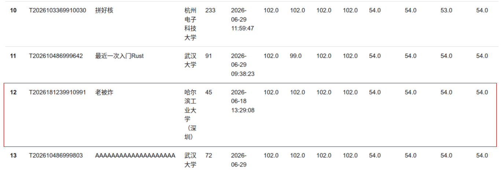
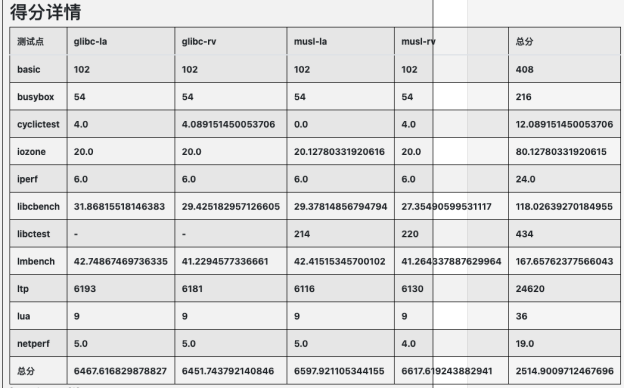
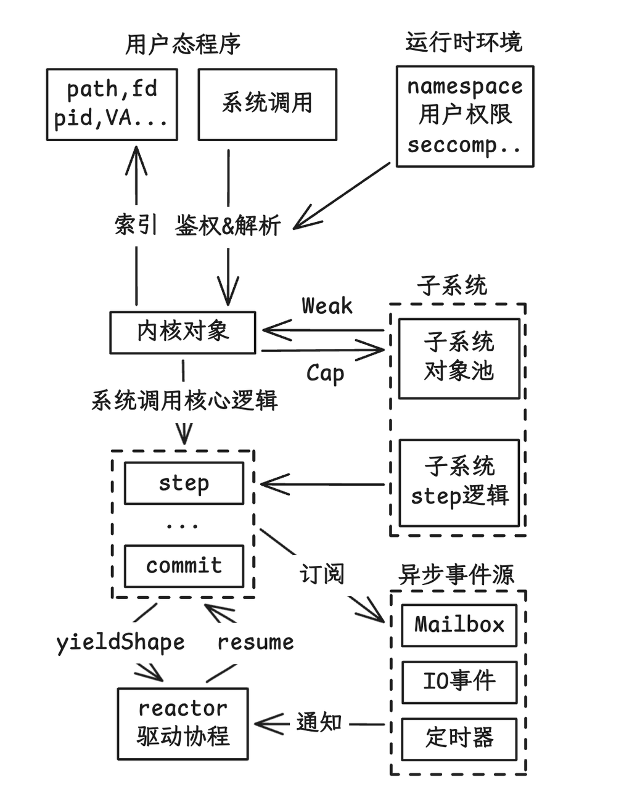

# txKernel

## 项目简介

- txKernel 是一个使用 Rust 实现、支持 RISC-V64 和 LoongArch64 硬件平台的多核操作系统内核。
- 执行模型采用**异步无栈协程**:每个线程是一个 future,由 reactor 调度,内核不为线程保留独立内核栈。
- 内核分为 **substrate(基座)** 与 **语义子系统** 两层;同一份内核源码经编译期平台选择即可在两种架构上运行,兼容 Linux ABI。

## 完成情况

### 排名情况

### 初赛情况

截至6月27日23点，TxKernel已经通过初赛的大部分测试点，在排行榜上排在第11位：



得分详情如下：



### 内核介绍

- **进程管理**：异步无栈协程、多核调度；进程 / 线程按 identity / payload 拆分；支持 fork / clone / exec / exit / wait。
- **内存管理**：映射的权威描述（recipe）与派生页表（pmap）分离、无锁并发；按需分页、写时复制、懒分配；物理页分配器 + 内核堆 + 对象池（zone）+ EBR 延迟回收。
- **文件系统**：统一文件身份 RNode + 多种后端；DEntry 路径缓存与挂载（含 bind / 传播）；页缓存与 mmap 共享同一物理页；支持 ext4，以及 tmpfs / procfs / devfs。
- **进程间通信**：信号（标准 + 实时）、管道、futex、System V IPC（信号量 / 消息队列 / 共享内存）、eventfd / signalfd / timerfd / epoll。
- **中断与异常**：统一 trap 路径，平台侧 / 内核侧两层 + TrapAction 跨架构复用；无栈协程上下文切换。
- **设备驱动**：virtio-blk / virtio-net、串口与 TTY（行规程）；静态设备模型 + 设备树（FDT）解析。
- **网络模块**：基于 smoltcp 的 TCP / UDP，支持 IPv4 / IPv6 与本地回环。
- **硬件抽象层**：axHal 风格的静态平台族，编译期选定平台，无运行时 HAL 管理器。
- **应用支持**：支持 busybox 等现实应用，通过 OSComp basic、libc-test、LTP 等测试。



### 文档

- [初赛技术报告](./TxKernel内核初赛文档.pdf)
- [项目开发简介幻灯片](./TxKernel初赛ppt.pdf)
- [演示视频] https://pan.baidu.com/s/1bsYjpYtcXR_GtTfcPMTy9g 提取码: 1234

### 项目结构

```
.
├── crates/             # 架构无关的内核 crate
│   ├── tx-substrate/       # 基座：对象池（zone）、EBR、索引、发布总线、帧、预留
│   ├── tx-reactor/         # 无栈协程 reactor 与调度
│   ├── tx-subsystems/      # 语义子系统：进程、内存、文件系统、IPC、网络、设备、信号
│   ├── tx-shims/           # Linux 系统调用语义与 ABI 适配
│   ├── tx-hal/             # 硬件抽象层
│   ├── tx-kernel/          # 内核装配：启动、trap 分发、初始化
│   ├── tx-drivers/         # virtio、串口 / TTY 驱动
│   ├── tx-ext4/  tx-fat/  tx-fs/   # ext4 / FAT 磁盘文件系统、tmpfs / procfs / devfs
│   └── ……
├── boards/             # 板级 HAL 与内核二进制 crate（RISC-V / LoongArch · qemu-virt）
├── xtask/              # 统一开发命令（构建 / QEMU / OSComp）
└── docs/               # 设计文档与开发记录
```

## 运行方式


### 编译

在项目根目录运行，同时构建 RISC-V64 与 LoongArch64 内核：

```bash
make all
```

### 运行

```bash
make oscomp-local-rv64     # 启动 RISC-V 内核并本地评测
make oscomp-local-la64     # 启动 LoongArch 内核并本地评测
```

## 项目人员

- 杨岩琰（队长）： 负责reactor设计，线程进程设计及VFS设计。
- 刘佳硕： 负责硬件抽象层设计、RISC-V 与龙芯设计，TTY设计。
- 孟书培： 负责网络栈设计、网络外设驱动设计。
- 指导老师：夏文，仇洁婷

## 参考

- **ArceOS**（[axhal](https://arceos.org/arceos/axhal/index.html)）—— 对其 axhal 进行修改实现了我们的硬件抽象层。
- **StarryOS**（[rsext4](https://github.com/Starry-OS/rsext4)）—— 抛弃其内部缓存，提取同步逻辑对其做了异步适配。
- **Asterinas**（[仓库](https://github.com/asterinas/asterinas)）—— 参考其网络栈设计。
- **《FreeBSD 操作系统设计与实现（第二版）》与 FreeBSD 内核代码** —— 最初的学习资源，提供了第一版内核架构参考，以及第二版内核的消息总线设计。
- **Chronix**（[仓库](https://gitlab.eduxiji.net/educg-group-36002-2710490/T202518123995568-675)）—— 无栈异步协程设计。
- **Linux**（[官网](https://www.kernel.org/)）—— 大量参考，系统调用功能的金标准。