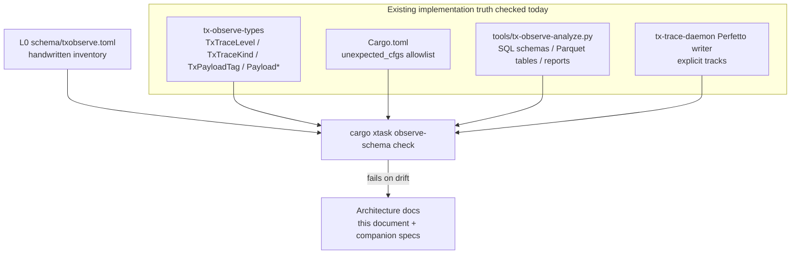
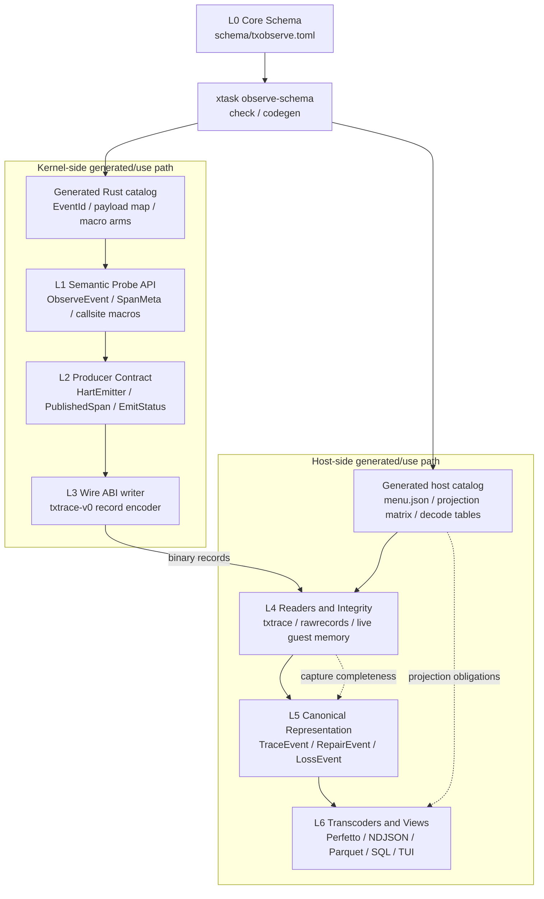
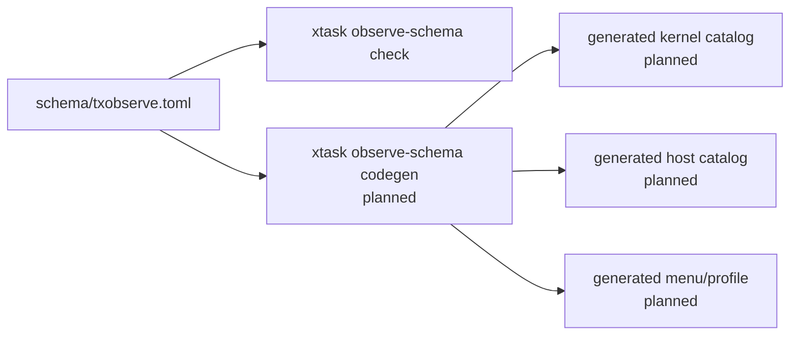
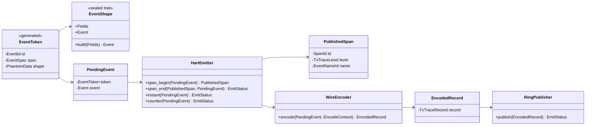
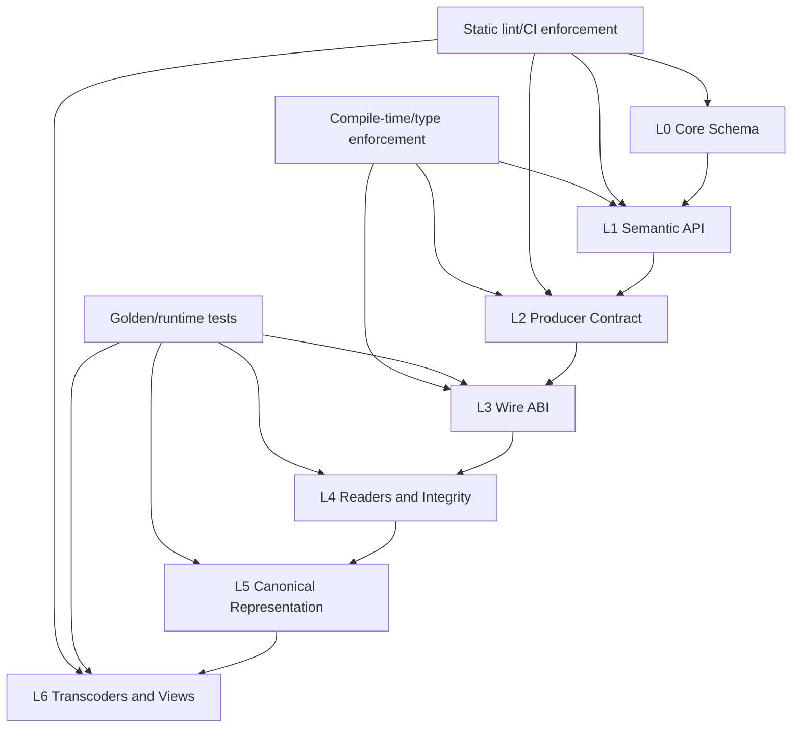

# Observation L0-L6 Refactor Design - v0

<!-- txdoc:TXV3-OBSERVATION-L0-L6-REFACTOR-V0 -->

**Status.** Architecture contract / staged refactor, 2026-07-11. L0 schema
inventory and the first schema check gate have landed. L1-L6 remain staged
migration targets unless explicitly marked as landed below. This document does
not by itself bump `txtrace-v0` or require a new record layout.
**Purpose.** Define the L0-L6 module boundaries for `tx-observe`, identify
which contracts are already mechanically checked, name which external systems
each layer borrows organizational discipline from, and give a staged migration
path from the current implementation.
**Audience.** Subsystem authors adding observation callsites, reviewers
evaluating trace ABI changes, and implementers of `tx-observe`,
`tx-observe-types`, `tx-trace-daemon`, `xtask observe`, and
`tools/tx-observe-analyze.py`.
**Companion documents.**
- [`08_OBSERVATION_v1.md`](08_OBSERVATION_v1.md) - current observation
  framework, hot-path invariants, hook surface.
- [`08_OBSERVATION_SERIALIZATION_v0.md`](08_OBSERVATION_SERIALIZATION_v0.md) -
  `txtrace-v0` wire format.
- [`08_OBSERVATION_HOST_v0.md`](08_OBSERVATION_HOST_v0.md) - daemon replay,
  reconstruction, repair markers, and Perfetto export.

## 1. Design Goal

<!-- txdoc:OBS-L0L6-GOAL-1 -->

The current observation stack already has the right high-level direction:
kernel emit sites write compact fixed-size records, host tools decode and
project those records, and semantic subsystem state remains authoritative.
The problem is that several contracts are still implicit:

- producers can still approach the wire layer too directly;
- begin/end span success is not represented as a typed capability;
- probe names, payload tags, analyzer tables, and projections can drift;
- host completeness and repair interpretation is split across tools;
- views can accidentally become de facto truth sources.

The L0-L6 refactor makes each contract explicit without changing the core
hot-path constraints:

- no allocation, blocking, or locking on the kernel producer path;
- fixed 80-byte records and 16-byte payloads unless a deliberate txtrace
  version bump is made;
- raw binary records are the source for decode, while NDJSON, Perfetto,
  Parquet, and SQL tables are derived views;
- trace evidence is diagnostic evidence, not semantic truth.

## 2. Target Topology

<!-- txdoc:OBS-L0L6-TOPOLOGY-1 -->

The refactor is now TOML-centered. `schema/txobserve.toml` is the only
handwritten L0 truth source. Kernel code, host readers, analyzer projections,
Perfetto routes, menuconfig-style frontends, and documentation tables are
expected to be generated from it or checked against it.

Current landing state:



The current `observe-schema check` gate validates the inventory against the
live tree:

```text
observe-schema check: ok (levels=8 record_kinds=11 payloads=23 payload_structs=20 cfgs=34 projections=9 tracks=16)
```

Target topology:



The handwritten source of truth is `schema/txobserve.toml`. Everything else is
generated from it or checked against it:

- kernel-facing Rust enums, event ids, payload maps, and macro arms;
- host-facing decode tables, TUI menu groups, and projection matrix rows;
- documentation tables;
- CI lint expectations.

The direction of dependency is intentionally narrow:

- kernel callsites depend on generated L1 macros or typed helpers, not raw
  payload bytes;
- L2 is the only kernel layer allowed to construct raw `TxTraceRecord`;
- L3 is the only layer allowed to define ABI structs and discriminants;
- L4 is the host reader layer and the only layer allowed to define capture
  completeness semantics;
- L5 is the only layer allowed to define canonical event representation;
- L6 views consume canonical events and integrity metadata, not ad hoc raw
  interpretations.

## 3. Borrowed Organization by Layer

<!-- txdoc:OBS-L0L6-BORROWED-ORG-1 -->

| Layer | Tx responsibility | Borrow organizational discipline from | What to borrow | What not to borrow |
|---|---|---|---|---|
| L0 Core Schema | Single handwritten `txobserve.toml`: levels, families, groups, events, payload mapping, controls, projections | Linux `TRACE_EVENT`, OpenTelemetry Semantic Conventions, CTF metadata | Central event definitions; stable field names; owner and version metadata; generated projection/control views | Multiple handwritten schema fragments; dynamic schema negotiation |
| L1 Semantic Probe API | Generated macros and typed helpers visible to kernel callsites | Linux tracepoints, Rust `tracing` spans/events | Callsites reference schema event ids and typed fields, not raw bytes; span/event vocabulary is stable and reviewable | Heap-backed dynamic fields; string formatting on the producer path |
| L2 Producer Contract | Bounded per-hart publish semantics | eBPF ringbuf reserve/submit/discard, ftrace per-CPU buffer commit discipline | Only a successful publish yields a handle that can be closed; drops are explicit; producer path remains non-blocking and per-hart | General-purpose ring allocation APIs; blocking backpressure; multi-producer locking |
| L3 Wire ABI | `txtrace-v0` record and payload layout | CTF/LTTng packet metadata, Perfetto protobuf schema discipline | Binary layout is governed with metadata, size assertions, and version rules; each payload tag has a typed struct | Self-describing variable-length payloads in the kernel hot path |
| L4 Host Readers and Integrity | Read `.txtrace`, `.rawrecords`, and live guest memory; compute completeness/loss | LTTng relay/session stats, Linux perf lost-sample reporting | Loss is first-class evidence with one interpretation shared by replay, live drain, and analyzer | Treating incomplete captures as fatal when tail samples are still useful |
| L5 Canonical Representation | Schema-guided raw records to canonical event stream | Babeltrace 2 component graph, Perfetto Trace Processor ingest | Decode once into a canonical stream, then project; repair/loss markers are stream events | Letting each exporter reimplement ABI decoding |
| L6 Transcoders and Views | Perfetto, NDJSON, Parquet, SQL, reports, TUI/control views | Perfetto SQL tables, DuckDB/Polars typed tables, exporter patterns from OTel | Views are projections with explicit coverage; query tables and menus are regenerated from schema/input | Making a derived table, `.pftrace`, or TUI manifest the source of truth |

Borrowing is intentionally architectural. `tx-observe` should not import these
systems' implementation models wholesale; it should copy the boundary
discipline that fits a small kernel hot path.

## 4. L0 Core Schema

<!-- txdoc:OBS-L0L6-L0-GOVERNANCE-1 -->

### Role

L0 owns the single handwritten schema:

- event families and event kinds;
- event levels and level compile gates;
- feature/control groups for menuconfig-style frontends;
- stable debug names and name owners;
- payload tags and field schemas;
- level membership (`Boundary`, `Drive`, `Yield`, `Step`, `Phase`,
  `Mutation`);
- projection obligations for each view.

Current pieces are spread across `TxPayloadTag`, payload structs, static
`debug.*` names, Perfetto routing, analyzer table derivation, and prose docs.
The target is one schema file that those pieces are generated from or checked
against.

### Borrowed Organization

Linux `TRACE_EVENT` provides the strongest local analogy: event shape is
declared centrally, callsites use the event, and tools can reason about fields.
OpenTelemetry Semantic Conventions provide the governance model for stable
names and owner-reviewed vocabulary. CTF metadata provides the binary-schema
contract: the stream format and event schema move together.

### Landed Schema Surface

`schema/txobserve.toml` is intentionally inventory-shaped first. It mirrors
the live implementation before generation becomes authoritative:

| TOML section | Current role | Checked today |
|---|---|---|
| `[schema]` | schema id, schema version, date, `txtrace-v0`, fixed record and payload sizes, and `hot_path_parse = false` | parseable TOML |
| `[sources]` | source-code and doc anchors used to audit the inventory | parseable TOML |
| `[[abi.levels]]` | `TxTraceLevel` discriminants, including `Sched` | exact Rust enum names and values |
| `[[abi.record_kinds]]` | `TxTraceKind` discriminants and canonical event class | exact Rust enum names and values |
| `[[payloads]]` | `TxPayloadTag`, payload struct, byte size, family, and field schema | exact tag values, struct fields, and asserted sizes |
| `[[enums]]` | semantic enum inventory used by payload fields | parseable TOML |
| `[[controls.groups]]` | menuconfig-style feature groups and their event families | referenced by event families |
| `[[controls.cfgs]]` | all observe-related `cfg` switches that may control generated menus/profiles | exact match against workspace `unexpected_cfgs` allowlist |
| `[[names.families]]` | stable `debug.*` name-family ownership and projection obligations | parseable TOML |
| `[[tracks.explicit]]` | explicit Perfetto/allocation tracks and stable track ids | exact const, id, and name match against daemon writer |
| `[[host.inputs]]` | accepted host input modes: `.txtrace`, `.rawrecords`, and live guest memory | parseable TOML |
| `[[host.projections]]` | NDJSON, Perfetto, text report, SQL views, and Parquet-derived table schemas | exact analyzer table columns for checked views |
| `[[event_families]]` | family-level level/payload/control/projection mapping | referenced ids exist |
| `[[migration.checks]]` | migration gates that document current and planned enforcement | parseable TOML |

The TOML schema is never parsed in the kernel hot path. The intended flow is:



The current gate is a check gate, not a generation gate. Generated Rust,
generated host catalog tables, generated menu JSON, and generated docs tables
are still planned follow-up work.

### Migration

1. **Landed:** inventory current `TxTraceLevel`, `TxTraceKind`,
   `TxPayloadTag`, payload structs, cfgs, analyzer typed tables, host inputs,
   explicit tracks, name families, and projection surfaces into
   `schema/txobserve.toml`.
2. **Landed:** add `cargo xtask observe-schema check` for current drift-prone
   surfaces.
3. **Next:** make `KERNEL_FNV1A_STABLE_NAMES` and every emitted event family
   concrete enough for generated name/event catalogs.
4. **Next:** generate Rust event ids, payload maps, and macro arms for kernel
   callsites.
5. **Next:** generate host decode/projection tables, menuconfig groups, and
   docs tables.
6. **Next:** mark existing projection gaps as `ignore(reason)` instead of
   silently missing them.
7. **Next:** add a lint that fails when a payload tag, event id, cfg, or
   projection view is added without schema coverage.

## 5. L1 Semantic Probe API

<!-- txdoc:OBS-L0L6-L1-SEMANTIC-API-1 -->

### Role

L1 is the API kernel callsites should use. It converts subsystem intent into
typed observation events before the producer sees them. A syscall boundary,
scheduler switch, lock metric, or DS method sample should be expressed as an
`ObserveEvent`, not as `(TxPayloadTag, &[u8])`.

### Borrowed Organization

Linux tracepoints show the callsite shape: a tracepoint has a semantic name and
typed fields, and the callsite does not know the final transport encoding.
Rust `tracing` provides the span/event split: spans represent intervals, events
represent instants or samples.

### Target Surface

```rust
pub struct EventToken<E: EventShape> {
    id: EventId,
    spec: &'static EventSpec,
    _shape: PhantomData<E>,
}

pub trait EventShape: private::SealedEventShape {
    type Fields;
    type Event;

    fn build(fields: Self::Fields) -> Self::Event;
}

pub enum ObserveEvent {
    SyscallEnter { sysno: u32, abi: AbiId, argc: u16 },
    SyscallExit { ret: i64, errno: i32, result: ResultKind },
    Counter { name: EventNameId, value: i64 },
    LockMetric { lock: EventNameId, metric: EventNameId, value: u64 },
    DsMethodMetric {
        method: EventNameId,
        zone: Option<EventNameId>,
        metric: EventNameId,
        value: u64,
    },
    SchedSwitch {
        task_id: u32,
        process_id: u32,
        kind: SchedKind,
        reason: SchedReason,
    },
}

pub struct SpanMeta {
    event: EventToken<SpanBeginShape>,
    pub parent: Option<SpanRef>,
}

pub struct LogFields {
    pub severity: LogSeverity,
    pub code: KernelLogCode,
    pub value0: u64,
    pub value1: u64,
}
```

Generated callsite macros or typed helpers hand out `EventToken<E>` values.
Callsites do not construct `EventId`, `EventSpec`, `TxPayloadTag`, or raw
payload bytes. The `EventShape` trait is sealed so only code generated from
`txobserve.toml` can define event shapes.

### Boundary Rule

Only L1/L2 code may translate `ObserveEvent` into `TxPayloadTag` and payload
bytes. Subsystem callsites must not construct raw payload byte slices.

The callsite boundary is token-shaped:

- callsites may hold `EventToken<E>` and event field structs;
- callsites may receive `PublishedSpan` from L2;
- callsites may not hold `SpanId`, `EventNameId` for trace names,
  `TxPayloadTag`, `Payload*`, or `TxTraceRecord`.

### Migration

1. Add typed wrappers around the existing producer calls, keeping raw APIs for
   transitional internal use.
2. Convert the highest-risk families first: span begin/end, scheduler events,
   counters, lock metrics, and DS method metrics.
3. Move raw `(TxPayloadTag, &[u8])` entry points behind crate-private or
   `#[doc(hidden)]` APIs.
4. Add an invariants lint that rejects direct raw payload construction outside
   the encoder/producer module and tests.

## 6. L2 Producer Contract

<!-- txdoc:OBS-L0L6-L2-PRODUCER-CONTRACT-1 -->

### Role

L2 owns the bounded publish contract over per-hart rings. It is the boundary
where lossy behavior becomes explicit. Callers should be able to tell whether a
record was published, dropped because the ring was full, dropped because
observation was disabled, or rejected by a reentry guard.

### Borrowed Organization

The eBPF ringbuf API is the main model: `reserve` either succeeds and returns a
handle that can be submitted/discarded, or it fails. No successful handle exists
for an unpublished event. ftrace's per-CPU buffer discipline is the secondary
model: one CPU/hart owns its buffer writes, and commit is explicit.

### Target Surface

```rust
pub struct PublishedSpan {
    id: SpanId,
    level: TxTraceLevel,
    name: EventNameId,
}

pub enum EmitStatus {
    Published,
    Dropped(DropReason),
}

pub enum DropReason {
    RingFull,
    Reentrant,
    Disabled,
    NoEmitter,
}

pub struct PendingEvent<E: EventShape> {
    token: EventToken<E>,
    event: E::Event,
}

impl HartEmitter {
    pub fn span_begin(
        &self,
        event: PendingEvent<SpanBeginShape>,
    ) -> Result<PublishedSpan, DropReason>;

    pub fn span_end(
        &self,
        span: PublishedSpan,
        event: PendingEvent<SpanEndShape>,
    ) -> EmitStatus;

    pub fn instant<E: InstantShape>(&self, event: PendingEvent<E>) -> EmitStatus;
    pub fn counter<E: CounterShape>(&self, event: PendingEvent<E>) -> EmitStatus;
}
```

`PendingEvent<E>` is the L1-to-L2 transfer type. It proves that the event came
from a generated schema token and carries the shape expected by that token.
`HartEmitter` does not accept a free-form `(EventId, ObserveEvent)` pair.

### Boundary Rule

`SpanId` is not a callsite capability. A caller may only end a span through the
`PublishedSpan` returned by a successful `span_begin`.

L2 is also where publish capability is created. `PublishedSpan` is returned
only after the begin record has been accepted by the producer path. If the
event is disabled, the emitter is missing, the ring is full, or reentry is
detected, no `PublishedSpan` exists for downstream child/end records.

### Migration

1. Change the internal emit path to produce an `EmitStatus` without changing
   `TxTraceRecord`.
2. Add `PublishedSpan` with private fields.
3. Introduce the new `span_begin -> Result<PublishedSpan, DropReason>` API.
4. Keep compatibility wrappers long enough to migrate callsites.
5. Add a lint that rejects naked `SpanId` close outside L2 and tests.

## 7. L3 Wire ABI

<!-- txdoc:OBS-L0L6-L3-WIRE-ABI-1 -->

### Role

L3 owns the physical binary contract: `TxTraceHeader`, `TxTraceHartRing`,
`TxTraceRecord`, `TxTraceKind`, `TxTraceLevel`, `TxPayloadTag`, and all
`Payload*` structs. This layer is intentionally small and conservative.

### Borrowed Organization

CTF/LTTng show the discipline to borrow: a binary stream has metadata, packet
layout, event schemas, and version rules. Perfetto protobuf schemas show the
same governance pressure on a different encoding: field addition and field
meaning are governed centrally.

### Boundary Rule

Only L3 defines ABI structs and discriminants. Only L2/L3 encoder code writes a
`TxTraceRecord`. Host tools decode L3 through canonical L5 decoders, not by
scattering new record readers.

The kernel writer boundary is encoded as an owned private wrapper:

```rust
pub struct EncodedRecord {
    record: TxTraceRecord,
}

pub struct WireEncoder;

impl WireEncoder {
    pub fn encode<E: EventShape>(
        event: PendingEvent<E>,
        context: EncodeContext,
    ) -> Result<EncodedRecord, EncodeError>;
}

pub trait RingPublisher {
    fn publish(&self, record: EncodedRecord) -> EmitStatus;
}
```

`EncodedRecord` owns the raw `TxTraceRecord`, but its field is private. Only the
ring publisher can consume it. This prevents callsites, L1 helpers, and L2
producer code from partially constructing a record, mutating payload bytes, or
publishing a mismatched `TxPayloadTag`.

### Required Invariants

- `size_of::<TxTraceRecord>() == 80`;
- inline payload capacity remains 16 bytes for `txtrace-v0`;
- all `Payload*` structs fit in the inline payload buffer;
- layout changes require a version rule and golden fixtures;
- unknown or malformed payloads become repair evidence, not undefined behavior.

### Migration

1. Keep `txtrace-v0` stable while tightening upper APIs.
2. Centralize all payload encoding/decoding behind typed functions.
3. Add compile-time size/alignment assertions for every payload type that lacks
   explicit coverage.
4. Add golden `.txtrace` or `.rawrecords` fixtures for normal, loss, counter,
   sched, and repair cases.
5. Consider `txtrace-v1` only for a real ABI need, such as payloads that cannot
   fit the 16-byte inline buffer.

### Kernel Typed Boundary Summary

| Layer | Input type | Output type | Raw ABI access |
|---|---|---|---|
| L1 semantic API | generated macro/helper fields | `PendingEvent<E>` or `SpanMeta` | no |
| L2 producer | `PendingEvent<E>`, `PublishedSpan` | `EmitStatus`, `PublishedSpan` | no direct record construction |
| L3 wire writer | `PendingEvent<E>`, `EncodeContext` | `EncodedRecord` | yes, private to encoder |
| Ring publisher | `EncodedRecord` | `EmitStatus` | writes record into ring |



## 8. L4 Host Readers and Integrity

<!-- txdoc:OBS-L0L6-L4-CAPTURE-INTEGRITY-1 -->

### Role

L4 is the host input boundary. It reads trace inputs and owns the meaning of
capture completeness. It separates three questions that are easy to conflate:

- what input was captured (`.txtrace`, `.rawrecords`, live guest memory);
- how many records were drained or retained;
- what loss, overwrite, framing repair, or late-attach evidence exists.

### Borrowed Organization

LTTng relay/session statistics and Linux perf lost-sample accounting both make
loss visible as data. That is the organization to borrow: a trace can be valid,
useful, and incomplete at the same time, but the incompleteness must have one
clear representation.

### Target Surface

```rust
pub trait TraceReader: private::SealedReader {
    fn integrity(&self) -> &TraceIntegrity;
    fn next_frame(&mut self) -> Result<Option<RawRecordFrame>, ReadError>;
}

pub enum TraceInputKind {
    TxTraceRegion,
    RawRecords,
    LiveGuestMem,
}

pub struct TraceInput {
    pub kind: TraceInputKind,
    pub path: PathBuf,
    pub schema_version: TxObserveSchemaVersion,
}

pub struct TraceIntegrity {
    pub input_kind: TraceInputKind,
    pub complete: bool,
    pub drained_records: u64,
    pub retained_records: u64,
    pub lost_records: u64,
    pub overwritten_records: u64,
    pub repair_count: u64,
}

pub struct RawRecordFrame {
    pub hart: u16,
    pub seq_hint: Option<u64>,
    bytes: [u8; 80],
}

impl RawRecordFrame {
    pub(crate) fn bytes_for_decode(&self) -> &[u8; 80] {
        &self.bytes
    }
}
```

### Boundary Rule

No CLI, analyzer, or exporter should independently define `complete`.
`runtime.json`, replay output, analyzer summaries, and Perfetto repair tracks
must agree because they read the same L4 integrity object.

L4 does not expose `TxTraceRecord` or raw payload fields to L6. The only layer
allowed to call `RawRecordFrame::bytes_for_decode()` is the L5 canonical
decoder module. Exporters receive no byte access path.

### Migration

1. Define `TraceInput` and `TraceIntegrity` in the host side shared layer.
2. Have `live-guest-mem`, replay, bundle, and analyzer output the same fields.
3. Preserve the raw-only hot path for long OSComp captures.
4. Add tests for complete captures, finite-ring tail samples, ring-full drops,
   overwritten live windows, and malformed-record repairs.

## 9. L5 Canonical Representation

<!-- txdoc:OBS-L0L6-L5-CANONICAL-DECODE-1 -->

### Role

L5 is the canonical host representation. It is the only layer that turns L4
inputs plus the generated schema into normalized events. It should preserve raw
record evidence, attach decoded payloads, and represent repair or loss as
events in the same stream.

### Borrowed Organization

Babeltrace 2 provides the useful model: input components decode a stream once,
then output components consume a normalized event stream. Perfetto Trace
Processor provides the database-oriented version: ingest once into typed event
tables, then query or export.

### Target Surface

```rust
pub struct DecodeBatch<R: TraceReader> {
    reader: R,
    catalog: &'static TxObserveHostCatalog,
}

pub enum TraceEvent {
    Record(RecordEvent),
    Span(SpanEvent),
    Counter(CounterEvent),
    Repair(RepairEvent),
    Loss(LossEvent),
}

pub struct TraceEventStream {
    events: Vec<TraceEvent>,
    integrity: TraceIntegrity,
}

impl TraceEventStream {
    pub fn events(&self) -> &[TraceEvent] {
        &self.events
    }

    pub fn integrity(&self) -> &TraceIntegrity {
        &self.integrity
    }
}

pub trait TraceDecoder {
    fn decode<R: TraceReader>(
        &mut self,
        batch: DecodeBatch<R>,
    ) -> Result<TraceEventStream, DecodeError>;
}

pub struct RecordEvent {
    pub event_id: EventId,
    pub spec: &'static EventSpec,
    pub hart: u16,
    pub seq: u64,
    pub timestamp: u64,
    pub payload: DecodedPayload,
    raw_ref: RawRecordRef,
}

pub struct RawRecordRef {
    hart: u16,
    seq: u64,
}
```

### Boundary Rule

Perfetto, NDJSON, Parquet, and SQL must consume canonical events. They may not
each implement their own interpretation of malformed payloads, repair sorting,
span reconstruction, or loss accounting.

The L5 stream exposes decoded facts and integrity, not raw bytes. `RawRecordRef`
is an evidence locator for diagnostics; it is not a handle to `TxTraceRecord`.
This lets L6 point back to the source record without reopening the ABI layer.

### Migration

1. Name the current replay/decode result as the first canonical event shape.
2. Move repair and loss markers into the event stream rather than treating them
   as side-band counters.
3. Make decode schema-guided: event ids, payload tags, and projection coverage
   come from generated host catalog tables.
4. Teach exporters to consume the stream instead of raw decoded records.
5. Add fixture tests that compare event counts and repair/loss semantics across
   replay, analyzer, and Perfetto export.

## 10. L6 Transcoders and Views

<!-- txdoc:OBS-L0L6-L6-VIEWS-1 -->

### Role

L6 owns all derived presentation, export, and control views:

- Perfetto timeline;
- NDJSON debug stream;
- Parquet derived tables;
- DuckDB/SQL views;
- text reports and Python hooks;
- menuconfig-style TUI views generated from the same schema.

### Borrowed Organization

Perfetto SQL tables show the right query boundary: ingest once, expose typed
tables. DuckDB/Polars show the right local analysis shape: compact typed
tables, regenerated from source inputs. Exporter patterns from OpenTelemetry
are useful only for the idea that each exporter has declared coverage.

### Projection Coverage Matrix

Each event kind must declare one of the following per view:

| Rule | Meaning |
|---|---|
| `emit` | The view directly renders the event. |
| `derive` | The view contributes the event to a derived interval/table/metric. |
| `ignore(reason)` | The view intentionally omits the event with a documented reason. |

Example rows:

| Event family | Perfetto | NDJSON | Parquet/SQL | Text analyzer |
|---|---|---|---|---|
| Span begin/end | derive slices | emit | derive `spans` | derive latency reports |
| Counter | emit counter sample | emit | derive `counters` | derive family reports |
| Sched switch | emit sched track | emit | derive `sched_intervals` | derive scheduling summary |
| Lock metric | emit or ignore(reason) | emit | derive `lock_rows` | derive lock report |
| DS method metric | emit or ignore(reason) | emit | derive `ds_method_rows` | derive DS method report |
| Repair/loss | emit damage marker | emit | derive `repairs` | summarize integrity |

### Boundary Rule

L6 outputs are caches, presentations, or control frontends. If decoder logic or
schema changes, Parquet, NDJSON, Perfetto, text summaries, and TUI menu trees
must be regenerated from the core schema and binary inputs. A TUI profile may
reference schema ids, but it must not define event schema.

L6 receives a typed projection input, never a reader and never a raw record:

```rust
pub struct ProjectionInput<'a> {
    pub stream: &'a TraceEventStream,
    pub catalog: &'static TxObserveHostCatalog,
    pub projection: &'static ProjectionSpec,
}

pub trait TraceTranscoder {
    type Output;

    fn transcode(&mut self, input: ProjectionInput<'_>) -> Result<Self::Output, TranscodeError>;
}
```

`ProjectionInput` makes the layer boundary part of the signature. A Perfetto,
NDJSON, Parquet, SQL, analyzer, or TUI module cannot ask for `TraceReader`,
`RawRecordFrame`, `TxTraceRecord`, `TxPayloadTag`, or `Payload*` without
violating the public API and the host-boundary lint.

### Typed Boundary Summary

| Layer | Input type | Output type | Raw byte access |
|---|---|---|---|
| L4 readers | `TraceInput` | `RawRecordFrame`, `TraceIntegrity` | yes, private to reader |
| L5 canonical | `DecodeBatch<TraceReader>` | `TraceEventStream` | yes, via `bytes_for_decode()` only |
| L6 transcoders/views | `ProjectionInput<'_>` | view-specific output | no |

```mermaid
classDiagram
  direction LR

  class TraceInput {
    +TraceInputKind kind
    +PathBuf path
    +TxObserveSchemaVersion schema_version
  }

  class TraceReader {
    <<sealed trait>>
    +integrity() TraceIntegrity
    +next_frame() RawRecordFrame
  }

  class RawRecordFrame {
    +u16 hart
    +Option~u64~ seq_hint
    -[u8; 80] bytes
    +bytes_for_decode() &[u8; 80]
  }

  class DecodeBatch {
    -TraceReader reader
    -TxObserveHostCatalog catalog
  }

  class TraceEventStream {
    -Vec~TraceEvent~ events
    -TraceIntegrity integrity
    +events() &[TraceEvent]
    +integrity() TraceIntegrity
  }

  class ProjectionInput {
    +TraceEventStream stream
    +TxObserveHostCatalog catalog
    +ProjectionSpec projection
  }

  class TraceTranscoder {
    <<trait>>
    +transcode(ProjectionInput) Output
  }

  TraceInput --> TraceReader
  TraceReader --> RawRecordFrame
  RawRecordFrame --> DecodeBatch
  DecodeBatch --> TraceEventStream
  TraceEventStream --> ProjectionInput
  ProjectionInput --> TraceTranscoder
```



### Migration

1. Generate the initial projection matrix and menu tree from
   `schema/txobserve.toml`.
2. Fill obvious gaps, starting with event families that are already decoded but
   not represented in a view.
3. Tie Parquet cache keys to input content and analyzer decoder version.
4. Add coverage tests so a new event kind cannot land without declared view
   behavior.

## 11. Enforcement Topology

<!-- txdoc:OBS-L0L6-ENFORCEMENT-1 -->



Enforcement is deliberately layered. The current landed gate is the L0 schema
check; the remaining gates are staged so the tree can migrate without a
`txtrace-v1` ABI bump.

### Landed Gate

```text
cargo xtask observe-schema check
```

The gate reads `schema/txobserve.toml` and compares it with live implementation
truth:

| Surface | Compared against | Current enforcement |
|---|---|---|
| ABI levels | `crates/tx-observe-types/src/record.rs::TxTraceLevel` | exact names and discriminants |
| record kinds | `crates/tx-observe-types/src/record.rs::TxTraceKind` | exact names and discriminants |
| payload tags | `crates/tx-observe-types/src/payload.rs::TxPayloadTag` | exact names and discriminants |
| payload structs | `payload.rs` plus size assertions in `tx-observe-types/src/lib.rs` | field lists and byte sizes |
| cfg switches | root `Cargo.toml` `unexpected_cfgs` allowlist | exact cfg coverage |
| host projections | `tools/tx-observe-analyze.py` SQL/Parquet schemas | checked view/table columns |
| explicit tracks | `tools/tx-trace-daemon/src/perfetto/writer.rs` | stable track consts, ids, and names |

### Planned Gates

| Gate | Layers protected | What it prevents |
|---|---|---|
| generated kernel catalog | L0 -> L1 | callsites inventing event ids, names, payload tags, or macro arms |
| `EventToken<E>` / sealed `EventShape` | L1 -> L2 | subsystem code constructing schema-less events |
| `PublishedSpan` | L2 span lifecycle | closing spans that were never published |
| private `EncodedRecord` | L2 -> L3 | partial or mismatched raw record construction outside the encoder |
| host `TraceReader` / `TraceEventStream` / `ProjectionInput` | L4 -> L5 -> L6 | exporters reopening raw bytes or redefining completeness |
| topology lints | all boundaries | direct `TxPayloadTag`, `Payload*`, `TxTraceRecord`, raw name hashing, or raw reader use in the wrong layer |
| golden fixtures | L3 -> L6 | silent decode, repair, integrity, or projection drift |

The rule is that type boundaries should block local misuse, static lints should
block cross-module topology leaks, and fixtures should prove that valid binary
inputs still decode and project the same way.

## 12. Current Gap Map

<!-- txdoc:OBS-L0L6-CURRENT-GAP-MAP-1 -->

| Layer | Current landing state | Gap size | Next boundary to tighten |
|---|---|---|---|
| L0 Core Schema | `schema/txobserve.toml` exists and `observe-schema check` validates ABI levels, record kinds, payloads, cfgs, projections, and explicit tracks | small-medium | enumerate stable event/name catalog fully enough for generation |
| L1 Semantic Probe API | existing callsites still mostly use `tx_observe::emit_*` helpers and raw-ish name/payload concepts | large | introduce generated `EventToken<E>`, sealed event shapes, and typed macro/helper wrappers |
| L2 Producer Contract | per-hart bounded emitter exists, but status and span-close capability are not yet fully typed | medium | add `EmitStatus`, `DropReason`, and private-field `PublishedSpan` |
| L3 Wire ABI | `txtrace-v0` structs are stable and size-checked; schema inventory now covers payload fields | small-medium | centralize encode/decode through `WireEncoder` and private `EncodedRecord`; add golden raw fixtures |
| L4 Host Readers and Integrity | live guest memory, rawrecords, and txtrace replay exist; completeness semantics are still scattered across runtime output and tools | medium | introduce shared `TraceInput` and `TraceIntegrity` object consumed by daemon/analyzer/bundle paths |
| L5 Canonical Representation | replay/analyzer decode exists but is not yet a single canonical event stream boundary | large | promote repair/loss/span reconstruction into `TraceEventStream` |
| L6 Transcoders and Views | Perfetto, NDJSON, text report, SQL, and Parquet views exist; projection schemas are now inventoried and partly checked | medium-large | route all exporters through `ProjectionInput` and generated projection specs |

## 13. Migration Plan

<!-- txdoc:OBS-L0L6-MIGRATION-1 -->

The migration should land in small slices:

1. **Core schema inventory.** Landed: `schema/txobserve.toml` inventories
   current ABI levels, record kinds, payload tags, payload field schemas,
   cfg/control groups, name families, explicit tracks, host inputs,
   projections, and event-family mappings. No runtime behavior change.
2. **Schema check gate.** Landed: `xtask observe-schema check` validates the
   highest-drift L0 surfaces against live Rust/Python/daemon sources.
3. **Stable name/event catalog closure.** Next: make every raw
   `EventNameId::from_raw(fnv1a32(...))`, `KERNEL_FNV1A_STABLE_NAMES` entry,
   and event-family mapping concrete enough for codegen.
4. **Schema codegen.** Next: add `xtask observe-schema codegen --check` so
   generated Rust, host catalog, menu JSON, docs tables, and projection matrix
   cannot drift.
5. **Typed semantic wrappers.** Add L1 `ObserveEvent` and wrappers for the main
   event families while keeping compatibility shims.
6. **Producer status.** Teach L2 emit to return `EmitStatus`; introduce
   `PublishedSpan` and migrate span begin/end callsites.
7. **Wire centralization.** Move all payload encoding/decoding through typed
   L3 functions and add missing assertions/fixtures.
8. **Reader and integrity unification.** Add L4
   `TraceInput`/`TraceIntegrity` and use it in `live-guest-mem`, replay,
   bundle, and analyzer summaries.
9. **Canonical representation.** Promote current decoded records and repair
   markers to the L5 stream consumed by exporters.
10. **Projection and TUI hardening.** Make L6 coverage matrix and menu grouping
   mandatory for new event families and close known missing view routes.
11. **Boundary lints.** Convert transitional warnings into CI failures only
   after callsites have migrated.

Do not start with a `txtrace-v1` ABI bump. Most current risk is contract drift
above the wire format, not a defective 80-byte record.

## 14. Review Checklist

<!-- txdoc:OBS-L0L6-REVIEW-CHECKLIST-1 -->

For any observation change, reviewers should ask:

- Which L0 TOML schema entry owns the event name, payload tag, control group,
  and projection coverage?
- Does the callsite use L1 semantic events instead of raw payload bytes?
- If a span is opened, can it only be closed through a published span handle?
- Does any change to L3 layout preserve `txtrace-v0` size and compatibility, or
  explicitly propose a version bump?
- Does capture completeness use L4 integrity fields rather than local CLI
  interpretation?
- Does decode produce canonical L5 repair/loss events through the generated host
  catalog?
- Does every L6 view and TUI group derive from schema rather than maintaining a
  private manifest?

## 15. Open Questions

<!-- txdoc:OBS-L0L6-OPEN-QUESTIONS-1 -->

1. Whether `PublishedSpan` should be linear by convention only, or whether a
   stronger type pattern is worth the ergonomic cost in no-std kernel code.
2. Whether canonical L5 decode belongs in `tools/tx-trace-daemon` only, or a
   small shared host crate used by both daemon and Python analyzer.
3. Whether generated Rust artifacts should be committed or generated into
   `OUT_DIR` with a `codegen --check` CI gate.
4. Which projection gaps should be closed before the boundary lints become
   hard CI gates.
