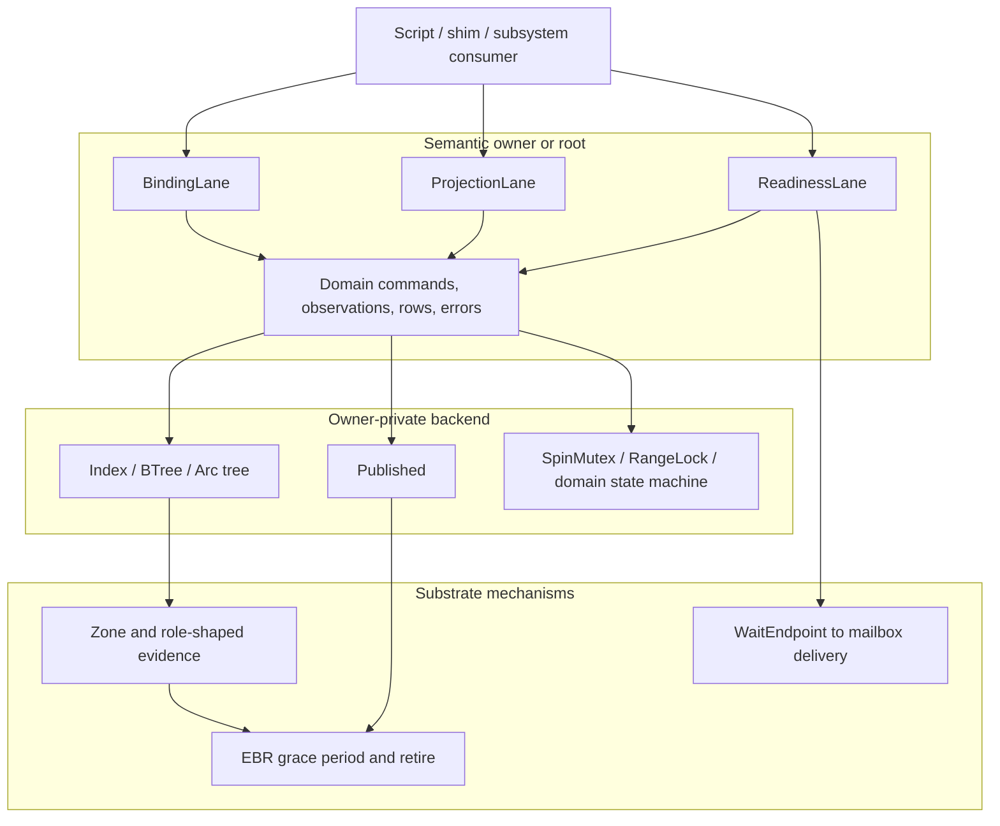

# Object API Lanes and Publication Boundary - v1

<!-- txdoc:OBJECT-API-LANES-V1 -->

**Status.** Draft v1 for interface review. The three-layer boundary and the
three shared lane families are accepted; exact Rust spelling and physical
placement remain under review before implementation begins.

**Purpose.** Define the limited language through which scripts, shims, views,
and other subsystems interact with semantic owner/root objects. Keep domain
meaning at the owner, keep storage replaceable, keep zone policy and RCU
mechanics below the semantic API, and keep wake delivery distinct from truth.

**Companion documents.**

- [`01_CONCEPTS_v5.md`](../../Txv3/01_CONCEPTS_v5.md) - publication cell,
  planes, and architectural homes;
- [`02_INVARIANTS_v5.md`](../../Txv3/02_INVARIANTS_v5.md) - canonical
  `LANE-*`, `WIT-*`, `YIELD-*`, `EBR-*`, and `ZONE-*` rules;
- [`object_model_v2.md`](object_model_v2.md) - entities, bindings,
  obligations, evidence, and projections;
- [`SUBSYSTEM_ANATOMY_v2_1.md`](SUBSYSTEM_ANATOMY_v2_1.md) - checks,
  execution, structure, projection, and five-stage commit discipline;
- [`EBR_ZONE_INTERFACE_v1.md`](../01_substrate/EBR_ZONE_INTERFACE_v1.md) -
  role-shaped references, zone allocation, and observer-node policy.

---

## 1. Decision

<!-- txdoc:OBJECT-API-LANES-DECISION-1 -->

Semantic owner/root objects compose a small set of **lane interfaces**. A lane
names what an upper caller is allowed to do; it does not name the data
structure or reclamation mechanism used to do it.

The shared lane catalog is:

1. `BindingLane` - observe and change authoritative bindings;
2. `ProjectionLane` - derive read-only rows or views;
3. `ReadinessLane` - query level readiness and obtain opaque wait endpoints.

The following are deliberately not peer lanes:

- identity and retention are expressed by `Cap<T>`, `Weak<T>`,
  `IdentRef<'g, T>`, `PayloadCap<T>`, and `T::OperationalEvidence`;
- reservation is the linear prepare phase of a binding change;
- publication is an owner-private storage mechanism and commit boundary;
- stable-ID allocation is a domain-specific binding policy;
- RCU is one implementation of publication, not an upper API language;
- mailbox and EBR are substrate mechanisms, not semantic owner traits.

An owner implements only the lanes it supports. There is no universal
`DomainObject`, generic CRUD object, `StorageBackend`, `EpochReadable`, or
`ReclaimableOwner` trait.

## 2. Three Layers

<!-- txdoc:OBJECT-API-LANES-LAYERS-1 -->



The layers have one-way knowledge:

- callers know lane contracts and domain types;
- owners know their private storage and the substrate primitives they compose;
- substrate knows atomicity, allocation, retention, epochs, and delivery, but
  never process, VM, VFS, mount, socket, or IPC meaning.

Changing an owner from `SpinMutex<BTreeMap<...>>` to `Published<Tree>` must not
change its lane implementation or any caller import.

## 3. Lane Placement And Export Rule

<!-- txdoc:OBJECT-API-LANES-PLACEMENT-1 -->

Lane vocabulary is architectural, but Rust traits live at the lowest common
semantic consumer, not automatically in `tx-substrate`.

| Surface | Placement | May mention |
|---|---|---|
| Shared lane contract | common subsystem/facade API | `Guard`, role-shaped evidence, domain query/change/row types |
| Domain lane implementation | owning subsystem outer/root module | private structures and substrate primitives |
| Publication primitive | `tx-substrate` publication module | atomics, EBR, writer serialization, fallible pre-publication allocation |
| Wait endpoint primitive | wake/mailbox substrate | source registration and mailbox delivery |
| Shim adapter | shim facade | lane methods and domain results only |

A Rust trait is justified when a cross-subsystem or cross-crate consumer needs
one contract. Domain-only variations use associated domain types or inherent
helpers behind the outer implementation; they do not add a new global lane.

Lane traits are owner implementation contracts, not capabilities handed to
arbitrary upper callers. Upper modules do not accept a broad
`&impl BindingLane` merely to call one operation. The owner facade narrows the
surface by concern:

```text
owner/root implements lanes
    -> checks facade exposes require/resolve operations
    -> execution facade exposes domain changes and reservations
    -> project facade exposes structured rows
    -> wait facade exposes owned readiness reports
```

This is distinct from runtime read-only authority. A read-only mount or
filesystem still has a binding owner; its domain reserve path returns `EROFS`
after mount/backend authority checks. Trait absence does not model dynamic
mount flags, open modes, remount, or subject authority.

Public facades must not re-export:

- concrete tree, map, slab, or observer-node types;
- `AtomicPtr`, raw pointers, or `epoch::retire_raw`;
- spin-lock guards or backend mutation guards;
- policy-parameterized zones;
- substrate `IndexReservation` or zone observer-node reservations;
- raw `WaitSourceId`, `WaitSource`, channel, or mailbox registration tables.

## 4. BindingLane

<!-- txdoc:OBJECT-API-LANES-BINDING-1 -->

`BindingLane` is the authoritative semantic lane. It covers point lookup,
range lookup, install, replacement, withdrawal, and allocation-backed binding
changes without pretending that every owner is a generic map.

The conceptual Rust shape is:

```rust
pub trait BindingLane {
    type Query: ?Sized;
    type Change;
    type Observation<'g>
    where
        Self: 'g;
    type Reservation<'a>: BindingCommit<Receipt = Self::Receipt>
    where
        Self: 'a;
    type Receipt;
    type Error;

    fn observe<'g>(
        &'g self,
        guard: &'g Guard<'_>,
        query: &Self::Query,
    ) -> Result<Self::Observation<'g>, Self::Error>;

    fn reserve<'a>(
        &'a self,
        change: Self::Change,
    ) -> Result<Self::Reservation<'a>, Self::Error>;
}

pub trait BindingCommit {
    type Receipt;

    fn commit(self) -> Self::Receipt;
}
```

This is an outer semantic contract. It does not require substrate reservation
families to implement a common trait. The outer reservation may aggregate a
zone reservation, index reservation, credit reservation, publication
reservation, and domain conflict guard while keeping all concrete token types
private.

### 4.1 Observation

<!-- txdoc:OBJECT-API-LANES-BINDING-OBSERVE-1 -->

The caller creates and owns the `Guard`. The lane receives it so one guard can
cover a multi-hop binding walk. The lane must not create a hidden nested guard.

`Observation<'g>` is domain-shaped. It may be:

- a witness carrying `IdentRef<'g, T>`;
- a binding view borrowing a `BindingValue`;
- an optional domain row;
- a copied scalar or version token;
- a role-shaped retained value when the binding obligation already stores one.

It must not expose a published root, container node, lock guard, or raw zone
slot. Observation does not silently upgrade retention. If an operation needs
to cross a step or yield boundary, execution explicitly upgrades to `Cap<T>`
or `T::OperationalEvidence` before the guard is dropped.

### 4.2 Change And Reservation

<!-- txdoc:OBJECT-API-LANES-BINDING-RESERVE-1 -->

`Change` is domain-specific, for example `VmRecipeChange`, `FdBindingChange`,
`MountChange`, or `IpcIdChange`. It is not a generic `Insert/Update/Delete`
enum. A change owns every value that must survive until commit:

- retained evidence matching the destination binding obligation;
- copied keys, ranges, flags, and generation/version scalars;
- domain authorization results that are valid through the commit point.

It cannot contain `IdentRef<'g, T>`, witnesses, `Guard`, or borrowed backend
nodes. If current-state validation is required, `reserve` revalidates it while
acquiring the semantic conflict domain.

Reservation may fail because of duplicate keys, missing bindings, conflict,
capacity, quota, stale version, or pre-publication node-allocation exhaustion.
The latter is not retire capacity: intrusive enqueue allocates nothing after
the visibility boundary. Drop rolls back every acquired resource. A successful
reservation guarantees that `commit` is infallible and bounded.

`Receipt` reports committed semantic facts needed by later publish or return
stages. It must not expose the reservation or backend guard.

### 4.3 Stable ID Allocation

<!-- txdoc:OBJECT-API-LANES-BINDING-ID-1 -->

PID, fd, mount ID, socket ID, and IPC ID allocation are binding policies, not
a global lane. An owner may add domain commands such as `ReserveAny`,
`ReserveAt`, or `ReplaceAt`, but their reuse, ordering, namespace, and quota
rules remain in the owner. Generic bitmap or index reservations remain private
backend choices.

## 5. ProjectionLane

<!-- txdoc:OBJECT-API-LANES-PROJECTION-1 -->

`ProjectionLane` describes current state for procfs, sysfs, diagnostics,
enumeration, snapshots, and structured inspection. It does not authorize an
operation and does not promise that a row remains valid after observation.

```rust
pub trait ProjectionLane {
    type Query: ?Sized;
    type Row<'g>
    where
        Self: 'g;
    type Rows<'g>: IntoIterator<Item = Self::Row<'g>>
    where
        Self: 'g;
    type Error;

    fn project<'g>(
        &'g self,
        guard: &'g Guard<'_>,
        query: &Self::Query,
    ) -> Result<Self::Rows<'g>, Self::Error>;
}
```

Rows may be owned values or guard-scoped `ProjectionRef<'g, T>` values. Text
rendering is outside the lane: procfs/sysfs adapters render structured rows.
Projection must be read-only, side-effect-free, non-authorizing, and free of
mailbox registration.

`BindingLane::observe` and `ProjectionLane::project` are intentionally
different:

- binding observation participates in semantic resolution and obligations;
- projection describes state and cannot be consumed as a witness;
- a projection row never substitutes for a fresh binding observation.

## 6. ReadinessLane

<!-- txdoc:OBJECT-API-LANES-READINESS-1 -->

`ReadinessLane` answers two questions together: what is ready now, and which
object-owned endpoints can announce that a re-query may produce a different
answer.

```rust
pub trait ReadinessLane {
    type Query: ?Sized;
    type Mask;
    type Role;
    type Error;

    fn query_readiness<'g>(
        &'g self,
        guard: &'g Guard<'_>,
        query: &Self::Query,
    ) -> Result<ReadinessReport<Self::Mask, Self::Role>, Self::Error>;
}
```

The report is owned with respect to `'g`: it may retain opaque endpoint
handles, masks, roles, and stable registration metadata, but it must not borrow
the guard, an `IdentRef`, a published root, or a backend node. The caller drops
the guard before mailbox installation or yield. A fresh guard is used for the
post-subscription re-query.

`ReadinessReport` has private endpoint storage. Its public operations expose:

- the current level-ready mask;
- whether the object supports registration for the requested mode;
- installation into the existing mailbox wait protocol;
- endpoint roles needed by a facade to translate domain masks.

It does not expose raw source IDs, concrete `WaitSource`, registry operations,
or a second endpoint-set abstraction. Mailbox M:N subscription remains the
fanout mechanism. Epoll translates its poll mask to the owner's readiness
query, installs the report's endpoints, and re-runs the same query after wake.

Objects may retain domain-named endpoint accessors internally, such as read,
write, exit, completion, or hangup. Cross-subsystem consumers prefer
`ReadinessLane`; direct semantic waits may consume the existing narrow
`WaitEndpoint` contract when no readiness query exists.

## 7. Upper-Layer Interaction Rules

<!-- txdoc:OBJECT-API-LANES-UPPER-INTERACTION-1 -->

| Caller/module | Allowed owner-facade interaction | Forbidden interaction |
|---|---|---|
| `checks/` | `require_*` / `resolve_*` facade; construct witnesses | receive a mutable/broad lane object; reserve, commit, publish |
| `execution/` | consume evidence; build domain change; call owner reserve/commit facade | raw container mutation, hidden guard creation |
| `project.rs` | owner projection facade; render structured rows | authorization, mutation, wait installation |
| wait/driver facade | guarded readiness query; install owned report | treating wake as truth, inspecting raw source IDs |
| scripts | sequence checks and execution facades across owners | access lane implementations or owner-private structures |
| shims | translate ABI values to domain facade inputs/results | import lane traits, zone, EBR, RCU, mailbox, or index mechanics |
| other subsystems | consume the owning facade and role-shaped results | receive broad lane objects or reach into storage modules |

An upper operation follows the existing five stages:

1. **Observe:** the script/check creates one guard and calls binding lanes.
2. **Upgrade:** guard-scoped observations become retained evidence if needed.
3. **Reserve:** execution passes owned domain changes to owner lanes.
4. **Commit:** each outer reservation installs one visibility boundary.
5. **Publish:** the owner fires declared attachments after visibility.

The lane split does not create a second step algebra. It gives each existing
step stage a narrow owner-facing interface.

## 8. Three Runtime Paths

<!-- txdoc:OBJECT-API-LANES-THREE-PATHS-1 -->

### 8.1 Authoritative mutation path

```text
observe under Guard
  -> upgrade obligation evidence
  -> build domain Change
  -> outer reserve
  -> infallible commit / visibility boundary
  -> publish attachments
  -> return Receipt
```

The owner may serialize writers with a lock or reservation while readers use
RCU. Writer serialization is not part of the lane contract.

### 8.2 Guarded observation path

```text
caller-owned Guard
  -> BindingLane::observe or ProjectionLane::project
  -> Published<T>::read or private locked/index traversal
  -> domain observation / row
  -> explicit upgrade or drop before step/yield boundary
```

The same lane may be backed by a lock today and RCU tomorrow. The returned
domain type and its lifetime do not change.

### 8.3 Wake and retry path

```text
query readiness
  -> prepare mailbox subscription from report endpoints
  -> recheck readiness
  -> install or cancel prepared subscription
  -> yield
  -> mailbox hint
  -> fresh Guard and fresh query
```

The endpoint never carries an `IdentRef`, projection row, published root, or
semantic result. Wake is a hint that closes a lost-wakeup protocol; it is not
the state transition or evidence of readiness.

## 9. Data Structures And Zone

<!-- txdoc:OBJECT-API-LANES-DATA-ZONE-1 -->

Zone classification follows semantic shape, not container topology:

| Shape | Storage | Public language |
|---|---|---|
| Semantic entity | `Zone<T>` with hidden entity policy | `Cap`, `Weak`, `IdentRef`, operational evidence |
| `BindingValue` | by value in authoritative container | domain binding/observation |
| `StaticFact` | static table/reference | `&'static T` or typed static handle |
| `ObserverNode` | private `Box`/`Arc` or observer-node zone | none |
| Published snapshot root | owned by `Published<T>` | owner-private guarded read |

A tree does not become a semantic object graph merely because it allocates
nodes. Tree and index nodes must not acquire `Cap<Node>`, `Weak<Node>`, public
identity, or domain endpoint APIs.

An owner may choose among three private node strategies:

1. immutable `Box`/`Arc` nodes retired with the published root;
2. structurally shared `Arc` nodes with EBR retirement of old roots;
3. observer-node zones for intrusive or node-granular EBR storage.

The third strategy is an optimization, not an RCU prerequisite. Migrating a
container to RCU must not require a simultaneous allocator or node-layout
rewrite.

Lock replacement uses four private implementation families. They do not add
four new owner lanes or caller-visible type families:

| Replacement family | Replaces | Retains |
|---|---|---|
| published root | lock-held observation of immutable binding/index versions | owner writer serialization and semantic reservations |
| single-binding publication | lock-backed `Option<Cap/Weak/PayloadCap>` and staging single slots | lifecycle transition and revocation checks |
| per-entry atomic/state cell | hot resident/generation/flag observations | multi-step state-machine serialization |
| manager/reservation synchronization | no RCU replacement | queues, completions, range conflicts, protocol state |

An owner chooses the narrowest family that preserves its semantics. A queue,
completion graph, dirty/writeback transition, or protocol state machine does
not become a published root merely because its current implementation is
stored beside a replaceable index under one lock.

Binding values stored in an RCU snapshot carry evidence according to their
obligation:

- resolution-only stores `Weak<T>` or no evidence;
- addressability stores `Cap<T>`;
- operational stores `T::OperationalEvidence`.

Retiring an old snapshot delays dropping its stored evidence until the grace
period. This extends physical retention for pre-commit readers without keeping
the withdrawn binding visible to readers that load the new root.

RCU is not a revocation primitive. If commit must prevent operations through
already-retained evidence, the entity needs a semantic revocation/generation
transition that operations revalidate.

## 10. RCU Publication Primitive

<!-- txdoc:OBJECT-API-LANES-RCU-1 -->

The first shared publication primitive is `Published<T>`. `RcuCell<T>` may
exist as an internal implementation name, but upper subsystem facades and lane
contracts do not export it.

```rust
pub struct Published<T> {
    // private atomic root and writer serialization
}

pub struct PublishReservation<'a, T> {
    // private writer claim and preallocated next node
}

pub enum PublishError {
    Allocation,
}

impl<T> Published<T> {
    pub fn try_new(initial: T) -> Result<Self, PublishError>;

    pub fn read<'g>(
        &'g self,
        guard: &'g Guard<'_>,
    ) -> &'g T;

    pub fn prepare_replace(
        &self,
        next: T,
    ) -> Result<PublishReservation<'_, T>, PublishError>;
}

impl<T> PublishReservation<'_, T> {
    pub fn commit(self);
}
```

Required semantics:

- `try_new` fallibly allocates and fully initializes the first private
  `PublishedNode<T>` before making the cell available;
- `read` performs one acquire observation and ties the result to both owner
  borrow and guard lifetime;
- `prepare_replace` fallibly allocates and initializes the next private node,
  then serializes the writer and transfers that node into a linear reservation;
- `commit` enters the epoch module's private local-retire critical section,
  release-publishes the new root, coherently samples the global epoch after
  that swap through the epoch protocol, and intrusively enqueues the old root
  without a fallible post-commit step;
- dropping an uncommitted reservation leaves the old value authoritative;
- dropping an uncommitted reservation destroys the preallocated next node;
- destructors run only after guarded readers that could see the value quiesce;
- raw pointers and intrusive enqueue remain inside publication/zone/epoch
  internals; the current `retire_raw` compatibility path is removed by the
  intrusive-bag migration.

`Published<T>` has no public or internal long-lived publication-state enum.
The root is stable when no reservation exists; the existence of one
`PublishReservation` expresses the prepared writer state. `commit` is a
non-yielding linear sequence under the epoch module's local-retire guard:
release-swap the root, sample an epoch no earlier than the swap, intrusively
link the old root into that epoch's current CPU bag, then release the writer
claim. The root swap is the publication linearization point. Dropping an
uncommitted reservation drops its preallocated node and leaves the root
unchanged.

`Drop for Published<T>` requires ordinary Rust exclusive ownership, so no safe
`read` or writer reservation can coexist with it. Drop synchronously destroys
the current root; historical roots already owned by epoch bags remain there
and reclaim normally. If the containing owner is itself EBR-retired, its
destructor already runs after the owner's grace period and applies the same
exclusive rule. Epoch-domain shutdown separately quiesces CPUs and drains all
bags; `Published<T>` has no `Closed` state or public shutdown operation.

Ordinary published allocations carry a private RV64-sized two-word header:

```rust
#[repr(C)]
struct RcuHead {
    next: *mut RcuHead,
    reclaim: unsafe fn(*mut RcuHead),
}
```

The atomic root points to a private `PublishedNode<T> { head, value }`; readers
borrow only `value`. Retirement may mutate `head` after the root swap but must
not overwrite reader-visible `T` before grace. Zone slots do not carry this
header: their `Retiring` metadata phase reuses the retain field as the next
`SlotKey`, and the zone registry supplies type-specific reclaim dispatch.

Intrusive enqueue allocates no external descriptor, so `RetireTicket` and
retire-capacity exhaustion are not part of the publication API. Epoch lag is
handled by three per-CPU epoch bags and bounded drain backpressure instead.

`Published<T>`, `PublishReservation`, and `PublishError` are public from the
`tx-substrate` publication module because owner implementations live in other
crates. They are backend primitives, not upper language: owner facades, lane
traits, scripts, shims, and cross-subsystem contracts must not re-export or
mention them. `RcuHead`, `PublishedNode<T>`, the local-retire guard, bag types,
and raw enqueue operations remain crate-private.

<!-- txdoc:OBJECT-API-LANES-RCU-COMPLEXITY-1 -->

`Published<T>::read` performs one Acquire root observation and does not acquire
the writer claim. A successful commit performs one root swap and one intrusive
local enqueue; it does not allocate, scan CPUs, invoke callbacks, or trigger a
drain after the publication point. Epoch advancement may scan online CPUs in
maintenance, and owner-private immutable traversal retains the complexity of
the selected data structure. Publication does not relabel an `O(n)` snapshot
or range walk as an `O(1)` operation.

No separate public `PublishedRef` is added. The guarded `&T` is converted by
the owner into a domain observation or existing `ProjectionRef<'g, T>`.

`PublishedMap<K, V>` remains deferred: repeated map-shaped owners do not prove
one mutation algorithm. The first correctness migration uses
`Published<RecipeTree>` behind the existing VM owner API. The first
performance migration uses a PageContainer-private persistent sparse/radix
root with bounded path-copy updates. A reusable sparse publication type lands
only after PageContainer and fixed-capacity `Index` use prove a shared
reservation, observation, and withdrawal contract.

## 11. Domain Object API Catalog

<!-- txdoc:OBJECT-API-LANES-WORKED-SHAPES-1 -->

### 11.1 Object Classes

<!-- txdoc:OBJECT-API-LANES-OBJECT-CLASSES-1 -->

| Class | Meaning | Interface rule |
|---|---|---|
| Owner/root | owns authoritative bindings or a shared projection | implements only the needed lanes; exports narrowed domain facades |
| Semantic leaf | zone-backed identity/payload with domain operations | exports typed commands and, when pollable, readiness; no artificial binding lane |
| Facade-only composition | combines several owners but owns no identity/container | exports domain query/change/receipt functions; is not zone-backed and implements no lane |
| Private subowner | container inside one semantic owner | may use lane shape internally; never crosses the owning subsystem facade |

Not every zone entity is an owner. Conversely, an owner such as an fd table or
PID namespace may deserve a first-class type even though its first backend is
only a lock plus map.

### 11.2 VM And Page Ownership

<!-- txdoc:OBJECT-API-LANES-VM-OWNERS-1 -->

`AddressSpace` is the VM owner/root. `RecipeIndex`, `VmPmap`, and `RangeLock`
are private components, not sibling outer objects.

| Surface | Domain types and operations |
|---|---|
| Binding query | `VmQuery::{At, Overlapping, FindFreeRange, ValidateMap}` |
| Observation facade | `lookup_entry`, `overlapping_entries`, `find_free_range`, `validate_map` under caller guard |
| Change | existing `VmMapRequest`, `VmRemapRequest`, plus typed unmap/protect/UFD-registration changes |
| Receipt | existing `VmMapOutcome`, `VmRemapOutcome`, `VmMapCommit`, and typed removed/protection receipts |
| Projection | `VmProjectionQuery::{Stats, Mappings}` -> `AddressSpaceStats` / `VmMappingProjection` rows |

`recipes_snapshot()`, `pmap()`, `range_lock()`, `RangeGuard`, pmap mapping
snapshots, release endpoint IDs, and raw recipe roots are private. Activation,
resident-range pinning, protection, teardown, and shootdown remain VM domain
facades rather than exposing pmap implementation types.

`PageContainer` is a separate retained content owner. Its public VM-facing
surface remains a domain service:

```text
materialize_page(&Guard, PageMaterializeRequest)
    -> StepOutcome<MaterializedPagePin, NoProgress>
```

Resident page lookup/install may use a private binding lane. Page-cache
mutation, in-flight fetch/writeback, direct-I/O leases, and service wakes do not
become a generic readiness or RCU lane.

RCU publication applies separately to two VM/PageBacked roots:

- `RecipeIndex.current -> Published<RecipeTree>` is the correctness pilot;
- `PageContainer.resident -> Published<ResidentRoot>` is the first read-hot
  performance target.

`ResidentRoot` is a persistent sparse/radix index from `PageIndex` to private
stable `ResidentPage`/`PageSlot` cells. A read hit loads the root under the
caller's guard, validates the resident generation/state, acquires owned map
evidence, and leaves the guard without taking the PageContainer-wide mutation
lock. Dirty, writeback, redirty, fetch, and direct-I/O transitions mutate the
stable per-page state or range reservation; they do not replace the resident
root.

L4 page submission and L6 block submission are separate manager owners below
PageContainer, not fields in the resident publication unit. Their queues,
completion graphs, tags, and service-runtime state remain mutable and are
reached through typed submission handles. `RangeLock`, page-range reservation,
hardware pmap commit, and I/O manager state remain outside the publication
cell. `VmPmap` observation metadata may later use a separate published sparse
root, but only after it is separated from hardware pmap mutation and shootdown,
guard-scoped mapping observations retain the required `MapPin` evidence, the
user-access path follows the same range/revalidation discipline as faults, and
fresh measurements justify the migration. Best-effort `mincore` projection
does not by itself make pmap snapshots mutation authority.

### 11.3 Process, Names, Topology, And FDs

<!-- txdoc:OBJECT-API-LANES-PROCESS-OWNERS-1 -->

`PidNamespace` becomes the owner of PID/TID/PGID/SID numeric bindings instead
of exposing static counters and maps.

```rust
enum PidQuery {
    Process(Pid),
    Thread(Pid),
    ProcessGroup(Pid),
    Session(Pid),
}

enum PidNameChange {
    ReserveAny { role: PidRole },
    BindAt { number: Pid, role: PidRole, evidence: PidEvidence },
    WithdrawRole { number: Pid, role: PidRole },
}
```

The facade returns `PidNameObservation`, `PidNameReceipt`, and `PidNameRow`.
Withdrawal is role-specific; deleting every role sharing a raw number is not a
valid namespace operation.

`ProcessIdentity` is the zombie-stable identity owner. `ProcessPayload` remains
private operational state. The public process surface is:

- `ProcessProjectionQuery` -> `ProcessRow`, `ChildRow`, and `ThreadRow`;
- `ProcessReadinessQuery::{Exit, ChildState, VforkDone}` -> owned
  `ReadinessReport<ProcessReadinessMask, ProcessReadinessRole>`;
- named lifecycle facades for fork, thread creation, exec commit, exit, reap,
  reparent, setpgid, and setsid.

Exit readiness endpoints live with the stable identity, not the disappearing
payload. `payload_slot()`, payload locks, child/thread vectors, source IDs, wait
tokens, and concrete `WaitSource` values do not cross the process facade.

`ProcessTopology` is a private outer composition over child roster, thread
roster, process-group membership, and session membership. Its changes include
attach, detach, collapse-for-exec, drain-for-exit, reparent, and reap. Fork,
thread creation, exec, exit, and reap use named aggregate reservations; their
receipts drive cleanup and publication after semantic commit.
After those aggregate reservations exist, child/thread/pgrp/session roster
roots may use publication for guarded observation. Publication does not replace
the topology transaction or make four independently committed roster roots
valid.
Exit publishes final status before detaching the operational payload. Wait
selection acquires an exclusive reap reservation before withdrawing a child;
two waiters cannot consume the same retained roster observation. Process-group
and session fanout revalidate each member's current binding before commit, so a
published old roster cannot authorize delivery after `setpgid`/`setsid`.

`FdTable` becomes a first-class process-local owner:

```rust
enum FdQuery {
    At(u32),
}

enum FdChange {
    InstallAny { file: Cap<OpenFile>, min: u32, cloexec: bool },
    InstallAt { fd: u32, file: Cap<OpenFile>, cloexec: bool },
    ReplaceAt { fd: u32, file: Cap<OpenFile>, cloexec: bool },
    Close { fd: u32 },
    InstallPair { first: Cap<OpenFile>, second: Cap<OpenFile>, cloexec: bool },
    SetCloexec { fd: u32, value: bool },
    CloseRange { first: u32, last: u32, flags: CloseRangeFlags },
    CloseCloexec,
    ForkCopy,
}
```

`FdObservation` returns the obligation-derived `Cap<OpenFile>` and fd flags.
`FdReceipt` returns installed numbers and the exact removed/replaced files so
post-commit flock, socket/pipe accounting, writeback, and close work consume
committed facts. `FdRow` and `FdInfoRow` replace public `BTreeMap`/`BTreeSet`
snapshots. Allocation, replacement, CLOEXEC, quota, and endpoint-reference
accounting are one reservation for close/dup/dup3/F_DUPFD and pair creation.
The `RLIMIT_NOFILE { cur, max }` pair is observed consistently and the current
soft limit is reserved or revalidated inside the same fd transaction. A free
number selected without a retained reservation is not an allocation result.

### 11.4 VFS, Open Files, Mounts, And Epoll

<!-- txdoc:OBJECT-API-LANES-VFS-OWNERS-1 -->

VFS path resolution is facade-only. It owns no universal `VfsRoot` entity.
The facade composes root/cwd, `MountNamespace`, `SubjectContext`, and caller
guard:

```rust
enum PathQuery {
    Entity,
    Directory,
    ParentAndName,
}

enum PathChange {
    Create,
    Mkdir,
    Mknod,
    Link,
    Symlink,
    Unlink,
    Rename,
}
```

Typed facade functions return `EntityAtPath<'g>`, `DirectoryAtPath<'g>`,
`ParentAndName<'g>`, or `PathReceipt`. `DEntry` and `RNode` remain semantic
entities and role-shaped evidence targets; child caches and backend nodes stay
private and do not receive lanes.
The DEntry weak child cache may later publish a private cache root, but it is
not authoritative filesystem naming state. Unlink/rename withdrawal must add
an explicit stale-name/generation revalidation rule before an old cache
snapshot may be used without the current cache lock.

`OpenFile` is a semantic leaf, not a binding owner. It exposes typed
read/write/lseek/ioctl/getfl/setfl/stat/fsync operations and
`ReadinessLane<OpenFileReadinessQuery>`. Its facade may expose typed
`kind`, `vfs_target`, `page_backing`, or `char_device` views, but not a public
`OpenFileBacking`/`RNodeBacking` match surface or panic-based `rnode()` cast.
`FdInfoRow` belongs to the owning `FdTable` projection.

`MountNamespace` is the sole mount-binding owner:

```rust
enum MountQuery {
    At(MountpointKey),
    Root,
}

enum MountChange {
    Attach(MountAttach),
    Detach(MountDetach),
    Move(MountMove),
    Remount(MountRemount),
    Clone,
}
```

The facade returns `MountObservation`, `MountReceipt`, and `MountRow`. The
process-wide `MOUNT_TABLE`, fallback lookup, and dual namespace/global commits
are retired; stack semantics belong to `MountNamespace` itself.

`Epoll` owns its watch bindings and readiness:

- `EpollWatchQuery::Fd`;
- `EpollWatchChange::{Add, Modify, Delete}`;
- `EpollCtlReceipt`;
- `ReadinessReport<EpollMask, EpollEndpointRole>` and typed ready events.

Watch-table snapshots, `WaitSourceId`, concrete endpoints, and ready-queue
storage remain private. Epoll translates masks and consumes readiness reports;
it does not add another endpoint-set abstraction.
The watch binding root may be published only after immutable interest facts
are separated from stable per-watch delivery state such as `last_ready`,
oneshot disablement, and ready-queue membership. Delivery state remains
mutable and non-RCU.

### 11.5 Network And Sockets

<!-- txdoc:OBJECT-API-LANES-NET-OWNERS-1 -->

`SocketTable`, owned by the network namespace payload, is the binding and
projection root. `SocketQuery` covers typed local/listener/connection/ingress,
Unix, and raw selectors. `SocketBindingChange` covers bind, listen publication,
connection-pair installation, and withdrawal. `SocketBindingReceipt` returns
committed/withdrawn socket evidence and canonical endpoint facts. Structured
TCP/UDP/SCTP/RDS/Unix rows replace protocol-specific `Vec<Cap<SocketIdentity>>`
snapshots.

The current protocol-specific fixed-capacity indices migrate behind one
owner-private `SocketBindingSnapshot`, or behind grouped roots only when the
owner defines their compound visibility contract. Same-namespace pair install
must not expose one endpoint without the other; cross-namespace pairs require
an explicit ordered multi-owner commit/rollback protocol. Port occupancy is an
advisory projection of this root. The bind/listen reservation remains the
authoritative allocation and wildcard/reuse conflict boundary.

`SocketIdentity` is a semantic leaf. Bind/listen/connect/accept/send/recv/
shutdown remain socket-domain operations. Its readiness facade uses
`SocketReadinessQuery`, `PollMask`, and recv/send/accept/urgent endpoint roles.
Protocol state, buffers, backlog, raw queues, and endpoint-key/source-ID
structures remain private and non-RCU.
Socket payload attachment is only a conditional single-binding candidate:
close must first define a dead/generation transition that operations revalidate
before an old payload observation can stop using its current lock.

`NetNamespace` also owns a configuration binding root for namespace-visible
devices, routes, suppressed connected routes, and secondary addresses. Those
read-mostly configuration snapshots may be published under net-admin mutation
reservations. Interface runtime, pending forwarding, netfilter evaluation,
neighbor/reassembly caches, bridge learning, and packet queues remain mutable
network state.

### 11.6 IPC Objects

<!-- txdoc:OBJECT-API-LANES-IPC-OWNERS-1 -->

`IpcNamespace` is the sole binding/projection root for SysV semaphore, shared
memory, message queues, and POSIX message queues. `IpcQuery` selects kind plus
key, ID, or name. `IpcChange` covers create, remove, and unlink. `IpcReceipt`
returns the allocated ID/key/name and retained identity evidence. Existing
`SysvipcSemRow`, `SysvipcMsgRow`, and `SysvipcShmRow` become namespace
projection rows.

Global family tables and namespace maps must not coexist as two authorities.
`SEM_TABLE`, `MSG_TABLE`, `SHM_TABLE`, `MQ_ID_TABLE`, removed-ID lists, and
global family ID allocation move behind `IpcNamespace` before registry
publication. `IPC_PRIVATE` objects and `/proc/sysvipc` projections use the same
namespace-owned ID root rather than bypassing it. POSIX MQ identities carry
their queue evidence directly instead of resolving through a second global
SysV message table.
The leaves retain domain-specific behavior:

| Leaf | Domain facade | Readiness |
|---|---|---|
| semaphore array | `semop`, `semctl`, `SEM_UNDO` integration | changed/state-retry endpoint |
| SysV message queue | typed selection, send, receive, control | readable/writable |
| POSIX message queue | send, receive, limits, notify | readable/writable |
| shared-memory segment | attach, detach, control, page backing | none |

Queue contents, waiter state, semaphore transactions, attachment lifecycle,
and notification state machines remain locked/domain-specific and non-RCU.
Poll results use opaque readiness reports rather than booleans plus source IDs
plus concrete endpoints.

### 11.7 TTY And Device Objects

<!-- txdoc:OBJECT-API-LANES-TTY-DEVICE-OWNERS-1 -->

`TtyRegistry` is the hardware/alias/PTY binding and projection root.
`TtyRegistryQuery` selects index, alias, or PTY number.
`TtyRegistryChange` covers register, unregister, reserve-PTY, and install-pair.
`TtyRegistryReceipt` reports allocation and installed identities; alias and PTY
rows are structured projections.

Hardware identity and devfs alias publication is one registry commit. PTY
number reservation and master/slave installation is one owner reservation and
receipt; a raw number cannot escape between the current next-index probe and
slave installation. Live payload, termios, and session/pgrp slots may use
private single-binding publication, while hangup/job-control operations retain
semantic generation revalidation.

`TtyIdentity` is a semantic leaf with typed read/write/ioctl/hangup/job-control
operations, termios/winsize/job-control projection, and read/write/hangup/
session-control readiness roles. TTY rings, line discipline, ingest
linearization, transport state, raw queues/ports, `AtomicSlot`, and wait-source
IDs remain private and non-RCU.

The generic device registry follows the same owner shape: typed device lookup,
register/unregister changes, and projection rows. Individual character/block
devices expose their domain operations and readiness only when their semantics
support it; device payloads do not inherit binding lanes merely because they
are registered.

### 11.8 Existing Capability/Service Carve-outs

<!-- txdoc:OBJECT-API-LANES-SERVICE-CARVEOUTS-1 -->

Existing service/capability interfaces are not renamed into lanes merely for
uniformity. Credential checks, rlimit accounting, clocks, deadline
registration, signal delivery, page-I/O services, scheduler policy, and HAL
capabilities keep their typed service contracts. They adopt a lane only when
they own authoritative key bindings, a reusable structured projection, or
level readiness consumed generically.

### 11.9 Publication Candidate Matrix

<!-- txdoc:OBJECT-API-LANES-RCU-CANDIDATES-1 -->

| Candidate | Published state | Precondition / retained coordination |
|---|---|---|
| `AddressSpace` | recipe tree root | retain `RangeLock`, pmap commit, shootdown, and writer reservation |
| `PageContainer` | persistent resident sparse root | first split out PageSlot transitions, range/direct-I/O reservations, and L4/L6 managers |
| `VmPmap` observation | sparse mapping-observation root | separate metadata observation from hardware mapping authority and `MapPin` teardown |
| substrate `Index<K,V,N>` / `SocketTable` | guarded fixed-index committed state | retain key reservation, pair install, port allocation, and withdrawal serialization |
| `PidNamespace` | numeric-name binding index | first-class owner plus ID/quota/lifecycle reservation |
| `FdTable` | unified fd entry/flag root | quota and close/dup/pair reservation; no split allocate/install |
| `MountNamespace` | sole mountpoint binding index | retire process-wide `MOUNT_TABLE`; retain attach/detach/move/stack reservation |
| `IpcNamespace` | namespace-owned key/name and ID roots | retire global family tables/tombstones; retain ID/quota and leaf-state reservations |
| `TtyRegistry` | hardware/alias/PTY binding root | create the owner; unify alias publication and PTY number/install reservation |
| `NetNamespace` | device/route/address configuration root | retain net-admin reservation and mutable dataplane state |
| `ProcessTopology` | child/thread/pgrp/session roster roots | land named aggregate lifecycle transactions first |
| `UserNamespace` | write-once UID/GID maps | one-shot authorization and publication |
| userfaultfd | registered-range root | retain unregister/fault ordering and pending-fault queue |
| epoll | immutable watch-interest root | split stable delivery/oneshot/ready state from binding facts |
| DEntry | private weak child-cache root | add stale-name/generation revalidation; filesystem namespace remains authoritative |
| mounted filesystem mapping cache | immutable extent/mapping root | journal commit and truncate/hole/block-reuse generation rules; parser/allocation state remains mutable |
| mounted filesystem read cache | immutable lookup/directory/metadata snapshot | unify positive/negative invalidation generations and split read-side LRU mutation; remains observational |

Single relation or payload bindings use private single-binding publication,
not a peer lane and not necessarily a map root. This includes staging
`AtomicSlot<T>`, identity payload attachments, process parent/pgrp/cwd/exe/TTY
relations, and TTY termios/session state. Install-once bindings should become
immutable direct fields or boot/once cells when no replacement is legal.

`PageService`, `PageRequestQueue`, `BlockQueue`, completion trackers,
direct-I/O leases, epoll delivery state, `RangeLock`, futex/flock state,
socket/pipe/message buffers, neighbor/reassembly and bridge-learning caches,
semaphore transaction state, shared-memory attachments, TTY rings,
signal-pending queues, AIO/io_uring queues, and userfaultfd pending faults
remain outside direct RCU migration.

## 12. Linearization And Error Rules

<!-- txdoc:OBJECT-API-LANES-LINEARIZATION-1 -->

- `observe` linearizes at the backend read selected by the owner.
- a binding commit linearizes when the new authoritative binding/root becomes
  visible;
- publication attachments fire after that visibility boundary;
- a readiness report is advisory and has no independent linearization claim;
- projection rows are descriptive snapshots, not operation validity;
- errors before commit leave authoritative state unchanged;
- commit is infallible after successful outer reservation;
- cleanup after commit is delayed work and cannot retroactively turn commit
  into an error.

For multi-owner scripts, each owner commit remains a distinct visibility
boundary unless a named mutation composition explicitly provides a stronger
contract.

## 13. API Budget And Ratchets

<!-- txdoc:OBJECT-API-LANES-BUDGET-1 -->

The shared API budget is intentionally small:

- three owner lane traits;
- one semantic aggregate commit trait;
- existing role-shaped reference/evidence families;
- existing `WaitEndpoint` plus opaque `ReadinessReport`;
- one owner-backend publication family: `Published<T>`, its linear reservation,
  and its pre-publication allocation error; none are facade language.

Initial mechanical ratchets should reject new occurrences of:

- raw `AtomicPtr` or `epoch::retire_raw` outside epoch, zone, and publication
  implementation allowlists;
- re-exports or signature mentions of `Published`, `PublishReservation`, or
  `PublishError` outside owner implementation and substrate allowlists;
- cross-subsystem `WaitSourceId`, concrete `WaitSource`, or channel fields;
- public fields typed as `SpinMutex`, lock guards, `Index`, or raw zone policy;
- public container snapshots such as `BTreeMap<K, Cap<T>>` when a projection
  row or lane observation is the intended contract;
- async functions accepting `Guard`, `IdentRef`, witness, or reservation.

Ratchets start at the current finding count and only decrease. Existing
violations migrate owner by owner; ceilings are not raised to admit new code.

## 14. Landing Order

<!-- txdoc:OBJECT-API-LANES-LANDING-1 -->

1. Land the lane vocabulary and linter allowlist model.
2. Add intrusive per-CPU retirement and `Published<T>` with focused
   memory-order, allocation failure, retirement, rollback, exclusive Drop,
   epoch shutdown, and concurrent-reader/writer tests.
3. Migrate VM `RecipeIndex` as the correctness pilot without changing
   `AddressSpace` callers or recipe node allocation.
4. Split PageContainer resident state from L4 page submission and L6 block
   submission managers. Expose typed manager handles; do not carry manager
   queues in the resident publication root.
5. Land the persistent resident sparse root and remove the PageContainer-wide
   lock from cached read hits.
6. Make substrate `Index::lookup(&Guard)` actually lock-free and validate the
   SocketTable indices without changing the socket facade.
7. Replace fd readiness reports that dual-store raw source IDs and endpoints
   with the opaque `ReadinessReport` path.
8. Wrap public/staging `AtomicSlot<T>` fields behind owner binding APIs; migrate
   read-mostly fields to publication only when their semantic revocation rules
   are explicit.
9. Consolidate duplicate authorities and land owner reservations for fd, PID,
   mount, IPC, TTY, network configuration, and process topology before changing
   each storage backend.
10. Migrate conditional pmap, user-namespace, userfaultfd, epoll-interest, and
    DEntry-cache roots only after their revalidation rules are explicit.
11. Introduce a reusable published map/sparse-index type only after repeated
    consumers prove one common reservation and withdrawal contract.

Queues, rings, futex wait queues, socket buffers, signal-pending queues,
page-cache mutation state, and semantic state machines are not automatic RCU
targets.

## 15. Review Checklist

<!-- txdoc:OBJECT-API-LANES-REVIEW-1 -->

For every new or migrated owner:

1. Name the semantic owner/root and its supported lanes.
2. Keep domain commands, observations, rows, roles, receipts, and errors in the
   owner.
3. Classify every stored type as entity, binding value, static fact, observer
   node, or published snapshot.
4. Derive stored evidence from binding obligations.
5. Confirm callers own the guard and no lane creates a nested guard.
6. Confirm observations and rows cannot cross yield unless explicitly upgraded
   or copied.
7. Confirm outer reservation owns all fallible resources and commit is
   infallible.
8. Identify each visibility boundary and its post-commit attachments.
9. Ensure readiness exposes endpoints but not source IDs or mailbox internals.
10. Ensure storage replacement does not alter the lane-facing API.
11. Add or tighten raw-backend and export ratchets.
12. Test old-reader/new-reader behavior and wake-then-reobserve behavior.

## 16. Short Form

<!-- txdoc:OBJECT-API-LANES-SHORT-FORM-1 -->

Outer owners speak domain semantics through binding, projection, and readiness
lanes. Role-shaped evidence expresses identity and lifetime. Zone stores
semantic entities; authoritative containers store binding values; observer
nodes stay private. `Published<T>` may use RCU and EBR to replace container
versions, but neither RCU nor its nodes enter the upper language. Commit changes
truth, publication makes the change visible, and endpoints only tell waiters to
re-observe.
