# 启动流程 — v1

<!-- txdoc:02-EXECUTION-BOOT-FLOW-V1 -->

## 状态

<!-- txdoc:BOOT-FLOW-STATUS-1 -->

本文是 txKernel 当前启动路径的完整设计说明，覆盖从固件把控制权交给平台入口，到内核建立 substrate、语义子系统、根文件系统、设备投影、启动策略，再到第一个用户态程序被 `exec_script` 装载并由 boot reactor 驱动运行的全过程。本文同时把每一个 Boot API 步骤和标准 Linux 启动路径做对比，目的是明确哪些行为应该逐渐向 Linux 对齐，哪些行为只是 txKernel 当前为了 OSComp/LTP 或早期 bring-up 保留的兼容层，哪些行为必须从内核移回镜像、initramfs 或 Tx 自己的测试 init 程序中。

这个文档的重点不是罗列函数名，也不是把代码顺序翻译成短句列表。启动流程真正需要固定的是一条逻辑链：固件和板级代码只负责把机器带到一个可描述的状态；HAL 把这个状态转化成静态平台族上的 typed facts；page substrate 建立内存、pmap、heap 和 frame 账本；`CoreInit<P>` 按显式顺序建立进程、VFS、mount、TTY、devfs/procfs/sysfs 等 Linux 可见机制；`BootArgs` 和 `BootPlan` 把 cmdline 解析与启动策略分开；正常 Alpine/contest 启动只做 Linux-like 的最小内核工作，把用户态 setup 留给镜像或 init；OSComp/LTP/test 启动则通过 `/tx-test-init` 或临时 legacy shim 承担测试环境的特殊布置。只要这条逻辑链保持清楚，启动流程后续就可以继续减负，而不是在每个子系统里积累 ad hoc 的测试条件。

## 阅读范围

<!-- txdoc:BOOT-FLOW-READING-SET-1 -->

本文依赖当前 active design，而不是历史 boot 草稿。HAL 和 page substrate 的基础契约来自 [`HAL_v1.md`](../01_substrate/HAL_v1.md) 与 [`PAGE_SUBSTRATE_v1.md`](../01_substrate/PAGE_SUBSTRATE_v1.md)；模块归属和“谁拥有机制、谁只消费机制”的判定来自 [`MODULE_MAP_v1.md`](../00_meta-framework/MODULE_MAP_v1.md)；第一个用户态程序的装载与运行跨越 [`EXEC_v1.md`](EXEC_v1.md)、[`PROCESS_v1.md`](../04_process-signals/PROCESS_v1.md) 和 [`THREAD_RUNTIME_v1.md`](THREAD_RUNTIME_v1.md)。当前实现锚点主要是 `crates/tx-kernel/src/lib.rs`、`crates/tx-kernel/src/init.rs`、`crates/tx-kernel/src/init/boot_args.rs`、`crates/tx-kernel/src/init/boot_plan.rs`、`crates/tx-kernel/src/init/exec.rs` 和 `tools/test-init/tx-test-init.sh`。

Linux 对照部分使用的是标准 Linux 启动模型：固件或 bootloader 进入架构入口和解压/早期汇编，随后进入 common kernel mainline；内核完成架构、内存、调度、定时器、IRQ、RCU、VFS、设备、initcall、initramfs/root namespace 准备；最后运行 `init=` 指定的程序或默认 init 路径。本文不尝试复刻 Linux 的所有实现细节，因为 txKernel 的执行模型是 stackless future + reactor，而 Linux 是 stackful task + scheduler；本文真正借鉴的是 Linux 的责任边界，即内核建立机制，普通用户态环境由 PID 1、initramfs 脚本、发行版镜像和服务管理器继续完成。

## Boot API 主线

<!-- txdoc:BOOT-FLOW-LIGHTWEIGHT-BOOT-API-1 -->

本文后续不再以“阶段 0、阶段 1”作为主线，而是以一条轻量 Boot API 作为文章骨架。启动流程可以被理解为 `boot<P>()` 接收 `BootHandoff`，构造 `BootCx<P>`，然后让 `boot_main()` 从 `collect_facts()` 一直走到 `exec_first_user()`；如果任何一步失败，`boot_fail()` 只做稳定串口输出和平台关机；如果全部成功，控制权进入 `run_reactor()`。这种组织方式保留了 Linux `start_kernel()` 那种从上到下可读的线性风格，同时利用 Rust 的 `Result` 让失败点带上结构化 tag。它不是细粒度 typestate 框架，也不是把启动重写成一套 railway DSL；中间状态没有必要暴露成 `MountedBoot<P>`、`InitIoReady<P>` 或 `UserspaceImageReady<P>` 这样的公开泛型类型。

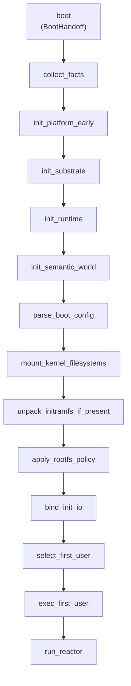

推荐的内部形状是一个 `BootCx<P>` 加一条线性的 `boot_main()`。`BootCx` 保存当前启动过程确实需要共享的少量状态：`BootHandoff`、收集到的 `BootFacts`、`BootArgs`、`BootPlan`、root mount、init process/thread、optional mount handles、first-user spec，以及用于串口输出的 board prefix。`boot_main()` 只按顺序调用具名方法，每个方法返回 `BootResult<()>`，失败时通过 `?` 提前返回。这个模型的目标不是创建一个新的 runtime，而是消除当前到处 `expect()`、`panic!()`、重复 sentinel 输出和历史 fallback 混在一起的形状，让启动失败都能带有稳定的 `step` 与 `tag`。

```rust
pub fn boot<P: TxPlatform>(handoff: BootHandoff) -> ! {
    let mut cx = BootCx::<P>::new(handoff);

    if let Err(err) = boot_main::<P>(&mut cx) {
        boot_fail::<P>(err);
    }

    cx.run_reactor()
}

fn boot_main<P: TxPlatform>(cx: &mut BootCx<P>) -> BootResult<()> {
    boot_step!(P, "facts", cx.collect_facts())?;
    boot_step!(P, "foundation", cx.init_platform_early())?;
    boot_step!(P, "substrate", cx.init_substrate())?;
    boot_step!(P, "runtime", cx.init_runtime())?;
    boot_step!(P, "semantic-world", cx.init_semantic_world())?;
    boot_step!(P, "config", cx.parse_boot_config())?;
    boot_step!(P, "mounts", cx.mount_kernel_filesystems())?;
    boot_step!(P, "initramfs", cx.unpack_initramfs_if_present())?;
    boot_step!(P, "rootfs-policy", cx.apply_rootfs_policy())?;
    boot_step!(P, "init-io", cx.bind_init_io())?;
    boot_step!(P, "first-user", cx.select_first_user())?;
    boot_step!(P, "exec", cx.exec_first_user())?;
    Ok(())
}
```

`boot_step!` 只允许做三件事：打印 `begin` marker，执行表达式，打印 `ok` 或 `fail` marker。它不拥有策略，不改变返回值，不吞掉错误，也不把不同步骤重新调度。建议串口格式固定为 `txkernel:<board>:boot:begin:<step>`、`txkernel:<board>:boot:ok:<step>`、`txkernel:<board>:boot:fail:<step>:<tag>`。`BootError` 应该优先携带枚举化 tag，例如 `no-initrd`、`init-not-found`、`mount-devfs`、`legacy-shims-not-compiled`、`unsupported-mode-for-use`，而不是把任意 debug string 作为外部可依赖的日志接口。早期步骤不能依赖 heap，因此 error tag 和 detail 以 `&'static str` 或小枚举为主；后期如果需要 richer context，也应在转换为串口输出时收敛成稳定 tag。

这个 API 的步骤名称应保持具体。`facts` 表示收集 HAL/firmware/cmdline/initrd 事实；`foundation` 表示 early console、early trap、platform early init 等平台基础能力；`substrate` 表示 frame allocator、FrameMeta、heap、zone/epoch substrate 和 pmap extension；`runtime` 表示 boot reactor、timer/wait/mailbox、SMP/AP reactor admission；`semantic-world` 表示 init process、leader thread、TTY、IRQ、RTC、block/net device registry；`config` 表示 `BootArgs` 和 `BootPlan`；`mounts` 表示 rootfs、devfs、procfs、sysfs、bdev-fs 和 optional media mount；`initramfs` 表示从外部 cpio image 解包；`rootfs-policy` 只决定 LinuxLike、TestInit 或 LegacyCompat；`init-io` 绑定 PID 1 的 root、cwd 和 fd 0/1/2；`first-user` 只选择 path、argv、envp 和 optional payload；`exec` 才装载第一个用户态。这样命名之后，启动流程读起来仍然是一条普通 Rust 调用链，而不是手搓一套函数式 runtime。

Linux 在这里提供的是边界经验，而不是 API 模板。Linux 不把每个启动小步骤做成公开类型状态，它用线性 common init、清晰的 early/common/root namespace/first init 边界、`printk` 和 panic/fallback 规则保持可诊断性。txKernel 的 Rust 化改进应该是让失败值更结构化、让串口 marker 更稳定、让 `BootPlan` 和 `FirstUserSpec` 更集中，而不是把启动重写成过度抽象的 typestate 或 railway framework。

## collect_facts：收集 HAL 与固件事实

<!-- txdoc:BOOT-FLOW-STAGE-0-PLATFORM-ENTRY-1 -->


`collect_facts()` 是 generic kernel 看到启动世界的第一步。板级代码在它之前已经接收固件留下的原始状态，例如 boot hart id、firmware argument、DTB 指针、物理加载地址、低地址 identity mapping、SBI 或其他 firmware service 入口，并完成汇编 trampoline、栈切换、BSS 清零、bootstrap 页表、早期 console 和静态 boot facts 的捕获。进入 `collect_facts()` 时，原始固件约定不应该继续向上泄露，而应该已经被规整成 HAL 能表达的 typed surface：`BootInfo` 给出 memory regions、kernel image、initrd 和 cmdline；`PlatformInfo` 给出平台 MMIO 与拓扑事实；pmap、trap、console、timer、SMP 和 power 通过 trait 关联函数暴露。

这个函数的产物不是启动策略，而是事实快照。它可以把 `BootHandoff` 中的指针、长度、地址范围和静态平台描述整理到 `BootFacts`，并为后续步骤提供只读依据；它不应该判断 Alpine、OSComp、LTP 或 contest 应该如何启动，也不应该创建文件、mount 或进程。Linux 的早期路径也有相同的归一化过程，只是形式更传统：架构入口、解压器和早期架构 C 代码先把机器带到 common kernel 可以理解的状态，然后进入 `start_kernel()` 一类的 common mainline。Linux common code 仍会调用大量 arch hook，但原始固件约定不会散落到普通 VFS、进程或 syscall 代码里。txKernel 比 Linux 更严格，因为具体平台在链接期选择，`tx-kernel` 通过 monomorphized `P: TxPlatform` 消费 facts；这个严格边界阻止了运行时 HAL manager 渗入上层，也让 boot policy 不会被误放到 HAL。

## init_platform_early：建立平台早期能力

<!-- txdoc:BOOT-FLOW-STAGE-1-SUBSTRATE-1 -->

`init_platform_early()` 把 `collect_facts()` 收集出的静态事实转化成后续内核初始化可以依赖的最小平台能力。它对应当前 `P::init_early(handoff)` 一类的位置：早期 trap/console 状态必须足够支撑故障输出，早期 pmap 必须足够支撑 page substrate 接管，平台中断或 timer 的最低限度状态必须足够让后续 runtime 初始化有明确前置条件。这里仍然属于 platform/foundation 边界，不能注册语义设备，不能创建 PID 1，不能决定 rootfs 策略，也不能根据 `tx.boot.mode=` 改变子系统初始化路径。

Linux 在 `start_kernel()` 的早期部分也会先处理架构和平台相关状态，但 Linux 的 common code 通常通过 arch hook 与大量全局初始化函数交织完成。txKernel 当前选择把平台族静态化，把早期平台能力集中成 `P: TxPlatform` 的关联函数调用，这让职责边界更容易审计：board binary 选择 `ActivePlatform` 并实现底层能力，generic kernel 调用这些能力，但不导入具体 board crate，也不在运行时根据 arch 或 board 做分支。后续如果 `init_platform_early()` 需要增加检查，也应该仍然围绕“是否具备进入 substrate 的前置能力”展开，而不是把 Alpine 或测试 harness 的需求放进去。

## init_substrate：建立内存与对象底座

<!-- txdoc:BOOT-FLOW-STAGE-1-SUBSTRATE-2 -->

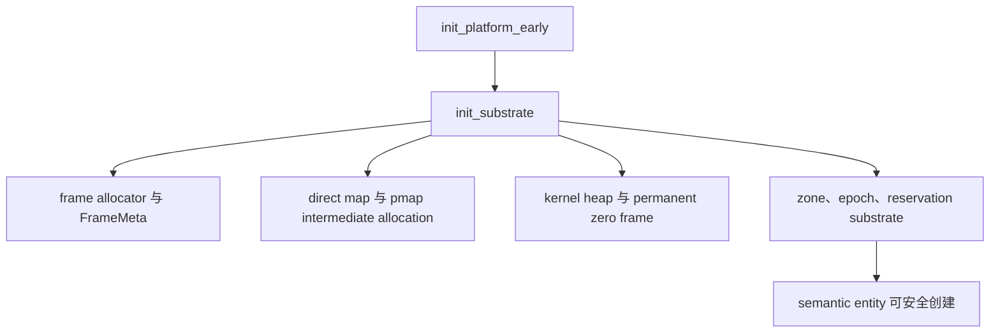

`init_substrate()` 消费 HAL 发布的内存布局和 pmap 能力，建立 frame allocator、FrameMeta、direct map 覆盖、pmap intermediate allocation、永久 zero frame、kernel heap，以及 zone/epoch/reservation 这些更高层对象模型会依赖的底座。只有这个函数返回以后，zone-backed semantic entity 才能安全创建，VFS、Mount、Process、TTY、Device 和 Reactor 才有稳定的内存与 reclamation 基础。因此它的边界应当非常硬：substrate 可以提供内存、索引、epoch、mutation、page 和 reservation primitives，但不应该拥有用户可见进程、文件、mount、TTY 或 syscall policy。

Linux 在 `start_kernel()` 中同样先建立基础能力，只是集合更庞大。Linux 会初始化架构状态、memblock/page allocator、slab/slub、scheduler、RCU、timer、IRQ、VFS cache、安全框架和 initcall 层级，逐步把系统推进到可以创建 kernel thread 和运行用户态的状态。txKernel 当前没有采用 Linux 式大规模 initcall，而是把顺序写在一条显式 Boot API 中；这个直接性现在是优点，因为依赖关系可以从 `boot_main()` 读出来。未来如果引入 typed boot phase 或 registry，也应该只是让依赖更可检查，而不是让初始化顺序重新隐藏在 link section 或子系统自注册里。

## init_runtime：建立 reactor、timer、wait 与 SMP admission

<!-- txdoc:BOOT-FLOW-STAGE-2-SMP-REACTOR-1 -->

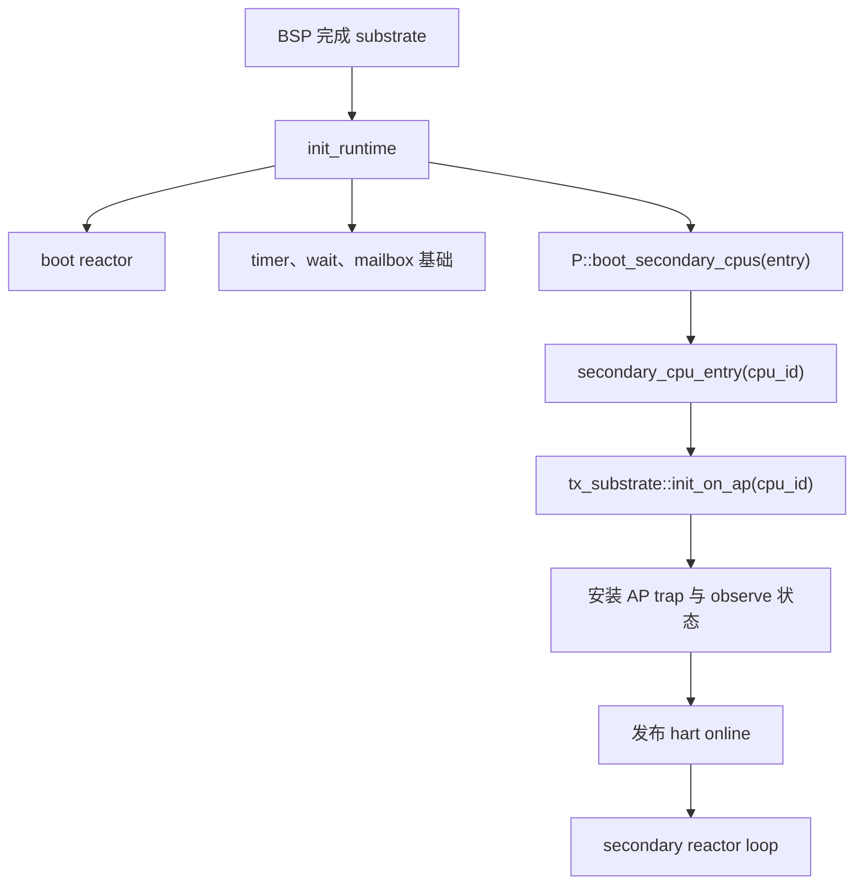

`init_runtime()` 把已经可用的 substrate 接入执行模型。它要初始化 boot reactor、timer/wait/mailbox 这类 runtime primitives，并把 SMP bring-up 明确拆成 HAL 机制和 kernel runtime admission 两层。第一层是平台机制：如何启动另一个 hart，如何把它带到一个入口函数，如何发送和接收 IPI，如何执行低层 ack 或 park。第二层是内核接纳：AP 必须初始化本 hart 的 substrate 状态，安装 trap，发布 online，再进入能够 drain reactor work 的循环。HAL 可以启动 CPU，但不能决定哪个用户态线程应该运行，也不能决定 syscall wait 如何恢复；这些属于 reactor、scheduler 和 thread-runtime。

Linux 的 SMP boot 同样不只是“把 CPU 叫醒”。Linux 要设置 per-cpu state、idle task、scheduler domain、RCU、timer、IPI、TLB shootdown 和 workqueue 参与关系，最后才算真正把 CPU 接入系统。txKernel 当前已经有 AP 在线和 secondary reactor loop 的形状，但正常 multi-hart userspace 仍然是需要持续证明的目标。这个差距必须在 API 叙事中说清楚：`init_runtime()` 完成的是 foundation 层和 runtime admission 的组合，所有 syscall、VM、VFS、TTY、network、scheduler 在多核下稳定运行则是更高层的收敛工作，不能因为 AP 已经 online 就假定整个 Linux-visible 多核语义已经完成。

## init_semantic_world：建立 PID 1、设备、TTY 与语义实体

<!-- txdoc:BOOT-FLOW-STAGE-3-SEMANTIC-WORLD-1 -->

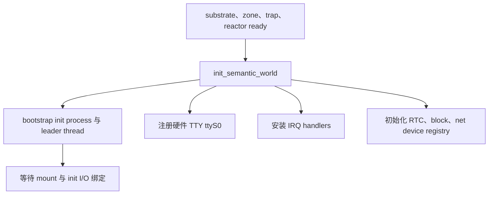

`init_semantic_world()` 是 txKernel 从“内核基础能力已经启动”转向“可以构造 Linux-visible 世界”的第一步。它应创建 bootstrap init process 和 leader thread，准备 process/thread runtime 拥有的 cwd、root、fd table、credential、signal state 和 userspace run slot；它应注册硬件 TTY identity，使后续 `/dev/console` 有真实对象可投影；它应安装必要 IRQ handler，并初始化 RTC、block、net device registry 等设备层 owner。这里的关键是“创建 owner state”，而不是“替用户态搭目录”。进程、TTY、设备和文件系统投影必须由各自 owner subsystem 创建，boot 只按顺序调用这些 owner，不伪造它们的 truth。

Linux 也会建立类似的语义世界，但很多投影发布和策略组织交给 initramfs、devtmpfs、udev 或发行版 init。Linux 内核会准备 VFS、设备模型、procfs/sysfs/devtmpfs 能力、block device 与 root namespace，而发行版 initramfs 往往会挂载 `/proc`、`/sys`、`/dev`，装载模块，发现 root，执行 pivot_root 或 switch_root，再进入真正 rootfs 的 init。txKernel 现在在 kernel boot 中直接完成更多基础发布，是因为 Alpine 和测试 harness 当前还需要这些机制才能启动；但设计方向不应该因此偏离 Linux：内核发布机制和 kernel state projection，用户态负责 service database、配置文件、脚本、helper layout 和具体启动策略。

## parse_boot_config：归纳 BootArgs、BootPlan 与编译期用途

<!-- txdoc:BOOT-FLOW-STAGE-4-BOOT-PLAN-1 -->

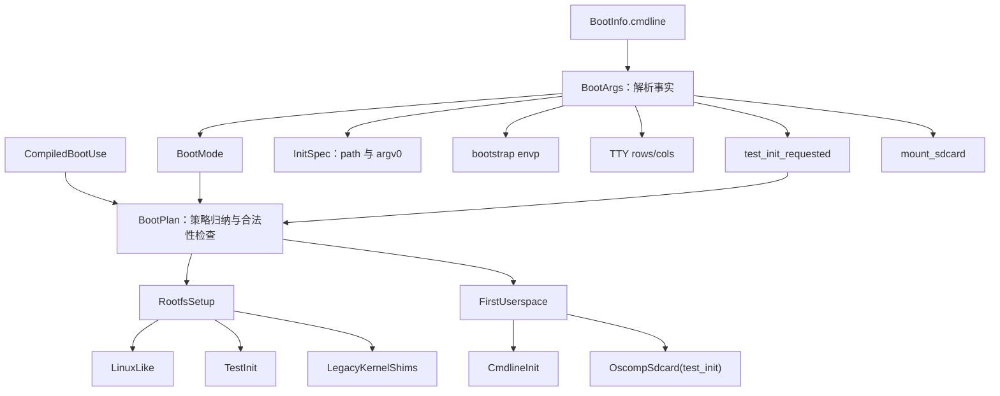

`parse_boot_config()` 是启动策略唯一应该被归纳的位置。`BootArgs` 只把固件 cmdline 转成 typed facts：启动模式、init 路径、`argv[0]`、环境变量、TTY 窗口大小、是否显式请求 test-init、是否尝试挂载 sdcard。它可以识别 legacy alias，例如 OSComp 相关 token 暗示 `BootMode::Oscomp`，但它不决定 rootfs 要不要做 shim。`BootPlan` 才负责策略归纳：Linux-like mode 得到 `RootfsSetup::LinuxLike`；显式 test-init 得到 `RootfsSetup::TestInit`；旧 compat mode 在没有 test-init 时得到 `RootfsSetup::LegacyKernelShims`；OSComp/LTP 选择 `FirstUserspace::OscompSdcard`，普通启动选择 `FirstUserspace::CmdlineInit`。这个拆分和 Linux 的 cmdline 处理思路是对齐的：Linux 也会解析 `root=`、`console=`、`init=`、early param、module param 等参数，但参数解析本身不应该变成散落在 VFS、driver、scheduler、signal 等子系统中的启动策略。

启动配置还需要拆成三个互不混淆的轴：platform、compiled use 和 runtime rootfs/mode。platform 轴决定这颗 kernel binary 跑在哪个板子上，继续由 board binary 静态选择 `ActivePlatform`；compiled use 轴决定这颗 kernel binary 为哪一类用途裁剪，决定是否编译 test-init 支持、legacy shim、开发诊断和比赛提交限制；runtime rootfs/mode 轴决定这一次 QEMU 或真实机器启动时加载什么 image、传入什么 `init=`、选择 Alpine/BusyBox/contest/test 哪条入口。现在的问题不是缺少参数，而是这些概念被 `--profile`、`tx.profile=`、`tx.boot.mode=` 和 ad hoc script 同时承担，导致一个名字既像镜像类型，又像用途，又像运行策略。

platform 轴保持当前 axHal-style 形状。`boards/tx-kernel-riscv64-qemu-virt`、`boards/tx-kernel-riscv64-m1dock-mock`、`boards/tx-kernel-loongarch64-qemu-virt` 这类 board binary 只选择一个 concrete `ActivePlatform`，实现 `KernelMain<ActivePlatform>` 并导出 `rust_entry`。它们不应包含 Alpine、OSComp、LTP、contest 之类用途逻辑，也不应根据运行时参数选择另一套 HAL。compiled use 轴建议先收敛为四个互斥 feature：`boot-use-normal`、`boot-use-test`、`boot-use-contest` 和 `boot-use-dev`。`normal` 面向 Alpine、BusyBox 和普通用户程序启动，默认不包含 legacy rootfs shims，也不包含内核内 OSComp/LTP runner；`test` 面向 OSComp/LTP/回归测试，包含 `/tx-test-init` 支持和测试 payload selection，但仍然要求用户态 setup 由 test init 或 image overlay 完成；`contest` 面向组委会镜像和提交产物，保持 Linux-like 最小语义，拒绝 test/legacy mode，避免把开发诊断或 benchmark helper 编进提交内核；`dev` 面向本地调试，可以打开 observe、extra sentinel、bench group、诊断输出等能力，但 legacy shim 仍然应通过单独 feature 显式开启，而不是随 `dev` 默认打开。

```toml
[features]
default = ["boot-use-normal"]

boot-use-normal = []
boot-use-test = []
boot-use-contest = []
boot-use-dev = []

boot-legacy-shims = []
```

四个 `boot-use-*` feature 必须互斥，`build.rs` 或 `xtask` 应当在构建前检查；`boot-legacy-shims` 是临时兼容 feature，默认关闭，只能在 `test` 或 `dev` use 下启用。内核侧可以把编译期用途收敛为一个很薄的常量，而不是让 feature 条件散落到 VFS、exec、mount、TTY 或 syscall 路径中。

```rust
pub enum CompiledBootUse {
    Normal,
    Test,
    Contest,
    Dev,
}

pub const COMPILED_BOOT_USE: CompiledBootUse = compiled_boot_use();
```

`BootPlan::from_args()` 应同时接收 runtime `BootArgs` 和 compile-time `CompiledBootUse`，并在集中位置拒绝不合法组合。`normal` binary 允许 `normal`、`busybox`、`alpine` 这类 Linux-like mode，拒绝 `oscomp`、`ltp`、`test`。`contest` binary 允许 `normal`、`contest`、必要时允许 Alpine-shaped rootfs 作为普通发行版 witness，但拒绝所有 test mode。`test` binary 允许 `test`、`oscomp`、`ltp`，并且 OSComp/LTP 默认要求 `init=/tx-test-init` 或等价 payload handoff；只有同时编译 `boot-legacy-shims` 时才允许 `LegacyCompat`。`dev` binary 可以允许所有 mode，但 legacy 仍然需要显式 feature。这样 runtime cmdline 负责“这次启动要运行什么”，compile-time use 负责“这颗内核是否包含那类能力”，两者不再互相冒充。

```text
compiled use  | runtime modes allowed             | rootfs setup
--------------|-----------------------------------|-------------------------------
normal        | normal, busybox, alpine            | LinuxLike only
contest       | normal, contest, alpine witness    | LinuxLike only
test          | test, oscomp, ltp, busybox/alpine  | TestInit; Legacy only by feature
dev           | all modes                          | LinuxLike/TestInit; Legacy by feature
```

`xtask` 的用户界面也应反映这个拆分。长期形态应当把当前 overloaded `--profile` 拆成 `--target`、`--use` 和 `--rootfs`：`--target rv64-qemu|rv64-m1dock-mock|la64-qemu` 选择平台，`--use normal|test|contest|dev` 选择 kernel binary 的编译用途，`--rootfs busybox|alpine|test-init|none` 选择镜像内容。`--boot-mode` 和 suite/group 参数只是 runtime cmdline 的一部分。产物命名也应携带两个轴，例如 `target/tx/rv64-qemu/normal/kernel.elf`、`target/tx/rv64-qemu/test/kernel.elf`、`target/tx/la64-qemu/contest/kernel.elf`，避免把带 test/legacy 能力的内核误当作 contest binary 或 normal witness。

这个配置模型的迁移可以分阶段完成。第一步只新增 `CompiledBootUse`、互斥 feature 检查和 `BootPlan` 合法性检查，同时保持旧 `--profile` 兼容。第二步让 `xtask build/qemu/image/shell-test` 支持 `--use` 与 `--rootfs`，并在 dry-run 输出中打印最终 kernel feature、image、cmdline 和 artifact path。第三步把 `rootfs_shims.rs` 改名或迁入 `boot/legacy.rs`，只在 `boot-legacy-shims` 下编译；没有该 feature 时，runtime 请求 legacy 应稳定失败为 `boot:fail:rootfs-policy:legacy-shims-not-compiled`。第四步把 OSComp/LTP runner 和用户态 helper setup 全部迁到 `/tx-test-init` 或 image overlay，然后把 legacy ceiling 降到零。

<!-- txdoc:BOOT-FLOW-LINT-1 -->

启动参数和用户态 setup 的边界应由 `cargo xtask lint invariants boot-setup` 机械保护。这个 lint 的目的不是判断某一个字符串当前是否能让 QEMU 跑起来，而是防止启动策略重新扩散到任意子系统、驱动或临时脚本里。内核侧的 cmdline 解析归拢在 `init/boot_args.rs` 和 `init/boot_plan.rs`；host 侧的 cmdline 生成只允许出现在 QEMU、shell-test、OSComp 等明确启动入口；测试环境的 `/etc`、`/tx-ltp`、模块数据库、BusyBox helper 和类似用户态文件布置只允许在 `tools/test-init/tx-test-init.sh`、镜像构建，或当前尚未删除的 legacy `init/rootfs_shims.rs` 兼容面中出现。lint 可以保留少量过渡白名单，例如当前仍承担 OSComp/LTP payload 命令选择的 `init/exec.rs`，但这些白名单应被视作迁移账本，不是新的设计入口。

## mount_kernel_filesystems：发布 rootfs/devfs/procfs/sysfs/bdev-fs

<!-- txdoc:BOOT-FLOW-MOUNT-KERNEL-FILESYSTEMS-1 -->

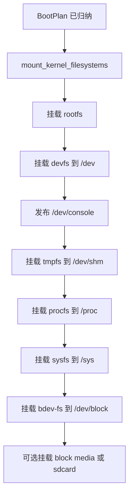

`mount_kernel_filesystems()` 负责发布内核确实拥有的文件系统和 projection。它必须先挂载 rootfs，再挂载 devfs/procfs/sysfs/bdev-fs，因为这些文件系统需要 mountpoint；它必须在 devfs 中发布真实 console alias，因为 `/dev/console` 需要 `init_semantic_world()` 中注册过的 TTY identity；它可以挂载 `/dev/shm` 这样的基础 tmpfs，也可以根据 `BootPlan` 和设备可见性选择是否挂载 block media 或 sdcard。它不应该替 Alpine 创建 `/etc/passwd`，不应该替测试套件创建 `/tx-ltp/bin`，不应该把 BusyBox applet 链接写成正常发行版启动的一部分，也不应该把 benchmark 目录当成 VFS 的内建事实。

Linux 的 root namespace 准备在实现上更复杂，涉及 initramfs、真实 rootfs、devtmpfs、procfs、sysfs、driver model、block discovery、pivot_root 或 switch_root 等多个组件。txKernel 现在把基础 mount 写在 boot 中，是为了在 Alpine、BusyBox 和测试路径尚未完全成熟时提供 Linux-shaped 起点。这个折中可以接受，但边界必须明确：`mount_kernel_filesystems()` 发布 kernel-owned mechanism 和 kernel state projection，普通用户态目录、服务数据库、测试 wrapper 和 suite layout 应由镜像、initramfs 或 `/tx-test-init` 提供。这样即使 mount 仍由内核执行，它的语义也不会变成发行版 policy。

## unpack_initramfs_if_present：展开外部 image 内容

<!-- txdoc:BOOT-FLOW-UNPACK-INITRAMFS-1 -->

`unpack_initramfs_if_present()` 只处理一个问题：如果 `BootFacts` 表明 bootloader 或 QEMU 提供了 initramfs/cpio image，就把它按文件系统语义展开到当前 rootfs。这里的关键词是“外部 image 内容”。以前文件硬嵌入是为了在没有稳定外部 rootfs 或 initramfs 时，让内核自己带上少量用户态文件、脚本或测试 helper，从而绕过早期文件系统和镜像构建能力不足的问题；现在已经能启动 Alpine，就不应该继续把这种历史 workaround 放在正常路径里。initramfs 是 Linux-like 的承载方式：文件来自镜像构建或测试 initramfs，而不是来自内核随手创建的目录树。

这个函数不应该决定第一个用户态是谁，也不应该根据解包结果隐式切换启动模式。它可以报告 image 格式错误、写入 rootfs 失败、路径冲突等稳定错误 tag；也可以在没有 initramfs 时直接返回成功，让后续 `select_first_user()` 按 `BootPlan` 去找 cmdline init 或 test entry。Linux 也会在 early userspace 前解包 initramfs，但是否继续使用 initramfs root、是否发现真实 root、是否执行 switch_root，通常由后续 namespace 准备和 PID 1/initramfs 脚本共同决定。txKernel 的长期方向也应如此：解包是机制，策略由 `BootPlan` 和用户态 init 承担。

## apply_rootfs_policy：选择 LinuxLike、TestInit 或 LegacyCompat

<!-- txdoc:BOOT-FLOW-STAGE-5-ROOTFS-LANES-1 -->

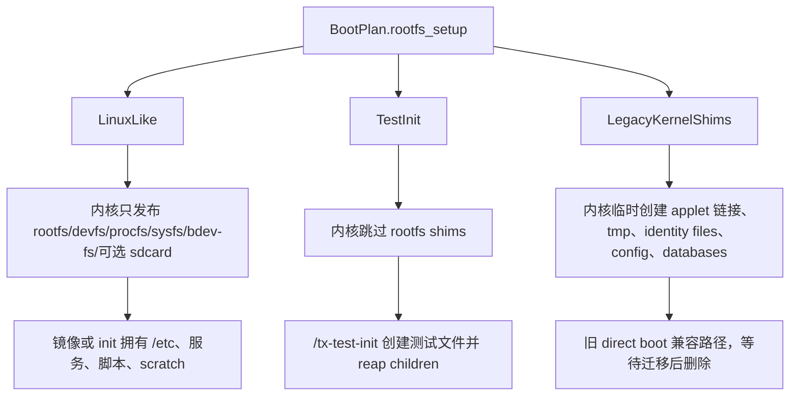

`apply_rootfs_policy()` 是当前最重要的 Linux 对齐边界。Linux-like 路径中，内核只保留 `mount_kernel_filesystems()` 已经发布的对象：rootfs、devfs、procfs、sysfs、bdev-fs、console、必要的 block/media 可见性。它不应该替 Alpine 创建 `/etc/passwd`，不应该替测试套件创建 `/tx-ltp/bin`，不应该把 BusyBox applet 链接写成正常发行版启动的一部分，也不应该把 benchmark 目录当成 VFS 的内建事实。这些内容如果正常用户态需要，就应放进镜像；如果测试需要，就应放进 test init 或 overlay。

TestInit 路径则承认 OSComp/LTP 是一个测试 appliance，而不是普通发行版。`/tx-test-init` 作为 PID 1 可以创建测试目录、写兼容配置、安装 helper wrapper、启动 payload、等待 payload 结束，并 reap 遗留子进程。这个模型比 kernel-side shim 更接近 Linux，因为 Linux 上类似需求通常由 initramfs 脚本完成，而不是由 `start_kernel()` 写死。它也让测试环境的演进有一个单独用户态入口，不会污染 Alpine、contest 或普通用户程序启动。

LegacyKernelShims 路径是过渡保留。它能避免旧的 direct OSComp/LTP 启动立即失效，但它不是最终设计。保留它的前提是范围必须清楚：它是 boot-flow compatibility surface，不是 VFS truth，不是 process truth，也不是子系统初始化职责。每一个仍留在 legacy lane 的文件创建或链接创建，都应该有迁移目标：搬到 `/tx-test-init`、搬到 image overlay、或由组委会镜像构建脚本提供。

## bind_init_io：绑定 PID 1 的 root、cwd 与 fd 0/1/2

<!-- txdoc:BOOT-FLOW-BIND-INIT-IO-1 -->

`bind_init_io()` 把前面创建的语义实体和 mount topology 绑定到 PID 1 的进程视图上。它应设置 init process 的 root 和 cwd，使后续路径解析以已经准备好的 rootfs 为根；它应打开或关联 `/dev/console`，并把 fd 0、1、2 绑定为标准输入、输出和错误；它还应确保相关 open file、file descriptor table、TTY controlling relationship 和 process-owned state 都通过对应 subsystem 的正常接口建立。这个函数之所以单独存在，是因为它的依赖很清楚：没有 PID 1 就不能绑定进程 I/O，没有 rootfs 和 devfs 就没有路径，没有 console alias 就没有 Linux 意义上的标准流。

Linux 中 PID 1 的文件描述符和控制台也不是一个抽象细节。早期 initramfs、`/dev/console`、console= 参数和 init 的 stdin/stdout/stderr 决定了启动失败是否可诊断。txKernel 应该同样把这一步做成显式函数，而不是让 exec、TTY 或 VFS 的任意一层顺手补上。这样 review 时可以直接判断：PID 1 的 root/cwd/fd 是否来自真实 mount 和真实 devfs projection；测试模式是否只是选择不同 init，而不是绕过标准 fd 绑定；normal/contest 路径是否没有被测试 harness 的临时 console 逻辑污染。

## select_first_user：选择第一个用户态入口

<!-- txdoc:BOOT-FLOW-STAGE-6-FIRST-USERSPACE-1 -->

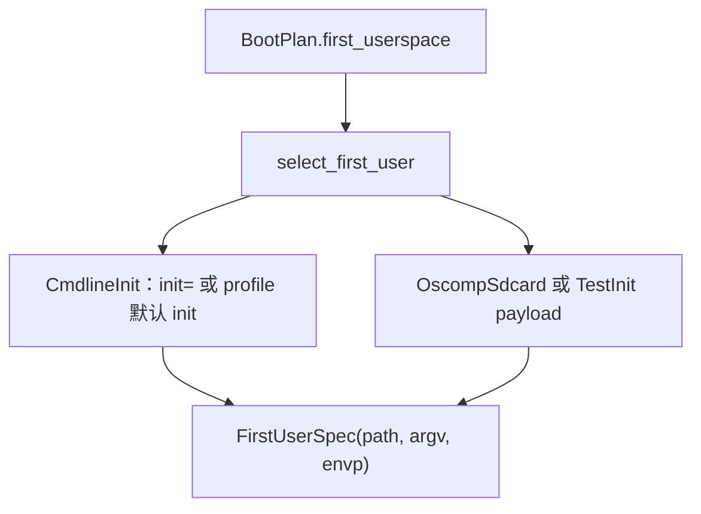

`select_first_user()` 只选择 path、argv、envp 和 optional payload，不装载程序，不创建用户态目录，也不修补 rootfs。普通路径使用 `init=` 或 profile 默认路径，OSComp/LTP/test 路径可以选择 `/tx-test-init` 并把 suite command 作为 payload 传给它；如果仍处于 legacy direct path，则可能选择 sdcard BusyBox 并执行 `sh -c <suite command>`。这个函数应该集中处理“运行哪个用户态”的策略，让后续 `exec_first_user()` 成为纯装载步骤。用户指定 init 路径不可执行时，错误应在 exec 阶段明确暴露，而不是在 selection 阶段静默换成另一个 kernel-embedded fallback。

Linux 的 first userspace 也遵守类似边界。内核最终运行一个用户态程序：可能是 initramfs 里的 `/init`，可能是真实 rootfs 上的 `/sbin/init`，也可能是 `init=` 指定的路径。它不会因为某个发行版缺少配置文件就在内核里创建 `/etc/passwd`，也不会把某个测试套件的 helper layout 写进 common boot path。txKernel 的 `select_first_user()` 应该向这个模型靠齐：选择入口可以由 cmdline 和 `BootPlan` 决定，但入口之后如何搭建系统是 PID 1、镜像和测试 init 的工作。

## exec_first_user：通过 exec_script 装载 PID 1

<!-- txdoc:BOOT-FLOW-EXEC-FIRST-USER-1 -->

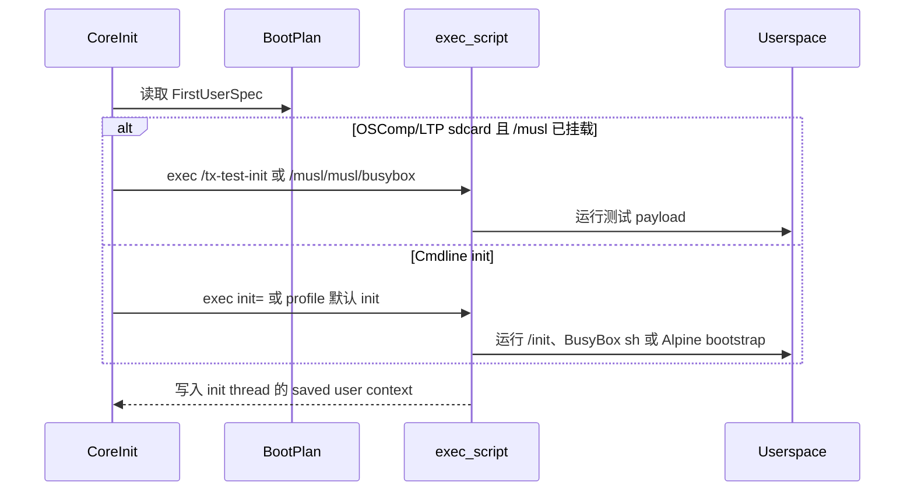

`exec_first_user()` 通过正常 `exec_script` 装载第一个用户态程序，而不是由内核把某个硬嵌入二进制写进 rootfs 再特殊跳转。普通路径 exec `init=` 或 profile 默认路径；OSComp/LTP 在 `/musl` sdcard 可用时可以优先运行测试入口；如果 test-init 被请求，内核 exec `/tx-test-init` 并把 suite 命令传给它；如果仍处于 legacy direct path，则 exec sdcard BusyBox 并执行 `sh -c <suite command>`。如果 sdcard 路径失败，代码应落回明确的 cmdline init 策略或报告稳定的 `bootstrap-exec` failure，而不是静默跑一个新的内核内置 fallback。

Linux 的第一用户态也遵守相同的语义 crossing。内核最终运行一个用户态程序：可能是 initramfs 里的 `/init`，可能是真实 rootfs 上的 `/sbin/init`，也可能是 `init=` 指定的路径。它通过 exec 语义建立新地址空间、用户栈、auxv、入口 PC 和进程可见状态。txKernel 当前在 bootstrap 阶段同步 drive `exec_script`，是因为 boot reactor 尚未开始驱动 init future；这只是调度时机上的实现差异，不应该被理解成“第一个用户态不是 exec”。只要装载仍走 exec script，后续动态链接、auxv、TLS、fd close-on-exec、procfs `/proc/<pid>/exe` 等语义就都有自然落点。

txKernel 与 Linux 的当前差距在成熟度，而不是方向。Linux 有成熟动态链接器、initramfs 工具链、rootfs 切换、模块和设备发现；txKernel 仍然需要在静态/半静态用户态、测试镜像和 exec 支持之间逐步补齐。这个差距应该通过完善 exec、VFS、PageBacked、镜像构建和 test init 来缩小，而不是重新引入 kernel-embedded userspace 文件。

## run_reactor：进入 boot reactor 与用户态循环

<!-- txdoc:BOOT-FLOW-STAGE-7-REACTOR-USERSPACE-1 -->

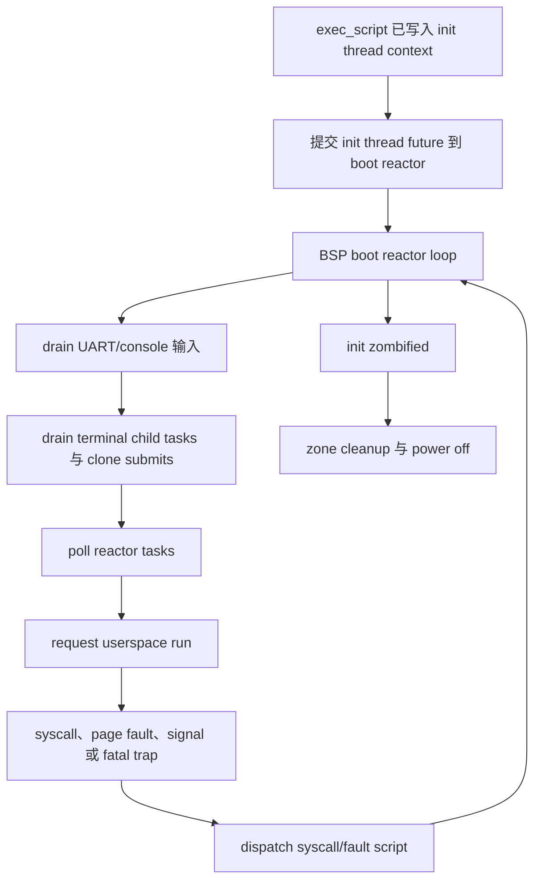

`exec_script` 完成后，内核不是直接“调用 init”，而是把 init 的 thread future 提交给 boot reactor。boot reactor 循环负责 drain UART 输入、处理 console TTY、回收终止的 child reactor task、发布 clone 子线程提交、poll runtime task、进入用户态、接收 syscall/page fault/fatal trap，再把 trap 分发给对应 syscall 或 fault script。init 退出后，进程变成 zombie，boot lane 输出 userspace exit marker，执行 zone-aware cleanup，最后关机。

这里是 txKernel 和 Linux 机制差异最大的地方。Linux 使用 stackful task、每任务 kernel stack 和传统 scheduler context switch；txKernel 使用 stackless future、per-hart kernel stack 和 reactor poll。Linux 任务可以阻塞在深层 kernel call stack 中等待调度恢复；txKernel 的 future 在等待点把状态保存在 future object 中并返回 reactor，后续被唤醒后继续 poll。这个差异不改变 POSIX 目标，但会改变启动组织方式：PID 1 不应该绕过 reactor，子系统也不应该直接决定某个用户态线程立即运行。子系统发布状态，script 解释 `StepOutcome`，reactor 管 task poll 和 wake，thread-runtime 管用户态返回点。

这个模型对启动文档很重要，因为它说明了为什么 first userspace 不是一个特殊永久例外。bootstrap 阶段同步 drive exec 只是为了在 reactor 正式运行前把初始用户上下文写好；一旦进入 boot reactor loop，init 和后续 clone/fork/thread 都应该回到统一执行模型。Linux 的 `kernel_init` 和 kthreadd 体系有自己的长期结构；txKernel 的长期结构应该是 reactor 和 thread future，而不是为 PID 1 保留一条特殊“启动线程”通道。

## 正常 Alpine/contest 启动

<!-- txdoc:BOOT-FLOW-NORMAL-BOOT-1 -->

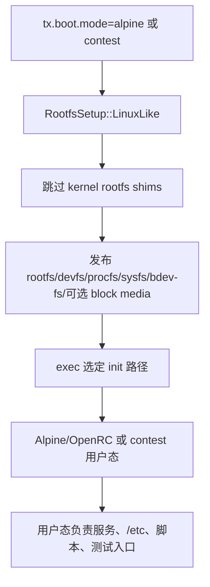

正常 Alpine 或 contest 启动是我们应该持续收敛的目标形态。内核需要给 init 一个可运行环境：console、fd 0/1/2、基础 mount、procfs/sysfs/devfs projection、必要设备和 block media 可见性。除此之外，普通用户态工作应该由镜像或 init 接管。Alpine/OpenRC 可以创建服务状态、执行网络脚本、读取 `/etc`、管理用户数据库、挂载额外文件系统；contest 镜像可以提供自己的 init 或测试入口。内核只负责 syscall 与 kernel state projection 的正确性。

Linux 之所以能用同一个内核启动 Debian、Alpine、Buildroot、Android 或自定义 appliance，正是因为它没有把发行版策略编码进 common boot path。txKernel 现在已经能启动 Alpine，因此每个新增启动需求都应该先分类：它是 kernel mechanism、kernel state projection、image content，还是 test harness policy。`/proc/cmdline` 是 kernel boot fact projection；`/etc/passwd` 是 image policy。`/dev/console` 是 kernel device publication；BusyBox applet symlink farm 是 image 或 test-init policy。这个分类越严格，启动流程越接近 Linux，也越容易支持组委会或用户自己的镜像构建代码。

## OSComp/LTP/test 启动

<!-- txdoc:BOOT-FLOW-TEST-BOOT-1 -->

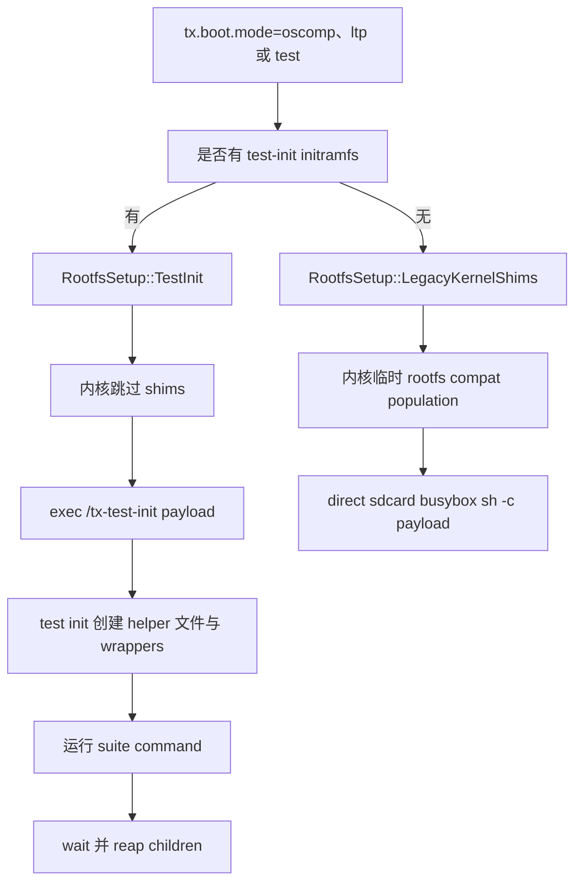

OSComp/LTP/test 启动是另一个明确 lane。测试套件通常需要固定路径、helper wrapper、BusyBox applet、伪 module metadata、临时目录和 suite marker。把这些都塞进内核会让普通启动路径污染，也会让 VFS、procfs、process 等子系统背负不属于它们的测试语义。更好的做法是把它们放到 `/tx-test-init`。这个 test init 是 PID 1，它可以像 Linux initramfs 脚本一样搭环境，启动 payload，等待 payload，最后 reap 子进程并以 payload status 退出。

legacy direct path 保留只是为了不中断旧覆盖。它不应该继续扩张，也不应该成为新测试功能的默认落点。后续组委会可能提供自己的镜像构建代码，LTP 也可能需要不同布局，因此 test setup 必须是可替换的用户态层。内核最多负责选择 first userspace、传递 suite command、提供 syscalls 和文件系统/设备机制。这样 OSComp/LTP 能继续跑，Alpine 也不会因为测试 harness 的历史假设而多出不该有的文件。

## 端到端 Tx 启动链

<!-- txdoc:BOOT-FLOW-END-TO-END-TX-1 -->

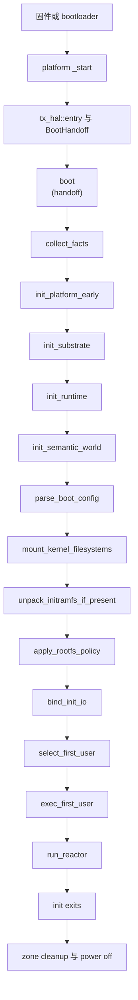

从端到端看，Tx 启动有三条边界最需要维护。第一条是 HAL 边界：板级代码归一化固件和硬件事实，generic kernel 只通过 `P: TxPlatform` 消费它们。第二条是语义发布边界：进程、VFS、Mount、TTY、Device、procfs 和 sysfs 都应由自己的 owner subsystem 创建和发布，boot 只是按顺序调用这些 owner，不应该伪造它们的 truth。第三条是用户态策略边界：`BootPlan` 可以选择 Linux-like、TestInit 或 LegacyKernelShims，但每条 lane 的内容不能混在一起。只要这三条边界还在，启动流程就能继续向 Linux 收敛。

错误处理也应该沿着这条链变得更清楚。initramfs 解包失败应报告 initramfs failure，并让后续 selected init path 自己失败；sdcard 不存在时 OSComp sdcard entry 不应被强行执行；用户指定 init 路径不可执行时应该明确 `bootstrap-exec:fail`，而不是静默运行一个 kernel-embedded fallback。Linux 上 `init=` 指错路径通常就是严重启动错误，txKernel 也应该逐步采用这种可诊断、不可静默掩盖的行为。

## 标准 Linux 启动链

<!-- txdoc:BOOT-FLOW-LINUX-REFERENCE-1 -->

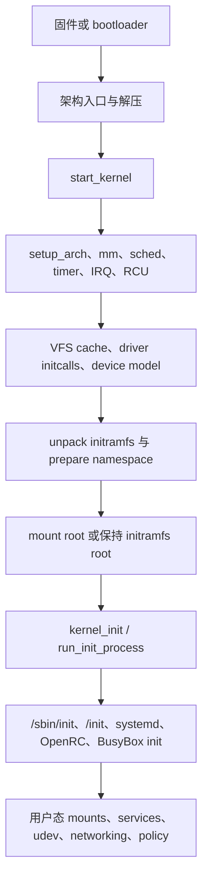

Linux 的标准启动可以理解为一个逐渐收窄的漏斗。最早的架构入口把固件状态转化为内核可执行环境；common kernel 初始化内存、调度、timer、IRQ、RCU、VFS、security、device 和 kernel thread；initramfs 可能被解包并作为早期 root；root namespace 被准备；存储和 rootfs 被发现；最后内核运行 PID 1。PID 1 之后，系统是否是服务器、路由器、容器宿主、测试镜像或 rescue shell，都主要由用户态决定。

txKernel 不应该照搬 Linux 的所有实现复杂度，但应该照搬这个责任分界。Linux 有 initcall、kernel thread、workqueue、RCU、module、udev、initramfs 工具链，txKernel 有 static HAL、explicit CoreInit、stackless future、reactor 和 typed subsystem ownership。实现形态不同，但分工应当一致：平台归平台，substrate 归 substrate，机制归内核 owner subsystem，策略归 init 和镜像。这个原则比某个具体函数名更重要。

## Tx 与 Linux 按 Boot API 对比

<!-- txdoc:BOOT-FLOW-TX-VERSUS-LINUX-BY-STAGE-1 -->

| Boot API 步骤 | Linux 形态 | txKernel 形态 | 对齐目标 |
|---|---|---|---|
| `collect_facts` / `init_platform_early` | 架构入口归一化固件后进入 common kernel | board crate 选择 `ActivePlatform`，generic kernel 使用 `P: TxPlatform` | 保持静态 HAL，不引入 runtime HAL manager |
| `init_substrate` | memblock/page allocator/slab 等逐步建立 | `tx_substrate::init<P>()` 建立 FrameMeta、allocator、heap | substrate 只提供机制，不拥有语义对象 |
| `init_runtime` | scheduler、timer、IRQ、RCU、SMP admission 逐步接入 | boot reactor、timer/wait/mailbox、AP reactor admission | 运行模型归 reactor/thread-runtime，不归 HAL 或子系统 |
| `init_semantic_world` | device model、kernel thread、基础 namespace 能力逐步可用 | 创建 PID 1、TTY、IRQ handler、RTC/block/net registry | owner subsystem 创建 truth，boot 只编排 |
| `parse_boot_config` | `root=`、`console=`、`init=`、early/module param 集中解析 | `BootArgs` + `BootPlan` + `CompiledBootUse` 合法性检查 | 启动策略集中化，不散落到子系统 |
| `mount_kernel_filesystems` / `unpack_initramfs_if_present` | procfs/sysfs/devtmpfs 能力，initramfs/rootfs 准备 | rootfs、devfs、procfs、sysfs、bdev-fs 与外部 image 解包 | 发布 kernel state projection，不发布发行版策略 |
| `apply_rootfs_policy` | 测试或 appliance 通常由自定义 initramfs/root image 脚本搭建 | LinuxLike、TestInit、临时 LegacyKernelShims 三条 lane | 测试 setup 上移到用户态，legacy lane 收缩 |
| `bind_init_io` / `select_first_user` / `exec_first_user` | `init=` 或默认 init 路径通过 exec 进入 PID 1 | 绑定 PID 1 root/cwd/fd，选择并 exec selected init | first userspace 策略集中化，exec 语义统一 |
| `run_reactor` | stackful scheduler + per-task kernel stack | reactor task + stackless future + per-hart stack | 子系统不绕过 reactor/thread-runtime |

最核心的差异不是功能数量，而是组合单位。Linux 用 stackful task、scheduler、kernel thread 和 initcall 组织启动；txKernel 用 typed ownership、script、StepOutcome 和 reactor 组织启动。因此直接复刻 Linux 内部结构并不合适。我们需要复刻的是责任边界：内核建立机制，用户态组织策略；内核提供 projection，init 消费 projection；内核执行 exec，init 决定如何继续搭建系统。

第二个差异是成熟度。Linux 可以假设动态链接、rootfs handoff、设备发现、模块和 initramfs 工具链已经成熟；txKernel 仍需要显式 boot wiring 支撑 Alpine 和测试套件。这个事实不应该成为继续扩张 kernel-side userspace setup 的理由。相反，每一处 boot wiring 都应该被分类：如果是机制，就归入 owner subsystem；如果是 policy，就迁移到 image 或 init；如果是临时 workaround，就放在 legacy lane 并记录退出条件。

## 归属规则

<!-- txdoc:BOOT-FLOW-OWNERSHIP-RULES-1 -->

启动流程的 review 规则如下。HAL 拥有平台入口、pmap/trap/timer/console/IRQ/SMP 原语和静态平台事实。page substrate 拥有 frame allocator、FrameMeta、pmap accounting 和 heap bring-up。Process 拥有 PID 1、进程/线程生命周期、cwd/root/fd attachment、exit/wait 状态。VFS 和 Mount 拥有名字、dentry、open file、filesystem instance 和 mount topology。TTY 拥有硬件 TTY identity、line discipline、controlling terminal 和 `/dev/console` 的 devfs 投影。Procfs/sysfs 只渲染 owner state，不拥有额外 truth。Exec 是 script，不拥有 semantic state。Boot policy 只拥有 mode selection 和 first userspace selection。Test init 拥有测试 setup。

这些规则主要防止三类回归。第一类是把 test shim 放进 semantic subsystem，导致子系统 truth 被某个测试 harness 污染。第二类是把 boot mode 条件散落在各处，导致启动行为必须靠 grep 历史代码才能理解。第三类是把“系统成功退出”当作“测试成功”：OSComp/LTP 的真实证明应该来自 serial marker 和 case-level assertion，而不是只看 `userspace:exited:0`。启动文档必须让这些边界可审计，否则后续功能越多，启动路径越难回到 Linux-like。

## 当前缺口与下一步方向

<!-- txdoc:BOOT-FLOW-CURRENT-GAPS-1 -->

当前启动流程已经比文件硬嵌入和无条件 rootfs shim 阶段清楚很多，但还不是最终形态。legacy kernel shim lane 仍然存在；部分基础 mount 仍由 kernel boot 直接完成；动态链接、完整 exec 语义、更成熟设备发现、更多真实 Alpine/OpenRC 流程和 multi-hart userspace proof 仍然需要继续推进。这些缺口不改变方向：正常启动路径应继续减小内核负担，而不是增加内核对用户态目录和测试脚本的了解。

下一步应继续把 setup 往上移。Alpine 需要的普通文件应进入 Alpine rootfs 或 init 脚本；OSComp/LTP 需要的 helper 应进入 `/tx-test-init`、image overlay 或组委会镜像构建；kernel 只应暴露真实机制和 projection，例如 procfs process state、sysfs/devfs device state、TTY 语义、mount 语义、network state 和正确 syscall 行为。随着这些机制成熟，`CoreInit` 的用户态 setup 部分应该越来越短，`BootPlan` 的策略表应该越来越清楚，legacy shim lane 应该越来越小。

## 参考

<!-- txdoc:BOOT-FLOW-REFERENCES-1 -->

- [`HAL_v1.md`](../01_substrate/HAL_v1.md) - 静态平台族、boot handoff、pmap/trap/timer/IRQ/SMP HAL 义务。
- [`PAGE_SUBSTRATE_v1.md`](../01_substrate/PAGE_SUBSTRATE_v1.md) - frame allocator、FrameMeta、pmap substrate、heap bring-up。
- [`MODULE_MAP_v1.md`](../00_meta-framework/MODULE_MAP_v1.md) - HAL、substrate、subsystem、script、shim、projection 的归属规则。
- [`EXEC_v1.md`](EXEC_v1.md) - exec 作为跨子系统 script，以及 first userspace 的装载路径。
- [`PROCESS_v1.md`](../04_process-signals/PROCESS_v1.md) - PID 1、进程/线程生命周期、exit/wait 语义。
- [`THREAD_RUNTIME_v1.md`](THREAD_RUNTIME_v1.md) - thread-as-future、signal delivery boundary、reactor interaction。
- [`2026-07-06-boot-mode-shim-split.md`](../../progress/decisions/2026-07-06-boot-mode-shim-split.md) - Linux-like 与 compat/test boot mode 的决策记录。
