# Time, Timers, And Wake Routing -- v1

<!-- txdoc:TIME-WAKE-V1 -->

## Status

<!-- txdoc:TIME-WAKE-V1-STATUS-1 -->

Target v1. This document specifies the Tx design for time hardware
capabilities, wall-clock timekeeping, software timer registration, reactor timer
driving, and scheduler-aware wake routing under SMP.

It extends the current reactor and SMP contracts rather than replacing them:

- [`HAL_v1.md`](../01_substrate/HAL_v1.md) owns platform timer hardware facts.
- [`03_STEP_MODEL_v2.md`](../../Txv3/03_STEP_MODEL_v2.md) owns `YieldShape`,
  `WaitProtocol`, and resume outcomes.
- [`REACTOR_v0.md`](REACTOR_v0.md) owns task polling and wait mediation.
- [`10_SCHED_SMP_v1.md`](../../Txv3/10_SCHED_SMP_v1.md) owns cross-hart
  placement, work stealing, and wake-vs-steal race closure.
- [`DEVICE.md`](../06_devices/DEVICE.md) owns the userspace device route for
  `/dev/rtc`-style character devices.

Implementation status on 2026-07-12:

- `tx_hal::TimeIf` has been retired from active Rust code. `TxPlatform` now
  names `MonotonicCounterIf + DeadlineTimerIf + PersistentClockIf` directly.
- `tx_services::time::wall_clock` implements realtime as monotonic time plus an
  offset and generation counter, and exposes the zero-sized `TimekeeperIf`
  facade for clock syscalls, vDSO/VVAR publication, timerfd realtime
  conversion, and futex/nanosleep deadline conversion paths.
  `tx_subsystems::time_hooks` installs subsystem-local timerfd and VVAR
  publication hooks. The old `tx_subsystems::wall_clock` compatibility path is
  retired.
- `tx_substrate::wake::timer::TimerWheel` exposes the first
  `TimerRegistrar` / `TimerRegistry` / `TimerWakeRouter` facade over
  role-tagged timer registrations.
- `tx_reactor` has the first scheduler-aware timer expiry route:
  `TimerRegistry::fire_due_with` posts `TimerFired`, resolves the mailbox
  owner, makes a parked task runnable through scheduler placement, and uses the
  reactor reschedule signal for remote dispatch.
- The old direct mailbox compatibility timer route has been removed from active
  Rust code. Timer expiry callers must provide a `TimerWakeRouter`; there is no
  implicit `TimerWheel::fire_due` shortcut.
- `tx_reactor` no longer re-exports the substrate timer implementation surface
  through either the crate root or `adapter::bus_wire`; public timer consumers
  must enter through `tx_services::time` facades or reactor-owned driver
  boundaries.
- `tx_subsystems` crate-root adapter no longer re-exports
  `tx_substrate::wake` wholesale. Shared subsystem diagnostics use a narrow
  `wake_registry_summary` export, while timer implementation names remain
  hidden behind `tx_services::time` or reactor-private driver boundaries.
- `tx_kernel` boot-runtime adapter no longer re-exports substrate timer role
  catalog names. Kernel boot code that needs to retain a timer registration uses
  the service-owned `tx_services::time::TimerGuard` facade.
- `tx_services::time::DeviceTimerCallback` is a service-owned wrapper around
  the substrate device callback descriptor. Device/RTC producers can describe
  callback plus wait-source/raw-queue wake intent without importing the
  substrate timer callback type directly.
- `tx_reactor` wait timeouts now install `DeadlineAbort` guards into the
  unified `TimerWheel` registry. The old reactor-local queue/future path is no
  longer present in active Rust code.
- syscall wait timeout futures and RTC alarm emulation no longer call
  substrate `TimerRegistrar::install_for_task` /
  `TimerRegistrarHandle::install_device_callback` directly. They wrap the
  entry-context registrar in `tx_services::time::DeadlineRegistrarHandle` or
  accept `&dyn DeadlineRegistrar`, then register role/target-shaped deadlines.
- Package F foundation has landed: `tx_hal::PersistentClockIf` exists as the
  fallible RTC/persistent-clock capability, RV64 QEMU virt implements a real
  `google,goldfish-rtc` backend, LA64 QEMU virt implements a real LS7A RTC
  backend, the m1dock mock no-RTC profile has focused host witnesses that
  persistent-clock operations return typed unsupported results and `RTC_IRQ`
  stays at the zero sentinel,
  `TimekeeperIf` has realtime seed hooks, the kernel vDSO bootstrap seeds
  realtime from persistent clock before publishing the initial vvar snapshot,
  and `/dev/misc/rtc` `RTC_RD_TIME`, `RTC_SET_TIME`, `RTC_ALM_READ`, and
  `RTC_ALM_SET` now reach a typed `RtcDeviceOps` adapter instead of
  syscall-local RTC semantics.
- System realtime mutation now has a persistent writeback policy helper:
  `clock_settime(CLOCK_REALTIME)` and `settimeofday` mutate the timekeeper
  first, then attempt best-effort `PersistentClockIf::set_realtime_ns`
  writeback without rolling back accepted kernel realtime on RTC failure.
- The old raw public `wall_clock::*` runtime wrappers and public `WallClock`
  surface are retired. `TimekeeperIf` plus `timekeeper()` is now the only
  public semantic clock facade for upper layers; the remaining `WallClock`
  storage object and helper methods are private implementation details inside
  `wall_clock`, with only test-support reset kept behind test cfg.
- `/dev/misc/rtc` now has a typed pending-event path: RTC alarm/update events
  publish device pending bits, `RtcDeviceOps::poll_events` reports readiness,
  `read(2)` consumes Linux-shaped RTC event records with blocking vs
  nonblocking behavior keyed by fd flags, and `ppoll`/`epoll` subscribe to the
  RTC device wait source through typed `rtc_ops()` routing.
- Emulated RTC alarms now use the unified timer registry: `RTC_ALM_SET` falls
  back to a `DeviceEvent` timer callback when the persistent-clock backend does
  not support hardware wake alarms, and the callback publishes
  `RtcEventMask::ALARM` into RTC device state before normal read/poll routing.
- Hardware RTC alarm publication has the first QEMU board paths:
  `IrqIf::RTC_IRQ` exposes the optional board IRQ number, RV64 QEMU virt sets
  it to PLIC IRQ 11, LA64 QEMU virt sets it to GSI 67, `tx-kernel` registers
  `rtc_alarm_irq_handler`, pre-initializes the RTC event source before
  unmasking the IRQ, acknowledges the persistent-clock alarm IRQ through HAL,
  and then publishes `RtcEventMask::ALARM` into RTC device state.
- Package G has its first shared owner-aware post primitive in `tx_reactor`:
  `ReactorOwnerWakePost` now centralizes mailbox event posting, mailbox owner
  resolution, parked-task transition, scheduler placement, local enqueue,
  remote IPI signaling, and userspace preempt marking. Timer expiry and the
  reactor wake-inbox drain path use this helper, and
  `Reactor::post_mailbox_event_from_hart` gives non-timer producers that
  already have reactor/scheduler context the same path. A focused
  `SourceFired` test proves the route does not depend on captured local waker
  drain as the correctness mechanism. Delegate timeout timers now also fire
  through the reactor timer tick: `TimerRegistry::fire_due_with` hands tagged
  `DelegateTimeout` entries to `ReactorOwnerWakePost`, which marks the
  delegate token timed out and posts the resulting `Abort(TimedOut)` through
  the same owner-aware placement route. Device-owned timer callbacks can now
  carry a wait-source wake target; the reactor timer router resolves the source
  and posts delivered `SourceFired` events through the same owner-aware
  placement helper instead of relying on the captured mailbox waker as the
  correctness path. Delegate reply, cancel, and agent-death transitions now
  have `DelegateRegistry::*_with_post` variants plus reactor wrappers that
  inject `ReactorOwnerWakePost`, so scheduler-context producers can route
  `AgentReplied` and `Abort` events through the same owner-aware placement
  boundary. Signal delivery now has the same caller-posting seam at the
  thread-runtime layer: `post_signal_mailbox_with_post` and
  `post_signal_with_post` keep signal pending/summary mutation in
  `tx-subsystems` while allowing reactor-context callers to inject an
  owner-aware mailbox post, and `Reactor::post_signal_delivered_from_hart`
  proves the already-resolved `SignalDelivered` event can use the same
  cross-hart placement route. Bus-backed wait futures now also use task-owned
  mailboxes when the current reactor poll mailbox can be identified
  unambiguously, while keeping a standalone fallback for host/test use.
  `TaskMailbox::poll_select` lets each driver take only its matching event and
  drop its own stale source generations without consuming unrelated signal,
  delegate, timer, or other wait-source events.
  `Reactor::post_mailbox_ref_event_from_hart` closes the bus `fire_with_post`
  integration point by routing already-upgraded subscriber mailboxes through
  the same owner-aware scheduler placement and remote-IPI path. Reactor-local
  coordination producers now have the same seam:
  `Completion::complete_with_post`, `CountdownCompletion::arrive_with_post`,
  and `SyncRendezvous::ack_with_post` let scheduler-context callers inject
  owner-aware wake publication. The old no-context `complete`, `arrive`, and
  `ack` methods are retired; host/no-context tests call the `_with_post`
  methods with explicit direct closures. Signal process-level producers now have the same injected-post
  seam: `step_kill_process_with_post` routes catchable process-directed posts,
  SIGSTOP/SIGCONT Gewalt fanout, and SIGKILL terminal zombify wake hints
  through the caller-provided mailbox post. The old bare
  `step_kill_process` direct wrapper is retired; no-context callers use
  `step_kill_process_with_post` / `step_kill_process_with_posts` with explicit
  direct post closures. The thread-future fatal signal teardown path
  now uses `fatal_signal_teardown_from_current_hart`, which crosses the
  kernel/BOOT_REACTOR boundary through
  `post_mailbox_event_from_current_hart` and therefore routes signal-frame and
  sigreturn fatal exits through owner-aware mailbox posting whenever reactor
  context is initialized. Syscall-context signal producers now have the same
  bridge: `SyscallCtx` carries an optional mailbox post function, the real
  `thread_future` syscall context injects `post_mailbox_event_from_current_hart`,
  and `pidfd_send_signal`, `tkill`, `tgkill`, socket/pipe/page-backed
  `SIGPIPE` producers route their signal mailbox publication through that
  seam while host/no-reactor contexts retain a direct fallback. `ITIMER_REAL`
  signal producers now use the same injected-post route at all active
  boundaries: syscall-boundary polling calls `fire_itimer_real_with_post(ctx)`,
  socket wait expiry calls the same helper, and the enter-userspace compat
  frame path is exposed only as `maybe_deliver_itimer_signal_with_post(...,
  post)`. Futex syscall-context wake producers now use the same mailbox-ref
  bridge with scheduler hints preserved: `SyscallCtx` carries
  `post_mailbox_ref_event_with_hint`, the real `thread_future` context injects
  `post_mailbox_ref_event_with_hint_from_current_hart`, and `FUTEX_WAKE` /
  `FUTEX_WAKE_BITSET` exact wait-source publication routes through
  `step_futex_wake_masked_with_hint_and_post_in`. Eventfd syscall-context
  producers now use the same mailbox-ref bridge: eventfd read/write have
  `step_eventfd_read_with_post` / `step_eventfd_write_with_post`, and
  `sys_eventfd_read` / `sys_eventfd_write` inject
  `SyscallCtx::post_mailbox_ref_event` for readable/writable wait-source
  publication. The old no-context `step_eventfd_read` and
  `step_eventfd_write` wrappers are retired; host/no-reactor tests and StepOp
  wrappers call the `_with_post` helpers with an explicit direct closure.
  Pipe syscall-context producers now use the hint-aware
  mailbox-ref bridge: pipe notification exposes readable/writable
  `_with_post` verbs, pipe read/write have `ReadWithHintPostOp` /
  `WriteWithHintPostOp`, and `sys_pipe_read_buffered` /
  `sys_pipe_write_buffered` pass
  `SyscallCtx::mailbox_ref_post_with_hint` so reader/writer wait-source
  publication can route through owner-aware placement when reactor context
  exists. Timerfd syscall-context settime producers now have the same
  mailbox-ref seam for the immediate-readable case:
  `timerfd_settime_with_flags_and_post` routes readable wait-source
  publication through `SyscallCtx::post_mailbox_ref_event` when
  `timerfd_settime` arms an already-expired timer. The old no-context
  `timerfd_settime_with_flags` wrapper is retired; host/no-reactor tests call
  the `_with_post` helper with an explicit direct closure. `step_timerfd_read`
  also drains an already accumulated expiration count, so a wake published
  before the next read poll is observable by the waiter. The realtime `clock_settime` /
  `settimeofday` mutation path now has the same syscall-context seam:
  `set_realtime_ns_with_persistent_and_timerfd_post` carries
  `SyscallCtx::post_mailbox_ref_event` through `wall_clock` into
  `timerfd_clock_was_set_with_post`, so cancel-on-set and realtime-deadline
  revalidation wake timerfd readers through the owner-aware mailbox-ref route
  when scheduler context exists. TTY input-readable publication now has the
  same hint-aware caller-posting seam: `step_ingest_with_post` routes the
  per-TTY readable wait source through an injected mailbox-ref post, and the
  production console ingest path in `tx-kernel` injects
  `post_mailbox_ref_event_with_hint_from_current_hart`. The old no-context
  `step_ingest` wrapper is retired; no-context tests and TTY-internal callers
  call `step_ingest_with_post` with an explicit direct hint-aware closure.
  VFS/RNode readiness
  now has the same semantic seam: `RNode::fire_read_wait_with_post` and
  `fire_write_wait_with_post` keep per-RNode read/write wait-source ownership
  in VFS while allowing fd/syscall callers that have scheduler context to
  inject owner-aware mailbox-ref posting. The old no-context
  `fire_read_wait` and `fire_write_wait` wrappers are retired; no-context
  tests call the `_with_post` helpers with an explicit direct closure.
  POSIX mq send/receive readiness and `mq_notify` signal publication now have
  the same syscall-context seam: `step_mq_send_with_posts` wakes parked
  receivers through `SyscallCtx::post_mailbox_ref_event` and delivers
  `mq_notify` signals through `SyscallCtx::post_mailbox_event`, while
  `step_mq_receive_with_post` wakes parked senders through the injected
  mailbox-ref route. The old no-context `step_mq_send` and `step_mq_receive`
  wrappers are retired; no-context tests and procfs setup call the `_with_post`
  helpers with explicit direct closures.
  SysV msg queue readiness now has the matching subsystem seam:
  `step_msgsnd_with_post` publishes receiver readability through
  `SyscallCtx::post_mailbox_ref_event`, `step_msgrcv_with_post` publishes
  sender writability through the same injected route, and
  `step_msgctl_in_ns_with_post` uses the same seam for `IPC_RMID`
  send/receive waiter abort publication. The old no-context `step_msgsnd`,
  `step_msgrcv`, `step_msgsnd_v3`, `step_msgrcv_v3`, `step_msgctl`, and
  `step_msgctl_in_ns` wrappers are retired; no-context tests and procfs setup
  call the `_with_post` helpers with an explicit direct closure. SysV semaphore changed-source
  readiness now follows the same rule: `step_semop_v3_with_post` /
  `step_semop_with_post`, `step_semctl_in_ns_with_post`, and
  `step_sem_undo_with_post` publish semaphore value-change and `IPC_RMID`
  waiter wakes through the caller-provided mailbox-ref post. The old
  no-context `step_semop`, `step_semop_v3`, `step_semctl`,
  `step_semctl_in_ns`, and `step_sem_undo` wrappers are retired;
  no-context tests and procfs setup call the `_with_post` helpers with an
  explicit direct closure. RTC/device readiness now has the same boundary: hardware RTC IRQ
  publication calls `publish_rtc_event_with_post` with the kernel
  current-hart mailbox-ref post, emulated RTC alarm timers use
  `DeviceTimerCallback::with_raw_queue_wake` so the reactor timer router
  publishes RTC RawQueue `SourceFired` events through
  `ReactorOwnerWakePost`, and the old direct `publish_rtc_event` wrapper is
  absent from active Rust code. No-context tests publish RTC readiness through
  `publish_rtc_event_with_post` with an explicit direct mailbox-ref post
  closure.
  Socket readiness publication now has the same caller-posting shape:
  `SocketReadiness::fire_recv_with_post`, `fire_send_with_post`, and
  `fire_accept_with_post` are the only socket readiness fire verbs,
  `NetworkPublish::publish_to_with_post` / `NetworkPublishTarget::publish_with_post`
  cover packet, loopback, TCP, UDP, ICMP, SCTP, netdevice, and netlink
  readiness publication, netlink route/xfrm/netfilter send wrappers are exposed
  only as `_with_post` helpers and syscall dispatch injects
  `SyscallCtx::post_mailbox_ref_event`, UDP/ICMP loopback processing and
  inline UDP loopback send helpers are exposed only as `_with_post` helpers
  and feed the caller-provided post through lower publish targets, net device
  TX pending processing is exposed only as `_with_post` helpers and routes
  send-space readiness through the caller-provided post, socket
  syscall ARP-reply and `fcntl(F_SETFL)` send-space producers inject
  `SyscallCtx::post_mailbox_ref_event`, and packet
  dispatch processing now has the same explicit seam:
  `step_process_network_events_in_namespace_at_with_post` and
  `drive_all_net_namespace_runtimes_at_with_post` let the net delegate runtime
  route TCP/UDP/ICMP packet-readiness publication through
  `NetDelegateDriver::post_net_mailbox_ref_event` while no-context callers use
  explicit direct closures. The old direct `fire_recv` / `fire_send` /
  `fire_accept` and direct `publish_to` / `publish` wrappers are absent from
  active Rust code.
  Network delegate kick publication now uses the same caller-posting shape:
  `net_delegate_kick_poll_with_post` and `net_delegate_kick_tick_with_post`
  are the only delegate queue kick verbs, net device IRQ/poll-ready producers
  expose `handle_irq_with_post`, `ack_interrupt_and_fire_with_post`, and
  `poll_device_and_fire_with_post` instead of retaining direct fire wrappers,
  subsystem/no-context producers pass the delegate direct mailbox-ref post
  helper explicitly, and the boot network deadline task injects the kernel
  current-hart mailbox-ref post.
  AIO/io_uring completion readiness now follows the same rule:
  `AioContext::push_completion_with_post` and
  `IoUring::push_cqe_with_post` are the only completion/CQ publication verbs,
  AIO and SQPOLL worker construction receives narrow completion-post closures,
  `sys_io_setup` and `sys_io_uring_setup` inject `SyscallCtx` mailbox-ref
  posting into those workers, `sys_io_uring_enter` publishes CQ readiness
  through `SyscallCtx::post_mailbox_ref_event`, and the old direct
  `push_completion` / `push_cqe` plus direct worker-spawn wrappers are absent
  from active Rust code.
  Signalfd and process exit-source have also retired their old direct
  wrappers: signalfd publication is exposed as
  `SignalFd::notify_with_post` / `notify_process_signal_with_post`, process
  exit-source publication is exposed as `fire_exit_source_with_post` /
  `notify_child_zombified_with_post`, process group exit is exposed only as
  `step_exit_group_with_posts` / `step_exit_group_with_signal_with_posts` so
  both signal-task posts and exit-source wait-source posts are caller-injected,
  and no-context tests now pass explicit direct post closures through those
  same helpers instead of calling old `notify_process_signal`,
  `SignalFd::notify`, `fire_exit_source`, `notify_child_zombified`,
  `notify_v3_source`, `step_exit_group`, or `step_exit_group_with_signal`
  names.
  The signal StepOp wrapper surface now follows the same caller-posting rule:
  process-directed delivery is exposed as `KillProcessWithPostOp`,
  process-group delivery is exposed as `KillPgrpWithPostOp`, thread-directed
  delivery is exposed as `ThreadKillWithPostOp`, the old direct
  `KillProcessOp` / `KillPgrpOp` / `ThreadKillOp` wrapper names are absent
  from active Rust code, and the old internal `post_signal_mailbox` helper has
  been retired in favor of explicit `post_signal_mailbox_with_post` callers.
  The old direct
  `script_deliver_signal` helper name is also retired; no-context tests now
  call `script_deliver_signal_with_post` with an explicit direct post closure.
  The old direct `post_signal` wrapper name is also retired; catchable signal
  tests and no-context paths now call `post_signal_with_post` with an explicit
  mailbox-post closure.
  The remaining generic direct `notify_v3_source` adapter wrappers in the
  already-migrated timerfd, pipe, and futex wait-source paths are also retired:
  those adapters now expose only caller-posting `_with_post` / limit-with-post
  routes for v3 wait-source publication, while any no-context caller must pass
  an explicit direct post closure.
  Page-backed page-ready wait publication now follows the same rule:
  `notify_page_ready_with_post` and the page-backed wait adapter's
  `notify_source_with_post` are the only page-ready publication surface, and
  the old direct adapter-level `notify_source` wrapper is absent from active
  Rust code.
- The design now explicitly covers future/task stealing: timer registries and
  wait sources keep mailbox identities, not hart identities; task migration
  changes scheduler ownership only; every wake after a steal must re-resolve
  the current owner through the owner-aware post primitive.
- A broader host mixed-producer wake witness has landed:
  `mixed_producer_wakes_repeatedly_route_current_owner` parks one task and
  wakes it sequentially through wait-source publication, timer expiry, and
  delegate reply from a non-owner hart. Each wake must use the owner-aware
  route, send a remote reschedule signal to the current owner, and let the
  task re-poll before the next producer fires.
- A wider host owner-aware producer stress has landed:
  `broad_owner_aware_producer_stress_routes_remote_wakes` parks independent
  tasks and wakes them from a non-owner hart through mailbox source events,
  signal delivery, wait-channel publication, delegate timeout, device
  wait-source timer callbacks, and device RawQueue timer callbacks. Each row
  must produce one owner-aware placement and one remote reschedule IPI before
  the task completes.
- RV64 QEMU now has a boot-time owner-aware mixed-producer SMP witness:
  `cargo xtask test smoke --target rv64-qemu --timeout-ms 60000` and
  `cargo xtask test busybox-boot --target rv64-qemu --timeout-ms 60000` both
  require `:reactor:owner-wake:smp:ok` in addition to `:boot:ok`. The marker is
  emitted only after the BSP submits an AP-owned parked reactor task and wakes
  it from the non-owner hart through wait-source publication, timer expiry,
  and delegate reply, with each stage proving remote IPI delivery and AP
  re-poll before the next producer advances.

This document names the target boundary that lets those pieces converge.
`TimeIf`, the old reactor-local timeout queue/future path, and
`timer_sleep::install_timer_queue` are retired active interfaces, not
compatibility shims, and should not be reintroduced.

The remaining target-state work after the current direct-interface retirement
slice is real-board or firmware-backed RTC support beyond the QEMU/no-RTC
profiles. LA64 or real-board SMP stress can extend the RV64 owner-wake marker
pattern, but the RV64 QEMU mixed-producer SMP witness is now a lane-level gate.
The named
Package G wake-producer rows now have caller-posting seams and strict
retired-interface audits; future producer families must enter the same
owner-aware post boundary instead of introducing a new direct wrapper. The
core document below is still the full target architecture; implementation
status callouts only describe how far the current tree has advanced.

## Document Map

<!-- txdoc:TIME-WAKE-V1-DOCUMENT-MAP-1 -->

Read this document in three passes:

1. **Architecture contract**: Problem, Requirements, Linux Reference Shape,
   Design Summary, Ownership Matrix, Interface Catalog, and Canonical Paths.
   These sections define the target layering and the dependency direction that
   later code review should enforce.
2. **Module contracts**: Hardware Capability Layer, Core Timekeeper, Software
   Timer Registry, Future And Step Integration, Reactor Responsibilities, Wake
   Router, SMP correctness, future-stealing semantics, and Device/RTC Route.
   These sections define each module's state, public interface, upper/lower
   consumers, and race rules.
3. **Execution plan and proof**: Current Code Alignment, Migration Plan,
   Invariants, Implementation Readiness Checklist, External Reference Patterns,
   and Design Decisions And Deferred Work. These sections say what is already
   aligned, what still has to land, and which evidence closes the package.

The document is intentionally not a single `time` subsystem spec. It is a
cross-layer contract for a path that starts at hardware counters and RTCs,
passes through timekeeper and wake substrate state, and ends at scheduler
placement. When adding or reviewing code, first locate the row in the Ownership
Matrix, then use the matching module-contract section and package-exit evidence
as the review checklist.

## Problem

<!-- txdoc:TIME-WAKE-V1-PROBLEM-1 -->

Linux-compatible time behavior is not a single API. It is a stack:

- monotonic hardware counter reads;
- hardware deadline interrupts;
- persistent RTC or firmware wall-clock seed;
- core timekeeper state for `CLOCK_MONOTONIC`, `CLOCK_REALTIME`, vDSO/vvar,
  filesystem timestamps, and timer conversions;
- software timer registration for sleeps, protocol timeouts, timerfd, POSIX
  timers, futex timeouts, and delegate reply deadlines;
- scheduler-aware wake routing when a timer expires.

Historically, the tree had these concerns spread across HAL, `wall_clock`,
`TimerWheel`, reactor-local timer queues, syscall shims, and devfs RTC stubs.
The main risk is conflating three independent responsibilities:

1. Reading time.
2. Scheduling a future interrupt.
3. Making a parked task runnable on the correct hart after the wake event.

That conflation becomes incorrect under SMP. A task can be parked, stolen, moved
by affinity, or already runnable when a timer expires. The timer wheel must not
choose a CPU by remembering where the future was last polled. CPU placement is a
scheduler decision over current task ownership.

## Requirements

<!-- txdoc:TIME-WAKE-V1-REQUIREMENTS-1 -->

Functional requirements:

- Support fast monotonic reads for scheduler, reactor, tracing, and clock
  syscalls.
- Support absolute monotonic deadline programming for the current hart.
- Support persistent realtime seed and `/dev/rtc`-style calendar-clock device
  operations without putting RTC reads on the hot `clock_gettime` path.
- Preserve `CLOCK_REALTIME = monotonic + offset` semantics and notify affected
  timer bases when realtime jumps.
- Represent pure timer waits, protocol timeouts over non-timer waits, and
  delegate reply deadlines through one software timer registration surface.
- Route timer expiry through the same mailbox and scheduler wake path as
  wait-source and delegate wakes.
- Remain correct when a task is stolen or migrated between registration and
  expiry.

Non-requirements for v1:

- Full Linux NTP discipline, leap-second handling, time namespaces, suspend
  accounting, and all RTC ioctls. The design leaves slots for them.
- Dynamic platform discovery. Platform selection remains the static axHal-style
  family in `HAL_v1`.
- Making `TimerWheel` a semantic owner of userspace timer objects. Timerfd,
  POSIX timer, interval timer, and alarmtimer semantics remain subsystem or
  shim-owned; the wheel only stores deadline registrations.

## Linux Reference Shape

<!-- txdoc:TIME-WAKE-V1-LINUX-REFERENCE-1 -->

Linux is the comparison target because it separates the same responsibilities
we need to separate, even though the concrete implementation is much larger:

| Linux function group | Linux-style responsibility | Tx target home |
|---|---|---|
| clocksource | Read a monotonically increasing counter and convert it to time | `MonotonicCounterIf` plus timekeeper conversion |
| clockevent | Program the next interrupt on a CPU | `DeadlineTimerIf` |
| timekeeping core | Maintain monotonic/realtime bases, offsets, generation-like sequence state, vDSO data | `TimekeeperIf` over `wall_clock` |
| hrtimer | Precise deadline-ordered timer expiry | `TimerRegistry` / `TimerWheel` |
| timer wheel | Coarser kernel-internal timeout batching | Same registrar surface; data-structure choice is internal |
| alarmtimer / RTC | Persistent clock and wake alarm integration | `PersistentClockIf` plus `RtcDeviceOps` |
| scheduler wakeup | Convert an event into runnable task placement and possibly an IPI | reactor `WakeRouter` plus scheduler |
| vDSO / vvar | User fast path for clock reads | timekeeper-owned snapshot |
| filesystem timestamping | Use a consistent realtime source for inode changes | VFS/filesystem policy over `TimekeeperIf` |

The important lesson is not the exact Linux data structures. The important
lesson is that counter reads, deadline interrupts, wall-clock policy, software
timer expiry, and scheduler placement are different layers with different
owners. Tx follows that split while preserving its own stackless-future,
mailbox, and StepOp model.

## Design Summary

<!-- txdoc:TIME-WAKE-V1-SUMMARY-1 -->

The target design has four data/control planes:

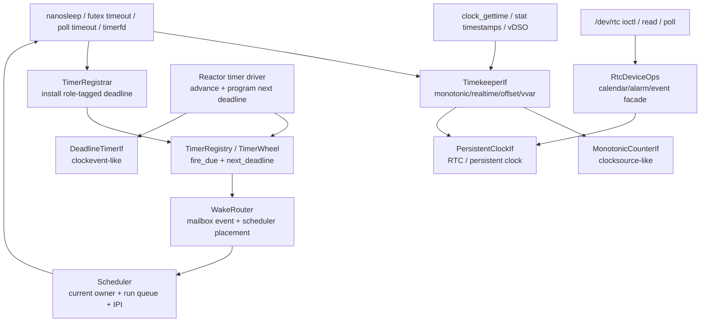

The most important rule is:

**Timer expiry produces a wake event. It does not choose the hart that runs the
task.**

The scheduler owns CPU placement through the SMP wake protocol in
`10_SCHED_SMP_v1`: read current owner, lock the destination queue, re-check
owner under the lock, enqueue if still parked, then send a reschedule IPI if
the target is remote.

### Ownership Matrix

<!-- txdoc:TIME-WAKE-V1-OWNERSHIP-MATRIX-1 -->

| Layer | Owns | Does not own | Current / target home |
|---|---|---|---|
| HAL counter | monotonic hardware read capability | realtime, timers, tasks | `tx-hal` platform traits |
| HAL deadline | current-hart hardware interrupt programming | software timer list, wake routing | `tx-hal` platform traits |
| persistent clock | RTC/persistent realtime device capability | `CLOCK_REALTIME` hot path | HAL trait plus device driver adapter |
| timekeeper | monotonic/realtime derivation, offsets, vvar snapshot, generation | hardware deadline programming, task wake | `tx-services::time::wall_clock` facade, with `tx-subsystems::time_hooks` installing subsystem hooks |
| timer registrar | role-tagged deadline registrations | syscall object semantics | `tx-substrate::wake::timer` |
| reactor timer driver | `fire_due_with(now, router)`, `next_deadline`, HAL reprogramming | timerfd/futex/nanosleep policy | `tx-reactor` |
| wake router | mailbox event enqueue and scheduler placement | deadline ordering, time conversion | `tx-reactor` implementation over substrate events |
| scheduler | current owner, queue insertion, steal/migration, IPI | event payload semantics | `tx-reactor` scheduler |
| RTC device facade | `/dev/rtc` ioctl/poll/read/write policy | vDSO/timekeeper internals | device subsystem + devfs |

This table is the review checklist for future edits. A new API belongs in the
first row whose "Owns" column describes the state it mutates.

### Target Module Map

<!-- txdoc:TIME-WAKE-V1-MODULE-MAP-1 -->

The v1 design intentionally avoids creating a monolithic `time` subsystem.
Time/wake is a cross-layer path, so each module owns only the state that fits
its layer:

| Target module or crate | Primary types | Role |
|---|---|---|
| `crates/tx-hal` | `MonotonicCounterIf`, `DeadlineTimerIf`, `PersistentClockIf` | static platform capabilities |
| board crates | platform trait impls | register reads, SBI/MMIO deadline programming, optional RTC backend |
| `tx_services::time::wall_clock` | `Timekeeper`, `TimekeeperIf`, `VvarSnapshot` | semantic clock state and publication |
| `tx_substrate::wake::timer` | `TimerWheel`, `TimerRegistrarHandle`, `TimerRegistry`, `TimerWakeRouter`, `TimerGuard` | deadline registration substrate, hidden behind service/reactor facades for upper producers |
| `tx_substrate::wake::mailbox` | `TaskMailbox`, `MailboxEvent`, scheduler owner binding | task-owned wake inbox |
| `tx-reactor` | reactor timer driver, scheduler wake router, per-hart deadline action | polling, timer driving, runnable placement |
| `tx-kernel::adapter` | boot runtime names plus service-owned `TimerGuard` wrapper | boot wiring adapter; no substrate timer role/registrar/router export |
| `tx-scripts` / `tx-shims` | `ScriptCtx.timer_registrar`, `SyscallCtx.timer_registrar` | ABI/StepOp conversion into timekeeper and registrar calls |
| `tx-subsystems::adapter` | named step/zone/wait/mailbox exports plus `wake_registry_summary` | crate-root compatibility adapter, not a public wake/timer implementation surface |
| `tx-subsystems::device` | `CharDeviceOps`, future `RtcDeviceOps` | device-class operations above HAL |
| `tx-fs::devfs` | static `/dev/misc/rtc` RNode binding | filesystem projection of device objects |

The module map mirrors Linux's separation but uses Tx's native boundaries:
static HAL capabilities, semantic subsystem facades, wake substrate, and
reactor-owned scheduling. A future implementation may move files around, but
the dependency direction should not change.

The mechanical boundary is import-level, not only export-level. Direct
`tx_substrate::wake::timer` imports in production code are confined to the
substrate implementation itself, the lower `tx-scripts` timer-yield bridge,
reactor private driver/runtime homes, and the `tx-services::time` deadline or
driver adapters. Upper producers use `tx_services::time` facade names instead.

### Layering And Dependency Rule

<!-- txdoc:TIME-WAKE-V1-LAYERING-RULE-1 -->

The dependency direction is fixed:

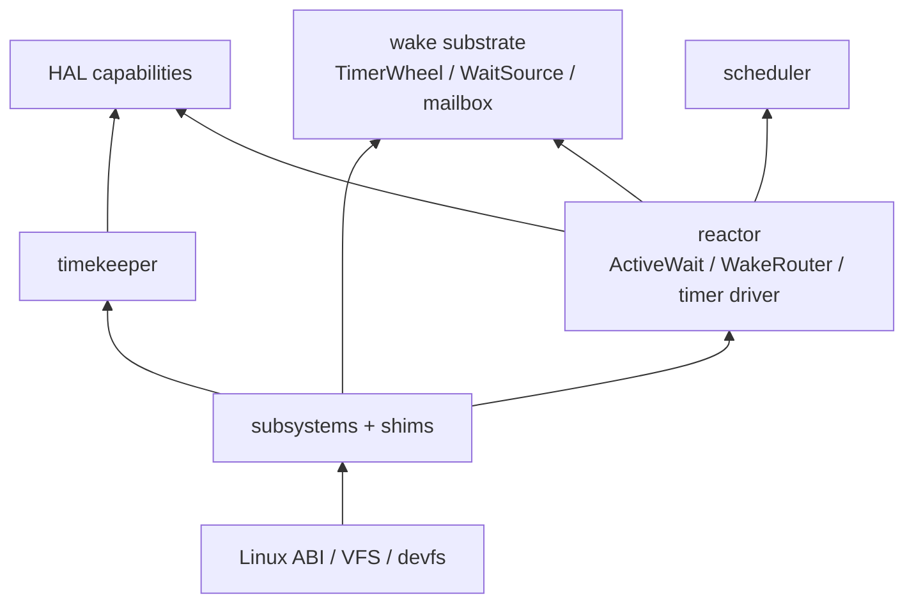

Rules:

- HAL exports capabilities, never semantic objects.
- Substrate stores wake registrations and events, never runnable placement.
- Reactor binds wait state to futures and routes events into scheduler
  placement.
- Scheduler owns task location and run-queue membership, never event payload
  semantics.
- Filesystem, timerfd, futex, signal, epoll, and delegate code consume the
  registrar/timekeeper surfaces; they do not program hardware timers.

This is the reason `TimerRegistrar` and `TimerRegistry` are separate. Producers
need to install a deadline; the reactor needs to drive expiry and reprogram
hardware. Neither side should import the other's implementation details.

### Interface Catalog

<!-- txdoc:TIME-WAKE-V1-INTERFACE-CATALOG-1 -->

The public interfaces in this design are intentionally small. Each one answers
one question:

| Interface | Question answered | Implemented by | Consumed by |
|---|---|---|---|
| `MonotonicCounterIf` | What is the current monotonic hardware time? | board platform | timekeeper, reactor, observation |
| `DeadlineTimerIf` | How does this hart get a future timer interrupt? | board platform | reactor timer driver |
| `PersistentClockIf` | Is there a persistent realtime source or alarm? | board platform / RTC driver backend | timekeeper seed/writeback, RTC device ops |
| `TimekeeperIf` | What is semantic monotonic/realtime time and generation? | `wall_clock` facade | syscalls, VFS timestamps, vDSO, timer conversion |
| `TimerRegistrar` | How does a producer arm a monotonic deadline? | timer registry handle | StepOp driver, shims, timerfd, delegate waits |
| `TimerRegistry` | What timers are due and when is the next one? | `TimerWheel` | reactor timer driver |
| `TimerWakeRouter` | How does timer expiry become a wake event? | reactor wake router | timer registry fire walk |
| `WakeRouter` | How does any wake event become scheduler placement? | reactor | wait-source, timer, delegate, signal, device paths |
| `RtcDeviceOps` | How does `/dev/rtc` expose Linux-shaped RTC behavior? | device adapter over persistent clock / emulation | devfs char-device dispatch |

The rule for adding a method is: add it to the interface that owns the state
being mutated. For example, an RTC alarm enable bit belongs in `RtcDeviceOps`
or the board RTC backend, not in `TimekeeperIf`; a realtime offset generation
belongs in `TimekeeperIf`, not in `PersistentClockIf`; a remote IPI decision
belongs in `WakeRouter`/scheduler, not in `TimerRegistry`.

### Canonical Paths

<!-- txdoc:TIME-WAKE-V1-CANONICAL-PATHS-1 -->

**Read time.**

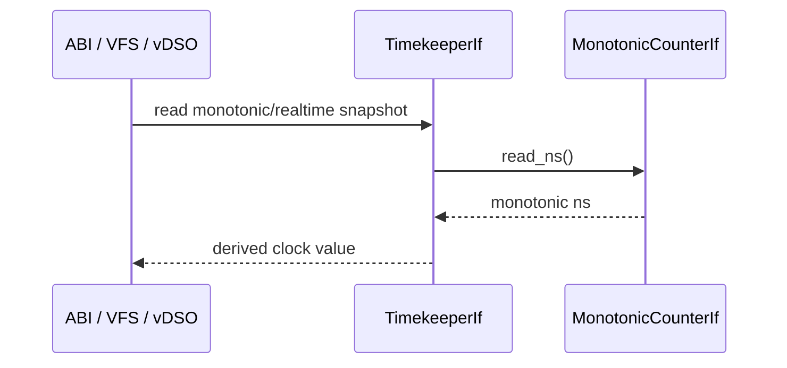

**Register a timeout.**

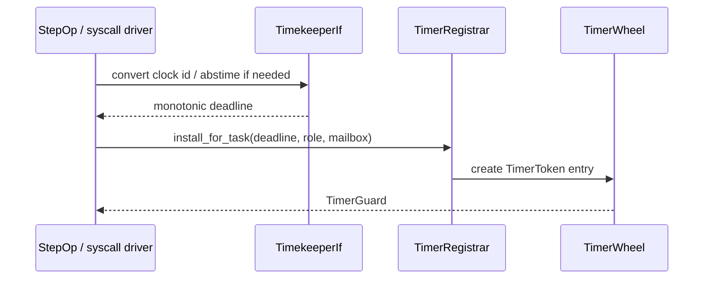

**Fire a timeout.**

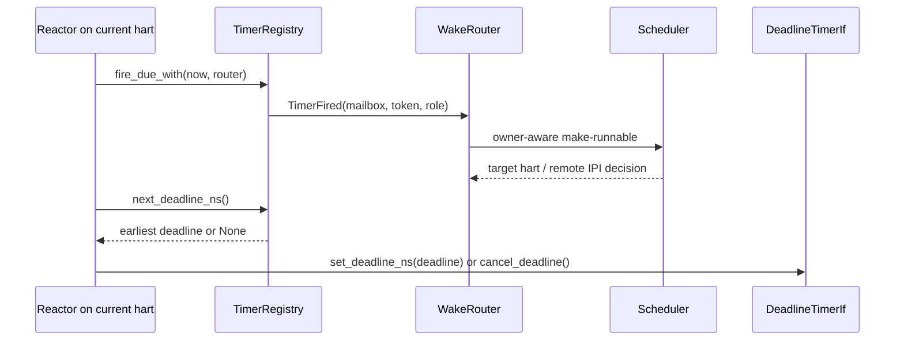

**Expose RTC.**

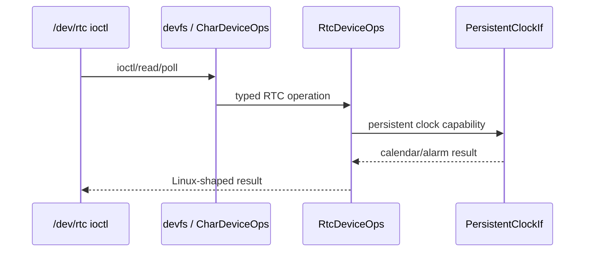

### End-To-End Scenario Map

<!-- txdoc:TIME-WAKE-V1-SCENARIO-MAP-1 -->

The same interfaces cover the common Linux-facing scenarios without adding
parallel paths:

| Scenario | Time source | Timer registration | Event route | Semantic owner |
|---|---|---|---|---|
| `clock_gettime(CLOCK_MONOTONIC)` | `TimekeeperIf -> MonotonicCounterIf` | none | none | timekeeper |
| `clock_gettime(CLOCK_REALTIME)` | `TimekeeperIf` offset over monotonic | none | none | timekeeper |
| `stat` timestamp update | `TimekeeperIf::realtime_now_ns` | none | none | filesystem/VFS policy |
| `nanosleep` relative timeout | `TimekeeperIf` converts now + delta | `PrimarySleep` | `TimerFired` | StepOp sleep state |
| `clock_nanosleep` realtime absolute | realtime generation + conversion | `PrimarySleep` | `TimerFired` or generation retry | sleep ABI state |
| `futex` timed wait | deadline conversion in shim/driver | `DeadlineAbort` | futex waiter retry | futex subsystem |
| `poll`/`select` timeout | deadline conversion in shim/driver | `DeadlineAbort` attached to wait source | wait-source or timeout event | poll/select state |
| `timerfd` interval | timerfd clock/generation state | registrar handle | timerfd readable event | timerfd object |
| delegate RPC timeout | subsystem deadline policy | `DelegateTimeout` | delegate token timeout | delegate registry |
| RTC read | persistent clock through device ops | none | ioctl return | RTC device |
| RTC alarm | persistent alarm or emulated deadline | RTC/device wake role | device readiness event | RTC device state |

This map should be used during implementation review. A new Linux ABI should
fit one of these rows or add a row with a named semantic owner. It should not
open a direct hardware path from syscall code to timer registers, RTC registers,
or scheduler run queues.

## Hardware Capability Layer

<!-- txdoc:TIME-WAKE-V1-HARDWARE-1 -->

HAL should expose hardware capabilities, not time semantics. The current
`TimeIf` is a mixed interface and is not part of the target architecture. It is
split into independent capability traits:

```rust
pub trait MonotonicCounterIf {
    fn read_ns() -> u64;
    fn frequency_hz() -> u64;
}

pub trait DeadlineTimerIf {
    fn set_deadline_ns(deadline_ns: u64);
    fn cancel_deadline();
    fn enable_timer_wakeups() {}
}
```

`MonotonicCounterIf` is clocksource-like: it answers "what monotonic time is it
now?" It must be cheap and non-decreasing enough for scheduler and reactor hot
paths.

`DeadlineTimerIf` is clockevent-like: it answers "interrupt this hart at this
absolute monotonic deadline." It must not know about task ids, mailboxes,
futures, wait protocols, or wall-clock offsets.

The target `TxPlatform` bound includes both traits directly. A temporary
compatibility aggregate may exist only inside a migration patch stack; it must
not remain as an active public interface after Package A exits.

### Hardware Sub-Architecture

<!-- txdoc:TIME-WAKE-V1-HARDWARE-SUBARCH-1 -->

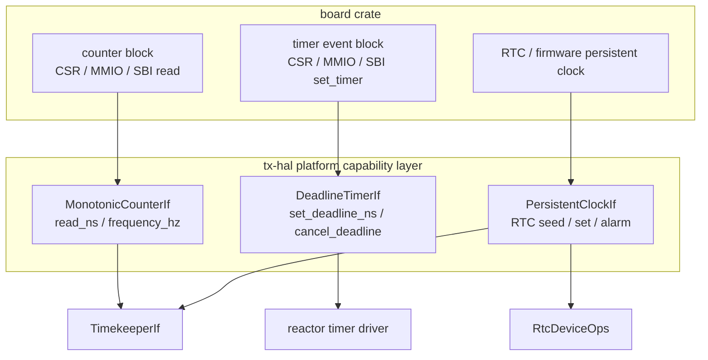

The board crate owns raw registers, SBI calls, MMIO bases, and interrupt
enablement. The generic kernel sees only the three capability surfaces above.
The split is deliberately hardware-shaped:

- A counter block can be read without arming an interrupt.
- A deadline timer can arm the current hart without deriving wall-clock time.
- An RTC can seed or expose persistent calendar time without participating in
  the hot monotonic path.

This matches the target boards: RV64 platforms may route both counter and
deadline through SBI-backed timer facilities, while LA64 may read a stable
counter and program a local timer CSR. The upper layers do not depend on whether
those are one hardware block or several.

Persistent wall-clock hardware gets a separate capability:

```rust
pub trait PersistentClockIf {
    fn read_realtime_ns() -> Result<u64, PersistentClockError>;
    fn set_realtime_ns(ns: u64) -> Result<(), PersistentClockError>;
    fn set_wake_alarm_ns(ns: u64) -> Result<(), PersistentClockError>;
    fn clear_wake_alarm() -> Result<(), PersistentClockError>;
}
```

This trait backs RTC seeding, `/dev/rtc`, wake alarms, and future writeback
policy. Normal `clock_gettime(CLOCK_REALTIME)` must not read the RTC hardware.

### Platform Mapping

<!-- txdoc:TIME-WAKE-V1-PLATFORM-MAPPING-1 -->

| Platform family | Monotonic counter | Deadline timer | Persistent clock |
|---|---|---|---|
| RV64 SiFive/QEMU-virt | `time` CSR / SBI time source | SBI `set_timer` or CLINT path | board RTC device if present |
| LA64 2K2000/QEMU-like | stable counter | local timer CSR/device | board RTC device if present |
| Host tests | callback clock / fake counter | callback deadline recorder | fake persistent clock |

The split matters because some platforms may use one hardware block for both
monotonic read and deadline interrupt, while others expose separate blocks. The
upper layers should not care.

### Board Backend Modeling

<!-- txdoc:TIME-WAKE-V1-BOARD-BACKENDS-1 -->

Each board crate should describe three independent hardware facts even when a
single physical block happens to supply more than one fact:

| Backend role | Board implementation responsibility | Must not expose |
|---|---|---|
| counter backend | read a stable counter and convert to monotonic nanoseconds | wall-clock offsets, task ids, timer tokens |
| deadline backend | program/cancel the current hart's next timer interrupt | software timer registry, wait reasons, scheduler queues |
| persistent-clock backend | read/set persistent Unix realtime and optionally program/clear wake alarm | vDSO state, `CLOCK_REALTIME` hot reads, RNode/devfs state |

For RV64 SiFive/QEMU-virt-like targets, the counter and deadline backend may
both be implemented using SBI timer facilities or a CLINT-compatible block.
For LA64 2K2000/QEMU-like targets, the counter and local timer programming may
come from different architectural facilities. RTC may be an MMIO peripheral,
firmware service, or unsupported. All three cases still implement the same
trait split.

The first real backend pass should land board by board:

1. prove `MonotonicCounterIf` and `DeadlineTimerIf` already map to the board's
   boot timer path;
2. add a `PersistentClockIf` implementation only when a real RTC or firmware
   service is available;
3. keep unsupported boards returning `PersistentClockError::Unsupported`;
4. add a board-level smoke witness that `/dev/rtc` returns unsupported or a
   plausible calendar value according to the platform capability.

### Board RTC Backend Profiles

<!-- txdoc:TIME-WAKE-V1-BOARD-RTC-PROFILES-1 -->

Real RTC support is board-specific, but it still follows the same three-role
split. The board crate owns register layout, MMIO mapping, interrupt number,
and hardware acknowledgement. The generic kernel sees only persistent-clock
capabilities and device-event publication.

| Board profile | Hardware fact | Persistent-clock backend | IRQ/event publication |
|---|---|---|---|
| RV64 QEMU virt | DTB exposes `google,goldfish-rtc` at `0x0010_1000`, size `0x1000`, PLIC IRQ `11` | board helper reads/writes the goldfish 64-bit Unix-ns registers and implements `PersistentClockIf`; unsupported register operations map to typed `PersistentClockError` | kernel registers an RTC IRQ handler for the board IRQ; handler acknowledges/clears the device interrupt through the board backend, then publishes `RtcEventMask::ALARM` into RTC device state |
| LA64 QEMU virt / LS7A-like | QEMU virt exposes an LS7A RTC MMIO block at `0x100d_0100`, size `0x100`, GSI `67` | board helper normalizes LS7A TOY calendar/register format into Unix nanoseconds before crossing `PersistentClockIf`; `set_wake_alarm_ns` programs `TOYMATCH0` | same kernel/device publication path; LS7A has no separate RTC clear/ack register, so acknowledgement is board-local no-op and IRQ controller completion owns the external IRQ edge |
| real SiFive / 2K2000 boards | DTB/manual must identify whether an RTC exists and whether it supports wake alarms | if no reliable persistent clock exists, return `Unsupported` and keep the emulated alarm path available where the ABI allows it | if no hardware alarm IRQ exists, no IRQ handler is registered; RTC read/poll still works for emulated events |

The reserved real-board interface is the same for all profiles:

```rust
impl PersistentClockIf for Platform {
    fn read_realtime_ns() -> Result<u64, PersistentClockError>;
    fn set_realtime_ns(ns: u64) -> Result<(), PersistentClockError>;
    fn set_wake_alarm_ns(ns: u64) -> Result<(), PersistentClockError>;
    fn clear_wake_alarm() -> Result<(), PersistentClockError>;
    fn acknowledge_wake_alarm_irq() -> Result<(), PersistentClockError>;
}

impl IrqIf for Platform {
    const RTC_IRQ: u32 = <board irq number or 0>;
}
```

For a real board, the platform crate should hide the concrete register or
firmware protocol behind a small board-local driver module. The generic kernel
must see only `PersistentClockIf`, `IrqIf::RTC_IRQ`, and the
`HalRtcDevice<P> -> RtcDeviceOps` adapter. A SiFive board may satisfy the
interface through a DTB-discovered external RTC or firmware service; a 2K2000
board may satisfy it through an LS7A/TOY-like MMIO block; a board with no
trusted RTC satisfies the same interface by returning typed `Unsupported`
results and keeping `RTC_IRQ = 0`.

The backend implementation should be a small board-local driver module, not
spread across syscall, devfs, or timekeeper code. A profile needs these
board-local tests before it is considered usable:

- `PlatformInfo::mmio_regions` includes the RTC MMIO range when the board uses
  MMIO RTC registers;
- split 64-bit register read/write helpers preserve the hardware-required
  ordering;
- `PersistentClockIf::read_realtime_ns` returns a plausible Unix-ns value or a
  typed error;
- `set_wake_alarm_ns` either programs the device and unmasks the IRQ, or
  returns `Unsupported` so the device layer can choose emulation;
- the IRQ handler path publishes a pending RTC event without requiring a VFS
  lookup or an epoch guard.

The RV64 QEMU virt DTB evidence for the first backend is:

```text
rtc@101000 {
    interrupts = <0x0b>;
    reg = <0x00 0x101000 0x00 0x1000>;
    compatible = "google,goldfish-rtc";
};
```

This evidence belongs in the board backend/profile test. The active design
contract remains the interface split above; a different board can satisfy it
with firmware calls, BCD/calendar MMIO registers, or no persistent clock at all.

### Hardware Capability Contracts

<!-- txdoc:TIME-WAKE-V1-HARDWARE-CONTRACTS-1 -->

Each hardware-facing trait has a different consistency contract:

| Capability | Consistency contract | Failure model | Hot path |
|---|---|---|---|
| monotonic counter | non-decreasing on a hart; cross-hart skew must be bounded enough for scheduler/timer comparisons | no fallible read in the generic interface; unstable hardware is a board bug or board-specific fallback choice | yes |
| deadline timer | arms the current hart for an absolute monotonic deadline; past deadlines fire as soon as possible | late interrupts are allowed; earlier-than-requested intentional arms are not | yes |
| persistent clock | returns Unix-realtime-like persistent time when available | fallible: unsupported, absent battery, invalid calendar, hardware error, range error | no |

The persistent-clock trait is intentionally fallible while the monotonic counter
is not. The kernel cannot make progress without a monotonic counter, but it can
boot with a fallback realtime epoch when RTC is absent or invalid.

Board implementations should normalize raw hardware into nanoseconds before it
crosses the HAL boundary. Generic timekeeper code must not know CSR frequency,
SBI timer units, CLINT register width, LA64 counter layout, or RTC
BCD/calendar encoding. Those are board-driver details.

### Error Model

<!-- txdoc:TIME-WAKE-V1-ERROR-MODEL-1 -->

Time/wake errors fall into three classes:

| Class | Examples | Handling rule |
|---|---|---|
| mandatory hardware failure | monotonic counter unavailable, deadline timer cannot be armed on an enabled hart | board/kernel bringup failure; the generic runtime cannot make Linux time promises |
| optional persistent-clock failure | no RTC, invalid RTC contents, alarm unsupported, set-time rejected | return a typed error to seed/device policy; keep monotonic and realtime fallback usable |
| semantic race | timer fires after cancel, task dies before wake, realtime generation changes during conversion | over-wake or retry; never corrupt scheduler placement or semantic object state |

`PersistentClockError` stays below Linux errno. It describes platform capability
failure: unsupported, invalid value, range, hardware fault, or busy state.
`RtcDeviceOps` maps that into device-level `RtcError`, and the syscall shim maps
`RtcError` into Linux errno such as `ENODEV`, `ENOTTY`, `EOPNOTSUPP`, `EINVAL`,
or `EIO` depending on the operation.

Timer expiry should almost never return an error upward. Its failure modes are
accounted as observations:

- cancelled entry found during fire walk;
- dead mailbox weak reference;
- mailbox owner generation mismatch;
- task already runnable or running;
- remote IPI requested;
- hardware deadline reprogrammed late.

The semantic owner re-checks state after wake. This is the same design rule as
Linux wait queues: a wakeup is permission to re-test the condition, not proof
that the condition is true.

## Core Timekeeper

<!-- txdoc:TIME-WAKE-V1-TIMEKEEPER-1 -->

`wall_clock` should become the core timekeeper facade. It is above HAL and below
syscalls, VFS timestamps, timerfd, and vDSO/vvar.

```rust
pub trait TimekeeperIf {
    fn monotonic_now_ns<P: MonotonicCounterIf>(&self) -> u64;
    fn realtime_now_ns<P: MonotonicCounterIf>(&self) -> u64;
    fn set_realtime_ns<P: MonotonicCounterIf>(
        &self,
        realtime_ns: u64,
    ) -> Result<u64, WallClockError>;
    fn seed_realtime_ns<P: MonotonicCounterIf>(
        &self,
        realtime_ns: u64,
    ) -> Result<u64, WallClockError>;
    fn seed_realtime_from_persistent<P: MonotonicCounterIf + PersistentClockIf>(
        &self,
    ) -> Result<u64, RealtimeSeedError>;
    fn realtime_generation(&self) -> u64;
    fn realtime_offset_ns(&self) -> i64;
    fn monotonic_deadline_from_realtime_ns(&self, realtime_ns: u64) -> u64;
    fn snapshot_for_vvar<P: MonotonicCounterIf>(&self) -> VvarSnapshot;
    fn publish_vvar<P: MonotonicCounterIf>(&self);
}
```

Responsibilities:

- derive `CLOCK_REALTIME` from monotonic time plus `realtime_offset_ns`;
- keep a generation counter for discontinuous realtime changes;
- publish vDSO/vvar snapshots;
- convert absolute realtime deadlines to monotonic deadlines;
- notify timerfd/alarmtimer-like consumers when realtime jumps;
- seed initial realtime from `PersistentClockIf` when available.

The timekeeper does not program hardware interrupts. It supplies timestamps and
deadline conversions to the timer core and ABI layers.

### Timekeeper Interface Contract

<!-- txdoc:TIME-WAKE-V1-TIMEKEEPER-CONTRACT-1 -->

`TimekeeperIf` is the only semantic time facade that upper layers should name.
Its methods divide into four groups:

| Method group | Consumers | Contract |
|---|---|---|
| monotonic reads | scheduler, reactor, time syscalls, timeout conversion | cheap monotonic nanoseconds derived from `MonotonicCounterIf` |
| realtime reads | `CLOCK_REALTIME`, `gettimeofday`, VFS timestamps | monotonic plus current realtime offset, never an RTC hot read |
| realtime mutation | `clock_settime`, `settimeofday`, future RTC writeback policy | update offset, bump generation, publish vvar, notify realtime-sensitive timer objects |
| publication/conversion | vDSO/vvar, timerfd, realtime absolute sleeps | stable snapshot and realtime-to-monotonic conversion under the current generation |

Raw public `wall_clock::*` runtime free functions and a public `WallClock`
storage type are retired active interfaces. Cross-module code must import
`TimekeeperIf` and call `timekeeper()`; same-module implementation helpers may
remain private, and test-only reset hooks may remain cfg-gated. This keeps the
call site explicit about whether it is reading time, mutating realtime policy,
publishing a vDSO snapshot, or carrying the realtime-change notification seam
into timerfd.

### Timekeeper State Model

<!-- txdoc:TIME-WAKE-V1-TIMEKEEPER-STATE-1 -->

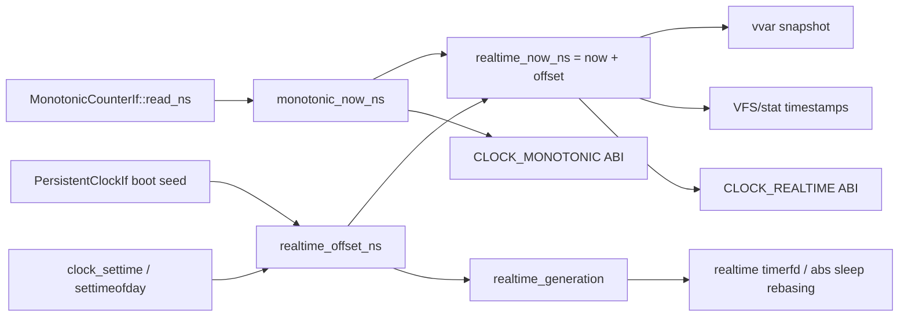

The timekeeper's durable state is small:

- `realtime_offset_ns`: signed offset from monotonic to realtime.
- `realtime_generation`: increments on discontinuous realtime changes.
- `vvar` snapshot: read-mostly publication for user fast paths.
- optional boot seed provenance: whether realtime came from RTC, firmware, or a
  fallback epoch.

Every reader observes time through this facade. Filesystems use it to stamp
inode updates; syscall shims use it for POSIX clock APIs; timerfd and
`clock_nanosleep(CLOCK_REALTIME, TIMER_ABSTIME)` use it to convert realtime
absolute deadlines into monotonic deadlines and to detect generation changes.

### Boot Seed And Realtime Mutation Flow

<!-- txdoc:TIME-WAKE-V1-BOOT-SEED-1 -->

Realtime initialization is a one-way seed into the timekeeper, not a permanent
dependency from `CLOCK_REALTIME` back to RTC:

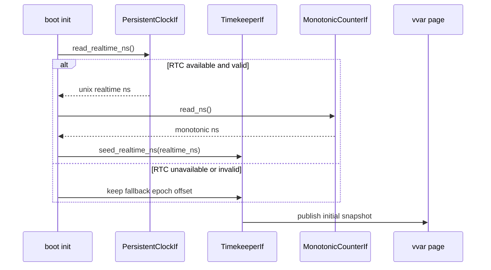

The seed operation computes `realtime_offset_ns = realtime_ns - monotonic_now`.
It should record provenance for observation (`rtc`, `firmware`, `fallback`) but
must not make later realtime reads re-enter RTC.

Runtime realtime mutations follow the same timekeeper path:

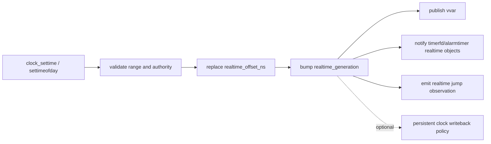

RTC writeback is policy, not the definition of realtime. A writeback failure
must not roll back the already-accepted timekeeper mutation unless the ABI
operation specifically promised persistent-clock update semantics.

### Persistent Writeback Policy

<!-- txdoc:TIME-WAKE-V1-PERSISTENT-WRITEBACK-1 -->

There are three different "set time" operations, and the design keeps them
separate:

| Operation | Mutates timekeeper? | Mutates persistent clock? | User-visible rule |
|---|---|---|---|
| `clock_settime(CLOCK_REALTIME)` / `settimeofday` | yes | best-effort policy hook | success means kernel realtime changed; persistent writeback failure is observable but does not roll back the clock |
| `/dev/rtc` `RTC_SET_TIME` | no, unless an explicit synchronization policy chooses to do so | yes | success means the RTC/persistent clock accepted the new calendar value |
| boot/resume seed | yes | no | persistent clock is an input sample only |

The target helper shape is an explicit policy boundary above `TimekeeperIf`:

```rust
pub enum PersistentWritebackPolicy {
    Disabled,
    BestEffort,
    Required,
}

pub struct RealtimeSetReport {
    pub generation: u64,
    pub persistent_result: Option<Result<(), PersistentClockError>>,
}
```

`TimekeeperIf::set_realtime_ns` remains the semantic realtime mutation. A
kernel or shim helper may wrap it with `PersistentClockIf::set_realtime_ns`
according to `PersistentWritebackPolicy`, but the ordering is fixed:

1. validate authority and realtime range;
2. mutate the timekeeper offset;
3. bump `realtime_generation`;
4. publish vvar and notify realtime-sensitive timer objects;
5. attempt persistent writeback if policy asks for it;
6. report the writeback outcome separately from the timekeeper generation.

`BestEffort` is the default Linux-compatible system-clock policy for v1 because
Linux system time and RTC time are not the same object. `Required` is reserved
for operations whose ABI contract is specifically "set the persistent clock",
such as `/dev/rtc` `RTC_SET_TIME`; those operations should call
`RtcDeviceOps::set_time`, not `TimekeeperIf::set_realtime_ns` directly.

This prevents two common bugs:

- `clock_gettime(CLOCK_REALTIME)` accidentally becoming an RTC hot read after
  a successful `RTC_SET_TIME`;
- `clock_settime` succeeding in the timekeeper and then being reported as a
  total failure only because the optional RTC writeback failed.

### Clock Semantics

<!-- txdoc:TIME-WAKE-V1-CLOCK-SEMANTICS-1 -->

The first implementation should treat these clock classes explicitly:

| Clock class | Tx source | Notes |
|---|---|---|
| `CLOCK_MONOTONIC` | `MonotonicCounterIf` through `TimekeeperIf` | Non-decreasing since boot epoch; not affected by `clock_settime` |
| `CLOCK_REALTIME` | monotonic now plus `realtime_offset_ns` | Discontinuous changes bump `realtime_generation` |
| `CLOCK_BOOTTIME` | initially aliasable to monotonic | Separate suspend accounting can be added later |
| `CLOCK_MONOTONIC_RAW` | initially monotonic counter with no discipline | NTP discipline is deferred |
| CPU clocks | process/thread accounting | Out of this document except for timestamp source consistency |

Realtime absolute timers must remember the generation they were converted
against. On resume, one of three policies is valid, selected by the owning ABI
object:

- **rebase**: recompute the monotonic deadline when realtime jumps;
- **expire**: if the new realtime is past the target, publish the event;
- **generation-mismatch retry**: wake the task and let the syscall or object
  re-evaluate under fresh timekeeper state.

The timekeeper supplies generation and conversion helpers. Timerfd,
`clock_nanosleep`, and alarmtimer-like objects own the ABI policy.

## Software Timer Registry

<!-- txdoc:TIME-WAKE-V1-TIMER-REGISTRY-1 -->

Software timers are wake-substrate state. The registry stores deadline
registrations; it does not own syscall objects or semantic timerfd state.

Use two narrow facets:

```rust
pub trait TimerRegistrar {
    fn install_for_task(
        &self,
        deadline: Deadline,
        role: TimerGuardRole,
        mailbox: Weak<TaskMailbox>,
    ) -> TimerGuard;
}

pub trait TimerRegistry {
    fn fire_due_with(
        &self,
        now_ns: u64,
        router: &mut dyn TimerWakeRouter,
    ) -> usize;

    fn next_deadline_ns(&self) -> Option<u64>;
}

pub trait TimerWakeRouter {
    fn post_timer_fired(
        &mut self,
        mailbox: Weak<TaskMailbox>,
        token: TimerToken,
        role: TimerGuardRole,
    );
}
```

`TimerRegistrar` is used by wait resolvers and subsystem adapters. `TimerRegistry`
is used by the reactor driver. This separation keeps timer producers from
depending on reactor internals and keeps the reactor from knowing timerfd,
nanosleep, futex, or delegate semantics.

`TimerWakeRouter` is the substrate-facing timer-expiry facet. The reactor-owned
`WakeRouter` below can implement it while carrying `current_hart`, scheduler
handles, and IPI signaling state as reactor context. The registry should not
take `current_hart` directly because the registry does not own placement.

### Timer Registry Sub-Architecture

<!-- txdoc:TIME-WAKE-V1-TIMER-REGISTRY-SUBARCH-1 -->

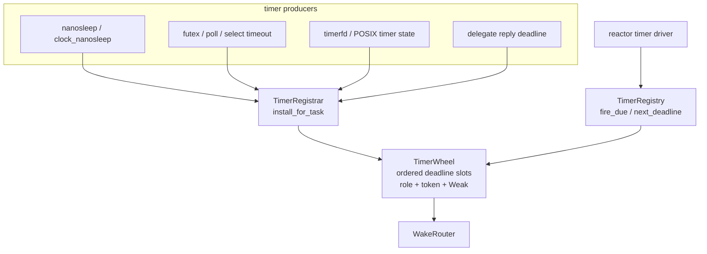

The registry stores only deadline registrations. A timerfd object's interval,
overrun count, clock id, flags, and file readiness remain timerfd subsystem
state. A futex waiter remains futex state. A delegate token remains delegate
state. The registry's role is to remember: at monotonic deadline `D`, post wake
role `R` to mailbox `M` unless the guard was cancelled first.

The expected `TimerWheel` entry fields are:

| Field | Purpose |
|---|---|
| `deadline_ns` | monotonic absolute expiry |
| `token` | resume/cancel correlation id |
| `role` | `PrimarySleep`, `DeadlineAbort`, `DelegateTimeout`, or future role |
| `mailbox: Weak<TaskMailbox>` | task-owned inbox; not a CPU location |
| `generation` | optional wait-generation or timer-generation anti-stale check |

The wheel may be a timing wheel, heap, RB-tree, or hybrid internally. Its public
contract is the registrar/registry split, not the data structure choice.

### Timer Registry Semantics

<!-- txdoc:TIME-WAKE-V1-TIMER-REGISTRY-SEMANTICS-1 -->

The registry exposes five semantic operations even if the concrete type has
more helpers:

| Operation | Consumer | Requirement |
|---|---|---|
| install | wait resolver, timerfd, delegate, subsystem timeout | returns a guard and a token before the task parks |
| cancel | guard drop | makes a future fire harmless or impossible |
| fire due | reactor timer driver | removes due entries and invokes a router |
| query next | reactor timer driver | returns the earliest live monotonic deadline |
| stale cleanup | registry internals | drops dead weak mailboxes and cancelled entries |

Fire/cancel races are resolved by guard ownership:

- If cancellation wins before the fire walk removes the entry, the entry does
  not route an event.
- If the fire walk wins first, the event may be posted, and the future must
  re-observe semantic state before completing.
- If the mailbox weak reference is stale, the entry is retired with no
  scheduler action.
- A timer event is a hint. It does not prove the original condition still
  holds.

The registry must not expose a method that returns raw due entries to arbitrary
subsystems. Due-entry routing is a reactor responsibility because only the
reactor can pair mailbox delivery with scheduler placement.

### Registration Lifetime And Cancellation

<!-- txdoc:TIME-WAKE-V1-TIMER-LIFETIME-1 -->

Timer registration lifetime is guard-shaped:

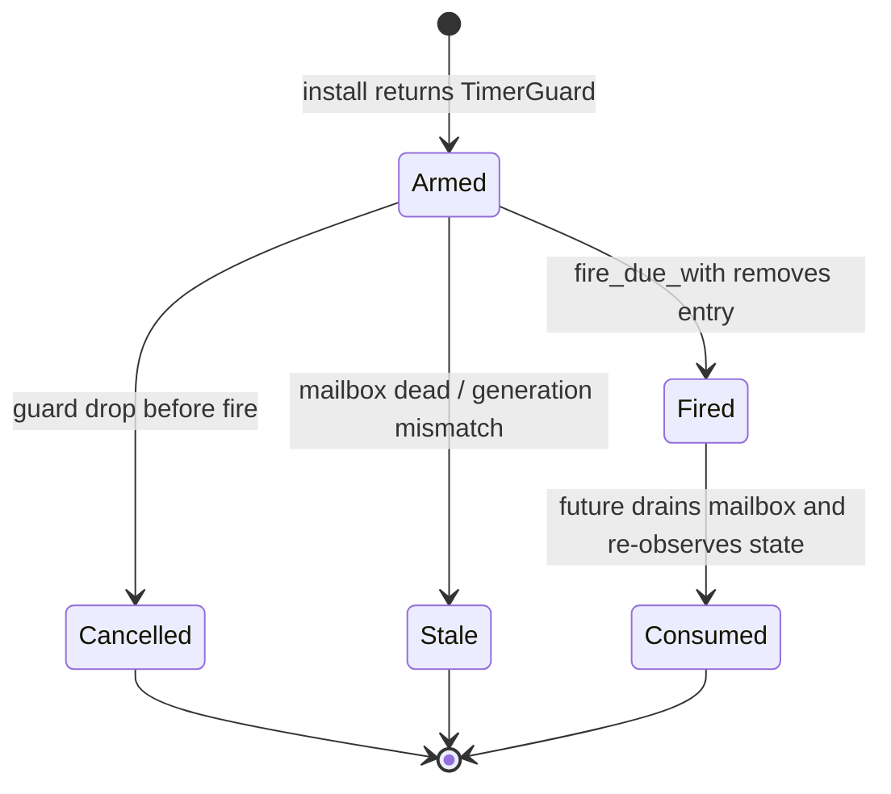

The guard is not a completion token. It is cancellation authority over a wheel
entry. Completion is observed by the future or subsystem after it drains a
mailbox event and re-checks semantic state. This keeps timer races harmless:
the registry can over-wake, but the owning subsystem decides whether the
condition is actually complete, timed out, interrupted, or stale.

### Timer Roles

<!-- txdoc:TIME-WAKE-V1-TIMER-ROLES-1 -->

The existing `TimerGuardRole` catalog is the right axis:

| Role | Meaning | Resume effect |
|---|---|---|
| `PrimarySleep` | The primary wait is time itself: `nanosleep`, `clock_nanosleep`, alarmtimer-style waits | resume with `TimerExpired(token)` |
| `DeadlineAbort` | A timeout attached to another primary wait: poll/select/futex/delegate wait with a protocol deadline | abort primary wait with timed-out outcome |
| `DelegateTimeout` | A deadline on an outstanding delegate token reply | mark delegate token timed out and wake waiter |
| `DeviceEvent` | A device-owned deadline that publishes into device state, such as an emulated RTC alarm | update device pending state; task wake proceeds through the device wait source |

Do not represent `OnWaitSource + timeout` as `OnWaitSource + OnTimer`. In the
step model, `OnTimer` is a primary timer wait. Deadlines over non-timer waits
are `WaitProtocol` attachments realized by a driver-installed `TimerGuard`.

## Future And Step Integration

<!-- txdoc:TIME-WAKE-V1-FUTURE-STEP-1 -->

Futures must not own private timer wheels. A future may hold active wait state,
including a guard returned by the shared timer registry, but it must not hold an
independent timeout queue.

Target active-wait shape:

```rust
pub struct ActiveWait {
    primary: ActiveYieldShape,
    deadline_guard: Option<TimerGuard>,
}

pub enum ActiveYieldShape {
    OnWaitSource {
        guard: WaitRegistrationGuard,
    },
    OnAgent {
        token_guard: AgentTokenGuard,
    },
    OnTimer {
        timer_guard: TimerGuard,
        token: TimerToken,
    },
}
```

Drop order matters:

1. Drop the timer guard first so a racing timer walk cannot fire a stale timer
   after the primary wait is abandoned.
2. Drop the primary wait guard or delegate token guard.
3. Update semantic state under fresh guards on the next step retry or resume.

The future owns continuation state. The timer registry owns only the wake
registration.

### ActiveWait Driver Logic

<!-- txdoc:TIME-WAKE-V1-ACTIVE-WAIT-LOGIC-1 -->

The driver resolves a `YieldShape` into an `ActiveWait` in four phases:

1. Build the primary wait guard from the shape.
2. If `WaitProtocol` carries a deadline, convert it through `TimekeeperIf` and
   install a `DeadlineAbort` guard in `TimerRegistrar`.
3. Park the task by publishing the prepared wait generation to its mailbox.
4. Return `Pending`; a later mailbox event produces `ResumeOutcome`.

For `YieldShape::OnTimer`, phase 1 is the timer itself and phase 2 is invalid:
`OnTimer + WaitProtocol.deadline` would mean "timeout a timeout" and must be
rejected by the driver.

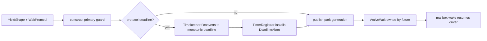

## Reactor Responsibilities

<!-- txdoc:TIME-WAKE-V1-REACTOR-1 -->

The reactor has two time-related roles:

1. **Timer driver**: advance the software registry from a monotonic `now_ns` and
   reprogram the hardware deadline to the earliest pending timer.
2. **Wake router**: convert timer, wait-source, signal, and delegate events into
   scheduler-aware runnable placement.

The timer driver loop is:

```rust
fn reactor_timer_step<P: DeadlineTimerIf>(
    now_ns: u64,
    current_hart: HartId,
    registry: &impl TimerRegistry,
    scheduler: &ReactorScheduler,
) {
    let mut router = ReactorWakeRouter::new(current_hart, scheduler);
    registry.fire_due_with(now_ns, &mut router);

    match registry.next_deadline_ns() {
        Some(deadline) => P::set_deadline_ns(deadline),
        None => P::cancel_deadline(),
    }
}
```

The reactor may own per-reactor or per-hart timer registries. In either case,
the hardware deadline programmed on a hart is the earliest deadline that hart is
responsible for driving. If the registry is global, the implementation needs a
single driver owner or a claim protocol to avoid duplicate fire walks. If the
registry is per-hart, cross-hart registration must either insert into the target
hart's registry or send an IPI to make the target reprogram its deadline.

The v1 recommendation is:

- keep one registry per reactor while the boot reactor remains the dominant
  execution context;
- expose the registrar as a cloneable handle for current task polls;
- move to per-hart shards only after `TaskMailbox.post` is scheduler-routed and
  AP user task execution is fully enabled.

### Reactor Timer Loop And Hardware Deadline

<!-- txdoc:TIME-WAKE-V1-REACTOR-TIMER-LOOP-1 -->

The timer interrupt handler should do the minimum needed to enter reactor-owned
timer work. The reactor step owns the order:

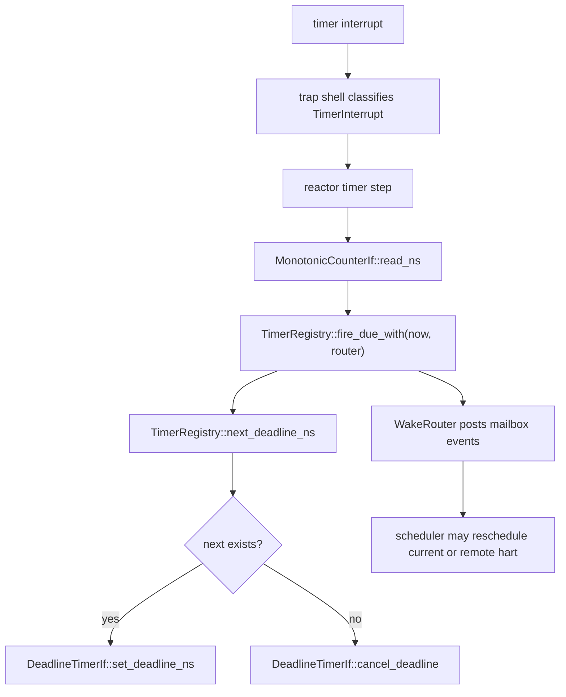

The reactor timer loop is the only code that translates the software registry's
earliest deadline into a hardware deadline. Producers never call
`DeadlineTimerIf` directly. This keeps hardware reprogramming policy in one
place and prevents races where several subsystems independently arm the same
per-hart timer.

### Reactor Idle Contract

<!-- txdoc:TIME-WAKE-V1-REACTOR-IDLE-1 -->

Before a hart enters idle, the reactor must have reconciled three sources of
future work:

1. runnable queues and local pending tasks;
2. pending mailbox/wait/delegate events that can make a task runnable;
3. the earliest timer deadline the hart is responsible for driving.

The idle path is allowed only after the timer driver has produced a deadline
action:

| Deadline action | Hardware action | Meaning |
|---|---|---|
| `Arm { deadline_ns }` | `DeadlineTimerIf::set_deadline_ns(deadline_ns)` | wake this hart for the earliest owned timer |
| `Cancel` | `DeadlineTimerIf::cancel_deadline()` | no timer work is currently owned by this hart |

If a timer is installed after this decision and its deadline is earlier than
the programmed hardware deadline, the install path must either make the driver
hart re-run the timer step or record a deadline-change flag checked before idle
becomes final. This is the global-registry equivalent of Linux's clockevent
reprogramming rule.

## Wake Router

<!-- txdoc:TIME-WAKE-V1-WAKE-ROUTER-1 -->

`WakeRouter` is the missing boundary between wake-substrate events and scheduler
placement. It should be the only path that turns a task-owned mailbox event into
a runnable queue insertion.

```rust
pub trait WakeRouter {
    fn post_timer_fired(
        &mut self,
        mailbox: Weak<TaskMailbox>,
        token: TimerToken,
        role: TimerGuardRole,
    );

    fn post_source_fired(
        &mut self,
        mailbox: Weak<TaskMailbox>,
        event: SourceWakeEvent,
    );

    fn post_agent_replied(
        &mut self,
        mailbox: Weak<TaskMailbox>,
        token: DelegateTokenId,
    );
}
```

The router performs:

1. Upgrade `Weak<TaskMailbox>`.
2. Push the wake hint into the mailbox event queue.
3. Resolve the owning task id.
4. Ask the scheduler to make that task runnable using the current SMP wake
   protocol.
5. Send a reschedule IPI if the selected target hart is remote.

The router must not trust the hart that registered the timer or the hart that
last polled the future. It must route through scheduler owner state.

### WakeRouter Sub-Architecture

<!-- txdoc:TIME-WAKE-V1-WAKE-ROUTER-SUBARCH-1 -->

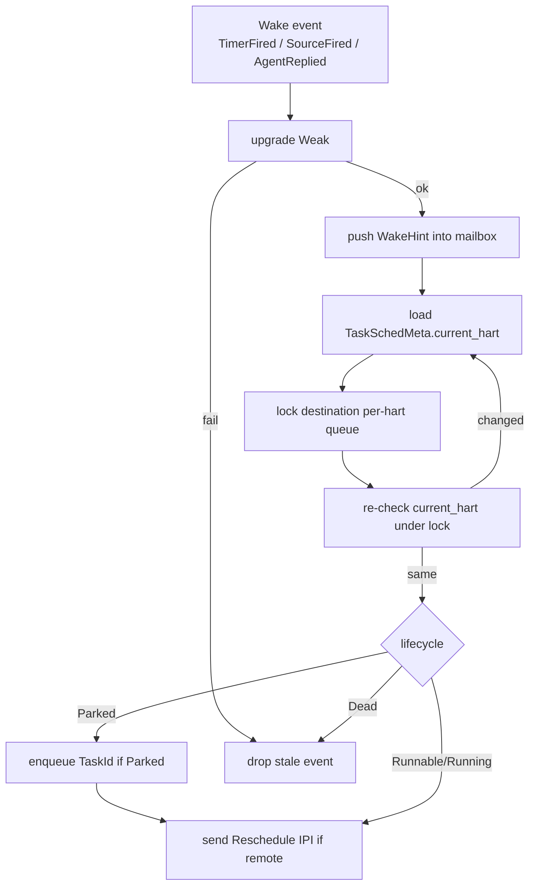

This is the same lock-and-recheck pattern as `SCHED-SMP-2`. The wake event and
the scheduler transition are separate but adjacent: the mailbox records *why*
the task should retry, while the scheduler records *where* the task can next be
polled.

### Owner-Aware Post Primitive

<!-- txdoc:TIME-WAKE-V1-OWNER-AWARE-POST-1 -->

Package G should not create one scheduler hook per wake class. The target is a
single owner-aware post primitive with wake-class-specific adapters at the
edge:

```rust
pub enum WakeHint {
    TimerFired {
        token: TimerToken,
        role: TimerGuardRole,
    },
    SourceFired(SourceWakeEvent),
    DelegateReplied(DelegateTokenId),
    SignalPending(SignalWakeEvent),
    DeviceReady(DeviceWakeEvent),
    Cancelled(CancelWakeEvent),
}

pub trait OwnerAwareWakePost {
    fn post_to_owner(
        &mut self,
        mailbox: Weak<TaskMailbox>,
        hint: WakeHint,
    ) -> WakePostOutcome;
}
```

The adapters do only payload construction:

- `TimerWakeRouter::post_timer_fired` builds `WakeHint::TimerFired`.
- `WaitSource::notify` builds `WakeHint::SourceFired`.
- delegate completion builds `WakeHint::DelegateReplied`.
- signal delivery builds `WakeHint::SignalPending` after signal state selects
  the task.
- device readiness builds `WakeHint::DeviceReady` after the device records the
  readiness bit.

`post_to_owner` then performs the common sequence: upgrade mailbox, enqueue the
hint, resolve immutable mailbox owner, lock/re-check scheduler owner, enqueue
if parked, and send a remote reschedule IPI when needed. The returned
`WakePostOutcome` is for observation and tests, not for semantic completion:

| Outcome | Meaning |
|---|---|
| `QueuedLocal` | hint posted and parked owner queued on this hart |
| `QueuedRemote` | hint posted and parked owner queued on another hart; IPI requested |
| `AlreadyRunnable` | hint posted; no duplicate queue insertion |
| `AlreadyRunning` | hint posted; current or next poll will observe it |
| `DeadOwner` | mailbox or task generation is stale; event dropped |
| `MailboxFull` | overflow flag set; owner is still woken so the driver can rescan |

The primitive lives in reactor-owned code because only the reactor has
scheduler and IPI context. A small trait may be declared in `tx-substrate::wake`
only if it remains a substrate-facing callback surface and does not import
scheduler types into substrate.

Current implementation note: the concrete helper is named
`ReactorOwnerWakePost`. It already implements the shared route for
`TimerWakeRouter::post_timer_fired`, `HartRuntimeView::drain_wakes_for_hart`,
and the public reactor entry
`Reactor::post_mailbox_event_from_hart(mailbox, event, current_hart, signal)`.
That public entry is the approved bridge for wake producers that already have a
reactor handle, current hart, and reschedule-signal context. Producers without
that context must continue publishing to their subsystem wait source; they
must not pull scheduler placement into substrate or semantic objects just to
call this helper earlier.

### Wake-Class Convergence

<!-- txdoc:TIME-WAKE-V1-WAKE-CLASS-CONVERGENCE-1 -->

All asynchronous kernel wake classes should converge on the same owner-aware
posting boundary:

| Wake class | Producer-side state | Mailbox event | Scheduler action |
|---|---|---|---|
| timer expiry | `TimerWheel` entry | `TimerFired(token, role)` | make mailbox owner runnable |
| wait-source readiness | `WaitSource` subscriber | `SourceFired(source, generation, mask)` | make mailbox owner runnable |
| delegate reply | `DelegateRegistry` token | `AgentReplied(token)` or timeout event | make mailbox owner runnable |
| signal delivery | process/thread signal state | `SignalDelivered` | make target task runnable if blocked interruptibly |
| device readiness | device wait source | source/device readiness event | make subscriber task runnable |

The router does not interpret the event payload. It only posts it and runs the
scheduler wake protocol. The resumed future or StepOp is responsible for
draining events and re-observing the semantic object.

This split is what lets timer and non-timer wakes share SMP correctness without
forcing every subsystem to understand run queues. It also lets future
priority-policy changes live in the scheduler instead of leaking into every
wait source.

### Mailbox Owner Binding

<!-- txdoc:TIME-WAKE-V1-MAILBOX-OWNER-1 -->

The router needs an authoritative owner identity for each task mailbox. Trace
fields such as `task_id_low` are not sufficient: they are observation metadata,
can be zero for kernel actors, and are not guaranteed to match reactor
`TaskId`.

The target owner binding is:

```rust
pub struct MailboxOwner {
    task: TaskId,
    generation: TaskGeneration,
}

pub trait TaskMailboxOwnerIf {
    fn owner(&self) -> Option<MailboxOwner>;
}
```

The owner is assigned when the reactor creates the task and mailbox. It is
immutable for the mailbox lifetime. Task migration changes
`TaskSchedMeta.current_hart`, not the mailbox owner. Task death invalidates the
owner through task-table lookup or generation mismatch.

This gives the router a safe sequence:

1. Upgrade `Weak<TaskMailbox>`.
2. Read `MailboxOwner`.
3. Post the mailbox event.
4. Resolve `(TaskId, TaskGeneration)` in the task table.
5. If the task is still alive and the generation matches, run the scheduler
   wake protocol.

The target route deliberately avoids `TaskMailbox::post -> Waker` as the
authoritative wake path. A local `Waker` may remain an optimization inside a
currently polled future, but the scheduler-routed owner path is the correctness
path.

## SMP And Work-Stealing Correctness

<!-- txdoc:TIME-WAKE-V1-SMP-1 -->

The wake-vs-steal race is the central SMP hazard:

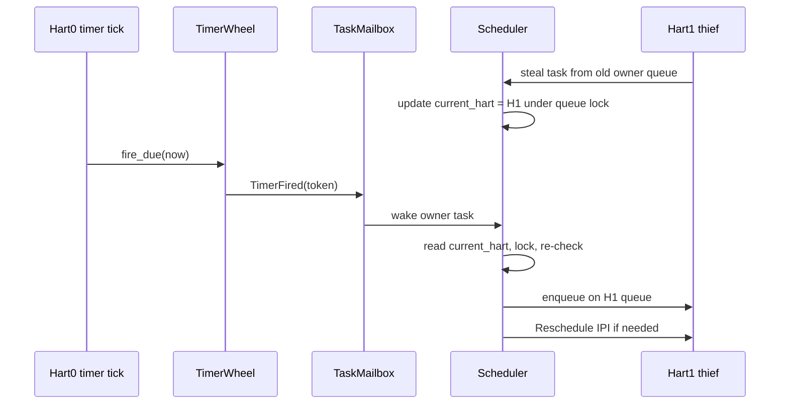

Correctness rules:

- `current_hart` is the authoritative owner.
- Timer registrations store `Weak<TaskMailbox>`, not `HartId`.
- The mailbox does not move when the task migrates.
- Wake routing reads current owner at fire time.
- Cross-hart enqueue follows `SCHED-SMP-2`: read target, lock destination,
  re-read target under lock, retry if it changed.
- If the task is already runnable or running, do not double-enqueue; leave the
  event in the mailbox for the next poll to drain.
- If the task is dead or the weak mailbox cannot upgrade, retire the timer entry
  and optionally count a stale wake.

Current `TaskMailbox::post -> Waker -> TaskWakeState -> captured wake_queue` is
a legacy compatibility path. It is not the final SMP-safe path because the
captured queue can be stale after migration. The final path is
`TaskMailbox::post_event -> WakeRouter -> Scheduler`.

### Race Matrix

<!-- txdoc:TIME-WAKE-V1-RACE-MATRIX-1 -->

| Race | Losing side must observe | Required mechanism |
|---|---|---|
| timer fire vs guard drop | either no event is routed, or a harmless stale event is posted | guard cancellation bit / removed entry plus semantic re-check after wake |
| timer fire vs task exit | weak mailbox upgrade fails or task generation mismatches | `Weak<TaskMailbox>` plus task-table generation check |
| timer fire vs task steal | wake routes to the post-steal owner | `current_hart` read, destination queue lock, re-check, retry |
| timer fire vs task already runnable | event remains in mailbox, no duplicate enqueue | scheduler lifecycle test before enqueue |
| timer install vs reactor idle | earlier deadline reprograms or wakes driver hart | deadline-change flag, driver signal, or shard-local IPI |
| realtime set vs realtime absolute timer | timerfd/sleep observes generation mismatch or rebase policy | `realtime_generation` captured by semantic owner |
| RTC alarm interrupt vs RTC file close | event is recorded or dropped by RTC device state, not by scheduler directly | device wait source and owner-aware wake route |
| wait-source ready vs timeout | StepOp resumes and re-observes semantic state to pick ready, timeout, interrupted, or retry | mailbox hint ordering plus semantic object locks |

The race matrix is more important than exact data-structure choice. A heap,
wheel, RB-tree, or per-hart shard is acceptable only if every row still has a
clear losing-side observation and a bounded retry/drop rule.

### Cross-Hart Registration And Reprogramming

<!-- txdoc:TIME-WAKE-V1-CROSS-HART-REGISTRATION-1 -->

There are two independent cross-hart questions:

1. Which hart owns the task that will be woken?
2. Which hart is responsible for driving the timer registry containing the
   deadline?

The first is always answered at fire time by scheduler owner state. The second
is a registry-sharding policy.

For the v1 global-registry phase:

- any hart may install into the shared registry through `TimerRegistrar`;
- the reactor timer driver must re-read `next_deadline_ns()` after every fire
  walk and after any install path that may create an earlier deadline;
- if a non-driver hart installs an earlier deadline, it must signal the driver
  hart or set a shared "deadline changed" flag that the driver consumes before
  sleeping;
- duplicate fire walks are forbidden unless the registry implements a claim
  protocol.

For the later per-hart-sharded phase:

- local task waits install into the current owner hart's shard;
- remote registration either inserts into the target shard under that shard's
  lock or sends an IPI/tasklet to the target hart to install locally;
- migration does not move existing timer entries. Expiry still routes through
  the owner-aware wake path, so a timer registered before stealing can wake the
  post-steal owner correctly;
- hardware deadline programming is per hart and uses that hart's shard
  earliest deadline.

This means timer sharding is a performance choice, not a correctness mechanism.
Correctness comes from wake routing through current owner state.

### Future Stealing And Runtime Placement

<!-- txdoc:TIME-WAKE-V1-FUTURE-STEALING-1 -->

Time management must remain valid when reactor tasks are moved between harts.
The target rule is:

**A future may migrate; its mailbox identity stays stable; its scheduler owner
is resolved at wake time.**

This is the same separation used by mature async runtimes in different forms:
the timer or IO driver records readiness against a task handle, while worker
selection is an executor or scheduler decision. Tx's kernel version is stricter
because a wake may cross harts after a task has been stolen, and because the
resumed work is a kernel future/StepOp rather than an application future.

The split has three state objects:

| State | Owner | Moves on steal? | Used by timer/wait producer? |
|---|---|---|---|
| future continuation | reactor task | yes, logically follows the task | no |
| task mailbox | reactor task runtime | no; stable identity for wake hints | yes, through `Weak<TaskMailbox>` |
| current hart / runqueue membership | scheduler metadata | yes; updated under scheduler locks | no, resolved by router |

Timer and wait registrations therefore store only a mailbox reference plus a
role/generation token. They do not store `HartId`, per-hart queue pointers, or
captured local wakers as placement authority.

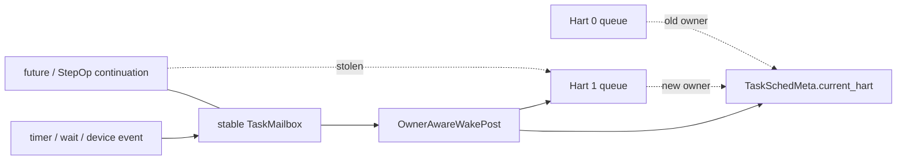

The stealing sequence and the wake sequence deliberately meet only at scheduler
metadata:

1. A thief removes a runnable/preempted task from the victim queue while holding
   the scheduler lock required by `SCHED-SMP-2`.
2. The thief updates `TaskSchedMeta.current_hart` before the stolen task can be
   observed as owned by the new hart.
3. Existing timer or wait registrations are not rewritten; their mailbox weak
   references remain valid.
4. A later timer or wait event posts a hint to the mailbox.
5. `OwnerAwareWakePost` reads the current owner, locks the destination queue,
   re-checks the owner, and then queues or IPI-signals the current owner.
6. The future is polled on the selected hart and re-observes semantic state
   under fresh guards.

This forbids two tempting shortcuts:

- registering a timer against "the hart that installed it";
- waking through a `Waker` captured when the future was last polled and treating
  that as the final scheduler route.

Those shortcuts are valid only as local optimizations after the owner-aware
path has made the task runnable, or in single-hart tests with no SMP
correctness claim. Production wake correctness is the mailbox-owner route plus
the scheduler lock-and-recheck protocol.

The runtime consequence is that "timer sharding" and "future stealing" are
orthogonal. A per-hart timer shard may improve locality, but moving a future
does not require moving its existing timer entries. Expiry from the old shard
still routes to the current owner. Conversely, moving timer entries during task
migration is an optimization only if it preserves the same wake-vs-steal race
matrix and does not make task migration wait on timer-registry internals.

## Device And RTC Route

<!-- txdoc:TIME-WAKE-V1-RTC-DEVICE-1 -->

RTC has two distinct routes:

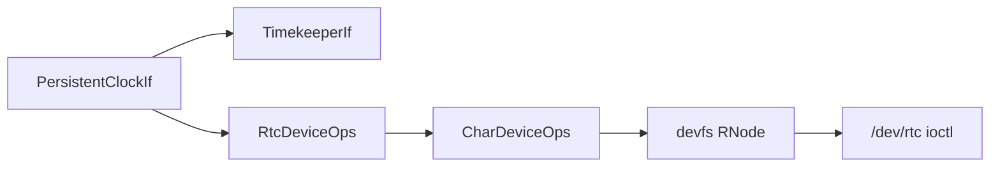

The timekeeper uses RTC only for boot/resume seeding and optional writeback.
Userspace RTC ABI goes through the device stack:

```rust
pub trait RtcDeviceOps {
    fn read_time(&self) -> Result<RtcTime, RtcError>;
    fn set_time(&self, time: RtcTime) -> Result<(), RtcError>;
    fn read_alarm(&self) -> Result<RtcAlarm, RtcError>;
    fn set_alarm(&self, alarm: RtcAlarm) -> Result<(), RtcError>;
    fn poll_events(&self) -> RtcEventMask;
}
```

`RtcDeviceOps` is adapted to `CharDeviceOps` / ioctl / poll. HAL does not attach
directly to `RNode`.

### RTC State And Event Semantics

<!-- txdoc:TIME-WAKE-V1-RTC-SEMANTICS-1 -->

RTC support has two consumers with different semantics:

- The timekeeper may read persistent time at boot or resume to choose an initial
  realtime offset. This is not a file operation and does not create an RNode.
- Userspace reaches RTC through devfs. `RtcDeviceOps` translates hardware or
  board driver state into Linux-shaped `read`, `ioctl`, and `poll` behavior.

RTC alarm events must not create a second wake mechanism. If a hardware RTC
alarm interrupt exists, the driver converts it into a device readiness event and
routes the eventual task wake through `WakeRouter`. If the platform lacks RTC
alarm hardware, an emulated alarm uses `TimerRegistrar` with a role that wakes
the RTC device state, not direct scheduler calls.

### RTC ABI Layering And Current Stub Retirement

<!-- txdoc:TIME-WAKE-V1-RTC-ABI-LAYERING-1 -->

The current tree has a static `/dev/misc/rtc` char-device projection whose
typed RTC operations are backed by an installed `PersistentClockIf` callback.
`RTC_RD_TIME` and `RTC_SET_TIME` still decode Linux ioctl numbers in the shim,
but RTC semantics live in typed device operations rather than a syscall-local
fixed-time stub:

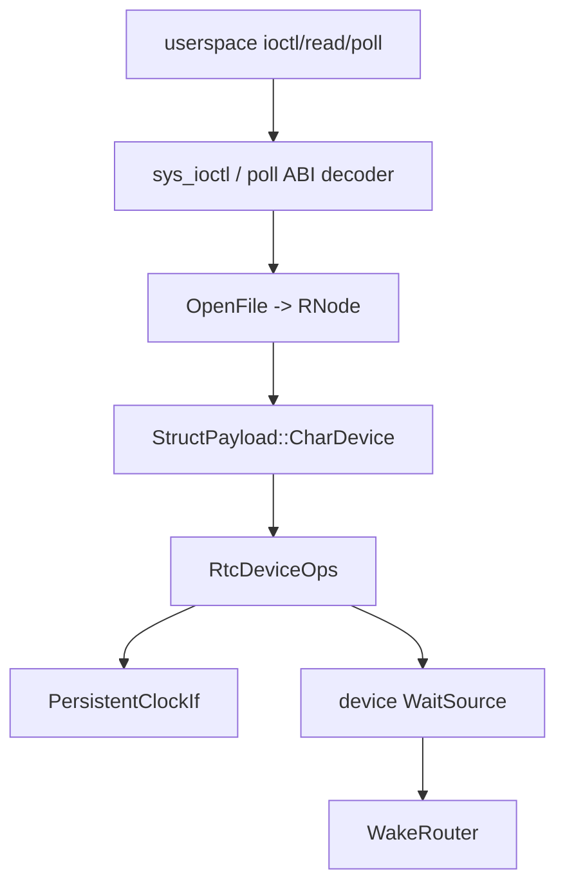

Layering rules for the RTC implementation:

- `devfs` may project a static RNode and attach a `CharDeviceBinding`.
- `CharDeviceOps` should grow or be accompanied by a typed ioctl/poll adapter
  rather than hard-coding RTC UAPI in the generic syscall arm.
- `RtcDeviceOps` owns Linux-shaped RTC concepts: `rtc_time`, alarm enablement,
  update/alarm event masks, and unsupported-operation errors.
- `PersistentClockIf` owns only the platform persistent clock capability. It
  should not know `RNode`, `OpenFile`, Linux ioctl numbers, or poll masks.
- Missing RTC hardware should surface as `ENODEV`/`ENOTTY`/`EOPNOTSUPP` at the
  ABI boundary according to the requested operation, while the timekeeper still
  boots with a fallback realtime epoch.

Minimum v1 RTC UAPI scope:

| Operation | Target behavior |
|---|---|
| `RTC_RD_TIME` | read persistent clock through `RtcDeviceOps`, serialize `struct rtc_time` |
| `RTC_SET_TIME` | validate user time, call typed set operation, optionally update timekeeper policy only through explicit syscall/device semantics |
| alarm read/set | route to persistent-clock alarm if present; otherwise return unsupported or emulate through `TimerRegistrar` if chosen |
| `read(2)` on `/dev/rtc` | consume pending RTC event records; block on the RTC event wait token or return `EAGAIN` for nonblocking fds when no event is pending |
| `poll(2)`/`epoll` | subscribe to RTC device wait source; wake through `WakeRouter` |

This preserves the broader VFS/device rule: HAL capabilities adapt into device
traits, device traits adapt into char-device bindings, and devfs only projects
RNodes. HAL never attaches directly to RNode state.

### RTC Event Wait Source

<!-- txdoc:TIME-WAKE-V1-RTC-WAIT-SOURCE-1 -->

RTC event delivery is device state plus normal wait routing. It is not an RTC
shortcut into the scheduler.

Target RTC event state:

```rust
pub struct RtcEventState {
    pub pending: RtcEventMask,
    pub wait_source: WaitSource,
    pub alarm: Option<RtcAlarm>,
}
```

The state machine is:

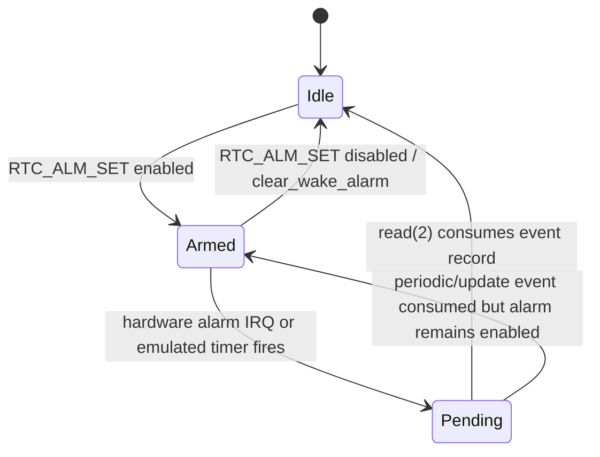

Event publication path:

```mermaid
sequenceDiagram
    participant IRQ as RTC IRQ or emulated timer
    participant DEV as RTC device state
    participant WS as device WaitSource
    participant WR as WakeRouter
    participant T as waiting task

    IRQ->>DEV: set pending event bit
    DEV->>WS: notify(ALARM or UPDATE)
    WS->>WR: SourceFired / DeviceReady
    WR->>T: mailbox hint + scheduler placement
    T->>DEV: read or poll re-checks pending bits
```

`RtcDeviceOps::poll_events` returns a snapshot of pending bits. It does not
consume them. `read(2)` consumes and returns Linux-shaped RTC event records;
blocking fds wait on the RTC event wait token when no event is pending, while
nonblocking fds return `EAGAIN`. Returning EOF from the char-device read method
is not a valid final RTC event semantic.

Hardware and emulated alarm paths share the same device state:

| Alarm source | How it reaches RTC state | How tasks wake |
|---|---|---|
| hardware RTC alarm interrupt | board RTC driver calls the RTC device event publisher | device wait source -> owner-aware router |
| platform persistent alarm callback without file state | adapter records `RtcEventMask::ALARM` in `RtcEventState` | device wait source -> owner-aware router |
| no hardware alarm | emulated timer registration fires a device-owned timer role | device wait source -> owner-aware router |

The emulated path intentionally wakes the RTC device state first, not the
userspace task directly. The task is one of many possible subscribers; the
device owns the pending event truth.

### Hardware RTC IRQ Publication Boundary

<!-- txdoc:TIME-WAKE-V1-RTC-IRQ-PUBLICATION-1 -->

Hardware RTC interrupts need one extra adapter, but the adapter must not
collapse HAL into devfs. The legal dependency path is:

```mermaid
sequenceDiagram
    participant HW as RTC hardware IRQ
    participant HAL as IrqIf dispatch
    participant K as tx-kernel IRQ handler
    participant B as board RTC backend
    participant DEV as RTC device event state
    participant WS as RTC wait source
    participant RX as reactor owner-aware wake route

    HW->>HAL: external interrupt
    HAL->>K: dispatch registered RTC handler
    K->>B: acknowledge/clear alarm source
    K->>DEV: publish_rtc_event(ALARM)
    DEV->>WS: fire readable event bit
    WS->>RX: SourceFired / DeviceReady
```

The split is deliberate:

- HAL claims, completes, masks, unmasks, and dispatches IRQ numbers. It does
  not know `RtcEventMask`, `RNode`, `OpenFile`, or poll masks.
- The board RTC backend knows device registers and interrupt-clear ordering. It
  does not know devfs path names or scheduler placement.
- `tx-kernel` owns IRQ-handler installation. It may register a generic
  `rtc_alarm_irq_handler::<P>` for a board-provided RTC IRQ, exactly like UART
  RX is registered through the IRQ dispatch table today.
- The handler may call an IRQ-safe RTC event publisher that only sets atomic
  pending bits and fires a wait-source queue. It must not path-walk VFS, open
  RNodes, allocate with an epoch guard, or run user-visible RTC ioctl logic in
  IRQ context.
- The later task wake still happens through the RTC wait source and the
  owner-aware reactor route. A hardware IRQ is only an event producer.

The minimal v1 interface shape can be either a board-specific handler
registration or a small HAL-level optional IRQ facet. If a facet is added, it
must remain hardware-shaped:

```rust
pub struct PersistentClockIrqEvent {
    pub alarm: bool,
    pub update: bool,
}

pub trait PersistentClockIrqIf {
    const RTC_IRQ: u32 = 0;

    fn claim_persistent_clock_irq_event()
        -> Result<PersistentClockIrqEvent, PersistentClockError>;
}
```

`PersistentClockIrqIf` would not return `RtcEventMask`, because that type
belongs to the device layer. The kernel adapter maps
`PersistentClockIrqEvent { alarm, update }` into `RtcEventMask` and then calls
the device publisher. Boards without RTC IRQ support keep `RTC_IRQ = 0` and
use the existing unsupported or emulated-alarm route.

### RTC UAPI Completion Matrix

<!-- txdoc:TIME-WAKE-V1-RTC-UAPI-MATRIX-1 -->

| UAPI | Current state | Target completion |
|---|---|---|
| `RTC_RD_TIME` | typed ioctl reaches `RtcDeviceOps::read_time` | real board backend returns calendar time when hardware exists |
| `RTC_SET_TIME` | typed ioctl reaches `RtcDeviceOps::set_time` and persistent backend hook | optional explicit synchronization with system realtime policy if required by future UX |
| `RTC_ALM_READ` / `RTC_ALM_SET` | typed ioctl reaches `RtcDeviceOps::read_alarm` / `set_alarm`; persistent alarm hook called; hardware-unsupported alarms can install an emulated `DeviceEvent` timer; RV64 and LA64 QEMU hardware alarm IRQs publish into RTC device state | add real-board or firmware backend witnesses beyond QEMU |
| `RTC_WKALM_RD` / `RTC_WKALM_SET` | not part of current slice | add only with checked Linux `struct rtc_wkalrm` layout and the same typed ops route |
| `read(2)` | consumes pending RTC event records; blocking fds wait on the RTC event wait token and nonblocking fds return `EAGAIN` when no event is pending | keep event publication wired through hardware IRQ or emulated alarm sources |
| `poll(2)` / `epoll` | typed `poll_events` drives `POLLIN`/`EPOLLIN`; waiters subscribe to the RTC device wait source; RV64 and LA64 QEMU hardware IRQ publication fires the same source | keep real-board IRQ publication on the same path |

## Observation And Debuggability

<!-- txdoc:TIME-WAKE-V1-OBSERVATION-1 -->

Time/wake bugs are usually race bugs, so the architecture needs stable
observation points:

| Observation point | Suggested payload |
|---|---|
| monotonic read anomaly | hart, previous ns, current ns |
| realtime set/jump | old offset, new offset, generation |
| timer install | token, role, deadline, mailbox owner, installing hart |
| timer cancel | token, role, cancellation reason |
| timer fire | token, role, firing hart, now, deadline |
| stale timer | token, role, stale reason: cancelled, dead mailbox, task generation mismatch |
| wake route | owner task, old lifecycle, target hart, remote IPI flag |
| hardware program | hart, next deadline, cancel vs arm |

These records should use `tx-observe` timestamps from `MonotonicCounterIf`.
They must not call realtime or RTC paths while emitting traces. Observation is a
consumer of monotonic time, not an owner of timekeeping policy.

## ABI Mapping

<!-- txdoc:TIME-WAKE-V1-ABI-MAPPING-1 -->

| ABI or subsystem | Reads time from | Registers timer in | Wake route |
|---|---|---|---|
| `clock_gettime(CLOCK_MONOTONIC)` | `TimekeeperIf::monotonic_now_ns` | none | none |
| `clock_gettime(CLOCK_REALTIME)` | `TimekeeperIf::realtime_now_ns` | none | none |
| `stat` timestamps | filesystem policy over `TimekeeperIf` | none | none |
| `nanosleep` | `TimekeeperIf` for deadline conversion | `PrimarySleep` | `TimerFired -> TimerExpired` |
| `clock_nanosleep(CLOCK_REALTIME, ABSTIME)` | realtime-to-monotonic conversion | `PrimarySleep` | generation-aware timer retry/abort |
| `poll/select/epoll` timeout | `TimekeeperIf` | `DeadlineAbort` | timed-out wait outcome |
| `futex` timeout | `TimekeeperIf` | `DeadlineAbort` | futex wait timeout |
| `timerfd` | timerfd state plus `TimekeeperIf` | `PrimarySleep` or timerfd-specific role over registry | readable event |
| delegate timeout | subsystem deadline | `DelegateTimeout` | token timed out |
| `/dev/rtc` | `PersistentClockIf` through `RtcDeviceOps` | RTC alarm path | device poll/read/ioctl |

### Linux Compatibility Boundary

<!-- txdoc:TIME-WAKE-V1-LINUX-COMPAT-1 -->

The target is Linux-compatible observable behavior, not a Linux clone:

| Linux concept | Tx equivalent | Intentional difference |
|---|---|---|
| clocksource selection/rating/watchdog | static board-selected `MonotonicCounterIf` | no dynamic clocksource framework in v1 |
| clockevent per-CPU devices | `DeadlineTimerIf` plus reactor deadline action | no generic tick-device registry in v1 |
| hrtimer RB-tree | `TimerRegistry` facade over current `TimerWheel` | data structure is private and can change |
| low-resolution timer wheel | same registrar surface, possible future role or bucket policy | no separate public API |
| timekeeper seqlock/vvar | `TimekeeperIf` plus `VvarSnapshot` | simpler publication model until vDSO fast path needs full seqlock parity |
| RTC class | `PersistentClockIf` + `RtcDeviceOps` + devfs | no dynamic device discovery in v1 |
| scheduler wakeup | reactor scheduler owner binding and reschedule IPI | stackless futures mean wake resumes a future poll, not a blocked kernel stack |
| wait queues | `WaitSource` subscribers plus `TaskMailbox` events | event is a hint; StepOp re-observes semantic state |

The main architectural difference is the async execution model. Linux often
wakes a task sleeping on a wait queue and returns to a parked kernel stack. Tx
wakes a reactor task, drains mailbox hints, then re-polls a future/StepOp that
reconstructs the next bounded transition. That makes mailbox owner binding and
generation checks part of the correctness story.

## Current Code Alignment

<!-- txdoc:TIME-WAKE-V1-CURRENT-CODE-1 -->

| Current surface | Alignment | Gap |
|---|---|---|
| `tx_hal::MonotonicCounterIf` / `DeadlineTimerIf` | Package A target is landed in active Rust code | Keep callers narrow; do not reintroduce an aggregate `TimeIf` |
| `tx_hal::PersistentClockIf` | Package F capability foundation is present and is now part of the `TxPlatform` hardware capability boundary; RV64 QEMU virt implements `google,goldfish-rtc`; LA64 QEMU virt implements LS7A TOY calendar read/set/alarm over MMIO; persistent-clock alarm IRQ ack is a HAL capability; devfs RTC ops can call the installed platform backend without changing the hot time path | real-board RTC or firmware backends still need wiring |
| `tx_services::time::wall_clock` | Holds realtime offset, generation, vvar snapshot data, the `TimekeeperIf` facade, seed hooks for persistent-clock realtime, `RealtimeWritebackPolicy` / `RealtimeSetReport`, service test reset, and hook slots for timerfd realtime mutation plus VVAR publication. Production clock readers and test constants/reset now import the service facade directly; `tx_subsystems::time_hooks` is the subsystem-side hook installer. | Raw public free-function wrappers, public `WallClock`, and the old `tx_subsystems::wall_clock` compatibility path are retired; additional board persistent-clock backends still need wiring |
| `tx_substrate::wake::timer::TimerWheel` | Role-tagged registry with `TimerRegistrar`, `TimerRegistrarHandle`, `TimerRegistry`, and `TimerWakeRouter` facades | Keep concrete wheel ownership in reactor/substrate driver code; upper producers should use `tx_services::time::{DeadlineRegistrar, DeadlineRegistrarHandle}` rather than importing substrate registrar names directly |
| `tx_reactor` owner-aware wake path | `ReactorOwnerWakePost` now posts mailbox events, resolves mailbox owner, transitions parked tasks, routes through scheduler placement, applies local enqueue, sends remote IPI, and marks userspace preempt. Timer expiry, delegate timeout expiry, delegate reply/cancel/agent-death reactor wrappers, wake-inbox drain, explicit `post_mailbox_event_from_hart` / `post_mailbox_ref_event_from_hart` entries, bus `fire_with_post` callers, reactor-local completion/rendezvous `*_with_post` callers, device timer callback wait-source and RawQueue publication, RTC hardware IRQ and emulated alarm readiness, signal process-producer `*_with_post` seams, signalfd process-signal fanout through `step_kill_process_with_posts` / `script_deliver_signal_with_posts`, syscall-context timerfd realtime mutation notifiers, userfaultfd pending-fault readable publication from the process-aware fault script, TTY console-ingest readable publication, VFS/RNode read/write wait-source publication, POSIX mq send/receive readiness publication, SysV msg send/receive/removed readiness publication, SysV sem changed-source readiness publication, socket readiness publication, network delegate kick publication, AIO/io_uring completion readiness publication, generic v3 wait-source adapter publication, and page-backed page-ready waits can use this shared helper or an explicit no-context post through the same seam | Keep future producer families on the same caller-posting boundary; add broader mixed-producer SMP stress evidence |
| `tx_reactor` wait timeouts | `WaitProtocol::*Timeout` installs `DeadlineAbort` guards in the unified registry and uses the current task-owned mailbox when a reactor poll context identifies it unambiguously | Standalone host/test polling still uses a local fallback mailbox; real scheduler-context producers still need broader injected-post adoption |
| `TaskMailbox` | Correct task-owned event inbox with immutable scheduler-owner binding | All wake classes should converge on scheduler-routed posting, not only timer expiry |
| `TaskWakeState` | Useful legacy runnable doorbell | Should not be the cross-hart placement authority for target runtime paths |
| `SyscallCtx.timer_registrar` / `ScriptCtx.timer_registrar` | `SyscallCtx` now stores `tx_services::time::DeadlineRegistrarHandle` directly; only the lower `ScriptCtx` yield-resolution bridge lowers that facade to the substrate registrar handle at the step boundary via `into_substrate_registrar_for_script_bridge()`. StepOp/script yield resolution no longer holds a raw wheel, and `tx-shims/src/adapter.rs` no longer re-exports substrate timer handles or roles | Keep the `ScriptCtx` bridge confined to `build_subject_script_ctx()` and substrate step/yield resolution; long-lived subsystem objects keep only guards/tokens and operation parameters use the `DeadlineRegistrar` facade |
| devfs RTC node | Static `/dev/misc/rtc` now exposes `RtcDeviceOps`; boot installs the static platform's `PersistentClockIf` backend; `RTC_RD_TIME`, `RTC_SET_TIME`, `RTC_ALM_READ`, and `RTC_ALM_SET` dispatch through typed ops; RTC event pending bits feed blocking/nonblocking `read(2)`, `ppoll`, and `epoll` through typed `rtc_ops()`; hardware RTC IRQ publication and hardware-unsupported emulated alarm callbacks reach the same pending-event path; emulated alarms publish the RTC RawQueue through the reactor timer router | Other boards still use unsupported defaults |

The hard audit for the current implementation is the mechanical invariant gate:

```sh
cargo xtask lint invariants time-wake-retired
```

As of 2026-07-09, this gate covers the core old time/timer interfaces, old
direct wake producer wrappers, raw RTC queue access, generic wait-source direct
adapters, and raw public `wall_clock` compatibility wrappers. It must report
zero retired active Rust sites. That proves the named old interfaces are
retired from active runtime code; it does not by itself close the remaining
external board-evidence rows.

## Migration Plan

<!-- txdoc:TIME-WAKE-V1-MIGRATION-1 -->

Migration should land as implementation packages. Each package has a local
testable end state. Temporary compatibility is allowed only inside an
in-progress package; package exit means the old active interface named in that
package is gone from runtime code.

### Package Dependency Graph

<!-- txdoc:TIME-WAKE-V1-MIGRATION-GRAPH-1 -->

```mermaid
flowchart TD
    A["A HAL capability split"]
    B["B Timekeeper facade"]
    C["C Timer registry facades"]
    D["D ActiveWait + WakeRouter"]
    E["E TimerQueue retirement"]
    F["F RTC device route"]
    G["G Wake-class convergence"]

    A --> B
    A --> C
    B --> F
    C --> D
    D --> E
    D --> G
    F --> G
```

Packages A-E retire old active runtime interfaces. Package F completes the
persistent-clock and userspace RTC path. Package G is the broader semantic
convergence package: once timer expiry is scheduler-routed, wait-source,
delegate, signal, and device readiness wakes should use the same owner-aware
boundary where scheduler context exists.

Implementation should not wait for all packages to start verification. Each
package has its own exit audit, and the global hard audit remains the final
retirement check.

### Package A -- HAL Capability Split

<!-- txdoc:TIME-WAKE-V1-MIGRATION-HAL-1 -->

Scope:

- add `MonotonicCounterIf`;
- add `DeadlineTimerIf`;
- implement the subtraits for every board that currently implements `TimeIf`;
- migrate read-only consumers to `MonotonicCounterIf`;
- migrate hardware deadline consumers to `DeadlineTimerIf`;
- migrate consumers that need both to explicit dual bounds;
- delete or quarantine `TimeIf` so no active code depends on it.

Exit evidence:

- all platform crates compile;
- tests that used fake `TimeIf` now implement the narrow subtraits;
- active HAL docs no longer imply wall-clock or software timer ownership.
- `rg -n "\bTimeIf\b" crates boards docs/design` has no active-interface hits
  other than migration notes or historical progress references.

### Package B -- Timekeeper Facade

<!-- txdoc:TIME-WAKE-V1-MIGRATION-TIMEKEEPER-1 -->

Scope:

- add `TimekeeperIf` over the current `wall_clock` global;
- migrate new syscall/VFS timestamp code to the facade;
- add boot-time seed hook that can consume `PersistentClockIf` when available;
- keep vDSO/vvar publication as timekeeper-owned state.

Exit evidence:

- `clock_gettime`, `gettimeofday`, `stat` timestamp, and timerfd code can name
  timekeeper intent without importing raw `wall_clock` globals;
- realtime setter still bumps generation and notifies realtime-sensitive timer
  consumers.
- active Rust has no public raw `wall_clock::*` runtime wrappers and no public
  `WallClock`; no-context or same-module helpers are private or cfg-test only.

Implementation note: the facade and core call-site migration have landed for
clock syscalls, interval-timer reads, timerfd realtime conversion, futex
timeout conversion, and vDSO/VVAR publication. Realtime seed hooks have landed
for Package F, and kernel vDSO bootstrap now seeds realtime from
`PersistentClockIf` before publishing the initial vvar snapshot. Persistent
writeback now has system-clock call sites through `clock_settime(CLOCK_REALTIME)`
and `settimeofday`, using best-effort writeback after accepted timekeeper
mutation. The implementation now lives under
`tx_services::time::wall_clock`; production call sites use the
`tx_services::time` facade directly. Test constants and reset now use the same
service facade, while subsystem-local timerfd/VVAR hook wiring is named
`tx_subsystems::time_hooks`. The raw
public `wall_clock::*` wrappers and public `WallClock` surface are retired;
upper layers use `TimekeeperIf` / `timekeeper()` and the xtask
retired-interface gate rejects the old public raw wrapper shapes.

### Package C -- Timer Registry Facades

<!-- txdoc:TIME-WAKE-V1-MIGRATION-TIMER-1 -->

Scope:

- define `TimerRegistrar` for producers;
- define `TimerRegistry` for the reactor driver;
- implement both over `tx_substrate::wake::timer::TimerWheel`;
- migrate v3 yield resolution to role-tagged registrations.

Exit evidence:

- `OnTimer` can be resolved by installing a `PrimarySleep` guard;
- protocol deadline waits can install `DeadlineAbort` guards without creating a
  second yield shape;
- delegate reply deadlines keep using `DelegateTimeout` role.
- no new code imports `TimerQueue` or `DeadlineFuture`.

Implementation note: the producer-side handle has landed. `SyscallCtx` now
carries `tx_services::time::DeadlineRegistrarHandle` supplied by reactor entry,
so syscall operation code installs role/target-shaped deadlines through the time
facade without importing the substrate registrar handle. `ScriptCtx` remains the
lower step/yield bridge; `build_subject_script_ctx()` is the only upper bridge
allowed to call
`DeadlineRegistrarHandle::into_substrate_registrar_for_script_bridge()`. `drive()`
resolves `OnTimer`, wait-source deadlines, and delegate deadlines through the
registrar bridge. The concrete `TimerWheel` remains the reactor/substrate
registry object used by the timer driver and focused tests.

### Package D -- ActiveWait And WakeRouter

<!-- txdoc:TIME-WAKE-V1-MIGRATION-WAKE-ROUTER-1 -->

Scope:

- introduce an `ActiveWait` owner for primary wait guard plus optional timer
  guard;
- ensure drop order cancels timer guard before releasing the primary wait or
  delegate token;
- add `WakeRouter` in reactor-owned code;
- change timer, wait-source, and delegate fire paths to enqueue mailbox events
  through the router when scheduler context exists.

Exit evidence:

- timer expiry on one hart can wake a task currently owned by another hart;
- waking an already runnable or running task does not double-enqueue;
- stale weak mailbox upgrade after task death retires the timer entry cleanly;
- old `TaskMailbox::post -> Waker -> TaskWakeState` is removed from active
  runtime paths or isolated behind test-only helpers.

Implementation note: the timer-expiry half of this package has landed. Timer
expiry now routes through a reactor-owned scheduler-aware router, and the
direct mailbox compatibility router is gone. The package is not complete until
wait-source and delegate wake paths also converge on the same owner-aware
posting boundary.

### Package E -- TimerQueue Retirement

<!-- txdoc:TIME-WAKE-V1-MIGRATION-TIMERQUEUE-1 -->

Scope:

- migrate `WaitEventFuture.timer: Option<DeadlineFuture>` users to active wait
  timer guards;
- replace `timer_sleep::install_timer_queue` with registrar installation;
- make reactor `advance_time_to` fire only the unified registry;
- remove or quarantine `TimerQueue` compatibility reexports.

Exit evidence:

- there is one software timer registry in active runtime paths;
- `next_deadline_ns()` reflects all sleeps and protocol timeouts;
- nanosleep, futex timeout, poll/select/epoll timeout, delegate timeout, and
  timerfd share the same driver route.
- `rg -n "TimerQueue|DeadlineFuture|timer_sleep|install_timer_queue|sleep_until_ns" crates boards`
  has no active runtime hits.

Implementation note: this package has landed for the named old interfaces.
Reactor `WaitProtocol::*Timeout` futures, syscall helper deadlines, timerfd
blocking waits, and boot setup no longer depend on the old queue/future/global
install path.

### Package F -- RTC Device Route

<!-- txdoc:TIME-WAKE-V1-MIGRATION-RTC-1 -->

Scope:

- add `PersistentClockIf`;
- add `RtcDeviceOps`;
- extend char-device ioctl/poll support enough for RTC;
- seed timekeeper realtime from persistent clock at boot when available;
- define persistent writeback policy for system realtime mutations;
- route RTC alarm/read/poll events through device state and wait sources;
- route `/dev/rtc` through devfs/VFS, not through direct HAL-to-RNode edges.

Exit evidence:

- RTC read/set operations are represented as device operations;
- `clock_gettime(CLOCK_REALTIME)` still uses the timekeeper hot path;
- `clock_settime`/`settimeofday` report timekeeper mutation separately from
  optional persistent writeback failure;
- RTC alarm support registers wake behavior through RTC device state and the
  timer/wake route rather than creating a parallel scheduler path;
- RTC `read(2)` and `poll`/`epoll` are either fully wired through a wait source
  or explicitly return unsupported/non-ready without pretending EOF is final
  event semantics.

Implementation note: the foundation slice has landed. `PersistentClockIf` is
defined in HAL, current board crates implement the explicit capability boundary,
RV64 QEMU virt now backs it with the MMIO `google,goldfish-rtc` device, and
unsupported boards keep returning typed unsupported errors. `TimekeeperIf`
exposes realtime seed helpers, `RtcDeviceOps` and `RtcTime` live in the device
layer, `TxPlatform` includes persistent clock as a platform capability, kernel
vDSO bootstrap seeds realtime from persistent clock before initial vvar
publication, and `RTC_RD_TIME` / `RTC_SET_TIME` / `RTC_ALM_READ` /
`RTC_ALM_SET` reach `/dev/misc/rtc` through typed char-device ops backed by the
installed `PersistentClockIf` callback. `clock_settime(CLOCK_REALTIME)` and
`settimeofday` now use best-effort persistent writeback after accepted
timekeeper mutation. RTC pending event state, `read(2)` record consumption,
blocking vs nonblocking RTC `read(2)` waits, and `ppoll`/`epoll` typed
readiness now exist. Emulated RTC alarm publication now lands through a
`DeviceEvent` timer callback that publishes into RTC pending event state. RV64
and LA64 QEMU hardware RTC alarm IRQs now publish into the same RTC pending
event state. The real-board RTC interface is reserved through the same
`PersistentClockIf` methods plus optional `IrqIf::RTC_IRQ` override; real board
drivers must stay board-local and enter generic code through
`HalRtcDevice<P> -> RtcDeviceOps`. Full Package F remains incomplete until
real-board RTC/firmware backends or explicit unsupported hardware witnesses are
added beyond the QEMU profiles.

### Package G -- Wake-Class Convergence

<!-- txdoc:TIME-WAKE-V1-MIGRATION-WAKE-CONVERGENCE-1 -->

Scope:

- identify every active path that can make a parked reactor task runnable:
  timer expiry, wait-source readiness, delegate reply, signal delivery, device
  readiness, and internal cancellation;
- move each path onto the owner-aware posting boundary when scheduler context
  exists;
- keep payload interpretation in the semantic owner, not in the router;
- remove or isolate captured-`Waker` / captured-queue routes that can become
  stale after task stealing;
- add cross-hart tests that prove the same wake path handles timer and
  non-timer wake classes.

The target convergence shape is:

```mermaid
flowchart TD
    TIMER["TimerRegistry fire"]
    WAIT["WaitSource ready"]
    AGENT["Delegate reply / timeout"]
    SIGNAL["Signal delivery"]
    DEVICE["Device readiness"]

    MB["TaskMailbox event queue"]
    ROUTER["WakeRouter"]
    SCHED["Scheduler owner + lifecycle"]
    IPI["local enqueue or remote IPI"]
    POLL["future / StepOp re-poll"]

    TIMER --> ROUTER
    WAIT --> ROUTER
    AGENT --> ROUTER
    SIGNAL --> ROUTER
    DEVICE --> ROUTER
    ROUTER --> MB
    ROUTER --> SCHED --> IPI --> POLL
    MB --> POLL
```

Migration order:

1. Timer expiry uses `TimerWakeRouter` over the reactor wake router.
2. Wait-source readiness gains the same owner-aware post operation.
3. Delegate reply and delegate timeout route through the same operation.
4. Interruptible signal wake uses the same scheduler placement rule after
   signal state chooses the target task.
5. Device readiness, including RTC alarm/read/poll events, publishes through a
   wait source and then through the router.
6. Legacy captured-`Waker` paths are either removed from production routes or
   documented as local test helpers with no SMP correctness claim.

Exit evidence:

- a single router-owned function or trait implementation is responsible for
  turning mailbox events into scheduler placement;
- timer, wait-source, delegate, signal, and device tests can assert mailbox
  events without depending on captured local wakers;
- post-steal wake tests cover at least one timer wake and one non-timer wake;
- stale owner generation, dead task, already-runnable task, and remote IPI paths
  are observable and tested or explicitly covered by scheduler tests;
- active runtime code has no production path that treats the registration hart
  or last-poll hart as the wake destination.

Implementation note: the first useful slice has landed. The shared
owner-aware post primitive is implemented as `ReactorOwnerWakePost`, timer
expiry routes through it, the existing wake-inbox drain path shares its
placement helper, and `Reactor::post_mailbox_event_from_hart` proves a
non-timer `MailboxEvent::SourceFired` can be posted and routed cross-hart
without captured-waker drain being the correctness mechanism. Delegate timeout
expiry is the next landed producer path: tagged `DelegateTimeout` entries now
fire through `TimerRegistry::fire_due_with`; the old manual delegate-timeout
driver is retired from active Rust code, and the resulting `Abort(TimedOut)`
event is posted through the same owner-aware route. Device timer callbacks can
now attach a wait-source wake target; the reactor's
`TimerWakeRouter::post_source_fired` resolves that
source and uses `WaitSource::notify_with_owner_post` so delivered `SourceFired`
events are immediately routed through scheduler owner placement. Delegate
reply/cancel/agent-death transitions now share the same registry pattern:
`DelegateRegistry::{mark_replied,mark_canceled,mark_agent_died,mark_endpoint_died}_with_post`
preserve the registry CAS as the linearization point while reactor wrappers
inject owner-aware posting for scheduler-context producers. The old public
delegate direct transition wrappers are retired from active Rust; no-context
tests and guard-drop cleanup use explicit direct closures through the same
`*_with_post` seam. The retired transition names are also part of the strict
active-Rust old-name residue gate, so comments and test strings under
`crates` / `boards` describe the transition role instead of preserving the old
callable names. Package G is still incomplete until remaining real producer
paths beyond timer expiry, delegate terminal transitions, explicit
reactor-context callers, and device timer callback wakes are migrated. Signal
delivery now has the required lower and
process-producer seams: `post_signal_mailbox_with_post` and
`post_signal_with_post` let signal state mutation stay in the
thread-runtime/signal layer while callers with scheduler context inject
owner-aware posting, and `step_kill_process_with_post` /
`route_gewalt_with_post` carry that seam through catchable process-directed
signal selection, SIGSTOP/SIGCONT Gewalt fanout, and SIGKILL terminal zombify
wake hints. `Reactor::post_signal_delivered_from_hart` routes an already
selected `SignalDelivered` mailbox event through `ReactorOwnerWakePost`.
No-context signal paths now pass an explicit direct-post closure through the
same `_with_post` helpers instead of using a parallel `post_signal_mailbox`
wrapper. The old direct `post_signal` catchable-signal wrapper is also retired;
no-context callers use `post_signal_with_post` with an explicit direct
mailbox-post closure, and higher-level signal/syscall callers still need to
inject the owner-aware route when they gain reactor/scheduler context, so full
signal convergence remains open. The thread-future fatal-signal paths are the first
higher-level kernel
callers to cross that boundary: signal-frame reserve/copy failures,
`prepare_signal_frame` failures, and bad or failed sigreturn restoration now
call `fatal_signal_teardown_from_current_hart`, which uses the current hart and
`BOOT_REACTOR` to post the terminal mailbox event through
`Reactor::post_mailbox_event_from_hart` when the runtime is available, while
retaining a direct mailbox fallback for pre-reactor/test contexts. Syscall
dispatch has the next scheduler-context bridge: `SyscallCtx::post_mailbox_event`
uses the injected kernel post when present and direct posting otherwise.
`script_deliver_signal_with_post`, `KillProcessWithPostOp`,
`KillPgrpWithPostOp`, `ThreadKillWithPostOp`, and
`DeliverSignalWithPostOp` let `pidfd_send_signal`, process-group fanout,
`tkill`, `tgkill`, and disposition-aware POSIX delivery preserve their
existing signal routing/StepOp structure while using the caller-provided
owner-aware post; the old direct `KillProcessOp`, `KillPgrpOp`,
`ThreadKillOp`, and `DeliverSignalOp` wrappers are retired active interfaces,
and the old direct `script_deliver_signal` helper name is retired in favor of
explicit `script_deliver_signal_with_post` callers. The old bare
`step_kill_process` process-directed wrapper, old bare `step_kill_pgrp`
process-group wrapper, old bare `deliver_posix_signal` disposition-aware
wrapper, and old direct `route_gewalt` wrapper name are also retired from
active Rust code; process-control delivery uses `step_kill_process_with_post`
/ `step_kill_process_with_posts`, `step_kill_pgrp_with_post` /
`step_kill_pgrp_with_posts`, `deliver_posix_signal_with_post`, and
`route_gewalt_with_post` so callers must choose either an owner-aware post
injection point or an explicit no-context direct closure. The
socket/pipe/page-backed
`SIGPIPE` paths call `step_kill_process_with_post` through the same
`SyscallCtx` seam. `ITIMER_REAL` has been moved off the old direct producer
names as well: syscall-boundary
polling and socket wait expiry both call `fire_itimer_real_with_post(ctx)`,
which delivers handler-gated `SIGALRM` through
`deliver_signal_if_handler_with_post` and `SyscallCtx::post_mailbox_event`;
the enter-userspace compatibility frame path is now
`maybe_deliver_itimer_signal_with_post(..., post)` and the kernel injects
`post_mailbox_event_from_current_hart`. The old direct
`maybe_deliver_itimer_signal`, `fire_itimer_real`, and
`deliver_signal_if_handler` active wrappers are retired. Syscall-context
wait-source producers now have the matching mailbox-ref bridge:
`SyscallCtx::post_mailbox_ref_event` carries already-upgraded subscriber
mailboxes through an injected owner-aware post operation, and
`sys_exit_group` uses it for the parent process `exit_source` wake published
after child zombification. The old no-context `fire_exit_source` wrapper is
retired; tests and any no-reactor caller must pass an explicit direct post
closure to `fire_exit_source_with_post`.
Bus-backed wait sources now have the matching lower seam:
`RawPort`, `RawQueue`, `DeclaredPort`, `DeclaredQueue`, and the reactor wait
channel wrappers expose caller-posting `fire_with_post` / `try_fire_with_post`
variants, so a producer with scheduler context can inject owner-aware
`SourceFired` publication instead of using the default direct mailbox post.
Production wait futures now prefer the current task-owned mailbox when the
reactor poll context can identify exactly one active mailbox; standalone
polling keeps its local fallback. `TaskMailbox::poll_select` preserves
unrelated mailbox events while letting a wait driver consume only the matching
`ActiveWait` source/generation and drop stale generations for its own source.
`Reactor::post_mailbox_ref_event_from_hart` lets `fire_with_post` closures route
the already-upgraded subscriber mailbox through `ReactorOwnerWakePost`; a
cross-hart wait-channel smoke proves a `SourceFired` wake can place the parked
task on its current owner and send the remote IPI. Reactor-local coordination
objects now expose the same caller-posting seam for wait-source publication:
`Completion::complete_with_post`, `CountdownCompletion::arrive_with_post`, and
`SyncRendezvous::ack_with_post` are available when the producer has
scheduler/reactor context. The old `complete`, `arrive`, and `ack` direct
methods are retired; host/no-context callers pass an explicit direct closure to
the same `_with_post` methods. The first non-reactor-local syscall-context
wait-source producer has also moved: process `exit_source` now has
`fire_exit_source_with_post` / `notify_child_zombified_with_post`, process
group exit is exposed only as `step_exit_group_with_posts` /
`step_exit_group_with_signal_with_posts`, and `sys_exit_group` injects
`SyscallCtx::post_mailbox_event` plus `SyscallCtx::post_mailbox_ref_event` so
thread signal posts and parent `wait4` wakes can route through the owner-aware
path when reactor context is present. Futex syscall-context wake producers now use the same
bridge with explicit scheduler hints: `SyscallCtx::post_mailbox_ref_event_with_hint`
routes exact `SourceFired` delivery through the injected owner-aware post while
preserving `WakeHandoff` / lifecycle wake hints, and `FUTEX_WAKE` /
`FUTEX_WAKE_BITSET` call
`step_futex_wake_masked_with_hint_and_post_in`. TTY input-readable publication
now follows the same shape: `step_ingest_with_post` keeps line-discipline and
input-queue mutation in the TTY subsystem while allowing callers to inject a
mailbox-ref post, no-context callers pass explicit direct hint-aware closures
through that helper, and the kernel console ingest path injects
`post_mailbox_ref_event_with_hint_from_current_hart`. VFS/RNode readiness now
has the same semantic seam: `fire_read_wait_with_post` and
`fire_write_wait_with_post` route the per-RNode read/write wait sources
through caller-injected mailbox-ref posting. The old default `fire_*_wait`
wrappers are retired; no-context callers pass explicit direct closures to the
same helpers. Remaining
wait-source work is to switch other real scheduler-context producers outside
these
reactor-local/process-exit/futex/eventfd/pipe/timerfd/signalfd/userfaultfd/TTY/VFS/POSIX-mq/SysV-msg/SysV-sem
paths to the injected-post variants. The net delegate runtime's loopback TCP
readiness path now has the same lower seam:
`step_process_loopback_pending_in_namespace_with_post` calls
`step_process_loopback_tcp_with_post`, and the production
`BootNetDelegateDriver<P>` injects
`post_mailbox_ref_event_with_hint_from_current_hart` through
`NetDelegateDriver::post_net_mailbox_ref_event`; no-context delegate tests and
helpers keep the default direct fallback. Netlink route/xfrm/netfilter send
wrappers now follow the same socket-readiness rule:
`netlink_route_send_with_post`,
`netlink_route_send_with_netns_resolvers_and_post`,
`netlink_xfrm_send_with_post`, and `netlink_netfilter_send_with_post` publish
queued response readability through a caller-provided mailbox-ref post, while
syscall dispatch injects `SyscallCtx::post_mailbox_ref_event`; the old direct
netlink send wrapper names are part of the `time-wake-retired` gate. Timerfd now covers both the syscall-local
immediate-readable `timerfd_settime` case and the system realtime mutation
case: `clock_settime(CLOCK_REALTIME)` / `settimeofday` call
`set_realtime_ns_with_persistent_and_timerfd_post`, which mutates the
timekeeper, bumps generation, publishes vvar, and then invokes
`timerfd_clock_was_set_with_post` with the syscall context's mailbox-ref post
closure. Cancel-on-set and non-cancel realtime absolute timers therefore keep
their semantic state in timerfd while routing readiness publication through
the caller-owned owner-aware post seam when it exists. The old direct
`timerfd_clock_was_set` wrapper is retired; no-context callers pass an explicit
direct closure to `timerfd_clock_was_set_with_post`. Signalfd process-signal
fanout now has the same split: signal delivery keeps target selection and
`SignalDelivered` weak-mailbox posting, while signalfd owns the per-fd pending
queue and publishes readable wait-source events through the injected
mailbox-ref post when the signal caller has scheduler context. Userfaultfd
pending-fault publication now follows the same rule: `UserfaultFd` owns the
pending-fault queue, `push_fault_msg_with_post` owns readable wait-source
publication, and `fault_script_for_process_with_post` lets the production
thread-future page-fault path inject `post_mailbox_ref_event_with_hint` without
adding a `tx-subsystems -> tx-reactor` dependency. The older direct
`push_fault_msg` and `fault_script_for_process` wrappers are retired; callers
without scheduler context pass an explicit direct mailbox-ref post function to
the same `_with_post` entrypoints. POSIX mq send/receive readiness and
`mq_notify` signal publication now follow the same syscall-context rule: the mq
identity/open instance and backing SysV message payload keep queue truth,
`step_mq_send_with_posts` publishes receiver readability through the injected
mailbox-ref post and `mq_notify` signals through the injected weak-mailbox
post, the no-context `step_mq_send_with_post` wrapper supplies an explicit
direct signal fallback, and `step_mq_receive_with_post` publishes sender
writability through the mailbox-ref seam. SysV msg queues now use the same split:
`MsgQueuePayload` owns send/recv wait sources and queue truth,
`step_msgsnd_with_post` publishes receiver readability, `step_msgrcv_with_post`
publishes sender writability, and `step_msgctl_in_ns_with_post` aborts both
waiter classes on `IPC_RMID` through the caller-injected mailbox-ref post.
The old no-context `step_msgctl` and `step_msgctl_in_ns` wrappers are retired;
no-context callers pass explicit direct closures to the `_with_post` helpers.
SysV sem changed-source publication now follows the same caller-posting shape:
`notify_changed_with_post` is the only semaphore changed-source notification
verb, `step_semop_v3_with_post` / `step_semop_with_post` publish value-change
wakes through the injected post, `step_semctl_in_ns_with_post` uses it for
`IPC_RMID`, `SETVAL`, and `SETALL`, and `step_sem_undo_with_post` keeps
process-exit undo adjustments on the same helper. The old no-context SysV sem
wrappers are absent from active Rust; no-context callers pass explicit direct
closures to the `_with_post` helpers. RTC read/poll events must
continue using device wait sources and the owner-aware router, not a
device-specific scheduler shortcut.

## Invariants

<!-- txdoc:TIME-WAKE-V1-INVARIANTS-1 -->

TIME-WAKE-1. HAL time traits expose hardware capabilities only. They do not
store task ids, futures, mailboxes, clock ids, or wall-clock policy.

TIME-WAKE-2. `CLOCK_REALTIME` is timekeeper state, not an RTC read path.

TIME-WAKE-3. A future may hold a timer guard but must not own a private timer
wheel or timeout queue.

TIME-WAKE-4. `OnTimer` is a primary wait. Protocol deadlines over other waits
are `WaitProtocol` attachments represented by `TimerGuardRole::DeadlineAbort`.

TIME-WAKE-5. Timer expiry posts a wake event. Scheduler placement is resolved by
the wake router at fire time.

TIME-WAKE-6. Timer registrations must not cache a target hart as the wake
destination.

TIME-WAKE-7. Cross-hart wake after timer expiry uses the same lock-and-recheck
protocol as all other scheduler wakes.

TIME-WAKE-8. Dropping active wait state cancels the timer guard before releasing
the primary wait or delegate token guard.

TIME-WAKE-9. A stale timer fire after task death is not a correctness failure if
the weak mailbox cannot upgrade and the registry retires the entry.

TIME-WAKE-10. `TimeIf`, `TimerQueue`, `DeadlineFuture`, and
`timer_sleep::install_timer_queue` are retired names in the target runtime.
They may appear only in migration notes, historical progress records, or
test-only compatibility code that is explicitly scheduled for removal.

TIME-WAKE-11. Persistent realtime writeback is policy above the timekeeper. It
must not redefine `CLOCK_REALTIME`, and best-effort RTC writeback failure must
not silently roll back an accepted system-clock mutation.

TIME-WAKE-12. RTC event readiness is device state. Hardware RTC interrupts and
emulated RTC alarms publish pending bits into the RTC device wait source before
any task wake is routed.

## Implementation Readiness Checklist

<!-- txdoc:TIME-WAKE-V1-READINESS-1 -->

A patch series implementing this document is ready for review only when these
checks are mechanically answerable:

| Area | Evidence |
|---|---|
| HAL split | all boards implement `MonotonicCounterIf` and `DeadlineTimerIf`; `TxPlatform` names both |
| timekeeper | clock syscalls, stat timestamps, vDSO/vvar, and realtime setters use `TimekeeperIf` |
| persistent writeback | `clock_settime`/`settimeofday` separate timekeeper generation from optional RTC writeback outcome |
| timer registry | `OnTimer`, protocol deadlines, delegate deadlines, and timerfd use `TimerRegistrar` |
| reactor | hardware deadline programming happens only in reactor timer-driver code |
| wake routing | timer expiry reaches scheduler through `WakeRouter`, not captured `Waker` state |
| SMP | cross-hart wake follows `SCHED-SMP-2` lock-and-recheck and does not cache target harts |
| RTC | `/dev/rtc` routes through devfs `CharDeviceOps` and `RtcDeviceOps`; timekeeper RTC use is seed/writeback only; RTC read/poll events use a device wait source |
| retirement | active runtime code has no `TimeIf`, `TimerQueue`, `DeadlineFuture`, or `timer_sleep` dependency |

The minimum focused verification set for the implementation series is:

```text
cargo check -p tx-hal -q
cargo check -p tx-substrate -q
cargo check -p tx-reactor -q
cargo check -p tx-subsystems -q
cargo check -p tx-shims -q
cargo check -p tx-kernel -q
cargo -q xtask unit
```

QEMU acceptance then covers the behaviors host checks cannot prove:

- monotonic clock reads on each supported board;
- timer interrupt wakes a sleeping userspace task;
- SMP timer expiry on one hart wakes a task currently owned by another hart;
- `clock_gettime(CLOCK_REALTIME)` remains stable across repeated reads and
  changes after `clock_settime`;
- `/dev/rtc` read/ioctl path is reachable when the board exposes an RTC.

## Implementation Blueprint And Interface Closure

<!-- txdoc:TIME-WAKE-V1-BLUEPRINT-1 -->

This section is the implementation-facing close of the design. Earlier
sections define each module in isolation. The blueprint below ties them back to
the global architecture so a patch series can be reviewed without reconstructing
the full path from memory.

### Global-To-Local Traceability

<!-- txdoc:TIME-WAKE-V1-TRACEABILITY-1 -->

Every externally visible time/wake behavior should trace to one row in this
table:

| User or kernel behavior | Entry module | Lower interfaces | State owner | Wake or publication result |
|---|---|---|---|---|
| monotonic clock read | `TimekeeperIf` | `MonotonicCounterIf` | timekeeper snapshot/conversion | value returned to caller |
| realtime clock read | `TimekeeperIf` | `MonotonicCounterIf` | `realtime_offset_ns` and generation | value returned to caller or vvar |
| realtime set | syscall shim + `TimekeeperIf` | optional `PersistentClockIf` writeback | timekeeper offset/generation | vvar republished, realtime-sensitive objects notified |
| filesystem timestamp | VFS/filesystem policy | `TimekeeperIf` | inode/filesystem metadata | timestamp stored with filesystem granularity |
| primary sleep | StepOp driver | `TimekeeperIf`, `TimerRegistrar` | active wait future | `TimerFired` hint, then StepOp retry |
| protocol timeout | wait adapter | `TimekeeperIf`, `TimerRegistrar` | active wait future and semantic wait object | timeout hint, then semantic re-check |
| timerfd expiry | timerfd object | `TimekeeperIf`, `TimerRegistrar` | timerfd expiration count and flags | fd readiness through wait source |
| delegate timeout | delegate registry | `TimerRegistrar` | delegate token state | token timeout hint, waiter retry |
| RTC ioctl | devfs char route | `RtcDeviceOps`, `PersistentClockIf` | RTC device/backend state | Linux-shaped ioctl result |
| RTC alarm event | RTC device route | hardware IRQ or emulated timer registration | RTC pending event state | device wait-source readiness |
| cross-hart wake | reactor router | `TaskMailbox`, scheduler, IPI HAL axis | scheduler owner/lifecycle | local enqueue or remote reschedule IPI |

If a new call path cannot be placed in this table, it is either a missing row
in this document or an attempted bypass of the architecture.

### Data Ownership Ledger

<!-- txdoc:TIME-WAKE-V1-DATA-OWNERSHIP-1 -->

The following state must not be duplicated across layers:

| Data | Sole owner | May cache? | Invalidated by |
|---|---|---|---|
| hardware counter value | hardware / board trait implementation | callers may keep local samples | next counter read |
| realtime offset | timekeeper | vvar snapshot may cache with generation | `clock_settime`, `settimeofday`, boot/resume seed |
| realtime generation | timekeeper | timerfd/sleep objects may remember the generation they converted against | realtime mutation |
| vvar snapshot | timekeeper publication code | userspace may read with sequence validation | timekeeper publish |
| timer deadline entry | `TimerRegistry` | producer holds only `TimerGuard` | guard drop or fire walk |
| sleep/futex/poll continuation | future or semantic owner | no registry copy | future completion, cancellation, signal, timeout |
| task mailbox events | `TaskMailbox` | scheduler may observe readiness only through owner routing | mailbox drain / overflow rescan |
| task hart ownership | scheduler metadata | wake router reads and re-checks | migration, steal, affinity change |
| RTC pending bits | RTC device state | poll may snapshot only | `read(2)` consume or device clear |
| persistent RTC/calendar value | board RTC backend | timekeeper may seed once, not hot-cache as device truth | hardware write, firmware update, battery loss |

This ledger is the rule that prevents old interfaces from reappearing under new
names. A compatibility helper is acceptable only if it forwards to the sole
owner and does not acquire independent state.

### Required Implementation Order

<!-- txdoc:TIME-WAKE-V1-IMPLEMENTATION-ORDER-1 -->

Implementation should proceed in this order because each step removes one
source of ambiguity for the next step:

1. Establish the hardware capability split in HAL and all board crates.
2. Put all semantic clock reads and realtime mutation behind `TimekeeperIf`.
3. Give all timer producers a `DeadlineRegistrar`/`DeadlineRegistrarHandle`
   facade view; keep substrate `TimerRegistry` visible only to the reactor
   timer driver and focused tests.
4. Ensure reactor timer expiry uses `fire_due_with(now, router)` and programs
   `DeadlineTimerIf` only after reading `next_deadline_ns()`.
5. Retire every private timer queue or future-owned wheel; futures retain only
   guards and continuation state.
6. Route RTC through `RtcDeviceOps` and devfs char-device bindings; RTC event
   truth lives in RTC device state.
7. Converge timer, wait-source, delegate, signal, and device readiness wakes on
   the owner-aware post primitive.
8. Add board RTC backends and QEMU/board witnesses only after unsupported
   boards already return explicit unsupported errors through the same route.

The order is not just convenience. It prevents high-level code from depending
on a raw wheel, a hardware timer, a platform RTC register, or a captured local
waker while the lower layer is still being moved.

### Interface Retirement Gate

<!-- txdoc:TIME-WAKE-V1-RETIREMENT-GATE-1 -->

The retirement gate is stronger than "new code does not use the old names".
Package exit requires that active runtime code no longer defines or exports the
old path as a usable interface:

```text
cargo xtask lint invariants time-wake-retired
```

This xtask gate is the canonical local regression check for the full retired
time/wake interface matrix. The representative active-code grep rules below are
kept as human-readable tripwires; when they diverge from xtask, update both
surfaces together. Scope-aware matching is required so `_with_post`
replacements and unrelated same-named StepOps do not count as old direct
interfaces.

```text
rg -n '\bTimeIf\b|TimerQueue|DeadlineFuture|timer_sleep|install_timer_queue|sleep_until_ns|DirectMailboxTimerWakeRouter|\.fire_due\(|timer_queue|fixed_oscomp_time|binding\.name == "rtc"' crates boards --glob '*.rs'
rg -n '\btimerfd_settime_with_flags\b|\btimerfd_clock_was_set\b' crates boards --glob '*.rs'
rg -n '\bReadOp\b|\bWriteOp\b|crate::pipe::step_read\(|crate::pipe::step_write\(' crates/tx-subsystems/src/pipe crates/tx-subsystems/src/vfs/execution.rs crates/tx-shims/src/linux_syscall/io.rs crates/tx-subsystems/tests/v3_pipe_waitsource.rs crates/tx-subsystems/src/process/tests/fd_table.rs --glob '*.rs'
rg -n '\bfault_script_for_process\(|ProcessUfdDispatch::new\(|\bpush_fault_msg\(|fault_post: None|fault_post: Some|\bpush_fault_msg\b|\bfault_script_for_process\b' crates/tx-subsystems/src/userfaultfd crates/tx-subsystems/src/vm/execution.rs crates/tx-subsystems/tests/v3_userfaultfd_e2e.rs crates/tx-subsystems/tests/v3_userfaultfd_fault_path.rs crates/tx-shims/src/linux_syscall/tests/epoll_dispatch.rs crates/tx-shims/tests/v3_userfaultfd_ioctl_reply.rs crates/tx-kernel/src/thread_future.rs --glob '*.rs'
```

Allowed hits are limited to tests that explicitly assert migration behavior,
documentation, progress records, or archived notes. Active code must not keep a
compatibility wrapper that can be called by production paths. In particular:

- `TimeIf` must not remain as a `TxPlatform` supertrait or helper aggregate.
- `TimerQueue` / `DeadlineFuture` must not remain as a second runnable timeout
  engine.
- `TimerWheel::fire_due` must not exist as a router-free production shortcut.
- RTC dispatch must not identify the device by string name such as
  `binding.name == "rtc"`; it must use typed `rtc_ops()`.
- syscall or VFS code must not call board RTC methods directly.

### Module Acceptance Tests

<!-- txdoc:TIME-WAKE-V1-MODULE-TESTS-1 -->

Each module has a local proof obligation before broader QEMU smoke tests:

| Module | Minimum host proof |
|---|---|
| HAL traits | fake and board platforms compile with separate counter, deadline, and persistent-clock impls |
| timekeeper | realtime is monotonic plus offset; set/seed bumps generation; vvar snapshot changes |
| persistent writeback | accepted realtime mutation survives failed best-effort RTC writeback |
| timer registry | install/cancel/fire/next-deadline work through `TimerRegistrar` and `TimerRegistry` facets |
| active wait | deadline guard is cancelled before primary wait guard on drop |
| reactor timer route | `fire_due_with` posts through a scheduler-aware router and reprograms hardware deadline from `next_deadline_ns()` |
| owner-aware wake | post-steal wake routes to the current owner and does not double-enqueue already-runnable tasks |
| RTC typed route | ioctl/read/poll reach `RtcDeviceOps`, not syscall-local fixed stubs |
| RTC event route | alarm/update publication sets pending bits, wakes waiters, and `read(2)` consumes Linux-shaped records |

These proofs are intentionally smaller than the whole kernel. They make the
global migration debuggable: when a QEMU sleep, futex, timerfd, or RTC case
fails, the failing layer should already have a focused host witness.

## External Reference Patterns

<!-- txdoc:TIME-WAKE-V1-REFERENCES-1 -->

The target split follows patterns already used by mature runtimes and kernels:

- Tokio separates runtime services into IO driver, scheduler, and timer; its
  multi-thread scheduler is work-stealing, and IO/timer readiness wakes tasks
  for later scheduling rather than choosing a worker as semantic state:
  <https://docs.rs/tokio/latest/tokio/runtime/index.html>.
- Tokio time types are futures/streams such as `Sleep`, `Interval`, and
  `Timeout`; they must run inside a runtime context:
  <https://docs.rs/tokio/latest/tokio/time/index.html>.
- Fuchsia `async::Loop` exposes an `async_dispatcher_t`, can run on multiple
  threads, and dispatches queued work on loop threads:
  <https://fuchsia.dev/reference/cpp/class/async/loop>.
- Linux separates clock event devices from hrtimer users. Clock event devices
  schedule next interrupts, while hrtimer and scheduler paths handle expiry and
  wake behavior:
  <https://www.kernel.org/doc/html/latest/timers/highres.html>.

These references support the same local rule: time drivers produce readiness;
the executor or scheduler owns placement.

## Design Decisions And Deferred Work

<!-- txdoc:TIME-WAKE-V1-DECISIONS-1 -->

The v1 decisions are closed enough to implement against:

| Question | v1 decision |
|---|---|
| first `WakeRouter` home | reactor-owned implementation; substrate may expose only a callback trait that does not import scheduler types |
| timer registry sharding | keep current shared/reactor-owned registry until AP user-task execution and measured contention justify per-hart shards |
| timerfd role | use existing roles first; add a timerfd-specific role only if observation or cancellation accounting needs it |
| first RTC ioctl set | keep `RTC_RD_TIME`, `RTC_SET_TIME`, `RTC_ALM_READ`, and `RTC_ALM_SET` on typed ops; add `RTC_WKALM_*` only after checking Linux layout |
| realtime absolute timer policy | semantic owner captures `realtime_generation`; first implementation may wake/retry on mismatch, with rebase/expire policies added per ABI object |
| persistent writeback | system-clock mutation updates timekeeper first and reports RTC writeback separately; `/dev/rtc` set-time mutates persistent clock through device ops |
| RTC read/poll | event truth lives in RTC device state and wait source; no scheduler shortcut from RTC hardware to task |

Deferred v2 work:

- NTP discipline and clocksource watchdog/rating.
- Leap-second handling and time namespaces.
- Suspend-aware `CLOCK_BOOTTIME` accounting beyond a monotonic alias.
- Full Linux RTC ioctl surface beyond the v1 matrix.
- Dynamic device discovery for hot-plug RTC or platform devices.
- Real-time scheduling classes and scheduler deadline policy.
