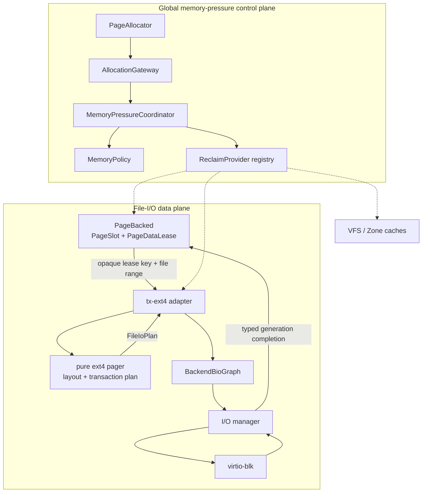

# Memory and File-I/O Architecture

<!-- txdoc:MEMORY-IO-ARCHITECTURE-V1 -->

**Status.** v1 (2026-07-25). Canonical cross-layer architecture contract.

**Purpose.** Define the joint architecture for file-backed memory, physical
frame pressure, filesystem layout and transaction planning, and block-I/O
execution. This document freezes the cross-layer ownership and dependency
rules. Component documents remain authoritative for local mechanics.

**Initial performance witness.** A clean full build of the large Rust
repository on one CPU, 4 GiB RAM, and no swap. The current Tx run takes hours;
the comparable Linux baseline is approximately 6000 seconds. These numbers are
product measurements, not semantic ABI. The ownership and zero-copy rules in
this document are architectural invariants.

**Companion documents.**

- [`PAGE_SUBSTRATE_v1.md`](../01_substrate/PAGE_SUBSTRATE_v1.md) owns physical
  frame allocation, `FrameMeta`, and typed role evidence.
- [`PAGE_BACKED_v1.md`](PAGE_BACKED_v1.md) owns `PageContainer`, resident file
  data, and the `PageSlot` state machine.
- [`VM_v1_2.md`](VM_v1_2.md) owns address-space recipes, pmap materialization,
  and range coordination. VM consumes file pages; it is not the file cache.
- [`IO_MANAGER_v1.md`](../05_filesystem/IO_MANAGER_v1.md) owns page/block
  request execution, `BackendBioGraph`, DMA submission, and completion.
- [`TX_EXT4_PLAN_v1_2.md`](../05_filesystem/TX_EXT4_PLAN_v1_2.md) owns ext4
  compatibility, layout, allocation, metadata, and JBD2 semantics.
- [`03_STEP_MODEL_v2.md`](../../Txv3/03_STEP_MODEL_v2.md) defines bounded
  progress, yielding, and typed wait discipline.

---

## 1. Decision and scope

<!-- txdoc:MEMORY-IO-DECISION-1 -->

Tx adopts two orthogonal planes:

1. The **file-I/O data plane** moves ordinary file payload from PageBacked,
   through filesystem layout planning and the existing BIO DAG, to the device.
2. The **global memory-pressure control plane** observes allocator and cache
   pressure, selects bounded work, coordinates reclaim/writeback, and retries
   allocations without taking ownership from either plane's resource owners.

The planes meet through immutable snapshots, typed claims, leases, plans, and
generation-checked completions. They do not meet through raw pointers, hidden
callbacks, or shared global locks.



### 1.1 In scope

<!-- txdoc:MEMORY-IO-SCOPE-1 -->

- canonical ordinary file-page identity and ownership;
- dirty/writeback authority and completion generations;
- zero-extra-copy buffered and direct file payload paths;
- pure filesystem layout and transaction planning;
- immutable ext4 metadata after-images and JBD2 ordering;
- the existing BIO DAG, queueing, merging, DMA, barriers, and completion;
- global watermarks, reclaim providers, pure replacement/arbitration policy,
  background and direct reclaim, allocation retry, and emergency reserves;
- file-page, VFS metadata, filesystem metadata, Zone/slab, and future
  reclaim-provider accounting;
- no-swap behavior for anonymous memory; and
- trace-backed performance and correctness gates.

### 1.2 Explicitly out of scope for v1

<!-- txdoc:MEMORY-IO-NON-GOALS-1 -->

- anonymous swap, compression, overcommit, or anonymous-page migration;
- one global LRU containing file pages, dentries, filesystem metadata, and
  slab objects;
- a VM-owned BufferManager or a cache-owned physical allocator;
- a second page cache in ext4 or the I/O manager;
- a replacement `BackendBioGraph` type;
- a second lease/completion vocabulary parallel to PageBacked and the I/O
  manager;
- NUMA policy, per-hardware-queue sharding, full MGLRU, BFQ/Kyber, or page
  compaction before evidence requires them; and
- workload-name checks such as special-casing `rustc` in kernel policy.

---

## 2. Non-negotiable invariants

<!-- txdoc:MEMORY-IO-INVARIANTS-1 -->

### 2.1 Ownership invariants

<!-- txdoc:MEMORY-IO-OWNERSHIP-INVARIANTS-1 -->

1. **One ordinary file-data cache.** For one mounted filesystem object,
   `(mount identity, fs_object_id)` resolves to one canonical file
   `PageContainer`. PageBacked is the only long-lived owner of ordinary file
   data pages.
2. **VM is a consumer.** VM owns recipes, pmap bindings, shootdown, and private
   COW pages. It consumes PageBacked materialization and never creates another
   file-data cache.
3. **Filesystem owns format semantics.** ext4 owns extent/layout rules, block
   allocation, metadata before/after images, journal reservations, transaction
   ordering, and format-specific caches. It does not own a second ordinary
   file-data cache.
4. **I/O manager owns transient execution.** It owns requests, queue state,
   tags, `BackendBioGraph` execution, DMA submission, fences, and completion.
   It does not retain ordinary file data after request completion.
5. **Allocator owns physical lifecycle.** `PageAllocator` owns bitmap/free-list
   state, PPN selection, contiguous allocation, `FrameMeta`, reservations,
   and typed role-token transitions. No cache manager edits that state.
6. **Resource owners evict.** A policy may rank candidates, but only the
   owning PageBacked/VFS/filesystem/Zone provider may validate and claim one.

### 2.2 State-authority invariants

<!-- txdoc:MEMORY-IO-STATE-AUTHORITY-1 -->

- `PageSlot` is the sole semantic authority for ordinary file-page fetching,
  resident, dirty, writeback, redirty, error, and completion generation state.
- Page-cache replacement metadata contains only policy hints such as
  `referenced`, `no_reclaim`, age/generation, queue membership, and refault
  history. It does not contain authoritative dirty/writeback state.
- `FrameMeta` contains physical-frame liveness and role evidence: owner,
  mapping, cache, DMA/pin, reserved, and direct-map facts. It does not own
  file-page dirty/writeback semantics.
- An I/O completion changes semantic state only after the owner validates its
  request, object, page range, and submitted generation.
- Removing a cache binding is not proof that a frame became allocator-free.
  Reclaim success is measured from actual allocator free-count progress after
  all map/cache/pin/owner contributors reach zero.

### 2.3 Locking and execution invariants

<!-- txdoc:MEMORY-IO-LOCKING-INVARIANTS-1 -->

- No allocator lock may be held while calling a reclaim provider, filesystem,
  policy, I/O manager, or wait primitive.
- `MemoryPolicy` receives immutable value snapshots. It receives no pointer,
  PPN, lease, lock guard, filesystem handle, callback, or submission authority.
- A provider scan does not hold an owner lock across policy selection.
- `try_claim` revalidates generation, pin/mapping, dirty/writeback, and
  no-reclaim state under the owner protocol. `Stale`, `Busy`, `Pinned`, and
  `BecameDirty` are normal race outcomes.
- Any reclaim or writeback operation that can wait is a bounded `StepOp` or
  manager-owned operation. Epoch guards and short owner reservations never
  cross a yield.
- Completion processing receives a small bounded scheduling budget so freeing
  leases and frames cannot be starved by new submission work.

### 2.4 Zero-copy invariants

<!-- txdoc:MEMORY-IO-ZERO-COPY-INVARIANTS-1 -->

For an aligned, DMA-capable ordinary file payload on the normal buffered or
direct path:

```text
file_payload_extra_copy_bytes == 0
normal_path_bounce_bytes == 0
```

One semantic copy between a userspace byte range and a PageBacked page is
allowed for ordinary buffered `read`/`write`. From the PageBacked page to the
device, the payload is represented by retained page segments and is not copied
into an ext4 plan, journal transaction value, or I/O-manager staging buffer.

Bounce buffers are exceptional and must carry a reason: unaligned request,
device segmentation/alignment limit, inaccessible DMA page, encryption or
other explicit transform. The exception contributes to `bounce_bytes` and a
reason counter.

Metadata uses a separate accounting domain. Freezing an immutable metadata
after-image and encoding escaped/checksummed JBD2 descriptor, revoke, data, or
commit records may copy bytes. Those bytes are counted as
`metadata_freeze_copy_bytes` or `journal_encode_bytes`, never as ordinary file
payload copies.

---

## 3. Ownership and cache taxonomy

<!-- txdoc:MEMORY-IO-OWNERSHIP-TAXONOMY-1 -->

"One file-data cache" does not mean that all semantic caches disappear.
Different owners retain different values and expose them to pressure through
separate provider contracts.

| Owner | Authoritative state | Permitted cache | Forbidden duplicate |
|---|---|---|---|
| PageBacked | resident file page, `PageSlot`, lease | file payload pages, access/replacement hints | ext4 metadata/JBD2 state |
| VM | recipe, pmap, private COW binding | derived PTE/materialization observations | file payload cache |
| VFS | dentry, RNode, path witness, negative lookup | bounded dentry/RNode/name cache | ordinary file data |
| ext4 | extent/layout, allocation, metadata generation, JBD2 | bounded inode/extent/bitmap/GDT/journal indexes | ordinary file data |
| I/O manager | request graph, queue, tag, completion | request-lifetime merge/dispatch state | cross-request file cache |
| PageAllocator | free state, PPN, typed role evidence | optional allocator-local magazine/free-run index | replacement policy |
| Zone/slab | object/slab allocation state | empty/partial slab bookkeeping | file or FS metadata semantics |

The coordinator compares pressure, cost, effectiveness, and refault feedback
across providers. Each provider retains its local representation and eviction
rules. File pages use a replacement algorithm; dentries may use a separate
generational policy; Zone trims empty slabs; ext4 validates transaction-safe
metadata eviction. These objects never enter one heterogeneous global LRU.

---

## 4. File-I/O data plane

<!-- txdoc:MEMORY-IO-DATA-PLANE-1 -->

### 4.1 Read miss

<!-- txdoc:MEMORY-IO-READ-MISS-1 -->

```text
VM/VFS asks PageBacked for (object, page)
  -> PageSlot begins a fetch generation or joins an existing fetch
  -> PageBacked supplies an empty PageDataLease target
  -> tx-ext4 adapter assigns opaque payload key K
  -> pure pager maps file range to logical/physical ranges
  -> adapter lowers FileIoPlan<K> into existing BackendBioGraph
  -> I/O manager DMA-writes into the retained PageBacked target
  -> typed completion returns (request, page, generation, result)
  -> PageSlot validates generation and installs Resident or Error
  -> waiter wakes only after owner state publication
```

Same-page misses deduplicate at the PageSlot/PageBacked admission boundary.
The pure pager does not own the target frame and cannot publish residency.

### 4.2 Buffered write and writeback

<!-- txdoc:MEMORY-IO-WRITEBACK-1 -->

```text
userspace bytes -> PageBacked resident page
  -> PageSlot marks a new dirty generation
  -> writeback policy selects object/range/generation frontier
  -> PageBacked freezes a PageDataLease over that frontier
  -> ext4 planner maps logical range and proposes allocation/metadata mutation
  -> ext4 adapter retains data lease and FrozenMetadataLease capabilities
  -> adapter lowers ordered data, journal commit, and checkpoint dependencies
     into the existing BackendBioGraph
  -> I/O manager submits and completes graph nodes
  -> PageSlot applies generation-checked completion
```

If a page is redirtied while an older generation is in writeback, completion
of the older generation leaves the page dirty. The I/O manager never clears a
dirty bit directly.

The policy chooses *when, which domain, and how much* to write. PageBacked
freezes data generations. ext4 decides extents, allocation and durability
ordering. The I/O manager executes requests. Device queue saturation informs
policy but is not itself the dirty-throttling authority.

### 4.3 Fsync

<!-- txdoc:MEMORY-IO-FSYNC-1 -->

An fsync operation captures a PageBacked dirty-generation frontier and an ext4
transaction frontier. It waits for all participating ordered-data writes,
then the journal dependency graph reaches durable commit. Home checkpoint may
complete later unless Linux-visible semantics for the selected operation or
mount mode require it.

Priority is dependency-aware. An fsync graph inherits foreground priority for
the data and metadata nodes required to unblock its commit. A flat global
ordering that places unrelated foreground writes ahead of the fsync graph is
forbidden because it can starve durability progress.

### 4.4 Direct I/O

<!-- txdoc:MEMORY-IO-DIRECT-IO-1 -->

Direct I/O and buffered I/O share layout planning and BIO execution but use
different data capabilities:

- buffered I/O uses a PageBacked `PageDataLease` over file-cache pages;
- direct I/O uses retained user-page `DmaPin`s and an `IoDataSource::Direct`
  or `IoDataTarget::Direct` segment view.

The variants remain distinct because their cache coherency, invalidation, and
completion rules differ. Neither is flattened into an untyped SG list.

Overlapping direct writes reserve the range, flush or invalidate conflicting
buffered pages, wait for old mappings/writeback according to the owner
protocol, submit DMA, then release the reservation after terminal completion.

---

## 5. Cross-layer type and interface contract

<!-- txdoc:MEMORY-IO-INTERFACES-1 -->

The architecture introduces four behavioral interfaces, two immutable value
objects, and one ext4-internal capability. It does not create six parallel
service stacks.

### 5.1 Immutable value object: `PageDataLease`

<!-- txdoc:MEMORY-IO-PAGE-DATA-LEASE-1 -->

`PageDataLease` is an unforgeable, multi-page lifetime capability issued and
revoked only by PageBacked. It binds:

- one canonical PageContainer identity;
- a file byte/page range;
- one PageSlot generation per participating page;
- immutable segment views with offsets and lengths; and
- the cache-pin/frame evidence needed to keep all segments live through
  terminal completion.

The public planner-facing projection contains an opaque lease ID, file range,
page generations, and opaque payload keys. It does not expose release,
replacement, dirty mutation, or resident publication authority.

`tx-ext4` may lower retained segments to existing `PageFrameRef`/`BioVec`
values when constructing a `BackendBioGraph`. The pure pager cannot see PPN,
`PageFrameRef`, `BioVec`, `PageContainer`, or the lease capability itself.

Dropping an unsubmitted lease rolls back the writeback/fetch admission.
Dropping a submitted lease is legal only after terminal completion has been
settled with PageBacked. Exact Rust field layout is deliberately private.

### 5.2 Behavioral interface: `FileLayoutPlanner`

<!-- txdoc:MEMORY-IO-FILE-LAYOUT-PLANNER-1 -->

The pure layout interface has this semantic shape:

```rust
pub trait FileLayoutPlanner {
    type PayloadKey: Copy + Eq;

    fn plan(
        &self,
        request: FileLayoutRequest<Self::PayloadKey>,
    ) -> Result<FileIoPlan<Self::PayloadKey>, FileLayoutError>;
}
```

`K` is supplied by the caller and returned unchanged on data ranges. The
planner may compare, split, coalesce, and order ranges associated with `K`; it
may not dereference payload, retain a Tx lease, or create a completion callback.

`FileIoPlan<K>` is a pure DTO, not another lifetime capability. It may contain:

- mapped, hole, unwritten, allocation-proposal, and metadata-read needs;
- file/logical/physical ranges and coalescing boundaries;
- opaque `K` on payload-bearing ranges;
- immutable metadata after-image descriptions and version preconditions;
- allocation/free deltas and dependency edges;
- journal/barrier domains and durability intent; and
- a typed planner resume token if more immutable metadata input is required.

It contains no PPN, `BioVec`, queue tag, waiter, reactor object, PageBacked
pointer, Tx completion callback, or device submission authority.

"Pure" means no Tx kernel resource ownership or I/O execution. A planner may
have format-local deterministic state, but allocation/journal mutation becomes
effective only when the `tx-ext4` adapter validates preconditions and admits a
transaction capability.

### 5.3 Immutable value object: existing `BackendBioGraph`

<!-- txdoc:MEMORY-IO-BACKEND-BIO-GRAPH-1 -->

[`BackendBioGraph`](../05_filesystem/IO_MANAGER_v1.md) is the sole block-I/O
DAG. The target extends its nodes and completion values rather than creating a
replacement graph type.

Each relevant node must be able to name:

- a source or target lease slice;
- a barrier/durability domain;
- ordering dependencies;
- priority inherited from a demand request or fsync frontier; and
- a typed completion route containing request/object/range/generation facts.

Graph validation rejects duplicate nodes, unknown endpoints, cycles, illegal
fence merging, cross-device merging, and lease slices outside their retained
range. The I/O manager may merge adjacent compatible LBA nodes by appending SG
segments. It may not merge across a dependency, barrier, transaction, device,
operation, incompatible flags, or completion-domain boundary.

### 5.4 ext4 capability: `FrozenMetadataLease`

<!-- txdoc:MEMORY-IO-FROZEN-METADATA-LEASE-1 -->

`FrozenMetadataLease` is an ext4-internal transaction capability for immutable
metadata after-images. It is not part of `tx-pager-api` and is never exposed to
PageBacked or VFS.

It binds:

- filesystem/mount identity;
- transaction generation and journal reservation;
- metadata home block, role, before-version/precondition, and after-image;
- any COW-owned page that stores the frozen after-image; and
- abort, durable-commit, checkpoint, and release state.

```text
Prepared
  -> Frozen
  -> JournalSubmitted
  -> CommitDurable
  -> CheckpointSubmitted
  -> CheckpointComplete
  -> Released

Prepared/Frozen/JournalSubmitted -> Aborted       // before durable commit
CommitDurable -> CheckpointSubmitted              // never semantic abort
CheckpointSubmitted -> CheckpointComplete -> Released
Aborted -> Released                               // after submitted I/O settles
```

Once frozen, later mutation of the same home block uses another generation or
COW page. A durable journal commit does not authorize release: the lease stays
retained through checkpoint I/O and is released only after checkpoint
completion succeeds. `CheckpointComplete` is a terminal-I/O fact, not an
implicit flush per checkpoint; explicit durability frontiers still control
barrier/flush/FUA. An aborted lease retains any submitted segments until their
terminal completions and transaction-reservation cleanup. Journal and
checkpoint may share the frozen after-image lease. JBD2 descriptor, revoke,
escaped/checksummed data, and commit records continue to use independent
`JournalRecordLease`s when encoding requires distinct bytes.

### 5.5 Behavioral interface: `ReclaimProvider`

<!-- txdoc:MEMORY-IO-RECLAIM-PROVIDER-1 -->

Every reclaimable owner adapts to the same staged protocol:

```text
snapshot -> try_claim -> step -> feedback
```

Semantic interface:

```rust
pub trait ReclaimProvider {
    fn snapshot(&self) -> ProviderSnapshot;
    fn try_claim(
        &self,
        candidate: CandidateId,
        generation: CandidateGeneration,
        intent: ReclaimIntent,
    ) -> ClaimResult;
    fn step(&self, claim: ReclaimClaim, budget: WorkBudget)
        -> ReclaimStep;
    fn feedback(&self, receipt: ReclaimReceipt) -> ReclaimFeedback;
}
```

Candidate discovery may be an owner-provided bounded cursor embedded in the
snapshot/plan. The contract does not require copying every candidate into one
global array. A provider returns stable IDs and immutable facts; policy ranks
them; `try_claim` revalidates under owner synchronization.

`ReclaimFeedback` distinguishes scanned objects, withdrawn bindings, submitted
writeback, released role pins, actual frames returned to the allocator,
elapsed service cost, and later refaults. Policy never treats "entry removed"
as equivalent to "frame freed".

### 5.6 Behavioral interface: `MemoryPolicy`

<!-- txdoc:MEMORY-IO-MEMORY-POLICY-1 -->

`MemoryPolicy` is a pure decision interface:

```rust
pub trait MemoryPolicy {
    fn plan(
        &mut self,
        pressure: PressureSnapshot,
        providers: &[ProviderSnapshot],
        history: FeedbackWindow,
    ) -> MemoryPlan;
}
```

`MemoryPlan` contains bounded provider scan quotas, target bytes/frames,
reclaim/writeback intent, fairness debt, and retry/throttle decisions. It does
not contain executable callbacks or owner objects.

Policy is replaceable independently of providers. A two-queue CLOCK policy,
generational CLOCK, refault-aware policy, or cost-weighted provider arbitration
uses the same snapshots and receipts.

### 5.7 Behavioral interface: `AllocationGateway`

<!-- txdoc:MEMORY-IO-ALLOCATION-GATEWAY-1 -->

`AllocationGateway` sits above, not inside, `PageAllocator`:

```rust
pub trait AllocationGateway {
    fn try_reserve(
        &self,
        request: AllocationRequest,
    ) -> Result<FrameReservation, AllocationFailure>;

    fn reserve_managed(
        &self,
        request: AllocationRequest,
    ) -> AllocationStep;
}
```

`try_reserve` is the allocator fast path and never calls an upper layer.
`reserve_managed` is a waitable operation: it attempts allocation, observes a
low-water or failure event, asks the coordinator for bounded progress, waits
on a pressure/reclaim progress source when permitted, and retries.

An `AllocationRequest` classifies at least count/order, zeroing, contiguous
requirement, `can_wait`, `can_io`, urgency, and reserve class. IRQ, page-table,
DMA, reclaim, and writeback allocations use explicit classes. Reclaim and
writeback retain emergency credits so progress does not depend on ordinary
allocation under the same pressure episode.

---

## 6. Global memory-pressure control plane

<!-- txdoc:MEMORY-IO-CONTROL-PLANE-1 -->

### 6.1 Coordinator ownership

<!-- txdoc:MEMORY-IO-COORDINATOR-1 -->

`MemoryPressureCoordinator` is a service subsystem. It owns:

- allocator pressure snapshots and watermarks;
- provider registration and stable provider IDs;
- active reclaim/writeback episodes and progress generations;
- policy state, provider fairness debt, and feedback windows;
- bounded background/direct reclaim scheduling;
- allocation wait/retry and writer-throttling decisions; and
- diagnostic counters and low-volume observation emission.

It does not own page contents, PageSlot transitions, filesystem metadata,
Zone/slab object state, BIO queues, or allocator free lists.

### 6.2 Pressure states

<!-- txdoc:MEMORY-IO-PRESSURE-STATES-1 -->

The initial control loop uses hysteretic watermarks:

```text
free > high          Normal
low < free <= high   Recovering: background reclaim may continue
min < free <= low    Elevated: wake bounded reclaim/writeback
free <= min          Critical: bounded direct progress, throttle, or wait/fail
```

Once recovery starts it continues until the high watermark, avoiding repeated
start/stop oscillation. Watermarks and quanta are tunable policy parameters,
not public ABI.

For the one-CPU, 4-GiB witness, background service is not free parallel work.
Every reclaim/writeback turn is bounded by candidate count and service time,
then yields so compiler CPU work can resume. A direct allocation path never
performs an unbounded global scan or synchronous filesystem writeback.

### 6.3 Initial policy

<!-- txdoc:MEMORY-IO-INITIAL-POLICY-1 -->

The first implementation is deliberately conservative:

1. canonical file PageContainer identity;
2. clean-only file-page reclaim;
3. a persistent per-provider second-chance cursor over stable resident
   bindings, not a global `FrameMeta` sweep;
4. `referenced` clearing and probationary/protected classification;
5. bounded provider arbitration with fairness debt;
6. actual allocator-free feedback;
7. no dirty-page reclaim and no filesystem metadata eviction until their
   ownership protocols are executable.

The next policy stage adds bounded ghost/refault history and adaptive provider
budgets. Fast refaults protect useful source/sysroot/registry and metadata
working sets; single-pass streaming reads remain probationary. A clean full
build must not inflate "file cache hit rate" by retaining one-use pages.

Provider arbitration is cost-aware and fair. It considers bytes above a soft
budget, recent reclaim effectiveness, service cost, refault rate, writeback
saturation, and starvation debt. It does not impose one replacement algorithm
on heterogeneous caches.

### 6.4 Dirty control and writeback

<!-- txdoc:MEMORY-IO-DIRTY-CONTROL-1 -->

Dirty admission and device queue saturation are distinct signals. The control
plane owns dirty thresholds and producer throttling; the I/O manager reports
queue/service feedback.

The initial target has:

- a background dirty threshold that wakes `kwriteback`;
- a hard threshold that throttles producers or waits for progress;
- oldest eligible PageSlot generations first;
- clustering by PageContainer, contiguous page range, extent and transaction
  boundary;
- dependency-aware priority for fsync graphs; and
- bounded writeback turns on one CPU.

No dirty page becomes a clean reclaim candidate until PageSlot validates the
matching successful completion generation. Device queue fullness never clears
dirty state and never substitutes for the global dirty budget.

### 6.5 No-swap behavior

<!-- txdoc:MEMORY-IO-NO-SWAP-1 -->

Anonymous, tmpfs, shm, and private pages are hard commits until explicit
teardown in v1. They contribute to pressure accounting but are not eviction
candidates. If anonymous working set plus wired/pinned/kernel commitments
approaches RAM, file reclaim alone cannot guarantee progress.

The coordinator may publish generic `Normal`, `Elevated`, or `Critical`
pressure for a userspace jobserver or runtime to reduce concurrency. The
kernel does not identify compiler processes by name. An operation still fails
with `ENOMEM` when bounded reclaim cannot satisfy a non-critical request.

---

## 7. Target crate and module boundaries

<!-- txdoc:MEMORY-IO-CRATE-BOUNDARIES-1 -->

These are target dependency boundaries. Migration may first establish the
same seams as modules in existing crates; the architecture does not require an
immediate large file move.

| Target | Owns | Forbidden dependencies |
|---|---|---|
| `tx-ext4-format` | ext4/JBD2 encoding, decoding, checksums, disk structures | PageBacked, PPN, BIO, reactor |
| `tx-pager-api` | pure ranges, layout requests/plans, opaque payload key | PageBacked, ext4 format, PPN, BIO, reactor |
| `tx-ext4-pager` | extent/layout, allocation proposals, metadata after-images, JBD2 ordering | PageBacked, PPN, `BioVec`, reactor |
| `tx-ext4` | Tx adapter, transaction admission, lease retention, plan lowering | VFS live nodes, second page cache |
| PageBacked module/crate | canonical PageContainer, resident data, PageSlot, PageDataLease | ext4 format/layout semantics |
| I/O manager module/crate | existing BackendBioGraph, queue, merge, DMA, fence, completion | persistent file cache, ext4 mutation authority |
| memory-pressure service | providers, policy, watermarks, allocation slow path | PPN/free-list mutation, file/FS semantic state |

The pure pager receives immutable format inputs and opaque payload keys. The
`tx-ext4` adapter is the only layer allowed to bind those keys back to retained
PageBacked segments and lower the layout plan into the Tx I/O graph.

---

## 8. Current checkout and migration seams

<!-- txdoc:MEMORY-IO-CURRENT-SEAMS-1 -->

The current checkout contains useful foundations but does not yet implement
this complete contract.

| Current shape | Architectural issue | Target |
|---|---|---|
| `PageContainerState` combines resident index, PageSlot table, in-flight fetch, leases, fsync, block runtime and range reservations | one coarse ownership/lock domain | split resident, slot, page-I/O, range and block-runtime owners |
| `PageCacheEntry::marks` and `PageSlot` both carry dirty/writeback facts | duplicate authority | PageSlot-only semantic state; replacement-only marks |
| global weak PageContainer registry and fixed clean sweep | no fairness, persistent cursor or actual-free feedback | ReclaimProvider plus policy/coordinator |
| only selected callers use `reserve_frame_with_reclaim` | not an allocator-wide slow path | AllocationGateway for managed allocation classes |
| ext4 compatibility pager uses one mutable pager cell | layout reads share allocation/I/O serialization | immutable snapshots plus short mutation admission |
| `SealedDataWrite` embeds a 4-KiB payload | ordinary file payload copy | opaque lease slice/key in `FileIoPlan<K>` |
| metadata/JBD2 staging uses private pages | stable after-image exists but may be copied twice | FrozenMetadataLease plus explicit encoding-copy accounting |
| existing `BackendBioGraph`, source/target lease values, and adjacent LBA merge | correct execution foundation | extend in place; do not replace |
| direct I/O retains user pages with `DmaPin` | correct direct lifetime foundation | preserve as distinct lease variant |

The target removes neither compatibility code nor physical modules in one
step. Each migration phase keeps one authoritative path and a static gate that
prevents the retired parallel path from remaining production-reachable.

---

## 9. Implementation sequence

<!-- txdoc:MEMORY-IO-IMPLEMENTATION-SEQUENCE-1 -->

### 9.1 Shared correctness foundation

<!-- txdoc:MEMORY-IO-IMPLEMENTATION-FOUNDATION-1 -->

1. Make `PageSlot` the sole dirty/writeback/redirty/completion authority.
2. Establish canonical `(mount, fs_object_id) -> Weak<PageContainer>` file
   identity and eliminate duplicate file PCs.
3. Separate PageContainer resident, slot, page-I/O, range, and block-runtime
   state behind owner-specific handles.
4. Add static ratchets for forbidden `FrameMeta` dirty/io-locked use and
   parallel graph/lease vocabularies.

### 9.2 Data-plane lane

<!-- txdoc:MEMORY-IO-IMPLEMENTATION-DATA-PLANE-1 -->

1. Generalize the current one-page `PageLease` into a generation-bound,
   multi-page `PageDataLease` without changing current callers all at once.
2. Define pure pager request/`FileIoPlan<K>` value types and place the
   compatibility adapter at the boundary.
3. Replace ordinary `SealedDataWrite.bytes` with opaque retained lease slices.
4. Extend the existing `BackendBioGraph` with lease slices, barrier domains,
   typed completion, and validation; retain adjacent compatible LBA merging.
5. Move block queue/runtime state out of PageContainer into the I/O manager.
6. Add `FrozenMetadataLease` generation/COW/abort/commit/checkpoint lifecycle.
7. Reuse frozen after-images between journal and checkpoint where encoding
   permits, retaining `JournalRecordLease` for encoded records.
8. Add delayed multi-block allocation, extent locality, directory indexing,
   group commit, and immutable extent lookup only after the lease/transaction
   boundaries are stable.

### 9.3 Control-plane lane

<!-- txdoc:MEMORY-IO-IMPLEMENTATION-CONTROL-PLANE-1 -->

1. Add allocator pressure snapshots and allocation-class diagnostics without
   changing allocator ownership.
2. Introduce `AllocationGateway`, coordinator episode/progress state, and
   clean file-page `ReclaimProvider`.
3. Replace the global weak-registry sweep with bounded persistent cursors,
   second chance, fairness, and actual-free feedback.
4. Add background reclaim with one-CPU work budgets and hysteretic watermarks.
5. Add dirty thresholds, clustered writeback, writer throttling, and emergency
   credits.
6. Register VFS dentry/RNode, ext4 metadata, and Zone/slab providers with
   owner-specific claim rules.
7. Add ghost/refault history and adaptive budgets from trace evidence.
8. Add allocator-local magazines, buddy/free-run indexing, more generations,
   or multi-queue sharding only after focused metrics identify them.

The two lanes join at PageDataLease writeback admission, PageSlot completion,
and pressure/writeback feedback. They can otherwise land independently.

---

## 10. Performance and observation contract

<!-- txdoc:MEMORY-IO-PERFORMANCE-1 -->

### 10.1 Measurement ladder

<!-- txdoc:MEMORY-IO-MEASUREMENT-LADDER-1 -->

Every comparison fixes CPU count, 4-GiB guest RAM, no-swap policy, QEMU mode,
host block backend, filesystem image, repository revision, toolchain, build
command, target directory, and build concurrency.

Use four storage witnesses:

1. tmpfs: syscall/process/VM lower bound without block I/O;
2. raw block: device and I/O-manager ceiling without ext4 namespace/layout;
3. Linux ext4: behavioral and performance baseline on the same geometry;
4. Tx ext4: complete target path.

Use three experiment sizes:

1. focused open/stat/fault/reclaim/writeback/layout micro-witnesses;
2. a representative repository subset for iteration;
3. the full clean build only after a candidate changes a measured owner.

### 10.2 Product milestones

<!-- txdoc:MEMORY-IO-PERFORMANCE-MILESTONES-1 -->

For the initial one-CPU, 4-GiB clean build, current product targets are:

- first convergence: Tx wall time <= 9000 seconds (<= 1.5x Linux baseline);
- second convergence: Tx wall time <= 7200 seconds (<= 1.2x Linux baseline);
- aligned ordinary payload `file_payload_extra_copy_bytes == 0`;
- normal-path `bounce_bytes == 0`;
- ordinary data write amplification target <= 1.3x, with metadata journal and
  checkpoint amplification reported separately.

These are acceptance targets, not proof of a particular algorithm. They may
be revised when the Linux baseline or environment changes, but every revision
records the complete comparison configuration.

### 10.3 Required attribution

<!-- txdoc:MEMORY-IO-OBSERVABILITY-1 -->

A performance claim reports at least:

- build wall time, user/kernel/idle or runnable/wait attribution;
- PageBacked hit, miss, avoidable refault, and refault-distance distributions;
- unique input bytes versus device-read bytes;
- dentry, RNode, inode, extent and negative-lookup hit/miss separately;
- allocator request latency, scan work, failures, retry, wait and actual-free
  progress;
- direct/background reclaim time and candidates scanned/claimed/freed;
- dirty bytes, writeback queue delay, request size, SG segment count, device
  service time, producer throttle time, and checkpoint lag;
- file payload extra-copy and bounce bytes by reason;
- metadata freeze/encoding copies and checkpoint reuse; and
- runtime trace completeness and loss/overwrite counts.

Clean full-build file-page hit rate alone is not a success criterion because
many source and object pages are intentionally one-use streams. Metrics must
distinguish cold load from avoidable refault and must not count readahead pages
as useful hits unless demand consumes them.

Observation emission remains bounded, non-allocating, and low volume. Long
builds use counters, sampled boundary events, and binary/raw-record drain;
per-page high-volume tracing is enabled only for a focused window.

---

## 11. Correctness gates

<!-- txdoc:MEMORY-IO-CORRECTNESS-GATES-1 -->

### 11.1 Page and reclaim gates

- dirty -> writeback -> clean and redirty-during-writeback state tests;
- stale completion and stale reclaim-claim rejection;
- reclaim versus read/fault/truncate/direct-I/O races;
- removing a binding with a map/DMA pin does not report a frame as freed;
- provider fairness and bounded work under no-progress candidates;
- allocation retry, emergency reserve, and no-recursive-reclaim tests; and
- no-swap anonymous pages are never selected as victims.

### 11.2 Planner and data-path gates

- pure pager crate/module has no PageBacked, PPN, `BioVec`, reactor, or device
  execution imports;
- opaque payload keys survive split/coalesce/plan/lowering unchanged;
- lease slices stay in range and alive until terminal completion;
- graph validation rejects illegal merge/fence/dependency cases;
- normal aligned buffered/direct payload paths produce zero extra-copy and
  bounce counters; and
- cancellation/error unwinds graph, PageDataLease, PageSlot and transaction
  capabilities exactly once.

### 11.3 ext4 durability gates

- immutable metadata generation and COW tests;
- abort before commit and checkpoint after durable commit tests;
- ordered data-before-commit dependency proof;
- journal wrap/backpressure and group-commit fairness;
- mount replay and deterministic power-cut campaigns;
- offline `e2fsck -fn` consistency; and
- applicable xfstests plus Tier 1/Tier 2 feature admission.

---

## 12. Supersession and interpretation

<!-- txdoc:MEMORY-IO-SUPERSESSION-1 -->

For cross-layer questions, this document supersedes older prose that assigns:

- ordinary file dirty or `io_locked` semantic authority to `FrameMeta`;
- global file-page replacement to a raw `FrameMeta` CLOCK sweep;
- synchronous writeback-and-reclaim recursion to an allocator failure path;
- ext4 a second ordinary file payload copy in a persistent mutation plan;
- I/O manager ownership of file data beyond request-lifetime leases; or
- VM ownership of global cache/reclaim policy.

The component documents remain authoritative for details that do not conflict
with these cross-layer rules. During migration, code may still contain staged
legacy paths; they are implementation gaps, not alternative architecture.

---

## 13. Summary

<!-- txdoc:MEMORY-IO-SUMMARY-1 -->

Tx uses one ordinary file-data owner and two cooperating planes:

```text
Data plane:
PageBacked PageDataLease
  -> ext4 pure layout/transaction plan with opaque payload key
  -> tx-ext4 lowering into the existing BackendBioGraph
  -> I/O manager DMA and typed completion
  -> PageSlot generation commit

Control plane:
allocator/owner snapshots
  -> pure MemoryPolicy
  -> owner ReclaimProvider claim
  -> bounded reclaim/writeback execution
  -> actual free, service cost and refault feedback
```

The architecture has four behavioral interfaces:
`FileLayoutPlanner`, `ReclaimProvider`, `MemoryPolicy`, and
`AllocationGateway`; two core immutable value objects: `PageDataLease` and the
existing `BackendBioGraph`; and one ext4-internal transaction capability:
`FrozenMetadataLease`.

No layer gains authority merely because it observes another layer's state.
Bytes flow once through retained leases; policy flows through snapshots and
receipts; ownership transitions remain with the resource owner.
