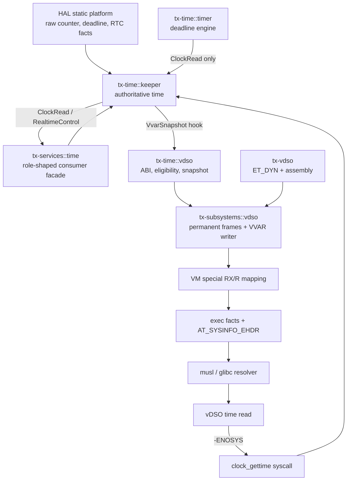
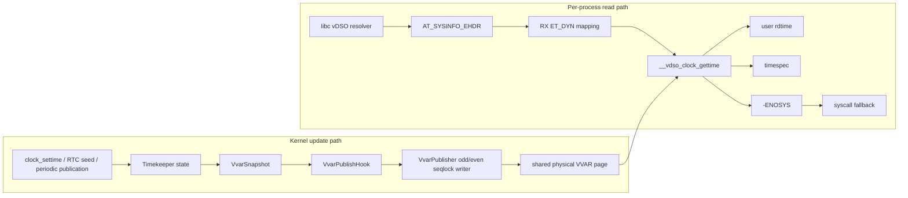
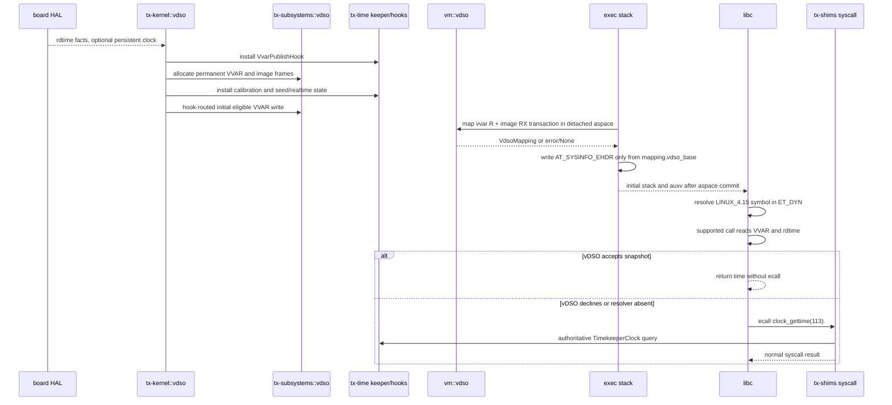

# vDSO Time ABI v1

<!-- txdoc:VDSO-TIME-ABI-V1 -->

**Status:** active v1 contract and implementation crosswalk. The RV64 image,
VVAR publisher, VM special mapping, exec auxv plumbing, and time fast path are
present. The RV64 QEMU guest witnesses prove that musl and dynamic glibc
resolve `CLOCK_REALTIME` and `CLOCK_MONOTONIC` from `AT_SYSINFO_EHDR` without
issuing `clock_gettime(113)`; an unsupported clock issues exactly one fallback
syscall. `__vdso_rt_sigreturn@LINUX_4.15` is also selected for signal-frame
return when the process has a live vDSO mapping: the guest witness proves both
the handler return address and `ecall 139` from the mapped restorer. A
four-hart guest-SMP witness also proves concurrent VVAR publication and direct
reads on disjoint harts. Remaining work is supported-board and toolchain
repetition, not an open RV64 libc ABI boundary.

This document owns the Tx vDSO time ABI, VVAR publication, page mapping, boot
and exec setup, libc fallback, and the signal-restorer placement. It defines
both the stable cross-crate contract and the current implementation boundary.
It refines the vDSO portions of [`VDSO_TLS_BOOTSTRAP_v1.md`](VDSO_TLS_BOOTSTRAP_v1.md).
That document still owns initial stack and static-musl TLS bootstrap.

## 1. Goal And Boundary

<!-- txdoc:VDSO-TIME-ABI-GOAL-1 -->

vDSO is an optional user-space fast path for time reads, not a second
timekeeper. Its only valid outcomes are a result calculated from one stable
VVAR snapshot and an eligible counter, or `-ENOSYS` so libc uses the existing
syscall path.

```text
fast: libc -> vDSO -> VVAR + user-readable counter -> result
slow: libc -> clock_gettime syscall -> tx-time Timekeeper
```

The timekeeper, timer engine, reactor, RTC, and semantic timer state remain
kernel-owned. vDSO never registers a deadline, wakes a task, mutates time, or
calls into a reactor.

RV64 v1 supplies the time functions and the signal restorer. LA64 v1 has no
vDSO image: it publishes no `AT_SYSINFO_EHDR` and libc uses syscalls.

## 2. Ownership And Module Topology

<!-- txdoc:VDSO-TIME-ABI-TOPOLOGY-1 -->



| Home | Owns | Does not own |
|---|---|---|
| `tx-time::timer` | deadline queue, `TimerEngine`, timer wake semantics | VVAR, ELF, user mappings |
| `tx-time::keeper` | authoritative monotonic/realtime state and publication hook | frames, PTEs, ELF bytes |
| `tx-time::vdso` | `repr(C)` VVAR ABI, offsets, calibration validation, counter eligibility, snapshots | frames, PTEs, auxv |
| `tx-vdso` | RV64 user `ET_DYN`, assembly, generated ELF and version records | kernel state, allocation, timer state |
| `tx-subsystems::vdso` | permanent image/VVAR frames, kernel aliases and seqlock page writer | time policy, user VA choice |
| `tx-subsystems::vm::vdso` | special recipes, PTE publication, rollback and fork sharing | clock conversion policy, auxv |
| `tx-scripts::process::exec` | detached-aspace request and `AuxvFacts` publication before PoNR | direct PTE mutation |
| `tx-kernel::vdso` | boot sequencing, calibration seed, persistent-clock seed, first snapshot | per-process placement |
| `tx-services::time` | compatibility/consumer facade re-exporting role-shaped time APIs | a second timekeeper, VVAR ABI, VM state |

`timer/` and `vdso/` are siblings under `tx-time`: neither imports the other.
The only intentional join is the timekeeper. Timer code consumes `ClockRead`
for deadline arithmetic; VVAR code receives a `VvarSnapshot` produced by the
timekeeper. Thus a timer-algorithm replacement cannot change the vDSO ABI, and
a vDSO/ELF change cannot acquire a deadline or touch the reactor.

The split has one build-time interface and one runtime interface. At build
time, `tx-vdso/build.rs` reads the canonical `VvarData` offsets and emits the
PC-relative VVAR constant plus `VDSO_RT_SIGRETURN_OFFSET`; its own output is
the immutable `ET_DYN` byte image. At runtime, the only join is the
timekeeper snapshot: `tx-time::vdso` converts it into the ABI payload and the
subsystem-owned publisher writes that payload to the VVAR frame. There is no
runtime `tx-vdso -> tx-time` call, no timer-to-vDSO call, and no vDSO-owned
kernel object.

## 3. Managed Directory Layout

<!-- txdoc:VDSO-TIME-ABI-DIRECTORIES-1 -->

```text
crates/tx-time/src/
  keeper.rs                       # authoritative state + publish hook
  clock.rs,realtime.rs,hal.rs     # role traits and HAL adapters
  timer/{mod.rs,engine.rs,queue.rs,min_heap.rs}
                                  # deadline implementation; no VVAR/ELF import
  vdso/
    mod.rs                       # narrow facade
    abi.rs                       # repr(C) VvarData and generated offsets
    clock_mode.rs                # VdsoClockMode / fast-path eligibility
    calibration.rs               # mult, shift, mask validation
    snapshot.rs                  # Timekeeper -> VvarSnapshot
                                  # page writer remains in tx-subsystems

crates/tx-services/src/time/
  mod.rs                         # compatibility facade; consumer imports land here
  {clock,deadline,driver,platform,realtime,rtc,types,wall_clock}.rs
                                  # role-shaped service API, re-exporting tx-time

crates/tx-vdso/
  build.rs                       # two-pass assembly + ET_DYN construction
  src/{lib.rs,vdso.S,tests.rs}   # image export, RV64 code, ELF contract tests
  vdso.ld                        # linker/reference layout aid

crates/tx-subsystems/src/
  vdso/mod.rs                    # permanent frames + VVAR writer
  vm/vdso.rs                     # special-map transaction and PTE publish
  vm/structure/types.rs          # VmBacking::Special and VmSpecialBacking
  time_hooks.rs                  # installs Timekeeper -> VVAR / timerfd bridges

crates/tx-scripts/src/process/exec/{script.rs,stack.rs}
crates/tx-kernel/src/vdso/{mod.rs,tests.rs}
```

`VvarData` has one definition only, in `tx-time::vdso::abi`. Assembly offsets
are generated or asserted from it; no second hand-maintained layout is allowed.

### 3.1 Cross-Directory Interface Ledger

The directory split is an ownership split, not an extra runtime layer. The
following values are the only normal cross-directory hand-offs; a caller must
not reach around them to access a page, PTE, counter register, or timer queue.

| Producer | Value/interface | Consumer | Meaning |
|---|---|---|---|
| `tx-hal` | `MonotonicCounterIf::{read_ns, vdso_counter_info, read_vdso_counter}` | `tx-time::hal` / timekeeper | static counter facts and a matching raw read |
| `tx-hal` | `DeadlineTimerIf` | `tx-time::timer` | arm/cancel the current hart interrupt source; never used by vDSO |
| `tx-hal` | `PersistentClockIf` | `tx-time::keeper` | best-effort boot seed and explicit wall-clock writeback |
| `tx-time::keeper` | `VvarSnapshot`, `VvarPublishHook` | `tx-subsystems::time_hooks` | complete semantic sample, published after releasing timekeeper state |
| `tx-time::vdso` | `VvarData`, offsets, `VdsoClockMode`, eligibility/calibration | `tx-subsystems::vdso`, `tx-vdso` build/assembly | sole user-visible layout and fast-path admission rule |
| `tx-vdso` | `VDSO_IMAGE`, `VDSO_NUM_PAGES`, `VVAR_DELTA` | `tx-subsystems::vdso` / VM | immutable image bytes and image-relative layout fact |
| `tx-subsystems::vdso` | `KernelVdso { frames }`, `vvar_ppn()` | `tx-subsystems::vm::vdso` | permanent physical frames, not user virtual addresses |
| `tx-subsystems::vm::vdso` | `VdsoLayout`, then `Option<VdsoMapping>` | exec script | one checked reservation policy, then proof that all recipes/PTEs exist with chosen user VAs |
| exec stack | `AuxvFacts::at_sysinfo_ehdr` | libc loader | `AT_SYSINFO_EHDR = VdsoMapping.vdso_base`, or absent |
| VM signal delivery | `vdso_rt_sigreturn_addr(&AddressSpace)` | `tx-kernel::thread_future` | mapped user address of the generated restorer, or `None` for the stack trampoline fallback |

This is how `tx-vdso` and `tx-time::vdso` meet without depending on each
other: `tx-time::vdso` owns **data format and admission**, while `tx-vdso`
owns **code and ELF transport**. The former provides generated or checked
field offsets to the latter at build time; neither owns timer scheduling. The
timer engine only shares the timekeeper's `ClockRead` semantic clock.

### 3.2 File-Level Responsibility And Direction

The following table is deliberately more concrete than the crate topology.
It is the review map for changes which span the generated image, the shared
frame, the VM map, and the ABI hand-off. A dependency arrow is allowed only in
the stated direction; in particular, no userspace ABI file obtains a mutable
timekeeper, timer, reactor, Pmap, or board object.

| File or directory | Local responsibility | Input | Output / next owner |
|---|---|---|---|
| `crates/tx-time/src/vdso/{abi,clock_mode,calibration,snapshot}.rs` | Defines the one `repr(C)` VVAR layout; validates counter facts and turns a timekeeper sample into a complete VVAR payload. | `VdsoCounterInfo`, `TimekeeperClock` state | `VvarSnapshot`, fixed offsets, `VdsoClockMode` for the publisher and image build checks. |
| `crates/tx-time/src/{hal,keeper,realtime}.rs` | Reads the static HAL time source, owns realtime/monotonic semantics, and invokes the publication hook after a semantic mutation. | `MonotonicCounterIf`, `PersistentClockIf`, `clock_settime` control | `ClockRead` answers and `VvarSnapshot`; no frame or PTE. |
| `crates/tx-subsystems/src/time_hooks.rs` | Installs the narrow adapter from the timekeeper hook to the VVAR writer. | `VvarPublishHook`, initialized publisher | Kernel-only publish call; it cannot choose user virtual addresses. |
| `crates/tx-vdso/{build.rs,src/vdso.S,src/lib.rs}` | Builds one immutable RV64 `ET_DYN`; the assembly consumes a stable payload and returns a result or `-ENOSYS`. | Generated offsets, image-relative `VVAR_DELTA` | `VDSO_IMAGE`, page count, restorer offset and versioned ELF metadata. |
| `crates/tx-subsystems/src/vdso/mod.rs` | Allocates permanent frames, copies immutable image bytes, owns the kernel VVAR alias and applies the odd/even write protocol. | `VDSO_IMAGE`, `VvarSnapshot` | `KernelVdso` PPNs to VM; no auxv, no process state. |
| `crates/tx-subsystems/src/vm/vdso.rs` | Derives `VdsoLayout` from the platform user top, then selects one free process-local range, commits special recipes, publishes PTEs, rolls back on failure, and resolves a live restorer VA. | `KernelVdso` frames, detached `AddressSpace`, `VdsoLayout` | `Option<VdsoMapping>` or an exec-visible error. |
| `crates/tx-scripts/src/process/exec/{script,stack}.rs` | Reuses `VdsoLayout` while placing images and stack, requests the mapping before point-of-no-return, and converts its returned address into initial auxv. | `VdsoMapping` only after full success | `AT_SYSINFO_EHDR`; the user loader receives no PPN or kernel alias. |
| `crates/tx-kernel/src/{vdso,thread_future}.rs` | Performs early kernel initialization and chooses a restorer from the current address space during signal-frame construction. | `KernelVdso`; checked `vdso_rt_sigreturn_addr()` | First VVAR publish; `SignalFrameWrite.restorer_pc`, or zero for the legacy path. |
| `crates/tx-shims/src/linux_syscall/time.rs` | Owns the slow Linux ABI after libc elects an ecall. | user `clockid`, `timespec*`, `TimekeeperClock` | Linux errno/result; does not parse VVAR or image symbols. |

This table also fixes the names of the two often-confused components:
`tx-vdso` is **user code plus ELF transport**, while `tx-time::vdso` is
**kernel ABI data plus fast-path admission**. `tx-subsystems::vdso` is neither:
it is the physical-page owner and writer. The first two meet at build-time
offset/layout validation; the latter two meet at a complete `VvarSnapshot`.

## 4. VVAR ABI And Publication

<!-- txdoc:VDSO-TIME-ABI-VVAR-1 -->

`VvarData` is one page, begins with `seq`, and has this stable v1 payload:

```text
seq, abi_version, clock_mode,
realtime_sec, realtime_nsec_shifted,
monotonic_sec, monotonic_nsec_shifted,
cycle_last, mult, shift, mask,
realtime_generation
```

Writer protocol: serialize writers; publish odd `seq` with release ordering;
write every payload field; publish even `seq` with release ordering. Reader
protocol: acquire an even sequence, read payload and eligible counter, re-read
the sequence, retry on mismatch or odd value. A reader never accepts a
counter-disabled mode, zero `mult`, or unstable counter.

## 5. Hardware Counter Contract

<!-- txdoc:VDSO-TIME-ABI-COUNTER-1 -->

HAL supplies static platform facts, not a dynamic manager:

```rust
pub struct VdsoCounterInfo {
    pub frequency_hz: u64,
    pub mask: u64,
    pub stable: bool,
    pub user_readable: bool,
    pub mode: VdsoCounterMode,
}

pub trait MonotonicCounterIf {
    fn read_ns() -> u64;
    fn vdso_counter_info() -> Option<VdsoCounterInfo>;
    fn read_vdso_counter() -> u64;
}
```

RV64 QEMU advertises a stable user-readable `rdtime`; the same source supplies
`cycle_last` and the vDSO reader. Unsupported, unstable, zero-frequency, or
zero-mult sources select syscall fallback. Timekeeper code must not bypass this
contract with architecture-local counter assembly.

### 5.1 RV64 QEMU-Virt Hardware Route

There are deliberately two hardware operations, even though they use the same
RISC-V timebase. Treating them as one would incorrectly make a userspace read
responsible for kernel wakeups.

```mermaid
sequenceDiagram
  participant DTB as firmware DTB
  participant HAL as RV64 board HAL
  participant TK as tx-time timekeeper
  participant VVAR as mapped VVAR page
  participant U as user vDSO
  participant SBI as SBI timer
  participant TE as tx-time timer engine

  DTB->>HAL: /timebase-frequency
  HAL->>TK: rdtime ticks to monotonic ns; VdsoCounterInfo
  TK->>VVAR: snapshot(cycle_last, mult, shift, mask, bases)
  U->>U: rdtime; fixed-point conversion from VVAR
  TE->>HAL: DeadlineTimerIf::set_deadline_ns
  HAL->>SBI: set_timer(rounded-up ticks)
```

For RV64 QEMU virt, the board derives the frequency from the DTB (falling back
to 10 MHz), exposes a stable full-width `RiscvTime` counter, and enables
user-mode `rdtime` by setting `scounteren.TM`. `read_ns()` is the kernel-side
ticks-to-nanoseconds conversion; `read_vdso_counter()` and the vDSO instruction
are the raw-tick pair used with the same published calibration. Separately,
`DeadlineTimerIf::set_deadline_ns()` rounds a monotonic deadline to timer ticks
and invokes the SBI timer call. RTC/persistent-clock operations are optional
and never lie on the hot vDSO read path.

## 6. Page Addresses, Image-Relative VVAR, And VM Mapping

<!-- txdoc:VDSO-TIME-ABI-MAPPING-1 -->

The vDSO ELF is `ET_DYN`; VM chooses an address inside the top 16 MiB of each
detached address space (`FULL_USER_V1_TOP - 16 MiB .. FULL_USER_V1_TOP`). There
is no global user VVAR address and a process must never infer one from a board
constant.

Three address spaces participate. They must remain distinct in both code and
review:

| Space | Owner | Address/value | May vary by process? |
|---|---|---|---|
| build-time ELF | `tx-vdso` | `ET_DYN` file offsets and symbol `st_value`s | no |
| kernel physical/direct map | `tx-subsystems::vdso` | permanent image PPNs, VVAR PPN and kernel alias | no |
| user virtual | `vm::vdso` | `VdsoMapping::{vvar_base, vdso_base}` and auxv | yes |

```text
high user address
  [ VM vDSO reservation window ]
    [ vvar_base .. vvar_base + PAGE_SIZE )     user R, kernel writable alias
    [ vdso_base .. vdso_base + vdso_size )     user R|X, immutable image
  [ guard / ordinary mappings ]

VVAR_DELTA = -PAGE_SIZE
vdso_base  = vvar_base - VVAR_DELTA = vvar_base + PAGE_SIZE
```

`VdsoLayout::for_user_top()` is the sole owner of the top-16-MiB reservation:
it clamps a platform's `USER_TOP` to `FULL_USER_V1_TOP`, validates the complete
range, and returns the checked `UserRange`. Exec uses that exact object while
placing the main image, interpreter, and stack; `map_vdso_into_aspace()` accepts
the same object rather than recalculating a second window. `vvar_base` is the
start selected by `find_free_range` inside that range; it is followed by
`VDSO_NUM_PAGES` image pages. The physical VVAR frame is shared by every
address space but maps only with `Prot::READ`; each image frame is shared and
maps with `Prot::READ_EXECUTE`. The kernel direct-map alias is the sole writer.
Thus the same physical page has many process-local virtual aliases, while its
relative relation to that process's `vdso_base` is invariant.

The only cross-layer result is:

```rust
pub struct VdsoMapping {
    pub vdso_base: UserVa,
    pub vvar_base: UserVa,
    pub vdso_size: usize,
}
```

`map_vdso_into_aspace(aspace, layout)` first finds a free contiguous range in
the supplied `VdsoLayout` for one VVAR page plus every permanent image page. It
installs `VmBacking::Special(Vvar)` as
shared/read-only and `VmBacking::Special(VdsoText)` as shared/read-execute,
then publishes the VVAR PPN and every image PPN into the Pmap. Any recipe or
PTE failure calls `try_munmap(whole)` and returns an error; callers cannot get
a `VdsoMapping` or auxv pointer from a partially installed range. Fork treats
these shared recipes as shared frames, not anonymous CoW state.

### 6.1 Mapping Transaction And Protection Matrix

The mapping function is intentionally one transaction, although its backing
has two different permissions. Its precise state transition is:

```mermaid
sequenceDiagram
  participant E as exec detached AddressSpace
  participant M as vm::map_vdso_into_aspace
  participant R as VM recipe tree
  participant P as Pmap
  participant S as exec stack builder

  E->>M: VdsoLayout + optional map request
  M->>M: find_free_range(layout window, 1 + image pages)
  M->>R: reserve+commit VVAR (SHARED, R, Special(Vvar))
  M->>R: reserve+commit image (SHARED, RX, Special(VdsoText))
  M->>P: publish VVAR PPN read-only
  loop each immutable image PPN
    M->>P: publish image PPN read-execute
  end
  alt all phases succeed
    M-->>S: Some(VdsoMapping)
  else a reserve, recipe, pin, or PTE phase fails
    M->>E: try_munmap(whole reservation)
    M-->>S: Err; do not construct auxv
  end
```

| Mapping | `VmBacking` | User PTE | Kernel writer access | VM policy |
|---|---|---|---|---|
| VVAR | `Special(Vvar)` | R, never X/W | permanent direct-map alias only | shared special frame; no CoW |
| vDSO image | `Special(VdsoText)` | R|X, never W | immutable after frame copy | shared special frame; no CoW |
| signal stack fallback | ordinary private mapping | RWX only when no restorer mapping exists | normal user-copy path | compatibility fallback, not part of vDSO mapping |

The `vdso_rt_sigreturn_addr()` lookup is deliberately a VM lookup rather than
`vdso_base + constant` performed by signal code. It first proves that the
generated offset is inside the image, then finds a live `VdsoText` recipe and
checks the resulting user address against the address space. This prevents a
signal frame from pointing into an absent, torn-down, or syscall-only mapping.

RV64 assembly locates VVAR using a PC-relative constant, never a runtime
virtual address. The build script assembles once to find the `auipc` offset
inside `.text`, then emits:

```text
VVAR_PC_DELTA = VVAR_DELTA - text_off - auipc_offset
runtime_pc    = vdso_base + text_off + auipc_offset
runtime_pc + VVAR_PC_DELTA = vdso_base - PAGE_SIZE = vvar_base
```

The second assembly bakes that delta into the image. This works at every VM
chosen `vdso_base` without dynamic relocation and is tested against the
generated ELF. `mprotect` must not make either page writable or VVAR
executable; `mremap` must not move either mapping. v1 may permit `munmap`, in
which case later libc calls must use the syscall fallback.

## 7. Boot And Exec Setup

<!-- txdoc:VDSO-TIME-ABI-SETUP-1 -->

Required steady-state sequence before the first userspace exec:

```text
1. select the static platform and initialize the page substrate;
2. construct the target image at build time; an unavailable target records an
   empty stub and is a syscall-only target;
3. allocate permanent image frames and one VVAR frame, copy the image, and
   install kernel aliases;
4. inspect `VdsoCounterInfo`, validate `frequency_hz/mask/stability/user
   readability`, and derive `mult/shift/mask`;
5. seed realtime from `PersistentClockIf` when present;
6. install the timekeeper-to-VVAR publishing hook;
7. publish the first complete snapshot under the VVAR writer seqlock;
8. expose `KernelVdso` to the VM mapper.
```

The current boot path satisfies this sequence. After `init_later()`, but
before device/rootfs initialization, `init_substrate_if_ready()` calls
`ensure_hooks_installed()`. `mount_rootfs_from_boot_media()` later invokes
`tx_kernel::vdso::init()`: it allocates the permanent VVAR/image frames,
initializes conversion parameters, attempts the persistent seed, and finally
calls `timekeeper_clock::<P>().publish_vvar()`. The final explicit publication
occurs after both the hook and VVAR frame exist, so its bridge writes the first
eligible `RiscvTime` snapshot to the shared page. A persistent-clock seed may
attempt an earlier notification, but the bridge safely ignores it while no
vDSO frame is available; it is the final publish, not that seed notification,
which establishes fast-path readiness.

The concrete current ordering is therefore:

```mermaid
sequenceDiagram
  participant PA as page substrate
  participant KI as kernel init
  participant KV as tx-kernel::vdso
  participant SV as tx-subsystems::vdso
  participant TK as timekeeper
  participant H as time_hooks
  participant EX as first exec

  PA-->>KI: frame allocator ready
  KI->>H: ensure_hooks_installed()
  H->>TK: install VvarPublishHook
  KI->>KV: mount_rootfs_from_boot_media -> init()
  KV->>SV: init_vdso() allocates/copies permanent frames
  KV->>TK: set calibration; seed persistent realtime; publish initial VVAR
  EX->>SV: get image/VVAR PPNs through VM mapper
```

The final direct publish makes the first page both valid and fast-path-ready;
later timekeeper mutations use the same installed bridge.

Exec, before PoNR:

```text
1. build detached AddressSpace and map ELF LOAD segments
2. map stack
3. derive `VdsoLayout` once, reserve it during image/stack placement, then request optional VM VVAR/vDSO special mapping with it
4. construct AuxvFacts from VdsoMapping
5. build stack with AT_SYSINFO_EHDR = vdso_base
6. atomically commit AddressSpace and user context
```

`map_vdso_into_aspace()` runs in Phase 4b after ELF segments and before stack
construction. `vdso_auxv(mapping)` writes the exact `mapping.vdso_base` into
`AuxvFacts.at_sysinfo_ehdr`; the stack writer emits tag 33 only for a nonzero
`Some` value. Unavailable targets return `Ok(None)`. A mapping failure is an
exec error before auxv construction and address-space publication. Therefore
no partial PTE or dangling `AT_SYSINFO_EHDR` may cross PoNR.

The complete per-exec hand-off is therefore `KernelVdso physical frames ->
VdsoMapping process-local VAs -> AuxvFacts -> initial user stack -> libc ELF
lookup`. A user process may cache its own `AT_SYSINFO_EHDR`, but no kernel or
libc component may treat it as a globally valid virtual address.

## 8. ELF, Libc, And Syscall Contract

<!-- txdoc:VDSO-TIME-ABI-LIBC-1 -->

The current RV64 image exports:

```text
__vdso_clock_gettime@LINUX_4.15
__vdso_gettimeofday@LINUX_4.15
__vdso_clock_getres@LINUX_4.15
__vdso_rt_sigreturn@LINUX_4.15
```

`build.rs` constructs the image as a page-padded `ET_DYN` with `PT_LOAD` (R-X)
and `PT_DYNAMIC` (R), a SysV hash, dynamic string/symbol tables, and
`DT_STRTAB`, `DT_STRSZ`, `DT_SYMTAB`, `DT_SYMENT`, `DT_VERSYM`, `DT_VERDEF`,
and `DT_VERDEFNUM`. All four symbols carry `LINUX_4.15`; generated-image
tests cover headers, dynamic tags, symbol alignment, version records, the
restorer symbol offset, and the VVAR delta. There are no runtime relocations.
The builder normalizes any assembler-local prefix padding before exporting
symbol values or calculating the
PC-relative VVAR delta, so the current explicit-RV64 host contract suite is
green. The remaining ELF gate is cross-toolchain repetition, not a known
placement discrepancy.

The time functions use RV64 C ABI and return zero or a negative Linux errno.
`__vdso_clock_gettime(a0=clockid, a1=timespec*)` fast-paths only realtime,
monotonic, and their coarse variants. It seqlock-samples VVAR, verifies
`RiscvTime` mode and nonzero `mult`, uses user `rdtime`, then converts
`((counter - cycle_last) & mask) * mult + shifted_base` with `shift` and
normalization. Ineligible counters and all unsupported IDs return `-ENOSYS`.
`gettimeofday` delegates to realtime `clock_gettime`; `clock_getres` reports
the vDSO-specific high-resolution or coarse value.

musl resolves `AT_SYSINFO_EHDR` by walking `PT_LOAD`/`PT_DYNAMIC` and looking
up `__vdso_clock_gettime@LINUX_4.15`. It accepts zero as success, preserves
`-EINVAL`, and falls through to syscall for `-ENOSYS` and other failures. The
slow path is `SYS_clock_gettime` (RV64 number 113), implemented by
`tx-shims::linux_syscall::time` and backed by `TimekeeperClock`. Thus syscall
semantics remain authoritative. The current syscall implementation still
aliases several not-yet-modelled IDs (CPU-time, RAW, BOOTTIME, TAI and alarm
variants); that compatibility debt must be removed before claiming the ABI
matrix is complete. The vDSO must never manufacture answers for those IDs.

The syscall path is not part of the vDSO image. It is intentionally a separate
kernel ABI path:

```text
libc resolver
  -> supported VVAR result: return directly
  -> missing auxv/image, malformed lookup, or -ENOSYS
       -> ecall SYS_clock_gettime (113)
          -> tx-shims::linux_syscall dispatch
             -> sys_clock_gettime / sys_gettimeofday / sys_clock_getres
                -> TimekeeperClock -> tx-time Timekeeper
```

`clock_gettime` and `gettimeofday` can also use the trap-shell immediate query
lane, but that is only a kernel scheduling optimization after the ecall. It
does not change the source of truth, user-copy fault rules, or fallback
contract. `__vdso_clock_getres` is exported for the four supported vDSO clock
IDs; all other IDs, and any libc resolver that does not select that symbol,
continue through the syscall ABI.

### 8.1 Resolver And Fallback Ownership Matrix

The kernel does not branch from a vDSO call into a syscall. The vDSO returns a
Linux-shaped result; libc owns resolver selection and the fallback ecall. This
matrix is normative because it prevents a future image from accidentally
embedding a kernel ABI transition or returning a fabricated value.

| Condition observed by libc or vDSO | vDSO result | Next actor | Kernel effect |
|---|---|---|---|
| No `AT_SYSINFO_EHDR`, target has no image, or dynamic lookup rejects image/version | no call | libc | issue normal syscall 113 when application requested `clock_gettime`. |
| Eligible supported clock, stable even VVAR sequence and `RiscvTime` counter | `0` and output | application | no trap, no reactor, no timer operation. |
| Writer active or sequence changed while reading | internal retry | vDSO | still no trap; successful retry uses one snapshot. |
| Counter disabled, non-user-readable, unstable, zero `mult`, or unsupported clock ID | `-ENOSYS` | libc | libc issues syscall 113; `tx-shims` queries the timekeeper. |
| User output pointer fault on the syscall route | syscall error | `tx-shims` | normal user-copy fault/errno rules apply; vDSO does not attempt kernel fault recovery. |
| `-EINVAL` from a selected vDSO function | `-EINVAL` | libc/application ABI | preserve invalid-clock semantics rather than silently substituting another clock. |

Musl's RV64 resolver walks the auxv image and accepts the `LINUX_4.15` symbol
contract. Dynamic glibc is a separate consumer with the same requirements; the
`entry-dynamic.exe` guest witness now proves its `clock_gettime` fast path and
the no-`113` trace window. Both libraries remain subject to the same fallback
rules above. A new libc, board, counter mode, or cross-toolchain image is not
covered merely by that proof and must repeat the resolver and syscall evidence.

### 8.2 Complete User Time ABI Coverage

The vDSO intentionally accelerates only read-only time queries. It is neither
a generic time-syscall shim nor a timer queue. This table fixes the boundary
between the mapped ELF, libc wrappers, and the kernel ABI so that adding an
entry point cannot accidentally bypass timekeeper or timer semantics.

| Application/libc API | First selection | vDSO role | Kernel route when needed | Reason it is or is not a vDSO function |
|---|---|---|---|---|
| `clock_gettime` | libc resolves `__vdso_clock_gettime` through `AT_SYSINFO_EHDR` | Direct fast path for realtime, monotonic, and coarse variants; otherwise returns `-ENOSYS` | `SYS_clock_gettime` = 113 -> `tx-shims::linux_syscall::time` -> `TimekeeperClock` | Pure snapshot read can use VVAR plus a user-readable counter. |
| `gettimeofday`, `time` | libc lowers to realtime clock read | Indirectly uses `__vdso_clock_gettime` / `__vdso_gettimeofday` | `SYS_gettimeofday` = 169 or libc's clock-gettime fallback -> timekeeper | Both expose a read-only realtime value; they do not receive an independent Tx fast path. |
| `clock_getres` | libc may resolve `__vdso_clock_getres` | Reports resolution only for the four accepted fast clocks | `SYS_clock_getres` = 114 -> time syscall shim | The vDSO returns no invented resolution for an unsupported clock. |
| `clock_settime`, `settimeofday`, `adjtimex` | syscall | None | control syscall -> `RealtimeControl` -> timekeeper mutation -> VVAR publish hook | Mutates kernel authority, permission state, timerfd realtime deadlines, and persistent-clock policy. |
| `nanosleep`, `clock_nanosleep` | syscall | None | `SYS_nanosleep` = 101 or `SYS_clock_nanosleep` = 115 -> async shim -> timer registry -> reactor wake | A sleep owns cancellation, signal interruption, remaining-time, and deadline registration; it cannot be a user counter read. |
| `timerfd`, POSIX interval timers, `alarm` | syscall / fd ABI | None | timer subsystem registers a kernel deadline and emits a readiness/signal event | These are future events and consumers, not a query against a stable VVAR snapshot. |

The first three rows may finish without a trap. All other rows intentionally
remain below the user/kernel boundary. In particular, the reactor consumes a
timer wake after the timer registry has selected a deadline; it is never an
intermediate hop in a vDSO read or VVAR publication.

## 9. Signal Restorer

<!-- txdoc:VDSO-TIME-ABI-SIGNAL-1 -->

`__vdso_rt_sigreturn` is a separate vDSO export because the vDSO is the
always-mapped executable page available to a signal handler. Its RV64 body is
only `a7 = 139; ecall`; the syscall implementation restores the saved user
context and the normal trap-return path resumes it. It does not share the time
read code path or VVAR data.

```mermaid
sequenceDiagram
  participant SIG as signal delivery
  participant VM as AddressSpace
  participant HAL as RV64 SignalFrameIf
  participant U as user handler
  participant V as __vdso_rt_sigreturn
  participant SC as rt_sigreturn syscall

  SIG->>VM: vdso_rt_sigreturn_addr(aspace)
  alt live VdsoText mapping
    VM-->>SIG: mapped restorer user VA
    SIG->>HAL: SignalFrameWrite(restorer_pc = VA)
    HAL->>U: handler context with ra = restorer VA
    U->>V: normal return
    V->>SC: ecall 139
  else no vDSO image/mapping
    VM-->>SIG: None
    SIG->>HAL: restorer_pc = 0
    HAL->>U: legacy stack trampoline; make trampoline page executable
  end
```

The vDSO case keeps the signal-frame stack non-executable; the legacy path is
retained only for targets without a vDSO mapping. This is an ownership rule:
the VM owns whether the mapping exists, the kernel signal-delivery path chooses
the restorer address, and the board `SignalFrameIf` writes ABI registers. No
board code parses ELF and no signal code synthesizes the image address.

## 10. End-To-End Read And Update Paths

The following two paths are intentionally asymmetric. The reader is
lock-free, userspace-only, and may decline to answer; the writer is kernel-only
and serializes publication. Neither path runs the timer wheel or reactor.



Publication constraints are: one serialized writer, odd sequence before any
field mutation, release ordering before even sequence, and a reader retry if
either sequence is odd or changed. A snapshot with an ineligible counter sets
`cycle_last = 0` and publishes syscall mode, which forces the vDSO to return
`-ENOSYS` without reading a potentially unsuitable counter.

### 10.1 Complete Setup-To-Read Chain

This sequence ties the global stack to the file-level ownership table. It is
also the required debugging order for a missing vDSO fast path: first inspect
the physical image/page state, then the process-local VM map and auxv, then
libc lookup, and only last the arithmetic.



The timer engine and reactor are absent from this sequence by design. The
board's `DeadlineTimerIf` is consumed below the timer engine to arrange a
future interrupt; it is not the same interface as user-readable `rdtime` and
never appears in a time-read vDSO call. Likewise, an update caused by
`clock_settime`, an RTC seed, or periodic timekeeper maintenance may publish
VVAR, but publication itself schedules no reactor task.

## 11. Implementation State And Gates

<!-- txdoc:VDSO-TIME-ABI-PLAN-1 -->

| Gate | Current state | Required proof before closure |
|---|---|---|
| ABI image | Four `LINUX_4.15` RV64 symbols (three time entries plus signal restorer) and generated ELF tests are green; the builder normalizes assembler-local `.text` prefix padding before emitting symbol values and VVAR delta. | Re-run the ELF contract suite on every supported cross-toolchain. |
| VVAR writer | Kernel page uses a serialized writer and odd/even sequence protocol. | reader/writer stress proves no torn snapshot or permanently odd sequence. |
| Counter | RV64 QEMU provides `rdtime`; eligibility is represented by `VdsoCounterInfo`. | Unstable, non-user-readable, zero-frequency, and zero-`mult` routes prove syscall fallback. |
| VM mapping | `VmBacking::Special(Vvar|VdsoText)`, R/RX PTEs, rollback, and shared fork recipes exist. | mprotect/mremap/munmap policy tests and failure rollback cover every PTE phase. |
| Exec/auxv | Phase 4b maps before stack construction and emits auxv only for `Some(mapping)`. | `AT_SYSINFO_EHDR` equals a live RX ELF mapping in an actual exec image. |
| RV64 libc | Musl and dynamic glibc guest witnesses parse `AT_SYSINFO_EHDR`, ELF and `LINUX_4.15`; `CLOCK_REALTIME` and `CLOCK_MONOTONIC` complete without syscall 113, while an unsupported ID issues exactly one fallback syscall. | Repeat the same resolver and fast/fallback proof for every supported libc/toolchain/board combination. |
| Signal restorer | Generated symbol, VM address resolution, signal-frame selection and non-executable-stack host tests are present. The RV64 guest witness captures `ra == __vdso_rt_sigreturn` and scopes ecall 139 to the vDSO restorer PC. | Repeat on every supported RV64 toolchain/libc combination; retain stack-trampoline fallback coverage for targets without an image. |
| SMP | RV64 QEMU guest acceptance passes: a CPU1 writer performs 1024 `clock_settime(CLOCK_REALTIME)` updates while a CPU0 reader makes 500000 calls through the resolved `__vdso_clock_gettime` address. The machine-readable witness reports both affinity masks, `reader-path=direct-vdso`, both completions, and zero reader errors. The separate RV64 fast-path witness supplies the syscall-113 trace proof. | Repeat on each future SMP board/counter implementation; retain this exact disjoint-reader/writer contract. |

A final release acceptance requires host ELF/VM/exec tests; RV64 musl and glibc guest probes
for `getauxval(AT_SYSINFO_EHDR)`, ELF parsing, symbol resolution and time
values; syscall or trap evidence that supported clocks avoid ecall; LA64
fallback proof; guest restorer proof; and SMP reader-versus-realtime-writer
stress. The current RV64 witnesses close the musl, dynamic-glibc,
signal-restorer, and SMP VVAR gates. Broader supported-board and toolchain
repetition remains release validation rather than an open architectural
boundary.

## 12. Rules

<!-- txdoc:VDSO-TIME-ABI-RULES-1 -->

- No hardcoded user VVAR address.
- No upper-layer direct counter assembly.
- No duplicate VVAR layout outside `tx-time::vdso::abi`.
- No auxv publication without a live RX vDSO mapping.
- No vDSO timer, RTC, reactor, or write path.
- No fast-path aliasing of clocks without correct kernel semantics.
- No libc-complete claim without versioned-symbol and guest-resolver proof for
  that libc and toolchain.
- Initial fast-path readiness requires the hook, permanent VVAR frame, and
  eligible snapshot; `tx_kernel::vdso::init()` publishes only after all three
  exist.
