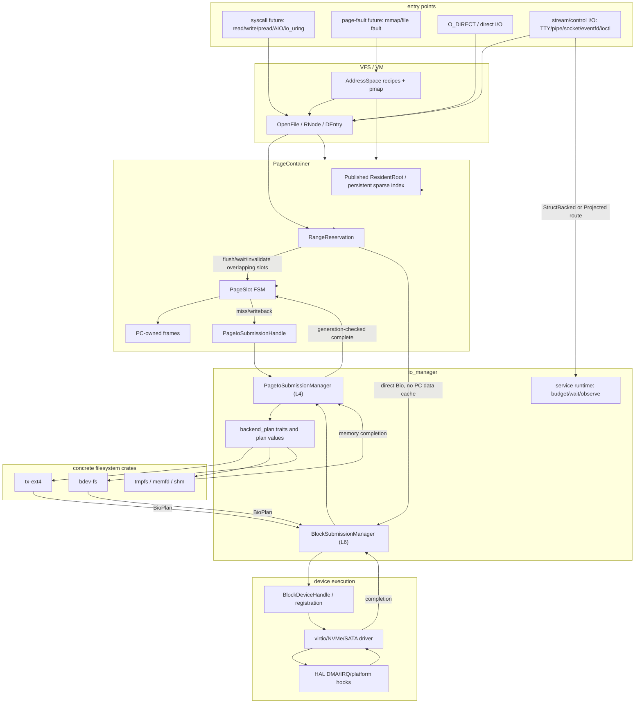
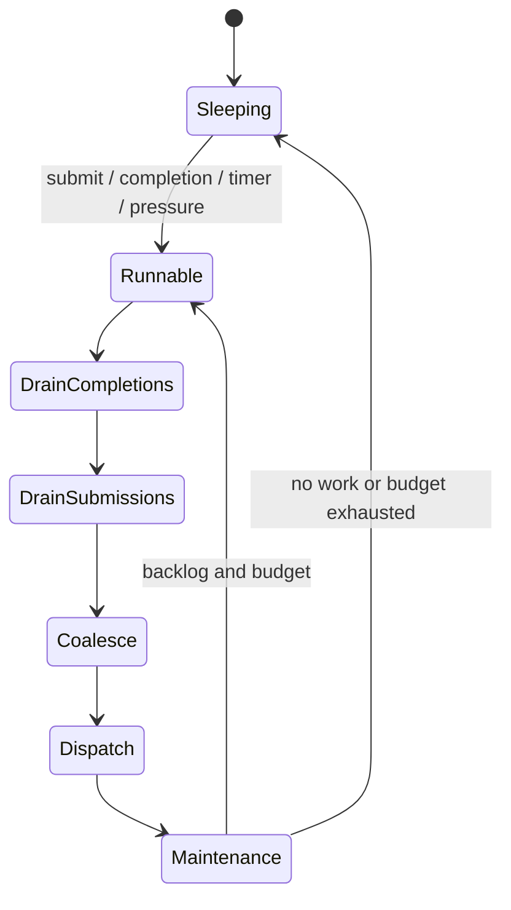
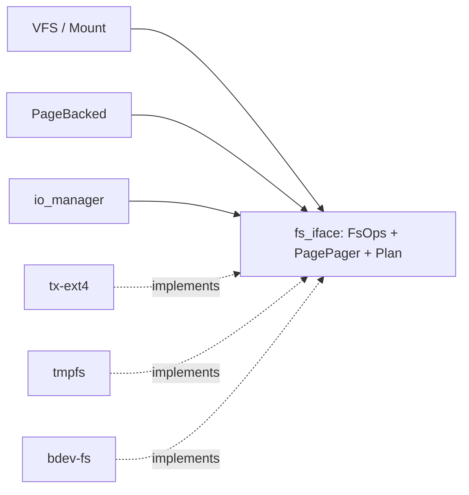

# I/O Manager

<!-- txdoc:05-FILESYSTEM-IO-MANAGER-V1 -->

**Status.** v1 (2026-07-11). Draft architecture contract.

**Purpose.** Specify the txKernel I/O control plane that sits between
`PageContainer` and device execution. The I/O manager is not a data cache and
not a concrete filesystem. It owns submission queues, service futures,
batching, priority, request completion, and block-request scheduling. It keeps
ordinary file data owned by `PageContainer`, filesystem mapping owned by the
mounted filesystem instance, and device execution owned by the device/driver
layer.

**Audience.** PageBacked, VFS, filesystem, device, and reactor implementers
working on the cold-file, mmap-fault, iozone, AIO, and block-device throughput
paths.

**Companion documents.**

- [`MEMORY_IO_ARCHITECTURE_v1.md`](../03_memory-vm/MEMORY_IO_ARCHITECTURE_v1.md) - canonical dual-plane ownership, `PageDataLease`, pure layout planning, zero-copy payload, memory pressure, and allocation slow-path contract.
- [`PAGE_BACKED_v1.md`](../03_memory-vm/PAGE_BACKED_v1.md) - `PageContainer`
  as the page-indexed content owner.
- [`OBJECT_API_LANES_v1.md`](../00_meta-framework/OBJECT_API_LANES_v1.md) -
  publication families, owner-private roots, and manager/state-machine
  exclusions.
- [`VM_v1_2.md`](../03_memory-vm/VM_v1_2.md) - VM recipes and pmap
  publication. VM consumes PageBacked materialization but does not own the file
  cache.
- [`MOUNT_v1.md`](MOUNT_v1.md) - mounted filesystem instance hosting and
  `MountPayload` lifetime.
- [`VFS_CHECKS_V2.1.md`](VFS_CHECKS_V2.1.md) - path and open-file witnesses.
- [`BDEV_FS.md`](BDEV_FS.md) - block devices exposed as page-backed files.
- [`TX_EXT4_PLAN_v1_2.md`](TX_EXT4_PLAN_v1_2.md) - ext4 as a concrete
  filesystem backend.
- [`DEVICE.md`](../06_devices/DEVICE.md) - static block-device registrations
  and driver/device routing.
- [`03_STEP_MODEL_v2.md`](../../Txv3/03_STEP_MODEL_v2.md) - bounded steps,
  `StepOutcome`, and commit/publish discipline.
- [`COMPLETION_v1.md`](../02_execution/COMPLETION_v1.md) - completion objects
  as wait middleware.

---

## 1. Problem statement

<!-- txdoc:IO-MANAGER-PROBLEM-STATEMENT-1 -->

The current staged implementation has a correct PageBacked shape but a
serializing I/O path:

```text
read/fault -> PageContainer -> FsPageBacking::fetch_page
           -> concrete filesystem pager -> BlockDeviceOps::read_blocks
           -> virtio driver lock -> device
```

The path is inefficient for large or cold file workloads because it combines:

- single-page fetches;
- a coarse `PageContainer` state lock;
- a sparse page index currently backed by a `BTreeMap`;
- filesystem pager locks that serialize a mounted instance;
- synchronous block-device calls with no request tag or completion queue;
- repeated 4 KiB staging copies; and
- no generic file-data readahead or block-request merging.

The live tree is currently bifurcated. Planner-backed ext4 requests can pass
through L4 planning and L6 block submission, while compatibility ext4 and
bdev-fs paths still call filesystem/block-device operations synchronously and
bypass L6 scheduling. Publication work must not hide this ownership gap: the
manager boundary is complete only when ordinary file-page misses and
writeback commit requests into L4 and all block plans enter L6.

The I/O manager breaks this path into asynchronous submission and completion
boundaries without changing the content ownership model. A syscall, page-fault,
or writeback step commits a request and yields. Long-lived service futures
batch, map, dispatch, and complete the request.

---

## 2. Ownership rule

<!-- txdoc:IO-MANAGER-OWNERSHIP-RULE-1 -->

The I/O manager is a control plane. It must not become a second page cache.

| Layer | Owns ordinary file data? | Owns |
|---|---:|---|
| `PageContainer` / `PageSlot` | Yes | published resident bindings, frame evidence, dirty/writeback generation state |
| `PageIoSubmissionManager` | No | `PageIoRequest`s, batches, execution priority, readahead/writeback mechanics, request waiter routing |
| Concrete filesystem | No, except private metadata | logical-file mapping, metadata cache, allocation/journal order |
| `BlockSubmissionManager` | No | `Bio`, request tags, queue depth, LBA merge, barrier ordering |
| Driver/HAL | No | DMA mapping, hardware descriptors, IRQ or polling completion |

The only long-lived ordinary file-data cache is the `PageContainer`. Filesystem
metadata caches are allowed when they are private to a mounted filesystem and
do not duplicate ordinary file data. Driver bounce buffers are temporary DMA
staging objects and must be released after completion.

Global memory pressure and dirty-budget policy are not owned by the I/O
manager. The memory-pressure coordinator decides when and how much background
reclaim/writeback to request; L4/L6 provide bounded execution, queue/service
feedback, and typed completion.

---

## 3. Global architecture

<!-- txdoc:IO-MANAGER-GLOBAL-ARCHITECTURE-1 -->



Buffered file I/O and file-backed mmap use the `PageContainer` path.
`O_DIRECT` bypasses the PC data cache but not PC coherency. Stream, message,
and control I/O do not use `PageContainer` unless their object is explicitly
page-backed.

---

## 4. Layer responsibilities

<!-- txdoc:IO-MANAGER-LAYER-RESPONSIBILITIES-1 -->

### 4.1 L4 - page submission

<!-- txdoc:IO-MANAGER-L4-PAGE-SUBMISSION-1 -->

The L4 page-submission layer schedules requests keyed by
`(PageContainer, PageIndex range)`. It knows page-cache semantics and does not
know device LBA layout.

Its target owner type is `PageIoSubmissionManager`; PageContainer holds only a
typed `PageIoSubmissionHandle`. The current `PageService` plus
`PageRequestQueue` implementation is the staging backend. Its submission,
completion, backend-resume, metadata-continuation, graph, and waiter state must
move out of `PageContainerState` before resident publication removes the coarse
PC lock.

It owns:

- `PageIoRequest`, `PageIoBatch`, and `PageIoCompletion`;
- demand-read, mmap-fault, writeback, fsync, and readahead priority;
- same-page miss deduplication and waiter routing;
- page-range batching and short plug windows;
- generic file-data readahead policy;
- dirty/writeback scan cursors; and
- completion application through `PageContainer` public APIs.

It does not own:

- ordinary file-data frames after completion;
- filesystem extent or allocation state;
- block-device queue depth or tags; or
- driver DMA descriptors.

### 4.2 L5 - backend planning

<!-- txdoc:IO-MANAGER-L5-BACKEND-PLANNING-1 -->

L5 is an interface layer, not a concrete filesystem module. It translates
logical page requests into a filesystem-neutral plan. Concrete filesystems
implement the planner interface.

L5 receives:

- `FsObjectId` or equivalent mounted-filesystem object identity;
- logical page ranges and operation type;
- source frames for writeback or target slots for read;
- fsync/truncate/fallocate/direct-I/O context; and
- the current guard/wait context.

L5 returns a plan:

```rust
pub enum PageIoPlan {
    Complete(PageCompletionList),
    SubmitBios(BioPlanList),
    MetadataFirst {
        bios: BioPlanList,
        resume: PagerResumeToken,
    },
    Yield(WaitEndpoint),
    Err(Errno),
}
```

Examples:

- ext4 maps file pages through inode and extent metadata, returns zero-fill for
  holes, allocates blocks on writeback, and returns block bios for mapped
  extents.
- tmpfs, memfd, and shm complete from memory and usually do not produce block
  bios.
- bdev-fs maps page offsets directly to block-device LBA ranges.

Concrete filesystem crates must not be imported by `io_manager`. They
implement neutral traits consumed through `MountPayload`.

Filesystem mapping caches may independently use publication when they expose
immutable mapping facts. In particular, an ext4 mapping/extent root is a strong
conditional candidate after journal commit, truncate, hole conversion, and
block-reuse invalidation define their generation rules. Filesystem parser,
journal, allocation, and compatibility pager state are not RCU roots.

Observational filesystem read caches are a separate conditional family. An
ext4 lookup/directory/metadata snapshot may be published only after positive
and negative entry generations share one invalidation boundary and read-side
LRU mutation is removed or split into independent atomic accounting. Such a
snapshot accelerates lookup; it does not become filesystem namespace or inode
allocation authority.

### 4.3 L6 - block submission

<!-- txdoc:IO-MANAGER-L6-BLOCK-SUBMISSION-1 -->

The L6 block-submission layer schedules requests keyed by
`(device, op, LBA range, flags)`. It knows device queueing and ordering, not
file pages or inodes.

Its target owner type is `BlockSubmissionManager`. The current `BlockQueue`,
`QueueDepth`, `BlockTagTable`, `BlockServiceDriver`, and completion trackers are
the staging backend. They move behind a manager handle rather than into a
PageContainer root. Their queue and completion state remains mutable.

It owns:

- `Bio`, `BioVec`, `BlockRequest`, and request IDs;
- front/back adjacent LBA merge;
- queue-depth accounting;
- tag allocation and tag-to-request completion lookup;
- flush, FUA, and barrier ordering;
- request timeout and retry policy; and
- fairness between foreground demand I/O, fsync, writeback, readahead, and raw
  block-device users.

The existing `BackendBioGraph` is the sole BIO DAG. It is extended in place
with retained lease slices, barrier domains, inherited priority, and typed
completion routes. A second graph type is forbidden. Graph nodes may carry an
existing PageBacked page-cache source/target or a direct-I/O DMA-pinned
source/target; the variants retain their distinct lifetime and coherency rules.

The first production scheduler should be deliberately small: FIFO with
adjacent merge, read-deadline bias, queue-depth limits, tag completion, and
strict barrier fences. More complex BFQ/Kyber-like policies are later
optimizations.

### 4.4 L7 - driver execution

<!-- txdoc:IO-MANAGER-L7-DRIVER-EXECUTION-1 -->

The driver layer owns hardware protocol details only:

- DMA pin/map or bounce-buffer setup;
- descriptor construction;
- virtqueue or hardware-queue submission;
- device notification;
- IRQ or polling completion harvest; and
- hardware status translation.

Drivers must not implement generic file-data readahead, page-cache state,
filesystem metadata policy, or block scheduler fairness.

---

## 5. Service futures

<!-- txdoc:IO-MANAGER-SERVICE-FUTURES-1 -->

I/O manager services are long-lived kernel service futures. They are
actor-like because they own queues and are woken by messages, but they are not
pure actors: hot resident page reads still observe `PageSlot` state directly.



Service futures include:

| Service | Queue owner | Primary wake sources |
|---|---|---|
| `kpageiod` | page requests and page completions | demand miss, mmap fault, `readahead`, page completion |
| `kwriteback` | dirty-page cursors | fsync, dirty thresholds, memory pressure, periodic timer |
| `kblockiod` | block bios and requests | bio submission, hardware completion, queue-space timer |
| driver poll/completion service | hardware completion rings | IRQ, polling timer, outstanding request count |

The reactor should give completion processing a small hard-priority budget
before running new submissions. A typical service turn is:

```text
drain completions
admit new submissions
pick work by priority and budget
coalesce page ranges or LBA ranges
dispatch until queue depth or budget is exhausted
run background maintenance
sleep only after rechecking queues
```

---

## 6. Plugging, priority, and readahead

<!-- txdoc:IO-MANAGER-PLUG-PRIORITY-READAHEAD-1 -->

Plugging and readahead solve different problems:

- plug controls when queued requests flush downward;
- readahead controls which optional future pages are requested.

Demand requests may use a very short plug window bounded by the current future,
reactor turn, batch threshold, queue-idle state, or impending yield. Readahead
and background writeback may wait longer and are cancellable.

Initial priority order:

1. completion processing;
2. demand page faults and foreground reads;
3. fsync-required writeback and barriers;
4. normal foreground writes;
5. readahead;
6. background writeback.

The first L4 readahead policy is adaptive but conservative:

```text
first miss: demand page plus a small optional window
sequential hit: grow the window up to a cap
readahead marker hit: trigger the next asynchronous window
random access: shrink or disable the window
memory or queue pressure: drop optional tail
```

Readahead installs pages into `PageContainer` only. VM PTE prefault is a
separate VM policy and must not be implied by file-data readahead.

---

## 7. `PageContainer` synchronization boundary

<!-- txdoc:IO-MANAGER-PC-SYNC-BOUNDARY-1 -->

The PageBacked hot path must not become four nested locks. The structures are
semantic layers, not lock layers.

The live staging implementation currently places resident bindings,
`PageSlot`s, L4 `PageService`, direct-I/O state, range reservations, and L6
block runtime under one `PageContainerState` lock. A normal cached file hit can
enter that lock for range-conflict observation, hit probing, resident pin
snapshot, and post-pin revalidation. This shared lock is an implementation
seam to remove, not the target synchronization model.

| Structure | Role | Initial implementation | Later implementation |
|---|---|---|---|
| `PageContainer` | content-owner boundary, size, backend reference, manager handles | coarse staging state plus atomics | same public API with split private owners |
| resident root | page-to-stable-cell binding | locked `BTreeMap` sparse backend | `Published<ResidentRoot>` with persistent path-copy sparse index |
| `PageSlot` / resident cell | per-page generation and state | per-slot lock plus duplicated marks | one authoritative state cell; atomic hot observation plus serialized transitions |
| `RangeReservation` | range semantic exclusion | locked interval table | optimized range lock |
| `PageIoSubmissionManager` | L4 requests, completions, graphs, request waiters | `PageService` embedded under PC state | dedicated single-owner/service state behind typed handle |
| `BlockSubmissionManager` | L6 queue, depth, tags, trackers | `BlockQueue` runtime embedded under PC state | dedicated single-owner/service state behind typed handle |
| `PageDataLease` | multi-page payload lifetime and PageSlot generations | staged one-page `PageLease` plus `IoDataSource`/`IoDataTarget` | PageBacked-issued immutable multi-page capability lowered into existing graph nodes |

Resident read hit target:

```text
pin epoch/guard
resident.read(guard).lookup(page)
resident.hot_state.load(Acquire)
acquire owned MapPin
Resident -> copy/map frame
```

The resident-hit path does not enter either submission manager. Read-side
range-conflict hints may later use a bounded atomic or immutable summary, but
the authoritative `RangeReservation` table and reserve/release transitions
remain serialized.

Only miss, write, truncate, direct I/O, and writeback paths should take
stronger locks. No `PageContainer`, slot, index, or range lock may be held
while executing filesystem or device I/O.

`RangeReservation` does not replace slot state. It protects logical file
ranges, including pages that do not yet have slots. It is required for
`O_DIRECT`, truncate, fallocate/hole punch, and fsync fences.

Resident installation validates the `PageSlot` completion generation before
publishing the new root. Reclaim, truncate, direct-write invalidation, and
explicit withdrawal mark the stable cell withdrawn and publish root removal
before releasing the governing range/direct-I/O reservation. Waiter wakeup is
after publication. Previously acquired `MapPin`s and installed PTEs follow
their normal VM teardown/shootdown lifetime; RCU is not their revocation
mechanism.

---

## 8. `O_DIRECT` and coherency

<!-- txdoc:IO-MANAGER-ODIRECT-COHERENCY-1 -->

`O_DIRECT` bypasses the PC data cache but not PC coherency. It uses
`RangeReservation` plus page-slot invalidation/writeback, not special logic in
`SparseIndex`.

Direct read:

1. reserve the direct-read range;
2. wait for overlapping writeback and flush overlapping dirty pages;
3. submit direct bios into user/iov pages or pinned direct buffers;
4. preserve or invalidate overlapping clean resident slots according to the
   mounted filesystem's coherency policy; and
5. release the range and wake waiters.

Direct write:

1. reserve the direct-write range;
2. block new buffered faults/writes in the range;
3. wait for or flush overlapping dirty/writeback slots;
4. submit direct bios from user/iov pages;
5. on success, invalidate overlapping resident clean slots or update full-page
   aligned slots if that optimization is explicitly implemented; and
6. release the range and wake waiters.

The conservative first implementation should invalidate overlapping resident
slots after successful direct writes instead of trying to update them in place.

---

## 9. Filesystem isolation

<!-- txdoc:IO-MANAGER-FILESYSTEM-ISOLATION-1 -->

The I/O manager must not import concrete filesystem crates. The isolation
boundary is a neutral pager/plan interface hosted by the mounted filesystem
payload.



The target interface split is:

- `FsOps`: namespace and metadata operations consumed by VFS and Mount.
- `PagePager` or successor to `FsPageBacking`: page-data planning consumed by
  PageBacked/I/O manager.
- `PageIoPlan`/`BioPlan`: neutral intermediate representation between page
  requests and block requests.

The existing `FsPageBacking::fetch_page` / `flush_page` surface is the current
staging form. The I/O manager target refactors it into a planning interface so
that filesystems produce plans and the I/O manager owns asynchronous execution.
Until that migration lands, existing concrete filesystem implementations remain
valid staging code.

---

## 10. Stream and control I/O

<!-- txdoc:IO-MANAGER-STREAM-CONTROL-IO-1 -->

Not every I/O object uses `PageContainer` or I/O manager page submission.

| Object class | PC path? | Route |
|---|---:|---|
| regular ext4 file | yes | PageContainer -> page submission -> ext4 planner -> block submission |
| file-backed mmap | yes | VM recipe -> PageContainer -> page submission |
| tmpfs/memfd/shm | yes | PageContainer -> memory pager completion |
| block device file (`/dev/vda`) | yes | bdev-fs PageContainer -> block submission |
| framebuffer/PageBackedDevice | yes | prepopulated device pages, usually no block submission |
| TTY, pipe, socket | no | subsystem queue/ring plus readiness wait |
| eventfd/timerfd/signalfd | no | small subsystem state plus wait source |
| ioctl/control | no | typed control operation |

Stream and message subsystems may have their own service futures and wait
sources. They must not be forced through page submission unless the object is
explicitly page-backed.

---

## 11. Proposed module topology

<!-- txdoc:IO-MANAGER-MODULE-TOPOLOGY-1 -->

The implementation should keep data ownership and control-plane code in
separate modules:

```text
crates/tx-subsystems/src/page_backed/
    container.rs
    slot.rs
    range.rs
    index/
        sparse.rs
        btree.rs
        txarray.rs
    materialize.rs
    user_buffer.rs

crates/tx-subsystems/src/io_manager/
    page/
        request.rs
        queue.rs
        service.rs
        readahead.rs
        writeback.rs
        completion.rs
    backend/
        traits.rs
        plan.rs
        error.rs
    block/
        bio.rs
        request.rs
        queue.rs
        tag.rs
        barrier.rs
        service.rs
        completion.rs
    runtime/
        budget.rs
        wait.rs
        priority.rs
        observe.rs

crates/tx-subsystems/src/fs_iface/
    ops.rs
    pager.rs
    plan.rs
```

Concrete filesystems stay outside `io_manager`:

```text
crates/tx-ext4/src/
    mapper.rs
    metadata_cache.rs
    page_backend.rs

crates/tx-fs/src/bdevfs/
    backing.rs
    coherence.rs
    partition.rs
```

This topology is a target shape, not a requirement to perform one large
mechanical move. Behavior-preserving file splits should precede semantic
changes when a current module is already over the source-size guardrail.

---

## 12. Staged migration

<!-- txdoc:IO-MANAGER-STAGED-MIGRATION-1 -->

1. **Interface seam.** Introduce neutral request/plan types while existing
   `FsPageBacking` implementations still complete synchronously or as
   one-page steps.
2. **PageSlot and range reservation.** Move PC state from a coarse state lock
   toward per-slot state and a separate range-reservation table. A locked
   BTree/SparseIndex backend is acceptable in this stage.
3. **Manager ownership.** Move the staging `PageService` and block runtime out
   of `PageContainerState`. Introduce `PageIoSubmissionManager`,
   `BlockSubmissionManager`, and typed handles; submission commits ownership
   into bounded manager queues.
4. **Publication substrate.** Add pre-reserved retirement and `Published<T>`;
   use VM recipe publication as the correctness pilot.
5. **Resident publication.** Replace the locked resident `BTreeMap` with a
   persistent sparse root, unify PageSlot generation/dirty authority, and make
   cached resident reads independent of manager locks.
6. **Page and block services.** Run `kpageiod`/`kwriteback` and `kblockiod`
   service futures with demand-page priority, short plugging, same-page
   deduplication, generation-checked completion, adjacent merge, tags, queue
   depth, and barrier handling.
7. **Filesystem planning.** Refactor ext4 and bdev-fs from direct
   `fetch_page`/`flush_page` device calls to `PageIoPlan` and `BioPlan`
   production.
8. **Readahead and direct I/O.** Implement generic L4 readahead and the
   `O_DIRECT` range-coherency protocol.
9. **Filesystem mapping publication.** Migrate measured immutable mapping
   roots such as ext4 extent lookup only after journal/invalidation generation
   rules are explicit. Compatibility pager caches and driver queues are not
   publication targets.

---

## 13. Implementation readiness

<!-- txdoc:IO-MANAGER-IMPLEMENTATION-READINESS-1 -->

Ready to implement first:

- `PageIoRequest` / `Bio` value types;
- locked `PageSlot` and `RangeReservation`;
- manager extraction and typed page/block submission handles;
- retire-capacity reservation and the generic publication primitive;
- page and block service-future skeletons;
- completion generation checks; and
- focused tests for same-page deduplication, range conflict, direct-write
  invalidation, LBA merge, queue-depth blocking, and barrier ordering.

Deferred until the prerequisites above land:

- persistent resident sparse-root publication;
- pmap and filesystem mapping publication without retention/invalidation
  contracts or measurements;
- complex BFQ/Kyber-style block scheduling;
- delayed allocation in ext4;
- full `O_DIRECT` update-in-place optimizations; and
- multi-hardware-queue driver sharding.

The first implementation should optimize the currently measured bottleneck:
breaking the synchronous single-page path. More complex fairness and allocation
algorithms belong after the request/completion boundary exists.
