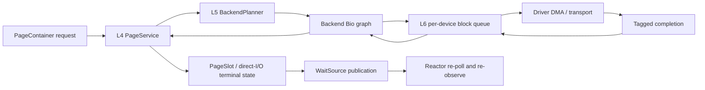

# I/O Manager Contract v1

<!-- txdoc:05-FILESYSTEM-IO-MANAGER-V1 -->

**Status.** Active target contract with an explicit implementation checkpoint.

**Purpose.** Define the neutral I/O control plane between `PageContainer`,
filesystem planning, block scheduling, and device execution. This document owns
the L4/L5/L6 boundaries, request and completion data flow, lifetime rules, and
the production-cutover conditions. It does not create a second file-data cache,
move filesystem semantics into generic I/O code, or move hardware protocol into
the filesystem layer.

**Companion documents.**

- [`PAGE_BACKED_v1.md`](../03_memory-vm/PAGE_BACKED_v1.md) owns
  `PageContainer`, page-cache identity, and VM-visible page materialization.
- [`MOUNT_v1.md`](MOUNT_v1.md) hosts filesystem-instance state and the optional
  backend-planner binding.
- [`BDEV_FS.md`](BDEV_FS.md) translates raw-device byte ranges to partitioned
  LBA ranges.
- [`TX_EXT4_PLAN_v1_2.md`](TX_EXT4_PLAN_v1_2.md) owns ext4 mapping, allocation,
  metadata intent, and JBD2 ordering.
- [`DEVICE.md`](../06_devices/DEVICE.md) owns static device registration,
  driver execution, DMA, IRQ, and hardware completion.
- [`03_STEP_MODEL_v2.md`](../../Txv3/03_STEP_MODEL_v2.md) defines the step and
  yield algebra used by I/O-facing scripts.
- [`2026-07-13-ext4-io-manager-write-design.md`](../../superpowers/specs/2026-07-13-ext4-io-manager-write-design.md)
  is the approved implementation design from which the writeback and fsync
  portions of this active contract were promoted.

## 1. Ownership Ladder

<!-- txdoc:IO-MANAGER-OWNERSHIP-LADDER-1 -->

The control plane is split by decision owner:

| Layer | Owns | Must not own |
|---|---|---|
| L3 `PageContainer` | ordinary file-data frames, page-slot state and generation, sparse page index, file size, range coherency | filesystem mapping, per-device queue depth, DMA protocol |
| L4 page service | request admission, priority, bounded batching, generic readahead/writeback policy, in-flight data leases, completion routing | a second copy of ordinary file data, ext4 extent or journal policy |
| L5 filesystem planner | logical-range mapping, holes, allocation intent, metadata dependencies, filesystem-specific error interpretation | page-cache ownership, device tags, hardware queue policy |
| L6 block service | per-device queue depth, adjacent compatible Bio merge, tags, fences, dispatch/completion matching | ext4 semantics, page-slot truth, hardware register programming |
| Device adapter/driver | DMA mapping, transport protocol, submission, IRQ or polling completion | page-cache or filesystem policy |

`PageContainer` remains the only long-lived cache owner for ordinary file data.
L4 may retain a typed lease while an operation is queued or in flight. L5 and
L6 may copy descriptors, but they do not acquire independent ownership of the
data frame. The driver may hold only the DMA evidence derived from that lease.

`BlockDeviceRegistration` is a static tier-2 device fact. It is not reclaimed
or owned by the I/O manager. bdev-fs owns only byte-to-LBA translation,
partition bounds, and its consistency index; it does not become another block
scheduler.

## 2. Zone-Derived Type Policy

<!-- txdoc:IO-MANAGER-ZONE-DERIVED-TYPE-POLICY-1 -->

I/O manager control records are bounded service state or value descriptors,
not independently reclaimable semantic entities.

| Declaration | Public/reference shape | Reason |
|---|---|---|
| `PageContainer` | `Cap<PageContainer>`, `Weak<PageContainer>` where required | independently reclaimable page-backed entity owned by L3 |
| page request, backend plan, Bio, completion | owned value with typed ids | bounded queue/graph record; no independent identity lookup |
| `IoDataLeaseId`, request id, graph node id, block tag | opaque value id | correlates owner-held state without manufacturing a new entity |
| `BlockDeviceRegistration` | `&'static` registration or typed static handle | tier-2 device lifetime is the boot lifetime |

Upper layers must not expose raw `Zone<T, Policy>` for these records. If a
future request class gains independent lookup, sharing, and reclamation, its
entity/reference policy requires a separate manifest update before code lands.

## 3. Neutral Planning IR

<!-- txdoc:IO-MANAGER-NEUTRAL-IR-1 -->

The cross-layer IR uses only neutral types:

- `PageIoSubmission` / `PageIoRequest`: page-container key, page range,
  operation, priority, flags, and optional generation frontier.
- `BackendPageRequest`: filesystem object/range context plus neutral read
  target or write source.
- `IoDataSource`: `None`, a page-cache frame segment under
  `IoDataLeaseId`, or pinned direct-I/O vectors under a lease.
- `IoDataTarget`: the corresponding destination shape for reads.
- `BackendPlan`: immediate completion, Bio submission, dependency graph, or a
  metadata-first/resume result during migration.
- `BackendBioGraph`: Bio nodes plus acyclic ordering edges and planner resume
  state.
- `BioPlan`: device, operation, LBA range, vectors, and fence/flush flags.
- `BlockDispatch` / `BlockCompletion`: a `BlockTag` paired with the admitted
  Bio and terminal result.

L4 creates and releases data leases. L5 may translate a leased source or target
into `BioVec`s but must not release the lease. L6 and the device path carry the
lease-derived descriptors until terminal completion returns to L4.

Single-stage `Complete`, `SubmitBios`, and metadata-first plans are migration
forms. Durable multi-stage ext4 write/fsync ordering uses an acyclic dependency
graph; a flat list cannot express data-before-journal-before-flush ordering.

## 4. Page Service

<!-- txdoc:IO-MANAGER-PAGE-SERVICE-1 -->

L4 admits immutable requests after capturing stable page/range state. It owns:

1. bounded demand, fsync, foreground write, readahead, and background
   writeback queues;
2. page-slot generation frontiers and the lease table;
3. dispatch into the mount-bound `BackendPlanner`;
4. graph and direct-I/O completion routing;
5. terminal page completion and waiter publication.

The queue priority is a policy input, not a correctness override. Completion
work and demand reads may be favored, but every class must make bounded
progress. Readahead is discardable speculative work and must not delay demand
I/O or fsync.

### 4.1 Page-slot state

A durable writeback implementation stores page-local truth in `PageSlot`:

- resident frame and page index;
- `content_generation` incremented for each admitted mutation;
- submitted generation for an in-flight writeback;
- resident/dirty/writeback/error state;
- whether the page was dirtied again after submission.

Completion for generation `g` clears dirty state only if the slot still
represents `g` and was not redirtied. Otherwise the frame remains resident and
the slot returns to dirty state for a later writeback. An old completion must
never clear newer data.

This is the target replacement for treating `FrameMeta` dirty/io-lock bits as
the complete file-page state. Frame metadata remains physical-page evidence;
file-content generation belongs to the page slot.

## 5. Backend Planning And Graphs

<!-- txdoc:IO-MANAGER-BACKEND-RESUME-GRAPH-1 -->

`BackendPlanner` is mounted filesystem policy. A planner may:

- complete a hole read without device I/O;
- map a logical file range to one or more device ranges;
- request metadata work and resume with its completions;
- allocate blocks and produce metadata/journal intent;
- produce an acyclic Bio graph for ordered execution;
- return a filesystem error without mutating generic page-service state.

The graph scheduler admits only nodes whose predecessors completed
successfully. A failed node terminally fails dependent nodes without submitting
them. Independent nodes may proceed in parallel subject to L6 queue depth.
Planner resume consumes explicit completion records; it must not rediscover
completion by reading mutable driver state.

## 6. Block Queue And Device Dispatch

<!-- txdoc:IO-MANAGER-BLOCK-QUEUE-DISPATCH-1 -->

L6 scheduling is per block device. It may merge Bios only when all of the
following hold:

- same device and operation;
- adjacent LBA ranges;
- compatible flags and vector limits;
- no barrier, flush, FUA boundary, or graph dependency is crossed.

Admission allocates a device tag and records the mapping from tag to Bio/graph
node before driver submission. Queue depth is released exactly once by a
terminal completion. Unknown, duplicate, or stale tags are errors and must not
complete a different request.

The driver interface receives a dispatch descriptor and later publishes a
tagged completion. Whether completion arrives by IRQ or bounded polling is a
device concern; the upper completion contract is identical.

## 7. Completion Routing

<!-- txdoc:IO-MANAGER-COMPLETION-ROUTING-1 -->



Completion data moves in the reverse direction of planning:

1. the device publishes `tag + result`;
2. L6 resolves the tag and releases device admission;
3. the graph marks one node terminal and admits newly ready nodes;
4. L4 updates the matching page/direct request and releases its data lease only
   at terminal completion;
5. L4 publishes a wake hint;
6. the reactor polls the waiting task, which re-observes owner state.

Mailbox or wait-source events are hints, not completion truth. Duplicate wakes
are harmless because the owner state and generation are rechecked.

## 8. Operation Flows

<!-- txdoc:IO-MANAGER-OPERATION-FLOWS-1 -->

### 8.1 Buffered read

On a page-cache miss, L3 reserves the page slot and asks L4 for a demand read.
L4 supplies a leased destination; L5 maps the file range or completes a hole;
L6 submits mapped Bios. On success L4 installs/marks the frame resident and
wakes waiters. The resumed read rechecks page presence before copying bytes.

### 8.2 Buffered write and writeback

`write(2)` or a shared writable mapping mutates the PC-owned frame under the
page-slot mutation boundary, increments its generation, and marks it dirty. A
buffered write may return before device I/O. A bounded writeback scan later
leases the frame, captures its generation, obtains an L5 plan, and submits it.
Writeback failure preserves retryable dirty/error state; it never silently
clears dirty state.

### 8.3 Direct I/O

<!-- txdoc:IO-MANAGER-DIRECT-IO-LEASE-1 -->

Direct I/O bypasses the ordinary file-data cache but not coherency. The caller
must reserve the logical range, exclude overlapping buffered mutation, drain
or reconcile dirty/writeback slots, pin user pages into a typed direct lease,
and route the operation through L5 and L6. Terminal completion releases the
pin and invalidates or updates overlapping cached pages according to the
operation. Dropping the waiting future must not release DMA-visible pages.

### 8.4 fsync durability

<!-- txdoc:IO-MANAGER-FSYNC-DURABILITY-1 -->

`fsync` captures a range generation frontier and waits only for dirty
generations at or before that frontier. For ordered ext4/JBD2, the required
graph is:

```text
data writes
    -> journal descriptor and metadata writes
    -> durable commit record (FUA, or write followed by flush)
    -> fsync completion
```

Home-location checkpoint may follow later. Data-Bio completion alone is not a
POSIX durability witness.

## 9. Concurrency And Lock Rules

<!-- txdoc:IO-MANAGER-LOCK-AND-WAIT-1 -->

- No page-slot, sparse-index, range-reservation, inode, allocator, journal, L4
  queue, or L6 queue lock may cross planner execution, device submission, or an
  async wait.
- Build an immutable request and acquire the required lease while holding the
  owner lock; release the lock before crossing layers.
- The sparse page index is the linearization point for page presence.
- Per-page slot state serializes page generation and writeback completion.
- Logical range reservations serialize truncate, hole punch, direct I/O, and
  fsync frontiers where their semantics overlap; they do not replace per-page
  state.
- L6 queue/tag state is device-scoped. A per-`PageContainer` block runtime is a
  migration layout, not the final ownership boundary.

## 10. Error And Cancellation

<!-- txdoc:IO-MANAGER-ERROR-CANCEL-1 -->

I/O-facing scripts use the normal `StepOutcome`/wait protocol. Pending work
yields after releasing all owner locks; wakeup causes re-entry and
re-observation. Partial read/write progress follows syscall partial-result
rules rather than being discarded by a later block or error.

Known generic mappings include allocation exhaustion to `ENOMEM`, invalid or
out-of-device ranges to `EIO`/`EINVAL` as specified by the owner, and
read-only/quota rejection to `EROFS`/`EDQUOT`. Filesystem corruption and
checksum failures are interpreted by L5, not L6.

Cancellation of queued Bios, device abort, and cancellation/completion races
are not yet fixed by this v1 contract. Until a terminal cancellation protocol
lands, data and DMA leases survive future drop and are released only by normal
terminal completion or owner teardown that can prove the device no longer
references them.

## 11. Runtime And Production Cutover

<!-- txdoc:IO-MANAGER-FILE-RUNTIME-LIFETIME-1 -->

The reactor runs file-I/O service futures. Each poll performs bounded work in
this order: route device completions, advance graph state, admit bounded L6
work, then admit bounded L4 work. If work remains, the task arranges another
wake; otherwise it waits on the relevant service/device endpoints.

Runtime registration is exactly-once per live runtime, but registration alone
is insufficient: a `PageContainer` materialized after boot must gain a running
service task, and teardown must stop or detach that task without leaving stale
completion routes.

### 11.1 Current implementation checkpoint

<!-- txdoc:IO-MANAGER-COMPATIBILITY-FALLBACK-1 -->

The current tree contains:

- neutral L5 IR and `BackendPlanner`;
- L4 `PageService`, page/direct lease tables, and completion routing;
- dependency-graph scheduling;
- L6 Bio merge, queue-depth, tag, fence, dispatch, and completion state;
- an ext4 planner for mapped read/write and metadata-first planning;
- a bounded reactor file-I/O runtime task.

The current tree is not yet fully cut over:

- production ext4 mounts do not bind the planner, so file pages may still use
  `FsPageBacking` as the compatibility oracle;
- later-materialized file runtimes need incremental reactor submission and
  teardown, not only a boot-time registry snapshot;
- L6 state is still embedded per `PageContainer`, not shared per device;
- the device adapter currently completes synchronous driver work rather than a
  real IRQ/polled asynchronous path;
- durable ext4 fsync/JBD2, hole allocation/write graph, general multi-block
  direct I/O, operational readahead, and `sync_file_range` remain incomplete.

<!-- txdoc:IO-MANAGER-PRODUCTION-CUTOVER-1 -->

Production cutover requires all of the following:

1. ext4 mounts bind the intended `BackendPlanner`;
2. every materialized runtime is submitted and later detached exactly once;
3. L6 device state is shared by device identity;
4. completion and backpressure preserve resumable async semantics;
5. legacy and new paths pass the same read/write behavior witnesses;
6. durability claims pass flush/remount/crash-oriented tests;
7. only then may the ext4 `FsPageBacking` hot path be removed.

## 12. Deferred Limits

<!-- txdoc:IO-MANAGER-DEFERRED-LIMITS-1 -->

The following are deliberately outside the first production cutover:

- replacing the sparse page index with TxArray/RCU before page-slot completion
  semantics are stable;
- multi-queue driver sharding and online queue-depth tuning;
- dynamic tier-3 device discovery/hot-unplug and online partition replacement;
- loop devices, online device-capacity changes, and raw-device direct I/O;
- a universal FUA/barrier policy independent of filesystem and device facts;
- a host async executor for the kernel control plane;
- freezing a complete ext4 corruption/checksum-to-errno taxonomy here.

None of these deferrals permits a second ordinary file-data cache or an unsafe
DMA lifetime shortcut.

## 13. Verification Witnesses

<!-- txdoc:IO-MANAGER-VERIFICATION-WITNESSES-1 -->

Implementation slices must add the nearest witness for the layer changed:

- IR/graph: acyclic validation, dependency admission, failed-predecessor
  propagation, source/target lease preservation;
- L4: priority/budget bounds, generation/redirty races, completion routing,
  late wake idempotence;
- L6: merge boundaries, queue-depth admission, tag uniqueness, stale/duplicate
  completion rejection, fence ordering;
- ext4: mapped read/write, hole behavior, metadata resume, ordered JBD2 graph;
- integration: buffered/direct coherency, incremental runtime lifecycle,
  fsync plus flush/remount durability, and no fallback after production cutover.

Host tests prove state-machine behavior. QEMU/guest witnesses are required for
driver completion, filesystem durability, and Linux-visible syscall semantics.
