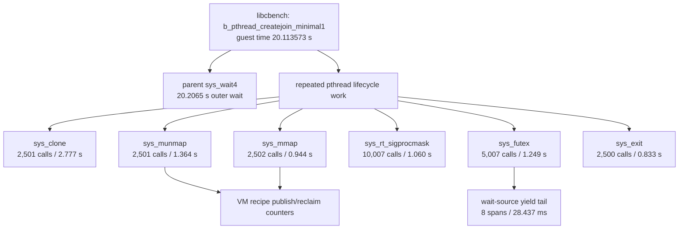

# tx-observe QEMU Hot Path Report: pthread-minimal1

Date: 2026-06-28 04:35 CST

## Purpose

This run uses `tx-observe` against a real QEMU/OSComp workload to capture the
hot path for `libcbench-musl` `b_pthread_createjoin_minimal1`. Unlike the
synthetic observe demo, this report is based on live guest-memory draining from
QEMU and the analyzer's derived span/counter tables.

The target question is: for a pthread create/join microbenchmark, which kernel
paths consume the repeated work after the outer benchmark wait is separated
from the syscall body costs?

## Command

```sh
cargo xtask observe oscomp-live \
  --test pthread-minimal1 \
  --name observe-hotpath-pthread-minimal1-20260628-0435 \
  --timeout 60 \
  --smp 1
```

The run used its own custom-run directory and did not touch the unrelated
interactive Alpine QEMU process that was already running on the host.

## Artifacts

```text
target/oscomp/custom-run/observe-hotpath-pthread-minimal1-20260628-0435/
  serial.txt
  report.json
  names.json
  host/runtime.json
  host/trace.rawrecords
  analysis/analyze.txt
  analysis/analyze-srcnames.txt
  analysis/parquet-srcnames/
```

Important paths:

- `target/oscomp/custom-run/observe-hotpath-pthread-minimal1-20260628-0435/host/trace.rawrecords`
- `target/oscomp/custom-run/observe-hotpath-pthread-minimal1-20260628-0435/host/runtime.json`
- `target/oscomp/custom-run/observe-hotpath-pthread-minimal1-20260628-0435/analysis/analyze-srcnames.txt`
- `target/oscomp/custom-run/observe-hotpath-pthread-minimal1-20260628-0435/analysis/parquet-srcnames/`

## Guest Result

The serial log reached the expected OSComp group and exited normally:

```text
#### OS COMP TEST GROUP START libcbench-musl ####
b_pthread_createjoin_minimal1 (0)
  time: 20.113573000, virt: 0, res: 0, dirty: 0

#### OS COMP TEST GROUP END libcbench-musl ####
txkernel:qemu-riscv64-virt:userspace:exited:0
```

This makes the trace a usable workload-backed capture rather than a boot-only
or aborted observe window.

## Capture Health

`host/runtime.json` reports a complete, lossless live-drain capture:

| Field | Value |
|---|---:|
| hart count | 1 |
| ring order | 14 |
| slots per hart | 16,384 |
| raw records | 283,281 |
| complete | true |
| lost records | 0 |
| overwritten records | 0 |
| repairs | 0 |
| framing errors | 0 |
| rawrecords size | 24 MiB |

`runtime.json` has `total_records=0` and `visible_records=0` at final state
because the live drain consumed the ring before shutdown. That should not be
read as an empty trace; the source of truth for capture volume is
`drained.raw_records=283281` plus the 24 MiB `trace.rawrecords` file.

## Derived Tables

The analyzer source-name pass was:

```sh
cargo xtask observe analyze \
  --rawrecords target/oscomp/custom-run/observe-hotpath-pthread-minimal1-20260628-0435/host/trace.rawrecords \
  --names target/oscomp/custom-run/observe-hotpath-pthread-minimal1-20260628-0435/names.json \
  --source-root /Users/3y/Downloads/Tx \
  --cache-dir target/oscomp/custom-run/observe-hotpath-pthread-minimal1-20260628-0435/analysis/cache-srcnames \
  --parquet-dir target/oscomp/custom-run/observe-hotpath-pthread-minimal1-20260628-0435/analysis/parquet-srcnames \
  --no-sort
```

Derived table summary:

| Table | Rows |
|---|---:|
| spans | 30,062 |
| counters | 27,909 |
| allocation_rows | 0 |
| sched_intervals | 0 |
| lock_rows | 0 |
| ds_method_rows | 0 |

The empty lock, DS method, allocation, and scheduler interval tables mean this
specific run did not enable or emit those families. They are not evidence that
those costs are zero.

## Hot Path

The outermost elapsed span is `sys_wait4`, but it covers the parent waiting for
the benchmark child to finish. It is useful for bounding the whole benchmark
window, not for attributing repeated kernel work by itself.

Repeated kernel work ranks as follows:

| Rank | Span | Count | Total | p50 | p99 | Max | Interpretation |
|---:|---|---:|---:|---:|---:|---:|---|
| 0 | `sys_wait4` | 1 | 20.206500 s | 20.206500 s | 20.206500 s | 20.206500 s | outer benchmark wait window |
| 1 | `sys_clone` | 2,501 | 2.777393 s | 1.059 ms | 1.950 ms | 16.682 ms | pthread thread creation and task setup |
| 2 | `sys_munmap` | 2,501 | 1.363769 s | 529 us | 932 us | 2.961 ms | pthread stack / mapping teardown |
| 3 | `sys_futex` | 5,007 | 1.249112 s | 260 us | 666 us | 12.594 ms | join / wake / clear-child-tid synchronization |
| 4 | `sys_rt_sigprocmask` | 10,007 | 1.060409 s | 95 us | 218 us | 1.321 ms | musl pthread signal-mask choreography |
| 5 | `sys_mmap` | 2,502 | 943.696 ms | 362 us | 702 us | 5.222 ms | pthread stack / TLS mapping setup |
| 6 | `sys_exit` | 2,500 | 832.667 ms | 316 us | 636 us | 1.998 ms | thread exit publication and cleanup |
| 7 | `name_0x0b6720b8` | 2,499 | 179.431 ms | 54 us | 154 us | 11.533 ms | unresolved StepOp/type-name span |
| 8 | `step` | 2,514 | 110.257 ms | 34 us | 115 us | 7.146 ms | generic step spans |
| 9 | `yield.OnWaitSource` | 8 | 28.437 ms | 2.459 ms | 7.238 ms | 7.238 ms | explicit wait-source yield windows |

The hot-path picture is therefore:



## Duration Counters

Most large counter totals are not durations: several are encoded errno values,
addresses, masks, epoch sentinels, or unsigned representations of negative
values. Those should not be summed as hot-path time.

The useful duration counters in this run are VM recipe counters:

| Counter | Count | Total | p50 | p99 | Max |
|---|---:|---:|---:|---:|---:|
| `debug.vm.recipe.publish.duration_ns` | 5,006 | 466.436 ms | 91 us | 197 us | 1.075 ms |
| `debug.vm.recipe.reclaim_tree.duration_ns` | 5,010 | 171.452 ms | 37 us | 77 us | 465 us |

Related non-duration VM counter:

| Counter | Count | Total | p50 | p99 | Max |
|---|---:|---:|---:|---:|---:|
| `debug.vm.recipe.publish.touched_entries` | 5,006 | 22,115 | 4 | 7 | 15 |

This supports the syscall-level picture: VM mapping and unmapping work is a
real part of pthread lifecycle cost, but the larger repeated buckets are still
the syscall spans around clone, munmap, futex, sigprocmask, mmap, and exit.

## Caveats

- Several non-syscall spans remain unresolved as `name_0x...`; `names.json`
  reported no resolved monomorphized type names for those StepOp hashes.
- This was a one-hart run (`--smp 1`), so it does not show multi-hart placement,
  remote wake, or RFENCE fanout costs.
- Lock metrics and DS method metrics were not present in the derived tables for
  this capture.
- Counter totals are only meaningful after inspecting the counter family. The
  top raw counter sums include addresses, masks, and encoded sentinel values,
  not only durations.

## Conclusion

For this measured QEMU workload, `tx-observe` captured a complete and lossless
live trace of `b_pthread_createjoin_minimal1`. After separating the outer
`sys_wait4` benchmark wait window, the repeated hot path is pthread lifecycle
work:

```text
sys_clone -> sys_munmap -> sys_futex -> sys_rt_sigprocmask -> sys_mmap -> sys_exit
```

The VM recipe duration counters add about 466 ms of publish time and 171 ms of
reclaim-tree time across roughly 5,000 samples, matching the `mmap`/`munmap`
pressure in the span table. The next useful measurement is a targeted run with
clone-path, VM map/unmap, futex, lock, and pmap shootdown counters enabled, so
the large syscall spans can be split into internal phases instead of remaining
as syscall-level buckets.
