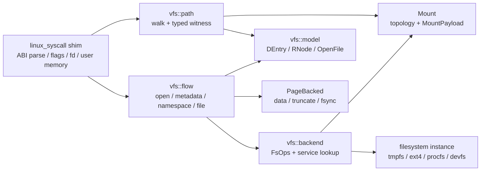

# VFS 请求路径导向重构计划

日期：2026-07-13
状态：计划已建立，尚未开始源码搬迁
范围：`crates/tx-subsystems/src/vfs/` 与其在 `tx-shims` 中的调用边界。

## 结论

当前 VFS 已经具备可重组的自然边界，不需要先发明新的核心抽象
类型。重构的主轴应从“对象拓扑”改为“请求正在走哪条路径”：稳定
对象留在 `model/`，路径解析留在 `path/`，后端协议留在 `backend/`，
一次 syscall 的 VFS 语义编排留在 `flow/`，fd readiness 留在 `wait/`。

这不是把 Mount 纳入 VFS。Mount 仍拥有 `MountIdentity`、
`MountPayload`、`MountNamespace` 和挂载拓扑；VFS 仅在 `path/` 中消费
挂载穿越，并在 `backend/` 中消费 Mount 托管的 `FsOps` /
`FsPageBacking` 服务。

## 现状证据

| 现状 | 证据 | 重组含义 |
|---|---|---|
| `structure.rs` 同时放置 DEntry、RNode、OpenFile、元数据、backing、fd 标志和 ioctl 词汇，约 1,946 行。 | `crates/tx-subsystems/src/vfs/structure.rs:476` | 应先按稳定名词拆到 `model/`，不改变语义。 |
| `execution.rs` 既定义 `FsOps` / `MountOutput`，又实现 OpenFile I/O、lseek、flock、fsync，约 1,703 行。 | `crates/tx-subsystems/src/vfs/execution.rs:66` | 后端协议与 open-file flow 是两种责任，应分离。 |
| `composite.rs` 集中 metadata、namespace mutation、目录读、poll 等 syscall 形操作，约 1,117 行。 | `crates/tx-subsystems/src/vfs/composite.rs:39` | 应按请求路径拆到 `flow/`，而不是继续堆积“杂项 composite”。 |
| 实际 walker 已位于 `resolution/{state,step,driver,terminal}.rs`；`require.rs` 是类型化入口，`walker.rs` 是旧入口及后端查找的混合处。 | `crates/tx-subsystems/src/vfs/resolution/driver.rs:34`; `crates/tx-subsystems/src/vfs/require.rs:36`; `crates/tx-subsystems/src/vfs/walker.rs:143` | `path/` 可直接承接现有 resolution；旧 `walker` 应降为兼容门面。 |
| shim 在 `mkdirat`、`unlinkat`、`symlinkat`、`linkat`、`renameat2` 中再次做 split/walk/check/backend dispatch/cache invalidation，而等价 VFS composite 已存在。 | `crates/tx-shims/src/linux_syscall/fs_mut.rs:210`; `crates/tx-subsystems/src/vfs/composite.rs:11` | 最后一个阶段才收敛为 VFS `flow::namespace`；ABI 特有 flag/errno/用户内存仍留在 shim。 |
| `MountPayload` 正式托管 `FsOps` 与 `FsPageBacking`；VFS 通过 DEntry/RNode 恢复服务。 | `docs/design/05_filesystem/MOUNT_v1.md` (`txdoc:MOUNT-POSITION-ARCHITECTURE-1`); `crates/tx-subsystems/src/vfs/walker.rs:328` | 后端 lookup 要有唯一 VFS 主入口，但不能移动 Mount 所有权。 |
| walker、open-file 和 shim 的测试已经覆盖路径、符号链接、跨挂载、DAC、yield/resume、stat、fd 与 mutation。 | `crates/tx-subsystems/src/vfs/walker/tests.rs:485`; `crates/tx-shims/src/linux_syscall/tests.rs:1890` | 允许用小步、可回滚的模块搬迁守住行为。 |

## 规范门槛

| 拟定目录或接口 | 现有权威来源 | 本轮决定 |
|---|---|---|
| `model/` | `txdoc:MODULE-MAP-FULL-SEMANTIC-SUBSYSTEMS-1`；当前 `structure.rs` | VFS 的稳定实体和 value vocabulary 唯一主家。 |
| `checks/` | `txdoc:VFS-CHECKS-MODULE-LAYOUT-1`；当前 `checks.rs` / `predicates.rs` | 只放纯 predicate、上下文和 guard-scoped witness，不引入执行。 |
| `path/` | `txdoc:VFS-CHECKS-MODULE-LAYOUT-1`；当前 `resolution/*` / `require.rs` | 只放路径状态机、terminal witness 构造和 typed require 门面。 |
| `backend/` | `txdoc:MOUNT-POSITION-ARCHITECTURE-1`；当前 `execution.rs` | 放 VFS-facing `FsOps`、`MountOutput` 和 VFS 的服务恢复；Mount 仍托管实例。 |
| `flow/` | 当前 `composite.rs` / `execution.rs` 与 shim 调用链 | 放 VFS 语义编排；不吸收 Linux ABI parsing、fd allocation 或用户内存复制。 |
| `wait/` | 当前 `fd_ready.rs` / `notification.rs` | 放 backing-neutral readiness 与 VFS RNode wait-point 生命周期。 |
| `compat/` | 当前 `walker.rs`，以及其大量 `step_walk` 调用者 | 仅过渡期保留旧名字和签名；不可成为新逻辑的归宿。 |

该门槛遵循 `txdoc:MODULE-MAP-PLACEMENT-RULE-1`：同一机制只保留一个
主家；需要两侧使用时分为 owner 与 consumer。

## 目标目录

```text
crates/tx-subsystems/src/vfs/
├── mod.rs                     # 稳定公开门面与窄 re-export
├── adapter.rs                 # VFS 对 substrate/step/wait 的本地适配
├── model/
│   ├── mod.rs
│   ├── name.rs                # Name、路径名 value vocabulary
│   ├── metadata.rs            # InodeMeta、权限、时间、stat value
│   ├── dentry.rs              # DEntry 与 namespace binding
│   ├── rnode.rs               # RNode 与 lifecycle
│   ├── backing.rs             # RNodeBacking、StructBacked/Projected vocabulary
│   ├── open_file.rs           # OpenFile、OpenFileBacking、fd flags
│   └── ioctl.rs               # VFS-owned ioctl value vocabulary
├── checks/
│   ├── mod.rs
│   ├── context.rs             # RootCtx、ResolveCtx
│   ├── witness.rs             # EntityAtPath、DirectoryAtPath、ParentAndName
│   └── predicates.rs          # DAC 与节点形状 predicate
├── path/
│   ├── mod.rs
│   ├── state.rs
│   ├── diagnostic.rs
│   ├── error.rs
│   ├── step.rs                # 每个 component 的路径转换与挂载穿越
│   ├── driver.rs              # start/resume/walk_to_completion
│   ├── terminal.rs            # acceptance 与 witness construction
│   └── require.rs             # require_entity/directory/parent_and_name
├── backend/
│   ├── mod.rs
│   ├── contract.rs            # FsOps、MountOutput
│   └── lookup.rs              # DEntry/RNode -> MountPayload -> backend services
├── flow/
│   ├── mod.rs
│   ├── open.rs                # open、nofollow、create 前后需要的 VFS 部分
│   ├── metadata.rs            # stat/chmod/chown/access
│   ├── namespace.rs           # create/mkdir/link/unlink/rename/symlink
│   ├── file.rs                # read/write/lseek/flock/fsync 与 OpenFile StepOp
│   └── directory.rs           # getdents/readlink 等目录或路径终端操作
├── wait/
│   ├── mod.rs
│   ├── readiness.rs           # FdReadyQuery/Report、query_fd_ready
│   └── notification.rs        # RNode wait source 的创建、通知、释放
├── compat/
│   ├── mod.rs
│   └── walker.rs              # step_walk/step_open 旧入口，仅转发
└── tests/
    ├── mod.rs
    ├── fixtures.rs
    ├── model.rs
    ├── path.rs
    ├── flow.rs
    ├── wait.rs
    └── v3_walker.rs
```

`mount.rs` 不出现在 VFS 的 `flow/` 中。`mount(2)` / `umount(2)` 的拓扑
变化属于 Mount subsystem；VFS 只把“跨挂载”作为 `path::step` 的一种转换。

## 请求路径



1. `openat`：shim 保留 Linux flags、fd 分配、`O_CREAT` / `O_TRUNC` 的 ABI
   解释；`path` 提供 terminal witness；`flow::open` 建立 `OpenFile`；
   `backend` 恢复服务。创建与截断的后端动作不应再散落在 walker helper。
2. metadata：`stat*`、`chmod*`、`chown*`、`access` 共享 `path` 与
   `flow::metadata`。real/effective ID 的 Linux 特例仍是 shim policy。
3. namespace mutation：shim 仅解析 `*at`、flags、copyin/copyout 和 errno
   映射；`flow::namespace` 统一 parent/name resolution、DAC、readonly、
   `FsOps` 调用与 VFS cache/lifetime 后处理。
4. open-file I/O：`flow::file` 维护 OpenFile offset/dispatch；regular file
   数据、size、truncate、fsync 仍由 PageBacked；shim 保留用户地址空间和
   reactor drive。
5. readiness：shim 翻译 poll/epoll mask 并等待；`wait::readiness` 返回
   backing-neutral readiness 及 wait endpoint。

## 六个落地阶段

### 1. 切出 `model/` 与 `checks/`，不改行为

- 将 `structure.rs` 按上表拆为 `model/*`；每个 type 的公开路径先由
  `vfs::mod` re-export 保持。
- 将 `checks.rs` 拆为 context/witness，将 `predicates.rs` 迁到
  `checks/predicates.rs`。
- 迁移现有 VFS value/lifetime 测试到 `tests/model.rs`，不修改断言。
- 完成条件：原 `tx_subsystems::vfs::*` import 仍编译；无新 VFS 核心类型。

### 2. 正名 `path/`，把 walker 变为兼容门面

- 以目录移动方式承接当前 `resolution/*` 和 `require.rs`；保持
  `PathResolution`、`WalkMode`、resume token、diagnostic 行为不变。
- `compat::walker::{step_walk, step_walk_in_mount_namespace}` 转发到
  `path::driver`；`step_open` 暂转发到 `flow::open` 或现有实现。
- 将 walker 测试固定到 `tests/path.rs` / `tests/v3_walker.rs`，先保留
  fixture API，随后再单独清理。
- 完成条件：路径、symlink、mount crossing、DAC、yield/resume 用例不变。

### 3. 抽出 `backend/contract` 与单一服务恢复点

- 从 `execution.rs` 移出 `FsOps`、`MountOutput` 到 `backend/contract.rs`。
- 将 `walker::{fs_ops_for, fs_ops_for_rnode, mount_payload_for}` 收拢为
  `backend::lookup`，所有 VFS flow 使用它，不再各自向上爬 `parent_hint`。
- `MountedDentry` 和 `MountedNode` 保持 shim-local；它们用于 ABI 侧的
  Cap/DEntry 锚定，不是 VFS 的 `ResolvedPath` 替代品。
- 完成条件：Mount 仍独占 topology 和 payload hosting；后端 crate 的
  `FsOps` / `FsPageBacking` 导入路径通过稳定 re-export 保持兼容。

### 4. 以请求路径拆 `flow/`，先做机械移动

- `execution.rs` 的 OpenFile read/write/lseek/flock/fsync StepOp 移至
  `flow/file.rs`；open/no-follow 逻辑移至 `flow/open.rs`。
- `composite.rs` 的 stat/chmod/chown/access 移至 `flow/metadata.rs`；
  getdents/readlink 移至 `flow/directory.rs`；namespace operations 移至
  `flow/namespace.rs`。
- `PpollOp` 不留在 `flow/`，在阶段 5 与 readiness 一起移到 `wait/`。
- 完成条件：每个新模块只依赖 `model`、`checks`、`path`、`backend` 的
  窄公开接口；`composite.rs` 不再增长。

### 5. 收敛 namespace mutation 的 VFS 语义编排

- 先为 `mkdirat`、`unlinkat`、`symlinkat`、`linkat`、`renameat2` 建立
  shim-to-`flow::namespace` 的一对一迁移；每次只迁移一个 syscall family。
- 迁移后 shim 仍拥有 ABI 路径字节解析、`AT_*` / `RENAME_*` flag、用户
  指针和 Linux errno 选择；VFS 拥有 native walk/check/commit/cache
  invalidation/lifetime 调用序列。
- 不能用“新通用 target struct”掩盖尚未统一的语义。只有现有
  `PathResolution` 与 witness 不足且设计文档补齐后，才允许新增类型。
- 完成条件：VFS composite 与 shim 中同一 mutation 不再各保留一份
  authoritative 编排。

### 6. 收束 wait、测试与 compat

- `fd_ready.rs` 与 `notification.rs` 移入 `wait/`；`PpollOp` 只消费
  `wait::readiness` 的报告，不读取 OpenFile backing internals。
- 逐一替换 `step_walk` 调用者到 `path` / `flow` 公开接口；调用者归零后
  删除 `compat::walker`，而不是长期保留第二套路径 API。
- 将 fixture 与测试按 `model/path/flow/wait` 重排；保留外部
  `v3_openfile_page_backed_read` 与 `v3_vfs_waitsource` 作为公开契约哨兵。
- 完成条件：不存在生产逻辑对 `compat::*` 的依赖；VFS 与 shim 的 scoped
  回归门均通过。

## 明确不在本计划内

- 不把 shim 的 `ResolvedPath` 提升为 VFS 类型；核心已有不同语义的
  `PathResolution`。
- 不宣称 `MountedNode::from_rnode_direct` 已解决 descendant RNode 的
  mount-service 恢复问题。
- 不改变 `FsOps` / `FsPageBacking` 的后端语义，不改变 PageBacked 的
  data/size/truncate/fsync 所有权。
- 不修改 Mount publication、mount namespace correctness、RCU/EBR 策略、
  `parent_hint` 语义或 walker 的跨 yield pinning 协议。
- 不把 close 的 best-effort fsync 与显式 fsync 两条路径在本重组中合并；
  这是独立的 durability 语义工作。
- 不处理 `OpenFileBacking` 覆盖非 VFS fd kind 的泛化问题；这需要单独的
  fd dispatch 设计。

因此，RCU 尚未就绪不是本次目录重组的阻塞项；它仍限制 walker 状态、
mount publication 和 parent/trail 语义的后续设计，但不阻止先把已有责任
移动到唯一、清晰的模块主家。

## 验证矩阵

| 阶段 | 最小验证 |
|---|---|
| 1 | `cargo test -p tx-subsystems --lib vfs::tests -- --nocapture --test-threads=1` |
| 2 | `cargo test -p tx-subsystems --lib vfs::walker -- --nocapture --test-threads=1` |
| 3 | 阶段 2 命令，加 `cargo test -p tx-subsystems --test v3_openfile_page_backed_read -- --nocapture --test-threads=1` |
| 4 | `cargo test -p tx-shims --lib stat_family -- --nocapture --test-threads=1`、`cargo test -p tx-shims --lib fd_ops_wave2 -- --nocapture --test-threads=1` |
| 5 | `cargo test -p tx-shims --lib file_mutation -- --nocapture --test-threads=1`、`cargo test -p tx-shims --lib dac_setuid_wave4 -- --nocapture --test-threads=1` |
| 6 | `cargo test -p tx-subsystems --test v3_vfs_waitsource -- --nocapture --test-threads=1`、相关 `ppoll` / fd-op shim tests |
| 每阶段 | `cargo fmt --check`、`git diff --check`、`cargo xtask progress validate`；修改 Markdown 时加 `cargo xtask lint docs` |

当前 checkout 存在大量无关的未提交修改；执行时每个阶段都应使用独立、窄
write set，避免将 VFS 重组与正在进行的 reactor、VM、网络或 ext4 工作混合。

## 本轮文档校验

- `cargo xtask progress validate`：通过，32 个记录有效。
- `cargo xtask lint docs`：通过；报告 7 条工作区既有的 active-doc
  stale-vocabulary 警告。
- `git diff --check -- docs/progress/STATUS.md
  docs/progress/research/2026-07-13-vfs-path-oriented-reorganization-plan.md`：
  通过。

## 后续动作

先执行阶段 1 的纯模块搬迁。阶段 2 之前必须重新审计 `step_walk` 的完整
调用者清单；阶段 5 前必须为每个要迁移的 mutation syscall 写明 VFS 与 shim
各自保留的语义责任。
