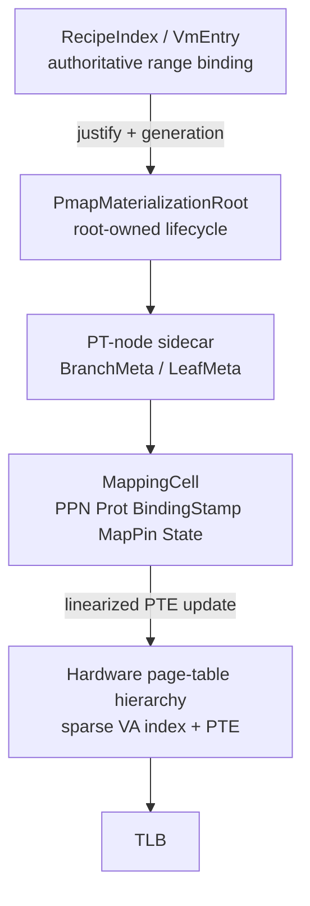

# VM pmap 零搬移、短锁和端到端批处理方案

日期：2026-08-01

## 目标和非目标

本方案把以下要求作为硬约束：

1. resident shadow index 不得再用全局 sorted `Vec` 搬移条目；
2. 任何 `pmap.state` 锁都不得覆盖 HAL PTE mutation、shootdown、pin drop，或
   对 resident 集合的长范围遍历；
3. range unmap/protect 的 invalidation 不得经过 `Vec` 扩容、复制和二次
   coalesce；
4. PT-node prune 不得在每个 4 KiB unmap 后扫描整张页表；
5. mincore、Direct I/O、user copy 不得为同一页集合重复 walk。

本方案不改变 VM 的 authority：recipes 仍是 authoritative binding，PTE 和
sidecar 都是 derived materialization。也不在本阶段引入 rmap、swap 或透明大页。

## 目标架构

### 1. Resident materialization：硬件页表 hierarchy + PT-node sidecar

早期草案曾建议为 resident 映射再维护一个独立 radix index。经过 Linux、
FreeBSD、XNU 和 Zircon 的对照，这一层不再作为最终设计：硬件页表 hierarchy
本身就是按 VA 稀疏组织的 resident index，重复维护一个 radix 会引入第二份
索引、第二套回收规则和额外一致性成本。

最终布局如下：

- `VmEntry` 仍是 range-level immutable recipe value，保存 `UserRange`、prot、
  flags、backing、`BindingId` 和 generation；它不内嵌每页 `MappingCell` 或
  `MapPin`，避免大 VMA 变稠密以及 split/merge/fork 时搬移页级数组。
- `BranchMeta` 保存 child pointer、occupancy/child count 和 generation；
  `LeafMeta` 保存 leaf slot pointer、occupancy bitmap、`present_count`、
  leaf-local mutation lock 和 prune 状态。
- `MappingCell` 是 root-owned sidecar 的页级生命周期记录，保存 UserPage、
  PPN/prot、`BindingStamp`、generation、`MapPin` 和 `Publishing/Mapped/
  Protecting/Withdrawing/ShootdownPending/Retired` 状态。它是 PTE 无法表达的
  lifecycle metadata，不是第二个 recipe authority。
- range cursor 直接沿 sidecar/页表的 occupancy bitmap 枚举已 materialized 的
  slot；完整 subtree 可以 detach，边界 leaf 只处理 bitmap 指定的 slot，因而
  没有 sorted `Vec` suffix shift，也不需要再维护独立 resident radix。

`ChunkedPmapResidentStore` 保留为行为对照实现。它能消除大范围 suffix shift，
但 chunk 内仍会搬移条目、`chunks` 仍可能扩容，不能作为最终零搬移承诺。

### 2. 锁分层：claim/publish 与 hardware mutation 分离

`VmPmap` 不再保存一个包含所有状态的 `VmSpinMutex<VmPmapState>`。建议拆为：

- `PmapMaterializationRoot`：root-owned sidecar 的 leaf/branch lock 只覆盖
  claim、bitmap 和状态线性化；
- `PmapMutationGate`：仍由 VM `RangeLock` 提供，负责 recipes 与目标 VA 范围
  的语义排他；
- `PmapRootMutation`：平台 root-local 的短锁或 HAL 原子 leaf 操作，保护页表
  分支指针和 PT-node sidecar；
- stats/shootdown counters：独立 `AtomicU64`，不能因为观测而获取 sidecar
  leaf lock。

发布路径变为三个阶段：

1. **claim（短 leaf lock）**：为 page 创建 `Publishing` 节点或取得已有节点的
   generation；只做状态检查和索引占位。
2. **hardware（不持有 resident lock）**：执行 HAL reserve/commit。RangeLock
   Materializer reservation 仍保证 recipes 不变；同页并发由 claim generation
   和 PTE leaf 原子性处理。
3. **publish（短 leaf lock）**：把节点从 `Publishing` 变为 `Mapped`，发布
   `ppn/prot/MapPin` 和计数器。失败只回滚 claim，不在锁内做 HAL rollback
   之外的长工作。

replacement/unmap/protect 的共同形状是：先在 leaf lock 下标记或摘下节点，
释放锁后做 PTE mutation，向 `PmapInvalidationChain` 追加结果，完成一次
shootdown 后才释放旧 pin，最后短暂回锁完成 generation/状态提交。错误返回时
只 flush 已成功的 prefix，不能把未完成节点误标成已修改。

### 3. 四层 batch API

现有接口需要收敛为四层，而不是继续把 `AddressSpaceShootdownBatch` 当作完整
batch：

1. `ResidentMutationChain`：intrusive detached-node 链，承载稳定节点和 pin；
2. `PmapMutationBatch`：固定容量 block/slab 链，承载 reserve/commit/unmap/
   protect 结果；block 之间用指针连接，禁止 `Vec` reallocation；
3. `InvalidationRunChain`：按 VA 顺序追加时直接合并相邻 run，暴露 segment
   iterator，不创建等容量 `coalesced Vec`；
4. `ShootdownTransport`：按 ASID 和目标 hart 只计算一次目标集合，执行 local
   fence、remote IPI/SBI 和 ack。transport 必须报告 run 数、目标 hart 数和
   是否切换为 whole-ASID flush。

`PmapIf` 的兼容迁移可以暂时保留 `shootdown_mappings(asid, &[...])` adapter，
但 VM 生产路径不能再构造 `Vec` 后调用 adapter。最终 HAL surface 应接受
`InvalidationRunChain` 的只读迭代器或分段接口。

RV64 transport 需要两条路径：

- 少量稀疏 run：本地按 run fence，远端按 run 发送；
- run 数超过阈值或覆盖密度足够高：改为一次 ASID-wide flush（需要补齐 board
  wrapper；不能假设现有 SBI 单 range API 自动完成）。

LA64 必须实现真实的 per-CPU shootdown action 和批量 ack；M1Dock mock 要保持
同一接口和计数语义，不能静默回退到逐页 singleton。

### 4. PT-node occupancy 和延迟 prune

每个 root-owned PT node sidecar 增加：

- `live_leaf_count`；
- `child_node_count`；
- `generation/owner`，用于防止旧 node 误释放。

leaf commit/unmap 在 PTE 线性化点更新计数，并把可能变空的祖先放入固定 block
的 `PtPruneChain`。一次 range mutation 完成后自底向上处理 chain：

- counter 非零：跳过，不扫描表；
- counter 为零：在 root mutation lock 下摘除 branch PTE，释放对应 `PtNode`；
- 整个子树被 range detach：直接按 sidecar ownership 释放，不逐 slot `all(...)`。

这仍保留每个实际 resident mapping 的 PTE clear 和 invalidation 成本，但消除
了每页重复的 512-entry 空表扫描。

### 5. 一次 page-set，多个上层消费者

增加短生命周期的 `PmapRangeLease`/`ResidentCursor`：

- cursor 在 EBR 下读取 sidecar roots，释放 leaf lock 后遍历；不把整个 range
  walk 放在锁内；
- `ReserveUserRangeOp` 可以返回本 step 内可消费的 page lease/cursor；
- `DirectIoBuffer::pin` 从同一个 cursor 生成权限检查、DMA pins 和 BioVecs；
- `mincore` 直接向预留的 user output writer 写 bitmap/chunk，不先建 `Vec<bool>`
  再逐字节调用一次 user copy；
- user copy 在一个有界 step 内消费 lease，跨 yield 时丢弃并重新 observe，不能
  把普通 epoch guard 带过等待点。

## 失败和正确性规则

- recipes 仍是 authoritative binding；但提交顺序必须按操作方向区分，不能把
  “recipe 先提交、pmap 后清理”当成所有变更的固定规则（见下节）。
- RangeLock 保证 target range 内没有新 Materializer；`BindingStamp` 和 cell
  generation 处理同页 Materializer 竞争。
- 旧 PTE 的 `MapPin`/map_count 只能在 shootdown ack 之后释放；这条规则不能因
  摘下 resident node 而提前。
- mutation batch 允许 partial progress：成功 prefix 必须已 flush，剩余节点
  保持可重试状态；不能依赖 operation-level rollback。
- root destroy/ASID reuse、LA64 activation 和远端 shootdown ack 是进入跨 hart
  batch 的硬门禁。

### 提交顺序修正（待写入 canonical VM contract）

- 收紧权限、unmap 和 source move：`ExclusiveWriter` → claim cells → 清弱或
  清除 PTE → shootdown ack → 提交 recipe withdrawal/prot change → release
  `MapPin` → retire cells。
- 放宽权限和 destination publish：`ExclusiveWriter` → 提交新 recipe →
  publish/patch PTE → 如有需要 shootdown → finalize cells。

这是为避免过渡窗口而提出的方向相关协议；当前 `VM_v1_2.md` 仍描述 recipe
先提交、pmap 后 teardown，故在 canonical 文档修订前不能视作已落地语义。

## VM 文档审查：已规划但未实现

| 文档位置 | 规划内容 | 当前实现 | 判定 |
|---|---|---|---|
| `VM_v1_2.md:56,1.1,5.3` | PmapReservation、PmapCommitBatch、range teardown 后一次 ShootdownBatch | 单页 ops 已有；生产 `teardown_range` 自建 `Vec`，没有 HAL `PmapCommitBatch` 接入 | 规划存在，落地不完整 |
| `HAL_v1.md:10.3-10.4` | 多 reservation commit、multi-result unmap、substrate 聚合并一次 shootdown | 代码只有单页 `PmapReservation`/`PmapUnmapResult` 和 substrate batch；VM facade 未接入 | 规划存在，代码 API 停在子集 |
| `PAGE_SUBSTRATE_v1.md:7.3` | process-root protect 与 teardown 共用 ordering/batch | `protect_range` 每页 singleton shootdown | 规划存在，protect 接线遗漏 |
| `PAGE_SUBSTRATE_v1.md:9` | 一步内所有 teardown 一次 issue，超大范围分 chunk | VM 有一次 invalidation call，但仍 HAL 逐页 unmap，且临时 Vec/Pin vector 未预分配 | 语义规划存在，传输层未完成 |
| `VM_v1_2.md:5.6,9.5` | fork 复制 parent pmap；未来按 range 分段允许 disjoint VM 并行 | 当前 child pmap 为空，parent 对每个 private VMA 调 protect | 文档与实现已漂移；range fork 仍 deferred |
| `VM_v1_2.md:5.4,9.8` | mprotect teardown+refault；in-place patch 明确 deferred | 当前行为符合 deferred policy；但 protect batch/权限 mutation 的成本模型未定义 | 语义已实现，性能设计未规划 |
| `VM_v1_2.md:5.9` | mincore 返回 `Vec<bool>` 并由 syscall copy | 当前 recipe lookup + pmap walk + 逐字节 user write | 接口本身固化了分配/重复 walk，应改为 output sink/bitmap |

## VM 文档审查：完全没有规划

以下内容在 active VM 文档中没有 owner、类型或线性化规则，不能直接开工：

- resident shadow index 的数据结构、节点生命周期和读写并发模型；
- `VmPmap::state` 的锁所有权，以及硬件 mutation 不得在 shadow lock 内执行的约束；
- PT-node occupancy counter、touched-node prune chain 和 root-local mutation lock；
- 无复制的 invalidation/run chain、remote transport batch 和 whole-ASID 阈值；
- `PmapRangeLease` 在 reserve、Direct I/O、mincore、copyin/copyout 之间的复用及
  yield 边界；
- lock/walk/PTE/prune/transport 分层 counters 及 Vec/chunk/sidecar A/B promotion gate。

## 实施入口和门禁

1. 先在 VM 文档新增 pmap materialization/performance contract，明确上述
   authority、ownership、failure-prefix、pin ordering 和 cursor lifetime。
2. 先实现 PT sidecar/occupancy 的行为等价测试，再切 `VmPmap` publish/unmap/
   protect 到 claim/hardware/publish 三阶段。
3. 实现无复制 `InvalidationRunChain` 和 PT occupancy/prune，接入 teardown 与
   protect；保留旧 slice adapter 只用于板级迁移测试。
4. 补 RV64 whole-ASID/remote ack、LA64 shootdown action、M1Dock parity，再开
   SMP mutation batch。
5. 迁移 mincore/Direct I/O/user copy 到同一 `PmapRangeLease`，分别做 syscall
   回归和 fault/yield 回归。
6. 验证必须同时满足：
   - resident index 压测中 `shifted_entries == 0`，无 `Vec` reallocation；
   - pmap state lock hold time 不包含 HAL、shootdown 或 range enumeration；
   - PT prune counters 与实际 branch release 一致，整表扫描计数为 0；
   - protect/teardown batch count 为 range 级而非 page 级；
   - Vec/chunk/sidecar 在同一 guest workload 上比较 teardown、fork、sparse insert
     和 Direct I/O，不以 host unit 等价测试代替 guest receipt。

## Readiness

**当前不能直接按 active VM 文档实现整体优化。** authority/RangeLock/PTE
ordering 已足够支撑“短锁 + derived cleanup”的方向，但 sidecar ownership、
batch transport、PT occupancy、lease lifetime、方向相关提交顺序和失败前缀
规则缺少规范。文档层面应先补一个 pmap performance contract，再按上面的六步
实现；否则很容易得到“chunked 但仍搬移”“batch 但仍逐页 SBI”或“锁外遍历却
失去 pin/recipe 证据”的半成品。
