# Linux Time And RTC Infrastructure Reference

Source links last checked: 2026-07-02
Last edited: 2026-07-09

This document is a Linux reference map for time infrastructure. It focuses on
Linux architecture, user-visible features, and source-code ownership. It does
not prescribe an implementation for any non-Linux kernel.

Companion Tx design document:

- [`VDSO_TIME_ABI_v1.md`](../../design/03_memory-vm/VDSO_TIME_ABI_v1.md) —
  active Tx implementation contract for time vDSO/VVAR: address-space special
  mapping, boot and exec ordering, `AT_SYSINFO_EHDR`, counter eligibility,
  libc fallback, and RV64/LA64 target policy.
- [`TX_TIME_WAKE_DESIGN_REVIEW_CN.md`](TX_TIME_WAKE_DESIGN_REVIEW_CN.md) —
  中文正式完整设计文档，作为实现、评审、回归检查和交接的首选入口；它把
  owner、接口、端到端控制流、SMP wake、实施包、PR 拆分、旧接口退休规则和
  验收标准收束成一份独立设计合同。末尾的实现级详设章节把 HAL 三能力、
  Timekeeper、Timer Registry、ActiveWait、WaitSource、owner-aware wake、
  reactor timer driver 和 RTC typed route 逐一展开到子架构图、上下接口、
  触及模块和最小实现合同。
- [`TX_TIME_WAKE_DESIGN.md`](TX_TIME_WAKE_DESIGN.md) — txKernel target design
  for HAL time capabilities, timekeeper, software timers, reactor wake routing,
  RTC/devfs, and SMP correctness.
- [`TX_TIME_WAKE_DESIGN_CN.md`](TX_TIME_WAKE_DESIGN_CN.md) — 中文完整设计入口，
  面向实现和评审，按模块说明 Tx 的状态 owner、上下接口、控制流、
  producer 迁移规则和验收 gate。
- [`TX_TIMER_SUBSYSTEM_DESIGN_CN.md`](TX_TIMER_SUBSYSTEM_DESIGN_CN.md) — Timer
  子系统实现级设计，专门收束迁移过程、模块边界、消费者接口、handle 与
  token/guard 所有权、reactor/HAL 边界和 `time-layering` linter 控制面。

## Reading Map

Linux time support is not a single subsystem. It is a stack of hardware-facing
clock providers, core timekeeping, user ABI glue, timer facilities, RTC devices,
and time discipline code.

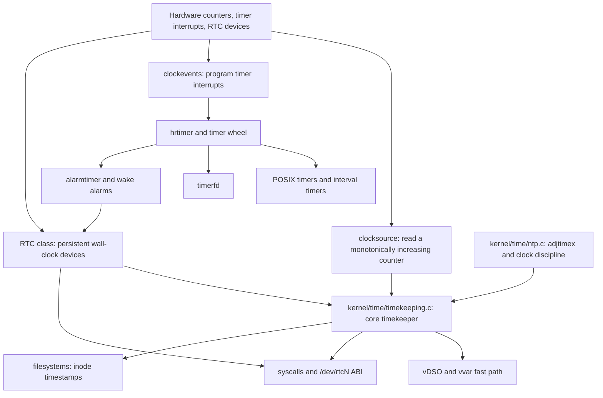

The important split is:

- **Monotonic hardware time** drives scheduling, timeouts, hrtimers, and
  elapsed-time measurement.
- **Realtime / wall-clock time** is Unix epoch time and can be initialized or
  corrected from RTC, firmware, userspace, and NTP.
- **RTC devices** are persistent calendar-clock devices. They are not the hot
  path for every `clock_gettime(CLOCK_REALTIME)` call.

## Global Module And Interface Matrix

This section is the document's global map. Each later section expands one row
with detailed logic, a sub-architecture diagram, lower-layer inputs,
upper-layer outputs, and adjacent Linux modules.

| Module group | Core responsibility | Lower interface | Upper interface | Adjacent modules |
|---|---|---|---|---|
| clocksource | Read a monotonically increasing hardware counter and describe conversion metadata | architecture counter, MMIO/SBI/paravirt clock, firmware description | timekeeping core, `sched_clock`, delay helpers | clocksource watchdog, tick, architecture time code |
| clockevents | Program timer interrupts for a CPU or broadcast domain | interrupt-capable timer device, per-CPU timer block, broadcast device | tick framework, hrtimer, scheduler tick, timeout wakeups | high-resolution timers, NO_HZ, idle/suspend |
| `sched_clock` | Provide very cheap timestamps for scheduler and tracing | fast architecture counter or generic clocksource-like provider | scheduler accounting, tracing, printk timestamps | clocksource stability, tracing, perf |
| core timekeeping | Maintain realtime, monotonic, raw, boottime, TAI, coarse clocks, and vDSO data | selected clocksource, persistent clock seed, NTP discipline, suspend/resume hooks | time syscalls, vDSO/vvar, filesystem timestamps, timer conversion | NTP, RTC, hrtimer, namespace, filesystem |
| RTC class | Expose persistent calendar-clock devices and alarms | RTC hardware, bus transport, driver callbacks, firmware discovery | `/dev/rtcN`, sysfs, procfs, boot/resume seed, wake alarms | alarmtimer, PM, timekeeping, capability checks |
| syscall time ABI | Project clock reads, setters, sleeps, timeouts, and discipline knobs into userspace | timekeeper, hrtimer, CPU accounting, NTP state, permission checks | libc time APIs, admin tools, application wait APIs | futex, poll/select, epoll, signals, timerfd |
| hrtimer | Maintain precise high-resolution expiry queues | timekeeper clock bases, clockevents one-shot device | nanosleep, POSIX timers, timerfd, futex/poll timeouts, alarmtimer | scheduler wakeups, softirq/timer interrupt handling |
| timer wheel | Serve scalable lower-precision kernel timeout callbacks | jiffies/tick processing, clockevents | networking, block I/O, filesystem and driver timeouts | workqueues, networking, hrtimer |
| POSIX/interval timers | Represent user-created timer objects and signal notification policy | hrtimer, CPU accounting, selected clock id, signal subsystem | `timer_*` syscalls, `setitimer`, signal delivery | process/thread lifecycle, signal queues, credentials |
| timerfd | Represent timer expiry as fd readability and 64-bit expiration counts | hrtimer/alarmtimer, timekeeper generation, file state | `read`, `poll`, `epoll`, `timerfd_*` syscalls | eventpoll, select/poll, file descriptor tables |
| alarmtimer | Combine timer expiry with suspend-aware wake capability | hrtimer, boottime/realtime bases, RTC wake alarm support | alarm clocks, suspend wakeups, timerfd alarm clocks | RTC, PM, timekeeping, wakeup source accounting |
| NTP discipline | Adjust realtime frequency, offset, leap state, TAI, and sync status | userspace `timex` requests, timekeeping update loop | `adjtimex`, `clock_adjtime`, TAI/leap state, RTC sync policy | vDSO data, timerfd cancel-on-set, RTC writeback |
| vDSO/vvar | Make common clock reads available without entering the kernel | timekeeper snapshots, sequence counters, architecture counter reads | libc `clock_gettime`, `gettimeofday`, `time` fast paths | exec/mm mappings, architecture vDSO code, time namespaces |
| time namespaces | Add per-namespace offsets to selected monotonic-style clocks | global timekeeper, namespace membership, procfs configuration | container/CRIU clock view, namespace-aware vDSO | nsproxy, procfs, vDSO, capability checks |
| filesystem timestamps | Store and report inode time metadata | timekeeper current wall time, mount atime policy, filesystem encoding | `stat`, `statx`, `utimensat`, backup/build tools | VFS, inode core, filesystem drivers, y2038 types |
| suspend/resume time | Account for elapsed time while CPUs are idle or suspended | persistent clock, platform PM callbacks, clockevents/tick broadcast | `CLOCK_BOOTTIME`, alarmtimer expiry, wake events | PM core, RTC, tick broadcast, scheduler idle |

The matrix also explains why Linux has several "time" subsystems instead of a
single object. A hardware counter, a timer interrupt controller, an RTC, a
POSIX timer object, and a file timestamp all answer different questions and
therefore have different ownership and locking rules.

## End-To-End Linux Paths

The same modules combine differently depending on the user-visible operation.
These paths are useful when reading source: they identify the expected
ownership handoff points before entering implementation details.

| Path | Primary flow | Key consistency rule |
|---|---|---|
| fast `clock_gettime(CLOCK_MONOTONIC)` | clocksource -> timekeeper snapshot -> vvar/vDSO -> libc | userspace validates a sequence-stable snapshot or falls back to syscall |
| syscall `clock_gettime(CLOCK_REALTIME)` | syscall entry -> timekeeper realtime read -> copy to userspace | realtime is derived from kernel state, not read from RTC on every call |
| `settimeofday` / `clock_settime` | permission check -> timekeeping wall-clock mutation -> vDSO update -> timer notifications | monotonic time does not jump; realtime generation-style state changes |
| relative `nanosleep` | syscall -> deadline conversion -> hrtimer arm -> task wait -> expiry or signal | wakeup means re-check completion state, not unconditional success |
| `poll`/`epoll` timeout | readiness registration -> hrtimer timeout -> wait queue wake -> readiness/time-out decision | readiness and timeout race is resolved by re-testing the file state |
| timerfd expiry | timerfd object -> hrtimer/alarmtimer -> expiration count -> fd readiness -> `read` drains count | the fd owns expiration count and cancel-on-set policy |
| RTC `RTC_RD_TIME` | ioctl -> RTC class/dev node -> RTC driver read callback -> userspace `struct rtc_time` | RTC time is device state and may be unsupported or invalid |
| RTC wake alarm | alarmtimer or RTC ioctl -> RTC driver alarm programming -> PM wake event -> RTC/alarmtimer notification | wake alarm capability is separate from ordinary realtime reads |
| filesystem timestamp update | VFS operation -> current time from timekeeping -> inode timestamp update -> filesystem encoding | stored timestamps follow filesystem range/granularity and mount policy |
| suspend/resume accounting | suspend prep -> optional RTC/platform wake -> resume -> timekeeping suspend delta update | boottime and realtime account for elapsed suspend differently from monotonic |

## Canonical Linux Clock Types

Linux exposes several clock identities. Their differences are semantic, not
just naming differences.

| Clock | User ABI name | Core meaning | Can jump by settimeofday/NTP step | Includes suspend time | Typical use |
|---|---|---|---|---|---|
| Realtime | `CLOCK_REALTIME` | Unix epoch wall clock | Yes | Yes | File timestamps, wall time, logs |
| Realtime coarse | `CLOCK_REALTIME_COARSE` | Faster lower-resolution realtime | Yes | Yes | Low-cost timestamps |
| Monotonic | `CLOCK_MONOTONIC` | Time since boot excluding suspend | No manual wall-clock jumps | No | Relative deadlines, elapsed time |
| Monotonic coarse | `CLOCK_MONOTONIC_COARSE` | Faster lower-resolution monotonic | No | No | Low-cost elapsed timestamps |
| Monotonic raw | `CLOCK_MONOTONIC_RAW` | Raw hardware-derived monotonic time before NTP frequency discipline | No | No | Time measurement needing raw hardware rate |
| Boottime | `CLOCK_BOOTTIME` | Monotonic plus suspend time | No wall-clock jumps | Yes | Timers that should account for suspend |
| TAI | `CLOCK_TAI` | International Atomic Time offset from realtime | Offset managed by time discipline | Yes | Leap-second-aware applications |
| Process CPU | `CLOCK_PROCESS_CPUTIME_ID` | CPU time consumed by process | No | N/A | Profiling/accounting |
| Thread CPU | `CLOCK_THREAD_CPUTIME_ID` | CPU time consumed by thread | No | N/A | Profiling/accounting |
| Realtime alarm | `CLOCK_REALTIME_ALARM` | Realtime timer that may wake suspended system | Yes | Yes | Wake alarms |
| Boottime alarm | `CLOCK_BOOTTIME_ALARM` | Boottime timer that may wake suspended system | No wall-clock jumps | Yes | Suspend-aware wake alarms |

Primary references:

- [ktime accessors and clock descriptions](https://docs.kernel.org/core-api/timekeeping.html)
- [POSIX timers source](https://github.com/torvalds/linux/blob/master/kernel/time/posix-timers.c)
- [timerfd source](https://github.com/torvalds/linux/blob/master/fs/timerfd.c)
- [alarmtimer source](https://github.com/torvalds/linux/blob/master/kernel/time/alarmtimer.c)

## Hardware-Facing Layers

### Clocksource

The clocksource layer provides a readable monotonically increasing counter. It
is the basis for converting hardware ticks/cycles into kernel time.

Key properties:

- Read-only, usually cheap.
- Must be monotonic enough for timekeeping.
- Has a rating/quality so Linux can choose among candidates.
- Has conversion parameters such as `mult`, `shift`, and mask.
- Can be watched by watchdog logic to detect unstable clocks.
- May come from architecture counters, platform timers, paravirtual clocks, or
  firmware-provided clocks.

Detailed logic:

1. A clocksource driver registers one or more readable counters.
2. Linux rates them and selects a current source.
3. The chosen source exposes a raw counter plus conversion metadata.
4. Timekeeping reads the counter, applies conversion, and derives nanoseconds.
5. A watchdog can compare it against a reference and quarantine unstable
   sources.

Sub-architecture:

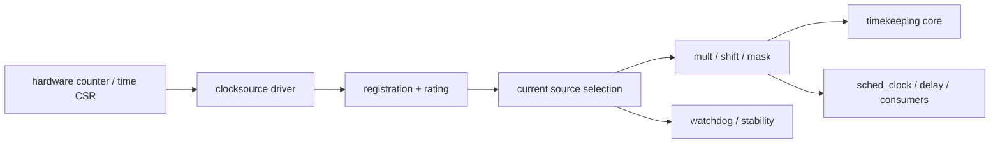

Important source paths:

```text
kernel/time/clocksource.c
kernel/time/timekeeping.c
include/linux/clocksource.h
drivers/clocksource/
```

Reference:

- [Clock sources, clock events, sched_clock, and delay timers](https://docs.kernel.org/timers/timekeeping.html)

Interfaces:

- Lower layer: hardware counters, architectural time registers, firmware
  descriptions, and per-platform driver hooks.
- Upper layer: timekeeping, sched_clock, delay helpers, and any user-facing
  clock derivation.
- Related modules: `clockevents`, `tick`, and timekeeping watchdog logic.

### Clockevents

The clockevents layer programs timer interrupts. A clocksource answers "what
time is it?", while a clockevent answers "interrupt me at this future time".

Key properties:

- Per-CPU or global device.
- Supports one-shot or periodic mode.
- Drives hrtimers, scheduler ticks, and timeout wakeups.
- Integrates with high-resolution timer mode and dynamic ticks.

Detailed logic:

1. Linux picks a clockevent device for each CPU or a broadcast fallback.
2. A deadline is programmed into the device.
3. When the interrupt fires, Linux runs tick/hrtimer/scheduler wakeup work.
4. One-shot mode reprograms the next deadline after each expiry.
5. Periodic mode delivers regular ticks without reprogramming every time.

Sub-architecture:

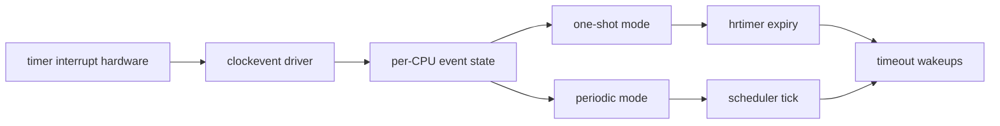

Important source paths:

```text
kernel/time/clockevents.c
kernel/time/tick-common.c
kernel/time/tick-broadcast.c
kernel/time/tick-oneshot.c
kernel/time/tick-sched.c
include/linux/clockchips.h
drivers/clocksource/
```

References:

- [High resolution timers and dynamic ticks](https://docs.kernel.org/timers/highres.html)
- [NO_HZ dynamic tick documentation](https://docs.kernel.org/timers/no_hz.html)

Interfaces:

- Lower layer: interrupt-capable timer hardware, CPU-local timer blocks, and
  broadcast routing.
- Upper layer: hrtimer, scheduler tick, sleep/wakeup paths, and timeout-based
  wait primitives.
- Related modules: `hrtimer`, `tick-*`, and `timekeeping` conversion data.

### sched_clock

`sched_clock()` is a fast timestamp source used for scheduling and tracing. It
is optimized for low overhead and does not carry the same wall-clock semantics
as `CLOCK_REALTIME`.

Relationship to the top-level architecture:

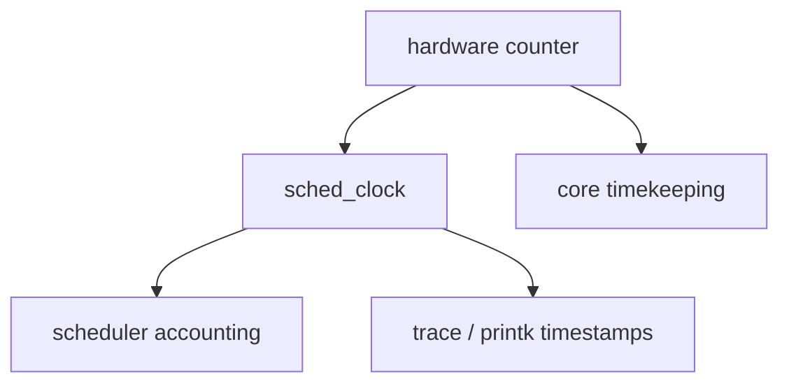

`sched_clock()` is adjacent to, but not a replacement for, the timekeeper. It
exists because scheduler and tracing paths need a very cheap timestamp source
with stable ordering properties; they do not need full wall-clock semantics.

Important source paths:

```text
kernel/sched/clock.c
include/linux/sched/clock.h
```

Detailed logic:

1. Architecture or generic scheduler clock code provides a fast counter read.
2. Scheduler and trace paths sample it for local ordering and accounting.
3. Wraparound and stability handling are hidden behind scheduler-clock helpers.
4. Userspace wall-clock APIs do not consume `sched_clock()` directly.

Sub-architecture:

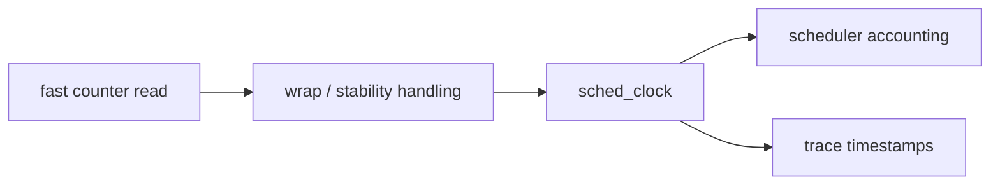

Interfaces:

- Lower layer: architecture counter or platform-provided fast timestamp.
- Upper layer: scheduler accounting, tracing, printk, and profiling paths.
- Related modules: scheduler clock, tracing, clocksource selection, and
  architecture time helpers.

### Persistent Clock And RTC

Linux distinguishes persistent wall-clock devices from the hot-path
timekeeper. RTC/persistent clock data can initialize wall time at boot and can
be updated from system time, but normal `clock_gettime(CLOCK_REALTIME)` reads
the kernel timekeeper, not the RTC chip every time.

Detailed logic:

1. Firmware or platform code exposes a persistent clock or RTC device.
2. The RTC class driver binds the device and registers it in the RTC class.
3. Userspace sees `/dev/rtcN`, sysfs, and procfs views.
4. Boot/resume code may seed wall time from the RTC.
5. When policy allows, Linux writes updated system time back to the RTC.

Sub-architecture:

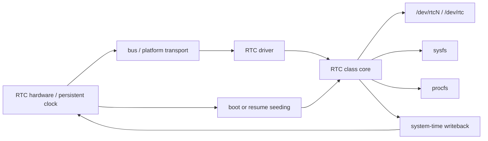

Important source paths:

```text
drivers/rtc/
include/linux/rtc.h
include/uapi/linux/rtc.h
```

Reference:

- [RTC Drivers for Linux](https://docs.kernel.org/admin-guide/rtc.html)

Interfaces:

- Lower layer: RTC hardware, bus transport, and firmware discovery.
- Upper layer: RTC ioctl ABI, class device nodes, procfs/sysfs, boot-time wall
  clock seeding, and alarm/writeback policy.
- Related modules: `timekeeping`, `alarmtimer`, suspend/resume, and device PM.

Modules touched:

- `drivers/rtc/class.c`
- `drivers/rtc/interface.c`
- `drivers/rtc/rtc-dev.c`
- `drivers/rtc/sysfs.c`
- `drivers/rtc/proc.c`
- `kernel/time/timekeeping.c`
- `kernel/time/alarmtimer.c`

## Core Timekeeping

The core timekeeping layer maintains the authoritative kernel view of time. It
combines a monotonic clocksource with offsets and discipline state to serve the
different Linux clocks.

Responsibilities:

- Maintain monotonic time.
- Maintain realtime Unix epoch time.
- Maintain boottime, raw monotonic, TAI, and coarse variants.
- Convert hardware cycles to nanoseconds.
- Protect multi-field time state with sequence counters.
- Publish data for fast vDSO reads.
- Handle wall-clock setting and time steps.
- Interact with NTP discipline and leap-second state.
- Account for suspend/resume.

Important source paths:

```text
kernel/time/timekeeping.c
kernel/time/time.c
kernel/time/ntp.c
kernel/time/hrtimer.c
kernel/time/tick-common.c
include/linux/timekeeping.h
include/linux/timekeeper_internal.h
include/uapi/linux/time.h
include/uapi/linux/time_types.h
```

Key architectural ideas:

- Realtime is not a separate hardware counter. It is derived from the kernel
  timekeeper and wall-clock offsets.
- `clock_settime(CLOCK_REALTIME)` changes wall-clock state without changing the
  monotonic clock.
- NTP can slew time by changing frequency discipline rather than stepping time.
- `CLOCK_MONOTONIC_RAW` exposes a rawer hardware-derived time that avoids
  normal NTP frequency adjustments.
- Coarse clocks trade precision for lower read cost.

Detailed logic:

1. Boot code seeds the timekeeper from a monotonic clocksource and an initial
   wall-clock reference when one exists.
2. The timekeeper keeps a canonical state block containing realtime, monotonic,
   boottime, raw, TAI, and coarse views.
3. The core update path periodically advances the timeline from the current
   clocksource and applies discipline adjustments.
4. Wall-clock setters update the realtime side and notify affected timer bases.
5. Read paths use seqlock-style validation so userspace can sample a consistent
   snapshot.
6. vDSO/vvar readers consume the same timekeeper state through a published fast
   data page.

Sub-architecture:

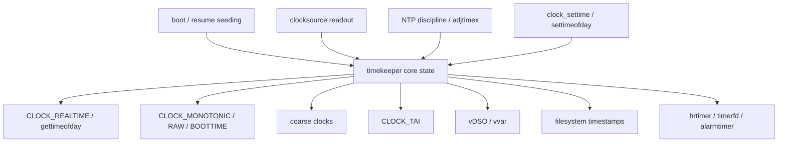

Interface surface:

- Lower layer inputs:
  - current clocksource readout
  - suspend/resume state
  - RTC or persistent wall-clock seed
  - NTP discipline updates
  - explicit wall-clock setters
- Upper layer outputs:
  - `CLOCK_REALTIME`, `CLOCK_MONOTONIC`, `CLOCK_BOOTTIME`
  - coarse variants
  - `CLOCK_MONOTONIC_RAW`
  - `CLOCK_TAI`
  - vDSO/vvar fast reads
  - filesystem timestamp source
- Cross-cutting modules:
  - `clocksource`, `clockevents`, `hrtimer`, `timerfd`, `alarmtimer`,
    `posix-timers`, `rtc`, `vDSO`, `namespace`, `fs/stat`

Modules touched:

- `kernel/time/timekeeping.c`
- `kernel/time/time.c`
- `kernel/time/ntp.c`
- `kernel/time/hrtimer.c`
- `kernel/time/tick-common.c`
- `kernel/time/tick-sched.c`
- `kernel/time/vsyscall.c`
- `kernel/time/alarmtimer.c`
- `kernel/time/namespace.c`
- `fs/stat.c`

References:

- [ktime accessors](https://docs.kernel.org/core-api/timekeeping.html)
- [Linux timekeeping source](https://github.com/torvalds/linux/blob/master/kernel/time/timekeeping.c)
- [Linux NTP discipline source](https://github.com/torvalds/linux/blob/master/kernel/time/ntp.c)

## RTC Class And Device ABI

Linux RTC support is a class framework. A system may have several RTCs:
`/dev/rtc0`, `/dev/rtc1`, and so on. The class framework exposes device nodes,
sysfs attributes, procfs compatibility information, and ioctl ABI.

User-visible surfaces:

```text
/dev/rtcN
/dev/rtc
/sys/class/rtc/rtcN/
/proc/driver/rtc
```

Core source paths:

```text
drivers/rtc/class.c
drivers/rtc/interface.c
drivers/rtc/rtc-dev.c
drivers/rtc/sysfs.c
drivers/rtc/proc.c
drivers/rtc/rtc-*.c
include/linux/rtc.h
include/uapi/linux/rtc.h
tools/testing/selftests/rtc/rtctest.c
```

Common RTC ioctl feature groups:

| Feature group | Representative ioctls | Purpose |
|---|---|---|
| Read/set calendar time | `RTC_RD_TIME`, `RTC_SET_TIME` | Read or set broken-down RTC calendar time |
| Legacy alarm | `RTC_ALM_READ`, `RTC_ALM_SET`, `RTC_AIE_ON`, `RTC_AIE_OFF` | Program/read simple RTC alarms and alarm interrupts |
| Wake alarm | `RTC_WKALM_RD`, `RTC_WKALM_SET` | Program alarms that can wake the system |
| Periodic interrupts | `RTC_PIE_ON`, `RTC_PIE_OFF`, `RTC_IRQP_READ`, `RTC_IRQP_SET` | Periodic RTC interrupt support |
| Update interrupts | `RTC_UIE_ON`, `RTC_UIE_OFF` | Once-per-second update notifications |
| Voltage/loss indicators | `RTC_VL_READ`, `RTC_VL_CLEAR` | Report or clear invalid-time / voltage-low state |
| Epoch and legacy behavior | `RTC_EPOCH_READ`, `RTC_EPOCH_SET` | Legacy century/epoch handling |
| PLL adjustment | `RTC_PLL_GET`, `RTC_PLL_SET` | Device-specific calibration on supported RTCs |

Important semantics:

- RTC time is represented to userspace as `struct rtc_time`, a broken-down
  calendar time similar to `struct tm`.
- RTCs can be invalid or unsynchronized; drivers expose validity and voltage
  loss where hardware supports it.
- Not every RTC supports every ioctl.
- Wake alarms are separate from ordinary time reads.
- RTC device operations are not the same as `clock_gettime(CLOCK_REALTIME)`.

References:

- [RTC Drivers for Linux](https://docs.kernel.org/admin-guide/rtc.html)
- [RTC userspace ABI](https://docs.kernel.org/admin-guide/abi-testing.html)
- [RTC UAPI header](https://github.com/torvalds/linux/blob/master/include/uapi/linux/rtc.h)
- [RTC core interface source](https://github.com/torvalds/linux/blob/master/drivers/rtc/interface.c)
- [RTC dev source](https://github.com/torvalds/linux/blob/master/drivers/rtc/rtc-dev.c)

## System Calls And User ABI

Linux exposes time through multiple ABI families. They overlap, but each exists
for compatibility or a distinct semantic need.

Relationship to the top-level architecture:

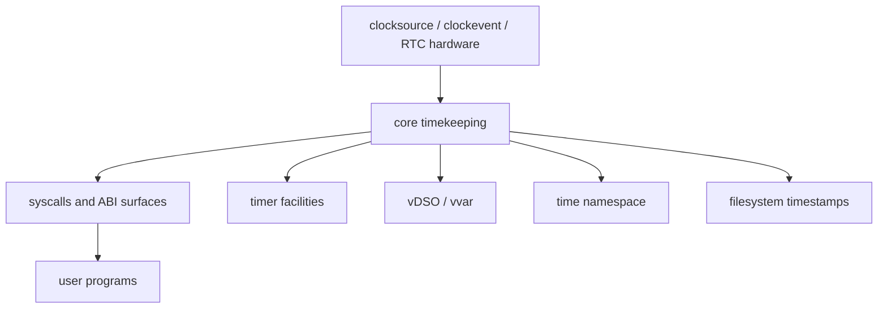

The syscall family is the user-visible projection of the timekeeper plus the
timer subsystems. Some calls are pure readers, some mutate wall-clock state,
some arm deadlines, and some bridge to RTC or discipline state.

### Basic Time Queries And Setting

| API/syscall | Purpose |
|---|---|
| `time()` | Seconds since Unix epoch |
| `gettimeofday()` | Realtime seconds and microseconds plus obsolete timezone argument |
| `settimeofday()` | Set realtime wall clock |
| `clock_gettime()` | Read a selected clock |
| `clock_getres()` | Read nominal resolution of a selected clock |
| `clock_settime()` | Set settable clocks, primarily `CLOCK_REALTIME` |
| `clock_adjtime()` | Apply discipline adjustment to a selected clock |
| `adjtimex()` | Read/change kernel time discipline state |

Source paths:

```text
kernel/time/time.c
kernel/time/posix-timers.c
kernel/time/ntp.c
include/uapi/linux/time.h
include/uapi/linux/time_types.h
include/uapi/linux/timex.h
```

Detailed logic:

1. `time()` and `gettimeofday()` read the current realtime view.
2. `clock_gettime()` routes by clock ID and chooses realtime, monotonic,
   boottime, raw, coarse, or CPU-time views.
3. `clock_settime()` and `settimeofday()` mutate realtime, not monotonic time.
4. `adjtimex()` and `clock_adjtime()` expose discipline state and frequency
   correction.
5. `clock_getres()` reports the nominal resolution for the selected clock.

Sub-architecture:

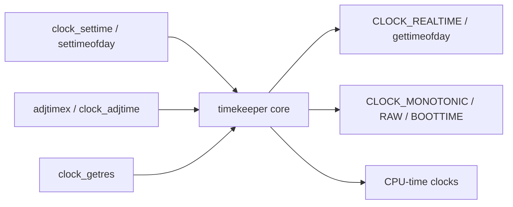

Interfaces:

- Lower layer: timekeeper state, wall-clock seed, clocksource conversion, NTP
  discipline, CPU-time accounting.
- Upper layer: user programs, libc wrappers, file timestamping, timers, and
  signal-timeout behavior.
- Related modules: `timekeeping`, `ntp`, `itimer`, `posix-timers`, `timerfd`,
  `hrtimer`, `futex`, `epoll`, `signal`, `fs/stat`.

Modules touched:

- `kernel/time/time.c`
- `kernel/time/timekeeping.c`
- `kernel/time/ntp.c`
- `kernel/time/posix-timers.c`
- `kernel/time/itimer.c`
- `kernel/time/hrtimer.c`
- `fs/timerfd.c`
- `kernel/futex/`
- `fs/select.c`
- `fs/eventpoll.c`

### Sleep And Timeout APIs

| API/syscall | Purpose |
|---|---|
| `nanosleep()` | Relative sleep |
| `clock_nanosleep()` | Relative or absolute sleep against a selected clock |
| `select()` / `pselect()` | Readiness wait with timeout |
| `poll()` / `ppoll()` | Readiness wait with timeout |
| `epoll_wait()` / `epoll_pwait2()` | Scalable readiness wait with timeout |
| Futex waits | Blocking wait with optional timeout; some operations support `FUTEX_CLOCK_REALTIME` |

Source paths:

```text
kernel/time/hrtimer.c
kernel/futex/
fs/select.c
fs/eventpoll.c
```

Detailed logic:

1. A caller supplies a relative or absolute deadline.
2. Linux converts that deadline into the appropriate clock basis.
3. The wait path arms an hrtimer or equivalent timeout object.
4. Readiness or signal completion cancels the timer and returns.
5. `ppoll`/`pselect`/`epoll_pwait2` all end up with the same broad timeout
   semantics even though their ready-set plumbing differs.

Sub-architecture:

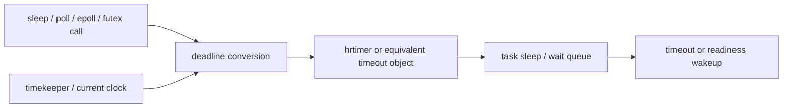

### Interval Timers

Linux still supports classic interval timers:

| API | Clock/accounting basis |
|---|---|
| `ITIMER_REAL` | Realtime countdown, delivers `SIGALRM` |
| `ITIMER_VIRTUAL` | User CPU time, delivers `SIGVTALRM` |
| `ITIMER_PROF` | User + kernel CPU time, delivers `SIGPROF` |

Source path:

```text
kernel/time/itimer.c
```

Detailed logic:

1. Userspace arms `ITIMER_REAL`, `ITIMER_VIRTUAL`, or `ITIMER_PROF`.
2. The kernel tracks the relevant clock basis and expiration state.
3. Expiration delivers the corresponding signal.
4. Repeating timers rearm after each delivery.

Sub-architecture:

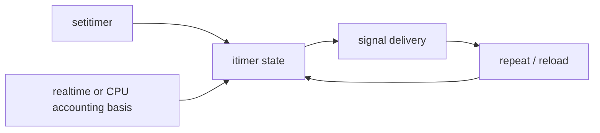

### POSIX Timers

POSIX timers support signal or thread notification semantics and selected
clock IDs.

Important APIs:

```text
timer_create()
timer_delete()
timer_settime()
timer_gettime()
timer_getoverrun()
```

Source path:

```text
kernel/time/posix-timers.c
```

Detailed logic:

1. Userspace creates a timer bound to a selected clock ID.
2. The kernel stores absolute or relative expiration state.
3. Timer expiry can deliver a signal or targeted notification.
4. Overrun accounting records missed expirations.

Sub-architecture:

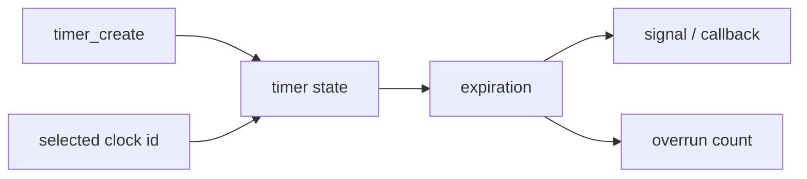

### timerfd

`timerfd` turns timer expiration into a file descriptor readiness/read event.

Important APIs:

```text
timerfd_create()
timerfd_settime()
timerfd_gettime()
read()
poll()/epoll()
```

Feature details:

- Supports `CLOCK_REALTIME` and `CLOCK_MONOTONIC`.
- Also supports alarm clocks where configured.
- `TFD_TIMER_ABSTIME` arms absolute deadlines.
- `TFD_TIMER_CANCEL_ON_SET` lets realtime absolute timers report cancellation
  if the realtime clock is discontinuously changed.
- `read()` returns an expiration count as a 64-bit integer.

Source paths:

```text
fs/timerfd.c
include/uapi/linux/timerfd.h
```

Reference:

- [timerfd source](https://github.com/torvalds/linux/blob/master/fs/timerfd.c)

Detailed logic:

1. A timerfd is created around a selected clock ID.
2. `timerfd_settime()` arms a deadline, optionally absolute.
3. Timer expiry increments a count and makes the fd readable.
4. `read()` returns accumulated expirations.
5. `poll` and `epoll` observe readability; realtime-set discontinuities can
   cancel some realtime absolute timers.

Sub-architecture:

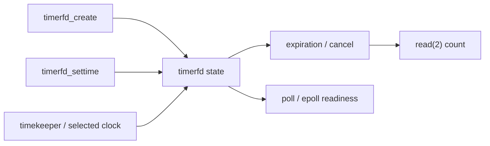

Interfaces:

- Lower layer: selected clock source, hrtimer, cancel-on-set semantics, and
  readiness notifications.
- Upper layer: file descriptor polling, blocking reads, and userspace timer
  control.
- Related modules: `timekeeping`, `hrtimer`, `alarmtimer`, `eventpoll`,
  `select`, `futex`, `signal`.

## Timer Facilities

Linux has more than one internal timer mechanism.

### Timer Wheel

The timer wheel is optimized for large numbers of lower-precision timeout
timers. It is commonly used for I/O timeouts and other timeout-style events
where exact nanosecond precision is unnecessary.

Relationship to the top-level architecture:

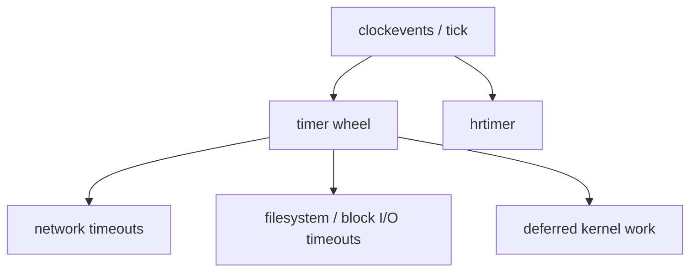

The timer wheel is the broad timeout engine. It is optimized for scale and
coalescing, not for nanosecond precision. High-resolution sleeps and POSIX
timers use hrtimer instead.

Source paths:

```text
kernel/time/timer.c
include/linux/timer.h
```

Detailed logic:

1. Kernel code arms a timer with a future jiffies-based expiry.
2. Linux places it into the appropriate wheel bucket.
3. Periodic tick or timer processing advances the wheel.
4. Expired timers are detached and their callbacks run.
5. Code needing exact ordering or high-resolution expiry uses hrtimer instead.

Sub-architecture:

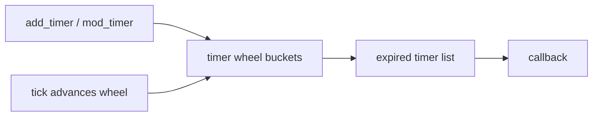

Interfaces:

- Lower layer: clockevents and hrtimer conversion.
- Upper layer: ordinary kernel timeouts and deferred work.
- Related modules: networking, filesystem I/O waits, and scheduler timeouts.

### hrtimer

The high-resolution timer subsystem is used where precise time ordering and
nanosecond-scale representation matter.

Properties:

- 64-bit nanosecond time representation.
- Sorted timer queues.
- Integrates with clockevents in one-shot mode.
- Serves nanosleep, POSIX timers, and many precise timeout paths.

Source paths:

```text
kernel/time/hrtimer.c
include/linux/hrtimer.h
```

Reference:

- [hrtimers documentation](https://docs.kernel.org/timers/hrtimers.html)

Detailed logic:

1. The caller supplies an absolute or relative expiry on a chosen clock.
2. Linux inserts the timer into a per-base ordered structure.
3. The earliest expiry programs the next clockevent.
4. On interrupt, expired timers are dequeued and their callbacks run.

Sub-architecture:

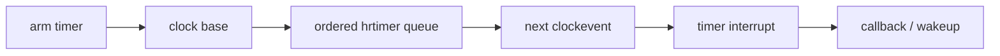

Interfaces:

- Lower layer: clockevents and time bases from timekeeping.
- Upper layer: nanosleep, POSIX timers, timerfd, alarmtimer, and other
  precise timeout users.
- Related modules: `clockevents`, `timekeeping`, `timerfd`, `posix-timers`,
  `alarmtimer`, `futex`, `epoll`.

### alarmtimer

Alarm timers integrate timer behavior with system suspend and RTC wakeup
capability.

Relevant clocks:

```text
CLOCK_REALTIME_ALARM
CLOCK_BOOTTIME_ALARM
```

Source path:

```text
kernel/time/alarmtimer.c
```

Reference:

- [alarmtimer source](https://github.com/torvalds/linux/blob/master/kernel/time/alarmtimer.c)

Detailed logic:

1. An alarmtimer binds to a realtime or boottime clock.
2. The expiry is translated into wake-capable timer state.
3. Suspend-aware systems can route alarm expiry through RTC wake paths.
4. Expiration raises the target wakeup or notification.

Sub-architecture:

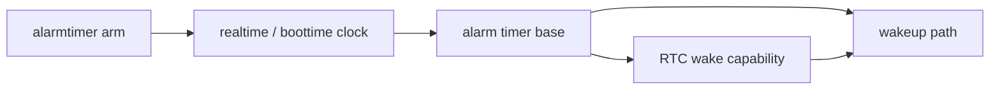

Interfaces:

- Lower layer: hrtimer and wake-capable clock/routing support.
- Upper layer: suspend-aware alarms and wake events.
- Related modules: `RTC`, `timekeeping`, `clockevents`, `hrtimer`.

## Time Discipline, NTP, And Leap Seconds

Linux has a clock discipline layer for making the system clock track external
time sources. This is separate from raw hardware counter reads.

Relationship to the top-level architecture:

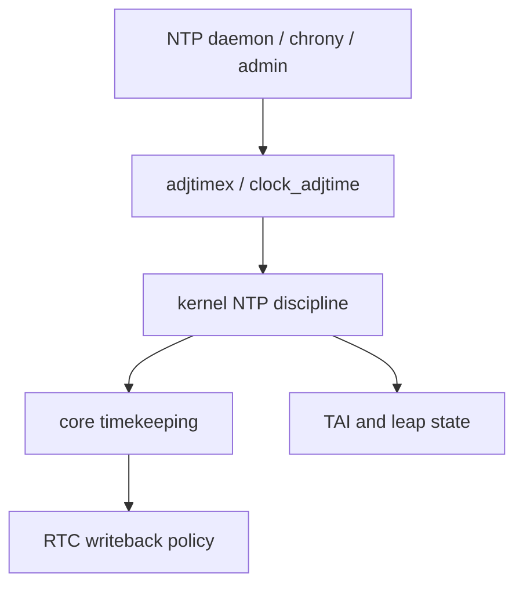

The discipline layer adjusts how realtime follows external time. It does not
replace clocksource reads; it changes offsets, frequency discipline, leap
state, and synchronization status consumed by the core timekeeper.

Feature surface:

- `adjtimex()`
- `clock_adjtime()`
- Frequency correction
- Offset correction
- Slewing versus stepping
- Leap-second status
- TAI offset
- Synchronization state such as `STA_UNSYNC`
- RTC update behavior from synchronized system time on systems that support it

Important source paths:

```text
kernel/time/ntp.c
kernel/time/timekeeping.c
include/uapi/linux/timex.h
tools/testing/selftests/timers/
```

References:

- [NTP source](https://github.com/torvalds/linux/blob/master/kernel/time/ntp.c)
- [timex UAPI header](https://github.com/torvalds/linux/blob/master/include/uapi/linux/timex.h)

Detailed logic:

1. Userspace submits discipline state through `adjtimex()` or
   `clock_adjtime()`.
2. The kernel records offset, frequency, maximum error, estimated error, leap
   status, and synchronization flags.
3. Timekeeping update paths apply the current discipline to realtime.
4. Leap-second and TAI state are maintained as part of the same discipline
   surface.
5. On systems that enable it, synchronized system time can be written back to
   RTC periodically.

Sub-architecture:

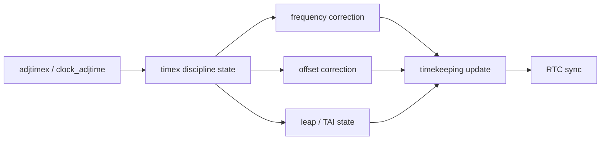

Interfaces:

- Lower layer: timekeeper update loop, realtime offset/frequency state, and
  RTC writeback hooks.
- Upper layer: NTP/chrony, administrative time tools, `timex` UAPI, and
  applications observing synchronization state.
- Related modules: `timekeeping`, RTC class, `CLOCK_TAI`, vDSO data
  publication, timerfd cancel-on-set behavior, and permission checks.

Modules touched:

- `kernel/time/ntp.c`
- `kernel/time/timekeeping.c`
- `kernel/time/time.c`
- `include/uapi/linux/timex.h`
- `drivers/rtc/`

## vDSO And vvar Fast Path

Many Linux architectures serve common `clock_gettime()` calls through vDSO.
This avoids a syscall when userspace can safely read a shared kernel-published
time data page.

Relationship to the top-level architecture:

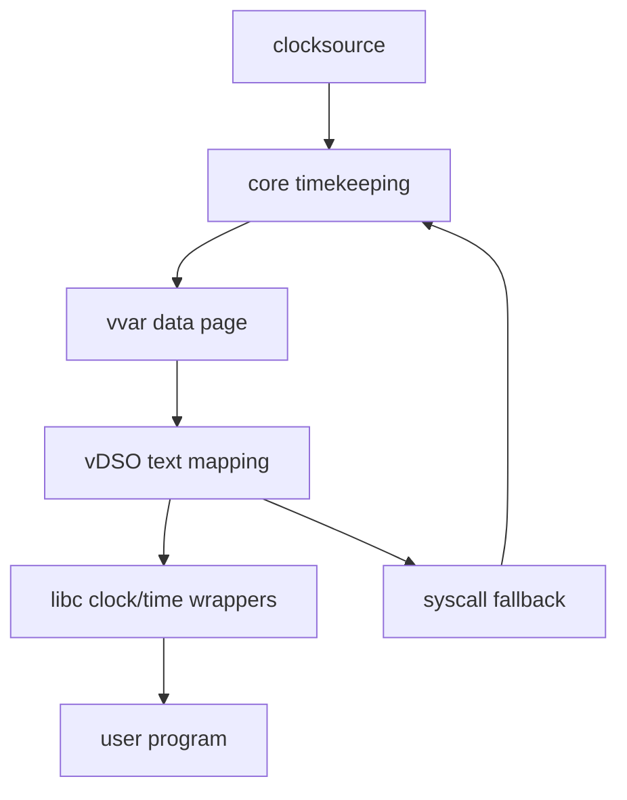

The vDSO path is a read acceleration layer. It does not own time semantics. It
mirrors a safe subset of the timekeeper's current state into userspace and
falls back to real syscalls when the requested clock or hardware mode cannot be
handled safely in user context.

Feature surface:

- vDSO text mapping with functions such as `__vdso_clock_gettime`.
- vvar data page containing timekeeper-derived parameters.
- Sequence-count style validation so userspace does not consume torn time
  updates.
- Fast support for common clocks such as realtime and monotonic.
- Fallback to syscall when a clock is unsupported by vDSO or the fast read
  cannot complete safely.

Source paths vary by architecture, but the common areas are:

```text
kernel/time/vsyscall.c
lib/vdso/
include/vdso/
arch/*/kernel/vdso/
arch/*/include/asm/vdso/
```

References:

- [vDSO common source directory](https://github.com/torvalds/linux/tree/master/lib/vdso)
- [Linux timekeeping source](https://github.com/torvalds/linux/blob/master/kernel/time/timekeeping.c)
- [vdso(7)](https://man7.org/linux/man-pages/man7/vdso.7.html)
- [generic vDSO gettimeofday source](https://github.com/torvalds/linux/blob/master/lib/vdso/gettimeofday.c)

Detailed logic:

1. During exec or mmap setup, the kernel maps a vDSO text image into the
   process address space.
2. The kernel also exposes a vvar-style data page containing timekeeper-derived
   basetime and conversion data.
3. libc discovers the vDSO symbols and calls them for supported operations.
4. The vDSO routine reads sequence/version state, samples clock data, validates
   consistency, and computes the requested timestamp.
5. If the clock mode is unsupported or the sequence validation fails in a way
   the fast path cannot handle, the vDSO routine falls back to the syscall.

Sub-architecture:

```mermaid
flowchart LR
    EXEC["exec / mmap setup"]
    TEXT["vDSO text"]
    DATA["vvar data"]
    SEQ["sequence validation"]
    CALC["userspace time calculation"]
    FALL["syscall fallback"]
    TK["timekeeper updates"]

    EXEC --> TEXT
    TK --> DATA
    TEXT --> SEQ --> CALC
    DATA --> SEQ
    SEQ --> FALL
```

Interfaces:

- Lower layer: timekeeper snapshots, clocksource conversion parameters,
  architecture counter-read helpers, and sequence counters.
- Upper layer: libc wrappers, `clock_gettime`, `gettimeofday`, `time`, and
  architecture-specific vDSO symbols.
- Related modules: `timekeeping`, `exec`, `mm`, architecture vDSO build code,
  time namespaces, and syscall fallback handlers.

Modules touched:

- `kernel/time/vsyscall.c`
- `kernel/time/timekeeping.c`
- `lib/vdso/gettimeofday.c`
- `include/vdso/`
- `arch/*/kernel/vdso/`
- `arch/*/entry/vdso/`
- `arch/*/include/asm/vdso/`

## Time Namespaces

Linux time namespaces are mainly for containers and checkpoint/restore. They
provide per-namespace offsets for monotonic-style clocks rather than a fully
independent RTC or NTP instance for each namespace.

Relationship to the top-level architecture:

```mermaid
flowchart TD
    TK["core timekeeping"]
    NS["time namespace offsets"]
    PROC["process namespace membership"]
    VDSO["namespace-aware vDSO data"]
    ABI["clock_gettime / procfs"]
    CRIU["checkpoint / restore tooling"]

    TK --> NS --> ABI
    PROC --> NS
    NS --> VDSO
    CRIU --> PROC
```

Time namespaces do not virtualize the hardware clock and do not provide an
independent RTC. They add per-namespace offsets to selected monotonic-style
clocks so restored containers can preserve the time values they observed before
checkpoint.

User-visible surface:

```text
unshare(CLONE_NEWTIME)
/proc/self/timens_offsets
```

Affected clocks include:

```text
CLOCK_MONOTONIC
CLOCK_BOOTTIME
```

Source paths:

```text
kernel/time/namespace.c
include/linux/time_namespace.h
```

References:

- [time_namespaces(7)](https://man7.org/linux/man-pages/man7/time_namespaces.7.html)
- [Linux time namespace source](https://github.com/torvalds/linux/blob/master/kernel/time/namespace.c)

Detailed logic:

1. A process creates or joins a time namespace.
2. The namespace stores offsets for monotonic and boottime-style clocks.
3. `/proc/<pid>/timens_offsets` exposes and, under restrictions, accepts those
   offsets.
4. Clock read paths add the namespace offset to selected clocks.
5. vDSO data must be adjusted or marked so userspace fast reads observe the
   same namespace-relative view as syscall reads.

Sub-architecture:

```mermaid
flowchart LR
    CLONE["clone / unshare CLONE_NEWTIME"]
    NS["time namespace object"]
    OFF["monotonic + boottime offsets"]
    PROC["process membership"]
    READ["clock read path"]
    PROCFS["/proc/pid/timens_offsets"]
    VDSO["vDSO namespace data"]

    CLONE --> NS --> OFF
    PROC --> NS
    OFF --> READ
    OFF --> PROCFS
    OFF --> VDSO
```

Interfaces:

- Lower layer: global timekeeper clocks and process namespace membership.
- Upper layer: container runtimes, checkpoint/restore tools, procfs offset
  configuration, and clock read paths.
- Related modules: `nsproxy`, procfs, vDSO/vvar, timekeeping, capability
  checks, and container runtime ABI.

Modules touched:

- `kernel/time/namespace.c`
- `include/linux/time_namespace.h`
- `kernel/nsproxy.c`
- `fs/proc/`
- `lib/vdso/`
- `kernel/time/timekeeping.c`

## Filesystem Timestamp Semantics

Linux filesystems expose inode timestamps through `stat`, `statx`, and related
interfaces. The timekeeping layer supplies current wall-clock time when the VFS
or filesystem needs to update inode timestamps; persisted files may carry any
timestamp representable by the filesystem.

Relationship to the top-level architecture:

```mermaid
flowchart TD
    TK["core timekeeping"]
    VFS["VFS inode operations"]
    FS["filesystem-specific inode format"]
    STAT["stat / statx"]
    UTIME["utime / utimes / utimensat"]
    MNT["mount timestamp policy"]
    USER["user program"]

    TK --> VFS
    VFS --> FS
    FS --> STAT --> USER
    USER --> UTIME --> VFS
    MNT --> VFS
```

Filesystem time is a consumer of the wall-clock timekeeper, not a clock source.
The VFS and filesystem update inode timestamps when operations require it, and
`stat`-family syscalls report stored inode metadata.

User-visible timestamps include:

- `st_atime`: last access time
- `st_mtime`: last data modification time
- `st_ctime`: last inode status change time
- `stx_btime`: creation/birth time where supported by `statx`

Important details:

- `stat()` generally reports stored inode metadata. It does not clamp future
  timestamps to the current wall clock.
- Different filesystems have different timestamp ranges and granularities.
- Mount options such as `noatime`, `relatime`, and `strictatime` affect access
  time updates.
- `utimensat()` and related APIs allow userspace to set file timestamps.
- Filesystem timestamp behavior must account for y2038-safe time types on
  32-bit architectures.

Source paths:

```text
fs/stat.c
fs/inode.c
fs/utimes.c
include/linux/fs.h
include/uapi/linux/stat.h
```

References:

- [stat source](https://github.com/torvalds/linux/blob/master/fs/stat.c)
- [inode source](https://github.com/torvalds/linux/blob/master/fs/inode.c)
- [stat UAPI header](https://github.com/torvalds/linux/blob/master/include/uapi/linux/stat.h)
- [inode(7)](https://man7.org/linux/man-pages/man7/inode.7.html)
- [utimensat(2)](https://man7.org/linux/man-pages/man2/utimensat.2.html)

Detailed logic:

1. Filesystem operations ask the VFS for current time when an inode timestamp
   needs to change.
2. Mount policy decides whether access-time updates should be suppressed,
   deferred, or made strictly.
3. Filesystems encode the timestamp into their on-disk format, which may have
   different precision and range limits.
4. `stat` and `statx` load inode metadata and serialize timestamps to
   userspace ABI structures.
5. `utime`, `utimes`, `futimens`, and `utimensat` let userspace request
   explicit atime/mtime changes subject to permission and inode flags.

Sub-architecture:

```mermaid
flowchart LR
    OP["read / write / chmod / link / truncate"]
    POLICY["atime policy and permission checks"]
    NOW["current_time from timekeeping"]
    INODE["VFS inode timestamps"]
    DISK["filesystem on-disk timestamp"]
    STAT["stat / statx serialization"]
    UTIME["utimensat / futimens"]

    OP --> POLICY --> NOW --> INODE --> DISK
    DISK --> STAT
    UTIME --> POLICY
```

Interfaces:

- Lower layer: timekeeping current wall time, filesystem-specific timestamp
  encoding, mount options, and inode permission state.
- Upper layer: `stat`, `statx`, `utime`, `utimes`, `utimensat`, `futimens`,
  backup/sync tools, build systems, and libc tests.
- Related modules: VFS inode core, individual filesystems, mount option
  parsing, idmapped mounts, permission checks, and y2038-safe timestamp types.

Modules touched:

- `fs/stat.c`
- `fs/inode.c`
- `fs/utimes.c`
- `include/linux/fs.h`
- `include/linux/time64.h`
- `include/uapi/linux/stat.h`
- filesystem-specific inode implementations

## Suspend, Resume, And Wake Time

Linux tracks more than "time since CPU started executing".

Relationship to the top-level architecture:

```mermaid
flowchart TD
    SUSP["suspend entry"]
    RTC["RTC / persistent clock"]
    TK["core timekeeping"]
    BOOT["CLOCK_BOOTTIME"]
    MONO["CLOCK_MONOTONIC"]
    ALARM["alarmtimer"]
    TICK["tick broadcast / clockevents"]
    RES["resume"]

    SUSP --> TICK
    SUSP --> RTC
    RTC --> RES --> TK
    TK --> BOOT
    TK --> MONO
    ALARM --> RTC
```

Suspend-aware time is where Linux separates elapsed wall/boot time from active
monotonic execution time. The system must account for time that passed while
CPUs were not running ordinary scheduler ticks.

Important concepts:

- `CLOCK_MONOTONIC` normally stops during suspend.
- `CLOCK_BOOTTIME` includes suspend time.
- RTC wake alarms can wake a suspended system.
- Timekeeping must account for elapsed persistent/firmware time across resume.
- Clockevents may need broadcast handling when per-CPU timer hardware stops in
  idle or suspend.

Source paths:

```text
kernel/time/timekeeping.c
kernel/time/alarmtimer.c
kernel/time/tick-broadcast.c
drivers/rtc/
```

Detailed logic:

1. Before suspend, Linux prepares clockevents, tick broadcast state, and wake
   alarms.
2. A wake-capable RTC or platform alarm can be programmed if an alarmtimer
   requires it.
3. During suspend, normal CPU-local monotonic progress may stop.
4. On resume, Linux reads persistent or platform elapsed-time information and
   updates boottime/realtime accounting.
5. Timers that should observe suspend time are evaluated against boottime or
   alarm clock bases.

Sub-architecture:

```mermaid
flowchart LR
    PREP["suspend prepare"]
    WAKE["program wake alarm"]
    STOP["CPU-local time stops"]
    RESUME["resume"]
    ELAPSED["persistent elapsed time"]
    TK["timekeeping resume update"]
    EXPIRE["expire wake timers"]

    PREP --> WAKE --> STOP --> RESUME
    RESUME --> ELAPSED --> TK --> EXPIRE
```

Interfaces:

- Lower layer: RTC/persistent clock, platform suspend/resume callbacks,
  clockevents, and tick broadcast.
- Upper layer: `CLOCK_BOOTTIME`, alarmtimer, timerfd alarm clocks, power
  management policy, and wakeup events.
- Related modules: `timekeeping`, `alarmtimer`, RTC class, PM core,
  clockevents, and scheduler tick.

Modules touched:

- `kernel/time/timekeeping.c`
- `kernel/time/alarmtimer.c`
- `kernel/time/tick-broadcast.c`
- `kernel/power/`
- `drivers/rtc/`

## Capability And Permission Surface

Linux protects operations that change system time.

Relationship to the top-level architecture:

```mermaid
flowchart TD
    USER["userspace request"]
    ABI["time / RTC syscall or ioctl"]
    CAP["capability and LSM checks"]
    TK["timekeeping mutation"]
    RTC["RTC mutation"]
    AUDIT["audit / security policy"]

    USER --> ABI --> CAP
    CAP --> TK
    CAP --> RTC
    CAP --> AUDIT
```

Permission checks sit at every mutation boundary. Read paths such as
`clock_gettime()` are normally unprivileged, while wall-clock setting,
discipline changes, and some RTC operations require administrative authority.

Typical privileged operations:

- `settimeofday()`
- `clock_settime(CLOCK_REALTIME)`
- `adjtimex()` modes that change discipline state
- RTC `RTC_SET_TIME`
- RTC alarm operations depending on device and policy
- periodic RTC interrupt rate changes above unprivileged limits

Relevant capability:

```text
CAP_SYS_TIME
```

Source paths:

```text
kernel/time/time.c
kernel/time/posix-timers.c
drivers/rtc/rtc-dev.c
security/
```

Detailed logic:

1. A syscall or ioctl reaches a time mutation path.
2. The kernel checks the relevant capability, commonly `CAP_SYS_TIME`.
3. LSM and audit layers may observe or restrict the operation.
4. If authorized, the request updates timekeeping state, discipline state, RTC
   state, or alarm configuration.
5. If unauthorized, the operation fails before mutating global time state.

Sub-architecture:

```mermaid
flowchart LR
    REQ["settimeofday / adjtimex / RTC ioctl"]
    CHECK["capability + security checks"]
    MUT["time or RTC mutation"]
    NOTIFY["timer / vDSO / audit side effects"]
    DENY["EPERM / EACCES"]

    REQ --> CHECK
    CHECK --> MUT --> NOTIFY
    CHECK --> DENY
```

Interfaces:

- Lower layer: credential state, capabilities, LSM hooks, and device-specific
  RTC operation policy.
- Upper layer: administrative tools, NTP daemons, RTC utilities, container
  runtimes, and audit/security policy.
- Related modules: `timekeeping`, `ntp`, RTC class, alarmtimer, timerfd,
  capabilities, namespaces, LSM, and audit.

Modules touched:

- `kernel/time/time.c`
- `kernel/time/ntp.c`
- `kernel/time/posix-timers.c`
- `drivers/rtc/rtc-dev.c`
- `kernel/capability.c`
- `security/`

## Complete Feature Checklist

This checklist is a Linux feature inventory for time infrastructure.

### Platform And Hardware

- [ ] Register and select clocksources.
- [ ] Register and select clockevents.
- [ ] Convert hardware ticks/cycles to nanoseconds.
- [ ] Handle per-CPU timer devices.
- [ ] Support one-shot timer mode.
- [ ] Support periodic tick where needed.
- [ ] Support clocksource watchdog / unstable clock handling.
- [ ] Provide suspend/resume timekeeping hooks.
- [ ] Provide persistent clock / RTC integration.
- [ ] Expose architecture-specific vDSO clock data where supported.

### Core Clocks

- [ ] `CLOCK_REALTIME`
- [ ] `CLOCK_REALTIME_COARSE`
- [ ] `CLOCK_MONOTONIC`
- [ ] `CLOCK_MONOTONIC_COARSE`
- [ ] `CLOCK_MONOTONIC_RAW`
- [ ] `CLOCK_BOOTTIME`
- [ ] `CLOCK_TAI`
- [ ] `CLOCK_PROCESS_CPUTIME_ID`
- [ ] `CLOCK_THREAD_CPUTIME_ID`
- [ ] `CLOCK_REALTIME_ALARM`
- [ ] `CLOCK_BOOTTIME_ALARM`

### Basic Time Syscalls

- [ ] `time`
- [ ] `gettimeofday`
- [ ] `settimeofday`
- [ ] `clock_gettime`
- [ ] `clock_getres`
- [ ] `clock_settime`
- [ ] `clock_adjtime`
- [ ] `adjtimex`
- [ ] `times`

### Sleep, Timeout, And Wait Integration

- [ ] `nanosleep`
- [ ] `clock_nanosleep`
- [ ] `select` timeout handling
- [ ] `pselect` timeout handling
- [ ] `poll` timeout handling
- [ ] `ppoll` timeout handling
- [ ] `epoll_wait` timeout handling
- [ ] `epoll_pwait2` nanosecond timeout handling
- [ ] futex relative timeouts
- [ ] futex absolute realtime timeouts via `FUTEX_CLOCK_REALTIME`
- [ ] socket and network timeout interactions

### Timer Facilities

- [ ] Timer wheel.
- [ ] hrtimer.
- [ ] Interval timers: `getitimer`, `setitimer`.
- [ ] POSIX timers: `timer_create`, `timer_delete`, `timer_settime`,
      `timer_gettime`, `timer_getoverrun`.
- [ ] Signal delivery for timer expiration.
- [ ] `timerfd_create`, `timerfd_settime`, `timerfd_gettime`, timerfd `read`.
- [ ] `timerfd` readiness through `poll` and `epoll`.
- [ ] `TFD_TIMER_ABSTIME`.
- [ ] `TFD_TIMER_CANCEL_ON_SET`.
- [ ] Alarm timers.
- [ ] Wake alarms.

### RTC

- [ ] RTC class device registration.
- [ ] `/dev/rtcN`.
- [ ] `/dev/rtc` compatibility alias.
- [ ] `/sys/class/rtc/rtcN`.
- [ ] `/proc/driver/rtc`.
- [ ] `RTC_RD_TIME`.
- [ ] `RTC_SET_TIME`.
- [ ] `RTC_ALM_READ`.
- [ ] `RTC_ALM_SET`.
- [ ] `RTC_AIE_ON/OFF`.
- [ ] `RTC_WKALM_RD`.
- [ ] `RTC_WKALM_SET`.
- [ ] `RTC_PIE_ON/OFF`.
- [ ] `RTC_UIE_ON/OFF`.
- [ ] `RTC_IRQP_READ/SET`.
- [ ] `RTC_VL_READ/CLEAR`.
- [ ] device-specific calibration and legacy ioctls where supported.
- [ ] RTC validity / low-voltage reporting.
- [ ] RTC wakeup integration with suspend.

### Time Discipline

- [ ] NTP frequency discipline.
- [ ] NTP offset discipline.
- [ ] Slew versus step behavior.
- [ ] Leap second state.
- [ ] TAI offset.
- [ ] Synchronization status reporting.
- [ ] `adjtimex` state machine and UAPI.
- [ ] `clock_adjtime` support.
- [ ] RTC writeback from synchronized system time where configured.

### Fast Path And Namespaces

- [ ] vDSO `clock_gettime` fast path.
- [ ] vvar time data publication.
- [ ] sequence-counter consistency for userspace reads.
- [ ] syscall fallback from vDSO.
- [ ] time namespace creation.
- [ ] `/proc/self/timens_offsets`.
- [ ] namespace offsets for monotonic and boottime clocks.

### Filesystem Time

- [ ] `stat` timestamp reporting.
- [ ] `statx` extended timestamp reporting.
- [ ] `utimensat`.
- [ ] `futimens`.
- [ ] access-time mount policies: `noatime`, `relatime`, `strictatime`.
- [ ] filesystem timestamp granularity.
- [ ] filesystem timestamp range and y2038 behavior.

## Suggested Linux Source Reading Order

For architecture understanding:

1. `Documentation/timers/timekeeping.rst`
2. `Documentation/core-api/timekeeping.rst`
3. `kernel/time/timekeeping.c`
4. `kernel/time/clocksource.c`
5. `kernel/time/clockevents.c`
6. `kernel/time/hrtimer.c`
7. `kernel/time/timer.c`
8. `kernel/time/posix-timers.c`
9. `fs/timerfd.c`
10. `kernel/time/ntp.c`
11. `drivers/rtc/class.c`
12. `drivers/rtc/interface.c`
13. `drivers/rtc/rtc-dev.c`
14. `include/uapi/linux/rtc.h`
15. `kernel/time/namespace.c`
16. `lib/vdso/`
17. `fs/stat.c`

For userspace ABI behavior:

1. `include/uapi/linux/time.h`
2. `include/uapi/linux/time_types.h`
3. `include/uapi/linux/timex.h`
4. `include/uapi/linux/rtc.h`
5. `include/uapi/linux/timerfd.h`
6. `tools/testing/selftests/timers/`
7. `tools/testing/selftests/rtc/`

## Source Index

Documentation:

- [Clock sources, clock events, sched_clock, and delay timers](https://docs.kernel.org/timers/timekeeping.html)
- [ktime accessors](https://docs.kernel.org/core-api/timekeeping.html)
- [High resolution timers](https://docs.kernel.org/timers/highres.html)
- [hrtimers](https://docs.kernel.org/timers/hrtimers.html)
- [NO_HZ dynamic ticks](https://docs.kernel.org/timers/no_hz.html)
- [RTC Drivers for Linux](https://docs.kernel.org/admin-guide/rtc.html)
- [time_namespaces(7)](https://man7.org/linux/man-pages/man7/time_namespaces.7.html)

Mainline source:

- [kernel/time/timekeeping.c](https://github.com/torvalds/linux/blob/master/kernel/time/timekeeping.c)
- [kernel/time/time.c](https://github.com/torvalds/linux/blob/master/kernel/time/time.c)
- [kernel/time/ntp.c](https://github.com/torvalds/linux/blob/master/kernel/time/ntp.c)
- [kernel/time/hrtimer.c](https://github.com/torvalds/linux/blob/master/kernel/time/hrtimer.c)
- [kernel/time/timer.c](https://github.com/torvalds/linux/blob/master/kernel/time/timer.c)
- [kernel/time/posix-timers.c](https://github.com/torvalds/linux/blob/master/kernel/time/posix-timers.c)
- [kernel/time/alarmtimer.c](https://github.com/torvalds/linux/blob/master/kernel/time/alarmtimer.c)
- [kernel/time/namespace.c](https://github.com/torvalds/linux/blob/master/kernel/time/namespace.c)
- [fs/timerfd.c](https://github.com/torvalds/linux/blob/master/fs/timerfd.c)
- [drivers/rtc/class.c](https://github.com/torvalds/linux/blob/master/drivers/rtc/class.c)
- [drivers/rtc/interface.c](https://github.com/torvalds/linux/blob/master/drivers/rtc/interface.c)
- [drivers/rtc/rtc-dev.c](https://github.com/torvalds/linux/blob/master/drivers/rtc/rtc-dev.c)
- [drivers/rtc/sysfs.c](https://github.com/torvalds/linux/blob/master/drivers/rtc/sysfs.c)
- [drivers/rtc/proc.c](https://github.com/torvalds/linux/blob/master/drivers/rtc/proc.c)
- [fs/stat.c](https://github.com/torvalds/linux/blob/master/fs/stat.c)
- [include/uapi/linux/rtc.h](https://github.com/torvalds/linux/blob/master/include/uapi/linux/rtc.h)
- [include/uapi/linux/timex.h](https://github.com/torvalds/linux/blob/master/include/uapi/linux/timex.h)
- [include/uapi/linux/time_types.h](https://github.com/torvalds/linux/blob/master/include/uapi/linux/time_types.h)
- [include/uapi/linux/timerfd.h](https://github.com/torvalds/linux/blob/master/include/uapi/linux/timerfd.h)
