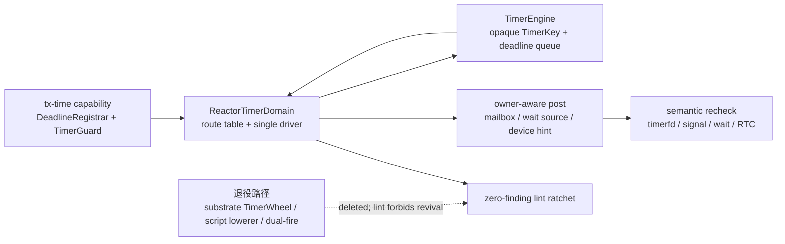
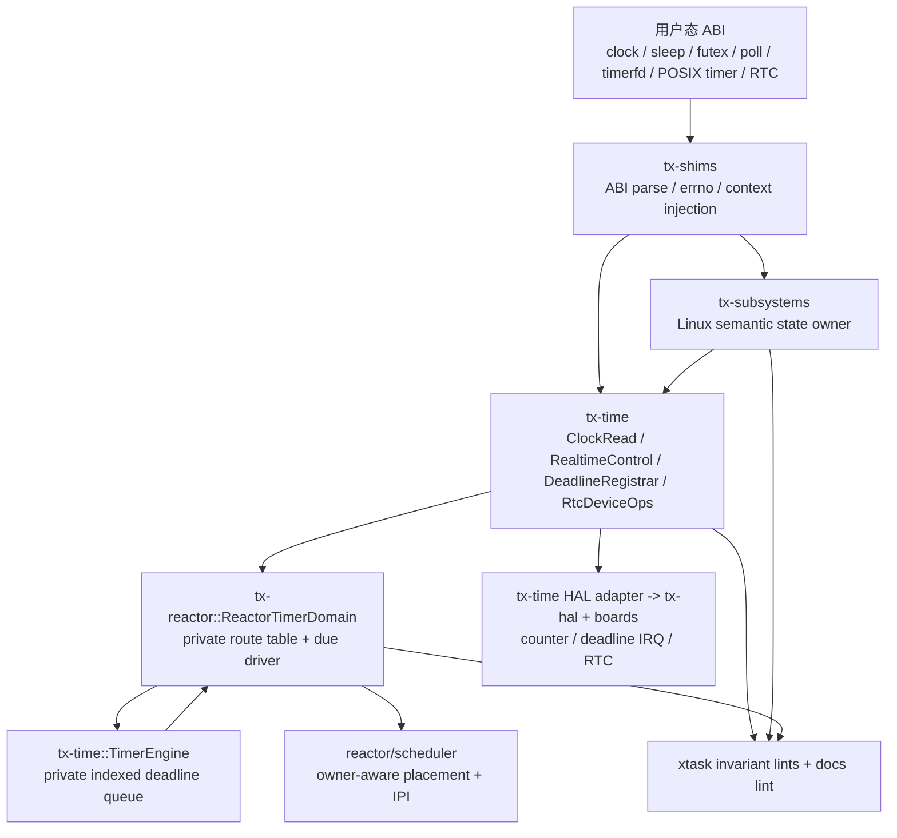
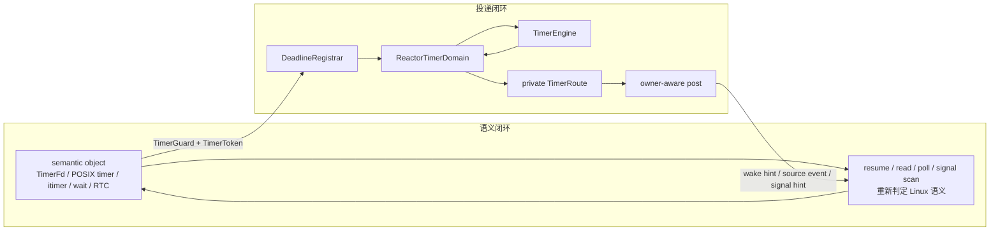
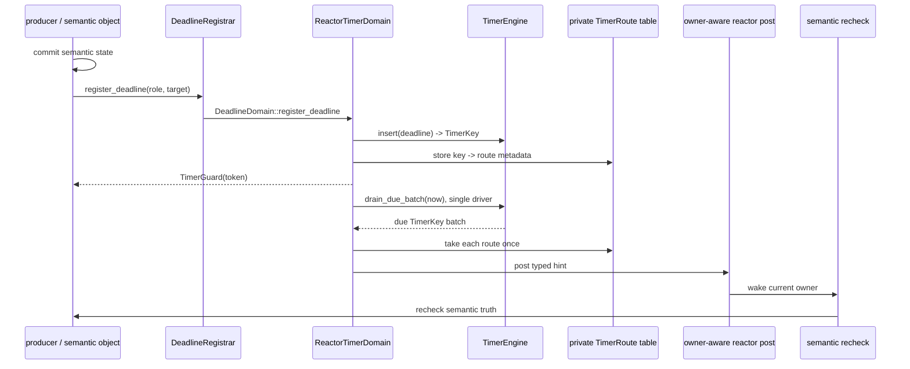

# Tx Timer 子系统设计文档

最后更新：2026-07-14

本文是 Tx time/timer 的实现级边界合同。它描述 Phase 7 完成后的有效拓扑，供
timer 相关 patch、review 与机械 gate 使用。本文不替代
[`TIME_WAKE_v1.md`](../../design/02_execution/TIME_WAKE_v1.md) 的架构锚点；当两者
对旧 registry 的描述冲突时，以 Phase 7 的删除结果和本文件的退役规则为准。

核心结论：

> `tx-time` 提供 time capability、`TimerEngine` 和 typed HAL/RTC adapter；
> `tx-reactor::ReactorTimerDomain` 拥有具体 engine、私有 route table、单 driver
> claim 与 owner-aware 投递；semantic object 保存 Linux 语义、`TimerGuard` 和
> `TimerToken`；substrate 不再拥有 timer registry 或 timer 路由实现。

## 1. 设计完成口径

| 问题 | 本文答案 |
|---|---|
| 时间和 deadline API 在哪里 | `tx-time`；过渡期 `tx-services::time` 仅作兼容 re-export |
| 有序 deadline entry 由谁保存 | `ReactorTimerDomain` 所拥有的 `TimerEngine` |
| 到期后的路由信息由谁保存 | `ReactorTimerDomain` 私有 `TimerRoute` table |
| Linux timer 语义由谁保存 | timerfd、POSIX timer、itimer、wait、RTC 等 semantic object |
| 到期后谁决定运行位置 | reactor/scheduler 的 owner-aware wake 路径 |
| `TimerToken` 的角色 | 可跨层传递的 stale carrier；只能标识和过滤旧事件 |
| `TimerGuardRole` 的角色 | reactor route metadata；不是 semantic object 的状态，也不是公开业务能力 |
| 如何防止退役路径复活 | `time-layering`、`time-wake-retired`、focused witness 和 docs lint |

“设计完整”表示所有新 timer 路径都能归入上述 owner 与接口。“实现完成”还要求
机械 gate 为零、producer witness 覆盖语义闭环，并且没有 legacy dual-fire。

## 2. Phase 7 迁移状态

Phase 7 已删除 substrate timer registry 和 reactor 的 legacy dual-fire 路径。当前
代码不是“新旧两套 timer 并存”的过渡实现：每次 deadline 到期只经
`ReactorTimerDomain` 的单一 drain 和 route 投递路径处理。

| 已删除或退休 | 取代者 | 约束 |
|---|---|---|
| `tx_substrate::wake::timer` 与 substrate `TimerWheel` | `tx_time::timer::TimerEngine` + reactor-owned domain | substrate 只保留通用 deadline carrier，不保存队列或路由 |
| `ReactorDeadlineRegistry` | `ReactorTimerDomain` | domain 同时拥有 engine、route table、driver claim 与 deadline-change 状态 |
| concrete wheel/registrar compatibility bridge | `DeadlineRegistrarHandle -> DeadlineDomain` | producer 只持有 capability 与 guard，不接触 concrete queue |
| script substrate lowerer | typed `DeadlineRegistrar` capability | 不得重新引入跨层 substrate timer lowering |
| reactor legacy dual-fire | `drain_due_for_owner()` 后的单一路由 | 任何 due key 至多被 route table 取走并投递一次 |

### 2.1 当前迁移矩阵

| Lane | 当前 owner | 状态 | 退出条件 |
|---|---|---|---|
| clock-read / realtime | `tx-time` timekeeper 与 typed adapter | capability 化 | 不出现 raw HAL time consumer |
| deadline queue | `TimerEngine` | 已从 substrate 移出 | queue 仅保存 `TimerKey + DeadlineNs`，不保存业务语义或 wake route |
| deadline domain / routing | `ReactorTimerDomain` | 已收拢 | 唯一 due drain、私有 route table、owner-aware post |
| producer state | semantic object | capability 化 | object 保存语义、`TimerGuard`、`TimerToken`，不保存 queue/domain handle |
| HAL / RTC | `tx-time` typed adapter 与 board | 分层 | generic consumer 不直接 import HAL trait |
| retirement lint | `xtask` invariant lints | hard gate | 旧路径为零，新的 engine/domain import 仅在允许 home |

### 2.2 迁移路径



## 3. 总体拓扑



读图规则：

- `TimerEngine` 是 algorithm-private queue，不路由、不读语义状态、不决定 CPU。
- `ReactorTimerDomain` 是唯一 concrete engine owner，也是 key 到 delivery route 的唯一
  owner。它以 single-driver claim 串行化 due drain，并在 route 取走后投递。
- semantic object 先更新 Linux 语义状态，再注册 deadline；收到 wake hint 后重新判定
  expiration、signal eligibility、readiness 或 cancellation。
- scheduler 在 wake 时刻解析 task 当前 owner；注册 hart 不能决定投递 hart。
- HAL 只提供硬件 counter、deadline arm/cancel 和 persistent clock；它不承载 Linux
  timer 语义。

### 3.1 两个闭环



`TimerToken` 可以随 guard、mailbox hint、wait state 或 callback 跨层移动，用于识别
已取消、已 rearm 或已过期的 registration。它不携带 route、CPU owner 或 semantic
result。`TimerGuardRole` 只在 reactor domain 将 `TimerRole` 映射为 route metadata 时
使用；上层 object 不读取它，也不以它表达 Linux 语义。

## 4. 模块边界

| 层 | 拥有 | 不拥有 | 合法依赖 |
|---|---|---|---|
| `tx-shims` | ABI 参数、用户内存、errno、syscall 次序、context injection | timer object 真值、queue、hart placement | `tx-time` capability、semantic operation |
| `tx-time` | public time API、`TimerEngine`、token/guard facade、typed HAL/RTC adapter | Linux timer object 状态、reactor route table、scheduler placement | `tx-substrate` 通用 primitives、HAL/board |
| `tx-subsystems` | timerfd/POSIX timer/itimer/RTC/VFS timestamp 等语义状态 | queue、route table、HAL trait、hart placement | `tx-time` capability、`TimerGuard`、`TimerToken`、`WaitSource` |
| `tx-substrate::wake::deadline` | `TimerToken`、`TimerGuardRole` 等无队列 carrier/metadata | timer queue、registrar、route table、due driver | 通用 substrate primitives |
| `tx-reactor` | `ReactorTimerDomain`、engine instance、private route table、due drain、owner-aware post、IPI、hart reprogram | timerfd expiration、POSIX signal delivery、RTC calendar 语义 | `tx-time` engine/capability、scheduler |
| HAL/boards | counter、deadline interrupt、persistent clock register/IRQ | Linux ABI、semantic object、deadline queue | board-specific implementation |

### 4.1 物理文件边界

```text
crates/tx-time/src/
    deadline.rs       DeadlineRegistrar, DeadlineDomain, TimerGuard, TimerToken
    timer/engine.rs   TimerEngine and private indexed queue mechanics
    platform.rs       typed HAL adapters
    rtc.rs            RtcDeviceOps

crates/tx-reactor/src/
    deadline_registry.rs  ReactorTimerDomain and private TimerRoute table
    runtime.rs            domain drain, owner-aware route and hart arm/cancel

crates/tx-substrate/src/wake/
    deadline.rs       TimerToken and TimerGuardRole only; no timer registry
```

长期依赖禁止项：

```text
tx-shims / tx-subsystems -> tx_substrate::wake::timer
tx-shims / tx-subsystems -> tx_time::timer::TimerEngine
tx-shims / tx-subsystems -> tx_reactor::ReactorTimerDomain
semantic object          -> DeadlineRegistrarHandle field
semantic object          -> TimerGuardRole field or semantic branch
reactor public API       -> concrete engine or route table
any production path      -> legacy dual-fire or script substrate lowerer
```

`tx-services::time` 在迁移期可 re-export `tx-time` 的 capability surface；它不是
concrete queue 或 route owner。新代码应优先从 `tx-time` 的稳定 API 使用能力，而不是
把 compatibility facade 扩展为新的 implementation home。

## 5. Public Interfaces 与所有权

### 5.1 Capability

| 接口 | 消费者 | 责任 | 禁止越界 |
|---|---|---|---|
| `ClockRead` | clock syscall、VFS/procfs timestamp、timeout 换算 | 读 monotonic/realtime | realtime mutation、raw HAL read |
| `RealtimeControl` / `VvarPublisher` | `clock_settime`、boot seed、vDSO | realtime generation、persistent policy、VVAR | timer object 语义、scheduler placement |
| `DeadlineRegistrar` | sleep、futex、poll、timerfd、POSIX timer、delegate、device | 注册/rearm deadline 并返回 `TimerGuard` | 暴露 concrete queue/domain |
| `DeadlineDomain` | 仅 reactor domain | 连接 capability 与 reactor-owned domain | semantic object 持有 domain |
| `RtcDeviceOps` | devfs、boot、RTC IRQ adapter | typed persistent clock/alarm | direct `PersistentClockIf` consumer import |

`DeadlineRegistrar` 的 registration 以 `TimerRole` 和 `TimerTarget` 表达“为什么”和
“向哪里投递”。role 允许 domain 生成内部 route metadata；target 决定 mailbox、signal
hint、wait source、delegate 或 device callback。两者都不让 producer 看见 queue。

### 5.2 TimerEngine 与 ReactorTimerDomain



规则：

1. `TimerEngine` 只接受 deadline 并返回/排出 opaque `TimerKey`。它不保留 target、
   role、mailbox、callback 或 scheduler state。
2. `ReactorTimerDomain` 在同一 registration gate 内插入 engine key 和 route entry；
   cancel/rearm 也先验证 route entry 仍 live。
3. due drain 以 driver claim 保证单一驱动者；route 被 `take` 后不可能再被同一次或
   legacy path 重新投递。
4. `TimerToken` 是跨层 stale carrier。收到 token 的 consumer 必须把它和当前 guard/
   object generation 对比，不能由 token 推导 timer 语义或 placement。
5. `TimerGuardRole` 是 domain 内部 route metadata。它可辅助 reactor 选择正确的
   delivery shape，但不能出现在 semantic object 的长期字段、公开 facade 或 ABI。

### 5.3 Handle、Guard、Token 所有权

| 类型 | 生命周期 | 可以保存 | 不可保存 |
|---|---|---|---|
| capability handle/context | 执行上下文生命周期 | syscall/entry context、reactor wiring、device backend | timerfd/POSIX timer/itimer object |
| `TimerGuard` | 单次 registration 生命周期 | sleep future、wait state、timer object | reactor 作为业务对象状态 |
| `TimerToken` | registration identity / stale filtering | guard、pending hint、wait state、producer object、focused test | route table 的替代品、scheduler owner |
| `TimerGuardRole` | reactor route metadata 生命周期 | `ReactorTimerDomain` 私有 route entry | semantic state、public capability、syscall ABI |
| `TimerEngine` / `TimerKey` | reactor domain 生命周期 | `ReactorTimerDomain` | producer、semantic crate、public reactor facade |

一句话：capability 随上下文走，guard/token 随 registration 走，role 随 reactor route
走，Linux semantic state 随 semantic object 走，运行位置随 scheduler 走。

## 6. Producer 合同

每个 producer 都要说明语义状态、registration、stale 处理和到期后的重新判定。

| Producer | semantic owner | target | 保存字段 | 到期后最终判定 |
|---|---|---|---|---|
| `nanosleep` / `clock_nanosleep` | sleep op/future | `TaskMailbox` | remaining time、guard/token | resume path 计算剩余时间 |
| futex timeout | futex wait state | task abort/mailbox | waiter state、guard/token | wake 与 timeout race 的语义胜者 |
| poll/select/epoll timeout | wait op + readiness subscription | task abort/mailbox | subscription、guard/token | readiness scan 与 timeout state |
| timerfd | `TimerFd` | `WaitSource` | deadline、interval、expiration count、generation、guard/token | `read`/`poll` 重新判定 |
| POSIX timer / `ITIMER_REAL` | timer table/process state | `SignalTarget` hint | sigevent、interval、overrun、guard/token | due scan 与 signal path |
| delegate/device | delegate token/device state | delegate/device callback | payload、guard/token | state machine |
| RTC alarm fallback | RTC state | callback 或 wait-source | alarm、pending bits、guard/token | RTC read/poll/ioctl |

producer 不得有第二套 queue 或 route table。target 不够时扩展 `TimerTarget`；operation
拿不到 capability 时扩展 context injection；取消旧 deadline 时保存 `TimerGuard`；收到
旧 hint 时用 `TimerToken`/generation 过滤，而不是绕过 domain 直接触发语义。

## 7. Lint Policy

Phase 7 后，lint 的目标不是维护旧 allowlist，而是把所有旧实现面和新的 concrete
owner 都压成可机械检查的边界。

| Gate | 必须拒绝 | 允许 home | 通过条件 |
|---|---|---|---|
| `cargo xtask lint invariants time-layering` | raw HAL time consumer、`TimerEngine` 越层 import、semantic object handle field、`TimerGuardRole` 逃出 reactor metadata、concrete domain/public route export | `tx-time` HAL adapter；`tx-reactor` domain/arm adapter | 0 production findings |
| `cargo xtask lint invariants time-wake-retired` | `tx_substrate::wake::timer`、`TimerWheel`、旧 registrar types、script substrate lowerer、legacy dual-fire hooks | 仅 linter fixture 可出现退役名称 | 0 production findings |

具体 policy：

1. `TimerEngine` 只能由 `ReactorTimerDomain` 的 private implementation import 和持有。
   `tx-time` 可以定义 engine 类型，但不得提供 process-wide singleton、registrar 或
   route API。
2. `ReactorTimerDomain` 不得被 semantic crate、shim 或 public reactor API 直接暴露；
   上层只通过 `DeadlineRegistrar`/`DeadlineRegistrarHandle` 注册。
3. `TimerToken` 可跨层使用，但不得被解释成 `TimerRoute`、hart owner 或 Linux result。
4. `TimerGuardRole` 只能作为 reactor route metadata。对上层的 re-export、object field、
   semantic match 均为违规。
5. `TimerWheel`、`tx_substrate::wake::timer`、旧 script lowering 和 dual-fire 不是兼容
   API。它们只能出现在 lint fixture 或明确的历史性负向规则中。
6. 新增合法底层 home 时，必须同时更新 linter fixture、allowlist、本文模块边界与
   focused witness；不得以 broad re-export 绕过 gate。

## 8. Review Checklist

任何 timer/time patch 必须回答：

1. 它使用的是 `ClockRead`、`RealtimeControl`、`DeadlineRegistrar`、`RtcDeviceOps` 中
   的哪一个 capability？
2. semantic object 是否只保存 semantic state、`TimerGuard` 和 `TimerToken`？
3. 是否直接 import `TimerEngine`、`ReactorTimerDomain`、`TimerGuardRole` 或任何退役
   substrate timer 路径？若是，是否确实位于允许的 reactor private home？
4. registration 是否先提交语义状态，再以 role/target 注册，并能由 guard 取消？
5. stale hint 是否由 token/generation 过滤，而不是再次触发 delivery？
6. 到期是否只经过 `ReactorTimerDomain` 的 single-driver drain 与 private route take？
7. wake 是否经 owner-aware scheduler path 选择当前 hart？
8. 更新 realtime 时是否处理 generation、timerfd cancel-on-set/rebase、VVAR 与
   persistent policy？
9. 两个 invariant lint 是否保持 0 finding？
10. 变更是否新增或更新对应 producer focused witness？

## 9. 验收命令

文档修改只需运行最窄 docs gate：

```bash
CARGO_TARGET_DIR=target/codex-time-topology cargo xtask lint docs
```

涉及 timer topology、imports 或 migration 状态的 patch，最小验收集是：

```bash
CARGO_TARGET_DIR=target/codex-time-topology cargo test -p xtask --lib lint_invariants_time -- --nocapture
CARGO_TARGET_DIR=target/codex-time-topology cargo xtask lint invariants time-layering
CARGO_TARGET_DIR=target/codex-time-topology cargo xtask lint invariants time-wake-retired
rg -n 'tx_substrate::wake::timer|TimerWheel|into_substrate_registrar_for_script_bridge' crates xtask
```

最后一条搜索除 linter fixture 的退役名称外不得返回 production source。它用于证明删除
不是仅移除 re-export，而是实际没有遗留可被调用的旧实现路径。

producer 改动还要按范围补充 focused witness：

| 范围 | 最少证明 |
|---|---|
| queue/domain | cancel、rearm、due drain、stale key suppression、单 driver claim |
| timerfd | expiration count、periodic rearm、cancel-on-set、realtime rebase |
| POSIX timer / itimer | signal hint、due scan、delivery、overrun、interval rearm |
| sleep/futex/poll | timeout 与正常 wake/readiness 的竞态结果 |
| SMP wake | task steal 后投递到当前 owner hart，remote reschedule 正确 |
| RTC | typed read/set/alarm/ack，unsupported 或 emulated fallback 的 pending event |

不要用 broad boot success 代替这些证据；它不能证明 token stale suppression、单次
delivery 或语义 recheck。

## 10. 验收标准

设计完整的条件：

1. 新需求可以归入 `tx-time` capability、`ReactorTimerDomain` route 或 semantic
   producer row，且 owner 明确。
2. queue algorithm、route metadata、Linux semantic state、hardware capability 和
   scheduler placement 的 ownership 不重叠。
3. `TimerToken` 被明确限制为跨层 stale carrier，`TimerGuardRole` 被明确限制为
   reactor route metadata。
4. 旧 substrate wheel、script lowerer 与 legacy dual-fire 被视为退役名称，不被描述为
   当前实现或兼容接口。
5. 每条禁止依赖都有相应 lint 或 focused review rule。

实现完成的条件：

1. `time-layering` 为 0 production findings。
2. `time-wake-retired` 为 0 production findings。
3. 生产源码中不存在 `tx_substrate::wake::timer`、`TimerWheel` 或
   `into_substrate_registrar_for_script_bridge` 的可调用遗留路径。
4. 每个 due registration 仅从 `ReactorTimerDomain` 单次 drain 后路由，不存在
   legacy dual-fire。
5. timerfd、POSIX timer、`ITIMER_REAL`、sleep、futex、poll/select/epoll、RTC alarm
   和 SMP owner wake 都有 focused semantic witness。
6. `RtcDeviceOps` 仍是 devfs/boot/IRQ 的唯一 typed RTC boundary，generic layer 不读写
   board register。

在这些条件满足后，正确表述是：**Timer queue 已由 `TimerEngine` 实现，deadline
domain 和路由由 `ReactorTimerDomain` 实现；substrate TimerWheel 与 legacy dual-fire
均已删除并被 lint 禁止复活。**
