# Tx Time, RTC, Timer, And Wake Routing Design

Last edited: 2026-07-09

This document is the stage-2 design target for txKernel time infrastructure. It
uses Linux as the reference model, but it describes Tx's own architecture: static
HAL capability traits, a semantic timekeeper facade, a shared software timer
registry, reactor-owned timer driving, scheduler-aware wake routing, and a typed
RTC/device route.

The companion Linux reference is [`README.md`](README.md). The active in-tree
contract is [`../../design/02_execution/TIME_WAKE_v1.md`](../../design/02_execution/TIME_WAKE_v1.md).
The Chinese complete-design entry is
[`TX_TIME_WAKE_DESIGN_CN.md`](TX_TIME_WAKE_DESIGN_CN.md).

## Design Specification

This file is the complete reader-facing design specification for the Tx
time/wake refactor. It is intentionally more explicit than a normal progress
note: a future implementer should be able to choose the correct owner, add the
right interface, retire the wrong interface, and select the right proof gate
from this document alone.

| Field | Specification |
|---|---|
| Design area | time reads, realtime, timers, wait deadlines, wake routing, RTC, devfs device projection, and SMP wake correctness |
| Architecture status | complete v1 target |
| Implementation status | partial; package and producer rows name the remaining proof obligations |
| Normative contract | `../../design/02_execution/TIME_WAKE_v1.md` is the txdoc-tagged contract; this file is the complete explanatory handoff |
| Linux reference | `README.md` in this directory is the Linux gold-standard map |
| Primary correctness rule | semantic state, deadline storage, hardware access, and runnable placement must stay in separate owners |
| Main retirement rule | old broad or direct interfaces may be mentioned in docs as retired history, but must not remain active Rust production paths after their slice exits |

The v1 design is considered complete only if every feature request in this
area can be placed into one of the owner rows below:

| Feature family | Design owner |
|---|---|
| hardware monotonic counter | `MonotonicCounterIf` board backend |
| current-hart deadline interrupt | `DeadlineTimerIf` board backend plus reactor timer driver |
| persistent wall clock and alarm hardware | `PersistentClockIf` board backend |
| `CLOCK_*`, vvar, realtime generation, VFS timestamps | `TimekeeperIf` |
| sleeps, timeout guards, timerfd deadlines, delegate/device timers | `TimerRegistrar` / `TimerRegistry` |
| readiness of pipe, futex, eventfd, socket, IPC, RTC, AIO, io_uring, VFS/RNode | owning semantic object plus `WaitSource` / `RawQueue` |
| conversion from wake hint to runnable task | `ReactorOwnerWakePost` plus scheduler placement |
| `/dev/rtc` and other character-device ABI behavior | typed device ops projected by devfs/RNode |

The review posture is therefore strict. A missing feature should extend the
appropriate owner row or add a narrowly justified extension slot. It should not
reintroduce a broad `TimeIf`, a private timeout queue, direct HAL-to-devfs
construction, syscall-local RTC semantics, or per-subsystem scheduler hooks.

## Design Delivery Scope

This document is the complete stage-2 design handoff for Tx time and wake
infrastructure. "Complete" has a precise meaning here: every known feature in
the time, RTC, timer, wait-source, device-readiness, and SMP wake space has a
named owner, a legal lower interface, a legal upper interface, a migration
package, and an acceptance proof. It does not mean every implementation row has
already landed.

The document therefore answers four review questions before a patch touches
code:

| Review question | Where this document answers it |
|---|---|
| Which layer owns this state? | sections 2.3, 4, 15, 23, and Appendix A |
| Which adjacent layers may it call? | sections 2.4, 5-13, 23, and 27.2 |
| How does the Linux reference shape map to Tx? | section 3 plus the companion Linux reference |
| What proves the slice is done? | sections 16-17, 23.2-23.5, 25.4, 26.7, and 27.5 |

The design intentionally separates three completion states:

- **architecture complete**: the feature can be placed into this document
  without inventing a new layer;
- **slice complete**: a specific producer or module family has migrated and
  retired its old active route;
- **implementation complete**: all package exits and producer rows have
  mechanical proof.

Readers should not use implementation-open rows as permission to add broad
compatibility interfaces. The target boundaries are already closed: no broad
`TimeIf`, no private reactor timer queue, no HAL-owned RNode path, and no
per-subsystem scheduler shortcut should be introduced to finish a missing
feature.

## Document Map

This document is meant to be read in three passes.

| Pass | Sections | Reader goal |
|---|---|---|
| architecture pass | 1-4 | understand the responsibility split: clock meaning, deadline mechanics, device semantics, and runnable placement |
| module pass | 5-15 | learn each sub-architecture, its state owner, lower interface, upper interface, and forbidden dependencies |
| implementation pass | 16-26 | apply the migration packages, producer catalog, proof gates, debugging boundaries, and handoff rules to concrete patches |

### Complete Contents

This table is the stable top-level index for the full design. It deliberately
keeps motivation, module contracts, implementation packages, and acceptance
criteria in one file so future readers do not have to reconstruct the design
from progress notes.

| Section | Role |
|---|---|
| Design Specification | states the review authority, completion meaning, owner rows, and hard retirement posture |
| Design Delivery Scope | separates architecture-complete, slice-complete, and implementation-complete states |
| 1. Problem Statement | explains why clock reads, deadline mechanics, wake hints, runnable placement, and RTC device semantics must be separated |
| 2. Target Architecture | gives the global architecture graph, design thesis, module blueprint, and five control planes |
| 3. Linux Reference Mapping | maps Linux clocksource, clockevents, timekeeping, hrtimer, RTC, vDSO, VFS timestamping, and scheduler wake groups to Tx homes |
| 4. Ownership Matrix | states the state owner and forbidden responsibilities for every major layer |
| 5. Hardware Capability Layer | specifies counter, deadline, and persistent-clock HAL traits plus board modeling profiles |
| 6. Core Timekeeper | specifies monotonic/realtime derivation, realtime generation, vvar publication, boot seed, and runtime mutation |
| 7. Software Timer Registry | specifies producer-facing registration, reactor-facing due walk, token/guard lifetime, and fire/cancel races |
| 8. Reactor Timer Driver | specifies per-hart timer driving, hardware deadline reprogramming, and reactor-facing interfaces |
| 9. Wait Sources And Wake Router | specifies `WaitSource`/`RawQueue` publication and owner-aware mailbox posting |
| 10. Future, StepOp, And Timeout Integration | specifies how sleeps, protocol timeouts, and drivers hold guards without owning private timer wheels |
| 11. RTC And Device Route | specifies `RtcDeviceOps`, pending event state, read/poll/ioctl routing, and HAL/RTC separation |
| 12. VFS, Devfs, And RNode Boundary | specifies why device operations sit between HAL and RNode/devfs projection |
| 13. SMP And Future Stealing | specifies stable mailbox identity, current-owner re-resolution, remote IPI routing, and post-steal wake correctness |
| 14. Clock And ABI Coverage | lists initial clock classes and ABI paths covered by v1 |
| 15. Data Structures | summarizes timekeeper, timer registry, mailbox/wake state, RTC device, and interface contracts |
| 16. Implementation Plan | defines Packages A-H and their landing order |
| 17. Validation Plan | lists host, QEMU, and retirement evidence required by the design |
| 18. Deferred Features | records Linux parity work intentionally outside v1 |
| 19. Design Decisions | records the closed v1 choices that should not be reopened by routine patches |
| 20. Current Implementation Status | states what has landed and what remains open as of the last edit |
| 21. Review Checklist | gives immediate review tests for future patches |
| 22. Failure Boundaries | maps symptoms to the architectural boundary most likely violated |
| 23. Concrete Landing Map | gives legal dependency edges, package exit evidence, the wake-producer catalog, and per-slice recipe |
| 24. Completeness Boundary | separates feature gaps from architectural gaps |
| 25. Maintainer Handoff | gives the next-slice selection, patch shape, verification ladder, and completion rule |
| 26. Remaining Producer Detailed Design | gives detailed target interfaces, audits, and proof gates for remaining Package G producers |
| 27. Final Design Contract | condenses the complete architecture into non-negotiable boundaries, review algorithm, and final acceptance bar |
| Appendix A. Interface Dictionary And Code Ownership Map | maps the design to live interface names, code homes, legal callers, and proof gates |

### Current State Snapshot

The design state and implementation state are intentionally different:

| State | Meaning on 2026-07-09 |
|---|---|
| architecture complete | this document and `TIME_WAKE_v1.md` can classify known time, RTC, timer, wait-source, and wake-routing features without adding a new layer |
| implementation partially complete | HAL split, timekeeper facade, raw public wall-clock wrapper retirement, unified timer registry, reactor timer route, RTC device route, and the named Package G wake-producer direct-interface retirement rows have landed |
| implementation still open | real-board or firmware-backed RTC witnesses beyond QEMU/no-RTC profiles; RV64 QEMU owner-wake mixed-producer SMP is now covered by `smoke` and `busybox-boot` marker gates, while LA64 or real-board SMP stress remains extension evidence |

The current acceptance rule is therefore: use this document as the complete
design target, but do not call the implementation complete until every row in
sections 23.2 and 26.7 has mechanical proof and the retired-interface audits
are green.

The core design can be summarized as one sentence: time values are produced by
the timekeeper, deadlines are stored by the timer registry, readiness is owned
by semantic objects, and runnable placement is resolved by the reactor/scheduler
owner-aware wake path at the moment of wake.

When changing code, start from the most specific row that owns the state being
mutated:

| If the patch changes... | Start at |
|---|---|
| a board counter, local timer, or RTC register path | section 5, then package A/H |
| `CLOCK_*`, vvar, stat timestamps, or realtime mutation | section 6, then package B/F |
| sleep, poll, futex, timerfd, delegate, or device deadlines | section 7-10, then package C/D/F |
| pipe/futex/eventfd/signalfd/VFS/TTY/socket/device readiness wakes | section 9 and section 23.3-23.4, then package G |
| `/dev/rtc`, devfs, char-device, or RNode projection | section 11-12, then package E |
| SMP wake, remote IPI, or future stealing behavior | section 13, section 23.5, then package D/G |

This map is part of the design. If a new feature does not fit any row, the
design should be extended before implementation.

## 1. Problem Statement

Linux-compatible time behavior is not one subsystem. A working kernel must
answer several independent questions:

| Question | Example user-visible feature | Wrong simplification |
|---|---|---|
| What time is it? | `clock_gettime`, VFS timestamps, vDSO | reading RTC on every realtime call |
| When should the CPU interrupt? | high-resolution sleep, scheduler tick | storing task policy in the hardware timer |
| Which waiter should be told? | `nanosleep`, `timerfd`, futex/poll timeout | making timerfd semantics live inside the timer wheel |
| Which hart should run the task? | SMP wake after task migration or steal | remembering the hart that armed the timer |
| What persistent calendar device exists? | `/dev/rtc`, wake alarm, boot realtime seed | treating RTC as `CLOCK_REALTIME` itself |

Tx must preserve these splits because its runtime is stackless and SMP-aware. A
task can arm a timer on one hart, park, be stolen or migrated, and later be
woken by another producer. Timer expiry therefore cannot mean "run this task on
the hart that inserted the entry." It means "publish a wake event to the task's
mailbox and let the scheduler resolve the current owner."

The target architecture has three principles:

1. **Hardware layers expose facts, not policy.** HAL exposes monotonic counter,
   deadline timer, and persistent clock capabilities. It does not own realtime
   offset, timerfd state, RNode state, or scheduler placement.
2. **Semantic layers own user-visible meaning.** Timekeeper owns clock
   semantics; timerfd owns expiration counts; RTC device ops own `/dev/rtc`
   behavior; VFS owns timestamp policy.
3. **The reactor owns wake routing, not semantic truth.** A timer or wait-source
   event is a hint. The woken future re-observes the semantic condition before
   committing a syscall result.

### 1.1 Scope, Requirements, And Non-Goals

This document covers the complete first-stage Tx time/wake architecture:

- hardware counter, deadline timer, and persistent-clock capability split;
- core semantic clock state for monotonic and realtime reads;
- vvar/vDSO publication shape;
- software timer registration and cancellation;
- reactor timer driving and hardware deadline reprogramming;
- wait-source, timer, delegate, signal, and device wake routing;
- RTC device exposure through devfs/RNode without a HAL-to-VFS dependency;
- SMP correctness when a task is stolen or migrated after arming a wait.
- producer-by-producer wake convergence for timer, delegate, signal,
  wait-source, device, and syscall-context events.

The required v1 behavior is:

| Requirement | Design owner | Required property |
|---|---|---|
| fast monotonic reads | `MonotonicCounterIf` + `TimekeeperIf` | readers do not touch RTC or scheduler state |
| coherent realtime | `TimekeeperIf` | realtime is monotonic plus offset, with generation on jumps |
| persistent clock seed | `PersistentClockIf` + boot/timekeeper policy | RTC can seed or persist wall time without becoming the hot read path |
| software timeouts | `TimerRegistrar` / `TimerRegistry` | all producers use one role-tagged deadline surface |
| deadline interrupt | reactor timer driver + `DeadlineTimerIf` | only reactor code programs the per-hart hardware deadline |
| wake placement | `ReactorOwnerWakePost` + scheduler | expiry/readiness re-resolves current owner and sends remote IPI if needed |
| RTC ABI | `RtcDeviceOps` + devfs char dispatch | ioctl/read/poll/epoll are typed device operations, not syscall-local stubs |
| VFS timestamps | VFS/filesystem policy over `TimekeeperIf` | stat timestamps share the same wall-clock source as realtime reads |

The explicit non-goals for this stage are Linux's full time-discipline and
power-management surface: NTP frequency discipline, leap seconds, time
namespaces, complete suspend/resume accounting, dynamic clocksource rating,
hot-plug RTC discovery, full RTC ioctl parity, and POSIX CPU timers. The
architecture reserves slots for them, but v1 should not block on them.

The completeness bar is architectural, not feature-total Linux parity. A board
may return typed unsupported errors for RTC, an ABI family may initially lack
periodic RTC interrupts, and CPU timers may remain deferred. Those are feature
gaps behind named extension points. Reintroducing a broad `TimeIf`, a private
reactor timeout engine, direct HAL-to-RNode construction, or per-producer
scheduler hooks would be an architecture regression.

## 2. Target Architecture

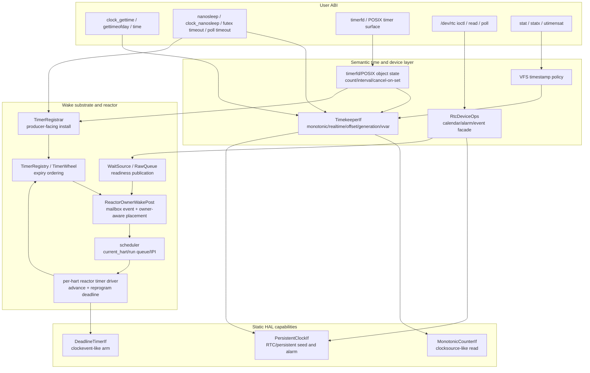

The main data path is intentionally not a single `time` object:

- `MonotonicCounterIf` is the read side of hardware time.
- `DeadlineTimerIf` is the interrupt-programming side.
- `PersistentClockIf` is the optional RTC/persistent-calendar side.
- `TimekeeperIf` turns hardware monotonic time into semantic clocks.
- `TimerRegistrar` lets producers register deadlines without depending on the
  reactor.
- `TimerRegistry` lets the reactor drive expiry without knowing timerfd/futex
  policy.
- `ReactorOwnerWakePost` converts an event into current-owner scheduler
  placement.
- `RtcDeviceOps` exposes device semantics above HAL and below devfs.

### 2.1 Relationship To The Active Contract

This stage-2 document is the reader-facing design narrative. The enforceable
in-tree contract is
[`TIME_WAKE_v1.md`](../../design/02_execution/TIME_WAKE_v1.md). When the two
documents differ, `TIME_WAKE_v1.md` wins for implementation review. The intended
division is:

| Document | Role |
|---|---|
| [`README.md`](README.md) | Linux reference map and source-reading guide |
| this document | complete Tx design explanation and module walkthrough |
| [`TIME_WAKE_v1.md`](../../design/02_execution/TIME_WAKE_v1.md) | active txdoc-tagged architecture contract and migration checklist |

The implementation should cite the active contract for review gates, but this
document should remain complete enough for a contributor to understand why the
layers exist before reading code.

### 2.2 Design Thesis

The target organization exists because the time stack has three independent
axes that only meet at narrow boundaries:

1. **Clock meaning.** `CLOCK_REALTIME`, `CLOCK_MONOTONIC`, VFS timestamps, and
   vvar snapshots are semantic values. They are owned by the timekeeper and
   derived from monotonic hardware plus policy state.
2. **Deadline mechanics.** Hardware deadline programming and software timer
   ordering are mechanism. They exist to produce future wake events, not to
   decide what an object means or which CPU owns a task.
3. **Runnable placement.** After a wake event, scheduler state decides the
   current owner hart and IPI target. This decision must be made at wake time
   because futures can be stolen or migrated after registration.

Linux has more concrete layers because it supports dynamic clocksource rating,
clockevent broadcast, CPU hotplug, tickless idle, suspend accounting, time
namespaces, and multiple RTC class devices. Tx does not need all of that in v1,
but it does need the same responsibility split. The smaller Tx interface set is
therefore not "one time interface with fewer methods"; it is three narrow
hardware traits plus semantic and wake-routing layers above them.

### 2.3 Complete Module Blueprint

The global graph above is intentionally high level. The implementation should
be reviewed module by module against the following blueprint. Each module owns
one kind of state, has one lower interface, one upper interface, and a clear
set of adjacent modules it may touch.

| Module | Owned state | Lower interface | Upper interface | Adjacent modules | Must not do |
|---|---|---|---|---|---|
| board counter backend | raw counter read path, frequency conversion, board-local stability assumptions | CSR/MMIO/SBI/firmware counter read | `MonotonicCounterIf` | boot, timekeeper, reactor observation | store realtime offset, program deadline interrupts, know tasks |
| board deadline backend | per-hart deadline programming and timer interrupt enablement | CSR/MMIO/SBI timer programming, IRQ controller | `DeadlineTimerIf` | trap/IRQ, reactor timer driver | store software timer lists, route task wakeups |
| board persistent-clock backend | RTC register layout, firmware persistent-clock calls, alarm ack mechanics | RTC MMIO/firmware, optional IRQ ack | `PersistentClockIf`, optional RTC IRQ metadata | timekeeper seed/writeback, RTC device ops, kernel IRQ | define `CLOCK_REALTIME`, allocate RNodes, inspect fd flags |
| timekeeper | monotonic/realtime derivation, realtime offset, generation, vvar snapshot, seed provenance | `MonotonicCounterIf`, optional `PersistentClockIf` seed/writeback | `TimekeeperIf` | clock syscalls, VFS timestamps, timerfd, vDSO | arm hardware deadlines, own timerfd counts, handle `/dev/rtc` file semantics |
| timer registry | deadline entries, timer tokens, guard cancellation state, next-deadline index | task mailbox weak refs, monotonic deadline values | `TimerRegistrar`, `TimerRegistry` | active wait, timerfd, delegate, RTC emulation, reactor | choose CPU/hart placement, store timerfd interval semantics |
| active-wait adapter | future-local wait guard set, timeout guard, resume token, wait generation | `TimerRegistrar`, `WaitSource`, `TaskMailbox` | reactor future poll/resume outcome | StepOp drivers, syscall scripts, delegate driver | build private timer wheels, commit semantic results from a wake hint |
| wait-source substrate | subscriber list, readiness mask, generation, mailbox weak refs | semantic object state changes | `WaitSource`/`RawQueue` publication | pipe, futex, TTY, RTC, net, process wait, reactor | decide run queue placement, treat readiness as operation completion |
| reactor timer driver | per-hart timer step, due walk invocation, hardware deadline action | `MonotonicCounterIf`, `DeadlineTimerIf`, `TimerRegistry` | scheduler-visible wake routing and idle deadline action | trap/IRQ, scheduler, timer registry | interpret timerfd/futex semantics, mutate realtime offset |
| owner-aware wake router | common event-to-mailbox post path, task owner resolution, remote IPI request | mailbox owner binding, scheduler owner/current-hart state | `ReactorOwnerWakePost` and reactor wrappers | timer, wait-source, delegate, signal, device events | own event payload truth, remember stale registration hart |
| scheduler | task lifecycle, current owner hart, run queues, stealing/migration, IPI sequencing | task table, per-hart queues, interrupt controller signal | runnable placement API | reactor wake router, userspace preempt path | parse timer roles, inspect RTC/fd state |
| RTC device ops | Linux-shaped RTC calendar/alarm/event state, pending mask, fd blocking policy | `PersistentClockIf`, optional emulated timer, RTC IRQ publication | `RtcDeviceOps` via `CharDeviceOps` | devfs, VFS, poll/epoll, reactor wait-source route | become the realtime clock, construct HAL objects, create RNodes directly |
| devfs/RNode projection | device path identity, fd dispatch, permission/path integration | typed device operation object | VFS file operations | RTC device, TTY, block devices, mount/VFS | call board MMIO/RTC code, special-case device by string name |

This table is stricter than the current file layout. A file may temporarily
contain more than one role during migration, but a function should still be
classifiable into one row. If a new helper crosses two rows, split it before it
becomes a public interface.

### 2.4 End-To-End Control Planes

The architecture has five control planes. They share some objects, but they
must not collapse into one call path.

| Plane | Starts at | Ends at | Main state crossed | Correctness rule |
|---|---|---|---|---|
| read-time plane | clock syscall, vDSO, VFS timestamp | `TimekeeperIf` return value | monotonic counter, realtime offset, vvar generation | no RTC hot read and no scheduler dependency |
| timeout-registration plane | StepOp driver, timerfd, delegate, RTC emulation | `TimerGuard` / token | converted deadline, mailbox weak ref, role | deadline entries target task mailbox identity, not hart identity |
| expiry-driving plane | timer interrupt or reactor tick | hardware deadline reprogrammed | due entries, wake router, next deadline | only the reactor turns registry state into hardware deadline action |
| wake-placement plane | timer/wait/delegate/signal/device event | task visible on run queue or already runnable | mailbox event, task owner, scheduler lifecycle | resolve current owner at wake time and re-check under queue lock |
| RTC-device plane | `/dev/rtc` fd operation or RTC IRQ | RTC state update or fd result | persistent clock, RTC pending mask, wait source | device state mediates between HAL and VFS; HAL never owns RNode state |

The planes deliberately meet at narrow interfaces:

- read-time and timeout-registration meet at `TimekeeperIf` deadline
  conversion;
- timeout-registration and expiry-driving meet at `TimerRegistry`;
- expiry-driving and wake-placement meet at `TimerWakeRouter`;
- RTC-device and wake-placement meet at the RTC wait source;
- devfs and RTC-device meet at `RtcDeviceOps`.

These intersections are the allowed abstraction boundaries. A shortcut across
them is usually a bug: for example, a syscall that programs `DeadlineTimerIf`
directly bypasses registration and cancellation; an RTC IRQ that wakes a task
directly bypasses device pending state and poll semantics; a timer entry that
stores a hart id bypasses scheduler owner resolution.

## 3. Linux Reference Mapping

Tx should match the Linux responsibility split, not Linux's exact data
structures.

| Linux group | Linux responsibility | Tx home |
|---|---|---|
| `clocksource` | read a stable monotonic counter and provide conversion metadata | `MonotonicCounterIf` plus board-local conversion |
| `clockevents` | program one-shot or periodic timer interrupts | `DeadlineTimerIf` |
| `timekeeping.c` | maintain realtime, monotonic, raw, boottime, vDSO data, sequence state | `TimekeeperIf` over `wall_clock` |
| `hrtimer` | precise deadline-ordered timer expiry | `TimerRegistry` / `TimerWheel` |
| timer wheel | scalable lower-precision kernel timeouts | same registrar facade; concrete data structure internal |
| RTC class | expose persistent calendar devices and alarms | `PersistentClockIf` plus `RtcDeviceOps` |
| `alarmtimer` | combine suspend-aware clock bases with wake-capable RTC | future extension over `PersistentClockIf` and timer registry |
| scheduler wakeup | choose runnable placement and IPI target | reactor wake router plus scheduler |
| vDSO/vvar | publish fast userspace clock snapshots | timekeeper-owned vvar snapshot |
| VFS timestamping | stamp inode time using coherent wall time | VFS over `TimekeeperIf` |

Linux's key lesson is that realtime is timekeeper state, not the RTC chip.
RTC can seed or persist wall time, but normal `CLOCK_REALTIME` reads come from
the timekeeper's monotonic-plus-offset state.

## 4. Ownership Matrix

| Layer | Owns | Does not own | Public surface |
|---|---|---|---|
| board HAL | raw counter registers, timer registers, RTC MMIO/SBI/firmware mechanics | tasks, timerfd, VFS, realtime policy | `MonotonicCounterIf`, `DeadlineTimerIf`, `PersistentClockIf` |
| timekeeper | clock identities, realtime offset, generation, vvar publication | hardware interrupt programming, RTC device fd state | `TimekeeperIf` |
| timer registry | monotonic deadline entries, tokens, cancellation guards | syscall object semantics, scheduler placement | `TimerRegistrar`, `TimerRegistry` |
| wait substrate | wait-source subscription and pending bits | semantic truth, CPU choice | `WaitSource`, `RawQueue`, mailbox events |
| reactor | parking, polling, timer driving, owner-aware wake posting | file/device semantics, realtime offset | `ActiveWait`, `ReactorOwnerWakePost` |
| scheduler | current owner, run queues, work stealing, IPI decisions | event payload meaning, timer ordering | scheduler placement API |
| RTC device layer | `/dev/rtc` calendar/alarm/read/poll/ioctl policy | `CLOCK_REALTIME` hot path, raw MMIO layout | `RtcDeviceOps` |
| devfs/VFS | RNode projection, fd dispatch, permission and path surface | HAL access, scheduler route | `CharDeviceOps`/RNode binding |

Review rule: add a new method to the first layer whose "Owns" column describes
the state being mutated.

## 5. Hardware Capability Layer

### 5.1 Responsibility

The hardware layer answers three questions:

1. Can the platform read a monotonic counter?
2. Can the platform arm the current hart for a monotonic deadline interrupt?
3. Can the platform read/write a persistent realtime source or wake alarm?

These are separate even when one physical block provides multiple functions.
Some RISC-V systems expose the counter and deadline through SBI/CLINT-like
facilities. LoongArch/2K systems may use architectural counters plus local timer
CSRs. RTC may be MMIO, firmware-backed, or absent. The generic kernel should not
care.

### 5.2 Interfaces

```rust
pub trait MonotonicCounterIf {
    fn read_ns() -> u64;
    fn frequency_hz() -> u64;
}

pub trait DeadlineTimerIf {
    fn set_deadline_ns(deadline_ns: u64);
    fn cancel_deadline();
    fn enable_timer_wakeups() {}
}

pub trait PersistentClockIf {
    fn read_realtime_ns() -> Result<u64, PersistentClockError>;
    fn set_realtime_ns(ns: u64) -> Result<(), PersistentClockError>;
    fn set_wake_alarm_ns(ns: u64) -> Result<(), PersistentClockError>;
    fn clear_wake_alarm() -> Result<(), PersistentClockError>;
    fn ack_alarm_irq() -> Result<(), PersistentClockError>;
}
```

`MonotonicCounterIf` and `DeadlineTimerIf` are mandatory for a production board.
`PersistentClockIf` is optional and fallible.

### 5.3 Sub-Architecture

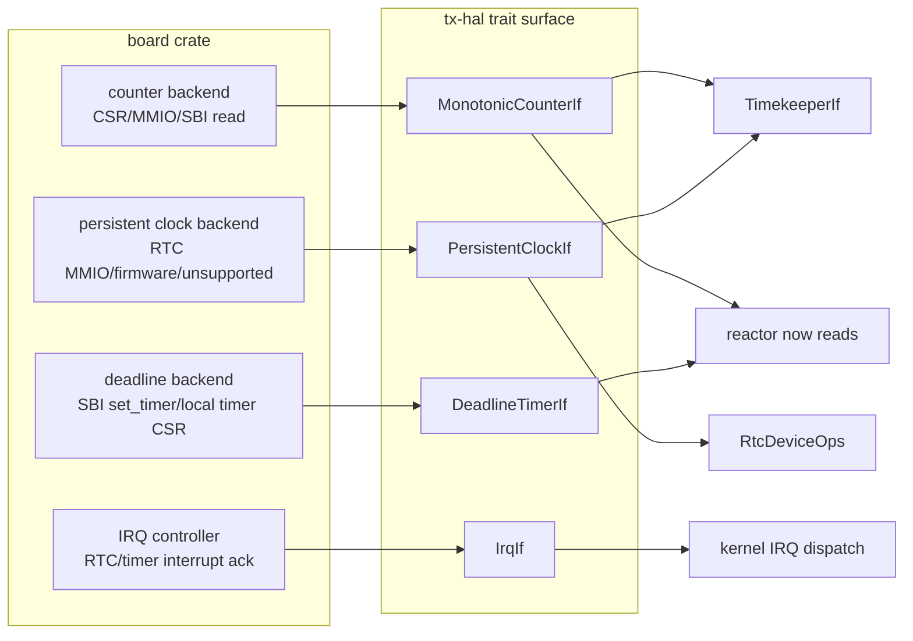

### 5.4 Upper And Lower Interfaces

Lower inputs:

- firmware handoff, DTB/ACPI-like device facts, board constants;
- CSR/MMIO/SBI register access;
- interrupt controller registration and acknowledgement;
- board-local conversion from raw ticks or calendar fields to nanoseconds.

Upper outputs:

- `read_ns()` returns monotonic nanoseconds;
- `set_deadline_ns()` arms current-hart interrupt delivery;
- persistent clock operations return typed capability errors;
- optional RTC IRQ number and `ack_alarm_irq()` allow kernel IRQ handlers to
  publish RTC events without VFS lookup.

Adjacent modules:

- `HAL_v1` defines static platform selection and forbids runtime HAL manager
  objects.
- `DEVICE.md` owns tier-2 device construction; HAL only reports hardware facts.
- reactor consumes deadline programming; timekeeper consumes counter/persistent
  seed; RTC device ops consume persistent clock methods.

### 5.5 Board Modeling Profiles

Tx should model board time hardware as three capability classes even when a
single physical block happens to implement more than one class. This keeps the
upper design stable across SiFive-style RISC-V platforms, LoongArch/2K-style
platforms, and QEMU profiles.

| Platform family | Monotonic counter | Deadline timer | Persistent clock / RTC | Modeling rule |
|---|---|---|---|---|
| SiFive/RISC-V-like | architectural `time` CSR, CLINT `mtime`, SBI time, or platform counter | SBI `set_timer`, CLINT `mtimecmp`, or local timer path | optional board RTC, firmware clock, or unsupported | implement counter and deadline independently; RTC absence is a typed `PersistentClockIf` error |
| LoongArch/2K-like | architectural stable counter or SOC counter block | local timer CSR / interrupt controller timer route | LS7A/board RTC or firmware clock when present | calendar register conversion stays in board backend; upper layers see nanoseconds/errors only |
| QEMU virt profiles | emulated architectural counter | emulated platform timer | goldfish/LS7A RTC when present | use QEMU backends as deterministic witnesses, not as a reason to bake QEMU names into shims |
| no-RTC embedded profile | stable counter | current-hart timer | unsupported | boot realtime uses fallback epoch; `/dev/rtc` reports typed unsupported device results |

The top interface should therefore not be named after a concrete peripheral
such as "CLINT", "goldfish RTC", or "LS7A RTC". Board code may have those
drivers internally, but the cross-board contract remains:

```text
counter backend       -> MonotonicCounterIf
deadline backend      -> DeadlineTimerIf
persistent RTC/clock  -> PersistentClockIf
optional RTC IRQ fact -> IrqIf::RTC_IRQ + PersistentClockIf::ack_alarm_irq
```

This split is also what makes later real-board bring-up incremental. A board
can land monotonic/deadline support first and return persistent-clock
unsupported errors until a real RTC backend is available. Timekeeper, timer
registry, reactor, and VFS timestamp behavior do not change when the RTC
backend appears.

## 6. Core Timekeeper

### 6.1 Responsibility

The timekeeper is Tx's semantic clock owner. It provides:

- `CLOCK_MONOTONIC` from the platform monotonic counter;
- `CLOCK_REALTIME` as monotonic time plus an offset;
- a realtime generation counter for discontinuous wall-clock changes;
- vvar/vDSO publication data;
- conversion from realtime absolute deadlines to monotonic deadlines;
- boot seeding from persistent clock when available;
- optional best-effort persistent writeback after system realtime mutation.

It does not arm hardware timers and does not expose `/dev/rtc` file semantics.

### 6.2 State Model

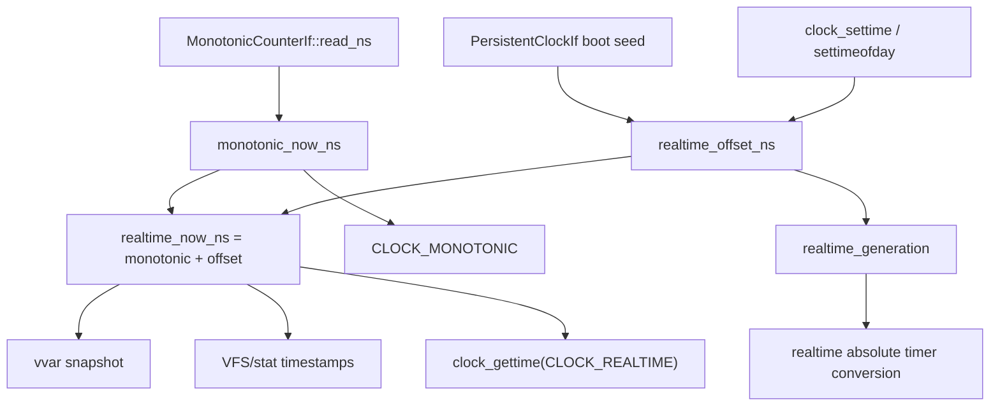

Durable state:

| State | Purpose |
|---|---|
| `realtime_offset_ns` | signed offset from monotonic epoch to Unix realtime |
| `realtime_generation` | increments on wall-clock step/mutation |
| `vvar snapshot` | read-mostly publication for fast userspace clock reads |
| seed provenance | observation/debug state: RTC, firmware, fallback |

### 6.3 Interfaces

```rust
pub trait TimekeeperIf {
    fn monotonic_now_ns<P: MonotonicCounterIf>(&self) -> u64;
    fn realtime_now_ns<P: MonotonicCounterIf>(&self) -> u64;
    fn set_realtime_ns<P: MonotonicCounterIf>(
        &self,
        realtime_ns: u64,
    ) -> Result<u64, WallClockError>;
    fn seed_realtime_from_persistent<P>(&self) -> Result<u64, RealtimeSeedError>
    where
        P: MonotonicCounterIf + PersistentClockIf;
    fn realtime_generation(&self) -> u64;
    fn monotonic_deadline_from_realtime_ns<P: MonotonicCounterIf>(
        &self,
        realtime_ns: u64,
    ) -> DeadlineConversion;
    fn snapshot_for_vvar<P: MonotonicCounterIf>(&self) -> VvarSnapshot;
    fn publish_vvar<P: MonotonicCounterIf>(&self);
}
```

`DeadlineConversion` should carry the converted monotonic deadline and the
generation used for conversion. Timerfd, `clock_nanosleep`, and alarmtimer-like
objects decide whether a realtime jump means rebase, expire, cancel, or retry.

### 6.4 Boot Seed Flow

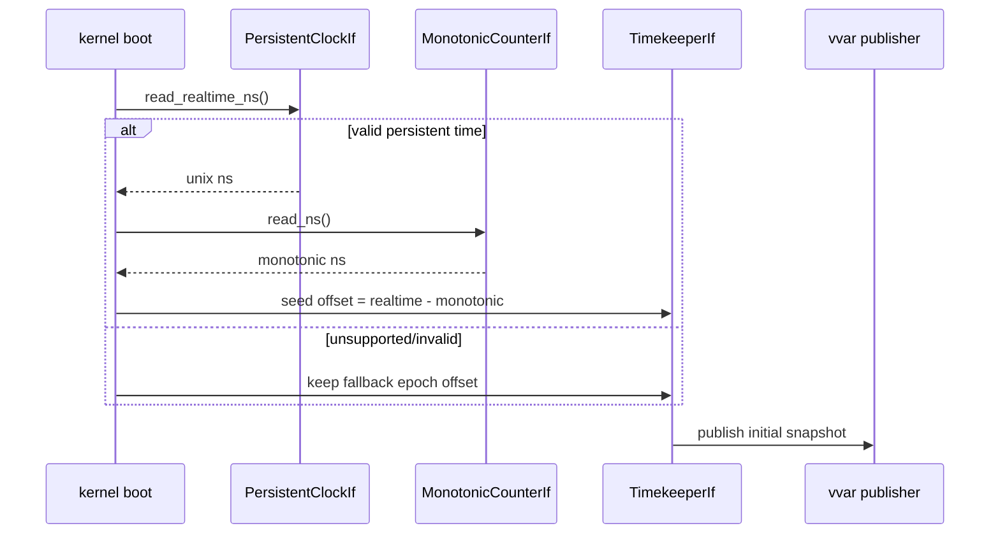

### 6.5 Runtime Mutation Flow

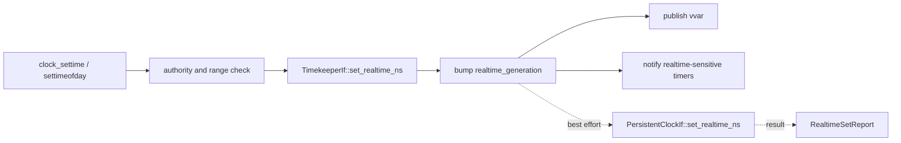

System realtime mutation succeeds when the timekeeper accepts the new wall
clock. Persistent writeback is separately reported and must not roll back an
accepted kernel realtime change in the default policy. `/dev/rtc RTC_SET_TIME`
is different: it targets the persistent device and should go through
`RtcDeviceOps`, not through `TimekeeperIf`.

## 7. Software Timer Registry

### 7.1 Responsibility

The timer registry is wake substrate, not semantic object storage. It stores
monotonic deadline entries and hands due entries to a router. It must not know
about timerfd expiration counts, POSIX signal delivery, futex hash buckets, VFS
fds, or scheduler run queues.

### 7.2 Interfaces

```rust
pub trait TimerRegistrar {
    fn install_for_task(
        &self,
        deadline: Deadline,
        role: TimerGuardRole,
        mailbox: Weak<TaskMailbox>,
    ) -> TimerGuard;
}

pub trait TimerRegistry {
    fn fire_due_with(&self, now_ns: u64, router: &mut dyn TimerWakeRouter) -> usize;
    fn next_deadline_ns(&self) -> Option<u64>;
}

pub trait TimerWakeRouter {
    fn post_timer_fired(
        &mut self,
        mailbox: Weak<TaskMailbox>,
        token: TimerToken,
        role: TimerGuardRole,
    );
}
```

Producer-facing and reactor-facing facets are separate:

- producers install deadlines through `TimerRegistrar`;
- the reactor drives expiry through `TimerRegistry`;
- cancellation is guard-owned;
- due entries flow through `TimerWakeRouter`.

### 7.3 Sub-Architecture

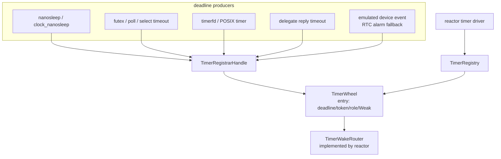

### 7.4 Entry Semantics

| Field | Meaning |
|---|---|
| `deadline_ns` | absolute monotonic expiry |
| `token` | correlation id for completion/cancel/resume |
| `role` | `PrimarySleep`, `DeadlineAbort`, `DelegateTimeout`, `DeviceEvent`, etc. |
| `mailbox` | task-owned inbox identity, not hart identity |
| optional generation | anti-stale check for waits or realtime conversions |

Fire/cancel races are resolved as follows:

- If the guard cancels before fire removes the entry, no event routes.
- If fire wins first, the event may route and the future must re-check state.
- If the mailbox is dead, the registry retires the entry.
- If the task is already runnable/running, the wake router treats the event as
  a coalesced wake hint.

The registry may use a timing wheel, heap, RB-tree, or hybrid. The public
contract is deadline registration and due-entry routing, not the data structure.

## 8. Reactor Timer Driver

### 8.1 Responsibility

The reactor is the only layer that combines:

- current monotonic time;
- software timer due walk;
- hardware deadline reprogramming;
- owner-aware wake routing.

It does not own clock semantics or user timer objects.

### 8.2 Per-Hart Tick Flow

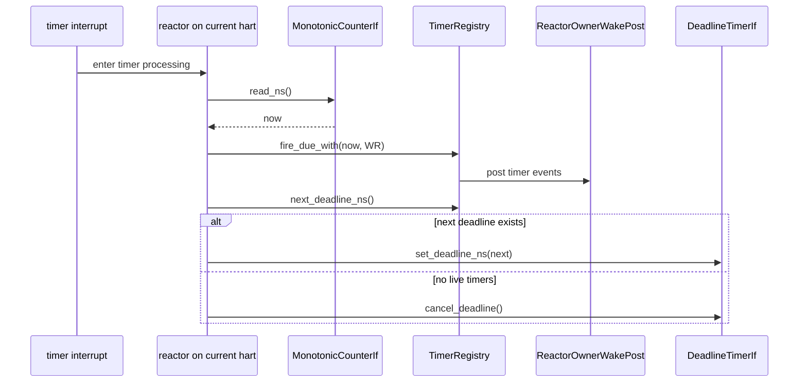

The due walk and deadline reprogramming happen together so the hardware timer
tracks the earliest live registry entry. If a new earlier timer is inserted by
another producer, insertion must signal or otherwise cause the owning reactor to
reprogram its deadline.

### 8.3 Reactor-Facing Interfaces

Inputs:

- `TimerRegistry::next_deadline_ns()`;
- `TimerRegistry::fire_due_with(now, router)`;
- `MonotonicCounterIf::read_ns()`;
- `DeadlineTimerIf::{set_deadline_ns,cancel_deadline}`;
- scheduler current-owner API.

Outputs:

- mailbox events such as `TimerFired` or timeout abort messages;
- scheduler placement requests;
- remote reschedule IPI when the current owner is remote;
- observation records for fired/cancelled/dead/stale timers.

Adjacent modules:

- wait adapter uses the registrar for timeout guards;
- delegate machinery uses role-tagged timeout entries;
- device emulation can use `DeviceEvent` timer roles;
- scheduler supplies the race-closed current-owner path.

## 9. Wait Sources And Wake Router

### 9.1 Responsibility

Wait sources publish readiness or event hints for non-timer conditions. Examples:
pipe readable/writable, futex wake, TTY input, RTC pending event, network
socket readiness, delegate reply, and process-exit wait.

The wake router converts those hints, plus timer hints, into the same task
mailbox and scheduler-placement path.

### 9.2 Unified Wake Path

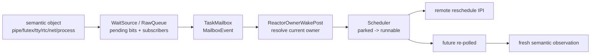

### 9.3 Owner-Aware Wake Contract

The wake router must close the post-steal race:

1. Event producer identifies the task mailbox or wait-source subscriber.
2. Router posts a mailbox event.
3. Router resolves the task's current owner.
4. Router locks the destination scheduler queue.
5. Router re-checks current owner under the queue/placement lock.
6. If still parked, task becomes runnable on the selected owner.
7. If target hart is remote, router sends a reschedule IPI.

The mailbox is task identity. It is not CPU identity. Work stealing changes
scheduler ownership, not the mailbox.

### 9.4 Timer And Wait-Source Convergence

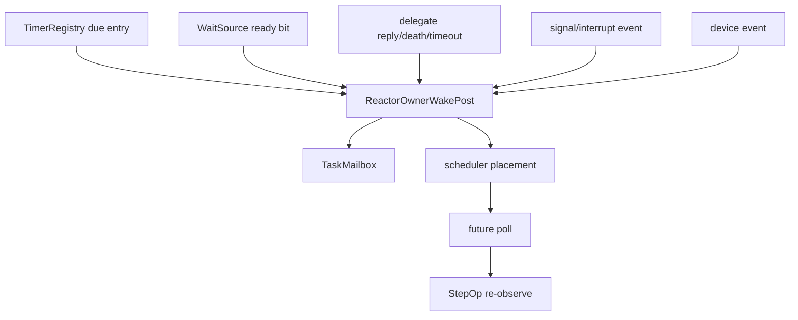

The target state is that all long-lived wake producers enter this one route.
Direct captured-waker wakeups may remain as transitional tests or local
optimizations, but not as the correctness mechanism for SMP.

## 10. Future, StepOp, And Timeout Integration

### 10.1 Responsibility Split

Steps decide what condition failed. Scripts and syscall drivers decide how to
wait. The reactor implements the wait. The timer registry represents timeouts.

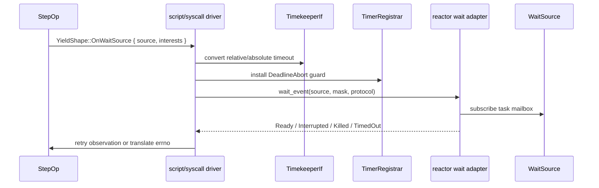

### 10.2 Rules

- Steps never arm timers directly.
- A timeout does not authorize the semantic operation to commit.
- `Ready` means "retry observation", not "the object is definitely ready."
- Timeout guards must be dropped when the wait completes by readiness, signal,
  kill, or cancellation.
- Realtime absolute timeout conversion must preserve generation information so
  a wall-clock jump can be handled by the owning ABI object.

## 11. RTC And Device Route

### 11.1 Responsibility

RTC support is two things:

1. Persistent clock capability below the timekeeper.
2. A character-device ABI above VFS/devfs.

Those are related but not identical. `/dev/rtc RTC_SET_TIME` mutates the RTC
device. `clock_settime(CLOCK_REALTIME)` mutates the timekeeper and may
optionally write back to the RTC as policy.

### 11.2 Sub-Architecture

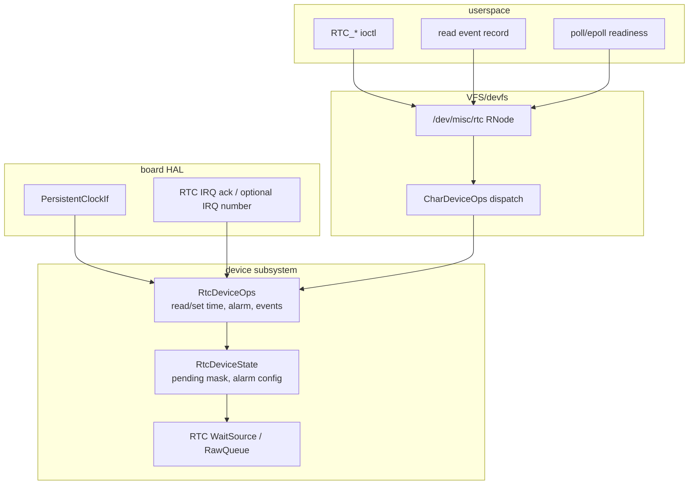

### 11.3 Interfaces

```rust
pub trait RtcDeviceOps {
    fn read_time(&self) -> Result<RtcTime, RtcError>;
    fn set_time(&self, time: RtcTime) -> Result<(), RtcError>;
    fn read_alarm(&self) -> Result<RtcAlarm, RtcError>;
    fn set_alarm(&self, alarm: RtcAlarm) -> Result<(), RtcError>;
    fn poll_events(&self) -> RtcEventMask;
    fn read_event(&self, nonblocking: bool) -> Result<RtcEventRecord, RtcError>;
}
```

Lower interface:

- `PersistentClockIf` for read/set/alarm;
- board IRQ acknowledgement;
- optional emulated alarm callback through timer registry.

Upper interface:

- devfs RNode and char-device dispatch;
- Linux-shaped ioctls;
- `read(2)` event records;
- `poll`/`epoll` readiness through a wait source.

Adjacent modules:

- timekeeper uses persistent clock only for boot seed/writeback policy;
- reactor wakes RTC readers through wait-source or timer callback events;
- VFS/devfs projects the device path and fd operations.

### 11.4 Event Rules

RTC pending events are device state. A hardware IRQ, emulated alarm timer, or
future update interrupt sets pending bits in `RtcDeviceState` and fires the RTC
wait source. A reader drains Linux-shaped event records. `poll` and `epoll`
observe readiness without reaching into HAL.

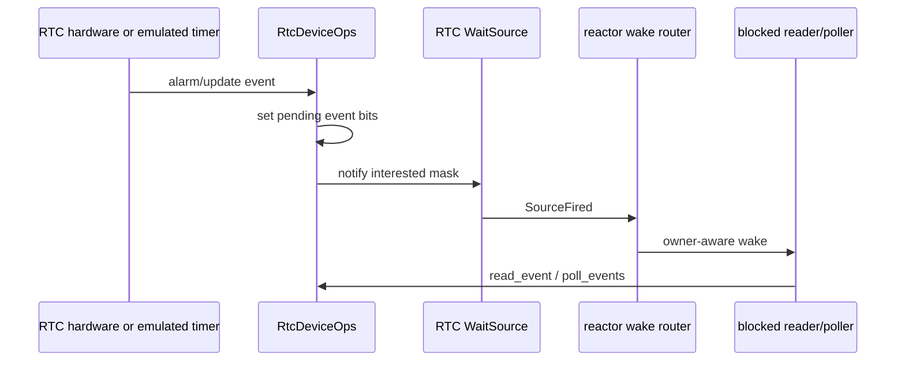

## 12. VFS, Devfs, And RNode Boundary

The device route should not let HAL directly create or own RNodes. The cleaner
shape is:

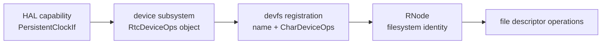

RNode remains a filesystem identity. Device subsystems expose typed operation
traits. Devfs binds names to those operation objects. This avoids a direct
HAL-to-VFS dependency and matches the broader Tx rule that HAL exposes hardware
facts while subsystems own semantic objects.

Future VFS/HAL refactors should follow the same pattern:

| Device kind | HAL/input side | subsystem trait | devfs/RNode projection |
|---|---|---|---|
| RTC | `PersistentClockIf`, IRQ ack | `RtcDeviceOps` | `/dev/misc/rtc` |
| console/TTY | UART/console HAL | `TtyDeviceOps`/TTY payload | `/dev/console`, `/dev/tty*` |
| block | block transport driver | `BlockDeviceOps` | `/dev/vd*`, filesystem mount source |
| network | NIC driver | net device ops | net namespace, sysfs/procfs projection |

The common rule is that RNode projection is above the typed subsystem trait, not
inside HAL.

## 13. SMP And Future Stealing

### 13.1 Race To Close

The critical SMP race:

```text
T0: task A parks on hart 0 with timer token X
T1: scheduler steals/migrates task A to hart 2 ownership
T2: timer X expires on hart 0 or another timer-driving hart
T3: wake must enqueue A on hart 2, not stale hart 0
```

The fix is to store task/mailbox identity in wait entries and re-resolve
current owner at wake time.

### 13.2 Owner-Aware Wake Diagram

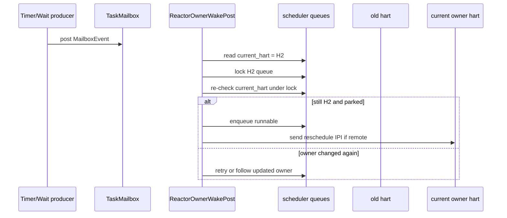

### 13.3 Invariants

- Timer entries and wait sources store mailbox/task identity, not hart identity.
- Work stealing updates scheduler ownership under the scheduler's lock protocol.
- Every wake after parking goes through owner re-resolution.
- Remote wake sends an IPI only after the task is visible on the target queue.
- A captured Rust `Waker` may be used as a notification optimization, but the
  correctness path is mailbox event plus scheduler placement.

## 14. Clock And ABI Coverage

### 14.1 Initial Clock Classes

| Clock | Initial Tx behavior | Later extension |
|---|---|---|
| `CLOCK_MONOTONIC` | monotonic counter via timekeeper | suspend exclusion/inclusion policy refinement |
| `CLOCK_REALTIME` | monotonic plus offset | NTP discipline, leap/TAI |
| `CLOCK_BOOTTIME` | may initially alias monotonic | suspend accounting |
| `CLOCK_MONOTONIC_RAW` | raw monotonic counter | separate disciplined vs raw source |
| `CLOCK_REALTIME_COARSE` | coarse view of realtime snapshot | per-CPU coarse cache |
| `CLOCK_MONOTONIC_COARSE` | coarse view of monotonic snapshot | per-CPU coarse cache |
| CPU clocks | thread/process accounting | full POSIX CPU timer integration |
| alarm clocks | persistent wake alarm or emulation | PM/suspend wake integration |

### 14.2 ABI Path Matrix

| ABI path | Time source | Timer surface | Wake route | Owner |
|---|---|---|---|---|
| `clock_gettime(CLOCK_MONOTONIC)` | `TimekeeperIf` -> `MonotonicCounterIf` | none | none | timekeeper |
| `clock_gettime(CLOCK_REALTIME)` | `TimekeeperIf` offset | none | none | timekeeper |
| `stat` timestamps | `TimekeeperIf::realtime_now_ns` | none | none | VFS/filesystem |
| `nanosleep` | monotonic deadline | `PrimarySleep` | `TimerFired` | syscall driver |
| `clock_nanosleep` realtime absolute | realtime conversion + generation | `PrimarySleep` | timer or generation retry | syscall driver |
| futex timed wait | converted monotonic deadline | `DeadlineAbort` | wait-source or timeout | futex driver |
| poll/select timeout | converted monotonic deadline | `DeadlineAbort` | fd readiness or timeout | poll/select driver |
| `timerfd` | chosen clock id + generation | timerfd-owned registration | fd readiness | timerfd object |
| `/dev/rtc read` | RTC device pending event state | optional emulated timer | RTC wait source | RTC device |
| `/dev/rtc ioctl` | persistent clock backend | optional alarm | RTC wait source | RTC device |

## 15. Data Structures

### 15.1 Timekeeper

```text
Timekeeper {
    realtime_offset_ns: AtomicI64,
    realtime_generation: AtomicU64,
    vvar: VvarPage,
    seed_provenance: Once/Atomic enum,
}
```

Key operations:

- read monotonic;
- compute realtime;
- mutate offset and generation;
- publish vvar;
- convert absolute realtime to monotonic with generation.

### 15.2 Timer Registry

```text
TimerEntry {
    deadline_ns: u64,
    token: TimerToken,
    role: TimerGuardRole,
    mailbox: Weak<TaskMailbox>,
    state: live/cancelled/fired,
}

TimerGuard {
    token: TimerToken,
    registry weak ref,
}
```

Key operations:

- install entry and return guard;
- cancel by guard drop;
- fire due entries through a router;
- report next live deadline.

### 15.3 Task Mailbox And Wake State

```text
TaskMailbox {
    generation,
    pending_events,
    overflow,
    registered_waker,
    scheduler_hint/current owner binding,
}

TaskWakeState {
    parked/runnable/running/completed state,
    current_hart,
}
```

Mailbox stores wake hints. Scheduler state stores placement.

### 15.4 RTC Device

```text
RtcDeviceState {
    pending_mask,
    alarm_enabled,
    alarm_time_ns,
    wait_source,
    open_state / fd flags policy,
}
```

Device state owns Linux-shaped behavior. HAL only performs persistent clock and
alarm operations.

### 15.5 Interface Contract Summary

The implementation should keep each public surface narrow enough that callers
cannot accidentally take ownership of the wrong state.

| Interface | Caller asks | Callee may mutate | Callee must not mutate |
|---|---|---|---|
| `MonotonicCounterIf` | "what is the current stable counter time?" | board-local observation/cache only | realtime offset, timer queues, task state |
| `DeadlineTimerIf` | "interrupt this hart at or after this monotonic deadline" | board-local timer compare/enable state | software timer entries, task mailbox, fd state |
| `PersistentClockIf` | "read/write persistent wall-clock or alarm capability" | RTC/firmware clock and alarm registers | `CLOCK_REALTIME` offset, devfs nodes, poll readiness |
| `TimekeeperIf` | "give or mutate semantic clock values" | realtime offset, generation, vvar publication | hardware deadline timer, RTC fd event queue |
| `TimerRegistrar` | "register a deadline for this task mailbox" | timer registry entry set | scheduler queues, timerfd counts |
| `TimerRegistry` | "which entries are due and what deadline is next?" | fired/cancelled registry state | semantic object state, hardware registers |
| `TimerWakeRouter` | "route this due timer role" | role-specific wake side effects through injected route | timer ordering data structure |
| `WaitSource` / `RawQueue` | "publish readiness to subscribers" | readiness bits, generation, subscriber fanout | operation result truth, CPU placement |
| `ReactorOwnerWakePost` | "turn this mailbox event into runnable placement" | mailbox event queue, scheduler placement, IPI request | pipe/futex/RTC/timerfd semantic state |
| `RtcDeviceOps` | "perform Linux-shaped RTC fd operation" | RTC device pending bits, alarm config, persistent backend operation | timekeeper realtime offset unless an explicit policy helper says so |
| `CharDeviceOps` / RNode binding | "dispatch fd operation to typed device" | VFS-visible file/device dispatch state | board MMIO/CSR state |

Two corollaries follow from the table:

- a method that needs both semantic object state and scheduler placement should
  be split into semantic mutation plus caller-injected post closure;
- a method that needs both HAL RTC access and RNode state should be split into
  typed device ops plus devfs projection.

These splits are the reason Package G uses `_with_post` seams instead of adding
a `tx-reactor` dependency to `tx-subsystems`, and the reason RTC support uses
`RtcDeviceOps` rather than binding `/dev/rtc` directly from the HAL.

## 16. Implementation Plan

### Package A: HAL Split

Exit criteria:

- `TimeIf` is gone from active public Rust interfaces.
- `TxPlatform` names `MonotonicCounterIf`, `DeadlineTimerIf`,
  `PersistentClockIf` directly.
- each board has explicit unsupported behavior for absent persistent clock.
- unit tests prove generic kernel code depends on trait surfaces, not board
  crates.

### Package B: Timekeeper Facade

Exit criteria:

- all clock syscalls and VFS timestamps read via `TimekeeperIf`;
- realtime mutation bumps generation and publishes vvar;
- boot seeds realtime from persistent clock when available;
- RTC read is not used on hot `CLOCK_REALTIME` path.

### Package C: Unified Timer Registry

Exit criteria:

- all sleep/futex/poll/delegate timeout registrations use `TimerRegistrar`;
- reactor-local timeout queues are removed or made pure compatibility wrappers;
- `TimerRegistry::fire_due_with` is the only expiry walk;
- cancellation guards cover fire/cancel races.

### Package D: Reactor Owner-Aware Wake

Exit criteria:

- timer expiry, wait-source readiness, delegate replies/timeouts, signal/device
  wakeups enter one `ReactorOwnerWakePost` route;
- post-steal wake tests prove stale hart identity is not used;
- remote wake IPI occurs after target queue publication.

### Package E: RTC Device Route

Exit criteria:

- `/dev/rtc` is backed by typed `RtcDeviceOps`;
- `RTC_RD_TIME`, `RTC_SET_TIME`, alarm read/set, read, poll, and epoll do not
  contain HAL-specific logic;
- hardware IRQ and emulated alarm both publish pending RTC events through the
  same wait source.

### Package F: Linux ABI Completion Slots

Exit criteria:

- timerfd interval/count/cancel-on-set semantics live in timerfd state;
- realtime jumps rebase/expire/cancel according to owning ABI object;
- POSIX timers and interval timers use the registrar without owning the wheel;
- boottime/alarm clock support is layered over timekeeper + persistent clock.

### Package G: Owner-Aware Wake Producer Convergence

Exit criteria:

- every producer that already has reactor/scheduler context routes mailbox
  publication through `ReactorOwnerWakePost` or an injected syscall/reactor post
  closure;
- semantic subsystems expose `_with_post` or equivalent seams where they own
  readiness state but the caller owns placement context;
- no migrated producer keeps a parallel direct wrapper as an active production
  route after the package slice retires it;
- no `tx-subsystems -> tx-reactor` dependency is introduced;
- focused tests prove the injected post path for each producer family, and
  waiter code still re-observes semantic state after wake.

The Package G migration catalog in section 23.3 is part of the implementation
plan, not merely status commentary. New producer families should be added to
that catalog before implementation if they do not fit an existing row.

### Package H: Board Evidence And Linux-Parity Extensions

Exit criteria:

- every supported board profile declares which of the three hardware
  capabilities is real, emulated, or unsupported;
- RTC-capable board profiles have a boot seed witness and an alarm publication
  witness;
- RTC-absent board profiles return typed unsupported errors without changing
  timekeeper or devfs structure;
- later Linux-parity work, such as `RTC_WKALM_*`, periodic/update interrupts,
  alarm clocks, or boottime suspend accounting, lands behind the extension
  points named in sections 14 and 18.

## 17. Validation Plan

Host/unit witnesses:

- timekeeper realtime offset and generation tests;
- persistent clock unsupported/invalid/range error tests;
- timer guard fire/cancel race tests;
- wait-source owner-aware post tests;
- RTC device ioctl/read/poll state tests;
- devfs RNode dispatch tests that do not name HAL.

QEMU/in-guest witnesses:

- boot vvar shows a plausible realtime seed when platform RTC exists;
- `clock_gettime(CLOCK_REALTIME)` and `stat` timestamps agree on the same wall
  clock source;
- `nanosleep`, futex timeout, poll timeout, and timerfd expire without using
  separate timer engines;
- `/dev/rtc` `RTC_RD_TIME` returns a plausible or typed unsupported result by
  board;
- RTC alarm event wakes a blocked reader/poller through the same owner-aware
  route;
- SMP stress proves timer expiry after task migration wakes the current owner.

Design/document gates:

- no active doc reintroduces runtime HAL manager or boxed dynamic HAL object;
- no active code path makes `CLOCK_REALTIME` a persistent-clock hot read;
- no timer data structure stores hart id as the durable wake target;
- no syscall or devfs path programs deadline hardware directly;
- no HAL code constructs or owns RNodes.

## 18. Deferred Features

These are required for full Linux parity but not for the first complete Tx
time/wake slice:

| Feature | Reserved design slot |
|---|---|
| NTP discipline and `adjtimex` | timekeeper frequency/offset discipline module |
| leap seconds and `CLOCK_TAI` | timekeeper TAI/leap state |
| time namespaces | per-namespace offsets layered above global timekeeper |
| full suspend/resume accounting | boottime clock plus PM hooks and persistent clock delta |
| RTC periodic/update interrupts | `RtcDeviceOps` event mask expansion |
| full POSIX CPU timers | process/thread CPU accounting subsystem |
| high-resolution vs coarse timer policy | timer registry data-structure and clock-base tuning |

## 19. Design Decisions

1. `TimeIf` is not the final architecture. It was too broad because it mixed
   counter reads, deadline programming, and persistent-clock behavior.
2. `TimerWheel` is not a scheduler and not a timerfd object store. It is a
   deadline registry.
3. The reactor timer driver is the consumer of the registry because it has
   scheduler and hardware-deadline context.
4. The wake router is shared by timer, wait-source, delegate, signal, and device
   events because all of them must close the same owner/migration race.
5. RTC is modeled twice on purpose: persistent-clock capability below
   timekeeper, and typed device ops above VFS/devfs.
6. HAL must not connect directly to RNode/devfs. Device subsystems bridge HAL
   capability into typed operations, and devfs projects those operations as
   filesystem nodes.
7. Linux compatibility is achieved by preserving ownership semantics, not by
   copying every Linux data structure.

## 20. Current Implementation Status

As of 2026-07-09, the design has partially landed in the active tree. The
important point is that the old active interfaces are already retired; the
remaining work is convergence of all wake producers and broader board evidence,
not keeping compatibility paths alive.

| Area | Current status | Remaining work |
|---|---|---|
| HAL split | `TxPlatform` names `MonotonicCounterIf`, `DeadlineTimerIf`, and `PersistentClockIf` directly; the old aggregate `TimeIf` is no longer active Rust API; RV64 QEMU goldfish, LA64 LS7A, and m1dock no-RTC typed-unsupported profiles have focused host witnesses | add real-board or firmware-backed persistent-clock witnesses beyond the QEMU/no-RTC profiles |
| timekeeper | `TimekeeperIf` wraps monotonic/realtime reads, realtime seed hooks, vvar publication, realtime mutation/writeback reporting, and timerfd realtime-change notification posting; public raw `wall_clock::*` runtime wrappers and public `WallClock` are retired | extend later for NTP/leap/time namespace semantics |
| timer registry | `TimerWheel` exposes `TimerRegistrar`, `TimerRegistry`, `TimerWakeRouter`, and role-tagged guards; router-free `fire_due` is retired | continue migrating any long-lived user timer object that still has local bookkeeping into the registrar surface |
| active wait | wait deadlines use `TimerRegistrarHandle`; the old reactor-local timeout queue/future path is gone | keep focused tests around guard drop, timeout-vs-ready races, and signal interruption |
| RTC device route | `/dev/misc/rtc` reaches typed `RtcDeviceOps`; read/set time, alarm read/set, read, poll, and epoll route through device state; RV64 goldfish and LA64 LS7A QEMU paths publish hardware alarm events; emulated RTC alarms record pending bits through the RTC device callback and publish the RTC RawQueue through the reactor timer router | add `RTC_WKALM_*` and periodic/update events only after Linux layout checks |
| wake router | `ReactorOwnerWakePost` is the shared owner-aware route for timer expiry, wake-inbox drain, device timer callback wait-source and RawQueue wakes, delegate timeout/reply/cancel/agent-death slices, signal process-producer `*_with_post` seams, thread-future fatal signal teardown through `post_mailbox_event_from_current_hart`, syscall-context signal producers through `SyscallCtx::post_mailbox_event`, active `ITIMER_REAL` producers through `fire_itimer_real_with_post` / `maybe_deliver_itimer_signal_with_post`, syscall-context process `exit_source` wakes through `SyscallCtx::post_mailbox_ref_event`, futex `FUTEX_WAKE` exact wait-source publication through `SyscallCtx::post_mailbox_ref_event_with_hint`, eventfd read/write readiness publication through `SyscallCtx::post_mailbox_ref_event`, pipe read/write readiness publication through `SyscallCtx::mailbox_ref_post_with_hint`, timerfd `timerfd_settime` immediate-readable publication through `SyscallCtx::post_mailbox_ref_event`, timerfd realtime cancel-on-set/rebase publication through `set_realtime_ns_with_persistent_and_timerfd_post` plus `timerfd_clock_was_set_with_post`, userfaultfd pending-fault readable publication through `fault_script_for_process_with_post` plus `push_fault_msg_with_post`, TTY console-ingest readable publication through `step_ingest_with_post` plus `post_mailbox_ref_event_with_hint_from_current_hart`, VFS/RNode read/write wait-source publication through `fire_read_wait_with_post` / `fire_write_wait_with_post`, RTC hardware IRQ and emulated alarm readiness through `publish_rtc_event_with_post` / `DeviceTimerCallback::with_raw_queue_wake`, POSIX mq send readiness and `mq_notify` signal publication through `step_mq_send_with_posts`, POSIX mq receive readiness through `step_mq_receive_with_post`, SysV msg send/receive/removed readiness publication through `step_msgsnd_with_post` / `step_msgrcv_with_post` / `step_msgctl_in_ns_with_post`, SysV sem changed-source readiness publication through `step_semop_v3_with_post` / `step_semctl_in_ns_with_post`, socket readiness publication through `SocketReadiness::*_with_post` plus `NetworkPublish::*_with_post` and `SyscallCtx::post_mailbox_ref_event` for socket syscall producers, network delegate queue publication through `net_delegate_kick_*_with_post`, AIO/io_uring completion readiness through `AioContext::push_completion_with_post` / `IoUring::push_cqe_with_post` plus worker setup post injection, generic v3 wait-source adapter publication through `_with_post` / limit-with-post routes, and page-backed page-ready waits through `notify_page_ready_with_post`; host smokes now include both sequential mixed-producer wake and a broad producer stress across mailbox source, signal, wait-channel, delegate timeout, device wait-source callback, and device RawQueue callback paths | keep future producer families on the same caller-posting boundary; add QEMU/real-board mixed-producer SMP stress evidence |
| SMP wake correctness | focused smokes cover remote owner-aware timer/device/delegate wake routes and broad host producer stress across six wake classes | add broader QEMU/real-board stress around migration/steal while mixed timer, signal, and fd-readiness events race |

The active implementation must continue to pass the hard retirement audit:

```sh
rg -n '\bTimeIf\b|TimerQueue|DeadlineFuture|timer_sleep|install_timer_queue|sleep_until_ns|DirectMailboxTimerWakeRouter|\.fire_due\(|timer_queue|fixed_oscomp_time|binding\.name == "rtc"' crates boards --glob '*.rs'
```

For active Rust code, this command should return no hits. Documentation and
progress notes may still mention the retired names only when explaining the
migration rule or historical problem.

## 21. Review Checklist

Use this checklist when adding a time, timer, RTC, or wake-routing patch.

| Change type | Must prove | Immediate rejection signal |
|---|---|---|
| new hardware time support | trait implementation stays inside board/HAL boundary and returns typed unsupported errors when absent | generic kernel or syscall code imports board register details |
| new clock read or timestamp path | value comes from `TimekeeperIf` and not RTC hardware | `CLOCK_REALTIME` or stat timestamp reads call `PersistentClockIf` directly |
| new timeout producer | deadline conversion uses timekeeper and registration uses `TimerRegistrar` | code creates a private wheel, queue, future timeout engine, or hardware timer arm |
| new wait-source producer | event is a wake hint and the waiter re-observes semantic state | mailbox event is treated as proof that the operation can commit |
| new cross-hart wake path | wake route posts mailbox event, resolves current owner, re-checks under scheduler lock, and sends IPI after publication | timer or wait entry stores hart id as durable target |
| new RTC ioctl or read/poll behavior | logic lives in `RtcDeviceOps` or RTC device state and projects through devfs char ops | syscall code special-cases `/dev/rtc` by name or calls board HAL directly |
| new devfs device family | HAL reports hardware facts, subsystem trait owns semantics, devfs binds operation object to RNode | HAL constructs RNodes or VFS objects |
| new timer data structure | public contract remains `TimerRegistrar` / `TimerRegistry` / `TimerWakeRouter` | upper layers depend on heap/wheel/RB-tree internals |

## 22. Failure Boundaries

The most useful debugging question is "which owner was bypassed?" Time/wake
bugs should be sorted by boundary:

| Symptom | Likely boundary | First thing to inspect |
|---|---|---|
| realtime and stat timestamps disagree | timekeeper/VFS timestamp boundary | whether both paths call the same `TimekeeperIf` realtime helper |
| `clock_gettime(CLOCK_REALTIME)` is slow or unstable | timekeeper/persistent-clock boundary | accidental RTC hot read or missing vvar generation publish |
| sleep fires but task does not run on SMP | wake router/scheduler boundary | current-owner re-resolution, queue lock re-check, remote IPI emission |
| timerfd count/readiness is wrong | timerfd semantic object boundary | whether expiry count lives in timerfd state rather than timer registry |
| futex or poll timeout commits incorrectly | wait-adapt boundary | whether wake/timeout is followed by semantic re-observation |
| RTC alarm wakes no reader | RTC event boundary | pending bits, RTC wait source notification, and owner-aware route |
| `/dev/rtc` path depends on a string name | devfs/device boundary | missing typed operation object or `rtc_ops()` dispatch |

This table is intentionally operational. It should keep future debugging from
reintroducing broad interfaces just to "make the path visible."

## 23. Concrete Landing Map

This section is the implementation-facing map for the design. It names where
new code should land and what dependency edges are legal. It is deliberately
more concrete than the module diagrams above so that later refactors do not
re-open old interface shapes while moving files.

| Concern | Primary home | Allowed callers | Forbidden dependency |
|---|---|---|---|
| raw monotonic counter read | `crates/tx-hal` trait plus board impl | timekeeper, reactor, observation code | VFS, syscall object state, timerfd state |
| current-hart deadline programming | `crates/tx-hal` trait plus board impl | reactor timer driver only | syscall shims, StepOps, timerfd/futex objects |
| persistent realtime / alarm backend | `PersistentClockIf` board impl | timekeeper seed/writeback, `RtcDeviceOps`, RTC IRQ handler | hot `CLOCK_REALTIME` read path, devfs path lookup |
| semantic realtime offset/generation | `tx_subsystems::wall_clock` | clock syscalls, vvar bootstrap, VFS timestamps, deadline conversion | hardware timer driver, RTC fd state |
| role-tagged deadline entry | `tx_substrate::wake::timer` | script/syscall wait adapters, timerfd, delegate, RTC emulation | board timer registers, scheduler run queues |
| due-walk and next-deadline programming | `tx-reactor` | timer interrupt path, idle/tick path | semantic object code, HAL RTC backend |
| owner-aware mailbox post | `tx-reactor` public wrappers / injected closures | timer router, scheduler-context signal/delegate/device/wait producers | substrate owning scheduler placement |
| wait-source readiness state | owning semantic subsystem plus `WaitSource`/`RawQueue` | futex, pipe, TTY, net, process wait, RTC device, epoll | hardware timer driver, direct run-queue insertion |
| RTC device semantics | `tx-subsystems::device` plus devfs char adapter | ioctl/read/poll/epoll dispatch | board HAL constructing RNodes or parsing Linux ioctl numbers |
| `/dev` path projection | `tx-fs::devfs` / VFS RNode layer | VFS open/read/ioctl/poll routing | HAL MMIO access, timekeeper offset mutation |

The legal high-level dependency graph is:

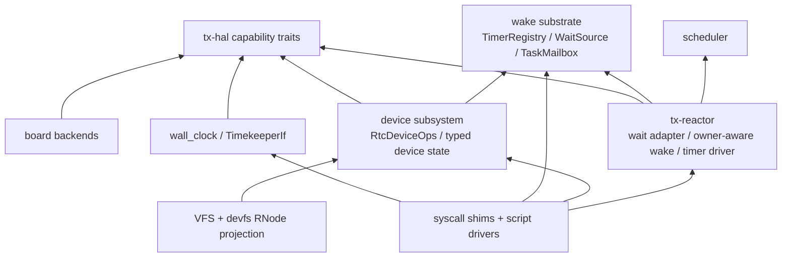

Two points are load-bearing:

1. `tx-subsystems` must not depend on `tx-reactor` just to obtain scheduler
   placement. When a subsystem has no reactor context, it publishes semantic
   readiness to its wait source. When a caller does have reactor/scheduler
   context, it injects a post closure such as the existing syscall-context
   mailbox post seams.
2. `tx-hal` must not depend on VFS or device nodes. Hardware traits report
   capabilities. Device subsystems adapt those capabilities into typed device
   operations. Devfs projects operation objects into RNodes.

### 23.1 Interface Retirement Rule

The target design is not compatible with keeping broad compatibility wrappers
alive indefinitely. Retired interfaces are allowed in progress notes only when
explaining a migration; they must not appear in active Rust code.

The standing active-code retirement audit is:

```sh
rg -n '\bTimeIf\b|TimerQueue|DeadlineFuture|timer_sleep|install_timer_queue|sleep_until_ns|DirectMailboxTimerWakeRouter|\.fire_due\(|timer_queue|fixed_oscomp_time|binding\.name == "rtc"' crates boards --glob '*.rs'
```

Expected result: no output and exit status 1.

The same rule applies to old direct producer wrappers after a wake-class slice
retires them. For example, after the `ITIMER_REAL` slice:

```sh
rg -n "maybe_deliver_itimer_signal\b|fire_itimer_real\(|deliver_signal_if_handler\(" crates/tx-shims/src crates/tx-kernel/src crates/tx-subsystems/src --glob '*.rs'
```

Expected result: no output and exit status 1.

### 23.2 Package Exit Evidence

Each package exits only when the design state is true mechanically, not when a
facade exists in parallel with the old route.

| Package | Mechanical proof |
|---|---|
| HAL split | active Rust code has no `TimeIf`; `TxPlatform` names the three capability traits directly; board crates return typed unsupported persistent-clock results where absent |
| timekeeper facade | clock syscalls, VFS timestamp paths, vvar publication, timerfd realtime revalidation, and realtime mutation use `TimekeeperIf`; no RTC hot read is present on `CLOCK_REALTIME`; active Rust has no public raw `wall_clock::*` runtime wrappers and no public `WallClock` |
| unified timer registry | timeout producers install through `TimerRegistrar`; expiry uses `TimerRegistry::fire_due_with`; router-free due walks and reactor-local timeout queues are absent |
| RTC device route | `/dev/misc/rtc` reaches typed `RtcDeviceOps`; read/ioctl/poll/epoll use device state; RTC events publish through a wait source |
| owner-aware wake convergence | every producer that has reactor/scheduler context either calls a reactor wrapper or accepts an injected mailbox-post closure; producers without that context publish to wait sources rather than importing the reactor |
| SMP wake correctness | focused tests cover wake after stale local waker, remote owner placement, and task migration/steal races for timer and non-timer events |

Package G remains intentionally broader than timers. Timer expiry, wait-source
readiness, delegate completion, signal delivery, process-exit waits, device
events, and reactor-local coordination all publish wake hints with different
semantic owners, but the final runnable-placement step is one owner-aware
mailbox route whenever scheduler context exists.

### 23.3 Wake Producer Migration Catalog

Package G is the part of this design that can otherwise become fuzzy: many
subsystems publish wake hints, but only some call sites have reactor/scheduler
context when they publish. The migration rule is therefore not "make every
subsystem import the reactor." The rule is:

1. The semantic subsystem owns the readiness or event state.
2. The subsystem exposes a `_with_post` or equivalent caller-posting seam.
3. A caller that has scheduler context injects `ReactorOwnerWakePost` through a
   reactor wrapper or `SyscallCtx`.
4. A caller without scheduler context falls back to direct mailbox posting or
   wait-source publication and lets the next reactor drain route the wake.

This keeps `tx-subsystems -> tx-reactor` out of the dependency graph while
still converging all scheduler-context producers onto one SMP-safe placement
path.

The target producer catalog is:

| Producer class | Semantic owner | Wake identity | Scheduler-context seam | No-context fallback |
|---|---|---|---|---|
| timer expiry | `TimerRegistry` entry plus role-specific owner | `Weak<TaskMailbox>` and timer token | `TimerRegistry::fire_due_with(..., ReactorOwnerWakePost)` | none in production; tests may use a fake router |
| delegate reply/cancel/death | `DelegateRegistry` token state | waiter mailbox stored with delegate token | `DelegateRegistry::*_with_post` or reactor delegate wrapper | explicit direct closure; retired transition names are also covered by the active-Rust strict residue gate |
| delegate timeout | timer role plus delegate token | waiter mailbox and delegate token id | timer router calls delegate-timeout callback, then owner-aware post | legacy no-reactor timeout helper only for tests |
| signal delivery | process/thread signal state | selected target task mailbox | `post_signal_with_post`, `step_kill_process_with_post`, `SyscallCtx::post_mailbox_event` | explicit direct mailbox-post closure through `post_signal_with_post`; old direct `post_signal` wrapper absent |
| interval timer signal | `ITIMER_REAL` state plus signal subsystem | target task mailbox | `fire_itimer_real_with_post(ctx)` and injected enter-userspace post | no direct wrapper after retirement; compatibility paths must be explicit `_with_post` callers |
| process exit wait | process payload exit-source state plus process group-exit side effects | upgraded subscriber mailbox and, for fatal/group exit, target task signal mailbox | `fire_exit_source_with_post` via `SyscallCtx::post_mailbox_ref_event`; group-exit callers use `step_exit_group_with_posts` / `step_exit_group_with_signal_with_posts` so both signal-task and exit-source posts are caller-injected | explicit direct closures for both post roles in no-context tests; old `fire_exit_source`, `step_exit_group`, and `step_exit_group_with_signal` wrappers absent |
| futex wake | futex bucket waiter state | exact waiter mailbox plus wake hint | `step_futex_wake_masked_with_hint_and_post_in` via `SyscallCtx::post_mailbox_ref_event_with_hint` | exact notify helper with direct mailbox-ref post |
| eventfd read/write | eventfd counter/readiness state | readable or writable wait-source subscriber mailbox | `step_eventfd_read_with_post` / `step_eventfd_write_with_post` via `SyscallCtx::post_mailbox_ref_event` | old direct `step_eventfd_read` / `step_eventfd_write` wrappers are retired; no-context callers pass an explicit direct closure |
| pipe read/write | pipe ring, reader/writer liveness, side wait sources | reader or writer wait-source subscriber mailbox | `ReadWithHintPostOp` / `WriteWithHintPostOp` pass `SyscallCtx::mailbox_ref_post_with_hint` with `Normal` hint | old direct `step_read` / `step_write` wrappers and `ReadOp` / `WriteOp` are retired; no-context callers pass an explicit direct closure through the `_with_post` helpers |
| timerfd settime and realtime mutation | timerfd deadline, interval, expiration count, cancel-on-set flag, realtime target, and readable wait source | timerfd readable wait-source subscriber mailbox | `timerfd_settime_with_flags_and_post` covers syscall-local immediate readability; `set_realtime_ns_with_persistent_and_timerfd_post` carries the same `SyscallCtx::post_mailbox_ref_event` seam through `timerfd_clock_was_set_with_post` for cancel-on-set and realtime-deadline revalidation | old direct `timerfd_settime_with_flags` and `timerfd_clock_was_set` wrappers are retired; no-context tests pass explicit direct closures to the `_with_post` helpers |
| signalfd process-signal fanout | signal subsystem chooses target and signalfd owns per-fd pending-signum queue | signalfd readable wait-source subscriber mailbox | `step_kill_process_with_posts` / `script_deliver_signal_with_posts` carry both weak signal mailbox post and mailbox-ref signalfd wait-source post; syscall contexts pass `SyscallCtx::post_mailbox_ref_event` for signalfd readiness | explicit direct mailbox-ref post closures through `notify_process_signal_with_post` / `SignalFd::notify_with_post` for no-context tests; old direct wrappers absent |
| VFS/RNode readiness | owning RNode or open-file readiness state | read/write wait-source subscriber mailbox | `fire_read_wait_with_post` / `fire_write_wait_with_post` let fd/syscall callers inject mailbox-ref posting when scheduler context exists | old direct `fire_read_wait` / `fire_write_wait` wrappers are retired; no-context callers pass an explicit direct closure |
| TTY readiness | TTY payload and line discipline state | TTY wait-source subscriber mailbox | `step_ingest_with_post` lets scheduler-context callers inject mailbox-ref posting; kernel console ingest injects `post_mailbox_ref_event_with_hint_from_current_hart` | old direct `step_ingest` wrapper is retired; no-context callers pass an explicit hint-aware direct closure |
| socket/network readiness | socket payload/protocol and network delegate queue state | socket or delegate wait-source subscriber mailbox | `SocketReadiness::*_with_post`, `NetworkPublish::*_with_post`, syscall-context producers inject `SyscallCtx::post_mailbox_ref_event`, and `net_delegate_kick_*_with_post` covers delegate poll/tick kicks | direct socket/delegate wait-source notify through the same helper for no-context paths, then reactor wait drain |
| RTC device readiness | `RtcDeviceState` pending mask | RTC wait source subscriber mailbox | hardware IRQ or emulated timer publishes device state, then owner-aware wait-source route when reactor context exists | device pending bits remain authoritative until a waiter drains them |
| userfaultfd pending fault | `UserfaultFd` pending-fault queue and VM fault script `UfdDispatchTarget` | userfaultfd readable wait-source subscriber mailbox | `fault_script_for_process_with_post` carries the thread-future post function into `ProcessUfdDispatch`, and `push_fault_msg_with_post` publishes readability through that injected mailbox-ref post | old direct `fault_script_for_process` / `push_fault_msg` wrappers are retired; no-context callers pass an explicit direct mailbox-ref post function |
| POSIX mq send/receive | POSIX mq open-instance plus backing SysV message payload | receiver/sender wait-source subscriber mailbox plus `mq_notify` signal target mailbox | `step_mq_send_with_posts` passes `SyscallCtx::post_mailbox_ref_event` for parked receiver readiness and `SyscallCtx::post_mailbox_event` for `mq_notify` signals; `step_mq_receive_with_post` passes `SyscallCtx::post_mailbox_ref_event` for parked sender readiness | old direct `step_mq_send` / `step_mq_receive` wrappers are retired; no-context callers pass an explicit direct closure |
| SysV msg send/receive/remove | SysV message queue payload | sender/receiver wait-source subscriber mailbox | `step_msgsnd_with_post` / `step_msgrcv_with_post` / `step_msgctl_in_ns_with_post` pass `SyscallCtx::post_mailbox_ref_event` for send/recv readiness and `IPC_RMID` abort publication | old direct `step_msgsnd` / `step_msgrcv` / `step_msgsnd_v3` / `step_msgrcv_v3` / `step_msgctl` / `step_msgctl_in_ns` wrappers are retired; no-context callers pass an explicit direct closure |
| SysV sem changed-source | SysV semaphore payload values, changed sequence, removal state, and `SEM_UNDO` adjustments | changed wait-source subscriber mailbox | `step_semop_v3_with_post`, `step_semop_with_post`, `step_semctl_in_ns_with_post`, and `step_sem_undo_with_post` pass `SyscallCtx::post_mailbox_ref_event` or caller-injected mailbox-ref post for value-change and `IPC_RMID` waiter wakes | old direct `step_semop`, `step_semop_v3`, `step_semctl`, `step_semctl_in_ns`, and `step_sem_undo` wrappers are retired; no-context callers pass an explicit direct closure |
| AIO/io_uring | owning async object queue or ring completion queue | object wait-source subscriber mailbox | landed: object-specific `_with_post` helpers when syscall or worker context has a post closure | explicit direct post closure through the same helper for no-context tests; retry-on-wake semantics |
| reactor-local completion/rendezvous | reactor coordination object | already-upgraded subscriber mailbox | `complete_with_post`, `arrive_with_post`, `ack_with_post` | old direct `complete`, `arrive`, and `ack` methods are retired; host/no-context callers pass an explicit direct closure |

The migration order should be chosen by how close the producer already is to a
syscall or reactor context:

| Priority | Producer group | Reason |
|---|---|---|
| 1 | syscall-local producers with already-upgraded mailboxes | small surface; `SyscallCtx` can inject the owner-aware post directly |
| 2 | subsystem notifiers that already expose a single notification function | one `_with_post` seam usually covers all call sites |
| 3 | device and fd readiness producers | need typed device or fd-state boundaries before routing can be clean |
| 4 | worker or delegated producers | may need explicit context handoff so the worker does not import reactor internals |
| 5 | broad network/VFS readiness families | likely need per-family notification traits before the route can be retired safely |

For every migrated producer, the acceptance proof is the same:

- a focused test shows the injected post closure is used when scheduler context
  exists;
- the no-context fallback remains available only through the same semantic
  helper, not through a parallel old route;
- the resumed waiter re-observes semantic state before returning success;
- `tx-subsystems` still does not import `tx-reactor`;
- any retired direct wrapper has a grep audit similar to the `ITIMER_REAL`
  wrapper audit.

The catalog is intentionally broader than the current code. Rows marked
"target" are design obligations, not claims that the implementation slice has
already landed.

### 23.4 Producer Slice Implementation Recipe

Every Package G producer slice should land in the same shape unless the active
contract explicitly says otherwise. This recipe is intentionally mechanical so
that future VFS, TTY, socket, RTC, userfaultfd, AIO, io_uring, mq, and SysV IPC
wake work does not invent a new route for each subsystem.

1. **Classify the semantic owner.** Name the object that owns truth:
   pipe ring state, futex waiter table, signalfd pending queue, RTC pending
   bits, socket receive buffer, RNode readiness, or async request queue.
2. **Identify the wake identity.** Decide whether the producer wakes a weak
   task mailbox, an already-upgraded subscriber mailbox, a wait source, or a
   role-tagged timer entry. The identity must be task/mailbox/source identity,
   not a hart id or captured local queue.
3. **Add a caller-posting seam.** The semantic module exposes a `_with_post`
   helper or equivalent trait method. The helper mutates semantic state first,
   then calls the supplied post closure for wake publication.
4. **Keep no-context fallback narrow.** Existing public convenience wrappers,
   if still needed for host tests or pre-reactor contexts, delegate through the
   `_with_post` helper with direct mailbox posting. They must not keep a second
   independent notification algorithm.
5. **Inject owner-aware posting at the caller.** Syscall, reactor, kernel IRQ,
   or worker callers that know the current hart or have `SyscallCtx` inject
   `post_mailbox_event`, `post_mailbox_ref_event`,
   `post_mailbox_ref_event_with_hint`, or a reactor wrapper over
   `ReactorOwnerWakePost`.
6. **Re-observe after wake.** The resumed future or syscall driver must re-read
   the semantic owner. The mailbox event proves that something may have
   changed; it does not prove that the operation can commit.
7. **Retire the old route.** After the slice is complete, remove or quarantine
   direct production wrappers and add a grep audit when the retired names are
   likely to regress.
8. **Record the slice.** Update the active contract, this stage2 design when
   the catalog/status changes, `docs/progress/STATUS.md`, and the relevant
   research note.

The required function shape is usually one of these three patterns:

```rust
// Weak task-mailbox producer: signal-like events.
fn publish_event_with_post<F>(target: &TaskMailbox, event: MailboxEvent, post: F)
where
    F: FnMut(&TaskMailbox, MailboxEvent);

// Already-upgraded wait-source subscriber producer: pipe/futex/eventfd-like
// readiness.
fn notify_readable_with_post<F>(source: &WaitSource, post: F)
where
    F: FnMut(&TaskMailbox, MailboxEvent);

// Role-tagged timer producer: timer/delegate/device timeout.
fn fire_due_with(&self, now_ns: u64, router: &mut dyn TimerWakeRouter) -> usize;
```

The exact Rust types can differ, but the ownership rule cannot: semantic state
mutation stays in the semantic owner, placement stays in the caller-injected
reactor/scheduler route, and `tx-subsystems` does not import `tx-reactor`.

### 23.5 End-To-End Acceptance Scenarios

The design is complete only if the main user-visible scenarios can be traced
from ABI entry to state owner to wake or return path without crossing a
forbidden dependency.

| Scenario | Required path | Acceptance proof |
|---|---|---|
| read monotonic time | syscall/vDSO -> `TimekeeperIf` -> `MonotonicCounterIf` | no RTC read, no timer registry access, vvar snapshot uses timekeeper generation |
| read realtime time | syscall/vDSO -> `TimekeeperIf` realtime offset -> monotonic counter | realtime value and stat timestamp share the same wall-clock helper |
| set realtime | syscall authority check -> timekeeper offset/generation -> vvar publish -> realtime-sensitive object notification -> optional persistent writeback | accepted timekeeper mutation is not rolled back by RTC writeback failure; timerfd cancel-on-set/rebase notices the generation change |
| relative sleep | syscall driver -> monotonic deadline -> `TimerRegistrar` -> reactor due walk -> owner-aware mailbox post -> re-poll | no private timeout queue and no hardware timer programming from the syscall path |
| realtime absolute sleep | deadline conversion carries realtime generation -> timer guard -> wake/retry on generation mismatch | wall-clock step cannot silently complete the wrong absolute wait |
| futex or poll timeout | semantic wait-source subscription plus `DeadlineAbort` timer guard | either readiness or timeout wakes; resumed driver re-observes object state before returning |
| timerfd expiry | timerfd owns interval/count/readiness, timer registry owns deadline, wait source owns readable publication | expiry count is not stored in `TimerWheel`; readable wake routes through mailbox-ref post when context exists |
| signalfd signal fanout | signal subsystem selects target, signalfd queues pending signum, signalfd readable wait source publishes through injected post | weak `SignalDelivered` and mailbox-ref `SourceFired` routes are both tested when scheduler context exists |
| RTC read/poll alarm | board RTC or emulated timer -> `RtcDeviceOps` pending bits -> RTC wait source -> owner-aware wake -> `read_event` drain | HAL never constructs an RNode or posts directly to a task |
| VFS timestamp | filesystem/VFS timestamp policy -> timekeeper realtime helper -> filesystem granularity/range conversion | stat timestamps and `clock_gettime(CLOCK_REALTIME)` disagree only by allowed granularity, not by source |
| post-steal wake | any timer/wait/signal/device producer -> task mailbox identity -> owner re-resolution -> queue lock re-check -> remote IPI if needed | registration hart or last-poll hart is not used as durable wake target |

These scenarios are also the debugging map. If an implementation cannot draw
one of these paths without a shortcut, the shortcut should be treated as the
bug even if the immediate test passes.

## 24. Completeness Boundary

The complete stage-2 design covers every feature needed to avoid another time
architecture rewrite:

| Feature family | Covered now | Reserved extension point |
|---|---|---|
| monotonic clock reads | mandatory `MonotonicCounterIf` and timekeeper read path | raw/discipled split for `CLOCK_MONOTONIC_RAW` |
| realtime wall clock | monotonic plus offset, generation, vvar, seed/writeback | NTP, leap second, TAI, time namespace overlays |
| software timeouts | shared registrar/registry/router surface | data-structure replacement: wheel, heap, RB-tree, or sharded hybrid |
| wake routing | owner-aware mailbox post plus scheduler placement | policy changes such as priority, donation, or per-class placement |
| future stealing | stable mailbox identity, current-owner re-resolution, remote IPI after queue publication | timer-shard migration as performance optimization only |
| RTC device ABI | persistent clock backend, typed device ops, pending event state, devfs projection | full Linux RTC ioctl set, periodic/update events, wakeup-source accounting |
| stat/VFS timestamps | VFS reads realtime from timekeeper | filesystem-specific granularity/range/y2038 policy |
| suspend-aware clocks | design slot through persistent clock and future boottime accounting | full PM suspend/resume integration and alarmtimer parity |

This means v1 implementation can be partial without being architecturally
incomplete: unsupported board RTCs, missing NTP, missing time namespaces, and
incomplete POSIX CPU timers are feature gaps behind named extension points.
They are not reasons to recreate `TimeIf`, a private timer queue, direct RTC
path-name checks, or per-producer scheduler hooks.

The design is complete when future work can be classified by table row:

- a new hardware source is a HAL capability implementation;
- a new clock semantic is a timekeeper extension;
- a new timeout user is a `TimerRegistrar` producer;
- a new readiness source is a `WaitSource` producer;
- a new runnable-placement case is an owner-aware wake route;
- a new userspace device is a typed device operation projected by devfs;
- a new Linux ABI semantic lives in the owning object, not in the timer wheel,
  HAL backend, or scheduler.

If a proposed feature cannot fit one of those rows, the architecture contract
should be updated first. Otherwise the implementation should follow the row's
owner and dependency boundary.

## 25. Maintainer Handoff

This section is the stable entry point for the next implementer. It turns the
design into a patch workflow without weakening the ownership rules above.

### 25.1 Which Document Is Authoritative

| Document | Use when |
|---|---|
| [`README.md`](README.md) | checking Linux source/module behavior before deciding whether a feature is a Tx v1 requirement or a deferred Linux-parity slot |
| this document | learning the complete Tx architecture and choosing the correct module/package boundary for a patch |
| [`../../design/02_execution/TIME_WAKE_v1.md`](../../design/02_execution/TIME_WAKE_v1.md) | citing the active txdoc-tagged contract in implementation plans, reviews, and lint gates |
| `docs/progress/research/2026-07-06-time-wake-design-refactor.md` | preserving continuation context and recording package-by-package progress |

If the narrative in this document and the active contract disagree, update the
active contract first, then align this document. Progress notes never override
the contract.

### 25.2 Next Slice Selection

Pick the next slice by the owner of semantic state, not by the place where a
wake happened to be observed.

| Next work | First code area to inspect | Expected seam | Main risk |
|---|---|---|---|
| network delegate kick | `crates/tx-subsystems/src/net/delegate`, `crates/tx-drivers/src/virtio/net.rs`, net device poll/tick callers, and kernel net init | landed: `net_delegate_kick_*_with_post` accepts a caller post where scheduler context exists; no-context callers pass the delegate direct mailbox-ref helper explicitly | delegate queue state must remain in the net delegate subsystem; do not import reactor internals into `tx-subsystems` |
| RTC/device follow-ups | `crates/tx-subsystems/src/device.rs`, devfs char adapter, kernel RTC IRQ/timer callback | base pending-event publication is implemented; future RTC UAPI events must reuse `publish_rtc_event_with_post` or timer callback RawQueue wake | do not let HAL or IRQ code own RNode state |
| AIO / io_uring | `crates/tx-shims/src/linux_syscall/aio.rs`, `io_uring` scaffolding, async object queues | landed: completion/readiness helpers own object queues and accept injected posts; old direct wrappers are retired | keep worker context narrow; pass post closures rather than importing reactor internals |
| POSIX mq / SysV msg/sem | `crates/tx-subsystems/src/ipc` and syscall dispatch | POSIX mq, SysV msg send/receive/remove, and SysV sem changed-source publication already use `_with_post` when caller has `SyscallCtx` | IPC semantics must remain in IPC object state, not wait-source event payload |
| higher-level signal/syscall producers | signal syscall helpers and thread-runtime fatal paths | carry both weak-mailbox and mailbox-ref post functions when needed | signal state and signalfd readiness are different publications and must not be collapsed |

When a slice does not fit a row, extend section 23.3 before editing code.

### 25.3 Patch Shape

A correct Package G patch normally touches four layers:

1. **Semantic subsystem.** Add `_with_post` or equivalent caller-posting helper
   around the existing state mutation and readiness publication.
2. **Caller with context.** Inject `SyscallCtx`, reactor wrapper, or kernel
   current-hart post function at the boundary that already knows scheduler
   context.
3. **Focused proof.** Add a test that counts or observes the injected post path,
   and keep a no-context fallback test when the helper still supports host
   usage.
4. **Design/progress sync.** Update this document only if the catalog/status
   changed, update the active contract status, and record the slice in progress
   memory.

The patch should not move semantic state into the reactor, import `tx-reactor`
from `tx-subsystems`, store hart identity in timer or wait entries, or make a
mailbox event mean that a syscall can commit without re-observation.

### 25.4 Standard Verification

Use the narrowest gate that proves the slice plus the standing retirement
rules:

```sh
cargo fmt --check -p <changed-package>...
cargo test -p <focused-package> <focused-test-or-integration-test> -- --nocapture
cargo check -p <changed-package> -q
rg -n '<retired direct wrapper pattern>' <changed paths> --glob '*.rs'; test $? -eq 1
rg -n '\bTimeIf\b|TimerQueue|DeadlineFuture|timer_sleep|install_timer_queue|sleep_until_ns|DirectMailboxTimerWakeRouter|\.fire_due\(|timer_queue|fixed_oscomp_time|binding\.name == "rtc"' crates boards --glob '*.rs'; test $? -eq 1
git diff --check -- <changed paths>
rg -n '[ \t]+$' <changed paths>
cargo xtask progress validate
cargo xtask lint docs
```

Broader QEMU or OSComp evidence is required when the slice changes guest-visible
time, device, scheduler, or syscall behavior. A documentation-only patch still
needs `git diff --check`, a trailing-whitespace scan, `cargo xtask progress
validate`, and `cargo xtask lint docs`.

### 25.5 Completion Rule

The design is considered complete for v1 because every known time/wake feature
has a named owner, interface, package, and extension slot. Implementation is
complete only when the current code satisfies the package exit evidence in
section 23.2 and every row in the producer catalog either has an implemented
owner-aware seam or is explicitly deferred by a progress note.

Until then, future work should report two states separately:

- **architecture complete:** the feature fits this document and the active
  contract without adding a new layer;
- **implementation complete:** the relevant old interface or direct producer
  route is mechanically retired and the focused proof has passed.

## 26. Remaining Producer Detailed Design

This section completes the design for the remaining Package G implementation
slices. It is intentionally more prescriptive than the earlier catalog: every
remaining producer family gets a state owner, target interface, legal caller
injection point, no-context fallback, retirement audit, and proof gate.

The common shape is:

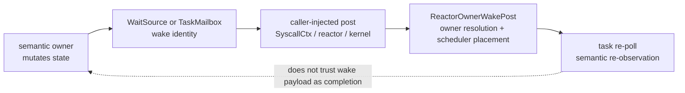

The design forbids two shortcuts:

- importing `tx-reactor` into `tx-subsystems` or `tx-fs` only to reach
  scheduler placement;
- keeping an old direct notification wrapper as a second production route after
  a producer slice has migrated.

### 26.1 Shared Interface Shapes

Every remaining producer should use one of these interface shapes.

| Producer identity | Target shape | When to use |
|---|---|---|
| already-upgraded subscriber mailbox | `*_with_post(..., post: FnMut(&TaskMailbox, MailboxEvent))` | SysV sem, AIO completion queues, RTC event queues, socket readiness queues |
| already-upgraded subscriber mailbox with placement hint | `*_with_hint_post(..., post: FnMut(&TaskMailbox, MailboxEvent, WakePlacementHint))` | socket/network and net-device paths where `WakeHandoff`-style hints are useful |
| weak task mailbox | `*_with_post(..., post: FnMut(&Weak<TaskMailbox>, MailboxEvent))` or caller upgrades before post | signal-like task-directed events |
| role-tagged timer entry | `TimerWakeRouter` callback | timer expiry, delegate timeout, emulated device alarms |
| worker completion queue | completion object accepts a narrow post closure at worker construction or completion publication | AIO workers, io_uring SQPOLL workers, future network workers |

The no-context method, if it still exists, is not a separate algorithm. It must
delegate through the same `_with_post` method using the direct mailbox-ref post
provided by the wake substrate.

### 26.2 SysV Semaphore Slice

**Current owner.** SysV semaphore truth lives in the semaphore-set payload:
semaphore values, waiter observations, `changed_seq`, removal state, and
`SEM_UNDO` adjustments. The changed wait source is a wake hint for blocked
`semop` drivers.

**Target interfaces.**

- `notify_changed_with_post(channel, source, post)` replaces the direct
  `notify_changed` publication helper.
- `step_semop_v3_with_post(semid, sops, cred, process, post)` is the canonical
  v3 operation. The old no-context `step_semop_v3` wrapper is retired; host
  callers pass an explicit direct mailbox-ref post closure.
- `step_semop_with_post` wraps the Linux-return-value adapter around
  `step_semop_v3_with_post`.
- `step_semctl_with_post` and `step_semctl_in_ns_with_post` route `IPC_RMID`,
  `SETVAL`, and `SETALL` changed-source publication through the supplied post.
- `step_sem_undo_with_post` routes process-exit undo adjustments through the
  same publication helper; the old default `step_sem_undo` wrapper is retired.

**Syscall integration.** `drive_semop` and `SysvSemopWaitOp` carry the
`SyscallCtx` mailbox-ref post function so both the initial nonblocking attempt
and every retry after an async wait use the same owner-aware route when the
thread future installed one. `sys_semctl` injects the same post into
`step_semctl_in_ns_with_post`.

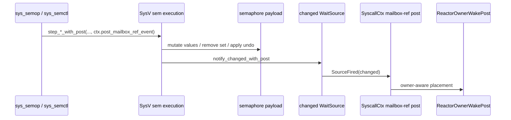

**Retirement audit.**

```sh
rg -n 'notify_changed\(|notification::notify_changed\b|notify_v3_source\(' \
  crates/tx-subsystems/src/ipc/sysv_sem \
  crates/tx-shims/src/linux_syscall/ipc.rs \
  --glob '*.rs'
```

Expected result after the slice: no output. If a compatibility wrapper remains
for tests, its name must not match the old direct production name.

**Proof gate.**

- a subsystem test proves `step_semop_v3_with_post` uses the injected post when
  a value-changing operation wakes a blocked waiter;
- a subsystem or shim test proves `step_semctl_in_ns_with_post` uses the
  injected post for `IPC_RMID` waiter aborts;
- `sys_semop`, `sys_semtimedop`, and `sys_semctl` still re-observe semaphore
  state after wake and do not commit from the mailbox event alone.

Implementation note: this slice has landed. SysV sem notification now exposes
`notify_changed_with_post`; `step_semop_v3_with_post`,
`step_semop_with_post`, `step_semctl_in_ns_with_post`, and
`step_sem_undo_with_post` are the caller-posting seams; `sys_semop`,
`sys_semtimedop`, and `sys_semctl` inject `SyscallCtx` mailbox-ref posting
where they publish changed-source wakes; and the old direct
`notify_changed`, `step_semop`, `step_semop_v3`, `step_semctl`,
`step_semctl_in_ns`, and `step_sem_undo` active wrappers are retired.

### 26.3 Socket And Network Readiness Slice

**Current owner.** Socket readiness truth lives in socket payloads, protocol
queues, network namespace device state, and the three socket readiness queues:
recv, send, and accept. Urgent data uses a readiness port. Network delegate
queues own their own poll/tick readiness.

**Target interfaces.**

- `SocketReadiness::fire_recv_with_post`,
  `SocketReadiness::fire_send_with_post`, and
  `SocketReadiness::fire_accept_with_post` are the central readiness verbs.
- The old `fire_recv`, `fire_send`, and `fire_accept` wrappers are retired:
  no active Rust caller can publish socket readiness without choosing a post
  route.
- Packet, loopback, TCP, UDP, ICMP, SCTP, shutdown/close, netdevice, and
  rtnetlink paths publish through higher-level publish objects such as
  `NetworkPublish::publish_to_with_post` and
  `NetworkPublishTarget::publish_with_post` rather than preserving direct
  `publish_to` / `publish` wrappers.
- Urgent-data publication grows the same `_with_post` seam over the urgent
  port.
- The network delegate queue keeps its semantic bits in the delegate subsystem
  but exposes `net_delegate_kick_*_with_post` for producer contexts that have a
  reactor or kernel post closure.

**Caller integration.**

| Caller class | Injected post |
|---|---|
| socket syscalls in `tx-shims` | `SyscallCtx::post_mailbox_ref_event` or `post_mailbox_ref_event_with_hint` |
| kernel network IRQ or device poll context | kernel current-hart wrapper over `ReactorOwnerWakePost` when task context is available |
| net delegate worker without scheduler context | direct fallback through the same `_with_post` helper |
| host tests | counting post closure or direct fallback |

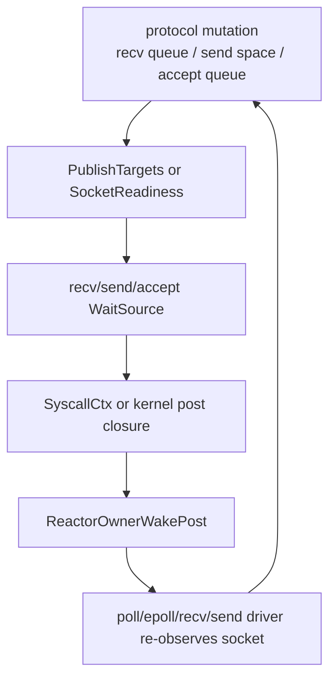

**Retirement audit.** Because socket code has many current call sites, the
slice should introduce a temporary audit that first lists all direct
`readiness.fire_*` calls. At package exit, production direct calls should be
limited to the wrapper implementation and no-context tests:

```sh
rg -n '\.readiness\.fire_(recv|send|accept)\(|urgent_port\.fire\(|net_delegate_kick_(poll|tick)\(' \
  crates/tx-subsystems/src/net \
  crates/tx-drivers/src/virtio/net.rs \
  crates/tx-shims/src/linux_syscall/socket.rs \
  crates/tx-shims/src/linux_syscall/socket \
  --glob '*.rs'
```

**Proof gate.**

- one recv-ready path, one send-space path, and one accept-ready path each prove
  injected mailbox-ref posting is used when `SyscallCtx` is present;
- a protocol test still proves readiness bits are level-triggered and the
  resumed operation rechecks socket payload state;
- an SMP/reactor smoke covers one socket readiness wake after owner migration
  or at least exercises the owner-aware mailbox-ref route used by the socket
  seam.

Implementation note: this slice has landed for both socket readiness and the
network delegate queue. Socket readiness exposes only
`SocketReadiness::*_with_post`, packet publication exposes only
`NetworkPublish::*_with_post`, and the old direct socket publish wrappers are
absent. The network delegate queue now exposes only
`net_delegate_kick_poll_with_post` and `net_delegate_kick_tick_with_post`;
subsystem, test, and no-context producers pass
`net_delegate_direct_mailbox_post` explicitly, while the boot network deadline
task injects the kernel current-hart mailbox-ref post. The old direct
`net_delegate_kick_poll` / `net_delegate_kick_tick` wrappers are absent from
active Rust code.

### 26.4 RTC And Generic Device Readiness Slice

**Current owner.** RTC file semantics are owned by RTC device state and devfs
char-device dispatch, while persistent clock hardware is owned by HAL board
backends. RTC pending bits and the RTC event wait source are the readiness
truth for `read`, `poll`, and `epoll`.

**Target interfaces.**

- `publish_rtc_event_with_post(mask, post)` records pending RTC event bits and
  publishes the RTC event wait source through the supplied post closure.
- The old direct `publish_rtc_event(mask)` wrapper is retired from active Rust
  code. No-context tests call `publish_rtc_event_with_post` with an explicit
  direct mailbox-ref post closure.
- `RtcDeviceOps::poll_events` stays a snapshot API; it does not consume events
  and does not route scheduler placement.
- Generic character-device event producers should follow the same pattern:
  device state owns pending bits, devfs projects the operation object, and the
  caller injects a post closure when scheduler context exists.

**Caller integration.**

| Event source | Target route |
|---|---|
| hardware RTC IRQ handler | ack through `PersistentClockIf`, then call the RTC event publisher with the kernel current-hart mailbox-ref post if the reactor is initialized |
| emulated RTC alarm timer | timer callback records device event and routes the wait-source wake through the timer router/device callback path |
| tests or pre-reactor boot | explicit direct mailbox-ref post closure through `publish_rtc_event_with_post` |

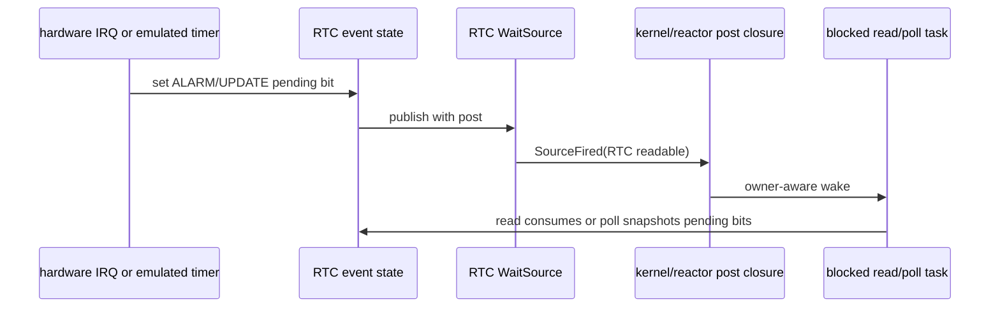

**Retirement audit.**

```sh
rg -n '\bpublish_rtc_event\b|publish_rtc_event\(' crates boards --glob '*.rs'; test $? -eq 1
rg -n 'RTC_EVENT_QUEUE|\.fire\(' \
  crates/tx-fs/src/devfs/mod.rs \
  crates/tx-kernel/src/irq.rs \
  --glob '*.rs'
```

After the slice, direct `publish_rtc_event` should be absent and the RTC event
queue should be reachable only through the encapsulated RTC event-state helper.
HAL and board crates must still have no devfs/RNode references.

**Proof gate.**

- a devfs/device test counts the injected post when an RTC event is published;
- blocking RTC `read` and `poll` still recheck pending bits after wake;
- the hardware IRQ path and emulated timer path both end in the same event
  state and wait-source publication;
- unsupported RTC boards keep returning typed unsupported errors without
  changing the wake route.

Implementation note: this slice has landed. Hardware RTC IRQ publication calls
`publish_rtc_event_with_post` with the kernel current-hart mailbox-ref post.
Emulated RTC alarm timers now carry the RTC event `RawQueue` through
`DeviceTimerCallback::with_raw_queue_wake`; `TimerRegistry::fire_due_with`
runs the device-state callback first, then asks `TimerWakeRouter` to post each
RawQueue subscriber mailbox through the owner-aware route. The old direct
`publish_rtc_event` wrapper is absent from active Rust code; no-context tests
pass explicit direct mailbox-ref post closures through
`publish_rtc_event_with_post`. The former raw `RTC_EVENT_QUEUE` static is also
gone; queue creation, test snapshots, readable clearing, and source-id lookup
now route through the RTC event-state helper, so the RTC/device audit can be
strict.

### 26.5 AIO And io_uring Slice

**Current owner.** AIO contexts own submitted IOCBs, completion queues,
context lifetime, and the completion wait source used by `io_getevents`.
io_uring rings own SQ/CQ state, worker lifetime, and any CQ readiness signal.
Workers may execute outside the syscall that created the wait, so the design
must pass a narrow completion publisher rather than a reactor dependency.

**Target interfaces.**

- `AioContext::push_completion_with_post(event, post)` appends the completion
  event and publishes the completion wait source through the injected post.
- AIO worker construction uses `spawn_worker_for_context_with_completion_post`
  and receives an `AioCompletionPost` closure that contains only the post
  function and no reactor internals.
- io_uring CQ publication mirrors AIO:
  `IoUring::push_cqe_with_post(cqe, post)` owns CQ state and readiness, while
  SQPOLL or worker code receives a narrow post closure during setup through
  `spawn_sqpoll_worker_with_completion_post`.
- `io_getevents` and future `io_uring_enter` waiters continue to drain and
  re-observe the completion queue; a wake only means "try to drain again."

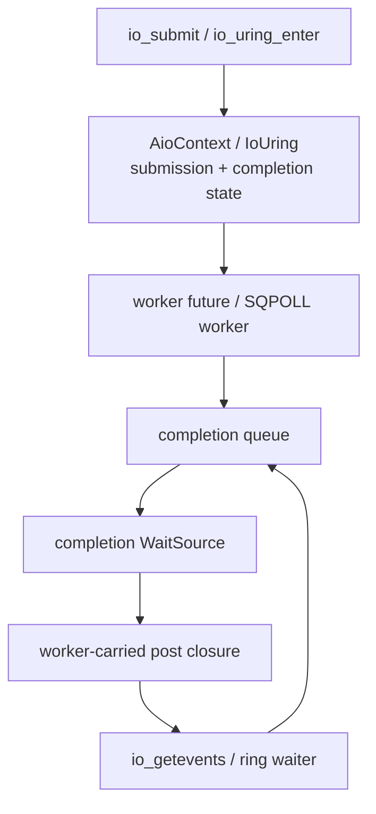

**Retirement audit.**

```sh
rg -n 'notify_events_available\(|notify_cqe_available\(|spawn_worker_for_context\b|spawn_sqpoll_worker\b|push_completion\b|push_cqe\b|direct_completion_post\b' \
  crates/tx-subsystems/src/aio \
  crates/tx-subsystems/src/io_uring \
  crates/tx-shims/src \
  crates/tx-shims/tests \
  --glob '*.rs'; test $? -eq 1
```

Package exit requires this audit to return no hits: the old direct
completion-notify helpers, old direct push wrappers, old direct worker-spawn
wrappers, and direct-post helper names must not remain in active Rust code.
No-context tests must call the `_with_post` helper with an explicit direct post
closure instead of reintroducing an old wrapper name.

**Proof gate.**

- AIO worker completion uses an injected post closure in a focused host test;
- `io_getevents(min_nr > available)` blocks, wakes, and drains after semantic
  re-observation;
- io_uring SQPOLL scaffold tests prove worker lifetime still does not depend
  on importing reactor internals into the ring object;
- cancellation or destroy paths either publish final completion/abort readiness
  through the same helper or explicitly prove no waiter should be woken.

Implementation note: this slice has landed. `sys_io_setup` builds an
`AioCompletionPost` from `SyscallCtx` and passes it to
`spawn_worker_for_context_with_completion_post`; the AIO worker appends
`IoEvent`s through `AioContext::push_completion_with_post`, so
`events_available` readiness publication uses the injected mailbox-ref post.
`sys_io_uring_setup` similarly builds a `SqpollCompletionPost` for
`spawn_sqpoll_worker_with_completion_post`; the SQPOLL worker publishes
scaffold CQEs through `IoUring::push_cqe_with_post`; and
`sys_io_uring_enter` uses the same `_with_post` CQ publication route. The old
direct `push_completion`, `push_cqe`, direct worker-spawn wrappers, and old
direct completion notification names are absent from active Rust code.

### 26.6 Higher-Level Signal And Syscall Producers

**Current owner.** Signal pending state, signalfd pending queues, syscall
return handoff, fatal signal teardown, and process/thread lifecycle transitions
are distinct semantic owners. Some migrated paths already carry both weak
mailbox posting and mailbox-ref signalfd readiness posting.

**Target rule.** A producer that can create two wake effects must carry two
post seams:

| Wake effect | Identity | Post seam |
|---|---|---|
| task-directed signal delivery | weak task mailbox | `SyscallCtx::post_mailbox_event` or kernel current-hart wrapper |
| signalfd/process-readable readiness | wait-source subscriber mailbox | `SyscallCtx::post_mailbox_ref_event` |
| lifecycle or wait-parent notification | wait-source subscriber mailbox | mailbox-ref post, hint-aware when it affects placement policy |

These wake effects must not be collapsed into one event. A signalfd readable
wake does not prove a signal frame should be installed, and a `SignalDelivered`
task wake does not prove a signalfd reader has pending bytes.

**Remaining producer search.**

```sh
rg -n 'post_signal|SignalDelivered|notify_process_signal|fire_exit_source|notify_child_zombified|post_mailbox_event\(|post_mailbox_ref_event\(' \
  crates/tx-subsystems/src \
  crates/tx-shims/src \
  crates/tx-kernel/src \
  --glob '*.rs'
```

The slice is complete only when each remaining direct producer is either moved
onto a caller-posting seam or documented as a no-reactor-context fallback that
delegates through the same helper.

**Proof gate.**

- focused dispatch tests count the injected weak-mailbox post for signal
  delivery and the injected mailbox-ref post for signalfd/readiness when both
  apply;
- fatal teardown and syscall-return paths preserve existing Linux-visible
  return or signal ordering;
- no signal or lifecycle path treats a mailbox event as semantic completion
  without checking pending signal/lifecycle state.

Implementation note: the StepOp wrapper sub-slice has landed for direct signal
delivery wrappers. Process-directed signal delivery now exposes
`KillProcessWithPostOp`, process-group delivery exposes
`KillPgrpWithPostOp`, thread-directed delivery exposes
`ThreadKillWithPostOp`, disposition-aware POSIX delivery exposes
`DeliverSignalWithPostOp`, and the old direct `KillProcessOp` / `KillPgrpOp`
/ `ThreadKillOp` / `DeliverSignalOp` wrapper names are absent from active Rust
code. The old direct `post_signal` catchable-signal wrapper is also absent from active Rust code;
no-context tests call `post_signal_with_post` with an explicit direct
mailbox-post closure, while scheduler-context callers use the `_with_post` or
StepOp-with-post surfaces.

Implementation note: the old direct `route_gewalt` helper name is retired from
active Rust code. Gewalt process-control delivery uses
`route_gewalt_with_post`, and tests or no-reactor callers pass an explicit
direct weak-mailbox post closure through that same helper instead of keeping a
parallel direct wrapper.

Implementation note: the old bare `step_kill_process` process-directed helper
name is also retired from active Rust code. Process-directed delivery uses
`step_kill_process_with_post` / `step_kill_process_with_posts`, and tests or
no-reactor callers pass explicit direct weak-mailbox and mailbox-ref post
closures through those helpers instead of keeping a parallel direct wrapper.

Implementation note: the old bare `deliver_posix_signal` disposition-aware
helper name is also retired from active Rust code. Disposition-aware delivery
uses `deliver_posix_signal_with_post`, and POSIX signal StepOp callers use
`DeliverSignalWithPostOp` so the signal mailbox post is always
caller-injected.

Implementation note: the internal task-mailbox signal helper has also moved to
the caller-posting shape. `post_signal_mailbox` is absent from active Rust code;
internal no-context paths now call `post_signal_mailbox_with_post` with an
explicit direct mailbox-post closure, while reactor-aware callers can inject an
owner-aware post.

Implementation note: the old direct `script_deliver_signal` helper name is
also retired from active Rust code. Process-directed delivery helpers now use
`script_deliver_signal_with_post`, and no-context tests pass an explicit direct
mailbox-post closure through that same helper instead of keeping a parallel
direct wrapper.

### 26.7 Cross-Slice Completion Matrix

The remaining implementation is complete only when this matrix is green.

| Slice | Semantic owner stays local | Injected post exists | Direct route retired | Re-observation proof | Dependency proof |
|---|---|---|---|---|---|
| SysV sem | semaphore payload | `step_sem*_with_post` | old `notify_changed` absent | `semop` retry checks set state | no `tx-subsystems -> tx-reactor` |
| socket readiness | socket/protocol/netdevice state | readiness `fire_*_with_post` and `NetworkPublish::*_with_post` | direct `fire_*`, `publish_to`, and `publish` wrappers absent | recv/send/accept/poll recheck payload | no reactor import in net subsystem |
| network delegate kick | net delegate queue | `net_delegate_kick_*_with_post` | direct kick wrappers absent; no-context callers pass the delegate direct helper explicitly | delegate task rechecks queue state | no reactor import in net subsystem |
| RTC/device | RTC/device pending bits | `publish_rtc_event_with_post` | direct production event fire gone | read/poll recheck pending bits | HAL has no VFS/devfs edge |
| AIO/io_uring | context/ring completion queues | completion `*_with_post` plus worker setup post closures | old direct push, notify, and worker-spawn wrappers absent | getevents/ring wait drains queue | worker receives narrow post only |
| higher signal/syscall | signal/lifecycle/fd state | weak and mailbox-ref seams | direct active wrappers gone | signal/lifecycle state checked | subsystem does not own scheduler |
| generic v3 wait-source adapters | timerfd, pipe, futex semantic state | adapter-level `_with_post` / limit-with-post routes | old direct `notify_v3_source` wrappers absent | waiter rechecks timerfd/pipe/futex state | adapter has no scheduler placement policy |
| page-backed page-ready waits | page cache / file-page fetch state | `notify_page_ready_with_post` -> adapter `notify_source_with_post` | old direct `notify_source` wrapper absent | materializer rechecks page-cache state | adapter has no scheduler placement policy |

### 26.8 Design Completion Test

Before declaring the overall time/wake refactor complete, run these audits in
addition to focused package tests:

```sh
cargo xtask lint invariants time-wake-retired
```

That lint is the canonical regression gate for the retired active-interface
matrix. The expanded grep commands below document the exact interface families
that the lint protects.

```sh
rg -n '\bTimeIf\b|TimerQueue|DeadlineFuture|timer_sleep|install_timer_queue|sleep_until_ns|DirectMailboxTimerWakeRouter|\.fire_due\(|timer_queue|fixed_oscomp_time|binding\.name == "rtc"' crates boards --glob '*.rs'; test $? -eq 1
rg -n 'notify_changed\(|notification::notify_changed\b|notify_v3_source\(' crates/tx-subsystems/src/ipc/sysv_sem crates/tx-shims/src/linux_syscall/ipc.rs --glob '*.rs'; test $? -eq 1
rg -n 'notify_process_signal\b|SignalFd::notify\b|pub fn notify\(&self|fire_exit_source\b|notify_child_zombified\b|notify_v3_source\(|\bstep_exit_group\b|\bstep_exit_group_with_signal\b' crates/tx-subsystems/src/signalfd crates/tx-subsystems/src/signal crates/tx-subsystems/src/process crates/tx-subsystems/tests crates/tx-shims/src crates/tx-kernel/src --glob '*.rs'; test $? -eq 1
rg -n '\bstep_kill_process\b|\bstep_kill_pgrp\b|\bdeliver_posix_signal\b|\broute_gewalt\b|\bKillPgrpOp\b|\bDeliverSignalOp\b|pub fn post_signal\b|\bpost_signal\(' crates boards --glob '*.rs'; test $? -eq 1
rg -n '\bfn fire_(recv|send|accept)\b|\.fire_(recv|send|accept)\(|publish_to\(|\.publish\(\)' crates/tx-subsystems/src/net crates/tx-shims/src crates/tx-kernel/src boards --glob '*.rs'; test $? -eq 1
rg -n 'net_delegate_kick_(poll|tick)\(' crates/tx-subsystems/src/net crates/tx-drivers/src/virtio/net.rs crates/tx-kernel/src crates/tx-shims/src --glob '*.rs'; test $? -eq 1
rg -n 'notify_events_available\(|notify_cqe_available\(|spawn_worker_for_context\b|spawn_sqpoll_worker\b|push_completion\b|push_cqe\b|direct_completion_post\b' crates/tx-subsystems/src/aio crates/tx-subsystems/src/io_uring crates/tx-shims/src crates/tx-shims/tests --glob '*.rs'; test $? -eq 1
rg -n '\bpublish_rtc_event\b|publish_rtc_event\(' crates boards --glob '*.rs'; test $? -eq 1
rg -n 'RTC_EVENT_QUEUE|\.fire\(' crates/tx-fs/src/devfs/mod.rs crates/tx-kernel/src/irq.rs --glob '*.rs'; test $? -eq 1
rg -n 'pub fn notify_v3_source\b|\bnotify_v3_source\(' crates/tx-subsystems/src crates/tx-shims/src crates/tx-kernel/src crates/tx-scripts/src crates/tx-fs/src --glob '*.rs'; test $? -eq 1
rg -n 'notify_source\(|tx_substrate::wake::notify\(' crates/tx-subsystems/src/page_backed crates/tx-shims/src crates/tx-kernel/src --glob '*.rs'; test $? -eq 1
rg -n '\bReadOp\b|\bWriteOp\b|crate::pipe::step_read\(|crate::pipe::step_write\(' crates/tx-subsystems/src/pipe crates/tx-subsystems/src/vfs/execution.rs crates/tx-shims/src/linux_syscall/io.rs crates/tx-subsystems/tests/v3_pipe_waitsource.rs crates/tx-subsystems/src/process/tests/fd_table.rs --glob '*.rs'; test $? -eq 1
rg -n '\bfault_script_for_process\(|ProcessUfdDispatch::new\(|\bpush_fault_msg\(|fault_post: None|fault_post: Some|\bpush_fault_msg\b|\bfault_script_for_process\b' crates/tx-subsystems/src/userfaultfd crates/tx-subsystems/src/vm/execution.rs crates/tx-subsystems/tests/v3_userfaultfd_e2e.rs crates/tx-subsystems/tests/v3_userfaultfd_fault_path.rs crates/tx-shims/src/linux_syscall/tests/epoll_dispatch.rs crates/tx-shims/tests/v3_userfaultfd_ioctl_reply.rs crates/tx-kernel/src/thread_future.rs --glob '*.rs'; test $? -eq 1
```

All audits above have a strict no-hit target after their slices, including the
direct RTC wrapper, RTC event-state encapsulation, generic v3 wait-source
direct-wrapper, and page-backed direct-notify audits. Future RTC/device work
must extend the typed state helper instead of reintroducing a raw queue static,
direct publish wrapper, or HAL-to-devfs shortcut. Future wait-source producers
must extend their caller-posting `_with_post` seam instead of adding a new
direct `notify_v3_source` or adapter-level `notify_source` shortcut.

The final progress update must report both states:

- architecture complete: this document and the active contract can classify all
  known time/wake features without a new layer;
- implementation complete: every package exit in section 23.2 and every row in
  section 26.7 has mechanical proof.

## 27. Final Design Contract

This section is the concise contract for the complete design. Earlier sections
explain the motivation, Linux mapping, module internals, and package plan. This
section states what must remain true after every future time, timer, RTC,
device-readiness, or wake-routing patch.

### 27.1 One-Page Architecture

```mermaid
flowchart TD
    ABI["Linux ABI\nclock/sleep/futex/poll/timerfd/RTC/stat"]
    SEM["semantic owners\nTimekeeperIf, timerfd, futex, pipe,\nTTY, VFS/RNode, RTC, socket, AIO"]
    REG["wake substrate\nTimerRegistrar, TimerRegistry,\nWaitSource, RawQueue, TaskMailbox"]
    RX["reactor\nActiveWait, timer driver,\nReactorOwnerWakePost"]
    SCH["scheduler\ncurrent owner, run queue, IPI"]
    HAL["static HAL capabilities\nMonotonicCounterIf,\nDeadlineTimerIf,\nPersistentClockIf"]
    DEVFS["VFS/devfs projection\nRNode + CharDeviceOps"]

    ABI --> SEM
    ABI --> DEVFS
    DEVFS --> SEM
    SEM --> REG
    SEM --> HAL
    REG --> RX
    RX --> SCH
    RX --> HAL
```

The architecture is complete because every known operation has a single owner:

- clock values and realtime generation belong to `TimekeeperIf`;
- hardware counter, deadline, and persistent-clock facts belong to HAL traits;
- software deadlines belong to the timer registry;
- readiness truth belongs to the semantic object that owns the state;
- runnable placement belongs to the reactor/scheduler owner-aware post path;
- device paths belong to VFS/devfs projection over typed device operations.

No future implementation should need a fourth hardware time trait, a second
timer registry, a private timeout queue, a HAL-owned RNode path, or a
per-subsystem scheduler hook to cover the feature set described here.

### 27.2 Non-Negotiable Boundaries

| Boundary | Required shape | Regression signal |
|---|---|---|
| hardware time | three HAL capability traits: counter, deadline, persistent clock | broad `TimeIf`, board register details in syscall/VFS code |
| semantic clocks | `CLOCK_REALTIME` is monotonic plus offset and generation | RTC hot read on `clock_gettime` or stat timestamp path |
| software deadlines | producers install role-tagged entries through the registrar | syscall, timerfd, or futex code programs hardware timer directly |
| wait readiness | semantic object mutates state, then publishes a wake hint | mailbox event treated as proof that an operation can commit |
| wake placement | caller with context injects owner-aware post; scheduler resolves current hart | wait or timer entry stores hart id as durable target |
| RTC route | HAL exposes persistent clock; `RtcDeviceOps` owns fd semantics; devfs projects RNode | HAL constructs RNodes or IRQ code special-cases device path strings |
| Package G migration | `_with_post` seam plus narrow no-context fallback | `tx-subsystems` imports `tx-reactor` for scheduler placement |

These boundaries are stricter than any current file layout. A file may contain
temporary migration glue, but each public function should still fit one row.

### 27.3 Completion States

The design deliberately separates three states that are easy to confuse:

| State | Meaning | Current use |
|---|---|---|
| architecture complete | every known feature has an owner, interface, package, and extension slot | this document plus the active contract define the complete target |
| slice complete | one producer or module family has migrated and retired its old route | use focused tests plus a slice-specific grep audit |
| implementation complete | all package exits and producer rows have mechanical proof | requires the full section 23.2 and 26.7 evidence set |

Architecture completeness does not claim that every higher-level signal/syscall
producer has already landed.
It means those remaining patches should follow the existing owner rows instead
of inventing new layers.

### 27.4 Review Algorithm

For any future patch, review in this order:

1. Name the semantic state being mutated.
2. Pick the owner row from section 2.3 or section 23.
3. Verify lower inputs and upper outputs do not cross a forbidden dependency.
4. If the patch publishes a wake, require `_with_post` or a router callback
   when scheduler context exists.
5. Require the waiter to re-observe semantic state after wake.
6. Retire old direct routes mechanically with a grep audit.
7. Update the active contract and progress note when a package or producer
   row changes state.

If a patch cannot pass step 2, the design contract is missing a feature row and
must be extended before implementation. If it passes step 2 but fails steps
3-6, the implementation is cutting across ownership boundaries.

### 27.5 Final Acceptance Bar

The time/wake refactor can be called implementation-complete only when all of
the following are true:

- the active Rust retired-interface audit has no hits;
- `TimekeeperIf` is the only semantic clock facade used by clock syscalls,
  vvar publication, timer conversion, timerfd realtime-change notification, and
  VFS timestamp paths; public raw `wall_clock::*` runtime wrappers and public
  `WallClock` remain absent from active Rust;
- every timeout producer uses the shared timer registrar and every due walk
  uses `TimerRegistry::fire_due_with`;
- every migrated wake producer either injects the owner-aware post route or is
  explicitly a no-context fallback through the same helper;
- RTC hardware IRQ, emulated RTC alarms, RTC read/poll, and devfs projection
  all pass through RTC device pending state rather than HAL-owned VFS state;
- focused tests cover the injected-post path for each producer family;
- SMP tests or focused scheduler smokes prove wakes after owner changes do not
  depend on the registration hart or a captured local waker. The current host
  witness includes repeated wait-source, timer, and delegate wakes against the
  same parked task, and RV64 QEMU `smoke` / `busybox-boot` now require the
  `:reactor:owner-wake:smp:ok` marker. LA64 or real-board SMP stress remains
  extension evidence;
- progress notes state which rows are green, which rows remain open, and which
  command evidence was run.

When these conditions hold, the design and implementation are aligned: Linux
time semantics are represented by Tx semantic owners, hardware remains static
and capability-shaped, and all wake-producing paths converge at the same
SMP-safe scheduler boundary.

## Appendix A. Interface Dictionary And Code Ownership Map

This appendix is the "where do I put the code?" layer of the complete design.
Sections 1-27 define the architecture. This appendix maps those boundaries to
the current repo so an implementer can move from a feature request to the
right owner, interface, caller, and proof gate without reconstructing the
design from grep results.

The paths below are code homes, not an excuse to copy dependencies across
layers. If a file currently contains migration glue, the public interface still
has to fit the owner row.

### A.1 Live Interface Dictionary

| Interface | Current role | Primary home | Legal callers | Must not become |
|---|---|---|---|---|
| `MonotonicCounterIf` | mandatory clocksource-like counter read | `crates/tx-hal`, board crates | timekeeper, reactor timer driver, observation code | realtime policy, software timeout registry, fd/device state |
| `DeadlineTimerIf` | current-hart clockevent-like deadline programming | `crates/tx-hal`, board crates | reactor timer driver and timer IRQ/tick path | syscall sleep helper, timerfd state machine, futex/poll timeout owner |
| `PersistentClockIf` | optional RTC/persistent wall-clock and alarm capability | `crates/tx-hal`, board crates | timekeeper seed/writeback policy, `RtcDeviceOps`, RTC IRQ handler | hot `CLOCK_REALTIME` provider, devfs/RNode owner |
| `IrqIf::RTC_IRQ` plus RTC ack | optional board RTC interrupt fact | board crates and `tx-kernel` IRQ setup | kernel IRQ installation and RTC event publication | generic RTC device object or VFS path binding |
| `TimekeeperIf` | semantic clock facade over monotonic plus realtime offset/generation | `crates/tx-subsystems/src/wall_clock.rs` | clock syscalls, vDSO/VVAR bootstrap, VFS timestamps, realtime deadline conversion, timerfd revalidation | hardware timer driver, RTC char-device operation table |
| `TimerRegistrar` | producer-facing role-tagged deadline install | `crates/tx-substrate/src/wake/timer.rs` | sleep, futex/poll timeout, timerfd, delegate timeout, device emulation | scheduler placement API or timerfd expiration-count store |
| `TimerRegistry` | reactor-facing due walk and next-deadline view | `crates/tx-substrate/src/wake/timer.rs` | reactor timer driver | semantic object dispatcher, hardware register backend |
| `TimerWakeRouter` | callback boundary from due timer entries to wake publication | `crates/tx-substrate/src/wake/timer.rs`, implemented in `tx-reactor` | reactor timer tick, focused fake-router tests | direct mailbox compatibility route hidden inside the wheel |
| `TaskMailbox` | stable task wake identity | `crates/tx-substrate/src/wake/mailbox.rs` | wait sources, timers, delegate/signal/device publication, reactor wake route | CPU/hart ownership record |
| `WaitSource` / `RawQueue` | readiness/event subscriber sets and generation state | `crates/tx-substrate/src/wake`, semantic subsystems | pipe, futex, eventfd, VFS/RNode, TTY, socket, RTC, AIO/io_uring, epoll/poll adapters | operation-result truth or scheduler run queue |
| `ReactorOwnerWakePost` | shared mailbox-event to scheduler-placement route | `crates/tx-reactor` | timer router, reactor wrappers, kernel current-hart wrappers, syscall-context injected post functions | semantic state owner for pipe/futex/RTC/timerfd/socket |
| `SyscallCtx::post_mailbox_event` | task-mailbox post seam for syscall-context producers | `crates/tx-shims/src/linux_syscall/ctx.rs` | signal-like producers and fatal/lifecycle paths with syscall context | direct dependency from subsystems to reactor |
| `SyscallCtx::post_mailbox_ref_event` | wait-source subscriber post seam for syscall-context producers | `crates/tx-shims/src/linux_syscall/ctx.rs` | futex, eventfd, pipe, timerfd, VFS/RNode, IPC, socket, signalfd, AIO/io_uring-style waiters | semantic readiness mutation by shims |
| `RtcDeviceOps` | Linux-shaped RTC fd/device semantics | `crates/tx-subsystems/src/device.rs`, `crates/tx-fs/src/devfs` | devfs char dispatch, RTC ioctl/read/poll/epoll code | `CLOCK_REALTIME` owner or HAL register driver |
| `CharDeviceOps` / RNode binding | VFS projection of typed devices | `crates/tx-fs/src/devfs`, VFS structures | open/read/write/ioctl/poll/epoll paths | HAL-to-devfs shortcut |
| producer-specific `*_with_post` seams | semantic mutation plus caller-injected wake publication | owning subsystem module | syscall, reactor, kernel IRQ, worker, or host-test caller that can choose a post route | second direct production notification algorithm |

### A.2 Code Ownership Map

| Design concern | Code home to inspect first | State that belongs there | Common proof |
|---|---|---|---|
| board time hardware | `boards/tx-hal-*`, `crates/tx-hal/src/lib.rs` | counter conversion, deadline register programming, RTC register/firmware access, optional RTC IRQ facts | trait tests, board-specific register tests, no VFS/devfs imports |
| semantic clocks and timestamps | `crates/tx-subsystems/src/wall_clock.rs`, `crates/tx-shims/src/linux_syscall/time.rs`, VFS timestamp callers | realtime offset, generation, vvar snapshot, seed/writeback report | realtime/stat agreement tests, no RTC hot read |
| software deadlines | `crates/tx-substrate/src/wake/timer.rs` | deadline entries, roles, tokens, guards, cancellation state | fire/cancel race tests, no router-free production due walk |
| reactor timer driving | `crates/tx-reactor/src/timer.rs`, `crates/tx-reactor/src/runtime.rs` | due walk invocation, owner-aware post router, hardware deadline reprogramming | timer surface tests, remote wake smokes |
| syscall wait adaptation | `crates/tx-shims/src/linux_syscall`, script/StepOp drivers | timeout conversion, wait protocol, retry/re-observation loop | focused syscall tests, timeout-vs-ready race tests |
| RTC device route | `crates/tx-subsystems/src/device.rs`, `crates/tx-fs/src/devfs`, `crates/tx-kernel/src/irq.rs` | RTC pending mask, event records, alarm config, ioctl/read/poll semantics | RTC read/poll/ioctl tests, IRQ/emulated alarm same-state proof |
| VFS/devfs projection | `crates/tx-fs/src/devfs`, `crates/tx-subsystems/src/vfs` | RNode identity, fd dispatch, device operation binding | devfs tests that route through typed ops rather than string checks |
| ordinary readiness producers | owning modules under `crates/tx-subsystems/src` | object truth plus wait-source readiness | injected-post tests and re-observation tests per producer row |
| AIO/io_uring completion producers | `crates/tx-subsystems/src/aio`, `crates/tx-subsystems/src/io_uring`, `crates/tx-shims/src/linux_syscall/{aio,io_uring}.rs` | submission queues, completion queues, completion wait sources, worker lifetime | completion `_with_post` tests, getevents/ring drain-after-wake tests |
| progress and design state | `docs/design/02_execution/TIME_WAKE_v1.md`, this document, `docs/progress` | active contract, reader-facing design, slice evidence | `cargo xtask progress validate`, `cargo xtask lint docs` |

### A.3 Feature-To-Path Lookup

| Feature or bug class | Required path | If it needs a new hook, add it at |
|---|---|---|
| `clock_gettime(CLOCK_REALTIME)` wrong | syscall/vDSO -> `TimekeeperIf` -> monotonic counter plus offset | `TimekeeperIf` or wall-clock policy, not RTC device ops |
| `stat` timestamp wrong | VFS/filesystem policy -> `TimekeeperIf::realtime_now_ns` -> filesystem granularity/range conversion | VFS timestamp helper or filesystem encoding policy |
| `clock_settime` / `settimeofday` wrong | permission/range check -> timekeeper mutation -> generation/vvar publish -> realtime-sensitive object notification -> optional persistent writeback | timekeeper mutation report or timerfd/realtime-notifier hook |
| relative sleep timeout wrong | syscall driver -> monotonic deadline -> `TimerRegistrar` -> reactor due walk -> owner-aware post -> retry path | wait adapter or timer registrar role, not hardware timer code |
| futex/poll/select timeout race | semantic wait-source subscription plus `DeadlineAbort` guard -> wake/timeout -> re-observation | owning wait driver and timeout guard lifetime |
| timerfd count/readiness wrong | timerfd object count/interval/cancel-on-set -> timer registrar -> readable wait source | timerfd object state, not `TimerWheel` |
| RTC read/poll alarm wrong | HAL persistent backend or emulated timer -> `RtcDeviceOps` pending bits -> wait source -> owner-aware wake -> read/poll recheck | RTC device state or board persistent-clock backend, not syscall path strings |
| wake after future steal lost | producer -> `TaskMailbox` identity -> `ReactorOwnerWakePost` -> current-owner re-resolution -> remote IPI | reactor/scheduler wake route, not producer-local hart storage |
| socket, pipe, IPC, AIO readiness wake lost | semantic queue mutation -> wait source -> injected mailbox-ref post -> waiter re-observes queue | producer-specific `_with_post` seam and caller injection point |

The current host-level mixed-producer witness is
`cargo test -p tx-reactor --test reactor_smoke mixed_producer_wakes_repeatedly_route_current_owner`.
It parks one task, then wakes it sequentially through wait-source publication,
timer expiry, and delegate reply from a non-owner hart. The test proves those
producer families can reuse the same owner-aware placement route repeatedly
without depending on the registration hart or captured local waker.

### A.4 Complete-Design Regression Tests

The following checks are not a replacement for focused tests. They are the
design-level tripwires that keep old interfaces retired:

```sh
rg -n '\bTimeIf\b|TimerQueue|DeadlineFuture|timer_sleep|install_timer_queue|sleep_until_ns|DirectMailboxTimerWakeRouter|\.fire_due\(|timer_queue|fixed_oscomp_time|binding\.name == "rtc"' crates boards --glob '*.rs'; test $? -eq 1
rg -n '\btimerfd_settime_with_flags\b|\btimerfd_clock_was_set\b' crates boards --glob '*.rs'; test $? -eq 1
rg -n '\bfn fire_(recv|send|accept)\b|\.fire_(recv|send|accept)\(|publish_to\(|\.publish\(\)' crates/tx-subsystems/src/net crates/tx-shims/src crates/tx-kernel/src boards --glob '*.rs'; test $? -eq 1
rg -n 'net_delegate_kick_(poll|tick)\(' crates/tx-subsystems/src/net crates/tx-drivers/src/virtio/net.rs crates/tx-kernel/src crates/tx-shims/src --glob '*.rs'; test $? -eq 1
rg -n 'notify_events_available\(|notify_cqe_available\(|spawn_worker_for_context\b|spawn_sqpoll_worker\b|push_completion\b|push_cqe\b|direct_completion_post\b' crates/tx-subsystems/src/aio crates/tx-subsystems/src/io_uring crates/tx-shims/src crates/tx-shims/tests --glob '*.rs'; test $? -eq 1
rg -n 'notify_process_signal\b|SignalFd::notify\b|pub fn notify\(&self|fire_exit_source\b|notify_child_zombified\b|notify_v3_source\(' crates/tx-subsystems/src/signalfd crates/tx-subsystems/src/signal crates/tx-subsystems/src/process crates/tx-subsystems/tests crates/tx-shims/src crates/tx-kernel/src --glob '*.rs'; test $? -eq 1
rg -n '\bstep_kill_process\b|\bdeliver_posix_signal\b|\broute_gewalt\b|\bDeliverSignalOp\b' crates boards --glob '*.rs'; test $? -eq 1
rg -n 'pub struct WallClock|pub fn (monotonic_now_ns|realtime_now_ns|set_realtime_ns|seed_realtime_ns|seed_realtime_from_persistent|generation|realtime_offset_ns|set_clock_params|monotonic_deadline_from_realtime_ns|snapshot_for_vvar|publish_vvar)' crates/tx-subsystems/src/wall_clock.rs; test $? -eq 1
rg -n 'pub fn notify_v3_source\b|\bnotify_v3_source\(' crates/tx-subsystems/src crates/tx-shims/src crates/tx-kernel/src crates/tx-scripts/src crates/tx-fs/src --glob '*.rs'; test $? -eq 1
rg -n 'notify_source\(|tx_substrate::wake::notify\(' crates/tx-subsystems/src/page_backed crates/tx-shims/src crates/tx-kernel/src --glob '*.rs'; test $? -eq 1
rg -n '\bReadOp\b|\bWriteOp\b|crate::pipe::step_read\(|crate::pipe::step_write\(' crates/tx-subsystems/src/pipe crates/tx-subsystems/src/vfs/execution.rs crates/tx-shims/src/linux_syscall/io.rs crates/tx-subsystems/tests/v3_pipe_waitsource.rs crates/tx-subsystems/src/process/tests/fd_table.rs --glob '*.rs'; test $? -eq 1
rg -n '\bfault_script_for_process\(|ProcessUfdDispatch::new\(|\bpush_fault_msg\(|fault_post: None|fault_post: Some|\bpush_fault_msg\b|\bfault_script_for_process\b' crates/tx-subsystems/src/userfaultfd crates/tx-subsystems/src/vm/execution.rs crates/tx-subsystems/tests/v3_userfaultfd_e2e.rs crates/tx-subsystems/tests/v3_userfaultfd_fault_path.rs crates/tx-shims/src/linux_syscall/tests/epoll_dispatch.rs crates/tx-shims/tests/v3_userfaultfd_ioctl_reply.rs crates/tx-kernel/src/thread_future.rs --glob '*.rs'; test $? -eq 1
cargo xtask progress validate
cargo xtask lint docs
```
