# Tx 时间、RTC、Timer 与 Wake Routing 完整设计文档

最后更新：2026-07-09

本文是 txKernel 时间基础设施的中文完整设计入口。它面向后续实现、
评审和重构，不替代带 `txdoc:` 标签的规范文档
[`TIME_WAKE_v1.md`](../../design/02_execution/TIME_WAKE_v1.md)，也不替代
Linux 参考文档 [`README.md`](README.md)。如果需要一份更短的正式评审入口，
优先阅读独立的
[`TX_TIME_WAKE_DESIGN_REVIEW_CN.md`](TX_TIME_WAKE_DESIGN_REVIEW_CN.md)。
这些文档的关系是：

| 文档 | 作用 |
|---|---|
| [`README.md`](README.md) | Linux 时间架构参考，说明 Linux 的 clocksource、clockevents、timekeeping、hrtimer、RTC、vDSO、timerfd 等功能群 |
| [`TX_TIME_WAKE_DESIGN_REVIEW_CN.md`](TX_TIME_WAKE_DESIGN_REVIEW_CN.md) | 中文正式评审版设计文档，收束 owner、接口、端到端控制流、SMP wake、实施包和验收标准 |
| 本文 | Tx 目标架构的中文完整设计说明，解释模块职责、上下接口、控制流、数据结构、迁移方法和验收标准 |
| [`TIME_WAKE_v1.md`](../../design/02_execution/TIME_WAKE_v1.md) | 当前实现评审的规范合同，带稳定 `txdoc:` 锚点和迁移清单 |

本文的核心结论是：**时间值、deadline 存储、设备语义和任务运行位置必须分离**。
硬件层只暴露能力，语义层定义用户可见含义，Timer Registry 只存储
deadline，Reactor 和 Scheduler 在 wake 发生时重新解析当前 task owner。

## 0. 设计规格、交付范围和阅读地图

本文是 stage2 的完整中文设计交付件。这里的“完整”有精确定义：
已知的时间、RTC、timer、wait-source、设备 readiness、SMP wake 功能，都必须能
落到一个明确 owner、一组合法上下接口、一个迁移包和一个验收证据上。它不等于
所有实现已经完成；实现完成还要看 retired-interface gate、producer 切片测试、
QEMU/板卡 witness 和 progress 记录。

| 字段 | 规格 |
|---|---|
| 设计范围 | clock read、realtime、timer/sleep、wait timeout、timerfd、RTC、devfs/RNode、wake routing、future stealing |
| 规范合同 | `docs/design/02_execution/TIME_WAKE_v1.md` |
| 说明文档 | 本文和英文 `TX_TIME_WAKE_DESIGN.md` |
| Linux 金标准 | `docs/stage2-documents/time_infra/README.md` |
| 核心规则 | 语义状态、deadline 存储、硬件访问、runnable placement 必须分属不同 owner |
| 退休规则 | 旧宽接口可以出现在文档和 progress 里解释迁移，但不能留在 active Rust 生产路径 |

本文区分三种完成状态：

| 状态 | 含义 | 当前使用方式 |
|---|---|---|
| 架构完整 | 新需求能归入本文 owner row，不需要临时新层 | 本文作为实现和评审入口 |
| 切片完成 | 某个 producer 或模块族已迁移并退休旧路由 | 用 focused test + grep/xtask gate 证明 |
| 实现完整 | 所有包退出证据和 producer row 都有机械证明 | 需要完整验收矩阵，不靠文档声称 |

阅读顺序建议：

1. 读第 1-4 节，理解为什么要拆 clock 语义、deadline、设备和 wake placement。
2. 读第 5-14 节，理解每个模块的状态 owner、下层输入、上层接口和禁止职责。
3. 读第 15-23 节，按实施包、producer 目录和退出证据落地代码。
4. 读第 24-31 节，把 bug 或新需求映射到代码路径、剩余 producer、
   维护者交接、失败边界和最终验收条款。

如果一个功能不能落入本文任一 owner row，应该先扩展设计，再写实现；如果能落入
owner row 但需要跨层 shortcut 才能实现，说明实现形状错了。

### 0.1 交付版摘要

本文的交付形态不是“再提出一个时间子系统草案”，而是一份可以直接驱动实现、
审查和回归检测的完整设计合同。完整性由四条线共同定义：

| 线索 | 本文给出的内容 | 审查时看的证据 |
|---|---|---|
| Linux 语义线 | clock、sleep、timeout、timerfd、RTC、stat timestamp、poll/epoll readiness | 第 1、3、13、23、32、38 节 |
| Tx owner 线 | HAL capability、Timekeeper、Timer Registry、WaitSource、RTC device、ReactorOwnerWakePost、Scheduler | 第 2、4、20、21、27、A.2 节 |
| 接口和状态线 | trait/facade、状态机、上下层输入输出、no-context fallback、错误语义 | 第 5-14、34、36、40、41 节 |
| 迁移和证明线 | Package A-H、producer `_with_post` 收敛、retired-interface gate、progress closeout | 第 15-17、22、26、35、42、A.4 节 |

因此，实现者拿到一个 bug 或新功能时，必须能回答：

1. 它属于哪一个 Linux/POSIX 可见语义？
2. 语义真值由哪个 Tx owner 保存？
3. 它向下依赖哪个 HAL、timer、wait-source 或 typed device 接口？
4. 它向上暴露给 syscall、VFS/devfs、reactor、worker 还是 board IRQ？
5. 它是否产生 wake；如果产生，谁注入 owner-aware post？
6. no-context 测试路径是否显式传 direct closure，而不是保留第二套 public direct wrapper？
7. 旧接口或旧名字如何被 `cargo xtask lint invariants time-wake-retired` 拦截？

如果这七个问题都能从本文找到答案，设计已经覆盖该需求；如果找不到，应先补设计，
而不是在代码里临时接一条跨层 shortcut。

### 0.2 完整目录

| 章节 | 作用 |
|---|---|
| 0. 设计规格、交付范围和阅读地图 | 定义本文的权威性、完成状态和阅读顺序 |
| 1. 设计目标 | 从 Linux/POSIX 需求出发列出 Tx 需要覆盖的用户可见能力 |
| 2. 全局架构 | 给出顶层架构图和核心拆分原则 |
| 3. Linux 参考映射 | 把 Linux clocksource、clockevents、timekeeping、hrtimer、RTC、vDSO、scheduler wake 映射到 Tx owner |
| 4. 模块边界总表 | 列出每层拥有状态、上下接口、相邻模块和禁止职责 |
| 5. 硬件能力层 | 说明 counter、deadline timer、persistent clock 三类 HAL 能力 |
| 6. Core Timekeeper | 说明 monotonic/realtime、offset、generation、vvar、boot seed 和 mutation |
| 7. Software Timer Registry | 说明 deadline registry、token、guard、router 和数据结构内部化 |
| 8. Reactor Timer Driver | 说明 per-hart due walk、硬件 deadline reprogram 和 reactor-facing 接口 |
| 9. Wait Source 与 Wake Router | 说明 readiness hint、mailbox post、owner-aware placement |
| 10. Future、StepOp 与 Timeout | 说明 StepOp、driver、timer guard、wait protocol 的分工 |
| 11. RTC 与设备路线 | 说明 persistent clock 能力和 `/dev/rtc` 设备语义的双重身份 |
| 12. SMP 与 future stealing | 说明 task 迁移/偷取后的 current-owner wake 竞态闭合 |
| 13. ABI 覆盖 | 说明 clock 类和 ABI path matrix |
| 14. 数据结构摘要 | 汇总 timekeeper、timer registry、mailbox、wait source、RTC state |
| 15. 实施包 | 定义 Package A-H 的目标和完成条件 |
| 16. Producer 迁移规则 | 定义 `_with_post` / injected-post 统一迁移形态 |
| 17. 验收计划 | 定义 retired-interface gate、功能 gate 和 progress closeout |
| 18. 开放项和 v2 扩展 | 记录 NTP、time namespace、suspend、CPU timer 等 deferred slots |
| 19. 一页评审算法 | 给 reviewer 的快速判断流程 |
| 20. 具体落点图 | 把设计映射到代码归属和合法依赖边 |
| 21. Producer 迁移目录 | 列出所有 wake producer family 的语义 owner 和 post seam |
| 22. 包退出证据 | 定义每个包退出必须具备的机械证明 |
| 23. 端到端验收场景 | 从 ABI 到 state owner 到 wake/return path 的完整验收链路 |
| 24. 失败边界 | 把常见 bug 映射到最可能被绕过的 owner |
| 25. 维护者交接 | 说明下一位实现者如何选 slice、写 patch 和验证 |
| 26. 剩余 Producer 详细设计 | 对 Package G 中高风险 producer 给出目标接口、fallback、audit 和 proof gate |
| 27. 接口字典和代码归属 | 活接口、代码 home、合法调用者、proof gate |
| 28. 完整性边界 | 区分 feature gap、evidence gap 和 architecture gap |
| 29. 设计决策 | 固化 v1 不应被日常 patch 重新打开的选择 |
| 30. 最终设计合同 | 最终不可谈判边界和 implementation-complete 验收条款 |
| 31. 异步运行时参考与 stealing 设计准则 | 解释 Linux/异步运行时如何拆分 timer driver、task identity、ready queue 和 work stealing |
| 32. 需求追踪矩阵 | 把 Linux/POSIX 需求映射到 Tx owner、接口、证据和 deferred 边界 |
| 33. 跨模块不变量 | 固化 clock、deadline、wait-source、RTC、SMP wake 的 review invariants |
| 34. 关键状态机 | 说明 timer guard、wait subscription、timerfd、RTC event、task wake 的状态迁移 |
| 35. 接口稳定性和退休策略 | 区分稳定接口、内部结构、迁移 seam 和 retired 名称 |
| 36. 错误语义和 unsupported policy | 说明 no-RTC、RTC writeback、timeout race、stale wake 等错误如何上报 |
| 37. 并发、锁序和可观测性 | 说明跨模块锁序、线性化点、IPI 顺序和 trace 建议 |
| 38. 端到端测试矩阵 | 给出 host、QEMU、board、grep/lint 的完整验收覆盖 |
| 39. 实施 checklist | 给实现者从 feature request 到 patch closeout 的逐步清单 |
| 40. 完整接口蓝图 | 把目标架构落成 trait、facade、adapter、closure seam 和调用方向 |
| 41. 可复用的 VFS-to-HAL 分层模式 | 从 time/RTC 路径抽象出后续设备、VFS、HAL 重构应复用的分层模板 |
| 42. 设计完成版评审口径 | 固化“设计完整”和“实现完成”的判定差异、审查材料和禁止补丁形状 |
| 43. 全链路设计交付版 | 把需求、控制面、模块合同、实现切片和验收材料收束成最终可执行设计 |
| 44. 完整设计文档（评审版） | 以正式设计说明书形态重述问题、目标架构、接口、数据、并发、错误、实施和验收 |
| 附录 A. 接口字典、代码归属和回归检测 | 把设计映射到 live path、合法调用者和 tripwire 命令 |

### 0.3 规范锚点和审查索引

本文是中文完整设计说明；真正的稳定规范锚点仍在 active design 和 Txv3
不变量文档里。实现、评审或 lint 更新时，应按下表从“用户可见需求”追到
“Tx 机制”和“机械证明”，避免只引用本文中的解释性段落。

| 关注点 | 规范锚点 | 本文入口 | 机械证明 |
|---|---|---|---|
| 分层和 owner | `TIME_WAKE_v1.md` status / package rows；`CONCEPTS-V5-HOMES-1` | 第 2、4、20、A.2 节 | module import audit、focused owner tests |
| Step/yield/timeout 语义 | `CONCEPTS-V5-CELL-YIELD-1`；`INV-V5-YIELD`；`INV-V5-STEP` | 第 10、34.1、34.2 节 | timeout-vs-ready focused tests |
| HAL 静态平台边界 | `HAL_v1.md`；`MODULE_MAP_v1.md` HAL rows | 第 5、40.1 节 | board trait tests、无 HAL-to-VFS import |
| realtime/timekeeper | `TIME_WAKE_v1.md` timekeeper rows | 第 6、13、14.1、40.2 节 | clock/stat/vvar/generation tests |
| timer registry | `TIME_WAKE_v1.md` timer registry rows | 第 7、8、14.2、40.3 节 | registry fire/cancel/router tests |
| wait-source publication | `BUS_v1.md`；`TIME_WAKE_v1.md` Package G rows | 第 9、16、21、40.4 节 | producer `_with_post` tests |
| SMP owner-aware wake | `10_SCHED_SMP_v1.md`；reactor scheduling docs | 第 12、31、34.5 节 | owner-wake host/QEMU markers |
| RTC/devfs route | `DEVICE.md`；`TIME_WAKE_v1.md` RTC rows | 第 11、41、A.3 节 | RTC ioctl/read/poll/alarm witnesses |
| old-interface retirement | `xtask/src/lint_invariants_time_wake.rs` | 第 16、17、35、A.4 节 | `cargo xtask lint invariants time-wake-retired` |

审查顺序应固定为：先看 active txdoc 约束，再看本文解释和接口蓝图，最后看
代码、focused tests、QEMU/board witness 和 progress 记录。任何只修改代码但不更新
对应规范锚点、只更新本文但不补 proof gate、或者只让单个测试通过却绕开 owner
边界的 patch，都不能被视为 time/wake 设计闭合。

### 0.4 文档同步规则

time/wake 设计不允许形成多份互相漂移的“准规范”。后续任何补丁只要改变
owner、接口、retired 名称、producer row、Package A-H 退出条件或验收证据，必须按
下面顺序同步：

1. 更新 [`TIME_WAKE_v1.md`](../../design/02_execution/TIME_WAKE_v1.md) 中的
   txdoc-tagged 规范合同。
2. 更新本文对应章节，让中文完整设计能解释新的 owner、接口、状态机和 proof。
3. 如英文 handoff 也暴露该边界，同步
   [`TX_TIME_WAKE_DESIGN.md`](TX_TIME_WAKE_DESIGN.md)。
4. 更新 `xtask/src/lint_invariants_time_wake.rs`，让 retired-interface 或
   old-name residue 变成机械 gate，而不是手工 grep 习惯。
5. 更新 `docs/progress/STATUS.md` 和相关 research/decision note，记录已跑的
   focused test、QEMU/board witness、未闭合 blocker 和下一步。

如果只是补充 Linux 背景材料而不改变 Tx 设计，优先更新
[`README.md`](README.md)；如果只是实现某个已定义 row，优先更新 progress 和
proof evidence，不要重开顶层架构。

## 1. 设计目标

Tx 的时间系统需要同时覆盖这些 Linux 兼容需求：

| 需求 | 用户可见入口 | Tx 设计 owner |
|---|---|---|
| 读取单调时间 | `clock_gettime(CLOCK_MONOTONIC)`、timeout 换算 | `MonotonicCounterIf` + `TimekeeperIf` |
| 读取和修改墙上时间 | `CLOCK_REALTIME`、`gettimeofday`、`settimeofday` | `TimekeeperIf` |
| VFS 时间戳一致性 | `stat`、`statx`、`utimensat` | VFS timestamp policy + `TimekeeperIf` |
| 睡眠和超时 | `nanosleep`、`clock_nanosleep`、futex/poll/select timeout | `TimerRegistrar` / `TimerRegistry` |
| fd 形式的 timer | `timerfd_*`、`poll`、`epoll` | timerfd 对象状态 + `TimerRegistrar` + wait source |
| RTC 设备 ABI | `/dev/rtc` ioctl/read/poll | `RtcDeviceOps` + devfs/RNode projection |
| RTC 持久化和闹钟 | boot seed、`RTC_ALM_SET`、硬件 alarm IRQ | `PersistentClockIf` + RTC device state |
| SMP wake 正确性 | task 被偷取或迁移后的 wake | `ReactorOwnerWakePost` + Scheduler placement |

非目标：

- v1 不要求完整 NTP discipline、leap second、time namespace、CPU timer、
  suspend/resume 全语义、动态 clocksource rating、热插拔 RTC class。
- v1 允许真实板卡暂时没有 RTC，返回 typed unsupported error。
- v1 不允许为了补功能重新引入宽泛 `TimeIf`、私有 timeout queue、
  HAL 直接构造 RNode、或者每个 subsystem 自己决定 scheduler placement。

## 2. 全局架构

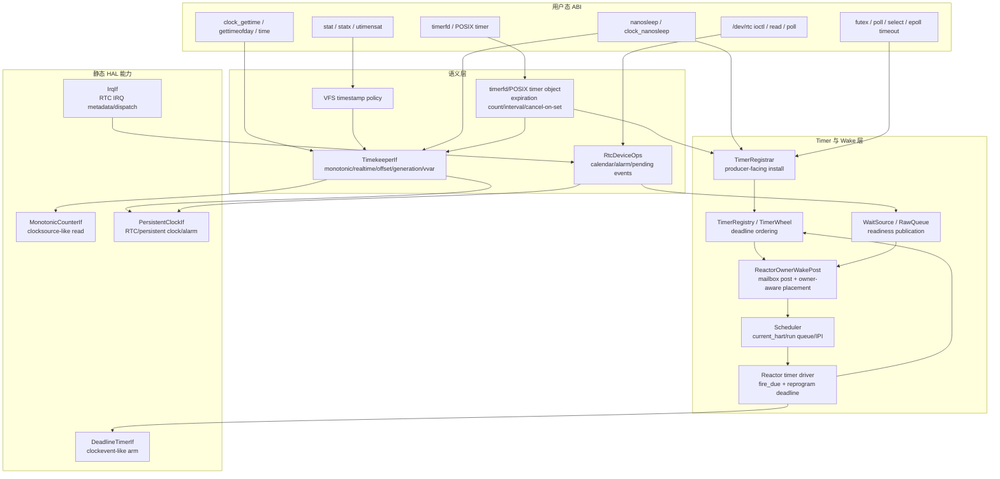

全局拆分理由：

1. `CLOCK_REALTIME` 不是 RTC 芯片本身，而是 timekeeper 中的
   `monotonic + offset` 语义。
2. deadline 存储不是用户 timer 对象。timerfd 的 expiration count、
   interval、cancel-on-set 仍然由 timerfd 对象拥有。
3. wake hint 不是成功结果。被唤醒的 future 必须重新观察 pipe、futex、
   RTC、socket、signal、timerfd 等语义状态。
4. mailbox 是 task identity，不是 hart identity。task 被 steal 之后，
   wake 必须在发生时重新解析 scheduler owner。

## 3. Linux 参考映射

Tx 不复制 Linux 的所有数据结构，但保留 Linux 的职责分层。

| Linux 功能群 | Linux 职责 | Tx 对应 |
|---|---|---|
| clocksource | 读取稳定单调硬件计数器，提供转换元数据 | `MonotonicCounterIf`，板级 conversion |
| clockevents | 为 CPU 或 broadcast domain 编程 timer interrupt | `DeadlineTimerIf` |
| timekeeping | 维护 realtime、monotonic、raw、boottime、vDSO state | `TimekeeperIf` / `wall_clock` |
| hrtimer | 维护高精度 deadline 队列 | `TimerRegistry` / `TimerWheel` |
| timer wheel | 服务低精度内核 timeout callback | v1 统一到同一个 registrar facade，具体结构内部化 |
| RTC class | 暴露持久日历时钟和 alarm 设备 | `PersistentClockIf` + `RtcDeviceOps` |
| alarmtimer | 把 suspend-aware clock 与 RTC wake alarm 组合 | v2 扩展槽，复用 persistent clock 和 timer registry |
| scheduler wakeup | 选择 task 的运行 CPU，发送 IPI | `ReactorOwnerWakePost` + Scheduler |
| vDSO/vvar | 用户态快速读 timekeeper snapshot | timekeeper-owned vvar snapshot |
| VFS timestamp | inode 时间戳使用一致 wall time | VFS timestamp policy over `TimekeeperIf` |

Linux 给 Tx 的关键启发不是“上层接口多”，而是每一类状态都有自己的 owner：
硬件计数器、可编程中断、墙上时间、软件 deadline、fd 语义、设备 pending state、
wait queue、scheduler placement 都不能互相代管。

## 4. 模块边界总表

| 模块 | 拥有状态 | 下层接口 | 上层接口 | 可触及模块 | 禁止职责 |
|---|---|---|---|---|---|
| 板级 counter backend | raw counter 读取、频率/换算假设 | CSR/MMIO/SBI/firmware | `MonotonicCounterIf` | boot、timekeeper、observe | realtime offset、deadline interrupt、task wake |
| 板级 deadline backend | 当前 hart timer 编程 | CSR/MMIO/SBI timer、IRQ | `DeadlineTimerIf` | trap/IRQ、reactor | software timer list、timerfd 语义、scheduler placement |
| 板级 persistent-clock backend | RTC 寄存器、firmware clock、alarm ack | RTC MMIO/firmware | `PersistentClockIf` | timekeeper seed、RTC device、IRQ | 定义 `CLOCK_REALTIME`、创建 RNode、解析 fd flags |
| Timekeeper | realtime offset、generation、vvar snapshot | `MonotonicCounterIf`、可选 `PersistentClockIf` | `TimekeeperIf` | clock syscalls、VFS、timerfd、vDSO | 编程硬件 timer、保存 fd/timerfd 状态 |
| Timer Registry | deadline entry、token、guard/cancel state | monotonic deadline、Weak mailbox | `TimerRegistrar`、`TimerRegistry` | sleep、futex、timerfd、delegate、device timer、reactor | 选择 CPU、保存 timerfd count |
| WaitSource/RawQueue | subscriber、ready bits、generation | subsystem 语义状态变化 | `notify_with_owner_post` / raw queue fire | pipe、futex、TTY、RTC、net、process、reactor | scheduler placement、把 ready 当成 syscall 成功 |
| Reactor timer driver | per-hart timer tick、due walk、deadline reprogram | `MonotonicCounterIf`、`DeadlineTimerIf`、`TimerRegistry` | timer firing and wake route | IRQ、scheduler、timer registry | 解释 fd/RTC/futex 语义 |
| Owner-aware wake router | mailbox post、owner re-resolution、IPI 请求 | mailbox owner、scheduler current owner | `ReactorOwnerWakePost` | timer、wait-source、delegate、signal、device | 保存 stale hart、拥有 event 语义真值 |
| Scheduler | task lifecycle、run queue、work stealing/current_hart | task table、per-hart queue、IPI | runnable placement API | reactor wake router | 解析 timer role、访问 RTC/fd 状态 |
| RTC device ops | RTC time/alarm/pending event、read/poll ioctl 语义 | `PersistentClockIf`、RTC IRQ、emulated timer | `RtcDeviceOps` via `CharDeviceOps` | devfs、VFS、poll/epoll、reactor | 成为 realtime clock、直接构造 HAL、直接创建 RNode |
| Devfs/RNode | device path identity、fd dispatch、permission/path 集成 | typed device operation object | VFS file operations | RTC、TTY、block device、mount/VFS | 直接访问板级 RTC/MMIO、字符串特判设备语义 |

如果一个新 helper 同时跨过两行，比如从 HAL IRQ 直接唤醒 task 或从 syscall
直接设置 `DeadlineTimerIf`，它就不是一个合法公共接口。

## 5. 硬件能力层

### 5.1 设计动机

硬件层必须拆成三类能力：

- 读取单调计数器：回答“现在的 monotonic time 是多少”。
- 编程 deadline interrupt：回答“当前 hart 什么时候被 timer interrupt 唤醒”。
- 读取/写入持久墙上时间或 alarm：回答“RTC/firmware 里保存的日历时间是什么”。

一个物理外设可能同时提供其中两类能力，但上层接口不能因此合并。
SiFive/RISC-V、LoongArch/2K、QEMU virt、无 RTC 板卡都应该落在同一组 trait 上。

### 5.2 接口

```rust
pub trait MonotonicCounterIf {
    fn read_ns() -> u64;
    fn frequency_hz() -> u64;
}

pub trait DeadlineTimerIf {
    fn set_deadline_ns(deadline: u64);
    fn cancel_deadline();
    fn enable_timer_wakeups() {}
}

pub trait PersistentClockIf {
    fn read_realtime_ns() -> Result<u64, PersistentClockError>;
    fn set_realtime_ns(ns: u64) -> Result<(), PersistentClockError>;
    fn set_wake_alarm_ns(ns: u64) -> Result<(), PersistentClockError>;
    fn clear_wake_alarm() -> Result<(), PersistentClockError>;
    fn acknowledge_wake_alarm_irq() -> Result<(), PersistentClockError>;
}
```

### 5.3 子架构

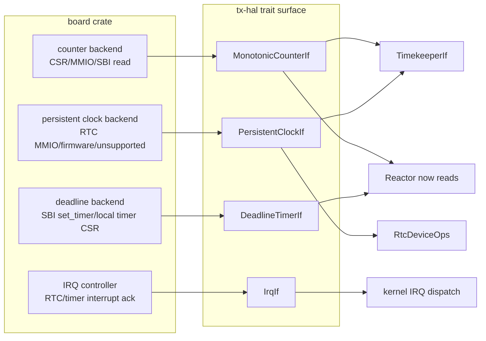

### 5.4 上下接口

下层输入：

- 固件交接和设备树/板级常量；
- CSR/MMIO/SBI 访问；
- interrupt controller 注册、mask/unmask、ack；
- board-local tick/calendar 到 ns 的转换。

上层输出：

- `read_ns()` 提供 monotonic ns；
- `set_deadline_ns()` 只影响当前 hart timer deadline；
- persistent clock API 返回 typed capability error；
- RTC IRQ 编号和 `acknowledge_wake_alarm_irq()` 只提供硬件边界，不发布 devfs 事件。

相邻模块：

- [`HAL_v1.md`](../../design/01_substrate/HAL_v1.md) 定义静态平台选择，
  禁止 runtime HAL manager 对象重新出现。
- [`DEVICE.md`](../../design/06_devices/DEVICE.md) 拥有 tier-2 typed device
  构造；HAL 只报告硬件事实。
- Reactor 消费 deadline programming；timekeeper 消费 counter 和 persistent
  seed；RTC device ops 消费 persistent-clock 方法。

### 5.5 板级建模 Profile

Tx 应始终按三类能力建模板级时间硬件，即使某个物理模块同时提供其中多类能力。
这样 SiFive/RISC-V、LoongArch/2K、QEMU profile 和无 RTC 板卡都能共享上层架构。

| 平台族 | Monotonic counter | Deadline timer | Persistent clock / RTC | 建模规则 |
|---|---|---|---|---|
| SiFive/RISC-V-like | `time` CSR、CLINT `mtime`、SBI time 或平台 counter | SBI `set_timer`、CLINT `mtimecmp` 或 local timer | 可选 board RTC、firmware clock 或 unsupported | counter 和 deadline 独立实现；RTC 缺失返回 typed `PersistentClockIf` error |
| LoongArch/2K-like | 架构稳定 counter 或 SoC counter block | local timer CSR / interrupt-controller timer route | LS7A/board RTC 或 firmware clock | calendar register 转 ns 留在 board backend，上层只看 ns/error |
| QEMU virt profile | emulated architectural counter | emulated platform timer | goldfish/LS7A RTC | QEMU backend 是 deterministic witness，不把 QEMU 名称泄漏进 syscall/shim |
| no-RTC embedded profile | stable counter | current-hart timer | unsupported | boot realtime 使用 fallback epoch；`/dev/rtc` 返回 typed unsupported device result |

跨板合同不以具体外设命名：

```text
counter backend       -> MonotonicCounterIf
deadline backend      -> DeadlineTimerIf
persistent RTC/clock  -> PersistentClockIf
optional RTC IRQ fact -> IrqIf::RTC_IRQ + PersistentClockIf::acknowledge_wake_alarm_irq
```

这个拆分让真实板卡 bring-up 可以分阶段落地。板卡可以先提供 monotonic/deadline，
在 RTC backend 未完成时让 persistent clock 返回 unsupported；timekeeper、timer
registry、reactor 和 VFS timestamp 结构都不需要因为 RTC 后续补上而重写。

## 6. Core Timekeeper

### 6.1 职责

`TimekeeperIf` 是 Tx 的语义时间 owner。它负责：

- `CLOCK_MONOTONIC`；
- `CLOCK_REALTIME = monotonic + realtime_offset`；
- realtime generation，用来标记墙上时间跳变；
- vvar/vDSO snapshot；
- boot 阶段从 persistent clock seed realtime；
- `clock_settime` / `settimeofday` 后的 best-effort persistent writeback；
- realtime absolute deadline 到 monotonic deadline 的转换。

它不负责硬件 deadline，也不负责 `/dev/rtc` fd 语义。

### 6.2 状态模型

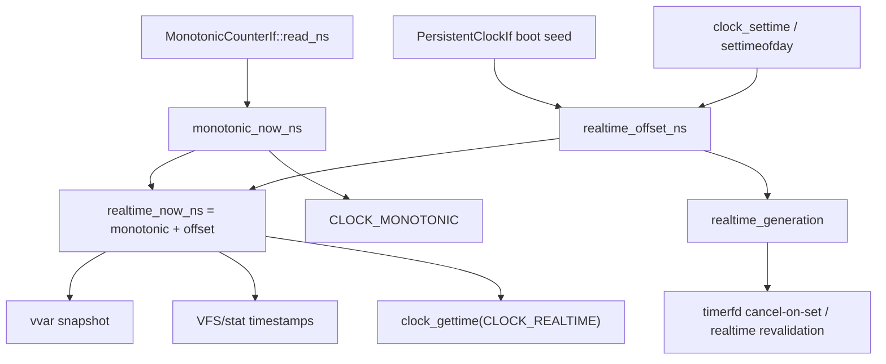

### 6.3 接口和调用者

| 接口 | 调用者 | 语义 |
|---|---|---|
| `monotonic_now_ns<P>()` | sleep、timeout、observe、clock syscall | 读取单调时间 |
| `realtime_now_ns<P>()` | clock syscall、VFS timestamp | 读取墙上时间 |
| `set_realtime_ns<P>()` | `clock_settime`、`settimeofday` | 修改 timekeeper wall time，bump generation |
| `seed_realtime_from_persistent<P>()` | boot/vDSO init | 从 RTC/firmware 初始化 offset |
| `monotonic_deadline_from_realtime_ns()` | timerfd、clock_nanosleep | 把 realtime absolute deadline 转为 monotonic |
| `snapshot_for_vvar()` / `publish_vvar()` | kernel vDSO bootstrap、time mutation | 发布快速读 snapshot |

`RTC_SET_TIME` 不调用 `TimekeeperIf::set_realtime_ns()`。它是 device ioctl，
应该走 `RtcDeviceOps::set_time()`。

### 6.4 Boot Seed Flow

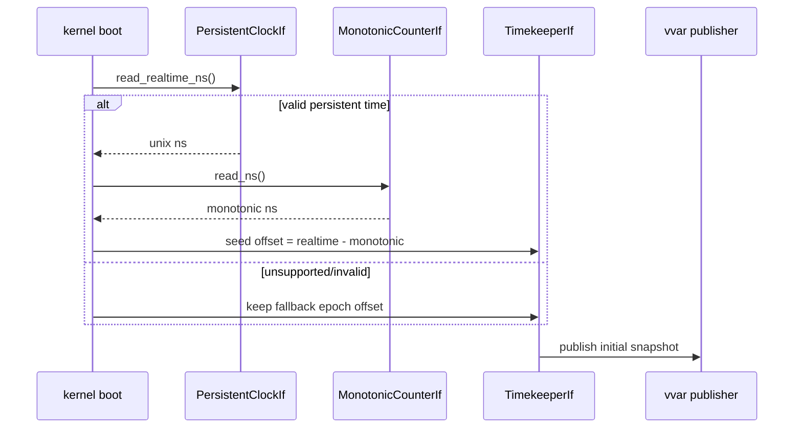

boot seed 的关键不是“以后所有 realtime 都读 RTC”，而是在 boot 时把
persistent wall time 转成 timekeeper offset。之后 `CLOCK_REALTIME` 热路径仍是
`monotonic_now + offset`，RTC 只在显式 device 操作或 best-effort writeback 中出现。

### 6.5 Runtime Mutation Flow

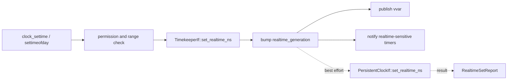

系统 realtime mutation 在 timekeeper 接受新 offset 后即成立。persistent writeback
是单独报告的 best-effort 结果，默认策略下不能因为 RTC 写回失败而回滚已经接受的
kernel realtime。`/dev/rtc RTC_SET_TIME` 则是另一条设备语义路线：它目标是持久
设备本身，走 `RtcDeviceOps`，不直接改变 `CLOCK_REALTIME` offset，除非后续设计
明确加入“RTC device 写入联动 system clock”的 policy helper。

## 7. Software Timer Registry

### 7.1 职责

Timer Registry 是 deadline substrate。它只保存 monotonic deadline entry，
并在到期时把 entry 交给 router。它不保存 timerfd count、futex bucket、
fd readiness、signal policy 或 scheduler queue。

### 7.2 接口

```rust
pub trait TimerRegistrar {
    fn install_for_task(
        &self,
        deadline: Deadline,
        role: TimerGuardRole,
        mailbox: Weak<TaskMailbox>,
    ) -> TimerGuard;
}

pub trait TimerRegistry {
    fn fire_due_with<R>(&self, now_ns: u64, router: &mut R) -> usize
    where
        R: TimerWakeRouter + ?Sized;
    fn next_deadline_ns(&self) -> Option<u64>;
}

pub trait TimerWakeRouter {
    fn post_timer_fired(&mut self, mailbox: Weak<TaskMailbox>, token: TimerToken, role: TimerGuardRole);
    fn post_delegate_timeout(&mut self, delegate_token: DelegateTokenId);
    fn post_source_fired(&mut self, source: WaitSourceId, interests: InterestMask) -> usize;
    fn post_mailbox_ref_event(&mut self, mailbox: &TaskMailbox, event: MailboxEvent) -> bool;
}
```

### 7.3 子架构

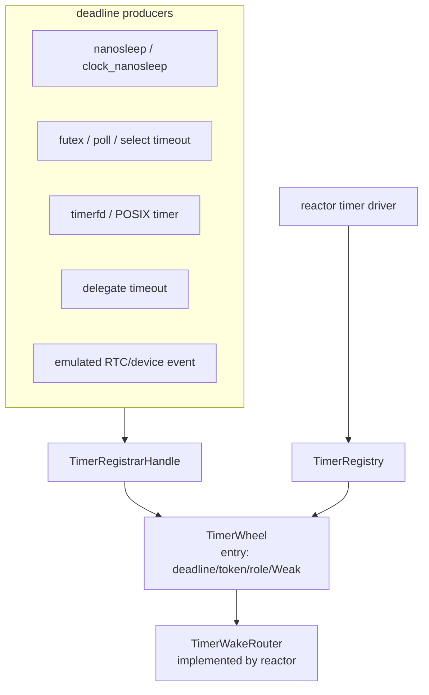

### 7.4 语义规则

- entry 的 `deadline_ns` 是 absolute monotonic time。
- entry 的 `mailbox` 是 task mailbox identity，不是注册时的 hart。
- `TimerGuard` 负责 cancel 生命周期。
- fire 与 cancel 竞态通过“wake 是 hint，future 重新观察语义状态”闭合。
- `TimerWheel` 可以继续作为内部结构，但对外只能暴露 registrar/registry/router
  三个角色。

## 8. Reactor Timer Driver

### 8.1 职责

Reactor 是唯一把下面四件事放在一起的层：

- 读取当前 monotonic time；
- 执行 `TimerRegistry::fire_due_with()`；
- 用 `TimerWakeRouter` 路由 due event；
- 根据 `next_deadline_ns()` 编程 `DeadlineTimerIf`。

### 8.2 per-hart tick 流程

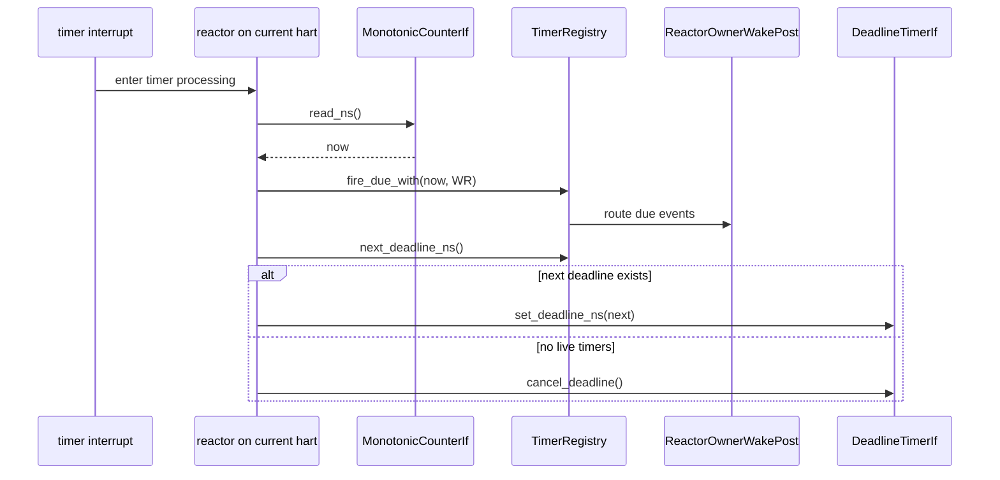

新插入更早 deadline 时，需要让 timer-driving reactor 重新检查并编程硬件
deadline。这个机制可以是本地信号、remote reschedule signal 或后续更细的
timer reprogram request，但不能让 producer 直接调用 `DeadlineTimerIf`。

### 8.3 Reactor-facing 接口

输入：

- `TimerRegistry::next_deadline_ns()`；
- `TimerRegistry::fire_due_with(now, router)`；
- `MonotonicCounterIf::read_ns()`；
- `DeadlineTimerIf::{set_deadline_ns,cancel_deadline}`；
- scheduler current-owner / placement API。

输出：

- `TimerFired`、`Abort(TimedOut)`、`SourceFired` 等 mailbox event；
- scheduler placement request；
- 目标 hart 为 remote 时的 reschedule IPI；
- fired、cancelled、dead/stale timer 的 observation record。

相邻模块：

- wait adapter 用 registrar 安装 timeout guard；
- delegate machinery 用 role-tagged timeout entry；
- device emulation 可以使用 `DeviceEvent` timer role；
- scheduler 提供 race-closed current-owner 路径。

Reactor-facing 接口的要点是“它拥有 current hart context”，因此它能把 due walk、
deadline reprogram 和 owner-aware post 放在同一处完成。普通 producer 即使知道
自己需要一个更早 deadline，也只能通过 registry/信号让 reactor 重新编程硬件。

## 9. Wait Source 与 Wake Router

### 9.1 职责

Wait source 表示非时间条件的 readiness/event hint，例如：

- pipe readable/writable；
- futex wake；
- TTY input readable；
- RTC pending event；
- socket accept/recv/send readiness；
- process exit-source；
- signalfd/eventfd/io_uring/AIO readiness。

这些 producer 都应该收敛到同一个 owner-aware post 形态。

### 9.2 统一 wake 路径

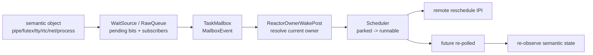

### 9.3 owner-aware post 协议

`ReactorOwnerWakePost` 的目标是关闭 post-steal wake race：

1. producer 找到 task mailbox 或 wait-source subscriber；
2. 向 mailbox 投递 `MailboxEvent`；
3. 读取 mailbox 绑定的 scheduler owner；
4. 在 scheduler queue/placement 协议下重新检查 owner；
5. 如果 task 仍 parked，则变为 runnable；
6. 如果目标 hart 是 remote，先让 task 对目标队列可见，再发送 reschedule IPI。

禁止在 Timer Registry、WaitSource、RTC device、timerfd 或 socket readiness
里保存“注册时 hart”作为唤醒目标。

### 9.4 Timer 与 Wait-source 收敛

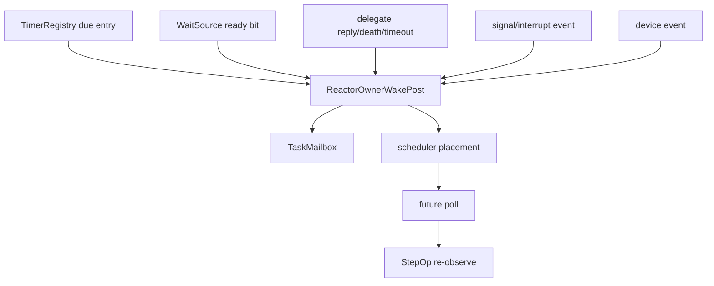

目标状态是所有长生命周期 wake producer 都进入这一条路径。captured local waker
可以作为局部优化或过渡测试辅助，但不能成为 SMP 正确性的 authority。只要一个
producer 的 correctness 依赖“当初注册时的本地 waker 一定还在正确 hart 上”，
它就没有通过 post-steal wake 设计审查。

## 10. Future、StepOp 与 Timeout

Tx 的执行模型应该这样分工：

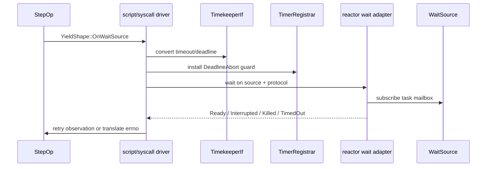

规则：

- `StepOp` 不直接 arm timer。
- `TimedOut` 只说明 timeout guard fired，不代表 semantic operation 可以提交。
- `Ready` 只说明有 hint，driver 必须重新观察对象状态。
- timeout guard 在 readiness、signal、kill、cancel 后必须被 drop/cancel。
- realtime absolute timeout 需要携带 generation 语义，让 timerfd 或
  clock_nanosleep 决定 rebase、expire、cancel 或 retry。

## 11. RTC 与设备路线

### 11.1 双重身份

RTC 同时出现在两个位置：

- 硬件能力：`PersistentClockIf` 用于 boot seed、best-effort writeback、
  alarm programming、IRQ ack。
- 用户设备：`RtcDeviceOps` 负责 `/dev/rtc` ioctl/read/poll 的 Linux ABI 语义。

这两个身份必须通过 device state 连接，而不是让 HAL 直接碰 devfs/RNode。

### 11.2 子架构

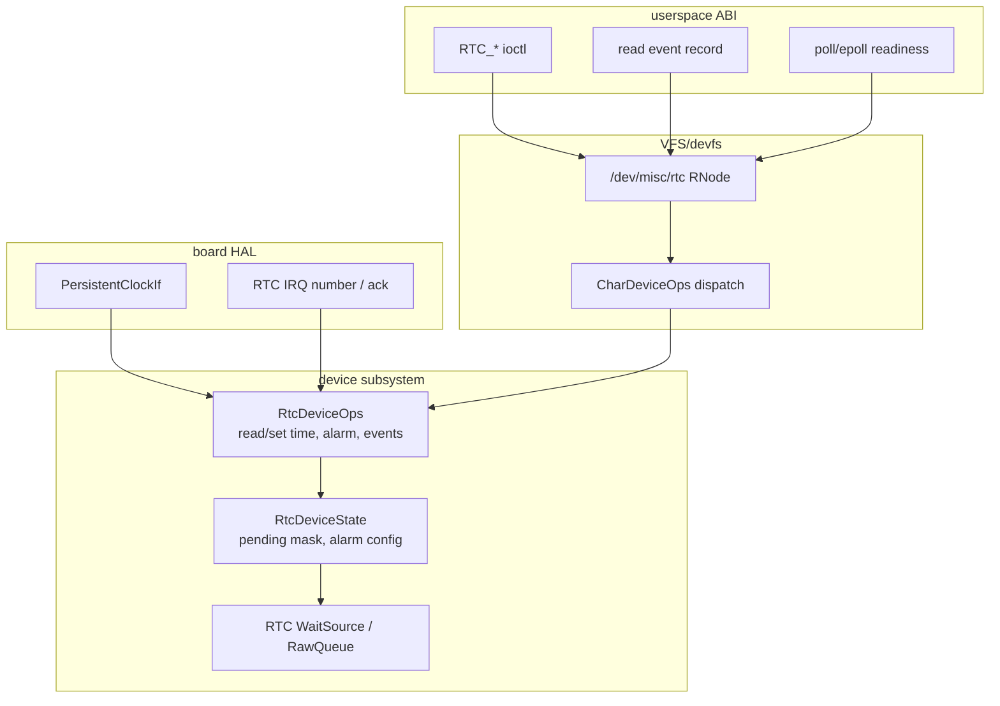

### 11.3 RTC event 规则

- hardware alarm IRQ、emulated alarm timer、未来 update/periodic interrupt
  都先设置 RTC pending event bits。
- pending bits fire RTC wait source。
- `poll`/`epoll` 观察 pending state。
- `read(2)` 消费 Linux-shaped event record。
- `RTC_RD_TIME` / `RTC_SET_TIME` / `RTC_ALM_READ` / `RTC_ALM_SET` 走
  `RtcDeviceOps`，不是 syscall-local fixed-time stub。

### 11.4 devfs/RNode 边界

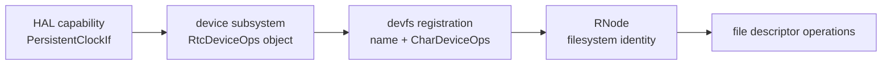

RNode 是文件系统 identity。HAL 不创建 RNode，不调用 VFS path walker，
不解析 fd flags。后续 console、TTY、block、netdev 等设备也应采用同一模式：
HAL/driver 提供能力或 transport，subsystem trait 提供 typed operations，
devfs/RNode 只负责路径和 fd 投影。

## 12. SMP 与 future stealing

### 12.1 需要关闭的竞态

```text
T0: task A 在 hart 0 park，注册 timer token X
T1: scheduler steal/migrate task A，current owner 变成 hart 2
T2: token X 在 hart 0 或 timer-driving hart 上到期
T3: wake 必须投递给 task A，并按当前 owner hart 2 入队
```

解决方式：

- timer entry / wait source 保存 mailbox/task identity；
- work stealing 只改变 scheduler owner；
- wake 发生时通过 mailbox owner 重新解析 current owner；
- remote IPI 在 task 对目标 queue 可见之后发送。

### 12.2 owner-aware wake 图

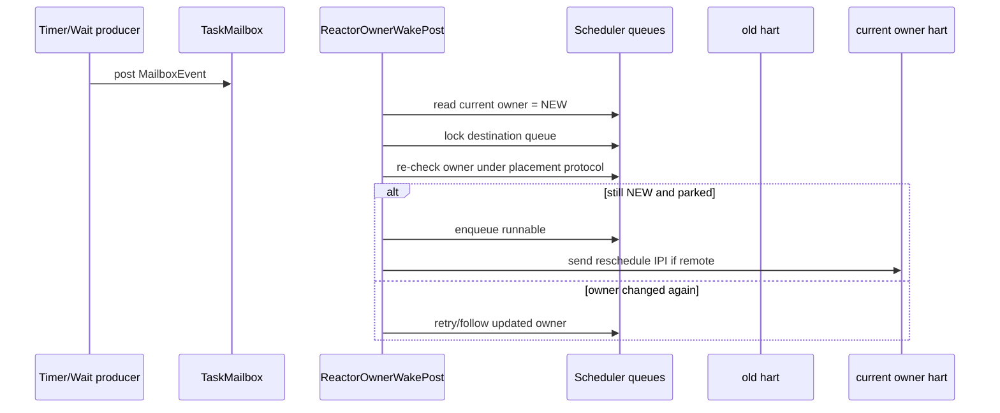

## 13. ABI 覆盖

### 13.1 初始 clock 类

| Clock | v1 行为 | 后续扩展 |
|---|---|---|
| `CLOCK_MONOTONIC` | `MonotonicCounterIf::read_ns()` | suspend/discipline 精细化 |
| `CLOCK_REALTIME` | monotonic + offset | NTP/leap/time namespace |
| `CLOCK_MONOTONIC_RAW` | 暂时等价 raw monotonic | 独立 raw/discipline split |
| `CLOCK_REALTIME_COARSE` / `CLOCK_MONOTONIC_COARSE` | 可由同一 snapshot 降精度 | 更低成本 coarse cache |
| `CLOCK_BOOTTIME` | v1 可先按 monotonic 近似 | suspend accounting |
| CPU clocks | deferred | scheduler accounting |
| alarm clocks | RTC alarm extension slot | alarmtimer/power management |

### 13.2 ABI path matrix

| ABI | 主要路径 | 验证重点 |
|---|---|---|
| `clock_gettime` | syscall/vDSO -> `TimekeeperIf` | realtime 不直接读 RTC |
| `settimeofday` / `clock_settime` | permission -> `TimekeeperIf` mutation -> vvar publish -> timerfd notification -> optional RTC writeback | monotonic 不跳变，generation 增加 |
| `nanosleep` | timeout conversion -> `TimerRegistrar` -> reactor wait | signal/timeout race 后重新观察 |
| futex/poll/select timeout | wait-source subscribe + `DeadlineAbort` guard | readiness 与 timeout race 不直接提交 |
| timerfd | timerfd object -> registry -> expiration count -> fd readiness | count 和 interval 由 timerfd owner 保存 |
| `/dev/rtc` ioctl/read/poll | RNode -> `CharDeviceOps` -> `RtcDeviceOps` -> persistent clock/state | pending event/read/poll 一致 |
| VFS timestamp | filesystem/VFS policy -> `TimekeeperIf::realtime_now_ns` | stat 与 clock realtime 来源一致 |

## 14. 数据结构摘要

本节把“谁拥有状态”落成实现者能检查的字段形状。具体 Rust 名称可以随实现演进，
但字段所属 owner 不能漂移。

### 14.1 Timekeeper

```text
Timekeeper {
    realtime_offset_ns: AtomicI64,
    realtime_generation: AtomicU64,
    vvar: VvarPage,
    seed_provenance: Once/Atomic enum,
}
```

关键操作：

- 读取 monotonic；
- 计算 realtime；
- 修改 offset 并递增 generation；
- 发布 vvar；
- 把 absolute realtime deadline 转成 monotonic deadline，并携带 generation。

### 14.2 Timer Registry

```text
TimerEntry {
    deadline_ns: u64,
    token: TimerToken,
    role: TimerGuardRole,
    mailbox: Weak<TaskMailbox>,
    state: live/cancelled/fired,
}

TimerGuard {
    token: TimerToken,
    registry weak ref,
}
```

关键操作：

- 安装 entry 并返回 guard；
- guard drop/cancel 时取消 entry；
- due walk 只通过 router fire；
- 报告下一条 live deadline。

`TimerEntry` 只保存 deadline 机制信息。timerfd expiration count、interval、
futex bucket、socket readiness、RTC pending bits 都不属于这里。

### 14.3 Task Mailbox 与 Wake State

```text
TaskMailbox {
    generation,
    pending_events,
    overflow,
    registered_waker,
    scheduler_hint/current-owner binding,
}

TaskWakeState {
    parked/runnable/running/completed state,
    current_hart,
}
```

Mailbox 存 wake hint 和稳定 task identity；scheduler state 存 placement。
task migration 或 steal 改变的是 scheduler owner，不改变 mailbox identity。

### 14.4 WaitSource / RawQueue

```text
WaitSource {
    subscribers,
    generation,
    interests,
    readiness_hint,
}

RawQueue {
    pending records or bits,
    subscriber fanout,
    source generation,
}
```

Wait source 的语义是“值得重新 poll”。它不证明 pipe 一定可读、futex 一定成功、
socket 一定 accept 成功，也不证明 timerfd read 可以提交；所有这些都要回到
semantic owner 重新观察。

### 14.5 RTC Device

```text
RtcDeviceState {
    pending_mask,
    alarm_enabled,
    alarm_time_ns,
    wait_source,
    open_state / fd flags policy,
}
```

RTC device state 拥有 Linux-shaped 行为。HAL 只执行 persistent clock/alarm 的
硬件操作，不能拥有 pending mask、blocking read、poll readiness 或 fd flags policy。

### 14.6 接口合同摘要

| 接口 | 调用者问题 | callee 可以修改 | callee 禁止修改 |
|---|---|---|---|
| `MonotonicCounterIf` | 当前稳定 counter time 是多少？ | board-local observation/cache | realtime offset、timer queue、task state |
| `DeadlineTimerIf` | 当前 hart 何时收到 monotonic deadline interrupt？ | board-local timer compare/enable | software timer entry、task mailbox、fd state |
| `PersistentClockIf` | 持久 wall clock/alarm 能力如何读写？ | RTC/firmware register | `CLOCK_REALTIME` offset、devfs node、poll readiness |
| `TimekeeperIf` | 语义 clock 怎么读/改？ | realtime offset、generation、vvar | hardware deadline、RTC fd event queue |
| `TimerRegistrar` | 给 mailbox 注册 deadline | registry entry set | scheduler queue、timerfd count |
| `TimerRegistry` | 哪些 entry due、下一 deadline 是什么？ | fired/cancelled registry state | semantic object state、hardware register |
| `TimerWakeRouter` | due timer role 如何转成 wake hint？ | 通过注入路径做 role-specific publication | timer ordering data structure |
| `WaitSource` / `RawQueue` | 向 subscriber 发布 readiness | readiness bits、generation、subscriber fanout | operation result truth、CPU placement |
| `ReactorOwnerWakePost` | mailbox event 如何变成 runnable placement？ | mailbox event queue、scheduler placement、IPI request | pipe/futex/RTC/timerfd semantic state |
| `RtcDeviceOps` | Linux RTC fd operation 怎么执行？ | RTC pending bits、alarm config、persistent backend operation | timekeeper realtime offset，除非显式 policy helper 允许 |
| `CharDeviceOps` / RNode | fd operation 如何 dispatch 到 typed device？ | VFS-visible file/device dispatch state | board MMIO/CSR state |

两个推论很重要：

- 既需要 semantic object state 又需要 scheduler placement 的方法，必须拆成
  semantic mutation + caller-injected post closure。
- 既需要 HAL RTC access 又需要 RNode state 的方法，必须拆成 typed device ops +
  devfs projection。

## 15. 实施包

| 包 | 目标 | 完成条件 |
|---|---|---|
| A. HAL split | 退休宽泛 `TimeIf`，改为 counter/deadline/persistent clock 三类能力 | active Rust 无 `TimeIf`，board crate 实现窄 trait |
| B. Timekeeper facade | `CLOCK_*`、VFS timestamps、vvar、realtime mutation 走 `TimekeeperIf` | realtime = monotonic + offset，mutation bump generation |
| C. Timer registry facade | producer 只见 `TimerRegistrar`，reactor 只见 `TimerRegistry` | 无私有 `TimerQueue` / `DeadlineFuture` hot path |
| D. Reactor owner-aware wake | timer expiry 与 wait source wake 通过 `ReactorOwnerWakePost` | post-steal wake 重新解析 owner |
| E. RTC device route | `/dev/rtc` 通过 `RtcDeviceOps` 和 devfs/RNode | 无 syscall-local fixed RTC，HAL 不碰 RNode |
| F. Linux ABI completion slots | 补 timerfd、itimer、clock_nanosleep、VFS timestamp 等细节 | 每个 ABI 有明确 owner 和测试 |
| G. Wake producer convergence | pipe/futex/eventfd/signalfd/socket/IPC/RTC/AIO/io_uring/VFS/TTY 等 producer 统一 `_with_post` seam | 旧 direct wrapper active Rust audit 绿 |
| H. Board evidence | QEMU + 真实板卡/firmware RTC 证据，SMP mixed-producer stress | board witness 与 stress witness 记录在 progress；RV64 QEMU owner-wake witness 已闭合，真实板卡/firmware RTC 仍需外部证据 |

### 15.1 Package A：HAL Split

退出条件：

- active public Rust interface 中没有宽泛 `TimeIf`；
- `TxPlatform` 直接命名 `MonotonicCounterIf`、`DeadlineTimerIf`、
  `PersistentClockIf`；
- 每个 board 对 absent persistent clock 有显式 unsupported 行为；
- host/board test 证明 generic kernel code 依赖 trait surface，而不是 board crate。

### 15.2 Package B：Timekeeper Facade

退出条件：

- 所有 clock syscall 和 VFS timestamp 通过 `TimekeeperIf` 读时间；
- realtime mutation 递增 generation 并发布 vvar；
- boot 在 persistent clock 可用时 seed realtime；
- hot `CLOCK_REALTIME` 路径不读 RTC。

### 15.3 Package C：Unified Timer Registry

退出条件：

- sleep、futex/poll timeout、delegate timeout、timerfd deadline 都用
  `TimerRegistrar`；
- reactor-local timeout queue 被删除或仅作为 facade 下的内部兼容细节；
- `TimerRegistry::fire_due_with` 是唯一 production expiry walk；
- guard 生命周期覆盖 fire/cancel race。

### 15.4 Package D：Reactor Owner-aware Wake

退出条件：

- timer expiry、wait-source readiness、delegate reply/timeout、signal/device wake
  进入同一 `ReactorOwnerWakePost` 或 injected-post route；
- post-steal wake test 证明 stale hart identity 不被使用；
- remote wake IPI 在目标 queue 对 task 可见之后发送。

### 15.5 Package E：RTC Device Route

退出条件：

- `/dev/rtc` 或 `/dev/misc/rtc` 由 typed `RtcDeviceOps` 支撑；
- `RTC_RD_TIME`、`RTC_SET_TIME`、alarm read/set、read、poll、epoll 不含
  HAL-specific path/string logic；
- hardware IRQ 和 emulated alarm 都通过同一个 RTC pending state + wait source。

### 15.6 Package F：Linux ABI Completion Slots

退出条件：

- timerfd interval/count/cancel-on-set 语义留在 timerfd state；
- realtime jump 由 owning ABI object 决定 rebase、expire、cancel 或 retry；
- POSIX timer 和 interval timer 使用 registrar，不拥有 wheel；
- boottime/alarm clock 后续支持落在 timekeeper + persistent clock extension point。

### 15.7 Package G：Owner-aware Wake Producer Convergence

退出条件：

- 每个已经有 reactor/scheduler context 的 producer 都通过
  `ReactorOwnerWakePost` 或 syscall/reactor injected-post closure 发布 mailbox；
- semantic subsystem 在自己拥有 readiness state 的位置暴露 `_with_post` 或等价
  seam；
- 迁移完成的 producer 不保留平行 direct wrapper 作为 active production route；
- 不引入 `tx-subsystems -> tx-reactor` placement dependency；
- focused test 证明每个 producer family 使用 injected-post path，waiter wake 后
  仍重新观察 semantic state。

第 21 节的 producer 目录是实施计划的一部分，不是状态注释。新增 producer family
如果不适合已有 row，应先补 producer 目录，再实现。

### 15.8 Package H：Board Evidence 和 Linux-parity Extension

退出条件：

- 每个支持的 board profile 声明三类硬件能力分别是 real、emulated 还是 unsupported；
- RTC-capable profile 有 boot seed witness 和 alarm publication witness；
- RTC-absent profile 返回 typed unsupported，不改变 timekeeper 或 devfs 结构；
- 后续 `RTC_WKALM_*`、periodic/update interrupt、alarm clock、boottime suspend
  accounting 等 Linux parity 工作只使用第 13/18 节的 extension point。

## 16. Producer 迁移规则

每个 wake producer 的合法形态是：

```rust
fn publish_with_post<F>(..., post: F) -> ...
where
    F: FnMut(&TaskMailbox, MailboxEvent) -> bool;
```

或 mailbox-ref 形态：

```rust
fn publish_with_post<F>(..., post: F) -> ...
where
    F: FnMut(&TaskMailbox, MailboxEvent, MailboxSchedulerHint) -> bool;
```

规则：

- subsystem 拥有语义状态和 subscriber list；
- scheduler-context caller 注入 `SyscallCtx` 或 reactor wrapper 的 owner-aware post；
- no-context host/test caller 必须显式传 direct post closure；
- 不保留同名 direct wrapper 作为平行公共接口；
- audit 以 retired-name grep 为准，不以“测试能过”为准。

## 17. 验收计划

### 17.1 静态 retired-interface gate

实现完成前必须保持这些类别无 active Rust 命中：

- 统一回归入口：`cargo xtask lint invariants time-wake-retired`；
- 宽泛旧时间接口：`TimeIf`、`TimerQueue`、`DeadlineFuture`、`timer_sleep`、
  `install_timer_queue`、`TimerWheel::fire_due` direct route；
- 旧 wake direct wrapper：`notify_v3_source`、`notify_source`、
  `step_kill_process`、`route_gewalt`、`post_signal`、`post_signal_mailbox`、
  `script_deliver_signal`、
  `publish_rtc_event`；
- 旧 producer direct verbs：socket `fire_recv/fire_send/fire_accept`、
  net `publish_to/publish`、AIO/io_uring `push_completion/push_cqe`、
  RTC raw queue direct access、pipe `step_read/step_write` + `ReadOp/WriteOp`、
  userfaultfd `push_fault_msg/fault_script_for_process` 等。

### 17.2 功能 gate

| 场景 | 必要证据 |
|---|---|
| clock read | monotonic/realtime syscall tests，vvar seed path test |
| realtime mutation | `clock_settime` / `settimeofday` generation、timerfd cancel-on-set、persistent writeback report |
| sleep/timeout | nanosleep、clock_nanosleep、futex/poll/select timeout focused tests |
| timerfd | expiration count、read drain、poll/epoll readiness、realtime jump |
| RTC | ioctl read/set/alarm、read/poll pending event、hardware IRQ path、emulated fallback |
| VFS timestamp | stat/statx/utimensat 与 timekeeper 来源一致 |
| SMP wake | post-steal timer/wait-source/delegate/device wake，remote IPI after enqueue |

当前 host 级 mixed-producer witness 是：

```sh
cargo test -p tx-reactor --test reactor_smoke mixed_producer_wakes_repeatedly_route_current_owner
```

该测试让同一个 parked task 依次被 wait-source、timer expiry、delegate reply
三类 producer 从非 owner hart 唤醒。每一步都必须经过 owner-aware placement、
发送 remote reschedule signal，并让 task 重新 poll 后再进入下一阶段。它补强
SMP/mixed-producer 证据，但本身只是 host witness。

更宽的 host 级 producer stress 是：

```sh
cargo test -p tx-reactor --test reactor_smoke broad_owner_aware_producer_stress_routes_remote_wakes
```

该测试把独立 parked task 分别通过 mailbox source event、signal delivery、
wait-channel publication、delegate timeout、device wait-source timer callback、
device RawQueue timer callback 从非 owner hart 唤醒。每一类 producer 都必须产生
一次 owner-aware placement 和一次 remote reschedule IPI，并在目标 hart 重新 poll
后完成。它扩大了 host 证据范围，但仍不能替代板级 witness。

当前 RV64 QEMU owner-wake witness 是：

```sh
cargo xtask test smoke --target rv64-qemu --timeout-ms 60000
cargo xtask test busybox-boot --target rv64-qemu --timeout-ms 60000
```

这两条 QEMU lane 现在要求同时出现 `:boot:ok` 和
`:reactor:owner-wake:smp:ok`。boot-time witness 在用户态启动前由 BSP 提交
AP-owned parked reactor task，然后从非 owner hart 依次通过 wait-source
publication、timer expiry、delegate reply 唤醒同一个 task；每个阶段都断言
owner-aware route、remote IPI 和 AP re-poll。它关闭 RV64 QEMU mixed-producer
SMP 证据缺口，但不等于真实板卡/firmware RTC witness，也不等于所有未来板卡的
SMP stress 已完成。

### 17.3 progress closeout

每个实现 slice 结束时必须更新：

- `docs/progress/STATUS.md`；
- 对应 research/decision/handoff；
- `cargo xtask progress validate`；
- 文档链接和 stale vocabulary lint；
- scoped test 与 retired-interface audit 输出。

## 18. 开放项和 v2 扩展

架构已覆盖 v1 需求，但实现完成仍需要证据：

- 真实板卡或 firmware RTC witness，不只依赖 QEMU goldfish/LS7A profile；
- 后续 LA64/真实板卡 SMP stress 可继续复用 RV64 owner-wake marker 形状；
- 更完整 Linux clock parity：NTP、TAI、leap second、time namespace、
  suspend-aware boottime/alarm clocks、CPU timers；
- timer data structure 可在保持 facade 不变的前提下从当前内部结构演进为
  wheel/heap/RB-tree/hybrid。

这些是 feature/evidence gap，不是架构 gap。补它们时不得重新打开
`TimeIf`、私有 reactor timer queue、HAL-to-devfs shortcut 或
per-subsystem scheduler hook。

## 19. 一页评审算法

评审任何 time/wake patch 时按这个顺序问：

1. 这个状态的 owner 是哪一行：HAL、timekeeper、timer registry、semantic object、
   RTC device、VFS/devfs、reactor wake router，还是 scheduler？
2. 它调用的下层接口是否是窄 trait，而不是跨层 shortcut？
3. 它给上层暴露的是语义结果、deadline token、wait hint、device operation，
   还是 runnable placement？有没有混在一起？
4. 如果它会 wake task，是否通过 caller-injected post 或
   `ReactorOwnerWakePost` 重新解析当前 owner？
5. no-context 测试路径是否显式传 direct closure，而不是保留旧 direct wrapper？
6. old interface grep 是否为零命中？
7. progress 记录是否说明已绿行、未绿行、验证和 blocker？

只要有一项不能回答，就说明 patch 还没有落在完整架构里。

## 20. 具体落点图

这一节回答“代码应该放在哪里、哪些依赖边合法”。它比前面的模块图更接近实现，
用于防止后续重构在移动文件时重新打开旧接口。

| 关注点 | 主要代码归属 | 合法调用方 | 禁止依赖 |
|---|---|---|---|
| raw monotonic counter | `crates/tx-hal` trait + board impl | timekeeper、reactor、observe | VFS、timerfd、syscall object state |
| 当前 hart deadline 编程 | `DeadlineTimerIf` board impl | reactor timer driver | syscall、StepOp、timerfd、futex |
| persistent realtime/alarm | `PersistentClockIf` board impl | timekeeper seed/writeback、`RtcDeviceOps`、RTC IRQ handler | hot `CLOCK_REALTIME` 读路径、devfs path lookup |
| realtime offset/generation | `tx_subsystems::wall_clock` | clock syscall、vDSO、VFS timestamp、deadline conversion | hardware timer driver、RTC fd state |
| role-tagged deadline entry | `tx_substrate::wake::timer` | sleep、wait timeout、timerfd、delegate、device emulation | board timer register、scheduler queue |
| due walk 和 next deadline | `tx-reactor` | timer interrupt、idle/tick path | semantic object、HAL RTC backend |
| owner-aware mailbox post | `tx-reactor` wrapper / injected closure | timer router、syscall-context producer、kernel IRQ wrapper | substrate 自己做 scheduler placement |
| wait-source readiness | owning semantic subsystem + `WaitSource`/`RawQueue` | pipe、futex、TTY、socket、RTC、AIO/io_uring、epoll | hardware timer driver、direct run-queue insertion |
| RTC fd 语义 | `tx-subsystems::device` + devfs char adapter | ioctl/read/poll/epoll dispatch | board HAL 构造 RNode 或解析 ioctl |
| `/dev` 路径投影 | `tx-fs::devfs` / VFS RNode | VFS open/read/ioctl/poll | HAL MMIO、timekeeper offset mutation |

合法依赖图：

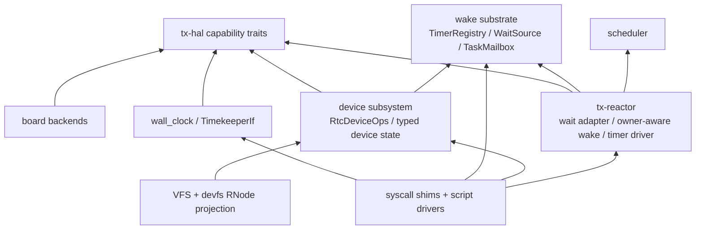

两个边界最关键：

- `tx-subsystems` 不为了 scheduler placement 依赖 `tx-reactor`。它只拥有语义状态
  和 wait source；有 scheduler context 的 caller 通过 closure 注入 post 路径。
- `tx-hal` 不依赖 VFS 或 device node。HAL 报告能力，device subsystem 把能力适配成
  typed ops，devfs 再把 ops 投影成 RNode。

## 21. Producer 迁移目录

Package G 容易失控，因为能 wake task 的 producer 很多。统一规则不是“所有
subsystem import reactor”，而是：

1. semantic subsystem 拥有 readiness/event truth；
2. subsystem 暴露 `_with_post` 或等价 caller-posting seam；
3. 有 scheduler context 的 caller 注入 `ReactorOwnerWakePost`、reactor wrapper
   或 `SyscallCtx` post closure；
4. 没有 scheduler context 的 caller 显式使用 direct closure 或只发布 wait source，
   不能保留旧 direct wrapper 作为平行算法。

| Producer 类 | 语义 owner | wake identity | scheduler-context seam | no-context fallback |
|---|---|---|---|---|
| timer expiry | `TimerRegistry` entry + role owner | `Weak<TaskMailbox>` + token | `fire_due_with(..., ReactorOwnerWakePost)` | 仅 focused fake-router test |
| delegate reply/cancel/death | `DelegateRegistry` token state | delegate token 内 waiter mailbox | `*_with_post` 或 reactor wrapper | explicit direct closure；旧 transition 名称也受 active-Rust strict residue gate 约束 |
| delegate timeout | timer role + delegate token | waiter mailbox + token id | timer router callback -> owner-aware post | test-only no-reactor helper |
| signal delivery | process/thread signal state | selected task mailbox | `post_signal_with_post`、`step_kill_process_with_post`、`SyscallCtx::post_mailbox_event` | explicit direct closure |
| interval timer signal | `ITIMER_REAL` state + signal subsystem | target task mailbox | `fire_itimer_real_with_post(ctx)` | 无旧 direct wrapper |
| process exit wait | process exit-source state plus process group-exit side effects | upgraded subscriber mailbox and, for fatal/group exit, target task signal mailbox | `fire_exit_source_with_post` + `SyscallCtx::post_mailbox_ref_event`; group-exit callers use `step_exit_group_with_posts` / `step_exit_group_with_signal_with_posts` to inject both signal-task and exit-source posts | explicit direct closures for both post roles |
| futex wake | futex bucket waiter state | exact waiter mailbox + hint | `step_futex_wake_masked_with_hint_and_post_in` | exact notify helper + direct post |
| eventfd read/write | eventfd counter/readiness | read/write wait-source subscriber | `step_eventfd_*_with_post` | 旧 direct `step_eventfd_read` / `step_eventfd_write` wrapper 已退休；no-context caller 显式传 direct closure |
| pipe read/write | pipe ring + endpoint liveness | reader/writer wait-source subscriber | `ReadWithHintPostOp` / `WriteWithHintPostOp` | 旧 direct `step_read` / `step_write` wrapper 和 `ReadOp` / `WriteOp` 已退休；no-context caller 显式传 direct closure |
| timerfd settime/realtime mutation | timerfd count、interval、cancel-on-set | timerfd readable wait source | `timerfd_settime_with_flags_and_post`、`timerfd_clock_was_set_with_post` | 旧 direct `timerfd_settime_with_flags` / `timerfd_clock_was_set` wrapper 已退休；no-context 测试显式传 direct closure |
| signalfd | signal fanout + signalfd pending queue | signalfd readable wait source | dual post seam：signal mailbox + signalfd wait-source | explicit direct mailbox-ref post |
| VFS/RNode readiness | RNode/open-file readiness | read/write wait source | `fire_read_wait_with_post` / `fire_write_wait_with_post` | 旧 direct `fire_read_wait` / `fire_write_wait` wrapper 已退休；no-context caller 显式传 direct closure |
| TTY readable | TTY payload + line discipline | TTY wait source | `step_ingest_with_post` | 旧 direct `step_ingest` wrapper 已退休；no-context caller 显式传 hint-aware direct closure |
| socket/network | socket payload/protocol + delegate queue | socket/delegate wait source | `SocketReadiness::*_with_post`、`NetworkPublish::*_with_post`、`net_delegate_kick_*_with_post` | direct helper through same seam |
| RTC device | `RtcDeviceState` pending bits | RTC wait source | hardware IRQ/emulated timer -> device state -> owner-aware route | pending bits 保持真值直到 drain |
| userfaultfd | pending fault queue | userfaultfd readable wait source | `fault_script_for_process_with_post`、`push_fault_msg_with_post` | 旧 direct `fault_script_for_process` / `push_fault_msg` wrapper 已退休；no-context caller 显式传 direct closure |
| POSIX mq | mq open instance + backing msg payload | sender/receiver wait source + `mq_notify` signal target mailbox | `step_mq_send_with_posts` 注入 readiness mailbox-ref post 和 signal weak-mailbox post；`step_mq_receive_with_post` 注入 sender readiness post | 旧 direct `step_mq_send` / `step_mq_receive` wrapper 已退休；no-context caller 显式传 direct closure |
| SysV msg | message queue payload | sender/receiver wait source | `step_msgsnd_with_post` / `step_msgrcv_with_post` / `step_msgctl_in_ns_with_post` | 旧 direct `step_msgsnd` / `step_msgrcv` / `step_msgsnd_v3` / `step_msgrcv_v3` / `step_msgctl` / `step_msgctl_in_ns` wrapper 已退休；no-context caller 显式传 direct closure |
| SysV sem | sem values、changed seq、removal、undo | changed wait source | `step_semop*_with_post`、`step_semctl_in_ns_with_post`、`step_sem_undo_with_post` | 旧 direct `step_semop` / `step_semop_v3` / `step_semctl` / `step_semctl_in_ns` / `step_sem_undo` wrapper 已退休；no-context caller 显式传 direct closure |
| AIO/io_uring | async object / completion queue | completion wait source | `push_completion_with_post`、`push_cqe_with_post`、worker closure injection | explicit direct closure |
| reactor-local completion | completion/rendezvous object | upgraded subscriber mailbox | `complete_with_post`、`arrive_with_post`、`ack_with_post` | 旧 direct `complete` / `arrive` / `ack` 方法已退休；host/no-context caller 显式传 direct closure |

每个 producer 切片的落地步骤固定为：

1. 命名语义 owner。
2. 命名 wake identity：task mailbox、subscriber mailbox、wait source 或 timer role。
3. 添加 caller-posting seam，先修改语义状态，再调用 post closure。
4. no-context fallback 只能委托到同一个 helper。
5. syscall/reactor/kernel IRQ/worker caller 注入 owner-aware post。
6. 被唤醒 future 必须重新观察语义状态。
7. 删除或隔离旧 direct wrapper，并加 grep/xtask audit。
8. 更新 `TIME_WAKE_v1.md`、本文和 progress 记录。

## 22. 包退出证据

每个实施包的“完成”必须由机械证据证明。

| 包 | 退出证据 |
|---|---|
| A HAL split | active Rust 无 `TimeIf`；`TxPlatform` 直接命名三类能力；无 RTC 板卡返回 typed unsupported |
| B Timekeeper facade | clock syscall、VFS timestamp、vvar、realtime mutation 用 `TimekeeperIf`；`CLOCK_REALTIME` 不热读 RTC |
| C Timer registry | producer 通过 `TimerRegistrar`；reactor 通过 `TimerRegistry::fire_due_with`；无 router-free due walk |
| D Reactor owner-aware wake | timer、wait-source、delegate 等 scheduler-context producer 通过 owner-aware post；post-steal wake test 绿 |
| E RTC device route | `/dev/misc/rtc` 到 `RtcDeviceOps`；read/ioctl/poll/epoll 使用 device state；RTC event 通过 wait source |
| F Linux ABI slots | timerfd、itimer、clock_nanosleep、VFS timestamp 等 ABI 均有 owner、race 语义和 focused tests |
| G Producer convergence | 所有已迁移 producer 无旧 direct wrapper active hit；`tx-subsystems` 不 import `tx-reactor` 做 placement |
| H Board evidence | RV64 QEMU goldfish、LA64 LS7A、m1dock no-RTC typed unsupported 已有 focused host witness；RV64 QEMU `smoke` / `busybox-boot` 已要求 `:reactor:owner-wake:smp:ok`；仍需要真实板卡/firmware RTC witness 或明确 blocker |

Package G 的完成不是“timer 能 wake”这么窄。timer expiry、wait-source readiness、
delegate completion、signal delivery、process exit、device event、AIO/io_uring
completion、socket/network readiness 都是不同语义 owner，但最终 runnable placement
必须在有 scheduler context 时走同一个 owner-aware mailbox route。

## 23. 端到端验收场景

| 场景 | 必要路径 | 验收点 |
|---|---|---|
| 读 monotonic | syscall/vDSO -> `TimekeeperIf` -> `MonotonicCounterIf` | 不读 RTC，不访问 timer registry |
| 读 realtime | syscall/vDSO -> timekeeper offset + monotonic | stat timestamp 和 clock realtime 同源 |
| 设置 realtime | permission -> timekeeper mutation -> vvar publish -> realtime-sensitive notification -> optional RTC writeback | RTC 写回失败不回滚已接受系统时间 |
| relative sleep | syscall driver -> monotonic deadline -> `TimerRegistrar` -> reactor due walk -> owner-aware post -> re-poll | syscall 不编程硬件 timer |
| realtime absolute sleep | conversion 携带 realtime generation -> timer guard -> generation mismatch 后 retry/cancel | wall-clock step 不静默完成错误 deadline |
| timerfd expiry | timerfd object -> registrar -> wait source readability -> read drains count | expiration count 不在 timer registry |
| futex/poll/select timeout | semantic wait-source + `DeadlineAbort` guard | readiness/timeout race 通过重新观察闭合 |
| RTC alarm | hardware IRQ 或 emulated timer -> RTC pending bits -> wait source -> read/poll consume | HAL 不碰 RNode，IRQ 不直接完成 fd 语义 |
| future 被偷后 wake | producer -> mailbox identity -> current owner re-resolution -> enqueue -> remote IPI | 不使用注册时 hart 或 captured local waker 作为 authority |

当前 host witness：

```sh
cargo test -p tx-reactor --test reactor_smoke mixed_producer_wakes_repeatedly_route_current_owner -- --nocapture --test-threads=1
```

它证明同一个 parked task 可以依次被 wait-source、timer expiry、delegate reply 从
非 owner hart 唤醒，并且每次都走 owner-aware placement。对应的 RV64 QEMU boot
witness 已经由 `cargo xtask test smoke --target rv64-qemu --timeout-ms 60000` 和
`cargo xtask test busybox-boot --target rv64-qemu --timeout-ms 60000` 固化为
`:reactor:owner-wake:smp:ok` marker gate。

## 24. 失败边界

遇到 bug 时先按症状定位 owner，不要直接补 shortcut。

| 症状 | 优先检查边界 | 常见错误 |
|---|---|---|
| `clock_gettime(CLOCK_REALTIME)` 和 `stat` 不一致 | Timekeeper/VFS timestamp | stat 路径绕过 `TimekeeperIf` |
| `clock_settime` 后 timerfd 行为错 | timekeeper generation + timerfd revalidation | mutation 没通知 realtime-sensitive object |
| sleep 超时不准 | deadline conversion + TimerRegistrar | 相对/绝对 deadline 混淆，或仍有私有 queue |
| futex/poll timeout race | wait-source subscription + timer guard lifetime | wake hint 被当作成功结果 |
| timerfd count 错 | timerfd object state | count 放进 timer registry 或 read 未 drain |
| RTC read/poll 不醒 | RTC device pending state + wait source | IRQ 直接唤醒 task，未设置 pending bits |
| wake 后 task 仍在旧 hart | ReactorOwnerWakePost + scheduler owner | timer/wait entry 保存注册时 hart |
| remote IPI 丢失 | scheduler enqueue/IPI ordering | IPI 早于 task 对目标 queue 可见 |
| QEMU 正常、真实板卡 RTC 失败 | board `PersistentClockIf` / firmware profile | QEMU register 假设泄露到 board 通用代码 |

失败边界的原则是：状态真值在哪里，就在那里修；wake 只负责把 future 重新拉起来，
不负责替 semantic owner 提交结果。

## 25. 维护者交接

这一节把设计转成后续 patch workflow。它的目标不是重新解释所有模块，而是让
下一个实现者能从一个 bug、一个 ABI 缺口或一个 producer row 出发，选择正确
owner、正确接口和正确验证。

### 25.1 权威文档顺序

| 文档 | 使用场景 |
|---|---|
| [`README.md`](README.md) | 需要确认 Linux 源码/功能群行为，判断某项是否属于 v1 需求还是 Linux-parity deferred slot |
| 本文 | 学习完整 Tx 架构，选择模块边界、producer row、验证方式 |
| [`TIME_WAKE_v1.md`](../../design/02_execution/TIME_WAKE_v1.md) | 实现计划、review 和 lint gate 中引用的 `txdoc:` 规范合同 |
| `docs/progress/research/2026-07-06-time-wake-design-refactor.md` | 记录包进展、证据、blocker 和后续接力上下文 |

如果本文和 `TIME_WAKE_v1.md` 不一致，先修规范合同，再同步本文。progress 记录
可以解释当前状态，但不能覆盖 active design contract。

### 25.2 下一 slice 选择

选择下一项工作时，按“谁拥有语义状态”选入口，不按“wake 在哪里被观察到”选入口。

| 下一类工作 | 先读代码区域 | 期望 seam | 主要风险 |
|---|---|---|---|
| RTC/device follow-up | `crates/tx-subsystems/src/device.rs`、devfs char adapter、kernel RTC IRQ/timer callback | 复用 `publish_rtc_event_with_post` 或 device timer callback 的 RawQueue wake | IRQ/HAL 不能拥有 RNode 或 fd 语义 |
| socket/network readiness | socket readiness、network publish、delegate queue kick、相关 syscall caller | `SocketReadiness::*_with_post`、`NetworkPublish::*_with_post`、`net_delegate_kick_*_with_post` | 协议状态留在 net/socket subsystem，不能 import reactor placement |
| AIO/io_uring completion | AIO context、io_uring CQ、worker setup、syscall setup/enter | `push_completion_with_post`、`push_cqe_with_post`、worker closure 注入 | worker context 要窄，不能把 reactor 内部对象塞进 async object |
| POSIX mq / SysV msg/sem | IPC object payload 和 syscall step wrapper | `_with_post` step wrapper 注入 `SyscallCtx::post_mailbox_ref_event` | IPC 语义不能变成 wait-source event payload |
| signal/signalfd/process wait | signal subsystem、signalfd、thread-runtime fatal path、exit-source | 同时区分 weak task-mailbox post 和 mailbox-ref wait-source post | signal delivery 与 signalfd readiness 是两类 publication，不能合并成一个事件 |

如果一个 slice 不符合上表或第 21 节 producer row，先扩展 producer 目录，再动代码。

### 25.3 标准 patch 形状

Package G 的正确 patch 通常有四层：

1. **语义 subsystem。** 在拥有状态的模块里添加 `_with_post` 或等价
   caller-posting helper。helper 先修改语义状态，再调用传入的 post closure。
2. **有 context 的 caller。** syscall、reactor、kernel IRQ 或 worker caller
   在已经知道当前 hart / `SyscallCtx` / reactor context 的地方注入 owner-aware
   post。
3. **focused proof。** 测试必须能证明 injected post path 被使用；如果还有
   no-context 用法，也要证明它只是委托到同一个 helper 的 direct closure。
4. **文档和 progress 同步。** 如果 producer 目录、包状态或验收证据改变，同步
   `TIME_WAKE_v1.md`、本文和 progress 记录。

禁止 patch 形状：

- 把 semantic state 移到 reactor；
- 让 `tx-subsystems` 依赖 `tx-reactor` 来拿 scheduler placement；
- 在 timer entry、wait source 或 fd object 里保存 durable hart id；
- 让 mailbox event 直接代表 syscall success；
- 为了 host test 保留一条和 `_with_post` 平行的 direct notification 算法。

### 25.4 标准验证梯度

文档-only patch 的最低验证：

```sh
git diff --check -- docs/stage2-documents/time_infra/TX_TIME_WAKE_DESIGN_CN.md
rg -n '[ \t]+$' docs/stage2-documents/time_infra/TX_TIME_WAKE_DESIGN_CN.md
cargo xtask progress validate
cargo xtask lint docs
rg -n '\bReadOp\b|\bWriteOp\b|crate::pipe::step_read\(|crate::pipe::step_write\(' crates/tx-subsystems/src/pipe crates/tx-subsystems/src/vfs/execution.rs crates/tx-shims/src/linux_syscall/io.rs crates/tx-subsystems/tests/v3_pipe_waitsource.rs crates/tx-subsystems/src/process/tests/fd_table.rs --glob '*.rs'; test $? -eq 1
rg -n '\bfault_script_for_process\(|ProcessUfdDispatch::new\(|\bpush_fault_msg\(|fault_post: None|fault_post: Some|\bpush_fault_msg\b|\bfault_script_for_process\b' crates/tx-subsystems/src/userfaultfd crates/tx-subsystems/src/vm/execution.rs crates/tx-subsystems/tests/v3_userfaultfd_e2e.rs crates/tx-subsystems/tests/v3_userfaultfd_fault_path.rs crates/tx-shims/src/linux_syscall/tests/epoll_dispatch.rs crates/tx-shims/tests/v3_userfaultfd_ioctl_reply.rs crates/tx-kernel/src/thread_future.rs --glob '*.rs'; test $? -eq 1
```

实现 slice 的标准验证：

```sh
cargo fmt --check -p <changed-package>...
cargo test -p <focused-package> <focused-test-or-integration-test> -- --nocapture
cargo check -p <changed-package> -q
cargo xtask lint invariants time-wake-retired
git diff --check -- <changed paths>
cargo xtask progress validate
cargo xtask lint docs
```

改变 guest-visible time、device、scheduler 或 syscall 行为时，需要再补 QEMU 或
真实板卡 witness。host test 只能证明局部 contract，不能替代板级 timer/RTC/SMP
证据。

### 25.5 完成判定

后续汇报必须分开说两种完成：

| 状态 | 判定 |
|---|---|
| 架构完成 | 新功能能落入本文 owner row 和 `TIME_WAKE_v1.md`，不需要新 layer 或 shortcut |
| 实现完成 | 相关旧接口/旧 direct producer 机械退休，focused proof、retired audit、progress closeout 绿 |

在真实板卡/firmware RTC witness 仍缺时，不能把 implementation-complete 说成
已完成；只能说架构完整、retired-interface / host / RV64 QEMU owner-wake evidence
已到哪个边界。后续 LA64 或真实板卡 SMP stress 可以作为扩展证据继续补，但不应
重新打开已退休接口。

## 26. 剩余 Producer 详细设计

这一节补齐 Package G 中最容易反复回归的 producer 族。共同形态是：

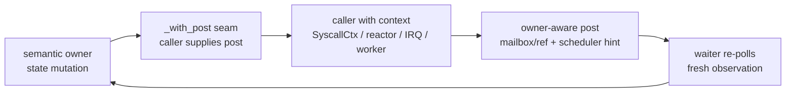

每个 producer 必须回答五个问题：

1. 语义真值在哪里？
2. wake identity 是 task mailbox、subscriber mailbox、wait source 还是 timer role？
3. 有 scheduler context 的 caller 在哪里注入 post？
4. no-context fallback 是否委托同一个 helper？
5. 旧 direct wrapper 的 retired audit 是什么？

### 26.1 共享接口形状

弱 task-mailbox producer，例如 signal-like event：

```rust
fn publish_event_with_post<F>(
    target: &TaskMailbox,
    event: MailboxEvent,
    post: F,
) where
    F: FnMut(&TaskMailbox, MailboxEvent) -> bool;
```

已升级 subscriber mailbox producer，例如 pipe/futex/eventfd/socket readiness：

```rust
fn notify_source_with_post<F>(
    source: &WaitSource,
    interests: InterestMask,
    post: F,
) where
    F: FnMut(&TaskMailbox, MailboxEvent, MailboxSchedulerHint) -> bool;
```

role-tagged timer producer，例如 timeout、delegate、device emulation：

```rust
fn fire_due_with<R>(&self, now_ns: u64, router: &mut R) -> usize
where
    R: TimerWakeRouter + ?Sized;
```

Rust 类型可以按模块调整，但 state mutation、post injection、re-observe 三段不能
合并。

### 26.2 SysV semaphore

| 项 | 设计 |
|---|---|
| 语义 owner | SysV sem payload：sem values、changed sequence、removal state、`SEM_UNDO` |
| wake identity | changed wait source subscriber mailbox |
| scheduler-context seam | `step_semop_v3_with_post`、`step_semop_with_post`、`step_semctl_in_ns_with_post`、`step_sem_undo_with_post` |
| no-context fallback | no-context 测试和 setup helper 显式调用 `_with_post`，传 direct mailbox-ref post closure |
| retired audit | active Rust 不保留平行 `notify_v3_source` / adapter-level direct route，也不保留旧 direct `step_semop` / `step_semop_v3` / `step_semctl` / `step_semctl_in_ns` / `step_sem_undo` wrapper |
| proof gate | sem value change、`IPC_RMID`、undo wake 都能触发 injected post；被唤醒 waiter 重新观察 sem state |

关键点：semop 的成功条件来自 semaphore payload，不来自 wake event。wake 只能让
等待方重新进入 semop 判定。

### 26.3 Socket 和 network readiness

| 项 | 设计 |
|---|---|
| 语义 owner | socket payload、协议状态、network delegate queue |
| wake identity | recv/send/accept/delegate wait source subscriber mailbox |
| scheduler-context seam | `SocketReadiness::*_with_post`、`NetworkPublish::*_with_post`、`net_delegate_kick_*_with_post` |
| no-context fallback | 通过同一 helper 的 direct mailbox-ref post 或普通 wait-source publication |
| retired audit | active Rust 无旧 `fire_recv` / `fire_send` / `fire_accept`、旧 direct `publish_to` / `publish` |
| proof gate | recv/send/accept readiness、ARP/loopback/TCP/UDP/netlink delegate kick 均能注入 owner-aware post |

网络路径的风险是跨层过宽：协议层可能最容易“顺手”决定 runnable placement。设计上
协议层只更新 buffer、state、readiness；placement 由 caller-posting seam 接走。

### 26.4 RTC 和 generic device readiness

| 项 | 设计 |
|---|---|
| 语义 owner | `RtcDeviceState` 或具体 device pending state |
| wake identity | device wait source / RawQueue subscriber mailbox |
| scheduler-context seam | hardware IRQ 调用 `publish_rtc_event_with_post`；emulated timer 使用 `DeviceTimerCallback::with_raw_queue_wake` |
| no-context fallback | no-context 测试显式传 direct mailbox-ref post，pending bits 保持真值 |
| retired audit | active Rust 无旧 direct `publish_rtc_event` wrapper 和 RTC raw queue direct access |
| proof gate | hardware alarm、emulated alarm、read/poll/epoll 都先设置 pending bits，再 wake waiter |

RTC IRQ handler 只能 ack hardware、发布 device event。它不能直接完成 fd read，也不能
用路径字符串找 `/dev/rtc`。

### 26.5 AIO 和 io_uring completion

| 项 | 设计 |
|---|---|
| 语义 owner | AIO context completion queue、io_uring CQ |
| wake identity | completion/readable wait source subscriber mailbox |
| scheduler-context seam | `AioContext::push_completion_with_post`、`IoUring::push_cqe_with_post`、worker setup 注入 post closure |
| no-context fallback | explicit direct closure 通过同一个 helper |
| retired audit | active Rust 无旧 direct `push_completion` / `push_cqe` 生产路径 |
| proof gate | completion 入队先更新 object queue，再通过 injected post 发布 CQ/readiness；consumer read/enter 后重新检查 queue |

worker 不能因为在异步路径里就持有 reactor 内部对象。正确做法是在 worker 构造时
传窄 post closure，worker 只知道“completion ready 后调用这个 post”。

### 26.6 Signal、signalfd 和 process wait

| 项 | 设计 |
|---|---|
| 语义 owner | process/thread signal state、signalfd pending queue、process exit-source |
| wake identity | signal target task mailbox + signalfd/exit wait-source subscriber mailbox |
| scheduler-context seam | `route_gewalt_with_post`、`post_signal_with_post`、`post_signal_mailbox_with_post`、`deliver_posix_signal_with_post`、`script_deliver_signal_with_post`、`step_kill_pgrp_with_posts`、`script_kill_pgrp_with_posts`、`fire_exit_source_with_post`、`step_exit_group_with_posts`、`step_exit_group_with_signal_with_posts` |
| no-context fallback | tests 显式 direct post；group-exit no-context tests 必须同时传 signal mailbox direct closure 和 exit-source mailbox-ref direct closure；默认 wrapper 不保留第二套算法 |
| retired audit | active Rust 无旧 `step_kill_process`、`step_kill_pgrp`、`deliver_posix_signal`、`route_gewalt`、`post_signal`、`post_signal_mailbox`、`script_deliver_signal`、`fire_exit_source`、`notify_child_zombified`、`step_exit_group`、`step_exit_group_with_signal`、`KillPgrpOp`、`DeliverSignalOp` |
| proof gate | catchable signal、fatal signal teardown、signalfd readiness、child-zombie wake、process group-exit wake 均能通过 injected post，并区分 weak mailbox 与 mailbox-ref source wake |

signal delivery 和 signalfd readiness 是两条 publication：前者告诉目标 task 有 signal
需要处理，后者告诉 signalfd fd readable。它们可以由同一个语义变化触发，但不能把
两个 wait identity 合并。

### 26.7 Cross-slice 完成矩阵

| Row | 必须同时成立 |
|---|---|
| semantic state | 修改发生在 owning subsystem，不在 reactor/router |
| wake identity | task mailbox、subscriber mailbox、wait source、timer role 明确，且不保存 durable hart id |
| post injection | 有 context 的 caller 注入 owner-aware post；无 context 的 caller 走 explicit direct fallback |
| re-observe | 被唤醒 future 或 syscall driver 重新读取 semantic state |
| retired audit | 旧 direct wrapper active Rust 零命中 |
| dependency | `tx-subsystems` 不为了 placement 依赖 `tx-reactor` |
| evidence | focused test + `time-wake-retired` + progress closeout |

### 26.8 设计完成测试

任何新增 producer 只要能填完这张表，就说明架构已经覆盖它；填不完说明要先扩展
设计：

| 问题 | 答案 |
|---|---|
| 语义 owner 是谁？ | 具体 subsystem object，不是 router |
| wake identity 是什么？ | mailbox / wait source / timer token，不是 hart |
| deadline 是否需要？ | 如需要，只通过 `TimerRegistrar` |
| wake route 是否需要 scheduler context？ | 如需要，由 caller 注入 post |
| no-context 怎么办？ | explicit direct fallback，通过同一 helper |
| waiter 怎么提交结果？ | 重新观察 semantic state 后提交 |
| 旧接口如何退休？ | grep/xtask audit 写入验收 |

## 27. 接口字典和代码归属

| 接口 | 当前角色 | 主要 home | 合法调用者 | 不能变成 |
|---|---|---|---|---|
| `MonotonicCounterIf` | clocksource-like counter read | `crates/tx-hal`、board crates | timekeeper、reactor、observe | realtime policy、timeout registry |
| `DeadlineTimerIf` | clockevent-like deadline programming | `crates/tx-hal`、board crates | reactor timer driver | syscall sleep helper、timerfd machine |
| `PersistentClockIf` | optional RTC/persistent clock/alarm | `crates/tx-hal`、board crates | timekeeper seed/writeback、RTC ops、IRQ ack | hot realtime provider、devfs owner |
| `IrqIf::RTC_IRQ` | optional RTC IRQ fact | board crates、`tx-kernel` | IRQ install + RTC event publication | generic RTC device object |
| `TimekeeperIf` | semantic clock facade | `crates/tx-subsystems/src/wall_clock.rs` | clock syscall、vDSO、VFS、timer conversion | hardware timer driver、RTC char ops |
| `TimerRegistrar` | producer-facing deadline install | `crates/tx-substrate/src/wake/timer.rs` | sleep、futex/poll、timerfd、delegate、device emulation | scheduler placement API |
| `TimerRegistry` | reactor-facing due walk | `crates/tx-substrate/src/wake/timer.rs` | reactor timer driver | semantic dispatcher |
| `TimerWakeRouter` | due entry 到 wake publication 的 callback | substrate trait，reactor impl | reactor tick、fake-router tests | hidden direct mailbox route |
| `TaskMailbox` | stable task wake identity | `crates/tx-substrate/src/wake/mailbox.rs` | timers、wait sources、signal、delegate、device | CPU/hart owner record |
| `WaitSource` / `RawQueue` | readiness subscriber/generation | wake substrate + semantic subsystems | pipe、futex、VFS、TTY、socket、RTC、AIO | operation-result truth |
| `ReactorOwnerWakePost` | mailbox event -> scheduler placement | `crates/tx-reactor` | timer router、reactor wrapper、kernel/syscall injected post | semantic state owner |
| `SyscallCtx::post_mailbox_event` | task-mailbox post seam | `crates/tx-shims/src/linux_syscall/ctx.rs` | signal-like syscall producer | subsystem -> reactor dependency |
| `SyscallCtx::post_mailbox_ref_event` | wait-source subscriber post seam | same | futex、eventfd、pipe、timerfd、VFS、IPC、socket、AIO | shim 直接改 semantic readiness |
| `RtcDeviceOps` | RTC fd/device semantics | `crates/tx-subsystems/src/device.rs`、`crates/tx-fs/src/devfs` | devfs char dispatch、RTC ioctl/read/poll | `CLOCK_REALTIME` owner |
| `CharDeviceOps` / RNode | typed device 的 VFS 投影 | `crates/tx-fs/src/devfs` | open/read/write/ioctl/poll | HAL-to-devfs shortcut |

常见功能到路径的查找表：

| 功能或 bug | 必要路径 | 如果要加 hook，加在哪里 |
|---|---|---|
| realtime 错 | syscall/vDSO -> `TimekeeperIf` -> monotonic + offset | wall-clock policy，不是 RTC ops |
| stat 时间错 | VFS/filesystem policy -> `TimekeeperIf::realtime_now_ns` -> fs encoding | VFS timestamp helper |
| `clock_settime` 错 | permission -> timekeeper mutation -> generation/vvar -> timerfd/realtime notifier -> optional RTC writeback | timekeeper mutation report |
| relative sleep 错 | syscall -> monotonic deadline -> registrar -> reactor due walk -> re-poll | wait adapter 或 timer role |
| timerfd 错 | timerfd count/interval/cancel-on-set -> registrar -> readable source | timerfd object state |
| RTC alarm 错 | HAL/emulated timer -> RTC pending bits -> wait source -> read/poll recheck | RTC device state 或 board backend |
| steal 后 wake 丢 | producer -> mailbox -> owner-aware post -> scheduler owner -> IPI | reactor/scheduler wake route |

## 28. 完整性边界

本文的 v1 架构覆盖所有已知 time/wake 需求，但这不等于 Linux 时间功能全量实现。
后续判断缺口时要分清三类：

| 缺口类型 | 含义 | 处理方式 |
|---|---|---|
| feature gap | Linux 有功能，v1 暂未实现，例如 NTP、leap second、time namespace、CPU timer | 放入第 18 节 deferred slot 或扩展相应 owner |
| evidence gap | 设计、host proof、部分 QEMU proof 已有，但缺真实板卡/firmware witness | 继续补 board witness，不改架构 |
| architecture gap | 新功能无法落入本文 owner row，或者必须跨层 shortcut 才能实现 | 先更新 `TIME_WAKE_v1.md` 和本文，再实现 |

当前 v1 已覆盖的能力边界：

| Feature family | v1 覆盖 | 扩展槽 |
|---|---|---|
| monotonic clock read | `MonotonicCounterIf` + `TimekeeperIf` | raw/disciplined split |
| realtime wall clock | monotonic + offset + generation + vvar | NTP、leap、TAI、time namespace |
| software timeout | `TimerRegistrar` / `TimerRegistry` / `TimerWakeRouter` | wheel/heap/RB-tree/sharded hybrid 替换 |
| wake routing | mailbox event + owner-aware scheduler placement | priority/donation/per-class placement policy |
| future stealing | stable mailbox identity + current-owner re-resolution | timer shard migration optimization |
| RTC device ABI | persistent clock + typed `RtcDeviceOps` + pending event + devfs projection | full RTC ioctl、periodic/update、wakeup-source accounting |
| VFS timestamp | VFS 从 `TimekeeperIf` 取 realtime | filesystem granularity/range/y2038 policy |
| suspend-aware clock | persistent clock + future boottime accounting slot | PM suspend/resume + alarmtimer parity |

因此，真实板卡 RTC 缺失、后续板卡 SMP stress 未覆盖、CPU timer 未实现，都不是重新打开
`TimeIf`、私有 timer queue、HAL-to-devfs shortcut、per-producer scheduler hook 的理由。
如果功能能落入上表，就按对应 owner 做；如果落不进去，先设计评审。

## 29. 设计决策

以下决策是 v1 的稳定结论，日常 bugfix 不应重新打开：

1. **`TimeIf` 不是最终架构。** 它把 counter read、deadline programming、
   persistent clock 混在一个接口里，导致上层不知道自己消费的是硬件事实、clock
   语义还是 timer 机制。
2. **`TimerWheel` 不是 scheduler。** 它可以是内部数据结构，但公开职责只能是
   deadline registry；CPU/hart placement 必须在 wake 发生时由 scheduler 解析。
3. **Reactor 是 timer registry 的硬件消费者。** Reactor 同时拥有 due walk、
   当前 hart、hardware deadline reprogram 和 owner-aware post context，因此 syscall、
   StepOp、timerfd、futex 都不能直接 arm `DeadlineTimerIf`。
4. **Wake router 必须共享。** Timer、wait source、delegate、signal、device、
   AIO/io_uring、socket readiness 都面对同一个 post-steal race，不能各自实现
   scheduler placement。
5. **RTC 双重建模是必要的。** `PersistentClockIf` 是硬件/persistent capability；
   `RtcDeviceOps` 是 Linux `/dev/rtc` fd 语义。`CLOCK_REALTIME` 热路径属于
   timekeeper，不属于 RTC device。
6. **HAL 不连接 RNode/devfs。** HAL 报告硬件能力；device subsystem 把能力适配为
   typed ops；devfs 把 ops 投影为 RNode。
7. **Linux 兼容靠职责语义，而不是复制数据结构。** Tx 可以用更小的 trait 集合，
   但必须保留 Linux 分层中 clocksource、clockevents、timekeeping、hrtimer、RTC
   class、scheduler wake 的职责边界。

## 30. 最终设计合同

完整设计可以压缩成下面这张图：

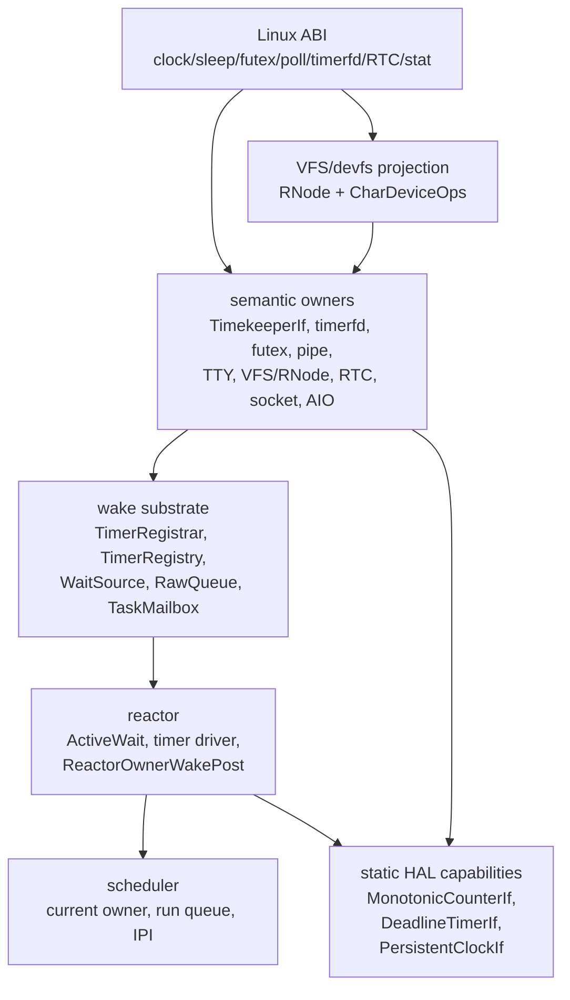

不可谈判的边界：

| 边界 | 必须形态 | 回归信号 |
|---|---|---|
| hardware time | counter、deadline、persistent clock 三个 HAL trait | broad `TimeIf` 或 syscall/VFS 读 board register |
| semantic clock | `CLOCK_REALTIME = monotonic + offset + generation` | clock/stat 热读 RTC |
| software deadline | producer 通过 registrar 安装 role-tagged entry | syscall/timerfd/futex 编程硬件 timer |
| wait readiness | semantic object 先改状态，再发布 hint | mailbox event 被当作 commit 证明 |
| wake placement | caller 注入 owner-aware post，scheduler 解析 current owner | wait/timer entry 缓存 hart id |
| RTC route | HAL persistent clock + `RtcDeviceOps` + devfs projection | HAL 构造 RNode 或 IRQ 按路径字符串特判 |
| Package G | `_with_post` seam + narrow no-context fallback | `tx-subsystems` import `tx-reactor` |

实现完成的最终验收条款：

- `cargo xtask lint invariants time-wake-retired` 绿；
- clock syscall、vvar、timer conversion、VFS timestamp 只通过 `TimekeeperIf`
  获取语义 clock；
- timeout producer 使用统一 `TimerRegistrar`，due walk 使用
  `TimerRegistry::fire_due_with`；
- 已迁移 wake producer 在有 context 时注入 owner-aware post，在无 context 时
  只通过同一 helper 的 explicit direct fallback；
- RTC hardware IRQ、emulated alarm、read/poll、devfs projection 都经 RTC device
  pending state，不经 HAL-owned VFS state；
- 每个 producer family 有 focused injected-post test；
- SMP witness 证明 owner 改变后的 wake 不依赖注册 hart 或 captured local waker；
- progress 记录清楚说明哪些 row 已绿、哪些仍 open、跑过哪些命令。

满足这些条款时，Tx 的时间设计才算和实现对齐：Linux 语义由 Tx semantic owner
表达，硬件保持静态 capability shape，所有 wake-producing 路径最终收敛到同一个
SMP-safe scheduler 边界。

## 31. 异步运行时参考与 stealing 设计准则

本节回答最后一个容易混淆的问题：其他异步内核或运行时在 timer 和 future/task
stealing 上怎么分层，Tx 为什么选择现在这条路线。结论是：成熟系统通常不让
timer entry、fd readiness、设备 IRQ 或 future 自己决定运行 CPU；它们只产生
“某个 task 可能可以继续推进”的事实，placement 由 executor/scheduler 在 wake
发生时决定。

### 31.1 参考系统的共同模式

| 系统 | 时间/ready producer | task identity | placement owner | 对 Tx 的启发 |
|---|---|---|---|---|
| Linux | hrtimer、wait queue、IRQ、softirq、timer wheel callback | `task_struct` / wait queue entry | scheduler wakeup path | timer/IRQ 只触发 wake；CPU 选择由 scheduler 完成 |
| Tokio 类多线程 executor | time driver、IO driver、waker | task header / waker identity | worker scheduler + run queue / inject queue | timer future 不保存最终 worker；wake 进入调度队列 |
| Fuchsia/Zircon 类 dispatcher | timer、port packet、handle signal | dispatcher/port wait identity | async loop 或 kernel scheduler | event source 和 dispatch thread 分离 |
| 嵌入式 executor | hardware timer interrupt、ready bit | task id / static future slot | executor ready queue | ISR 标记 ready，主 executor poll；ISR 不执行 future 语义 |

这些系统的数据结构差别很大，但四个边界相同：

1. **时间驱动边界。** 硬件 timer 或 time driver 负责发现 deadline 到期。
2. **事件身份边界。** producer 记录的是 task/wait identity，不是 CPU/hart owner。
3. **ready publication 边界。** wake 只把 task 放回可调度集合，或者设置 inbox/ready
   bit。
4. **placement 边界。** work stealing、load balancing、affinity、remote IPI 都属于
   scheduler/executor，不属于 timer entry 或 fd/设备对象。

Tx 的 `TimerRegistrar`、`TaskMailbox`、`WaitSource`、`ReactorOwnerWakePost`
就是这四个边界的本地化表达。

### 31.2 与全局架构的关系

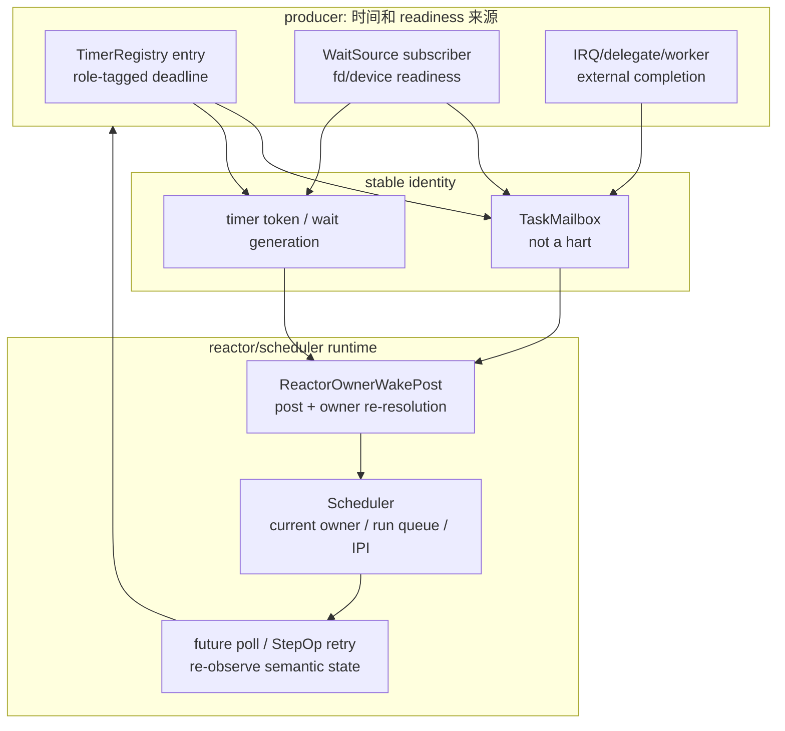

这张图在全局架构中位于第 9、12、30 节之间：第 9 节定义 wait-source 和 wake
router，第 12 节定义 stealing 竞态，第 30 节定义最终合同。本节补的是“为什么不能把
timer wheel、future 或设备 producer 做成 placement owner”。

### 31.3 work stealing 下的正确线性化点

当 task 被偷取或迁移时，系统里至少有三个状态同时变化：

| 状态 | owner | 可否由 producer 缓存 |
|---|---|---|
| `TaskMailbox` identity | reactor/task 创建路径 | 可以保存 weak/reference identity |
| task lifecycle / parked-runnable-running | scheduler/reactor | 不能保存为 producer truth |
| `current_hart` / destination queue | scheduler | 不能保存，wake 时重新解析 |

正确线性化点不是“注册 timer 的时刻”，也不是“future 上次被 poll 的 hart”，而是
`ReactorOwnerWakePost` 执行 placement 的时刻：

1. producer 先向 mailbox 或 wait-source 发布 wake event；
2. router 升级 task identity；
3. scheduler 读取当前 owner；
4. 在目标 run queue 或 placement lock 下重新检查 lifecycle/current owner；
5. 如果仍 parked，则 enqueue；
6. 如果目标 hart remote，task 对目标队列可见后再发 reschedule IPI；
7. 被 poll 的 future 重新观察 semantic owner，决定成功、重试、超时或取消。

这个顺序允许 timer fire 与 cancel、steal 与 wake、readiness 与 timeout 同时发生。
重复 wake、stale wake 或 wake 后发现 predicate 不成立都不是 correctness failure；
丢失 runnable placement 才是 correctness failure。

### 31.4 Tx 不采用的三种替代方案

| 方案 | 表面好处 | 不采用原因 |
|---|---|---|
| timer entry 保存注册 hart | fire 时少一次 owner lookup | task steal 后会投递到 stale hart；还会逼迫 timer registry 理解 scheduler |
| future 自带私有 timer wheel | 每个 future 自管理 timeout | 无法统一硬件 deadline reprogram、cancel/fire race、timerfd/RTC/delegate role |
| 每个 subsystem 自己调用 scheduler wake | 局部 patch 快 | socket、RTC、AIO、signal、futex 会各自实现 post-steal 规则，SMP bug 无法集中验证 |

因此 v1 的约束是：producer 可以携带 role、token、generation、mailbox identity，
但不能携带 durable hart identity；future 可以携带 guard 和 continuation state，
但不能拥有独立 deadline data structure；subsystem 可以发布 readiness，但不能选择
最终 run queue。

### 31.5 实现者检查表

新增一个异步 producer、timer role 或设备 readiness 路径时，必须逐项回答：

| 检查项 | 正确答案 |
|---|---|
| producer 是否需要时间？ | 通过 `TimerRegistrar` 安装 deadline，不直接 arm `DeadlineTimerIf` |
| producer 保存什么 wake target？ | `TaskMailbox` / wait-source subscriber / role token，不保存 hart |
| wake 发生时在哪里有 scheduler context？ | reactor tick、syscall context、kernel IRQ wrapper、worker wrapper 之一 |
| no-context caller 怎么办？ | 显式 direct post closure，仍委托同一个 `_with_post` helper |
| 被唤醒后如何提交结果？ | future/StepOp 重新观察 semantic object，不能相信 wake event 本身 |
| 如何证明 stealing 安全？ | host mixed-producer owner-wake test；QEMU/board marker；retired-interface gate |

如果某条路径无法填写这张表，它不是缺一个 helper，而是设计边界还没闭合。

## 32. 需求追踪矩阵

本节把 Linux/POSIX 需求、Tx owner、接口和证据放在同一张表里。它用于判断
“设计是否完整覆盖需求”，也用于后续拆实现 slice。一个需求如果没有 owner 或
证据列，就不能算完成；一个需求如果只能靠跨层 shortcut 实现，就说明 owner
划分还需要先修。

| 需求编号 | Linux/POSIX 需求 | Tx owner | 关键接口 | 必要证据 | v1 边界 |
|---|---|---|---|---|---|
| T-01 | `CLOCK_MONOTONIC` 稳定递增 | `TimekeeperIf` + `MonotonicCounterIf` | `monotonic_now_ns` | clock syscall/vDSO focused test | suspend/raw discipline 后续扩展 |
| T-02 | `CLOCK_REALTIME` 是 Unix wall time | `TimekeeperIf` | `realtime_now_ns`、offset/generation | clock/stat 同源 test | NTP/leap/time namespace deferred |
| T-03 | boot 时从 RTC/firmware 初始化 wall time | boot/vDSO init + `PersistentClockIf` | `seed_realtime_from_persistent` | QEMU RTC seed witness；no-RTC typed unsupported | 真实板卡/firmware witness 仍需外部证据 |
| T-04 | `clock_settime` / `settimeofday` 修改系统 realtime | `TimekeeperIf` | `set_realtime_ns_with_persistent*` | generation bump、vvar publish、timerfd notification | RTC writeback 是 best-effort |
| T-05 | relative sleep 和 timeout | wait driver + `TimerRegistrar` | deadline guard install | nanosleep/futex/poll/select timeout tests | high precision 数据结构可内部演进 |
| T-06 | realtime absolute deadline 受 wall-clock step 影响 | timekeeper + owning ABI object | generation-aware conversion | timerfd cancel-on-set / revalidation tests | 完整 POSIX timer parity deferred |
| T-07 | timerfd fd-readable 语义 | timerfd object | `_with_post` settime/clock-was-set seam | count/read/poll/epoll tests | alarm clocks 后续扩展 |
| T-08 | `/dev/rtc` ioctl/read/poll | `RtcDeviceOps` + devfs/RNode | typed char-device dispatch | RTC ioctl/read/poll/event tests | periodic/update interrupt 可后续补 |
| T-09 | RTC alarm 硬件或 emulated wake | `RtcDeviceState` + timer/IRQ route | pending bits + wait source | QEMU IRQ/emulated alarm tests | suspend wake accounting deferred |
| T-10 | VFS timestamp 与 system realtime 一致 | VFS timestamp policy + `TimekeeperIf` | realtime timestamp helper | stat/statx/utimensat focused tests | filesystem granularity/range 各 FS 自己处理 |
| T-11 | wake producer 在 SMP 下不丢 wake | `ReactorOwnerWakePost` + Scheduler | mailbox/ref post + owner re-resolution | host mixed-producer + QEMU owner-wake marker | 真实板卡 stress 是扩展证据 |
| T-12 | work stealing 后 wake 投递到当前 owner | Scheduler placement | current owner lookup under placement protocol | post-steal test | 不允许 timer/wait entry 缓存 hart |
| T-13 | 无 RTC 板卡可运行 | `PersistentClockIf` unsupported profile | typed error | m1dock/no-RTC focused tests | 不把 unsupported 当 fixed epoch 设备成功 |
| T-14 | producer direct wrapper 不能复活 | xtask retired gate | `time-wake-retired` | `cargo xtask lint invariants time-wake-retired` | docs/xtask 可讨论 retired 名称 |
| T-15 | clock 语义 facade 不能平行分叉 | `TimekeeperIf` | `timekeeper()` + trait methods | raw public `wall_clock::*` wrapper / public `WallClock` 零命中 | 私有实现 helper 和 cfg-test reset 可以保留 |

需求追踪的使用规则：

1. 新需求先找需求编号；找不到就新增一行，再改代码。
2. 证据必须能机械复现，不能只写“已实现”。
3. v1 边界不是遗漏，而是后续实现必须复用的 extension point。
4. 如果一个 patch 修改了 owner 或接口列，必须同步 `TIME_WAKE_v1.md`。

## 33. 跨模块不变量

这些不变量是 review 和 lint 的共同依据。它们比某个 Rust 类型名更稳定，因为
内部结构可以演进，但 owner 和线性化点不能漂移。

| 不变量 | 内容 | 违反信号 |
|---|---|---|
| TW-I1 Clock source split | monotonic counter、deadline interrupt、persistent clock 是三类 HAL 能力 | broad `TimeIf`、syscall 直接读 board RTC |
| TW-I2 Realtime derivation | hot `CLOCK_REALTIME` = monotonic + offset + generation | 每次 realtime 读都访问 RTC/MMIO |
| TW-I3 Deadline substrate | software timer entry 只保存 deadline、role、token、wake identity | timerfd count/futex state/RTC pending bits 进入 timer registry |
| TW-I4 Reactor owns hardware reprogram | 普通 producer 不能直接编程 `DeadlineTimerIf` | sleep/timerfd/futex helper 调 board timer |
| TW-I5 Wake is hint | mailbox event / wait-source fire 只表示需要重新观察 | wake event 被当作 syscall 成功或 fd read 成功 |
| TW-I6 Current owner at wake time | task placement 在 wake 发生时重新解析 | timer entry、wait source、fd object 保存 durable hart |
| TW-I7 Semantic owner first | producer 先修改语义状态，再发布 wake | waiter 被唤醒却观察不到 pending/count/ready state |
| TW-I8 HAL-to-devfs forbidden | HAL 不创建 RNode、不解析 ioctl、不处理 fd flags | board crate 引入 VFS/devfs path logic |
| TW-I9 No reactor import from subsystems | semantic subsystem 通过 closure 注入 post，不依赖 reactor placement | `tx-subsystems` 为 wake placement import `tx-reactor` |
| TW-I10 No hidden direct fallback | no-context 路径显式传 direct closure，不能保留平行 public direct wrapper | retired-name grep 出现旧 wrapper |
| TW-I11 Remote IPI ordering | task 对目标 queue 可见后才发送 remote reschedule | IPI 早于 enqueue，偶发丢 wake |
| TW-I12 RTC event persistence | RTC pending bits 保持到 read/drain 或 ioctl 消费 | IRQ 只 wake 不设置 pending，poll/read race |

review 时优先检查这些不变量，而不是先看测试名。测试能过但违反不变量的 patch
会在 SMP、真实 RTC 或复杂 readiness race 下变成不可定位的兼容 bug。

## 34. 关键状态机

### 34.1 TimerGuard 状态机

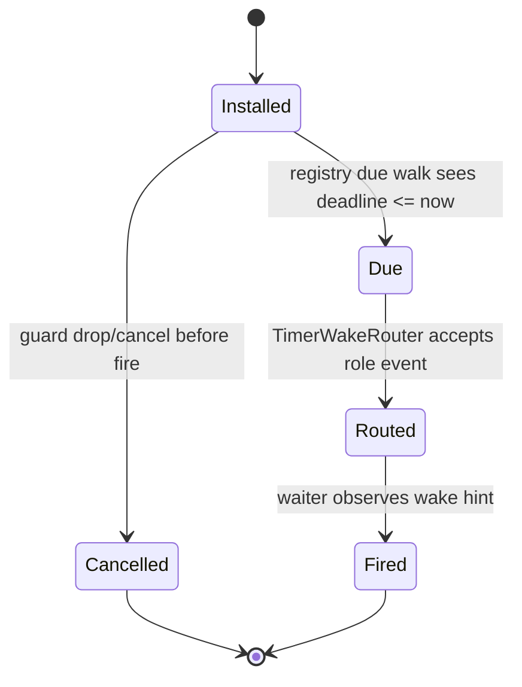

规则：

- `Cancelled` 和 `Due` 可以竞态，结果通过 token/state 检查闭合。
- `Routed` 只表示 event 已发布，不保证 semantic operation 成功。
- due walk 只能经 `fire_due_with(router)`，不能有 router-free production shortcut。

### 34.2 WaitSource subscription 状态机

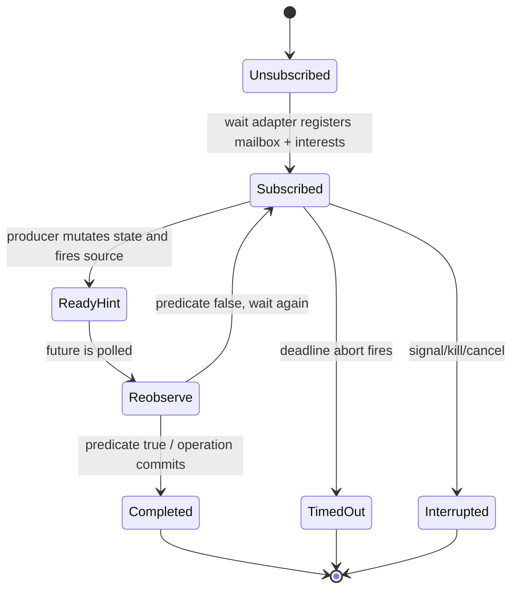

规则：

- `ReadyHint` 不是 `Completed`。
- `TimedOut` 与 `ReadyHint` 同时发生时，由 driver 重新观察 semantic state 后
  决定返回成功、`EAGAIN`、`ETIMEDOUT`、`EINTR` 或继续等待。
- subscription generation 必须避免 stale wake 消费其他事件。

### 34.3 timerfd 状态机

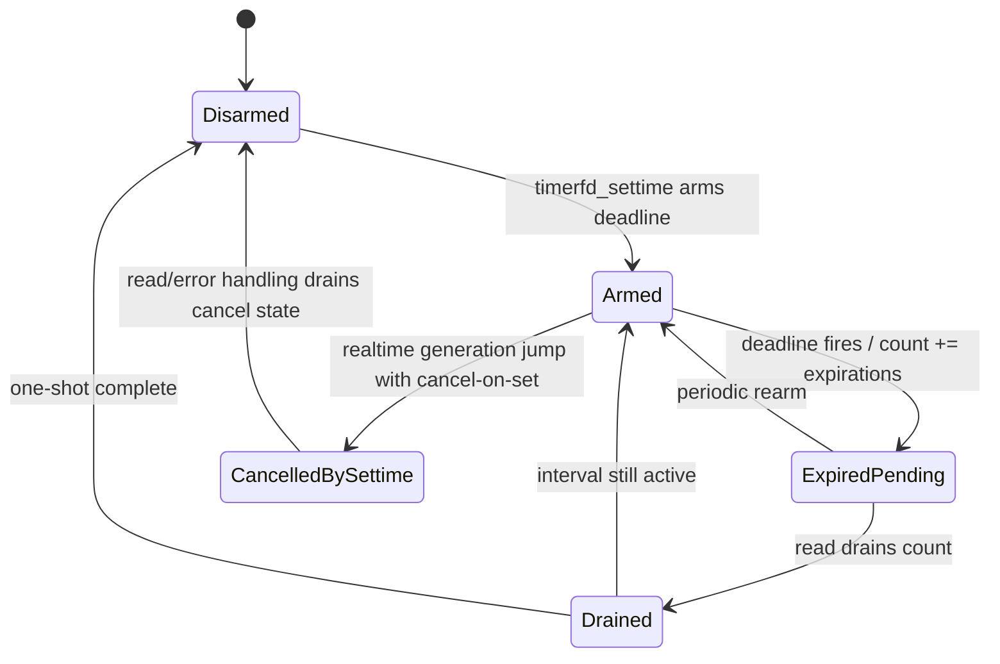

规则：

- expiration count、interval、cancel-on-set flag 只属于 timerfd object。
- timer registry 只负责 deadline 到期通知。
- realtime mutation 通过 timekeeper generation 通知 timerfd revalidation。

### 34.4 RTC event 状态机

```mermaid
stateDiagram-v2
    [*] --> Idle
    Idle --> AlarmProgrammed: RTC_ALM_SET / emulated alarm timer
    AlarmProgrammed --> Pending: hardware IRQ or emulated timer callback
    Idle --> Pending: update/periodic event in future extension
    Pending --> ReadyPublished: pending bits fire wait source
    ReadyPublished --> Consumed: read/ioctl consumes event bits
    Consumed --> Idle
    AlarmProgrammed --> Idle: clear alarm
```

规则：

- pending bit 是 RTC device state，不是 HAL IRQ state。
- `poll`/`epoll` 观察 pending state，`read` 消费 Linux-shaped event record。
- 无 RTC 后端返回 typed unsupported，不能伪造成成功设备事件。

### 34.5 Task wake placement 状态机

```mermaid
stateDiagram-v2
    [*] --> Parked
    Parked --> Runnable: owner-aware post enqueues task
    Runnable --> Running: reactor polls task
    Running --> Parked: future returns Pending and registers wait
    Running --> Completed: future returns Ready
    Parked --> MigratedParked: scheduler steals/migrates ownership
    MigratedParked --> Runnable: wake re-resolves current owner
    Completed --> [*]
```

规则：

- mailbox identity 可以跨状态保存；hart owner 不能由 producer 保存。
- `MigratedParked -> Runnable` 的线性化点在 `ReactorOwnerWakePost` placement。
- remote IPI 必须晚于 runnable enqueue 可见性。

## 35. 接口稳定性和退休策略

v1 把接口分成四类，防止后续“为了测试方便”把旧路径加回来。

| 类别 | 示例 | 稳定性 | 变更规则 |
|---|---|---|---|
| 规范接口 | `MonotonicCounterIf`、`DeadlineTimerIf`、`PersistentClockIf`、`TimekeeperIf`、`TimerRegistrar`、`TimerRegistry`、`TimerWakeRouter`、`RtcDeviceOps`、`ReactorOwnerWakePost` | v1 stable | 改名或语义变化必须同步 `TIME_WAKE_v1.md`、本文、tests 和 progress |
| 内部结构 | `TimerWheel`、具体 pending queue、timerfd internal fields、RTC device state fields | 可演进 | facade 和不变量不变即可替换 heap/RB-tree/wheel/hybrid |
| 迁移 seam | `*_with_post`、`SyscallCtx::post_mailbox_ref_event`、worker injected closure | v1 migration-stable | 只能收窄或合并到等价 owner-aware seam，不能退回 direct route |
| retired 名称 | `TimeIf`、`DeadlineFuture`、router-free `fire_due`、public `WallClock` / raw public `wall_clock::*` wrapper、旧 signal/RTC/socket/AIO direct wrapper | 禁止 active Rust | 必须由 xtask retired gate 和严格 grep 拦截 |

接口退休策略：

1. 删除旧 public wrapper 或把它降到不可导出的 test-local helper。
2. 所有 no-context 测试改成显式 direct closure，调用同一个 `_with_post` helper。
3. 有 scheduler context 的生产 caller 注入 owner-aware post。
4. `xtask/src/lint_invariants_time_wake.rs` 增加 retired name。
5. 设计文档可以保留旧名解释迁移，但 active Rust 不允许留下 raw-line residue。
6. 每个退休 slice 都要记录 focused test、grep 和 `time-wake-retired` 输出。

这个策略让“旧接口是否存在”从人工判断变成机械 gate，而不是靠 reviewer 记忆。

## 36. 错误语义和 unsupported policy

时间系统的错误不能都折叠成 `EINVAL` 或“假成功”。v1 需要保留错误来源，因为
Linux 兼容路径、设备路径和硬件能力路径的恢复策略不同。

| 错误来源 | 语义 | 上报方式 | 不允许的处理 |
|---|---|---|---|
| no persistent clock | 板卡没有 RTC/firmware wall-clock | `PersistentClockError::Unsupported`，RTC device ioctl/read 返回 typed unsupported errno | 固定返回一个看似有效的 RTC 时间 |
| invalid RTC value | RTC 寄存器值不能转换成 Unix ns | typed invalid/range error | 写入 timekeeper offset 后再发现非法 |
| RTC writeback failure | system realtime 已接受，但持久化失败 | mutation report 记录 best-effort failure | 回滚已接受的 `CLOCK_REALTIME` |
| hardware alarm unsupported | RTC 不支持硬件 wake alarm | emulated timer fallback 或 typed unsupported，按 profile 决定 | silently arm no-op alarm |
| timeout race | timeout 与 readiness 同时发生 | re-observe semantic state 后决定 errno/result | wake event 直接决定 `ETIMEDOUT` |
| stale wake | 旧 generation/source/token 的 wake | driver 丢弃或重新观察后继续等待 | 消费其他 event 或提交成功 |
| mailbox overflow | wake hint 队列溢出 | overflow flag + conservative re-poll | 丢掉唯一 runnable placement |
| remote IPI failure | 目标 hart 未收到 reschedule | placement report/boot witness fail-fast | 只记录日志继续声称 wake 成功 |
| unsupported clock id | v1 未实现 clock feature | syscall 返回 Linux-compatible errno | silently alias 到 realtime/monotonic，除非文档列为 v1 近似 |

特别注意 `clock_settime` 和 `RTC_SET_TIME` 的差别：

- `clock_settime(CLOCK_REALTIME)` 修改 system realtime；RTC 写回只是 policy helper。
- `RTC_SET_TIME` 修改 RTC device；它不自动改变 system realtime，除非未来新增显式
  policy，并且该 policy 必须经过 `TimekeeperIf`。

## 37. 并发、锁序和可观测性

### 37.1 锁序和依赖顺序

v1 的推荐顺序是从语义状态到 wake publication，再到 scheduler placement：

```text
semantic object lock
  -> wait-source/subscriber state
  -> mailbox event enqueue
  -> scheduler placement/current-owner lock
  -> remote IPI signal
```

禁止反向路径：

- 持有 scheduler placement lock 时进入 VFS/RTC/socket 语义锁；
- 持有 HAL MMIO/IRQ ack 路径时做 VFS path lookup；
- timer registry due walk 内直接运行 fd/device 复杂语义；
- mailbox post 中调用可能重新进入同一个 semantic object 的代码。

### 37.2 线性化点

| 操作 | 线性化点 | 说明 |
|---|---|---|
| realtime mutation | offset/generation update | vvar publish 和 timerfd notification 是后续 side effect |
| timer install | registry entry visible with token | 硬件 reprogram 由 reactor 随后完成 |
| timer fire | router 接收 live due entry | wake 后仍需 waiter re-observe |
| wait-source readiness | semantic state mutation visible before source fire | source fire 只是 hint fanout |
| task wake | scheduler placement 把 task 置 runnable | mailbox enqueue 本身不等于 runnable |
| remote wake | runnable visible before IPI | IPI 只是 nudging mechanism |
| RTC event | pending bit set | read/poll 都必须看同一个 pending state |

### 37.3 可观测性

建议保留或新增这些 observe/debug 点：

- timekeeper seed provenance：persistent、fallback、invalid、unsupported；
- realtime mutation report：old/new generation、persistent writeback result；
- timer install/fire/cancel：role、token、deadline、stale/cancelled 结果；
- owner-aware post report：posted、current owner、remote/local、IPI count；
- wait-source fire：source id、interest mask、subscriber count、generation；
- RTC event：hardware IRQ vs emulated timer、pending mask、read drain；
- retired-interface gate：命中名称、文件、行号、匹配组。

这些观测点的目的不是让 release build 变重，而是让 QEMU/真实板卡 witness
能快速区分“producer 没发 event”“mailbox 发了但没 placement”“IPI 没到”
和“future re-poll 后 predicate 仍 false”。

## 38. 端到端测试矩阵

| 测试层 | 覆盖内容 | 代表命令或证据 | 退出条件 |
|---|---|---|---|
| static retired gate | 旧接口和 direct wrapper 不存在 | `cargo xtask lint invariants time-wake-retired` | 0 retired sites |
| xtask lint tests | retired gate 自身模式正确 | `cargo test -p xtask lint_invariants_time_wake -- --nocapture` | exact/negative case 都通过 |
| docs/progress | 文档链接、progress schema、stale vocab | `cargo xtask progress validate`、`cargo xtask lint docs` | 无新增 broken link；已知 warning 不扩大 |
| timekeeper host | monotonic/realtime/seed/mutation | wall-clock focused tests | generation、vvar、persistent report 正确 |
| timer registry host | install/cancel/fire/role routing | `v3_timer_surface`、delegate timer tests | due walk 只走 router |
| reactor wake host | owner-aware post、remote IPI、mixed producer | `reactor_smoke` mixed/broad owner-aware tests | 每类 producer 产生 owner-aware placement |
| producer focused | pipe/eventfd/futex/timerfd/RTC/socket/AIO/IPC 等 | 每个 producer family 的 focused tests | injected post path 被实际使用 |
| shims/syscall | Linux ABI errno、read/poll/epoll/sleep | syscall focused tests | wake 后重新观察语义状态 |
| RV64 QEMU | boot + SMP owner-wake marker | `cargo xtask test smoke --target rv64-qemu --timeout-ms 60000` | `:boot:ok` + `:reactor:owner-wake:smp:ok` |
| RV64 busybox | real initramfs boot path + owner-wake marker | `cargo xtask test busybox-boot --target rv64-qemu --timeout-ms 60000` | busybox boot + marker |
| RTC QEMU | goldfish/LS7A persistent clock and alarm | board-specific RTC tests/QEMU witness | seed、ioctl、IRQ/emulated event 一致 |
| no-RTC board profile | typed unsupported | m1dock/no-RTC focused tests | 不伪造成功 RTC |
| real-board/firmware | external Package H witness | hardware-in-loop 或 firmware RTC runner | 当前 workspace 仍缺，必须作为 blocker 记录 |

测试解释规则：

- host test 证明语义和并发协议，不证明真实 timer/RTC MMIO。
- QEMU 证明 emulated board profile，不证明真实板卡。
- retired gate 证明旧接口没复活，不证明每个 ABI 语义都完整。
- `:reactor:owner-wake:smp:ok` 证明当前 RV64 boot lane 的 mixed-producer
  owner-wake，不替代所有未来 producer 的 focused tests。

## 39. 实施 checklist

实现者从一个 feature request、bug 或 Linux 兼容缺口出发，按下面顺序推进：

1. **定位需求。** 在第 32 节找需求编号；没有编号先补需求行。
2. **定位 owner。** 在第 4、20、21、A.2 节找语义 owner 和代码 home。
3. **选择接口。** clock 走 `TimekeeperIf`，deadline 走 `TimerRegistrar`，
   device 走 typed ops，wake 走 `_with_post` 或 owner-aware post。
4. **画状态机。** 确认它属于第 34 节哪个状态机，或补新的状态机。
5. **写最小 patch。** 先在 semantic owner 修改状态，再在 caller 注入 post。
6. **删除旧路径。** active Rust 不保留 public direct wrapper 或旧名字 residue。
7. **补 focused test。** 证明 injected-post 路径、re-observe、error/unsupported
   语义和 race 处理。
8. **跑静态 gate。** `time-wake-retired`、focused tests、fmt/check、docs/progress。
9. **补 board/QEMU 证据。** guest-visible、IRQ、SMP 或 RTC 行为变化必须补 witness。
10. **更新文档。** `TIME_WAKE_v1.md` 是规范合同，本文是中文完整解释，progress
    记录当前证据和 blocker。

汇报时固定拆成三句话：

- 这次改了哪个 owner row 和接口；
- 哪些 proof gate 已经通过；
- 哪些 evidence 或 feature 仍是 open/blocker。

这样后续实现不会把“架构完整”“host proof 通过”“真实板卡完成”混成同一个状态。

## 40. 完整接口蓝图

本节把前文的 owner、状态机和迁移规则收束成目标接口蓝图。它不是要求所有 Rust
类型逐字按这里命名，而是要求每条能力边界都有等价的窄接口、明确调用方向和
机械 proof。后续代码重构如果改变名字，必须保持这里的职责、调用方向和禁止事项。

### 40.1 HAL 能力接口

HAL 只暴露硬件事实和 board-local 操作，不承载 Linux ABI 语义。

```rust
pub trait MonotonicCounterIf {
    fn read_ns() -> u64;
    fn frequency_hz() -> u64;
}

pub trait DeadlineTimerIf {
    fn set_deadline_ns(deadline_ns: u64);
    fn cancel_deadline();
}

pub trait PersistentClockIf {
    fn read_realtime_ns() -> Result<u64, PersistentClockError>;
    fn set_realtime_ns(ns: u64) -> Result<(), PersistentClockError>;
    fn set_wake_alarm_ns(ns: u64) -> Result<(), PersistentClockError>;
    fn clear_wake_alarm() -> Result<(), PersistentClockError>;
    fn acknowledge_wake_alarm_irq() -> Result<(), PersistentClockError>;
}
```

调用方向：

```text
board backend -> tx-hal trait impl
timekeeper    -> MonotonicCounterIf / PersistentClockIf
reactor       -> MonotonicCounterIf / DeadlineTimerIf
RTC device    -> PersistentClockIf
kernel IRQ    -> IrqIf::RTC_IRQ + PersistentClockIf::acknowledge_wake_alarm_irq
```

禁止方向：

- HAL 不 import VFS/devfs/RNode。
- HAL 不拥有 `CLOCK_REALTIME` offset。
- HAL 不发布 fd readiness。
- HAL 不知道 task mailbox、scheduler owner 或 IPI。

### 40.2 Timekeeper 语义接口

`TimekeeperIf` 是 clock 语义 facade。它把硬件 counter 转成用户可见 clock，并把
realtime mutation 的副作用集中到一个地方。

```rust
pub struct TimekeeperIf;

impl TimekeeperIf {
    pub fn monotonic_now_ns<P: MonotonicCounterIf>() -> u64;
    pub fn realtime_now_ns<P: MonotonicCounterIf>() -> u64;
    pub fn realtime_generation() -> u64;

    pub fn seed_realtime_from_persistent<P>() -> RealtimeSeedReport
    where
        P: MonotonicCounterIf + PersistentClockIf;

    pub fn set_realtime_ns<P>(
        target_realtime_ns: u64,
        policy: PersistentWritebackPolicy,
    ) -> RealtimeSetReport
    where
        P: MonotonicCounterIf + PersistentClockIf;

    pub fn monotonic_deadline_from_realtime_ns<P>(
        realtime_deadline_ns: u64,
    ) -> RealtimeDeadlineConversion
    where
        P: MonotonicCounterIf;
}
```

关键语义：

- `CLOCK_REALTIME` 热路径是 `monotonic + offset`，不是 RTC read。
- `clock_settime` / `settimeofday` 先修改 timekeeper，再 best-effort 写回 RTC。
- `RTC_SET_TIME` 是设备操作，不自动成为 `clock_settime`。
- VFS timestamp、vDSO/VVAR、timerfd realtime revalidation 都从同一 generation
  和 offset 取得语义 clock。

### 40.3 Timer Registry 接口

Timer registry 只处理 monotonic deadline，不处理 fd 语义、不保存 CPU placement。

```rust
pub trait TimerRegistrar {
    fn install_for_task(
        &self,
        deadline: Deadline,
        role: TimerGuardRole,
        mailbox: Weak<TaskMailbox>,
    ) -> TimerGuard;

    fn install_device_event(
        &self,
        deadline: Deadline,
        callback: DeviceTimerCallback,
    ) -> TimerGuard;
}

pub trait TimerRegistry {
    fn fire_due_with<R>(&self, now_ns: u64, router: &mut R) -> usize
    where
        R: TimerWakeRouter + ?Sized;

    fn next_deadline_ns(&self) -> Option<u64>;
}

pub trait TimerWakeRouter {
    fn post_timer_fired(
        &mut self,
        mailbox: Weak<TaskMailbox>,
        token: TimerToken,
        role: TimerGuardRole,
    );

    fn post_delegate_timeout(&mut self, token: DelegateTokenId);
    fn post_source_fired(&mut self, source: WaitSourceId, interests: InterestMask) -> usize;
    fn post_mailbox_ref_event(&mut self, mailbox: &TaskMailbox, event: MailboxEvent) -> bool;
}
```

线性化要求：

1. producer 只安装 entry 或取消 guard；
2. reactor 读取 `now`，调用 `fire_due_with`；
3. router 把 due entry 转成 mailbox 或 wait-source wake；
4. future/driver 被唤醒后重新观察语义状态；
5. reactor 根据 `next_deadline_ns` 编程 `DeadlineTimerIf`。

### 40.4 Wait-source 与 owner-aware post 接口

readiness producer 的标准形态是“语义状态先变，wake hint 后发”。因此目标接口必须
支持 caller 注入 post，而不是让 subsystem 自己 import reactor。

```rust
pub type MailboxPost = fn(&TaskMailbox, MailboxEvent) -> bool;

pub type MailboxRefPostWithHint =
    fn(&TaskMailbox, MailboxEvent, MailboxSchedulerHint) -> bool;

pub trait ReadinessPublisher {
    fn fire_readable_with_post<P>(&self, post: P) -> usize
    where
        P: FnMut(&TaskMailbox, MailboxEvent, MailboxSchedulerHint) -> bool;
}
```

真实代码可按 pipe、futex、eventfd、socket、VFS/RNode、RTC、AIO/io_uring、IPC
分别命名，但必须满足同一形态：

```text
semantic mutation
  -> wait-source / raw-queue readiness update
  -> caller-provided post closure
  -> ReactorOwnerWakePost when scheduler context exists
  -> explicit direct closure only for no-context tests/helpers
```

### 40.5 RTC device 与 devfs/RNode 接口

RTC 的接口分两层：persistent clock 是硬件能力，RTC device 是 Linux fd 语义。

```rust
pub trait RtcDeviceOps {
    fn read_time(&self) -> Result<RtcTime, RtcError>;
    fn set_time(&self, time: RtcTime) -> Result<(), RtcError>;
    fn read_alarm(&self) -> Result<RtcAlarm, RtcError>;
    fn set_alarm(&self, alarm: RtcAlarm) -> Result<(), RtcError>;
    fn poll_events(&self) -> RtcEventMask;
    fn read_event(&self, nonblocking: bool) -> Result<RtcEventRecord, RtcError>;
}

pub trait CharDeviceOps {
    fn read(&self, fd_state: &OpenFileState, buf: UserBuf) -> Result<usize, Errno>;
    fn ioctl(&self, fd_state: &OpenFileState, cmd: IoctlCmd, arg: usize) -> Result<usize, Errno>;
    fn poll(&self, fd_state: &OpenFileState, interests: PollMask) -> PollMask;
}
```

调用方向：

```text
PersistentClockIf -> RtcDeviceOps backend adapter
RtcDeviceOps      -> RtcDeviceState pending bits / alarm config
devfs             -> CharDeviceOps projection
VFS/RNode         -> fd operation dispatch
poll/epoll        -> RTC wait source
```

禁止方向：

- board HAL 不创建 `/dev/rtc` RNode。
- IRQ handler 不直接完成 fd read。
- ioctl handler 不直接特判 board MMIO。
- `CLOCK_REALTIME` mutation 不隐式等同于 `RTC_SET_TIME`。

### 40.6 SyscallCtx 和 worker 注入接口

所有有 scheduler context 的生产路径都应该通过窄 post 函数注入 owner-aware route。

```rust
pub struct SyscallCtx {
    pub post_mailbox_event: Option<MailboxPost>,
    pub post_mailbox_ref_event: Option<MailboxRefPost>,
    pub post_mailbox_ref_event_with_hint: Option<MailboxRefPostWithHint>,
    pub timer_registrar: Option<TimerRegistrarHandle>,
}
```

worker 类对象，如 AIO、io_uring、network delegate，应在构造时接收更窄的 closure，
而不是保存整个 reactor：

```text
syscall setup with scheduler context
  -> construct worker with completion-post closure
  -> worker updates completion queue
  -> worker calls injected readiness post
  -> waiter re-polls completion queue
```

### 40.7 接口蓝图审查表

| 接口族 | 必须回答 | 不合格信号 |
|---|---|---|
| HAL trait | 这是硬件事实还是 Linux 语义？ | trait 同时读 counter、设置 system realtime、发布 fd readiness |
| Timekeeper facade | 哪个状态是 offset/generation？ | realtime 热路径读 RTC 或 VFS 自己造时间 |
| Timer registry | entry 是否只保存 deadline/role/token/identity？ | timerfd count、socket state、RTC pending bit 进入 registry |
| Wait-source seam | 语义状态是否先于 wake 发布？ | wake 后 waiter 观察不到 ready/count/pending |
| Owner-aware post | wake 时是否重新解析 current owner？ | producer 缓存 hart 或 local waker 作为 correctness authority |
| Device ops | HAL 能力和 fd 语义是否分层？ | board crate 处理 ioctl/RNode/path 字符串 |
| No-context fallback | fallback 是否显式通过同一个 helper？ | public direct wrapper 作为第二套算法存在 |

## 41. 可复用的 VFS-to-HAL 分层模式

Time/RTC 路径不是孤例。它给后续 VFS、device、HAL 重构提供了一个可复用模板：
硬件能力、typed subsystem ops、devfs/RNode projection、fd/syscall dispatch、
wait-source publication 必须分层，而不是让任意两层直接相连。

### 41.1 五层模板

```mermaid
flowchart TD
    ABI["syscall / fd operation / ioctl / poll"]
    VFS["VFS / devfs / RNode\npath, inode, fd state, permissions"]
    OPS["typed subsystem ops\nRtcDeviceOps, TtyOps, BlockDeviceOps, NetDeviceOps"]
    STATE["semantic state\npending bits, queues, counters, readiness"]
    HAL["HAL / driver capability\nMMIO, IRQ, DMA, firmware"]
    WAKE["WaitSource / RawQueue\nreadiness hint"]
    POST["owner-aware post\nscheduler placement"]

    ABI --> VFS --> OPS --> STATE
    OPS --> HAL
    STATE --> WAKE --> POST
```

每层职责：

| 层 | 拥有 | 不拥有 |
|---|---|---|
| HAL/driver capability | register、DMA、IRQ ack、board fact | path、fd flags、Linux ioctl 语义、task placement |
| typed subsystem ops | 设备语义、pending state、operation result | path lookup、inode identity、scheduler queue |
| VFS/devfs/RNode | namespace identity、open file state、dispatch | board MMIO、semantic queue internals |
| wait-source | readiness hint、subscriber fanout | 操作成功事实、runnable placement |
| reactor/scheduler | mailbox event、current owner、run queue、IPI | device/fd semantic truth |

### 41.2 为什么不让 HAL 直接接 RNode

HAL 直接接 RNode 会同时破坏三个边界：

1. **命名空间边界。** RNode 是 VFS identity，受 mount、devfs、权限、fd state 影响；
   HAL 只应该知道 board capability。
2. **语义边界。** `/dev/rtc`、TTY、block、netdev 的 ioctl/read/poll 都是 Linux
   设备语义，不是寄存器读写的薄包装。
3. **wake 边界。** fd readiness 需要 pending state 和 wait source；IRQ 只说明硬件
   事件发生，不能直接等同于 `read(2)` 成功。

因此正确路线是：

```text
HAL capability
  -> typed subsystem adapter
  -> typed operation object
  -> devfs registration
  -> RNode/open-file dispatch
  -> wait-source publication
  -> owner-aware wake
```

### 41.3 对后续 VFS/HAL 重构的启发

后续如果细化 VFS 实现，可以把不同子系统先提 trait，再接 RNode：

| 子系统 | typed ops trait | RNode/devfs 只做 | wake source 来自 |
|---|---|---|---|
| RTC | `RtcDeviceOps` | ioctl/read/poll dispatch | RTC pending event state |
| TTY | `TtyDeviceOps` / line discipline ops | char fd read/write/ioctl | TTY input/output readiness |
| block device | `BlockDeviceOps` | block file dispatch、permission | request completion queue |
| network device | `NetDeviceOps` | sysfs/devfs/procfs projection | packet/rx/tx readiness |
| framebuffer/input | typed device ops | mmap/read/ioctl dispatch | device event queue |

这比“RNode backing 里直接塞 HAL 对象”更清楚，因为 RNode 不需要知道寄存器模型，
HAL 也不需要知道文件系统路径。typed ops 是二者之间的语义 adapter。

### 41.4 与 PageBacked/RNode 的关系

VFS 中已经有 `RNodeBacking`、PageBacked、devfs projection 等机制。time/RTC
设计给出的规则是：不要把所有设备都塞成同一种 backing 的特殊分支，而是先区分
“数据页语义”和“设备操作语义”。

| 对象形态 | 适合 owner | 例子 |
|---|---|---|
| page-backed bytes | PageBacked / filesystem backend | regular file、tmpfs、memfd、shm、ext4 file |
| typed char operation | typed device ops + devfs/RNode | RTC、TTY、input、misc device |
| event/readiness object | semantic subsystem + WaitSource | eventfd、signalfd、timerfd、pipe、socket |
| MMIO/device memory | VM mapping + device policy | framebuffer/MMIO window |

这意味着后续 VFS 重构可以按“operation trait + RNode projection”分解，而不是让
VFS walker 直接理解每个硬件或 subsystem 的内部状态。

## 42. 设计完成版评审口径

本文现在作为完整设计文档使用。这里的“完整”只表示架构可覆盖当前已知需求：
每个需求都有 owner、接口、状态机、迁移规则和验收证据位置。它不表示所有 Rust
实现、所有 board witness 或所有 Linux parity feature 已完成。

### 42.1 评审材料清单

评审 time/wake 相关实现时，应同时看四类材料：

| 材料 | 作用 |
|---|---|
| `docs/design/02_execution/TIME_WAKE_v1.md` | txdoc-tagged 规范合同 |
| 本文 | 中文完整设计解释和实现蓝图 |
| `xtask/src/lint_invariants_time_wake.rs` | retired-interface 机械 gate |
| `docs/progress/STATUS.md` + research note | 当前 slice 证据、blocker、下一步 |

只看代码或只看本文都不够：代码证明当前实现，本文证明目标边界，xtask 证明旧接口
没有复活，progress 证明哪些证据已经跑过。

### 42.2 完整设计的最低内容

一个 time/wake 子设计只有同时满足这些条件，才算可以实现：

| 条件 | 判定 |
|---|---|
| owner 明确 | 能落入第 4、20、21、A.2 节的某一行 |
| 下层接口明确 | HAL、timer registry、typed ops、wait source 之一 |
| 上层接口明确 | syscall/VFS/devfs/reactor/worker caller 中的一类 |
| 状态机明确 | 属于第 34 节已有状态机，或新增状态机 |
| wake 规则明确 | 是否需要 owner-aware post，谁注入 post |
| no-context 明确 | 测试/helper 是否显式 direct closure |
| proof 明确 | focused test、retired gate、QEMU/board witness、progress closeout |

缺任一项，应该先补设计，不应该先补临时 wrapper。

### 42.3 禁止补丁形状

下面这些补丁即使能让单个测试通过，也不符合完整设计：

- 为方便 syscall sleep 直接调用 `DeadlineTimerIf`。
- 在 timer entry、wait source、fd object 或 future 里保存 durable hart id。
- 给 pipe、socket、RTC、AIO、IPC 添加新的 public direct wake wrapper。
- 让 `tx-subsystems` 为了 scheduler placement import `tx-reactor`。
- 让 HAL 构造 RNode、解析 ioctl、保存 fd flags。
- 让 `CLOCK_REALTIME` hot read 直接访问 RTC。
- 把 timerfd count、RTC pending bits、socket readiness 放进 `TimerWheel`。
- 让 wake event 本身代表 read/write/futex/semop 成功。

### 42.4 当前文档交付状态

截至 2026-07-09，本文的交付状态是：

| 项 | 状态 |
|---|---|
| Linux 功能群映射 | 已覆盖 clocksource、clockevents、timekeeping、hrtimer、RTC、vDSO、scheduler wake |
| Tx 顶层架构 | 已覆盖 HAL、timekeeper、timer registry、reactor wake、scheduler、devfs/RNode |
| 模块详细逻辑 | 已覆盖硬件能力、timekeeper、timer registry、reactor driver、wait source、RTC、SMP stealing |
| 接口蓝图 | 已补齐 HAL/timekeeper/timer/wait-source/RTC/SyscallCtx/worker 形态 |
| 子架构图 | 已覆盖全局图、HAL、timekeeper、timer registry、reactor、RTC、SMP、runtime reference |
| 实施计划 | 已覆盖 Package A-H、producer catalog、retired-interface gate、proof matrix |
| 后续重构模板 | 已抽象出 typed ops + devfs/RNode + HAL capability 的五层模式 |
| 全链路设计交付 | 已补齐从 Linux 需求到 Tx owner、控制面、模块合同、实现切片、验收包的闭环 |
| 实现证据 | 仍以 progress 和 focused/QEMU/board gate 为准，本文不单独宣称实现完成 |

因此后续工作应该从“选具体 producer/feature row 并补实现证据”开始，而不是再重开
时间架构拆分问题。

## 43. 全链路设计交付版

本节把前面 42 节收束成最终可执行设计。它的目的不是新增一套架构，而是让实现者、
reviewer 和后续 agent 可以从一个 Linux 需求出发，沿着同一条路径追到 Tx 的
owner、接口、控制流、并发线性化点、proof gate 和 progress closeout。只要某项
time/wake 工作不能填完本节表格，就不能声称已经纳入完整设计。

### 43.1 设计合同总览

time/wake v1 的完整合同由六个平面组成：

| 平面 | 回答的问题 | Tx owner | 禁止混入 |
|---|---|---|---|
| 硬件能力平面 | 硬件能读什么 counter、能编程什么 deadline、有没有持久 clock/alarm | `MonotonicCounterIf`、`DeadlineTimerIf`、`PersistentClockIf`、`IrqIf` | Linux clock 语义、RNode、task wake |
| clock 语义平面 | 用户看到的 monotonic/realtime/vvar/stat timestamp 是什么 | `TimekeeperIf`、VFS timestamp policy | hardware deadline、timerfd count、RTC fd pending bits |
| deadline 平面 | 哪些 monotonic deadline 已注册，何时到期 | `TimerRegistrar`、`TimerRegistry`、`TimerWakeRouter` | fd/device 语义状态、scheduler queue |
| readiness 平面 | 哪些对象值得 waiter 重新观察 | owning subsystem + `WaitSource` / `RawQueue` | syscall 成功事实、CPU placement |
| device/VFS 平面 | `/dev/rtc` 等 typed device 如何变成 fd operation | `RtcDeviceOps`、`CharDeviceOps`、devfs/RNode | board MMIO 细节、clock offset |
| placement 平面 | wake 后 task 现在应该在哪个 hart/run queue 运行 | `ReactorOwnerWakePost` + Scheduler | pipe/futex/RTC/timerfd/socket 语义真值 |

全局依赖方向固定为：

```mermaid
flowchart TD
    ABI["Linux ABI\nclock, sleep, futex, poll, timerfd, RTC, stat"]
    VFS["VFS/devfs/RNode\npath and fd projection"]
    SEM["semantic owners\nTimekeeper, timerfd, pipe, futex,\nIPC, signal, socket, RTC"]
    WAKE["wake substrate\nTimerRegistry, WaitSource, RawQueue, TaskMailbox"]
    RX["reactor\nwait adapter, timer driver, owner-aware post"]
    SCHED["scheduler\ncurrent owner, run queue, IPI"]
    HAL["static HAL traits\ncounter, deadline, persistent clock, IRQ"]

    ABI --> VFS
    ABI --> SEM
    VFS --> SEM
    SEM --> WAKE
    SEM --> HAL
    RX --> WAKE
    RX --> HAL
    WAKE --> RX
    RX --> SCHED
```

合法 shortcut 只有两种：read-only semantic 查询可以直接从 syscall/VFS 进入 owning
subsystem；no-context 测试可以显式传 direct post closure。其他跨层边，比如
syscall 直接 arm hardware timer、HAL 直接创建 RNode、subsystem 直接 import
reactor placement，都属于架构违例。

### 43.2 五条端到端控制面

完整设计必须覆盖五类控制面。它们共享硬件和 wake primitives，但状态 owner 不同。

**Clock read 控制面：**

```mermaid
sequenceDiagram
    participant U as userspace/libc
    participant ABI as syscall or vDSO
    participant TK as TimekeeperIf
    participant MC as MonotonicCounterIf
    participant VFS as VFS timestamp caller

    U->>ABI: clock_gettime / gettimeofday / time
    ABI->>TK: read semantic clock
    TK->>MC: read monotonic counter
    MC-->>TK: monotonic ns
    TK-->>ABI: monotonic or realtime ns
    ABI-->>U: timespec/timeval
    VFS->>TK: realtime timestamp for stat/update
```

判定点：`CLOCK_REALTIME` 和 VFS timestamp 同源于 `TimekeeperIf`；RTC 不在热读路径。

**Realtime mutation 控制面：**

```mermaid
sequenceDiagram
    participant ABI as clock_settime/settimeofday
    participant TK as TimekeeperIf
    participant VVAR as vvar publisher
    participant TFD as timerfd/realtime-sensitive objects
    participant PC as PersistentClockIf

    ABI->>TK: set realtime target
    TK->>TK: update offset and generation
    TK->>VVAR: publish snapshot
    TK->>TFD: notify generation-sensitive objects
    TK-->>ABI: accepted kernel realtime
    TK-->>PC: best-effort persistent writeback
```

判定点：kernel realtime 一旦被 timekeeper 接受就不因 RTC writeback 失败回滚；
writeback failure 进入 report/progress/observe，不变成 timekeeper 状态撤销。

**Sleep/timeout 控制面：**

```mermaid
sequenceDiagram
    participant Step as StepOp or syscall driver
    participant TK as TimekeeperIf
    participant TR as TimerRegistrar
    participant REG as TimerRegistry
    participant RX as Reactor timer driver
    participant POST as ReactorOwnerWakePost
    participant Step2 as re-polled future

    Step->>TK: convert relative/realtime deadline
    Step->>TR: install timer guard
    RX->>REG: fire_due_with(now, router)
    REG->>POST: role-tagged timer event
    POST->>Step2: make task runnable
    Step2->>Step2: re-observe semantic state
```

判定点：`StepOp` 不 arm `DeadlineTimerIf`；timer expiry 是 wake hint，结果由
driver 重新观察后决定。

**RTC/device 控制面：**

```mermaid
sequenceDiagram
    participant U as userspace
    participant VFS as devfs/RNode
    participant OPS as RtcDeviceOps
    participant PC as PersistentClockIf
    participant STATE as RtcDeviceState
    participant WS as RTC wait source
    participant POST as owner-aware post

    U->>VFS: ioctl/read/poll /dev/rtc
    VFS->>OPS: typed char-device operation
    OPS->>PC: read/set persistent time or alarm
    OPS->>STATE: update pending/alarm state
    STATE->>WS: publish readiness
    WS->>POST: wake subscribers
```

判定点：HAL 只提供 persistent-clock/alarm 能力；`/dev/rtc` 的 pending bits、
blocking read、poll/epoll、fd flags 都属于 typed device/VFS 路线。

**Owner-aware wake 控制面：**

```mermaid
sequenceDiagram
    participant P as producer
    participant MB as TaskMailbox
    participant POST as ReactorOwnerWakePost
    participant SCH as Scheduler
    participant H as target hart
    participant F as future

    P->>MB: post MailboxEvent or SourceFired
    POST->>SCH: resolve current owner
    POST->>SCH: enqueue under placement protocol
    POST->>H: remote reschedule IPI if needed
    H->>F: poll task
    F->>P: re-observe owning semantic state
```

判定点：producer 保存 mailbox/wait identity，不保存 durable hart；work stealing 后的
正确线性化点是 owner-aware placement，而不是 timer 注册时刻。

### 43.3 模块接口合同

模块合同按“输入、输出、可持有状态、禁止状态”审查。实现可以调整 Rust 文件和名字，
但不能改变这些合同。

| 模块 | 输入 | 输出 | 可持有状态 | 禁止状态或副作用 |
|---|---|---|---|---|
| board time backend | CSR/MMIO/SBI/firmware、设备树/板级常量 | counter ns、deadline programming、persistent clock result、IRQ ack | board-local register/cache/conversion | realtime offset、fd readiness、task mailbox |
| `TimekeeperIf` | monotonic counter、persistent seed/writeback result、realtime mutation request | monotonic/realtime ns、generation、vvar snapshot、mutation report | offset、generation、seed provenance | hardware compare register、timerfd count、RTC pending bits |
| `TimerRegistry` | monotonic deadline、role、token、wake identity | due entries routed through router、next deadline | deadline entries、cancel/fire state | scheduler queue、fd/device semantic state |
| wait-source owner | semantic state transition、subscriber list | readiness hint to subscriber mailbox | pending bits/generation/subscribers | operation success result、CPU placement |
| `RtcDeviceOps` | char-device operation、persistent clock capability、IRQ/emulated event | RTC time/alarm result、pending event/readiness | RTC pending mask、alarm config、read policy | system realtime offset、RNode creation |
| devfs/RNode | path/open/fd operation | typed ops dispatch | namespace identity、open-file state | board MMIO, clock policy |
| reactor timer driver | `now`、registry due entries、next deadline | routed wake、hardware deadline reprogram | current-hart tick context | fd read/write semantic commit |
| `ReactorOwnerWakePost` | mailbox/ref event、scheduler hint | runnable placement、remote IPI | transient placement decision | pipe/futex/socket/RTC semantic truth |
| scheduler | task lifecycle、current owner、run queue | runnable/running/parked transition | current hart, queues, steal state | timer role interpretation、device state |

模块之间的接口必须保持“窄而单向”：上层看语义 facade，下层看硬件 capability，
wake producer 只通过 closure 或 router 进入 placement 平面。

### 43.4 实现切片定义

后续实现不按文件名切，而按 owner row 切。一个切片必须同时包含代码、测试、
retired gate 和 progress 更新。

| 切片类型 | 起点 | 必改内容 | proof |
|---|---|---|---|
| clock/timestamp | `TimekeeperIf` 或 VFS timestamp helper | 同源 realtime、generation/vvar、range/granularity policy | clock/stat focused tests、wall-clock old-wrapper grep |
| deadline/timer | `TimerRegistrar`/`TimerRegistry` role | install/cancel/fire/router、hardware reprogram request | timer surface tests、router-free due walk gate |
| producer convergence | owning subsystem readiness state | `_with_post` seam、caller injection、direct wrapper retirement | focused injected-post test、`time-wake-retired` |
| device/RTC | typed device state and devfs adapter | pending bits、ioctl/read/poll、IRQ/emulated publication | RTC device tests、HAL-to-devfs import audit |
| SMP wake | reactor/scheduler owner route | current-owner re-resolution、remote IPI ordering | mixed/broad owner-wake host test、QEMU marker |
| board evidence | board HAL backend | real/emulated/unsupported profile declarations | board test/QEMU/hardware witness and progress blocker if absent |

完成一个切片时，最终提交说明必须写清：

1. 哪个 semantic owner 或 control plane 被修改；
2. 哪个旧接口被退休或哪个新接口成为合法入口；
3. 哪些 no-context caller 改为 explicit direct closure；
4. 哪些 focused tests 和 retired gate 已跑；
5. 哪些 board/guest evidence 仍缺。

### 43.5 最终验收包

“完整设计”交付需要材料齐全；“实现完成”还需要机械证据齐全。最终验收包按下表收集：

| 材料 | 设计完成要求 | 实现完成要求 |
|---|---|---|
| 规范合同 | `TIME_WAKE_v1.md` 有 owner、package、producer、retired rows | 与 active Rust 和 linter 结果一致 |
| 中文设计 | 本文能解释需求、模块、接口、状态机、控制面和 proof | 不出现过期 owner 或已退休接口误导 |
| linter | `time-wake-retired` 覆盖所有已退休旧名 | `cargo xtask lint invariants time-wake-retired` 绿 |
| focused tests | 每个 row 写明测试入口 | 修改过的 row 均有当前运行证据 |
| QEMU/board | 说明哪些是 QEMU、no-RTC、真实板卡或 firmware witness | guest-visible 或硬件相关改变有对应 witness |
| progress | 记录 design state、verification、blocker、next step | `cargo xtask progress validate` 绿 |

验收时禁止把这些状态混用：

| 说法 | 合法含义 |
|---|---|
| 架构完整 | 需求能落入本文和 `TIME_WAKE_v1.md` 的 owner/control-plane/proof row |
| host proof 完成 | host focused tests 和 retired gate 证明本机语义/接口没有回归 |
| QEMU proof 完成 | 对应 emulated board profile 和 guest marker 通过 |
| implementation-complete | 所有相关 producer/ABI/board evidence 都有当前机械证明，且 progress 无同类 blocker |

因此，在真实板卡或 firmware RTC witness 缺失时，可以说“设计完整、host/QEMU
证据到位、Package H 外部 witness open”，不能说整个 time/wake implementation 已
完全完成。

### 43.6 文档维护规则

后续补丁如果改变本节任一控制面、模块合同、切片定义或验收包，必须同步四处：

1. `docs/design/02_execution/TIME_WAKE_v1.md`：规范合同和 `txdoc:` anchor。
2. 本文：中文解释、图、接口合同和 proof row。
3. `xtask/src/lint_invariants_time_wake.rs`：retired-interface 或旧名 residue gate。
4. `docs/progress/STATUS.md` 或相关 research/decision：当前证据和 blocker。

只改本文不改规范合同，不能让实现依赖；只改代码不改 retired gate，不能算接口退休；
只跑 host test 不补 board/QEMU witness，不能关闭硬件 evidence gap。

## 44. 完整设计文档（评审版）

本节把前文拆散的模块说明整理成一份正式设计说明书。它的用途是让评审者不需要在
二十多个章节之间来回跳转，就能判断 time/wake 重构是否方向正确、接口是否统一、
旧接口是否应该被 retired gate 拦住，以及后续实现 slice 应该怎样切分。

### 44.1 摘要

Tx time/wake 架构要解决的不是单一“读时间”问题，而是一个跨硬件、语义状态、
软件 deadline、设备 readiness、异步 future 和 SMP 调度的完整控制面问题。设计的
中心原则是：

1. **硬件能力和 Linux 语义分离。** Counter、deadline timer、RTC/persistent clock
   是硬件能力；`CLOCK_REALTIME`、`timerfd`、`/dev/rtc`、VFS timestamp 是语义对象。
2. **deadline 存储和 scheduler placement 分离。** `TimerRegistry` 保存未来事件；
   timer 到期只产生 wake hint；真正的 runnable placement 由 reactor/scheduler
   在 wake 时重新解析 current owner。
3. **设备身份和 HAL 能力分离。** RTC 可以是 `PersistentClockIf` 的后端，也可以被
   `RtcDeviceOps` 暴露成 `/dev/rtc`；HAL 不直接拥有 RNode、fd state 或 poll 语义。
4. **producer wake 统一走 caller-injected post。** 能产生 wake 的 subsystem 不保留
   第二套无上下文 direct wrapper；有 reactor/syscall/IRQ 上下文的 caller 注入
   owner-aware post，没有上下文的 host test 显式注入 direct closure。
5. **旧接口退休必须机械化。** 完成不靠人工记忆；所有已退休接口必须进入
   `cargo xtask lint invariants time-wake-retired` 或等价 focused tripwire。

最终架构不是一个新的单体 `time` crate，而是一组窄接口：
`MonotonicCounterIf`、`DeadlineTimerIf`、`PersistentClockIf`、`TimekeeperIf`、
`TimerRegistrar`、`TimerRegistry`、`TimerWakeRouter`、`TaskMailbox`、
`WaitSource`、`ReactorOwnerWakePost`、`RtcDeviceOps` 和 syscall/VFS adapters。

### 44.2 背景和问题陈述

Linux 时间栈天然分裂：clocksource 负责读硬件计数器，clockevents 负责定时中断，
timekeeping 维护 realtime/monotonic 派生状态，hrtimer 和 timer wheel 维护不同精度
的 deadline，RTC class 暴露持久日历钟，timerfd/POSIX timer 把 timer 变成 fd 或
signal，scheduler wakeup 决定任务在哪个 CPU 上继续执行。Tx 如果把这些能力压进一个
宽 `TimeIf` 或每个 subsystem 自己维护 timeout，会出现四类问题：

| 问题 | 典型症状 | 正确 owner |
|---|---|---|
| 时间源混淆 | `stat`、`CLOCK_REALTIME`、RTC read 的时间不一致 | `TimekeeperIf` 管 realtime 派生，RTC 只做 seed/device |
| deadline 分叉 | reactor timer wheel、future timeout、timerfd 各有一套队列 | `TimerRegistry` 统一 deadline 存储 |
| wake placement 错误 | task 被偷取后 timer 或 wait-source wake 送到旧 hart | `ReactorOwnerWakePost` + scheduler current-owner 协议 |
| 设备分层穿透 | HAL 直接构造 `/dev/rtc` 或 devfs 直接读 MMIO | `RtcDeviceOps` 作为 VFS/device 到 HAL capability 的 typed adapter |

因此，本设计把“时间读数”“定时事件”“设备可读性”“任务唤醒”拆成不同 owner，并要求
所有跨 owner 行为通过显式接口连接。

### 44.3 目标和非目标

目标：

| 目标 | 必须覆盖的用户可见入口 | 架构责任 |
|---|---|---|
| 稳定读取 monotonic/realtime | `clock_gettime`、`gettimeofday`、vDSO/VVAR | `TimekeeperIf` 从 monotonic counter 派生语义时间 |
| VFS timestamp 一致 | `stat`、`statx`、`utimensat` | VFS timestamp policy 使用同一 realtime facade |
| 睡眠和 timeout | `nanosleep`、`clock_nanosleep`、futex/poll/select timeout | shim/StepOp 转 deadline，`TimerRegistrar` 注册，future 重新观察 |
| fd timer | `timerfd_*`、`poll`、`epoll` | timerfd 对象拥有 expiration count 和 cancel-on-set 语义 |
| RTC 设备 ABI | `/dev/rtc` ioctl/read/poll/alarm | `RtcDeviceOps` 管 pending bits、read/poll、alarm policy |
| SMP wake 正确性 | work stealing 后的 timer/wait/delegate/signal/device wake | reactor/scheduler 在 post 时解析 current owner |
| 旧接口统一退休 | `TimeIf`、direct timer queue、direct producer wrappers 等 | `time-wake-retired` gate 和 focused grep |

非目标：

| 非目标 | v1 处理方式 |
|---|---|
| 完整 NTP discipline、leap second、TAI 调整 | 保留接口槽位，v1 不实现完整 discipline |
| time namespace、CPU clock、完整 suspend/resume | 作为 v2 扩展，不阻塞当前 owner 拆分 |
| 动态 clocksource rating/hotplug | HAL 静态平台选择，先不做 Linux 式 runtime clocksource selection |
| 所有真实板卡 RTC witness | QEMU/no-RTC/已有板级 profile 可先完成；真实板卡证据作为 Package H blocker 记录 |

### 44.4 总体架构

```mermaid
flowchart TB
    subgraph ABI["Linux-visible ABI"]
        ABI_CLOCK["clock_gettime / gettimeofday / vDSO"]
        ABI_SLEEP["nanosleep / futex / poll timeout"]
        ABI_TIMERFD["timerfd / POSIX timer / itimer"]
        ABI_RTC["/dev/rtc ioctl / read / poll"]
        ABI_STAT["stat / statx / utimensat"]
    end

    subgraph Sem["Semantic owners"]
        TK["TimekeeperIf\nmonotonic/realtime/offset/generation"]
        TFD["timerfd/POSIX timer objects\nexpiration/cancel/readiness"]
        FS_TIME["VFS timestamp policy"]
        RTCDEV["RtcDeviceOps\ncalendar/alarm/pending events"]
        PROD["Subsystem producers\nfutex/pipe/socket/signal/IPC/AIO"]
    end

    subgraph WakePlane["Deadline and wake substrate"]
        TR["TimerRegistrar\ninstall role-tagged deadline"]
        REG["TimerRegistry / TimerWheel\nfire_due_with / next_deadline"]
        WS["WaitSource / RawQueue\nreadiness subscribers"]
        MB["TaskMailbox\nstable task wake identity"]
    end

    subgraph Reactor["Reactor and scheduler"]
        RX["Reactor timer driver\nper-hart due walk"]
        POST["ReactorOwnerWakePost\nmailbox event -> owner-aware placement"]
        SCH["Scheduler\ncurrent owner / run queue / IPI"]
    end

    subgraph HAL["Static HAL capabilities"]
        MC["MonotonicCounterIf"]
        DT["DeadlineTimerIf"]
        PC["PersistentClockIf"]
    end

    ABI_CLOCK --> TK
    ABI_STAT --> FS_TIME --> TK
    ABI_SLEEP --> TK
    ABI_SLEEP --> TR
    ABI_TIMERFD --> TFD --> TR
    ABI_RTC --> RTCDEV
    PROD --> WS
    PROD --> TR

    TK --> MC
    TK --> PC
    RTCDEV --> PC
    TR --> REG
    REG --> RX
    RX --> DT
    REG --> POST
    WS --> MB --> POST
    POST --> SCH
```

关键依赖方向：

| 方向 | 合法 | 非法 |
|---|---|---|
| ABI/shim -> semantic owner | syscall 调 `TimekeeperIf`、timerfd object、VFS helper | syscall 直接读 RTC 或写 timer register |
| semantic owner -> substrate | producer 注册 timer 或发布 wait-source readiness | producer 直接选 hart 或发 IPI |
| reactor -> substrate/HAL/scheduler | due walk、program next deadline、owner-aware placement | reactor 修改 timerfd count 或 RTC pending bits |
| device/VFS -> typed ops | RNode/open-file 调 `CharDeviceOps` / `RtcDeviceOps` | HAL 直接挂载 RNode 或 devfs 直接读 MMIO |

### 44.5 模块设计

#### 44.5.1 HAL capability layer

HAL 层只回答硬件能力问题：

| trait | 问题 | 下层输入 | 上层消费者 | 禁止职责 |
|---|---|---|---|---|
| `MonotonicCounterIf` | 当前单调硬件时间是多少 | CSR/MMIO/SBI/paravirt counter | timekeeper、reactor、observe | realtime offset、timerfd count、RTC pending |
| `DeadlineTimerIf` | 如何让当前 hart 在某个 deadline 收到 timer interrupt | local timer/SBI set_timer/CSR compare | reactor timer driver | timeout policy、wake routing、fd state |
| `PersistentClockIf` | 是否有持久日历钟或 RTC alarm | RTC MMIO/firmware/board backend | timekeeper seed/writeback、RTC device | hot `CLOCK_REALTIME`、RNode、poll |

HAL 不暴露一个混合的“时间子系统对象”。即使某块硬件同时提供 counter 和 deadline，
Rust 接口也必须按能力拆开，因为上层的调用频率、锁序和错误语义不同。

#### 44.5.2 Timekeeper

`TimekeeperIf` 是唯一的语义 clock facade。它拥有：

| 状态 | 含义 |
|---|---|
| monotonic base/read path | 从 `MonotonicCounterIf` 读取或派生单调 ns |
| realtime offset | Unix epoch realtime = monotonic + offset |
| generation | realtime 被设置或校正后的版本，用于 vvar 和 cancel-on-set |
| vvar snapshot | 用户态 fast path 可验证的只读快照 |
| seed/writeback provenance | RTC/firmware seed 来源和写回结果，不影响热路径 |

`CLOCK_REALTIME` 热读不访问 RTC。RTC 只在 boot seed、显式 RTC device op、可选持久化
writeback、alarm backend 中参与。

#### 44.5.3 Timer Registry

`TimerRegistrar` 是 producer-facing handle，`TimerRegistry` 是 reactor-facing due
walk view。二者必须分开：

| 角色 | 需要的能力 | 不该看到 |
|---|---|---|
| producer | install/cancel guard、role tag、mailbox或wait-source identity | registry heap/list 内部结构、hardware deadline |
| reactor | `fire_due_with(now, router)`、`next_deadline` | timerfd count、futex queue、sleep syscall result |
| timer callback/router | 把 due entry 交给 caller-supplied post | scheduler queue 内部锁以外的语义状态 |

Timer 到期不等于 operation 成功。到期只触发 future 重新 poll；future 重新观察
timerfd count、futex word、socket buffer、RTC pending bits 或 signal state 后，才决定
返回值。

#### 44.5.4 WaitSource、TaskMailbox 和 WakeRouter

`WaitSource`/`RawQueue` 是对象 readiness 的发布点；`TaskMailbox` 是 task 的稳定 wake
identity；`ReactorOwnerWakePost` 是 mailbox event 到 scheduler placement 的桥。

```mermaid
sequenceDiagram
    participant Obj as semantic object
    participant WS as WaitSource/RawQueue
    participant MB as TaskMailbox
    participant POST as ReactorOwnerWakePost
    participant SCH as Scheduler
    participant F as Future/StepOp

    Obj->>WS: semantic transition publishes readiness
    WS->>MB: SourceFired / readiness event
    MB->>POST: caller-injected post path
    POST->>SCH: resolve current owner and enqueue
    SCH-->>F: future is polled on current owner hart
    F->>Obj: re-observe semantic truth
```

设计要求所有 producer 都显式选择 post seam：

| caller 环境 | 应使用的 post |
|---|---|
| syscall context | `SyscallCtx::post_mailbox_event` 或 `post_mailbox_ref_event` |
| kernel current-hart context | `post_mailbox_event_from_current_hart` 等 adapter |
| reactor timer tick | `ReactorOwnerWakePost` 实现的 `TimerWakeRouter` |
| IRQ path | kernel init/IRQ adapter 提供 current-hart owner-aware post |
| host/no-reactor test | 显式 direct closure，不保留 public direct wrapper |

#### 44.5.5 RTC device route

RTC 有两个身份：底层是 `PersistentClockIf`，上层是 Linux-shaped char device。
`RtcDeviceOps` 是二者之间的 adapter。

| 功能 | owner |
|---|---|
| 读硬件/firmware calendar time | `PersistentClockIf` backend |
| `/dev/rtc` open/read/poll/ioctl | devfs/RNode + `RtcDeviceOps` |
| pending event mask、blocking read、poll readiness | RTC device state |
| alarm 能力 | hardware RTC alarm 或 TimerRegistry emulation |
| alarm IRQ ack 和 publication | board IRQ handler -> typed RTC event publication |

HAL 不创建 `/dev/rtc`，devfs 不直接读 RTC register。这样后续 VFS/HAL 重构可以复用同一
模式：HAL capability -> subsystem/device trait -> typed VFS projection -> fd ABI。

### 44.6 端到端控制流

#### 44.6.1 `clock_gettime(CLOCK_REALTIME)`

```mermaid
sequenceDiagram
    participant U as userspace/vDSO/syscall
    participant TK as TimekeeperIf
    participant MC as MonotonicCounterIf

    U->>TK: request realtime snapshot
    TK->>MC: read monotonic ns
    TK->>TK: apply realtime offset and generation
    TK-->>U: timespec / vvar snapshot
```

一致性规则：`stat` timestamp、syscall realtime 和 vDSO realtime 都来自同一个
timekeeper generation；RTC 不在这个热路径上。

#### 44.6.2 relative sleep

```mermaid
sequenceDiagram
    participant S as syscall/StepOp
    participant TK as TimekeeperIf
    participant TR as TimerRegistrar
    participant RX as reactor timer driver
    participant POST as owner-aware post
    participant S2 as re-polled StepOp

    S->>TK: now + relative delta
    TK-->>S: monotonic deadline
    S->>TR: install PrimarySleep guard
    RX->>TR: fire due timers through router
    TR->>POST: TimerFired token
    POST-->>S2: task runnable
    S2->>S2: re-check signal/timeout/completion
```

一致性规则：wake 是 hint；sleep 成功、`EINTR`、剩余时间写回都由重新 poll 后的
语义状态决定。

#### 44.6.3 timerfd

```mermaid
sequenceDiagram
    participant ABI as timerfd_settime/read/poll
    participant OBJ as timerfd object
    participant TR as TimerRegistrar
    participant WS as wait source
    participant POST as owner-aware post

    ABI->>OBJ: configure clock, interval, cancel-on-set
    OBJ->>TR: install deadline
    TR-->>OBJ: expiry callback/timer event
    OBJ->>OBJ: increment expiration count
    OBJ->>WS: publish readable
    WS->>POST: wake readers/pollers
    ABI->>OBJ: read drains 64-bit count
```

一致性规则：`TimerRegistry` 不保存 expiration count；timerfd object 保存 fd 语义。

#### 44.6.4 RTC alarm

```mermaid
sequenceDiagram
    participant U as userspace
    participant RNode as devfs/RNode
    participant RTC as RtcDeviceOps
    participant PC as PersistentClockIf
    participant TR as TimerRegistrar
    participant WS as RTC wait source

    U->>RNode: RTC_ALM_SET
    RNode->>RTC: typed alarm request
    alt hardware alarm supported
        RTC->>PC: set wake alarm
    else emulated alarm
        RTC->>TR: install RTC device timer
    end
    PC-->>RTC: IRQ/alarm result or timer fires
    RTC->>RTC: set pending ALARM bit
    RTC->>WS: publish readable/pollable event
```

一致性规则：hardware alarm 和 emulated alarm 最终都写入同一个 RTC device pending
state；read/poll 不关心事件来自 MMIO IRQ 还是 TimerRegistry。

### 44.7 数据模型

| 数据对象 | 主键/身份 | 生命周期 owner | 可见接口 | 关键不变量 |
|---|---|---|---|---|
| timekeeper state | global semantic clock | wall_clock facade | `TimekeeperIf` | monotonic 不因 realtime mutation 回退 |
| timer entry | token + generation/role | `TimerRegistry` | guard/cancel/fire route | cancel 和 fire 只有一个胜出语义 |
| task mailbox | task mailbox identity | task/runtime | weak/ref post | mailbox 不等于 hart owner |
| wait source | object-local source id/generation | owning subsystem | subscribe/fire/re-observe | readiness 是 hint，truth 在 object |
| timerfd object | fd-backed object cap | timerfd subsystem | read/poll/settime | expiration count 不放在 timer wheel |
| RTC device state | device instance | device subsystem | ioctl/read/poll | pending bits 和 alarm config 不放在 HAL |
| scheduler owner | task id/current hart | reactor scheduler | owner-aware post | post 时重新解析 owner |

所有跨对象引用优先使用 capability、weak mailbox、wait-source handle 或 typed adapter。
不得用裸 hart id、裸 RNode 指针或 HAL register address 作为上层 durable identity。

### 44.8 并发和 SMP 语义

必须关闭的主要竞态：

| 竞态 | 线性化策略 |
|---|---|
| timer fire vs guard drop | registry token/generation 判断；只有 fire 或 cancel 一方发布 |
| readiness fire vs waiter registration | waiter 注册后必须重新观察 object truth；wake 只是 hint |
| realtime set vs timerfd cancel-on-set | timekeeper generation mutation 后通知 realtime-sensitive object revalidate |
| work stealing vs producer wake | post 时读 current owner，锁目标队列后复查 owner，再 enqueue/IPI |
| RTC IRQ vs read drain | pending mask mutation 和 read drain 在 RTC device state 上线性化 |
| hardware deadline reprogram vs newly inserted earlier timer | reactor tick/due walk 后用 registry next-deadline 重新 program |

`TaskMailbox` 的存在不能被误读成“mailbox 决定 CPU”。Mailbox 只保存事件；scheduler
owner 决定下一次 poll 在哪个 hart 上发生。

### 44.9 错误语义

| 错误或特殊状态 | 上报位置 | 规则 |
|---|---|---|
| no RTC hardware | `PersistentClockIf` / `RtcDeviceOps` typed error | clock hot path 仍可工作；RTC ABI 返回 Linux-shaped unsupported/error |
| RTC writeback 失败 | timekeeper mutation report / observe/progress | 不回滚已接受的 kernel realtime |
| invalid RTC calendar value | RTC device op | 不污染 timekeeper；按 ioctl/read 错误返回 |
| deadline 已过期 | shim/StepOp + registrar | 可以立即发布或下一 tick 发布，但必须走同一 wake/reobserve 路径 |
| stale wake/token | future/StepOp re-observe | 忽略 stale hint，不能返回成功 |
| mailbox target dropped | post path | weak upgrade failure 是正常生命周期结果 |
| remote IPI 不需要 | scheduler placement | 本地 owner 或已 runnable 时不重复发送 |

错误不应该通过跨层 shortcut 处理。例如 RTC unsupported 不能让 syscall 绕过
`RtcDeviceOps` 直接返回 magic value；deadline 过期也不能让 producer 直接把 task 插入
run queue。

### 44.10 实施计划

实施按 package 和 producer row 推进：

| 包 | 输出 | 退出条件 |
|---|---|---|
| Package A HAL split | `TimeIf` 退休，三类 HAL capability 明确 | active Rust 无 `TimeIf`；board trait tests 通过 |
| Package B Timekeeper | `TimekeeperIf` 成为唯一 semantic clock facade | clock/stat/vvar/realtime mutation 走同源 facade |
| Package C Timer Registry | deadline 存储统一到 registry | reactor-local/private timer queue 和 sleep queue 退休 |
| Package D Reactor owner wake | timer/wait/delegate wake 走 owner-aware post | mixed/broad SMP wake tests 和 QEMU marker |
| Package E RTC route | `/dev/rtc` typed ops、pending events、alarm path | RTC ioctl/read/poll/IRQ/emulated tests |
| Package F ABI slots | clock/sleep/timerfd/stat 等 Linux ABI 对齐 | focused syscall/libctest/LTP witness |
| Package G Producer convergence | futex、pipe、eventfd、signal、IPC、socket、AIO、device 等 `_with_post` 收敛 | per-producer direct wrapper retired gate 绿 |
| Package H Board evidence | RV64/LA64/QEMU/no-RTC/真实板卡 profile 证据 | QEMU/board witness 记录，缺失项留 progress blocker |

每个实现 slice 的标准 patch 形状：

1. 找到 semantic owner 和 producer row；
2. 增加或使用 `_with_post`/typed adapter；
3. syscall/reactor/IRQ caller 注入 owner-aware post；
4. no-context tests 注入 direct closure；
5. 删除 public direct wrapper 或旧名字；
6. 更新 `time-wake-retired` gate；
7. 跑 focused tests、progress validate 和 docs lint；
8. 在 `docs/progress/STATUS.md` 写明证据和剩余 blocker。

### 44.11 验收标准

设计验收：

| 检查 | 标准 |
|---|---|
| owner 完整性 | 每个 Linux-visible feature 都能落入 owner matrix |
| 接口完整性 | 每个跨层调用都有明确 trait/facade/adapter/closure seam |
| 状态完整性 | 每份 mutable state 都只有一个 primary owner |
| 并发完整性 | timer、wait-source、RTC、SMP wake 的竞态都有线性化点 |
| 实施完整性 | Package A-H 都有退出条件和 proof 类型 |

实现验收：

```sh
cargo xtask lint invariants time-wake-retired
cargo test -p xtask lint_invariants_time_wake -- --nocapture
cargo xtask progress validate
cargo xtask lint docs
```

并按修改范围补充 focused tests：

| 修改范围 | focused proof |
|---|---|
| HAL/timekeeper | board trait tests、clock/stat/vvar tests |
| timer registry/reactor | timer surface、fire/cancel、owner-aware route tests |
| producer `_with_post` | producer-specific injected-post tests 和 strict old-name grep |
| RTC/device | ioctl/read/poll/alarm/IRQ/emulated alarm tests |
| SMP wake | mixed/broad owner-aware host tests、QEMU marker |

任何只通过一个局部测试但没有更新 retired gate、progress 证据或相关文档的改动，不能
视为完成 time/wake 架构重构。

### 44.12 最终判定

本设计完成后的系统应该满足以下一句话判断：

> Linux-visible time semantics are owned by semantic subsystems, hardware time
> capabilities are owned by static HAL traits, deadlines are owned by the
> timer registry, readiness is owned by object wait sources, and runnable
> placement is owned by the reactor scheduler at wake time.

中文化地说：**谁保存语义真值，谁提供窄接口；谁只保存 deadline，就不能决定返回值；
谁只产生 wake hint，就不能决定 CPU；谁只访问硬件，就不能伪装成 Linux fd 设备。**

如果未来某个补丁需要违反这句话才能写出来，说明它不是实现细节问题，而是需要先重开
设计评审的问题。

## 附录 A. 接口字典、代码归属和回归检测

本附录回答“代码应该放在哪里”。前文定义架构；本附录把架构边界映射到当前 repo，
让实现者能从一个 feature request 或 bug 直接找到 owner、接口、caller 和 proof
gate。这里列出的路径是代码 home，不是跨层复制依赖的许可；如果某个文件当前还
含有迁移 glue，最终公共接口仍必须符合 owner row。

### A.1 Live Interface Dictionary

| 接口 | 当前角色 | 主要 home | 合法调用者 | 不能变成 |
|---|---|---|---|---|
| `MonotonicCounterIf` | mandatory clocksource-like counter read | `crates/tx-hal`、board crates | timekeeper、reactor timer driver、observe | realtime policy、software timeout registry、fd/device state |
| `DeadlineTimerIf` | current-hart clockevent-like deadline programming | `crates/tx-hal`、board crates | reactor timer driver 和 timer IRQ/tick path | syscall sleep helper、timerfd state machine、futex/poll timeout owner |
| `PersistentClockIf` | optional RTC/persistent wall-clock and alarm capability | `crates/tx-hal`、board crates | timekeeper seed/writeback、`RtcDeviceOps`、RTC IRQ handler | hot `CLOCK_REALTIME` provider、devfs/RNode owner |
| `IrqIf::RTC_IRQ` + RTC ack | optional board RTC interrupt fact | board crates、`tx-kernel` IRQ setup | kernel IRQ install 和 RTC event publication | generic RTC device object 或 VFS path binding |
| `TimekeeperIf` | monotonic + realtime offset/generation 的 semantic clock facade | `crates/tx-subsystems/src/wall_clock.rs` | clock syscalls、vDSO/VVAR bootstrap、VFS timestamps、deadline conversion、timerfd revalidation | hardware timer driver、RTC char-device operation table |
| `TimerRegistrar` | producer-facing role-tagged deadline install | `crates/tx-substrate/src/wake/timer.rs` | sleep、futex/poll timeout、timerfd、delegate timeout、device emulation | scheduler placement API 或 timerfd count store |
| `TimerRegistry` | reactor-facing due walk 和 next-deadline view | `crates/tx-substrate/src/wake/timer.rs` | reactor timer driver | semantic object dispatcher、hardware register backend |
| `TimerWakeRouter` | due timer entry 到 wake publication 的 callback boundary | `crates/tx-substrate/src/wake/timer.rs`，`tx-reactor` impl | reactor tick、fake-router tests | hidden direct mailbox route inside wheel |
| `TaskMailbox` | stable task wake identity | `crates/tx-substrate/src/wake/mailbox.rs` | wait sources、timers、delegate/signal/device publication、reactor wake route | CPU/hart ownership record |
| `WaitSource` / `RawQueue` | readiness/event subscriber set 和 generation state | `crates/tx-substrate/src/wake`、semantic subsystems | pipe、futex、eventfd、VFS/RNode、TTY、socket、RTC、AIO/io_uring、poll/epoll adapter | operation-result truth 或 scheduler run queue |
| `ReactorOwnerWakePost` | mailbox event 到 scheduler placement 的共享路线 | `crates/tx-reactor` | timer router、reactor wrapper、kernel current-hart wrapper、syscall injected post | pipe/futex/RTC/timerfd/socket semantic state owner |
| `SyscallCtx::post_mailbox_event` | syscall-context task-mailbox post seam | `crates/tx-shims/src/linux_syscall/ctx.rs` | signal-like producer、fatal/lifecycle path | subsystem 直接依赖 reactor |
| `SyscallCtx::post_mailbox_ref_event` | syscall-context wait-source subscriber post seam | `crates/tx-shims/src/linux_syscall/ctx.rs` | futex、eventfd、pipe、timerfd、VFS/RNode、IPC、socket、signalfd、AIO/io_uring waiter | shim 直接修改 semantic readiness |
| `RtcDeviceOps` | Linux-shaped RTC fd/device semantics | `crates/tx-subsystems/src/device.rs`、`crates/tx-fs/src/devfs` | devfs char dispatch、RTC ioctl/read/poll/epoll | `CLOCK_REALTIME` owner 或 HAL register driver |
| `CharDeviceOps` / RNode binding | typed device 的 VFS 投影 | `crates/tx-fs/src/devfs`、VFS structures | open/read/write/ioctl/poll/epoll path | HAL-to-devfs shortcut |
| producer-specific `*_with_post` seam | semantic mutation + caller-injected wake publication | owning subsystem module | syscall、reactor、kernel IRQ、worker、host-test caller | 第二套 direct production notification algorithm |

### A.2 Code Ownership Map

| 设计关注点 | 优先检查代码 home | 属于这里的状态 | 常见 proof |
|---|---|---|---|
| board time hardware | `boards/tx-hal-*`、`crates/tx-hal/src/lib.rs` | counter conversion、deadline register programming、RTC register/firmware access、optional RTC IRQ fact | trait tests、board-specific register tests、无 VFS/devfs import |
| semantic clocks and timestamps | `crates/tx-subsystems/src/wall_clock.rs`、`crates/tx-shims/src/linux_syscall/time.rs`、VFS timestamp caller | realtime offset、generation、vvar snapshot、seed/writeback report | realtime/stat agreement tests、无 RTC hot read |
| software deadlines | `crates/tx-substrate/src/wake/timer.rs` | deadline entries、roles、tokens、guards、cancellation state | fire/cancel race tests、无 router-free production due walk |
| reactor timer driving | `crates/tx-reactor/src/timer.rs`、`crates/tx-reactor/src/runtime.rs` | due walk invocation、owner-aware post router、hardware deadline reprogramming | timer surface tests、remote wake smoke |
| syscall wait adaptation | `crates/tx-shims/src/linux_syscall`、script/StepOp driver | timeout conversion、wait protocol、retry/re-observation loop | focused syscall tests、timeout-vs-ready race tests |
| RTC device route | `crates/tx-subsystems/src/device.rs`、`crates/tx-fs/src/devfs`、`crates/tx-kernel/src/irq.rs` | RTC pending mask、event record、alarm config、ioctl/read/poll semantics | RTC read/poll/ioctl tests、IRQ/emulated alarm same-state proof |
| VFS/devfs projection | `crates/tx-fs/src/devfs`、`crates/tx-subsystems/src/vfs` | RNode identity、fd dispatch、device operation binding | devfs tests 通过 typed ops 而非 string check |
| ordinary readiness producer | owning modules under `crates/tx-subsystems/src` | object truth + wait-source readiness | 每个 producer row 的 injected-post test 和 re-observation test |
| AIO/io_uring completion producer | `crates/tx-subsystems/src/aio`、`crates/tx-subsystems/src/io_uring`、`crates/tx-shims/src/linux_syscall/{aio,io_uring}.rs` | submission queue、completion queue、completion wait source、worker lifetime | completion `_with_post` tests、getevents/ring drain-after-wake tests |
| progress and design state | `docs/design/02_execution/TIME_WAKE_v1.md`、本文、`docs/progress` | active contract、reader-facing design、slice evidence | `cargo xtask progress validate`、`cargo xtask lint docs` |

### A.3 Feature-to-path Lookup

| 功能或 bug class | 必要路径 | 如果要加 hook，加在哪里 |
|---|---|---|
| `clock_gettime(CLOCK_REALTIME)` 错 | syscall/vDSO -> `TimekeeperIf` -> monotonic counter + offset | `TimekeeperIf` 或 wall-clock policy，不是 RTC device ops |
| `stat` timestamp 错 | VFS/filesystem policy -> `TimekeeperIf::realtime_now_ns` -> filesystem granularity/range conversion | VFS timestamp helper 或 filesystem encoding policy |
| `clock_settime` / `settimeofday` 错 | permission/range check -> timekeeper mutation -> generation/vvar publish -> realtime-sensitive notification -> optional persistent writeback | timekeeper mutation report 或 timerfd/realtime-notifier hook |
| relative sleep timeout 错 | syscall driver -> monotonic deadline -> `TimerRegistrar` -> reactor due walk -> owner-aware post -> retry path | wait adapter 或 timer registrar role，不是 hardware timer code |
| futex/poll/select timeout race | semantic wait-source subscription + `DeadlineAbort` guard -> wake/timeout -> re-observation | owning wait driver 和 timeout guard lifetime |
| timerfd count/readiness 错 | timerfd count/interval/cancel-on-set -> timer registrar -> readable wait source | timerfd object state，不是 `TimerWheel` |
| RTC read/poll/alarm 错 | HAL persistent backend 或 emulated timer -> `RtcDeviceOps` pending bits -> wait source -> owner-aware wake -> read/poll recheck | RTC device state 或 board persistent-clock backend，不是 syscall path string |
| future steal 后 wake 丢 | producer -> `TaskMailbox` identity -> `ReactorOwnerWakePost` -> current-owner re-resolution -> remote IPI | reactor/scheduler wake route，不是 producer-local hart storage |
| socket/pipe/IPC/AIO readiness wake 丢 | semantic queue mutation -> wait source -> injected mailbox-ref post -> waiter re-observes queue | producer-specific `_with_post` seam 和 caller injection point |

### A.4 Complete-design Regression Tests

下面这些检查不是 focused test 的替代品，而是防止旧接口复活的 design-level tripwire。
实际实现 slice 还必须运行对应 package 的 focused tests、QEMU/板卡 witness 和 progress
验证。

```sh
rg -n '\bTimeIf\b|TimerQueue|DeadlineFuture|timer_sleep|install_timer_queue|sleep_until_ns|DirectMailboxTimerWakeRouter|\.fire_due\(|timer_queue|fixed_oscomp_time|binding\.name == "rtc"' crates boards --glob '*.rs'; test $? -eq 1
rg -n '\btimerfd_settime_with_flags\b|\btimerfd_clock_was_set\b' crates boards --glob '*.rs'; test $? -eq 1
rg -n '\bfn fire_(recv|send|accept)\b|\.fire_(recv|send|accept)\(|publish_to\(|\.publish\(\)' crates/tx-subsystems/src/net crates/tx-shims/src crates/tx-kernel/src boards --glob '*.rs'; test $? -eq 1
rg -n 'net_delegate_kick_(poll|tick)\(' crates/tx-subsystems/src/net crates/tx-drivers/src/virtio/net.rs crates/tx-kernel/src crates/tx-shims/src --glob '*.rs'; test $? -eq 1
rg -n 'notify_events_available\(|notify_cqe_available\(|spawn_worker_for_context\b|spawn_sqpoll_worker\b|push_completion\b|push_cqe\b|direct_completion_post\b' crates/tx-subsystems/src/aio crates/tx-subsystems/src/io_uring crates/tx-shims/src crates/tx-shims/tests --glob '*.rs'; test $? -eq 1
rg -n 'notify_process_signal\b|SignalFd::notify\b|pub fn notify\(&self|fire_exit_source\b|notify_child_zombified\b|notify_v3_source\(|\bstep_exit_group\b|\bstep_exit_group_with_signal\b' crates/tx-subsystems/src/signalfd crates/tx-subsystems/src/signal crates/tx-subsystems/src/process crates/tx-subsystems/tests crates/tx-shims/src crates/tx-kernel/src --glob '*.rs'; test $? -eq 1
rg -n '\bstep_kill_process\b|\bstep_kill_pgrp\b|\bdeliver_posix_signal\b|\broute_gewalt\b|\bKillPgrpOp\b|\bDeliverSignalOp\b' crates boards --glob '*.rs'; test $? -eq 1
rg -n 'pub struct WallClock|pub fn (monotonic_now_ns|realtime_now_ns|set_realtime_ns|seed_realtime_ns|seed_realtime_from_persistent|generation|realtime_offset_ns|set_clock_params|monotonic_deadline_from_realtime_ns|snapshot_for_vvar|publish_vvar)' crates/tx-subsystems/src/wall_clock.rs; test $? -eq 1
rg -n 'pub fn notify_v3_source\b|\bnotify_v3_source\(' crates/tx-subsystems/src crates/tx-shims/src crates/tx-kernel/src crates/tx-scripts/src crates/tx-fs/src --glob '*.rs'; test $? -eq 1
rg -n 'notify_source\(|tx_substrate::wake::notify\(' crates/tx-subsystems/src/page_backed crates/tx-shims/src crates/tx-kernel/src --glob '*.rs'; test $? -eq 1
cargo xtask progress validate
cargo xtask lint docs
```

最终更推荐的单一入口仍是：

```sh
cargo xtask lint invariants time-wake-retired
```

如果手写 grep 与 xtask gate 不一致，应该更新 xtask gate 或本文附录，不能让两套
标准长期分叉。
