# Tx 时间、RTC、Timer 与 Wake Routing 完整设计文档（正式版）

最后更新：2026-07-09

本文是 Tx time/wake 重构的正式完整设计文档。它把当前累计设计、Linux
参考、active design 合同、实现迁移要求和验收口径收束成一份可以直接用于
评审、实现、回归检查和后续交接的入口。规范锚点仍以
[`TIME_WAKE_v1.md`](../../design/02_execution/TIME_WAKE_v1.md) 为准；Linux
金标准参考见 [`README.md`](README.md)；历史累计说明见
[`TX_TIME_WAKE_DESIGN_CN.md`](TX_TIME_WAKE_DESIGN_CN.md)。

本文的核心设计句是：

> 时间语义、deadline 存储、设备状态、readiness 发布和 runnable placement 必须由
> 不同 owner 负责；wake 只是一条提示，最终能否返回以及在哪个 hart 运行，都要在
> 当前 owner 上重新观察。

## 0. 文档合同和完成口径

本文定义的是 **架构完整** 和 **实现可落地**，不是把所有实现状态伪装成已经完成。
后续 patch 评审应同时看本文、active txdoc 合同和机械 gate。

| 维度 | 本文必须给出 | 完成时必须提供 |
|---|---|---|
| 需求覆盖 | 每个 Linux/POSIX 可见 time/wake 需求的 owner、接口和边界 | focused test、QEMU/board witness 或明确 deferred slot |
| 分层边界 | HAL、Timekeeper、TimerRegistry、WaitSource、RTC device、Reactor/Scheduler 的职责 | 代码依赖不反向、不跨层 shortcut |
| wake 正确性 | producer 到 mailbox-ref/task-mailbox，再到 owner-aware placement 的统一路径 | `_with_post` seam、old wrapper retirement、SMP remote wake proof |
| 设备路径 | HAL 能力、typed device ops、devfs/RNode、readiness wait source 的组合关系 | RTC ioctl/read/poll/alarm/IRQ/emulation proof |
| 交接状态 | Package A-H、producer family、deferred v2 feature 的当前归属 | `docs/progress` 记录验证、下一步和 blocker |

本文采用三种状态词：

| 状态词 | 含义 |
|---|---|
| 架构完整 | 新需求能映射到本文某个 owner/interface/proof row，不需要临时新层 |
| 切片完成 | 某个模块或 producer family 已迁移、旧接口已进 retired gate、focused proof 已记录 |
| 实现完整 | Package A-H 和 producer convergence 的机械证据全部闭合，尤其 Package H 外部 RTC/firmware witness 不再 open |

因此，本文可以作为实现入口；但任何没有相应 proof 的功能，只能描述为
“设计覆盖”或“切片待完成”，不能描述为 implementation complete。

## 1. 背景和问题

Tx 需要同时处理几类看似都叫“time”的需求：

| 需求 | 用户可见入口 | 需要保证的语义 |
|---|---|---|
| 读当前时间 | `clock_gettime`、`gettimeofday`、vDSO/vvar | monotonic 不回退；realtime 可被设置但有 generation |
| 文件时间戳 | `stat`、`statx`、`utimensat` | 与 kernel realtime 同源，而不是每次读 RTC |
| 睡眠和超时 | `nanosleep`、futex/poll/select timeout | timeout 是 wait 竞争的一方，wake 后必须重新观察 |
| fd timer | `timerfd_*`、`poll`、`epoll` | fd 对象拥有 expiration count、interval、cancel-on-set |
| RTC 设备 | `/dev/rtc` ioctl/read/poll/alarm | RTC 是设备状态和持久时钟能力，不是 realtime hot path |
| SMP wake | timer、signal、pipe、futex、IPC、socket、AIO 等 producer | task 被偷取后，wake 必须投递到当前 owner hart |

过去容易出错的形状有四类：

| 错误形状 | 问题 |
|---|---|
| 一个宽 `TimeIf` 同时读 counter、设 deadline、读 RTC | 混淆硬件能力和 Linux 语义，后续无法扩展 RTC、timerfd、vDSO |
| 每个 subsystem 自己挂 timeout queue | timeout 竞争、cancel、SMP wake 语义会分叉 |
| HAL 直接接 devfs/RNode | 硬件能力会越权拥有 Linux fd/device 语义 |
| producer 直接唤醒本地 waker 或 run queue | future 被偷取或 task owner 迁移后会出现丢 wake 或错误 IPI |

因此，v1 设计目标不是“实现一个时间对象”，而是建立一组分层 owner：
HAL 暴露硬件能力，Timekeeper 保存语义时钟，Timer Registry 保存 deadline，
WaitSource 保存 readiness 订阅，RTC device 保存设备状态，Reactor/Scheduler 在
wake 时决定 runnable placement。

## 2. 设计目标和非目标

### 2.1 目标

| 目标 | 设计要求 |
|---|---|
| Linux clock 语义 | 支持 monotonic/realtime 基本读写路径，并为 coarse/raw/boottime/TAI 留扩展槽 |
| 统一 deadline 注册 | sleep、futex/poll/select timeout、timerfd、delegate timeout、device emulation 共用 `TimerRegistrar` |
| owner-aware wake | timer、wait-source、signal、IPC、device、AIO 等 producer 通过 caller-injected post 进入统一 wake route |
| RTC 双重身份 | RTC 既是 `PersistentClockIf` 硬件能力，也是 `/dev/rtc` typed device |
| SMP 正确性 | task owner/current_hart 在 wake 时重新解析，关闭 wake-vs-steal 竞态 |
| 可验证迁移 | 旧接口名由 `time-wake-retired` gate 拦截，不能只靠人工 grep |

### 2.2 非目标

v1 不要求一次性完成 Linux 全部时间特性：

- NTP discipline、leap second、TAI 完整状态机。
- time namespace 和 namespace-aware vDSO。
- suspend/resume 全路径和 alarmtimer PM wake accounting。
- CPU process/thread clock、POSIX CPU timer、SCHED_DEADLINE。
- 动态 clocksource rating、watchdog、runtime RTC class hotplug。
- 完整真实板卡 RTC witness；它属于 Package H 证据闭合项。

非目标不等于可以绕过分层。即使某功能暂时返回 unsupported，也必须从正确 owner
返回 typed error，不能在 syscall 或 HAL 里写一次性 shortcut。

## 3. 顶层架构

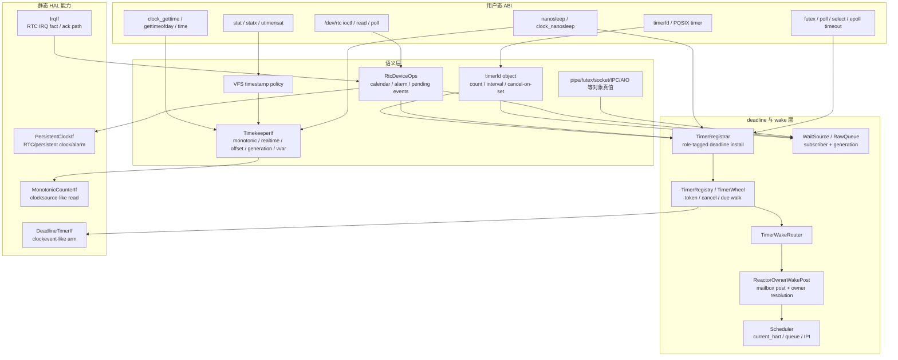

依赖方向固定为：

1. syscall/ABI 调语义 facade；
2. 语义对象注册 deadline 或发布 wait-source；
3. reactor 驱动 due walk，并把 due entry 转成 mailbox event；
4. owner-aware post 解析当前 task owner；
5. scheduler 负责 queue insert 和 remote IPI；
6. HAL 只提供 counter、deadline timer、persistent clock/IRQ 事实。

## 4. Linux 参考映射

Linux 的时间栈不是两层，而是硬件能力、核心 timekeeping、timer、fd 对象、
device class、scheduler wake 多组功能的组合。Tx v1 映射如下：

| Linux 功能群 | Linux 责任 | Tx 对应 owner |
|---|---|---|
| clocksource | 读稳定递增 counter | `MonotonicCounterIf` |
| clockevents | 设定下一次 timer interrupt | `DeadlineTimerIf` + reactor timer driver |
| timekeeping | 维护 monotonic/realtime/raw/boottime 等语义时间 | `TimekeeperIf` |
| hrtimer | 高精度 deadline 队列 | `TimerRegistrar` / `TimerRegistry` |
| timer wheel | 大量低精度内核 timeout | v1 统一进入 registry，内部可选 wheel 实现 |
| timerfd/POSIX timer | fd 或 process-owned timer 语义 | timerfd/POSIX timer object + registry |
| RTC class | `/dev/rtcN`、alarm、persistent clock | `PersistentClockIf` + `RtcDeviceOps` |
| vDSO/vvar | 用户态快速读 timekeeper snapshot | `TimekeeperIf::snapshot_for_vvar` |
| scheduler wake | wait queue wake 后决定 CPU | `ReactorOwnerWakePost` + scheduler |

关键差异：Linux 允许多套成熟 timer facility 并存，且有大量历史兼容层；
Tx v1 的目标是更小的统一模型。Tx 可以在 registry 内部使用 wheel、heap、rb-tree
等结构，但不能把每种用户语义拆成一套 public timeout subsystem。

## 5. 模块设计

### 5.1 HAL capability layer

HAL 只描述板级硬件能力，不拥有 Linux 语义对象。

| Trait | 作用 | 必须不做的事 |
|---|---|---|
| `MonotonicCounterIf` | 读单调 counter，并提供 tick/ns 转换基础 | 不返回 realtime，不处理 NTP，不创建 timerfd |
| `DeadlineTimerIf` | 为当前 hart 或 broadcast domain 设下一次中断 | 不保存 sleep 对象，不决定 task wake placement |
| `PersistentClockIf` | 读/写持久墙上时间，设置或 ack RTC alarm | 不作为 `clock_gettime` hot path，不直接挂 RNode |
| `IrqIf::RTC_IRQ` | 暴露可选 RTC IRQ 号和 ack 路径 | 不保存 RTC pending bits |

子架构：

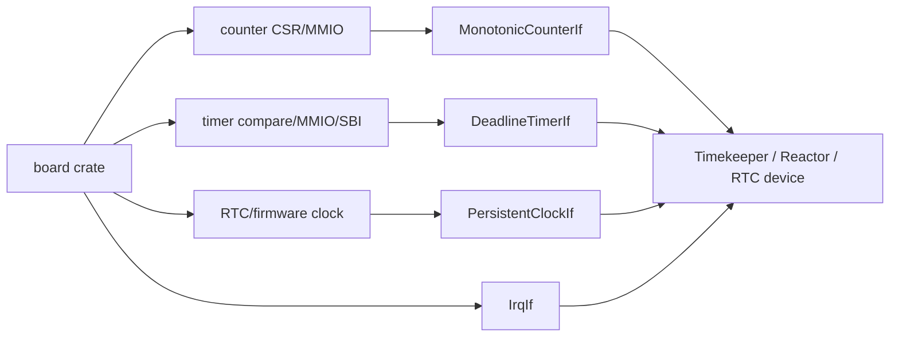

板级 profile：

| Profile | counter | deadline | persistent clock |
|---|---|---|---|
| SiFive/RISC-V-like | `time` CSR 或 CLINT/SBI | SBI timer 或 platform timer | goldfish/virt RTC、SBI/firmware 或 unsupported |
| LoongArch/2K-like | stable counter | constant timer / LS7A timer | LS7A RTC 或 unsupported |
| QEMU virt | 可预测 counter | QEMU timer interrupt | goldfish/LS7A backend |
| no-RTC board | 有 counter/deadline | 有 deadline timer | typed unsupported |

### 5.2 Timekeeper

`TimekeeperIf` 是语义时钟 facade。它把 monotonic counter 转成 kernel time，
再用 offset/generation 表示 realtime。

状态：

| 字段 | 作用 |
|---|---|
| monotonic base/cycle snapshot | 从 hardware counter 推导 monotonic ns |
| realtime offset | `realtime = monotonic + offset` |
| generation | realtime mutation 序号，用于 vvar、timerfd cancel-on-set、stat 一致性 |
| vvar snapshot | 用户态 fast path 读取的稳定快照 |
| persistent seed/writeback report | boot seed 和 `clock_settime` 后的 best-effort RTC writeback 结果 |

接口：

| 调用者 | 接口 | 语义 |
|---|---|---|
| clock syscall/vDSO | read snapshot | 读 monotonic/realtime，不读 RTC |
| VFS timestamp | realtime now | 与 clock syscall 同源 |
| sleep/futex/poll | deadline conversion | relative timeout 基于 monotonic |
| timerfd | realtime deadline conversion / generation watch | 处理 cancel-on-set 和 realtime 跳变 |
| boot | seed from persistent | 只在初始化路径采样 RTC |
| admin syscall | set realtime | 修改 offset/generation，触发通知和可选 writeback |

### 5.3 Timer Registry

Timer Registry 保存 deadline entry 和 token，不保存用户对象真值。

| 内容 | 归属 |
|---|---|
| deadline ns | registry |
| role tag | registry，用于 due 时分派到 timerfd/delegate/device/sleep 等路由 |
| cancel token/generation | registry |
| timerfd expiration count | timerfd object，不在 registry |
| futex wait condition | futex object，不在 registry |
| poll readiness truth | fd/object，不在 registry |

接口分成两面：

| Facade | 调用者 | 作用 |
|---|---|---|
| `TimerRegistrar` | syscall driver、StepOp、device emulation、timerfd | install/cancel deadline |
| `TimerRegistry` | reactor timer driver | fire due entries、查询 next deadline |
| `TimerWakeRouter` | reactor 实现 | 把 due entry 转成 owner-aware wake |

子架构：

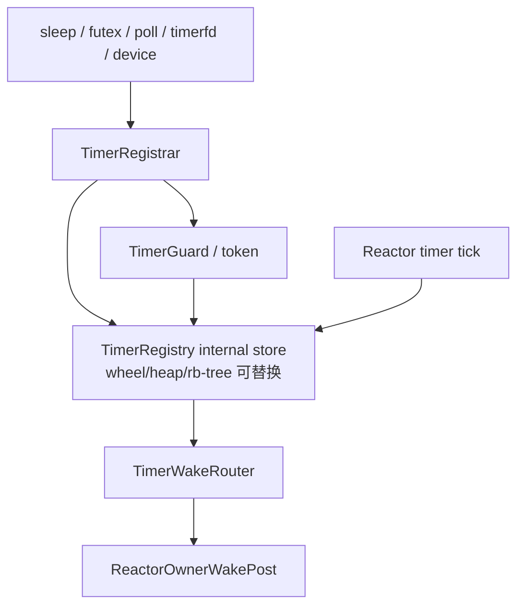

规则：

- cancel 和 fire 竞争时只能有一方发布。
- deadline 到期只产生 wake hint；driver 被唤醒后重新观察对象真值。
- registry 内部结构可以改变，public role/token 语义不能改变。
- 生产路径不能调用 router-free `fire_due` shortcut。

### 5.4 Reactor timer driver

Reactor 是 software deadline 到硬件 deadline 的驱动者。

每个 tick 或 timer IRQ 的路径：

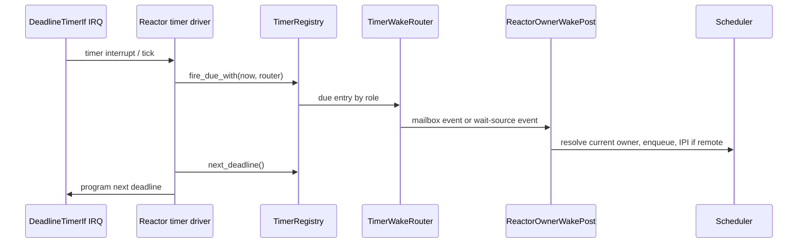

Reactor 不解释 timerfd count、futex condition 或 RTC calendar。它只在当前 hart
上下文中驱动 due walk、发布 wake，并重新设置下一次硬件 deadline。

### 5.5 WaitSource、TaskMailbox 和 WakeRouter

WaitSource 保存订阅者和 generation；TaskMailbox 保存 task wake identity；
WakeRouter 把 mailbox event 投递到当前 scheduler owner。

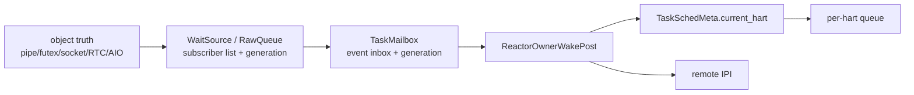

不变量：

- WaitSource 只说“可能变了”，不说操作一定成功。
- Mailbox 只保存 event，不表示 CPU 归属。
- Scheduler owner 是 `current_hart`，必须在 post 时读取并在队列锁下复查。
- Host/no-context 测试可以传 explicit direct closure，但生产路径不能保留第二套
  public direct wrapper。

### 5.6 RTC device route

RTC 有双重身份：

| 身份 | Owner | 接口 |
|---|---|---|
| 持久墙上时间能力 | HAL `PersistentClockIf` | boot seed、writeback、hardware alarm |
| Linux 设备对象 | subsystem `RtcDeviceOps` + devfs/RNode | ioctl/read/poll/alarm pending events |

路径：

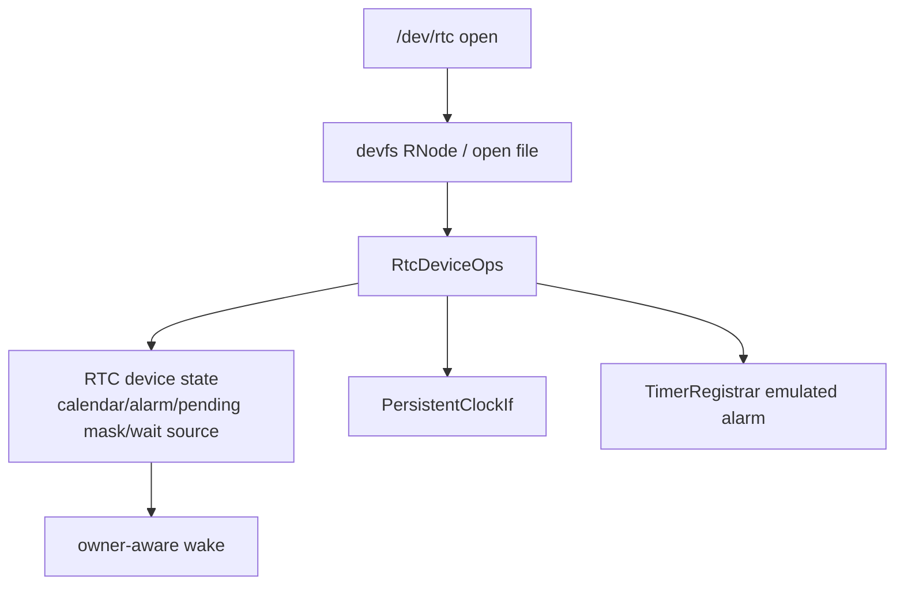

硬件 alarm 和 emulated alarm 最终都写同一份 RTC pending state；read/poll 只关心
pending bits，不关心事件来自 MMIO IRQ 还是 software timer。

## 6. 端到端控制流

### 6.1 `clock_gettime(CLOCK_REALTIME)`

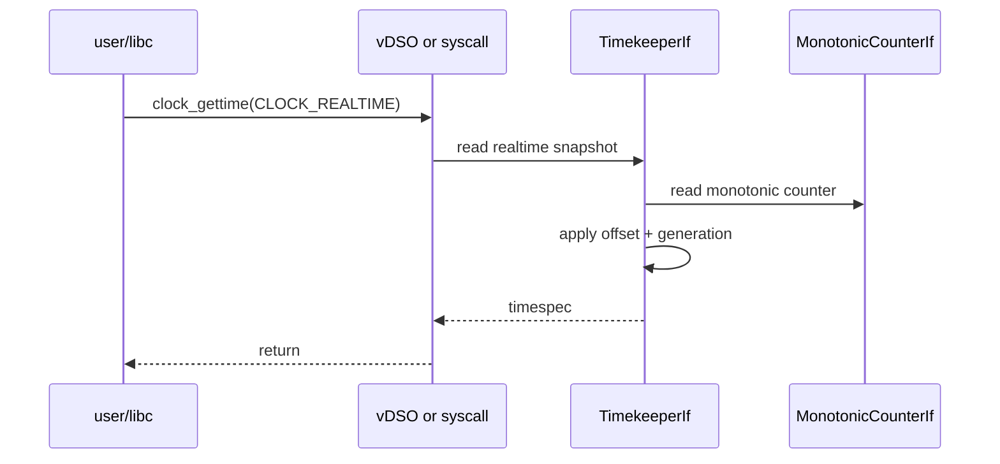

RTC 不在 hot path 上。RTC 只在 boot seed、admin writeback、RTC device ioctl/alarm
路径出现。

### 6.2 `stat` timestamp

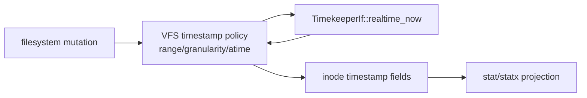

`stat` 时间戳一致性来自 VFS 和 Timekeeper 同源，而不是 filesystem 或 RTC 各自
读当前时间。

### 6.3 relative sleep / wait timeout

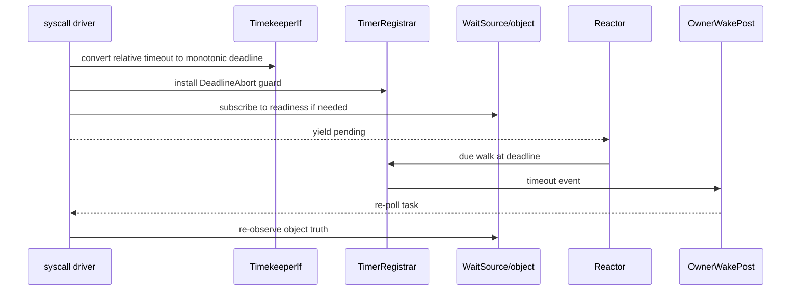

ready 和 timeout 同时发生时，结果由 driver 重新观察对象真值和 timer guard 状态
决定，不能由 timer callback 单方面返回成功或超时。

### 6.4 timerfd

timerfd 的 count、interval、cancel-on-set 和 fd readiness 属于 timerfd object。
Timer Registry 只负责到期提醒。

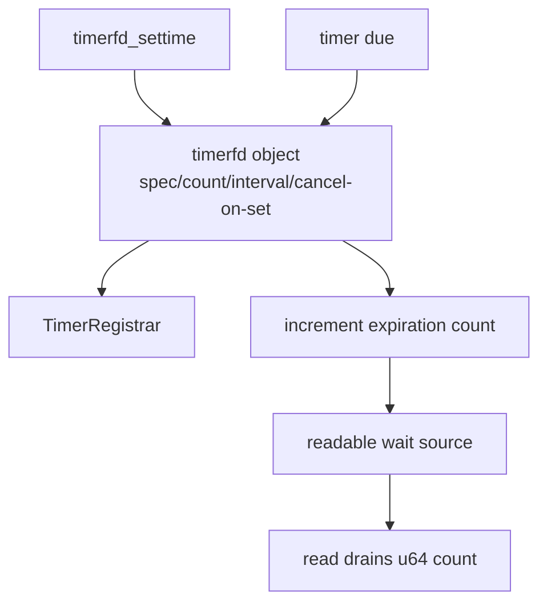

### 6.5 RTC alarm

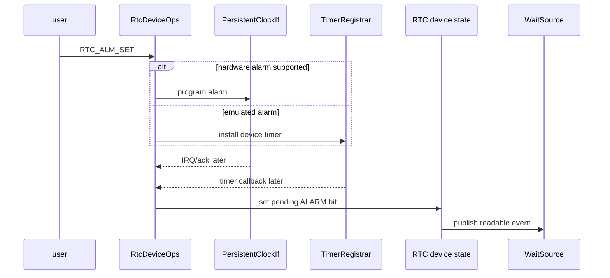

## 7. SMP 和 future stealing

timer wheel、wait-source、signal、pipe、socket 等 producer 都不能把“上次看到的
hart”当成 wake 目标。正确路径是：

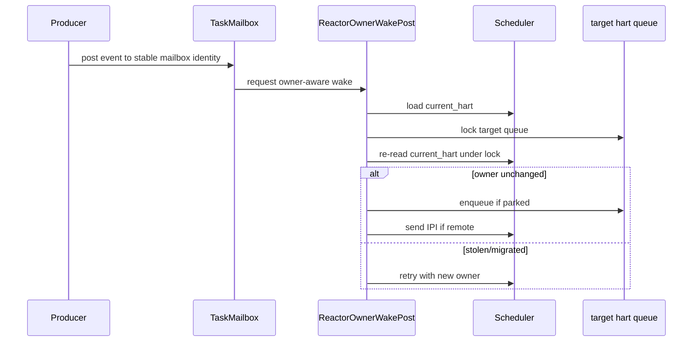

这和 Linux hrtimer/wakeup、Tokio-like executor、Fuchsia dispatcher 的共同模式一致：
deadline/readiness 生产者不拥有执行位置；执行位置由 scheduler/executor 在 wake
时决定。

必须避免三种替代方案：

| 替代方案 | 为什么不采用 |
|---|---|
| timer entry 保存 hart id | task 被偷取后 hart id 过期 |
| future 自带私有 timer wheel | timeout/cancel/reobserve 语义会按 future 类型分叉 |
| 每个 producer 直接插 run queue | 绕过 current owner 复查和 IPI 策略 |

## 8. 数据模型和 owner 表

| 数据对象 | 主 owner | 可见接口 | 关键不变量 |
|---|---|---|---|
| hardware counter metadata | HAL board crate | `MonotonicCounterIf` | 单调读，不含 realtime 语义 |
| hardware deadline state | HAL board crate | `DeadlineTimerIf` | 只设中断，不保存 semantic timer |
| realtime offset/generation | Timekeeper | `TimekeeperIf` | monotonic 不因 realtime set 回退 |
| vvar snapshot | Timekeeper | vDSO/vvar publication | seqlock/generation 稳定性 |
| timer entry | Timer Registry | token/guard/router | fire/cancel 只有一方胜出 |
| object readiness truth | owning subsystem | read/write/ioctl/StepOp | wake 后重新观察 |
| wait-source subscribers | owning subsystem / substrate wake | subscribe/fire | generation 过滤 stale wake |
| task mailbox queue | task runtime | mailbox post/poll_select | mailbox 不是 CPU owner |
| current_hart/queue | scheduler | owner-aware post | 锁下复查 current_hart |
| RTC pending/alarm state | RTC device subsystem | `RtcDeviceOps` | HAL IRQ 和 emulated timer 汇入同一状态 |

## 9. 接口合同

### 9.1 HAL trait 合同

| 接口 | 合法上层 | 禁止依赖 |
|---|---|---|
| `MonotonicCounterIf` | Timekeeper、reactor timer driver、observe timestamp | VFS/devfs、timerfd object、syscall policy |
| `DeadlineTimerIf` | reactor timer driver | futex/poll/timerfd 语义对象 |
| `PersistentClockIf` | Timekeeper seed/writeback、RtcDeviceOps、RTC IRQ handler | clock hot path、RNode construction |
| `IrqIf::RTC_IRQ` | kernel IRQ install、RTC event publication | RTC device pending state |

### 9.2 语义 facade 合同

| Facade | 合法调用者 | 返回/副作用 |
|---|---|---|
| `TimekeeperIf` | clock syscall、vDSO bootstrap、VFS timestamp、timeout conversion、timerfd | time snapshot、deadline conversion、generation mutation |
| `TimerRegistrar` | sleep/futex/poll/timerfd/delegate/device | timer token 或 guard |
| `TimerRegistry` | reactor | due entries、next deadline |
| `TimerWakeRouter` | reactor timer route | 根据 role 转换成 mailbox/wait-source event |
| `RtcDeviceOps` | devfs/RNode char dispatch | RTC ioctl/read/poll/alarm 语义 |
| `ReactorOwnerWakePost` | reactor、kernel current-hart wrappers、syscall injected post | mailbox event + scheduler placement |

### 9.3 Producer `_with_post` 合同

所有会发布 wake 的 semantic producer 都采用同一迁移形状：

```text
semantic mutation + wait-source/mailbox target resolution
    + caller-injected post closure
    -> owner-aware route in production
    -> explicit direct closure in no-context tests
```

不能保留“生产路径 direct wrapper”。如果 no-context 测试需要直接投递，测试必须显式传
direct closure，使 bypass 在 callsite 上可见。

## 10. 错误语义

| 场景 | 处理规则 |
|---|---|
| 没有 RTC 硬件 | `PersistentClockIf` 和 `RtcDeviceOps` 返回 typed unsupported；clock hot path 仍工作 |
| RTC 时间非法 | RTC device op 返回错误，不污染 Timekeeper |
| `clock_settime` 后 RTC writeback 失败 | kernel realtime mutation 已接受，不回滚；记录 best-effort failure |
| deadline 已过期 | 走同一 registrar/router/post/reobserve 路径，可以立即触发但不能绕过 owner |
| stale timer token | driver 忽略并重新观察 |
| mailbox weak upgrade 失败 | 视为 task/object 生命周期已结束，丢弃 wake |
| remote IPI 失败或不需要 | 本地 owner 不发 IPI；remote owner 通过 platform IPI/reschedule signal |

## 11. 并发、锁序和线性化点

| 竞态 | 线性化点 |
|---|---|
| timer fire vs cancel | registry token/generation |
| waiter register vs readiness fire | waiter 注册后重新观察 object truth |
| realtime set vs timerfd cancel-on-set | Timekeeper generation mutation |
| RTC IRQ vs read drain | RTC device pending mask lock |
| producer wake vs task stealing | owner-aware post 的 queue lock + current_hart recheck |
| due walk vs new earlier deadline | due walk 后读取 next deadline 并 reprogram hardware |

推荐锁序：

1. object-local semantic lock；
2. wait-source subscriber snapshot 或 weak mailbox upgrade；
3. mailbox event enqueue；
4. scheduler owner queue lock；
5. IPI send。

不要在 scheduler queue lock 内调用 HAL MMIO、VFS path lookup、filesystem IO 或可能
重新进入 semantic subsystem 的代码。

## 12. 实施包

| 包 | 目标 | 退出证据 |
|---|---|---|
| A. HAL split | `TimeIf` 退休，三类硬件能力明确 | active Rust 无 `TimeIf`；board trait tests |
| B. Timekeeper facade | `TimekeeperIf` 成为唯一 semantic clock facade | clock/stat/vvar/realtime mutation 同源 |
| C. Timer Registry | sleep/futex/poll/timerfd/delegate/device timeout 共用 registry | 私有 timer queue/future 退休 |
| D. Reactor owner wake | timer due 和 wait-source post 走 scheduler-aware route | mixed producer wake、remote IPI、owner recheck tests |
| E. RTC route | `/dev/rtc` 经 `RtcDeviceOps` + devfs/RNode | ioctl/read/poll/alarm/emulated/hardware tests |
| F. Linux ABI slots | clock/sleep/timerfd/stat 基本兼容 | focused syscall/libctest/LTP witness |
| G. Producer convergence | signal、pipe、eventfd、futex、IPC、socket、AIO、TTY、VFS 等 `_with_post` 收敛 | old wrapper gate 绿，producer tests 绿 |
| H. Board evidence | QEMU、no-RTC、真实板卡/firmware RTC 证据 | progress 记录 QEMU/board witness；缺失项明确 blocker |

当前文档可以声明架构完整；实现完整必须等所有包退出证据到位，尤其 Package H
外部真实板卡或 firmware-backed RTC witness。

## 13. 验收标准

### 13.1 文档和架构验收

- 每个 Linux-visible feature 都能映射到一个 Tx owner。
- 每个跨层调用都有 trait、facade、adapter 或 injected closure seam。
- 每份 mutable state 都只有一个 primary owner。
- timer、wait-source、RTC、SMP wake 的主要竞态都有线性化点。
- open feature 被标成 deferred slot 或 Package H evidence gap，而不是伪装成完成。

### 13.2 机械 gate

基础 gate：

```sh
cargo xtask lint invariants time-wake-retired
cargo test -p xtask lint_invariants_time_wake -- --nocapture
cargo xtask progress validate
cargo xtask lint docs
```

按修改范围追加：

| 修改范围 | focused proof |
|---|---|
| HAL/timekeeper | board trait tests、clock/stat/vvar tests |
| timer registry/reactor | fire/cancel、owner-aware route、remote wake tests |
| producer `_with_post` | producer-specific injected-post tests + retired-name grep |
| RTC/device | ioctl/read/poll/alarm/IRQ/emulated alarm tests |
| SMP wake | mixed producer host tests、QEMU SMP markers、IPI proof |

### 13.3 禁止完成口径

不能因为以下证据就宣称 implementation complete：

- 只写了文档；
- 只跑了一个 producer 的 focused test；
- `time-wake-retired` 绿但 Package H witness 仍 open；
- QEMU 通过但真实板卡/firmware RTC 证据未记录；
- old wrapper 还存在，只是 production caller 暂时不用。

## 14. 与 VFS/HAL 重构的关系

time/RTC 路径给后续 VFS-to-HAL 重构提供一个可复用模板：

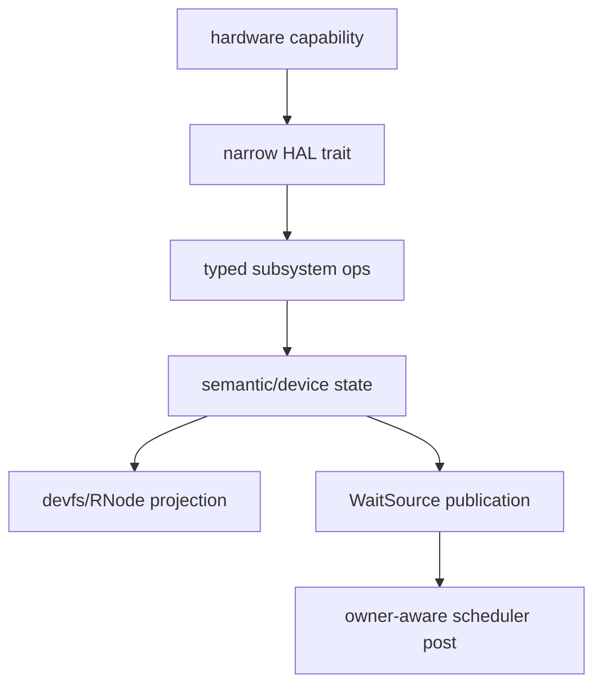

原则：

- HAL 不创建 RNode。
- devfs 不读 MMIO。
- typed ops 连接 Linux fd/device 语义和底层能力。
- readiness 通过 WaitSource 发布。
- runnable placement 只在 owner-aware scheduler route 决定。

这个模板适用于 RTC，也适用于后续 serial、block、net、input、virtio-control 等
设备路线。

## 15. 评审算法

评审一个 time/wake patch 时按这个顺序问：

1. 用户可见语义是什么，对应 Linux 哪个功能群？
2. 语义真值由哪个 Tx owner 保存？
3. 下层能力来自哪个 HAL trait 或 substrate primitive？
4. 上层 ABI 通过哪个 facade、typed ops 或 StepOp 进入？
5. 是否产生 wake；如果产生，caller 注入的是 mailbox post 还是 mailbox-ref post？
6. wake 后是否重新观察 object truth，而不是直接返回成功？
7. task owner 是否在 post 时解析，并在队列锁下复查？
8. no-context fallback 是否显式传 direct closure？
9. 旧接口名是否加入并通过 `time-wake-retired` gate？
10. progress 里是否记录验证、下一步和 blocker？

十个问题都能回答，才说明 patch 与完整设计一致。

## 16. 最终设计合同

最终目标可以压缩成五条不可违反的合同：

1. `MonotonicCounterIf`、`DeadlineTimerIf`、`PersistentClockIf` 是硬件能力，不是
   Linux 语义对象。
2. `TimekeeperIf` 是 clock/stat/vDSO/realtime mutation 的唯一语义时钟入口。
3. `TimerRegistry` 只拥有 deadline/token，不拥有 timerfd count、futex condition
   或 RTC pending bits。
4. `WaitSource` 和 `TaskMailbox` 只产生 wake hint；真实结果由 owner object 和 driver
   重新观察。
5. `ReactorOwnerWakePost` 和 scheduler 在 wake 时决定 runnable placement，任何
   producer 都不能缓存 hart 并直接插队列。

如果未来实现必须违反其中一条，说明需要重开设计评审，而不是在代码里补一个临时
shortcut。

## 17. 需求追踪矩阵

完整设计必须能从 Linux/POSIX 可见需求追到 Tx owner、接口、证明和延后边界。
下表是实现和评审时的主索引。

| 需求 | Linux 参考功能群 | Tx owner | 主接口 | 验收证据 | v1 边界 |
|---|---|---|---|---|---|
| `CLOCK_MONOTONIC` 读时间 | clocksource + timekeeping | Timekeeper + HAL counter | `TimekeeperIf`、`MonotonicCounterIf` | clock syscall/vDSO focused tests | raw/boottime 扩展槽保留 |
| `CLOCK_REALTIME` 读写 | timekeeping + NTP hooks | Timekeeper | realtime offset/generation mutation | `clock_gettime`、`clock_settime`、vvar generation tests | NTP/leap/TAI 完整状态机 deferred |
| VFS 时间戳 | filesystem timestamp + timekeeping | VFS timestamp policy | `TimekeeperIf::realtime_now` 风格入口 | stat/statx/utimensat focused tests | fs granularity/y2038 逐 fs 补齐 |
| relative sleep | hrtimer sleep | syscall driver + Timer Registry | `TimerRegistrar` guard | sleep timeout-vs-signal tests | CPU timer 不在 v1 |
| futex/poll/select timeout | hrtimer + wait queue | owning object + Timer Registry | wait-source subscription + timer guard | ready-vs-timeout race tests | 每类对象继续补 focused proof |
| timerfd | timerfd + hrtimer/alarmtimer | timerfd object | timerfd object + `TimerRegistrar` + wait source | expiration count、interval、cancel-on-set tests | alarm clock suspend 语义 deferred |
| `/dev/rtc` ioctl/read/poll | RTC class | RTC device subsystem | `RtcDeviceOps` + devfs/RNode | ioctl/read/poll/alarm tests | RTC class hotplug deferred |
| boot persistent time seed | persistent clock / RTC | Timekeeper boot path | `PersistentClockIf` | QEMU/board boot seed witness | no-RTC board typed unsupported |
| RTC alarm | RTC class + alarmtimer | RTC device + Timer Registry | hardware alarm or emulated device timer | hardware IRQ / emulated alarm tests | PM wake accounting deferred |
| cross-hart wake | scheduler wakeup | ReactorOwnerWakePost + Scheduler | mailbox or mailbox-ref post | owner recheck、remote IPI、SMP marker tests | broader board stress remains evidence gap |

当某个新需求无法填写这张表时，它不是“缺一个 helper”，而是设计边界尚未闭合。
应先扩展 owner/interface/proof，再进入实现。

## 18. 关键状态机

### 18.1 Timer Guard

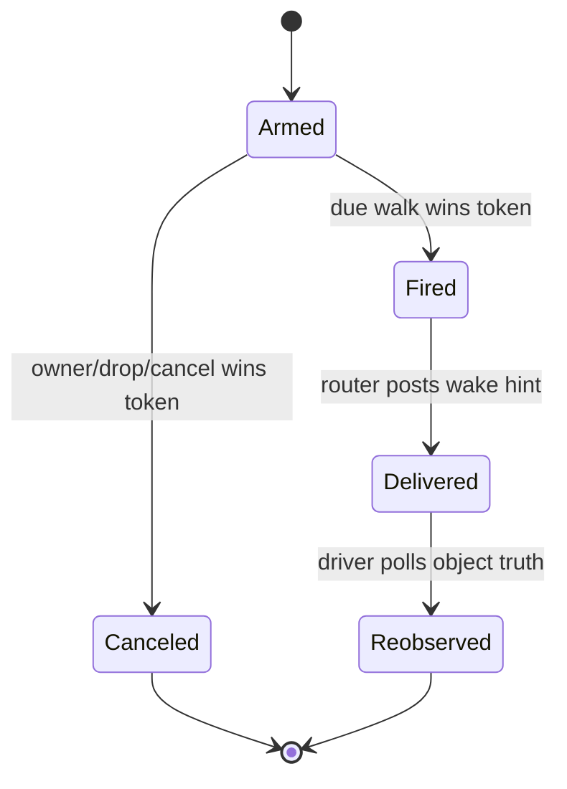

规则：

- `Fired` 和 `Canceled` 只能有一个胜者。
- `Delivered` 不等于 syscall 成功或超时返回；driver 必须重新观察对象状态。
- stale token、stale source generation 或 task 已退出时，wake 可以被丢弃。

### 18.2 WaitSource Subscription

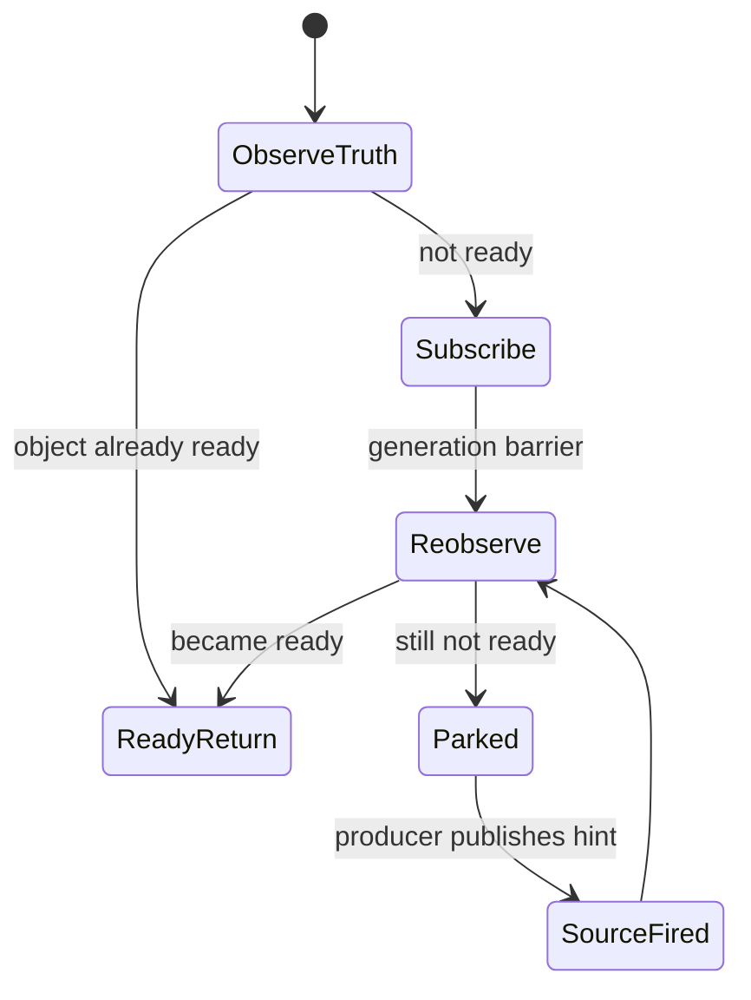

订阅后必须再观察一次 object truth，关闭“检查后再注册”竞态。producer 发布的是
`SourceFired` 一类 hint，不携带最终业务结果。

### 18.3 Task Owner Wake

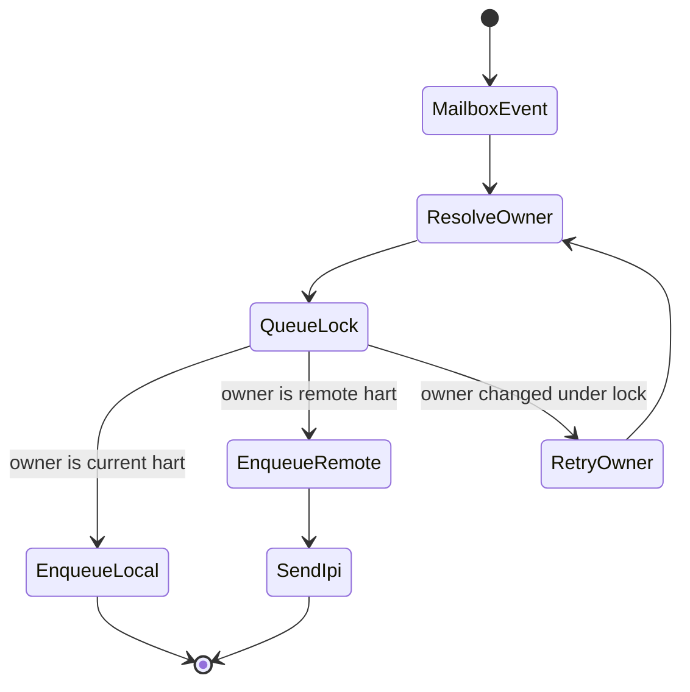

task identity 和 CPU owner 分离。mailbox 是稳定投递目标；`current_hart` 是调度器
状态，必须在 owner-aware post 路径读取并复查。

### 18.4 RTC Event

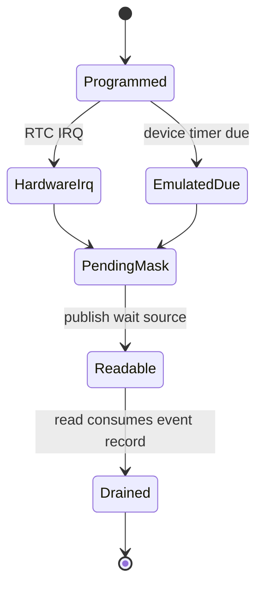

硬件 IRQ 和软件 emulation 只是在来源上不同，最终都进入同一份 RTC device pending
mask。read/poll/ioctl 只观察 RTC device state，不直接观察 HAL alarm 源。

## 19. 完整接口蓝图

本节用目标接口形状描述模块之间的合法依赖。名字是设计合同，不要求每个函数签名
逐字等同，但实现必须保持同等 owner 和调用方向。

### 19.1 HAL 能力接口

| Trait | 必要能力 | 合法调用者 | 返回错误 |
|---|---|---|---|
| `MonotonicCounterIf` | read counter、counter->ns metadata | Timekeeper、reactor timer driver、observe timestamp | unstable/unsupported profile error |
| `DeadlineTimerIf` | arm one-shot deadline、disable/ack timer | reactor timer driver | unsupported/busy/platform error |
| `PersistentClockIf` | read/set realtime ns、read/set/ack alarm | Timekeeper boot/writeback、RtcDeviceOps、RTC IRQ handler | unsupported/invalid/alarm unsupported |
| `IrqIf` RTC row | optional RTC IRQ number and dispatch fact | kernel IRQ init | zero sentinel for no IRQ |

HAL trait 不依赖 VFS、RNode、timerfd、futex、scheduler queue 或 syscall policy。

### 19.2 语义接口

| Interface | 状态 owner | 上层调用 | 下层依赖 |
|---|---|---|---|
| `TimekeeperIf` | realtime offset、generation、vvar snapshot | clock/stat/vDSO/timerfd conversion | `MonotonicCounterIf`、optional `PersistentClockIf` |
| `TimerRegistrar` | producer-facing deadline install token | sleep/futex/poll/timerfd/delegate/device | `TimerRegistry` |
| `TimerRegistry` | deadline ordering and token state | reactor timer driver | `DeadlineTimerIf` through driver reprogram |
| `TimerWakeRouter` | due-entry role dispatch | reactor due walk | `ReactorOwnerWakePost`、wait-source lookup |
| `RtcDeviceOps` | RTC calendar/alarm/pending/readiness | devfs/RNode char dispatch | `PersistentClockIf`、`TimerRegistrar` |
| `ReactorOwnerWakePost` | runnable placement transition | timer/wait-source/syscall/worker injected posts | scheduler current-owner state + IPI |

### 19.3 Producer 注入接口

所有 wake producer 的公共形态是：

```text
fn mutate_or_publish_with_post(..., post: impl FnMut(&TaskMailbox, MailboxEvent) -> bool)
fn mutate_or_publish_with_hint_post(
    ...,
    post: impl FnMut(&TaskMailbox, MailboxEvent, MailboxSchedulerHint) -> bool,
)
fn mutate_or_publish_mailbox_ref_with_post(
    ...,
    post: impl FnMut(&TaskMailbox, MailboxEvent) -> bool,
)
```

实际代码可以用 trait method、function pointer、closure 或 `SyscallCtx` 字段承载，
但必须满足三条规则：

- semantic mutation 留在对象 owner 内。
- production caller 注入 owner-aware post。
- no-context fallback 在 callsite 显式传 direct closure，不能保留第二套 public direct
  wrapper。

## 20. Producer 迁移目录

| Producer family | 语义真值 owner | Wake target | 目标 seam | 证明重点 |
|---|---|---|---|---|
| signal / process death | signal/process subsystem | task mailbox、signalfd、exit-source | dual-post `_with_post(s)` | fatal path、group fanout、signalfd readiness |
| futex | futex bucket | futex wait source | hint-aware mailbox-ref post | wake bitset、requeue、timeout race |
| pipe/eventfd/signalfd | owning fd object | read/write wait source | mailbox-ref `_with_post` | read/write readiness and stale generation |
| POSIX/SysV IPC | mq/msg/sem object | sender/receiver wait source and signal mailbox | dual seam where needed | `IPC_RMID` abort and notify fanout |
| sockets/network | socket readiness, loopback UDP/ICMP delivery, net device TX send-space, netlink response queues, and net delegate | socket wait source, delegate mailbox | hint-aware post hooks, loopback/device-TX `_with_post` helpers, and netlink `_with_post` sends | poll/read/write readiness, loopback/device-TX injected-post proof, netlink response readability, delegate kick |
| AIO/io_uring | context/ring object | completion queue wait source | worker-injected completion post | worker has no direct scheduler shortcut |
| TTY | tty line discipline/open state | read/write wait source and signal targets | hint-aware post | console ingest and pgrp signal split |
| VFS/RNode | RNode/open-file readiness | read/write wait source | RNode `_with_post` verbs | device/backend readiness without HAL shortcut |
| RTC/device | RTC device pending mask | RTC RawQueue / fd readiness | `publish_rtc_event_with_post` | hardware IRQ and emulated alarm converge |

迁移完成不是“production caller 已改完”这么窄；旧 public wrapper、旧 StepOp 名称、
旧 direct helper 名称也要进入 `time-wake-retired` gate，避免后续回流。

## 21. 端到端测试矩阵

| 层级 | 必测内容 | 推荐命令或 witness |
|---|---|---|
| 文档/链接 | active docs 链接、stale vocabulary、txdoc 引用 | `cargo xtask lint docs` |
| retired interface | 旧宽接口和 direct wake wrapper 不存在 | `cargo xtask lint invariants time-wake-retired` |
| xtask linter 自测 | retired matrix 本身不漂移 | `cargo test -p xtask lint_invariants_time_wake -- --nocapture` |
| progress | JSON progress/handoff/worktree 有效 | `cargo xtask progress validate` |
| HAL | board trait profile、no-RTC typed unsupported | board-focused host tests |
| Timekeeper | realtime seed、generation、vvar、stat 同源 | clock/stat/time syscall focused tests |
| Timer Registry | fire/cancel、next deadline、role router | substrate/reactor timer focused tests |
| WaitSource | subscribe/fire/reobserve/stale generation | subsystem wait-source focused tests |
| Producer | each family `_with_post` route | producer-specific host tests |
| SMP | owner recheck、remote IPI、post-steal wake | mixed-producer host/QEMU SMP markers |
| RTC | ioctl/read/poll/alarm/IRQ/emulation | QEMU goldfish/LS7A/no-RTC tests |
| Board evidence | real-board or firmware-backed RTC | Package H external witness in progress |

文档完成至少要求前四项能跑通或有明确说明；实现完成必须补齐对应代码修改范围的
focused proof，并记录 Package H 外部 witness 的当前状态。

## 22. 文档维护和同步规则

本文件是正式评审入口，但不是唯一规范来源。任何后续补丁只要改变 owner、
接口、producer row、retired 名称、Package A-H 退出条件或验收证据，必须按顺序
同步：

1. 更新 [`TIME_WAKE_v1.md`](../../design/02_execution/TIME_WAKE_v1.md) 的
   txdoc-tagged 规范合同。
2. 更新本文件的对应章节，保持正式评审入口自洽。
3. 如果累计中文说明或英文 handoff 暴露同一边界，同步
   [`TX_TIME_WAKE_DESIGN_CN.md`](TX_TIME_WAKE_DESIGN_CN.md) 和
   [`TX_TIME_WAKE_DESIGN.md`](TX_TIME_WAKE_DESIGN.md)。
4. 更新 `xtask/src/lint_invariants_time_wake.rs`，让旧接口、旧名字或禁止依赖成为
   mechanical gate。
5. 更新 `docs/progress/STATUS.md` 和相关 research/decision note，写明修改内容、
   验证命令、下一步和 blocker。

只补文档不补 proof，不能宣称 implementation complete；只补代码不补规范和 progress，
也不能视为设计闭合。

## 23. 实现切片和代码落点

完整实现不要按“时间子系统”一把改完，而应按 owner 和 producer family 拆成可验证
切片。每个切片都要做到：接口变窄、旧名字退休、focused proof 通过、progress 更新。

| 切片 | 主要代码落点 | 输入接口 | 输出接口 | 退出条件 |
|---|---|---|---|---|
| HAL capability | `crates/tx-hal`、`boards/tx-hal-*` | board CSR/MMIO/SBI/firmware | `MonotonicCounterIf`、`DeadlineTimerIf`、`PersistentClockIf` | active Rust 无宽 `TimeIf` 依赖；board tests 覆盖 supported/unsupported profile |
| Timekeeper | `crates/tx-subsystems/src/wall_clock.rs`、`crates/tx-shims/src/linux_syscall/time.rs`、vDSO bootstrap | monotonic counter、persistent seed、admin mutation | clock/stat/vvar/timerfd deadline conversion | clock/stat/realtime mutation 同源；raw public `wall_clock` runtime wrapper 退休 |
| Timer Registry | `crates/tx-substrate/src/wake/timer.rs`、`crates/tx-reactor/src/timer.rs` | producer deadline、role、mailbox target | due walk、next deadline、timer guard | router-free due shortcut、private `TimerQueue`、`DeadlineFuture` 退休 |
| ActiveWait | `crates/tx-reactor/src/wait.rs`、`crates/tx-scripts/src/drive.rs`、syscall wait adapters | `YieldShape`、`WaitProtocol.deadline` | timer guard + primary wait guard | timeout/cancel/drop 顺序可测；ready-vs-timeout 重新观察 |
| Owner-aware wake | `crates/tx-reactor`、`crates/tx-substrate/src/wake/mailbox.rs` | task mailbox or mailbox-ref event | scheduler enqueue + optional IPI | post-steal owner recheck、already-runnable 不重复入队、remote IPI proof |
| RTC device | `crates/tx-subsystems/src/device.rs`、`crates/tx-fs/src/devfs`、`crates/tx-kernel/src/irq.rs` | `PersistentClockIf`、emulated timer、RTC IRQ | `RtcDeviceOps`、pending mask、read/poll wait source | `/dev/rtc` 不绕过 typed ops；IRQ 和 emulation 汇入同一 pending state |
| Producer convergence | owning modules under `crates/tx-subsystems/src` and syscall/worker callers | semantic mutation + subscriber snapshot | caller-injected post seam | old direct wrapper 进入 `time-wake-retired`；production caller 注入 owner-aware post |

切片内部允许临时 adapter，但切片退出时 adapter 不能继续作为可调用 public direct
interface 存在。测试里的 direct post 也必须在 callsite 明确可见，不能通过“默认
production-like wrapper”隐藏。

## 24. PR 拆分建议

后续落地建议按下面顺序推进，避免在一个 patch 同时改 HAL、timer、scheduler、
socket readiness 和 RTC device，导致失败点不可定位。

1. **规范同步 PR**：只改 active design、本文、README、progress 和 linter pattern，
   明确本轮要 retire 的旧接口名。
2. **底层接口 PR**：改 HAL/timekeeper/timer registry 等单 owner 接口，先让 host
   tests 和 `cargo check` 证明编译面稳定。
3. **单 producer PR**：一次只迁移一个 producer family，例如 futex、eventfd、pipe、
   timerfd、socket readiness、AIO/io_uring completion 或 RTC device event。
4. **跨核 proof PR**：把已经迁移的多个 producer 合并进 mixed-producer host/QEMU
   witness，证明 post-steal/current-owner 路径一致。
5. **retirement PR**：删除旧 wrapper、旧 StepOp 名、旧 re-export，并把它们加入
   `time-wake-retired` gate。
6. **board evidence PR**：补 QEMU/no-RTC/real-board 或 firmware-backed RTC witness，
   关闭 Package H。

每个 PR 的最终说明必须包含三项：

| 项 | 必填内容 |
|---|---|
| changed owner | 哪个状态 owner 或 producer family 发生变化 |
| verification | 具体命令、focused test、QEMU/board witness 或未跑原因 |
| remaining gap | 下一步 producer、board evidence、deferred feature 或 blocker |

## 25. 旧接口退休清单的维护规则

旧接口退休不是简单删调用点，而是关闭三类入口：

| 入口类型 | 风险 | 处理方式 |
|---|---|---|
| public helper | 新代码可能继续调用旧 direct route | 删除或改名为 `_with_post`，并把旧名加入 linter |
| StepOp wrapper | dispatch 可能绕过 injected post | 用 `*WithPostOp` 替代旧 `*Op`，旧名加入 linter |
| re-export/default method | production caller 看不到 direct fallback | 删除 re-export；no-context caller 显式传 closure |

retired gate 应覆盖 active Rust 的定义、调用、import 和 re-export。允许命中范围只包括：
文档、progress、archived notes、linter 自测样例，以及明确说明旧名已退休的注释。

推荐维护流程：

```text
1. rg 找出旧名定义、调用、re-export、测试 helper。
2. 改 production caller 为 `_with_post` 或 injected context seam。
3. 改 no-context tests 为显式 direct closure。
4. 删除旧 wrapper 和旧 re-export。
5. 在 `xtask/src/lint_invariants_time_wake.rs` 加旧名。
6. 跑 linter self-test 和 `cargo xtask lint invariants time-wake-retired`。
```

如果某个旧名暂时不能删除，不能把切片标为完成；只能在 progress 中记录为 open
retirement gap，并说明阻塞的 caller。

## 26. 最终交付清单

完整设计对应的最终交付物如下。后续实现完成时应逐项勾掉，而不是用单个
“测试通过”覆盖所有语义。

| 交付物 | 必要证据 |
|---|---|
| active design 合同 | `TIME_WAKE_v1.md` 与本文 owner/interface/producer row 一致 |
| Linux 参考边界 | README 中每个 Linux 功能群有 Tx 映射或 deferred 说明 |
| HAL 三能力 | 所有 board crate 明确 supported/unsupported profile |
| Timekeeper 单入口 | clock/stat/vvar/realtime mutation 只经 `TimekeeperIf` |
| Timer Registry 单入口 | sleep/futex/poll/timerfd/delegate/device deadline 只经 registrar |
| Owner-aware post | timer、wait-source、signal、IPC、socket、AIO、TTY、VFS、RTC producer 通过同一 placement seam |
| RTC typed route | devfs/RNode -> `RtcDeviceOps` -> HAL/emulated timer -> pending wait source |
| mechanical retirement | `cargo xtask lint invariants time-wake-retired` 绿且覆盖本轮旧名 |
| focused tests | 每个 producer family 有至少一个 injected-post 或 readiness-after-wake proof |
| SMP witness | host mixed-producer 和 QEMU SMP marker 证明 remote owner wake |
| Package H | QEMU/no-RTC/real-board 或 firmware-backed RTC witness 在 progress 中闭合 |
| progress closeout | `STATUS.md` 和相关 research/decision note 记录 changed/verified/next/blocker |

只有这张表里的实现证据闭合后，才能把 time/wake 重构称为 implementation complete。
在此之前，本文已经提供完整设计和实现路线，但剩余实现项必须继续按 Package A-H
和 producer row 逐项推进。

## 27. 实现级模块详设

本节把前面的 owner 表和控制流展开成实现级读图。读代码或拆 PR 时，不应只看
“time/wake”这个总名，而要先确定当前修改落在哪个模块，然后检查它的上层入口、
下层依赖、状态 owner 和 wake 出口是否与本节一致。

### 27.1 HAL 三能力

HAL 层只把板级硬件事实规整成三个窄能力。它不保存 Linux 对象，不创建 RNode，
不持有 wait source，也不调用 scheduler。

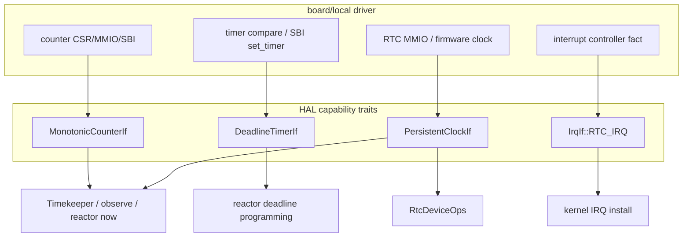

模块逻辑：

1. boot 或 board init 建立 MMIO/CSR/SBI 访问前提；
2. `MonotonicCounterIf` 把 raw counter 规整为 monotonic ns 或可转换 metadata；
3. `DeadlineTimerIf` 只对当前 hart 的下一次 timer interrupt 负责；
4. `PersistentClockIf` 读写 persistent realtime，并可选支持 alarm；
5. RTC IRQ ack 是 board-local 细节，ack 后只能发布 typed RTC event，不能直接唤醒
   用户 task。

上层接口：

| 上层 | 可调用能力 | 禁止行为 |
|---|---|---|
| Timekeeper | `MonotonicCounterIf`、boot seed/writeback 时的 `PersistentClockIf` | 在 clock hot path 每次读 RTC |
| Reactor | `MonotonicCounterIf`、`DeadlineTimerIf` | 保存 timerfd/futex/poll 语义 |
| RTC device | `PersistentClockIf`、RTC IRQ fact | 直接插 scheduler queue |
| Observe/tracing | monotonic timestamp | 修改 timekeeper offset |

### 27.2 Timekeeper

Timekeeper 是 semantic clock owner。它的核心状态是 monotonic 基准、realtime
offset、generation 和 vvar snapshot。

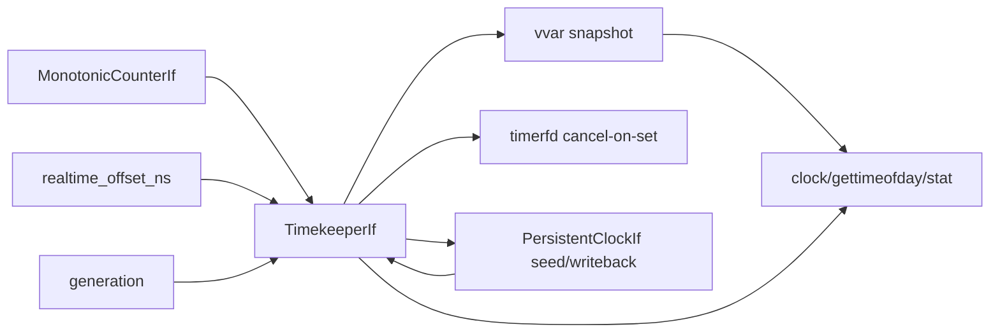

读路径：

1. 读 monotonic counter；
2. 根据 clock id 选择直接返回 monotonic，或加 `realtime_offset_ns` 返回 realtime；
3. 对 vDSO/vvar 读者发布带 generation 的稳定 snapshot；
4. VFS timestamp 与 clock syscall 使用同源 realtime。

写路径：

1. `clock_settime` 或 `settimeofday` 先在 timekeeper 内计算新 offset；
2. generation 递增，vvar 重新发布；
3. timerfd/alarmtimer 类对象按 generation 处理 cancel-on-set 或重算；
4. persistent RTC writeback 是 best-effort 后置动作，失败不回滚已经接受的
   kernel realtime。

触及模块：

| 触点 | 数据流 |
|---|---|
| vDSO/vvar | timekeeper snapshot -> 用户态 fast path |
| VFS | filesystem mutation -> `TimekeeperIf` -> inode timestamp |
| timerfd | realtime generation -> cancel-on-set / deadline revalidation |
| boot | `PersistentClockIf` seed -> initial realtime offset |
| admin syscall | accepted realtime mutation -> optional persistent writeback |

### 27.3 Timer Registry

Timer Registry 是 deadline/token owner，不是 timerfd、futex、poll、RTC 或 delegate
的语义 owner。

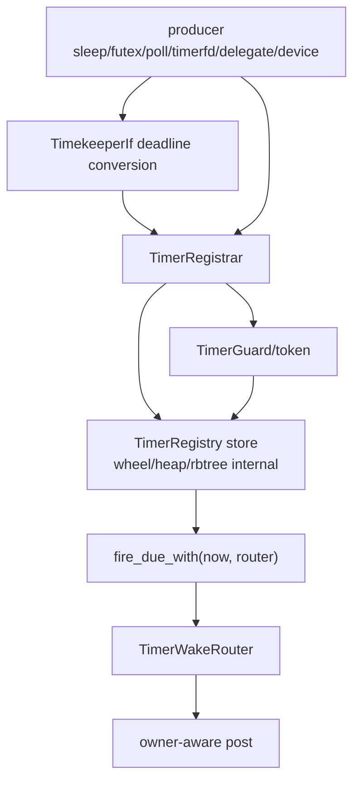

安装逻辑：

1. producer 把用户 ABI 时间转换成 monotonic deadline；
2. 调 `TimerRegistrar` 安装 role-tagged deadline；
3. registry 返回 guard/token；
4. producer 保存 guard，但不保存 registry 内部 entry；
5. guard drop/cancel 与 due walk 通过 token/generation 竞争。

fire 逻辑：

1. reactor 读 now；
2. `TimerRegistry::fire_due_with(now, router)` 取出 due entries；
3. 对每个 entry 检查 token/generation；
4. router 根据 role 发布 `TimerFired`、`DeadlineAbort`、delegate timeout 或 device
   event；
5. 被唤醒的 driver 重新观察语义对象。

不能出现的形状：

- future 私有 timer wheel；
- syscall shim 直接遍历 registry；
- timer callback 直接返回 syscall 结果；
- router-free `fire_due` 生产接口；
- timer entry 缓存 target hart。

### 27.4 ActiveWait、StepOp 和 ABI timeout

Step/ABI 层把 Linux sleep 和 timeout 语义翻译成“primary wait + optional deadline
guard”。它不拥有 hardware timer，也不拥有 scheduler queue。

```mermaid
flowchart TD
    ABI["nanosleep/futex/poll/select/epoll"]
    STEP["StepOp / syscall driver"]
    OBS["observe object truth"]
    SUB["subscribe WaitSource"]
    TG["TimerGuard DeadlineAbort"]
    YIELD["Yield Pending"]
    WAKE["mailbox event"]
    RETRY["re-poll and reobserve"]

    ABI --> STEP --> OBS
    OBS -->|ready| DONE["return result"]
    OBS -->|not ready| SUB --> TG --> YIELD
    WAKE --> RETRY --> OBS
```

规则：

- relative timeout 用 monotonic deadline；
- realtime absolute timeout 必须携带 generation 或在 wake 后重新转换；
- ready 和 timeout 同时发生时，由 driver 重新观察后的状态决定结果；
- drop active wait 时先取消 timer guard，再释放 primary wait guard；
- signal/cancel/delegate abort 只是另一类 wake hint，不替代对象重查。

### 27.5 WaitSource、TaskMailbox 和 producer publication

WaitSource 是对象侧 readiness publication；TaskMailbox 是 task 侧 event inbox。
两者都不是 CPU owner。

```mermaid
flowchart LR
    OBJ["semantic object\npipe/futex/socket/RTC/AIO"]
    SNAP["subscriber snapshot\nWeak<TaskMailbox>"]
    MB["TaskMailbox"]
    POST["caller-injected post"]
    ROUTE["ReactorOwnerWakePost"]
    SCHED["scheduler owner/current_hart"]

    OBJ --> SNAP --> MB --> POST --> ROUTE --> SCHED
```

producer 的标准实现形状：

1. 在 object owner 内完成语义 mutation；
2. snapshot subscribers 或解析目标 mailbox；
3. 调用 caller 注入的 `post`/`post_with_hint`；
4. production caller 注入 owner-aware post；
5. no-context tests 显式传 direct closure；
6. 被唤醒 task 通过 `poll_select` 只消费属于自己的 event，并重新观察 object truth。

这条路径适用于 signal、pipe、eventfd、futex、IPC、socket、AIO、TTY、VFS/RNode、
RTC/device 等 producer family。新增 producer 必须先填写第 20 节的 producer row，
再添加接口。

### 27.6 Reactor owner-aware wake

Reactor 是 timer due walk 和 wake placement 的汇合点。它不是时间语义 owner，
但它是“wake hint 变成 runnable placement”的执行者。

```mermaid
sequenceDiagram
    participant P as Producer/TimerRouter
    participant M as TaskMailbox
    participant R as ReactorOwnerWakePost
    participant S as Scheduler metadata
    participant Q as Per-hart queue
    participant I as IPI/reschedule signal

    P->>M: enqueue mailbox event
    P->>R: owner-aware post request
    R->>S: read current owner
    R->>Q: lock target queue
    R->>S: re-check owner under lock
    alt unchanged and parked
        R->>Q: enqueue runnable
        R->>I: send if remote
    else owner changed
        R->>R: retry owner resolution
    else already runnable/running/dead
        R->>R: record/drop as appropriate
    end
```

与上下层的接口：

| 方向 | 接口 | 说明 |
|---|---|---|
| 下接 timer registry | `fire_due_with(now, router)` | due entry 转 wake hint |
| 下接 scheduler | current owner、queue lock、IPI | placement 和 remote wake |
| 上接 producer | injected mailbox post | production 统一 owner-aware；test 显式 direct |
| 上接 task future | mailbox event + re-poll | future 不拥有 CPU placement |

关键竞态 closure：

- post 与 steal：queue lock 下复查 current owner；
- post 与 task death：weak mailbox upgrade 或 lifecycle generation 失败则丢弃；
- post 与 already runnable：不重复入队，只保证 event 可被后续 poll 看到；
- local vs remote：只有 remote owner 需要 IPI/reschedule signal。

### 27.7 Reactor timer driver 与硬件 deadline

Reactor timer driver 把 software registry 的 `next_deadline` 映射到当前 hart 的
hardware deadline。

```mermaid
flowchart TD
    IRQ["timer IRQ or poll tick"]
    NOW["MonotonicCounterIf::read_ns"]
    FIRE["TimerRegistry::fire_due_with"]
    NEXT["TimerRegistry::next_deadline"]
    ARM["DeadlineTimerIf::set_deadline_ns"]
    IDLE["reactor idle decision"]

    IRQ --> NOW --> FIRE --> NEXT
    NEXT -->|Some deadline| ARM --> IDLE
    NEXT -->|None| CANCEL["cancel/disable deadline if supported"] --> IDLE
```

实现约束：

- 先 fire due，再读 next deadline；
- 新 earlier deadline 安装后必须能让当前 hart 重新编程或尽快 tick；
- idle 前必须确认 next hardware deadline 已覆盖 registry 中最早 deadline；
- 硬件 late interrupt 是性能/观测问题，不应破坏语义；wake 后仍要重新观察。

### 27.8 RTC typed device route

RTC route 是后续 VFS-to-HAL 重构的模板：HAL 能力和 Linux device object 之间必须有
typed subsystem ops，不允许 HAL 直接接 RNode。

```mermaid
flowchart TD
    OPEN["open /dev/rtc"]
    RNODE["devfs RNode"]
    FILE["open file / CharDeviceOps"]
    OPS["RtcDeviceOps"]
    STATE["RTC device state\npending mask/alarm config/wait source"]
    PC["PersistentClockIf"]
    TR["TimerRegistrar\nemulated alarm"]
    IRQ["RTC IRQ handler"]
    POST["mailbox-ref post"]

    OPEN --> RNODE --> FILE --> OPS --> STATE
    OPS --> PC
    OPS --> TR
    IRQ --> OPS
    TR --> OPS
    STATE --> POST
```

操作逻辑：

| 操作 | 主 owner | 下层依赖 | wake 出口 |
|---|---|---|---|
| `RTC_RD_TIME` | RTC device ops | `PersistentClockIf::read_realtime_ns` | none |
| `RTC_SET_TIME` | RTC device ops | `PersistentClockIf::set_realtime_ns` | optional update event |
| `RTC_ALM_SET` | RTC device ops | hardware alarm or `TimerRegistrar` emulation | alarm event later |
| hardware IRQ | board IRQ handler + RTC ops | ack/clear backend interrupt | pending mask + wait source |
| `read(2)` | RTC device state | pending mask | drains Linux-shaped event |
| `poll/epoll` | RTC wait source | pending mask/generation | readiness hint |

RTC alarm 来源可以是 MMIO IRQ、firmware callback 或 software timer emulation，但
最终都必须写入同一份 pending mask。这样 read/poll 不需要知道来源，也不会把 HAL
中断路径变成 scheduler shortcut。

## 28. 全局到子架构的追踪图

下面的图展示每个子架构如何挂回顶层，不同颜色的职责在代码里不应相互穿透。

```mermaid
flowchart TD
    subgraph ABI["ABI / user-visible surface"]
        A1["clock syscalls/vDSO"]
        A2["stat/utimensat"]
        A3["sleep/futex/poll/timerfd"]
        A4["/dev/rtc"]
    end

    subgraph Sem["semantic owners"]
        TK["Timekeeper"]
        FS["VFS/fs timestamp policy"]
        FDOBJ["timerfd/futex/socket/etc objects"]
        RTCDEV["RTC device state"]
    end

    subgraph Sub["substrate wake storage"]
        TR["TimerRegistrar/Registry"]
        WS["WaitSource/RawQueue"]
        MB["TaskMailbox"]
    end

    subgraph Rx["reactor/scheduler"]
        TD["timer driver"]
        OP["OwnerWakePost"]
        SC["Scheduler placement"]
    end

    subgraph Hw["HAL"]
        MC["MonotonicCounterIf"]
        DT["DeadlineTimerIf"]
        PC["PersistentClockIf"]
    end

    A1 --> TK --> MC
    A2 --> FS --> TK
    A3 --> FDOBJ --> TR
    FDOBJ --> WS
    A4 --> RTCDEV --> PC
    RTCDEV --> TR
    RTCDEV --> WS
    TD --> TR
    TD --> DT
    TR --> OP
    WS --> MB --> OP --> SC
```

追踪规则：

- 从 ABI 往下找 owner，不能跳过 semantic owner；
- 从 hardware 往上只暴露 capability，不能反向创建 Linux 对象；
- 从 producer 往 scheduler 只能经过 mailbox/post seam；
- 从 timer 往 ABI 不能直接返回结果，只能促使 driver re-poll。

## 29. 最小实现合同

完整设计不是要求一次 PR 写完全部功能，而是要求任何实现切片都满足以下最小合同：

| 合同 | 代码审查问题 | 失败信号 |
|---|---|---|
| 单 owner | 被修改的状态是否只有一个模块拥有？ | 同一 pending/count/offset 出现在两个模块 |
| 窄接口 | 上下层是否只通过 trait/facade/typed ops 连接？ | syscall 直接读 MMIO 或 HAL 直接接 RNode |
| wake hint | wake 后是否重新观察语义对象？ | timer callback 直接决定 syscall 成功 |
| owner-aware placement | 是否在 post 时解析 current owner？ | producer 缓存 hart 或直接插 run queue |
| explicit fallback | no-context direct post 是否在 callsite 可见？ | public direct wrapper 仍可被 production 调用 |
| mechanical retirement | 旧名是否进入 linter？ | 只靠人工 grep 或注释说明已退休 |

如果某个切片不能满足这些合同，应把它拆小，而不是在同一 patch 里引入临时全局
manager、runtime HAL service 或第二套 timer queue。
