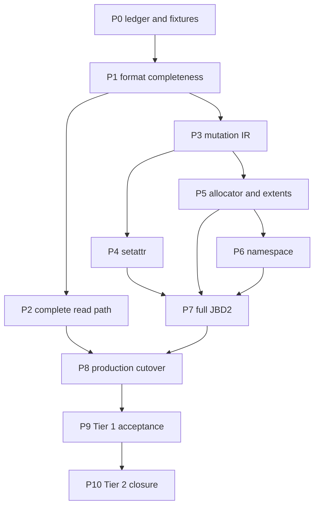

# Tx-native ext4 Linux Compatibility Implementation Plan

> **For agentic workers:** REQUIRED SUB-SKILL: Use
> `superpowers:subagent-driven-development` or `superpowers:executing-plans`
> to implement this plan phase by phase. Use `tx-vfs-filesystem` for every
> implementation phase and `tx-xtask` for every `cargo xtask` command.

**Goal:** Deliver the controlled Tier 1 ext4 profile, then converge on the
declared Tier 2 mainstream Linux surface without introducing an ext4 daemon or
importing another implementation's runtime architecture.

**Architecture:** Linux ext4 behavior, the on-disk documentation, e2fsprogs and
xfstests are the compatibility authorities; rsext4 is an algorithm reference
only. Pure on-disk codecs and planners live in `tx-ext4-format`; Tx-facing namespace,
PageBacked, I/O-manager, mount, and JBD2 state machines live in `tx-ext4`. Every
persistent mutation is expressed as a validated immutable after-image plan and
is admitted through the mount-local journal runtime before VFS-visible state is
published.

**Primary contracts:** `TX_EXT4_PLAN_v1_2`, `IO_MANAGER_v1`, `PAGE_BACKED_v1`,
`MOUNT_v1`, `VFS_CHECKS_V2.1`, Txv3 `STEP_MODEL_v2` and `INVARIANTS_v5`.

---

## 1. End State

The production RW mount has one path:

```text
VFS / PageBacked operation
  -> tx-ext4 operation-specific StepOp
  -> tx-ext4-format pure parse / validate / plan
  -> Ext4MutationPlan(data writes, metadata after-images, preconditions)
  -> JournalMutationRuntime admission
  -> ordered data graph -> JBD2 commit -> checkpoint
  -> terminal result -> VFS/PageContainer publication and wake
```

The Tier 1 backend supports the pinned 4-KiB profile, extents, 64-bit block
numbers, metadata checksums, linear and htree directories, regular files, fast and
block-backed symlinks, hard links, inode/block allocation and reclamation,
sparse files within the declared inline/depth-1 shape, truncate, setattr,
bounded-shape namespace mutations,
ordered-mode JBD2 replay/checkpoint/fsync, classic-orphan recovery, clean
unmount, and Linux/e2fsprogs
interoperability. Tier 2 then removes the extent/htree shape bounds and adds
`orphan_file`, common xattr/ACL/fallocate/direct-I/O/coherency surfaces and a
versioned xfstests gate.

## 2. Non-Goals

Do not add a userspace daemon, a private in-kernel ext4 service transport, or
migrate rsext4's path resolver, file-descriptor/open-offset API, sync
`BlockDevice`, bitmap/inode/data caches, `mkfs`, or global mutable filesystem
object. Tx VFS, PageContainer, I/O manager, block service, and Mount own those
roles.

The combined Tier 1+2 plan excludes ext2/ext3 block maps, non-4-KiB block
sizes, journal=data and writeback journaling modes, online resize, bigalloc,
inline-data, DAX, quota, encryption, verity, fscrypt and casefold. Xattr, POSIX
ACL, fallocate, special device inodes, direct-I/O coherency and remount behavior
are Tier 2 slices, not prerequisites for Tier 1 production cutover.

## 3. Canonical Gate

| Proposed surface | Owner | Authority | Gate |
|---|---|---|---|
| Pure ext4 codecs and checksums | `tx-ext4-format` | `TX_EXT4_PLAN` section 2.1 | no kernel imports |
| `Ext4FeatureSet` and profile decision | `tx-ext4-format` value plus `tx-ext4` mount policy | `TX_EXT4_PLAN` sections 1.6-1.9 | one tested mask table; no duplicated mount bit checks |
| Tier 1 fixture/profile manifest | `tools/ext4/profiles/tier1.json` | `TX_EXT4_PLAN` sections 1.7 and 6.5 | exact mke2fs/tool versions, masks, bounds and hashes |
| Tier 2 xfstests manifest | `tools/ext4/profiles/tier2-xfstests.json` | `TX_EXT4_PLAN` sections 1.8 and 6.5 | every selection and exclusion has an authority row |
| Extent/directory/allocation planners | `tx-ext4-format` | `TX_EXT4_PLAN` sections 1 and 3 | produce values/after-images, no I/O |
| `Ext4MutationPlan` read-set and origins | `tx-ext4-format` | `IO_MANAGER` metadata continuation plus current mutation IR | design update before new public variants |
| Namespace and setattr StepOps | `tx-ext4` | `FsOps`, VFS checks, Txv3 step model | preserve VFS ownership of RNode/DEntry |
| File-page mapping and writeback plans | `tx-ext4` | `FsPageBacking`, PageBacked, I/O manager | no second page cache |
| JBD2 admission, commit, checkpoint, replay | `tx-ext4` plus format codecs | `TX_EXT4_PLAN` ordered mode | mount-local state, reactor-driven I/O |
| Mount cutover and clean unmount | Mount/kernel integration | `MOUNT_v1` | one production RW entry point |

`TX_EXT4_PLAN_v1_2` now defines immutable mutation admission, Linux authority,
feature admission and Tier 1/Tier 2 gates. New public planner types must cite
that canonical surface, keep direct home writes unreachable from production and
pass docs lint before implementation lands.

## 4. Reference Source Mapping

| rsext4 source | Tx target | Treatment |
|---|---|---|
| `superblock.rs`, `blockgroup_description.rs`, `disknode.rs`, `entries.rs` | `tx-ext4-format/src/ondisk/` | port codecs and validation with preserve-unknown round trips |
| `checksum.rs`, `crc32c/` | `tx-ext4-format/src/checksum.rs` | port format formulas; retain portable Tx CRC implementation |
| `extents_tree.rs`, `loopfile.rs` | `tx-ext4-format/src/extent/` | rewrite as read-request/continuation and after-image planners |
| `bitmap.rs`, `bmalloc.rs`, allocation portions of `ext4.rs` | `tx-ext4-format/src/allocator/` | rewrite claim/free selection as transaction plans |
| `dir.rs`, `hashtree.rs`, directory entries | `tx-ext4-format/src/directory/` | port hash/codec algorithms; rewrite mutation as atomic plans |
| `file.rs` | `tx-ext4::namespace`, `tx-ext4::pager`, mutation planners | port semantics only; do not port path or open-file APIs |
| `jbd2/jbdstruct.rs` | `tx-ext4-format/src/journal.rs` | port codecs/checksum/replay rules |
| `jbd2/jbd2.rs` | `tx-ext4/src/journal/` | rewrite as Tx journal ring, graph submission and StepOps |
| `api.rs`, `blockdev.rs`, `*_cache.rs`, `mkfs` | none | explicitly rejected |

Every imported algorithm gets a source comment naming its pinned source and an
e2fsprogs or Linux differential test. rsext4 parity alone never closes a task.
Copying an entire rsext4 module in one commit is prohibited.

## 5. Fixture and Oracle Matrix

Create deterministic images under a generated test-fixture workflow, not as
opaque hand-edited binaries. Tier 1 fixtures cover the exact accepted feature
masks, clean/dirty journals, linear and non-splitting htree directories,
inline/depth-1 extents, sparse files, symlinks, hard links and bounded full-group
cases. Tier 2 fixtures add 10,000-entry htrees, depth-2+ extents, fragmentation,
unwritten/greater-than-4-GiB files, orphan recovery, xattr/ACL/fallocate and
direct/buffered overlap.

For every mutating fixture, retain four witnesses: pre-operation `dumpe2fs` or
`debugfs` facts, Tx operation result, post-operation `debugfs` facts, and
`e2fsck -fn` clean output. Crash tests additionally retain the injected cut
point, committed generation, replay result, and fsync contract result.

## 6. Phases

### Phase 0: Capability Ledger and Reproducible Fixtures

**Files:** update `docs/progress/research/2026-07-23-rsext4-capability-ledger.md`;
create `tools/ext4/profiles/tier1.json`,
`tools/ext4/profiles/tier2-xfstests.json` and deterministic fixture tooling
under `tools/ext4/`; add host tests under `crates/tx-ext4-format/tests/`.

- [ ] Record every rsext4 candidate function with source, Tx owner, supported
  features, error mapping, oracle, and production-admission status.
- [ ] Generate the fixture matrix with `mke2fs`, `debugfs`, and deterministic
  mutation scripts; record tool versions and SHA-256 values.
- [ ] Encode the exact Tier 1 feature masks and shape bounds in
  `tools/ext4/profiles/tier1.json`; reject a generated fixture whose
  `dumpe2fs -h` facts differ.
- [ ] Add a host oracle harness that copies a fixture before mutation and runs
  `e2fsck -fn` after it. Never mutate the canonical fixture in place.
- [ ] Verify with `cargo test -p tx-ext4-format` and fixture regeneration diff.

**Exit:** no feature is described only as "supported by rsext4"; it has a
source, Tx destination, oracle, and explicit disposition.

### Phase 1: Format Completeness and Feature Admission

**Files:** update `tx-ext4-format/src/ondisk.rs` and the mount admission path;
split into focused codec modules only when the first change requires it; extend
checksum and journal codec tests.

- [ ] Add preserve-unknown round trips for the full supported superblock, group
  descriptor, inode, dirent/tail, extent node and JBD2 structures.
- [ ] Implement RW/RO feature admission. Unknown incompat bits reject mount;
  unsupported ro-compat bits permit only the explicitly safe RO path.
- [ ] Complete superblock, GDT, bitmap, inode, directory-tail, extent-block and
  JBD2 checksum validation/update.
- [ ] Preserve inode generation, extra timestamps and ACL block pointers even
  before ACL semantics are enabled.
- [ ] Differential-test codecs against rsext4 inputs and e2fsprogs output.

**Exit:** supported structures round-trip byte-for-byte and corrupt checksums
fail before publication or mutation.

### Phase 2: Tier 1 Read-Only Mapping

**Files:** create `tx-ext4-format/src/extent/` and
`tx-ext4-format/src/directory/`; update `tx-ext4/src/read_backend.rs` and
`planner.rs`.

- [ ] Convert `BlockMapping::NeedNode` into a repeatable metadata continuation
  supporting the Tier 1 inline/depth-1 extent forms.
- [ ] Support holes, sparse files and the fragmented shapes admitted by the
  pinned Tier 1 fixture.
- [ ] Implement linear and htree lookup/readdir, including collision chains and
  directory-tail validation.
- [ ] Support fast and block-backed symlinks.
- [ ] Make the sync pager a host-test oracle only; production read misses use
  `BackendPlanner` and the I/O manager.

**Exit:** host and QEMU read the complete Tier 1 fixture matrix; an image that
requires deeper extents or unsafe feature handling is rejected before mount
publication. Arbitrary-depth/large-directory read closure belongs to Phase 10.

### Phase 3: Unified Mutation IR and Journal Admission

**Files:** update active design first; then extend
`tx-ext4-format/src/mutation.rs`, `tx-ext4/src/journal.rs`, and planner tests.

- [ ] Add typed origins for SetAttr, Allocate, Free, Link, Unlink, Mkdir, Rmdir,
  Symlink, Rename and Truncate.
- [ ] Add explicit read-set/preconditions for every home block and inode
  generation; merge multiple updates to one home block before admission.
- [ ] Represent ordered data writes, journaled metadata after-images, revokes,
  commit and checkpoint as distinct plan components.
- [ ] Reserve journal space and allocation claims before any disk or published
  state change; rollback admission failure without leaks.
- [ ] Add a lint/test preventing production format mutation functions from
  calling `BlockImage::write_block`.

**Exit:** every future mutation can be expressed without direct home-block I/O;
conflicting preconditions deterministically return a retry/error before commit.

### Phase 4: Setattr Vertical Slice

**Files:** `tx-ext4-format` inode after-image builder;
`tx-ext4/src/namespace.rs`; VFS/backend and shim tests.

- [ ] Implement chmod, then chown, utimens, size-only setattr, and the supported
  immutable/append flag subset.
- [ ] Preserve file type bits and Linux setuid/setgid clearing rules.
- [ ] Do not mutate the authoritative RNode metadata until journal admission
  establishes the operation's publication point.
- [ ] Replace `write_inode_meta_journaled` with the unified mutation runtime.
- [ ] Add crash cuts before commit, after commit, and before checkpoint.

**Exit:** `chmod +x /musl/.../libc.so`, remount and exec succeed; pre-commit
failure exposes the old mode and committed/pre-checkpoint failure replays the
new mode.

### Phase 5: Tier 1 Allocator, Extent Mutation and File Growth

**Files:** create `tx-ext4-format/src/allocator/`; extend extent mutation
planner, `tx-ext4/src/pager.rs`, `planner.rs`, and tests.

- [ ] Plan cross-group inode/block claims, contiguous runs, free counters,
  checksums and rollback-safe reservations.
- [ ] Implement extent insert/merge, inline-root spill and the declared
  depth-1 form. Reject a second child/deeper root before admission.
- [ ] Implement write-to-hole, uninitialized conversion, size/blocks update and
  ordered data-before-metadata commit.
- [ ] Implement truncate shrink with tail zeroing, extent split, revoke and
  block free; truncate grow remains sparse.
- [ ] Add ENOSPC and concurrent allocator property tests.

**Exit:** the profile-bound fragmented write/truncate/refill sequence remains
clean under `e2fsck -fn`; planner writeback has no Hole/MetadataFirst `ENOSYS`
path for Tier 1 shapes.

### Phase 6: Tier 1 Atomic Namespace Mutation

**Files:** directory mutation planners and `tx-ext4/src/namespace.rs`; VFS and
guest tests.

- [ ] Land create, mkdir, hard link, symlink, unlink and rmdir as one transaction
  each.
- [ ] Land same-directory, cross-directory and overwrite rename as a single
  transaction, including stable inode-key lock ordering.
- [ ] Update parent/target link counts, dot/dotdot, dtime and checksums in the
  same transaction. Tier 1 htree insertion must not require a split.
- [ ] Enforce directory emptiness, type compatibility and ancestor-cycle rules.
- [ ] Preserve unlinked-but-open payload lifetime; journal the classic orphan
  chain and free the inode only from the final `destroy_inode` transition.

**Exit:** randomized namespace sequences match a Linux-mounted reference model
after every operation and finish with clean fsck. No rename intermediate state
is observable or durable.

### Phase 7: Complete Ordered-Mode JBD2

**Files:** journal codecs/replay in `tx-ext4-format`; runtime/ring/graph in
`tx-ext4`.

- [ ] Support multi-block descriptors, csum-v2/v3 tags and commit checksums.
- [ ] Support revoke records, wrap, multiple committed-but-uncheckpointed
  transactions, checkpoint progress and journal-space backpressure.
- [ ] Implement journal superblock active/clean transitions, checksum-validated
  replay and revoke-safe free/reuse recovery.
- [ ] Implement stateful fsync/fdatasync generation frontiers and clean unmount.
- [ ] Define and test abort/remount-RO behavior after metadata or device I/O
  failure.

**Exit:** 1,000 deterministic random power cuts all remount and pass fsck; data
whose fsync returned success is never lost.

### Phase 8: Production Cutover and Legacy Retirement

**Files:** `tx-ext4/src/mount.rs`, backend/pager/planner/journal; kernel mount
wiring; lints.

- [ ] Route read miss, mapped write, hole write, setattr, namespace, truncate,
  fsync and checkpoint through their stateful planner/runtime paths.
- [ ] Keep `mount_ext4_read_write_with_discovered_journal` as the sole production
  RW entry point.
- [ ] Remove or make test-only `legacy_writeback_enabled`, direct inode/block
  allocation/writes and the fixed three-block metadata journal helper.
- [ ] Add static boundary tests: no production Tokio; no VFS live-node imports
  in tx-ext4; no kernel imports in tx-ext4-format; no direct format writes.

**Exit:** production boot, dynamic mount and all RW operations use one durability
path; the compatibility pager cannot be selected by production code.

### Phase 9: Tier 1 Linux Interoperability and Guest Acceptance

- [ ] Run BusyBox and Alpine shell mutation suites on ext4.
- [ ] Run musl loader copy/chmod/exec, TCC compile/link/run and SQLite WAL.
- [ ] Mount every Tx-mutated image on Linux and every Linux-mutated supported
  image on Tx.
- [ ] Run LTP filesystem, chmod/chown/utimens, rename/link/unlink and fsync cases.
- [ ] Measure SMP concurrent writer behavior and journal backpressure.

**Exit:** the Tier 1 functional and integration goals in `TX_EXT4_PLAN_v1_2`
are met, including compiler output on ext4, recovery, feature rejection and
fsck cleanliness.

### Phase 10: Tier 2 Mainstream Linux Closure

- [ ] Remove extent depth/child limits; add arbitrary legal tree split/merge,
  unwritten extents, large files and cross-group allocation.
- [ ] Add complete htree collision, split, delete and rebalance behavior.
- [ ] Add `orphan_file` admission/recovery and extend unlink-open/truncate crash
  coverage beyond the Tier 1 classic-orphan shapes.
- [ ] Add common xattr and POSIX ACL support after the VFS/credential authority
  design update.
- [ ] Add common fallocate modes, special device inodes, statfs, syncfs, msync,
  direct-I/O coherency and the selected FIEMAP/ioctl surface.
- [ ] Add read-only degradation, abort/remount-RO and clean remount/unmount
  behavior.
- [ ] Maintain a versioned xfstests manifest; fuzz codecs/planners and run long
  SMP mutation/corruption campaigns.

**Exit:** every Tier 2 row has a capability-ledger entry, design authority,
Linux/e2fsprogs oracle and crash witness; the xfstests manifest has no
unexplained fail, timeout or not-run result; Tier 1 remains green.

## 7. Dependency and Parallelism



Phases 2 and 3 may proceed in parallel after Phase 1. Within Phase 5, allocator
selection, extent pure algorithms and journal graph tests can be separate
workers, but only one worker owns shared mutation traits. Within Phase 6,
operations may be separate workers only after the directory transaction builder
is stable. One coordinator exclusively owns shared traits, `STATUS.md`, the JSON
plan and production mount cutover.

## 8. Commit and Verification Discipline

Each vertical slice uses five commits where applicable: failing oracle test;
pure codec/algorithm; immutable plan builder; Tx runtime/VFS integration; guest
or crash witness plus progress catch-up. Never combine unrelated operations or
claim a phase from compile-only evidence.

Minimum per-slice gates:

```sh
cargo test -p tx-ext4-format
cargo test -p tx-ext4 --lib --no-default-features
cargo check -p tx-ext4 --lib --no-default-features
cargo -q xtask unit
cargo xtask lint docs
cargo xtask progress validate
git diff --check
```

Mutation slices additionally require e2fsprogs interoperability and the named
crash cuts. Production cutover requires a fresh RV64 QEMU witness and must not
reuse a prior image or serial log as proof.

## 9. Immediate Execution Order

The first implementation wave is deliberately narrow but establishes the final
architecture: (1) capability ledger and fixtures; (2) design update for the
mutation contract; (3) SetAttr origin plus inode-table after-image builder; (4)
ext4 `chmod_inode` through `JournalMutationRuntime`; (5) stateful fsync terminal
result; (6) `/musl/libc.so` chmod, remount and exec witness. Only after this wave
passes should allocator, extent and namespace ports begin.
