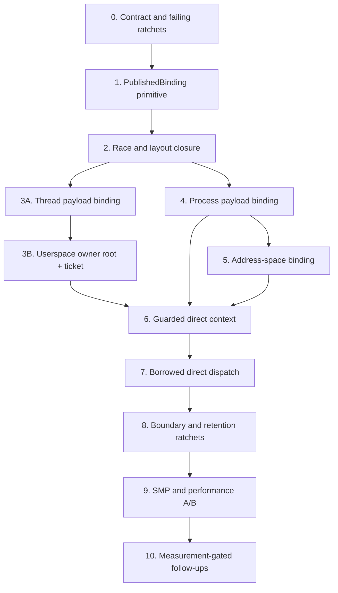

# Identity RCU Slot Migration Implementation Plan

> **For agentic workers:** REQUIRED SUB-SKILL: Use
> `superpowers:subagent-driven-development` (recommended) or
> `superpowers:executing-plans` to implement this plan task by task. Each code
> task also uses `superpowers:test-driven-development`, and completion uses
> `superpowers:verification-before-completion`. Do not stage or commit in the
> shared dirty checkout unless the user explicitly authorizes it.

**Goal:** Publish one current userspace `ThreadIdentity` per hart, reach thread
and process payloads through identity-owned `PublishedBinding<T, E>` fields,
and remove intermediate retained-handle construction from synchronous direct
trap syscall dispatch without moving timer IRQ handling into EBR.

**Architecture:** Keep the existing Zone slot lifecycle, fixed-depth registry,
four-state `SlotMeta`, intrusive EBR bags, `Cap`/`PayloadCap`, `Weak`, and
`IdentRef`. Add one owner-private `AtomicPtr<Slot<T>>` publication cell beside
writer-owned evidence. One caller-owned Guard covers the synchronous walk;
only paths that yield, store, fan out, or continue retain evidence.

**Canonical contract:**
[`2026-07-25-identity-rcu-slot-design.md`](../specs/2026-07-25-identity-rcu-slot-design.md)

**Tech stack:** Rust `no_std`, Zone/EBR, Acquire/AcqRel atomics,
`SpinMutex` writer serialization, host race tests, RV64 four-hart QEMU witness,
`tx-observe`, and a pinned guest rustc workload.

---

## 1. Scope And Completion Boundary

### In scope

- Add `PublishedBinding<T, Cap<T>>` and
  `PublishedBinding<T, PayloadCap<T>>` to `tx-substrate`.
- Migrate `ThreadIdentity.payload` to payload publication.
- Migrate only the current-userspace `ThreadIdentity` table to publication and
  make it the sole synchronous identity entry root.
- Keep the current-userspace payload table as the strong timer-IRQ anchor.
- Keep the poll-scoped current tables unchanged in the first migration.
- Keep `ThreadIdentity.owner_proc` as `Weak<ProcessIdentity>` and observe it
  under the caller's Guard.
- Migrate `ProcessIdentity.payload` to payload publication.
- Migrate `ProcessPayload.frame.vm` to address-space publication.
- Add guard-scoped process/thread/aspace observation facades.
- Introduce borrowed direct-trap context and remove intermediate Caps from the
  direct synchronous dispatcher.
- Preserve the owned `SyscallCtx` for normal and yielding dispatch.
- Add static ratchets, host races, a real four-hart grace witness, and
  same-configuration performance measurements.

### Out of scope

- Pointer-backed `Cap<T>`.
- A new public RCU handle, Zone policy, or object lifecycle.
- Changing `ThreadIdentity.owner_proc` to a strong edge.
- Moving immutable tree roots from `Published<T>` to `PublishedBinding`.
- Migrating general process relations, namespace roots, fd tables, queues,
  completion state, futex wait queues, signal pending state, or RangeLock.
- Rewriting the normal async syscall context merely to increase migration
  coverage.
- Removing or RCU-converting poll-scoped current-task anchors.
- Creating an epoch Guard in timer, external, or IPI IRQ context.
- Replacing the timer-IRQ payload anchor before an IRQ-safe owner protocol has
  its own design and witness.
- Claiming rustc wall-time improvement before a guest rustc workload exists.

### Completion definition

The migration is complete only when the marked direct resolver has:

```text
one Guard
zero binding-reader locks
zero intermediate Cap/PayloadCap clones
zero intermediate retain CAS operations
one Weak directory observation for owner_proc
zero directory resolutions for published bindings
zero allocation
```

Pure synchronous direct arms perform zero terminal retains. An owned retain is
allowed only after the code has selected a path that crosses a storage,
fanout, continuation, step, or yield boundary.

## 2. Current State And Target Map

| Current code | Current behavior | Target |
|---|---|---|
| `tx-substrate/src/slot.rs::AtomicSlot<T>` | `SpinMutex<Option<T>>` | leave for non-migrated fields; do not silently rename it RCU |
| `ThreadIdentity.payload` | lock-backed `Option<PayloadCap<ThreadPayload>>` | `PublishedBinding<ThreadPayload, PayloadCap<_>>` |
| `CURRENT_USERSPACE_THREAD_IDENTITY` | 64 lock-backed `Option<Cap<ThreadIdentity>>` cells | rename to `CURRENT_USERSPACE_OWNER`: 64 owner-root `PublishedBinding<ThreadIdentity, Cap<_>>` cells |
| `CURRENT_USERSPACE_PAYLOAD` | lock-backed strong payload anchor | retain for timer IRQ; direct synchronous readers stop using it |
| `CURRENT_THREAD_IDENTITY/PAYLOAD` | poll-scoped lock-backed compatibility anchors | unchanged in the first migration |
| `ThreadIdentity.owner_proc` | `Weak<ProcessIdentity>` + owned upgrade | keep field; add guarded observe facade |
| `ProcessIdentity.payload` | process metrics spinlock + `Option<PayloadCap>` | `PublishedBinding<ProcessPayload, PayloadCap<_>>` |
| `ProcessPayload.frame.vm` | staging `AtomicSlot<Cap<AddressSpace>>` | `PublishedBinding<AddressSpace, Cap<_>>` |
| `trap.rs::try_direct_trap_syscall` | separately retained payload/thread plus several locks/lookups | one current owner root + one Guard + five `IdentRef`s |
| direct shim dispatcher | clones three Caps into `SyscallCtx` | borrowed direct context; no `SyscallCtx` construction |
| normal `thread_future` dispatcher | owned Caps across async work | unchanged |

The first code anchor for each area is:

| Area | Current anchor |
|---|---|
| Zone physical slot | `crates/tx-substrate/src/zone/slot.rs:19` |
| Four-state metadata | `crates/tx-substrate/src/zone/meta.rs:44` |
| Cap/PayloadCap | `crates/tx-substrate/src/zone/cap.rs:103` |
| Weak observation | `crates/tx-substrate/src/zone/cap.rs:447` |
| IdentRef retain bridge | `crates/tx-substrate/src/zone/cap.rs:531` |
| Lock-backed staging slot | `crates/tx-substrate/src/slot.rs:19` |
| Per-hart owner/anchors | `crates/tx-subsystems/src/thread_runtime/structure.rs:558` |
| Thread payload binding | `crates/tx-subsystems/src/thread_runtime/structure.rs:43` |
| Process payload binding | `crates/tx-subsystems/src/process/structure.rs:171` |
| Address-space binding | `crates/tx-subsystems/src/process/structure.rs:1068` |
| Direct resolver | `crates/tx-kernel/src/trap.rs:168` |
| Direct shim dispatcher | `crates/tx-shims/src/linux_syscall/mod.rs:702` |
| Owned async context | `crates/tx-shims/src/linux_syscall/ctx.rs:59` |

### Audited Lock Baseline And Counting Rule

The 2026-07-25 production callsite audit is the acceptance baseline for this
plan. It used CodeGraph to establish the call paths, then `rg -l` discovery and
multiline `rg -U -n` checks for direct `.payload.lock()` and
`.payload_slot().lock()` expressions. Tests, `*tests.rs`, pure `#[cfg(test)]`
modules, and the four credential test-support helpers are excluded. The
deduplication key is `symbol + file:first_line`; two matching expressions on
one source line are one location but remain two expressions where that
distinction matters.

| Surface | Production baseline | Reader target | Writer/physical-lock consequence |
|---|---:|---:|---|
| current-userspace owner | 1 direct reader; set, clear, and exit scan writers | `1 -> 0` reader lock acquisitions | only one 64-cell table migrates; all four 64-cell tables still contain 256 physical writer mutexes because each `PublishedBinding` retains one |
| `ThreadIdentity.payload` | 8 reader points + 1 zombie-detach writer | `8 -> 0` | one writer mutex per identity remains `1 -> 1`; mailbox wake, current-slot clear, exit status, and root-to-null ordering remain writer semantics |
| `ProcessIdentity.payload` | 47 reader points + 41 writer/lifecycle/topology points = 88 | `47 -> 0` | one writer mutex per identity remains `1 -> 1`; every one of the 41 writer points must name its coordination owner |
| `ProcessIdentity::payload_slot()` | 9 external production callsites: 1 reader + 8 writer/lifecycle | public lock exposure `9 -> 0` | callers move to domain facades; the internal binding writer mutex is not exposed |
| `ProcessPayload.frame.vm` | 20 reader locations / 21 reader expressions; 1 installed construction; 2 production swaps | `21 -> 0` reader lock acquisitions | one VM binding writer mutex remains `1 -> 1`; the two exec swaps retain their lifecycle/PONR coordination |
| `ProcessIdentity::aspace_cap()` composed path | process payload reader lock + VM reader lock = 2 | `2 -> 0` | Task 4 alone produces `2 -> 1`; Task 5 closes the second reader lock |

These are reader-acquisition budgets, not claims that mutex fields disappear.
Any fresh inventory that differs from the baseline blocks mechanical migration
until the new or missing sites are classified and this table is updated.

### Phase Lock Budget And Blockers

| Task | Callsite class | Old reader mechanism | Replacement | Reader acquisition target | Retained writer coordination | Phase blocker |
|---:|---|---|---|---:|---|---|
| 0 | contract and detector inventory | all baselined binding locks | exact static count gates | baseline frozen; no code target yet | existing locks unchanged | detectors must reproduce `1`, `8+1`, `47+41=88`, and `20/21+1+2` before implementation |
| 1 | generic single-binding publication | `SpinMutex<Option<E>>` read | Acquire root + Live metadata validation under caller Guard | zero reader mutex acquisition in `observe`/`retain` | private `SpinMutex<Option<E>>` serializes install/replace/withdraw | root/evidence order, 24-byte layout, legal Cap/PayloadCap evidence, and no-allocation retirement must close |
| 2 | substrate races and lifetime | lock guard protected lifetime | Guard-scoped `IdentRef`; explicit retain CAS only at owned boundary | zero reader mutex acquisition | concurrent writers still serialize; Zone final-drop/EBR remains authoritative | retry, ABA, final-drop, nested/escaping Guard, and concurrent-writer tests must pass |
| 3 | current owner and thread payload | 1 owner reader + 8 payload readers | `CURRENT_USERSPACE_OWNER.observe` and `payload_ref` | owner `1 -> 0`; payload `8 -> 0` | set/clear/exit scan, 1 payload detach writer, request lock, exit lifecycle, and binding writer locks remain | request ticket revision/hart/key checks, Release/Acquire active-hart commit, conditional clears, IRQ-owned anchor, and zombie ordering must close |
| 4 | process payload | 47 readers | `payload_ref` or explicit `payload_cap` at owned boundaries | `47 -> 0` | all 41 writer/lifecycle/topology points retain or gain a named reservation/lock/revalidation owner | any unclassified callsite, unnamed writer owner, or exposed `payload_slot()` blocks the phase |
| 5 | address space binding | 21 reader lock expressions | `aspace_ref` or explicit `aspace_cap` | VM `21 -> 0`; composed facade `2 -> 0` | 2 exec swaps keep exec lifecycle, PONR, pmap activation, and shootdown coordination | phase-6 swap must remain infallible and old-aspace Guard lifetime must be proven |
| 6 | direct identity walk | per-hop binding locks/upgrades | one Guard + five `IdentRef`s | zero binding reader locks and zero intermediate retains | no change to semantic writers | Tasks 3-5, active-hart revalidation, Weak generation check, and IRQ exclusion must all be closed |
| 7 | direct syscall dispatch | three owned Caps in `SyscallCtx` | borrowed domain references | zero context-construction locks/retains in eligible direct arms | normal/yielding `SyscallCtx` stays owned | any arm that stores, yields, fans out, or continues remains out of the borrowed lane |
| 8 | retention/static closure | old lock accessors and accidental guarded escapes | ratchets plus explicit terminal retain helpers | production old-reader patterns and exposed lock APIs = 0 | allowlisted IRQ/poll locks and all semantic writer coordination remain | static/lifetime gates and full host closure must pass without raising unrelated ceilings |
| 9 | SMP/performance witness | measured lock-backed baseline | same-config variants 2 and 3 | direct resolver binding-reader locks = 0 | physical writer mutex count reported separately and is expected not to fall | four-hart grace witness, counter attribution, and reproducible workload availability |

## 3. Dependency Order



Task 3A must land before 3B because the owner resolver derives `ThreadPayload`
through `ThreadIdentity`. Task 3B, Task 4, and Task 5 may use separate
branches/worktrees after their prerequisites close, but Task 6 requires the
thread payload, owner root, process payload, and address-space observations.

## 4. Staged Landing Contract

This section is the merge and rollback contract. The detailed tasks below own
the code-level steps; these phases define which intermediate repository states
are valid. A phase may be reviewed and merged only after its exit gate passes.
The next phase must not compensate for a failure in the previous one.

### 4.1 Rules Shared By Every Phase

1. Each binding has exactly one authoritative storage location. A temporary
   compatibility facade may offer guarded and owned reads over that location,
   but dual lock-slot/RCU-slot publication is forbidden.
2. Reader-lock counts and physical mutex counts are separate measurements. A
   `PublishedBinding` retains one private writer mutex, so a phase succeeds by
   removing reader acquisitions, not by renaming or deleting a lock field.
3. `PublishedBinding::writer` serializes only evidence replacement and root
   publication. It is not the lifecycle, topology, exec, fd, signal, VM, or
   page-cache mutation lock.
4. A Guard and every `IdentRef` derived from it end before `.await`, storage,
   continuation construction, cross-hart transfer, or IRQ return. The terminal
   object is retained only after such a boundary is selected.
5. A phase that changes object layout records entity size, physical Zone slot
   size, alignment, and slots per slab before and after. A density regression
   is reviewed explicitly and is not hidden behind another allocation.
6. A fresh callsite inventory runs before storage changes. Count drift is a
   classification failure, not permission to adjust a ceiling mechanically.
7. Rollback restores the facade backend for the current phase. It never weakens
   Zone metadata, final-Drop, epoch, generation, or Guard safety.
8. Commits are recommended at the phase boundaries below. In the shared dirty
   checkout, staging and committing still require explicit user authorization.

### 4.2 Phase Overview And Lock Budget

| Phase | Deliverable | Dynamic reader-lock budget after phase | Writer/physical locks retained | Hard exit gate |
|---:|---|---|---|---|
| P0 | freeze source and measurement baseline | owner `1`, thread payload `8`, process payload `47`, VM `21` | all current locks | exact detectors reproduce `1`, `8+1`, `47+41=88`, external `payload_slot=9`, and VM `20 locations/21 expressions + 1 construction + 2 swaps` |
| P1 | active contracts and failing production ratchets | unchanged | unchanged | detector unit tests pass; production gate reports the frozen non-zero baseline |
| P2 | unused `PublishedBinding` primitive | unchanged | one private writer mutex per new binding instance | layout, API closure, reader/writer algorithms, and focused substrate tests pass |
| P3 | primitive race/lifetime closure | unchanged | unchanged from P2 | overlap, final Drop, generation reuse, ABA, concurrent writer, and Guard escape gates pass |
| P4 | `ThreadIdentity.payload` publication only | thread payload `8 -> 0` | one payload-binding writer mutex and thread-exit lifecycle coordination | 8 readers migrated; the single zombie detach retains exact exit ordering |
| P5 | `CURRENT_USERSPACE_OWNER` plus owner ticket | owner `1 -> 0`; exit sweep `256 -> 129 ordinary locks + 1 owner binding claim` | all four 64-cell tables still have `256 -> 256` physical writer mutexes; IRQ payload anchor and request lock remain | stale-ticket, hart migration, timer-preempt, conditional-clear, and IRQ separation tests pass |
| P6 | `ProcessIdentity.payload` publication | process payload `47 -> 0`; composed aspace facade `2 -> 1` | one binding writer mutex plus all 41 named lifecycle/topology/exec owners | 88 sites classified, public `payload_slot()` exposure `9 -> 0`, no unnamed writer owner |
| P7 | `ProcessPayload.frame.vm` publication | VM `21 -> 0`; composed aspace facade `1 -> 0` | one VM binding writer mutex; both exec phase-6 swaps and pmap/shootdown coordination remain | old/new visibility races pass; no fallible action follows the phase-6 LP |
| P8 | one-Guard `DirectTrapContext` | identity resolver `5 -> 0` | semantic writers unchanged | one Guard, five `IdentRef`s, zero binding lock, zero intermediate retain/clone |
| P9 | borrowed direct syscall dispatch | `getpid/gettid/clock* 8 -> 0`; uid/gid queries `8 -> 1`; `rt_sigprocmask` identity `6 -> 0` | cred staging lock remains for uid/gid; futex/signal/user-memory state locks remain | per-arm differential tests pass; unsupported or escaping branches fall back before borrow escape |
| P10 | boundary closure and old-path removal | unsupported direct prepass + fallback hot `9 -> 4`, poll miss `10 -> 5` | normal page-fault and timer handoff remain hot `4`, poll miss `5` | old lock APIs/patterns are zero outside explicit IRQ/poll allowlists; full host gate passes |
| P11 | four-hart witness and three-variant A/B | measured, not inferred | physical writer locks reported separately | SMP no-early-reclaim proof, complete counters, direct microbenchmarks, and pinned guest rustc results or an explicit macro-workload blocker |
| P12 | measurement-gated follow-up decision | no preset target | no preset removal | a new design/plan is approved for each selected follow-up; P0-P11 remain independently complete |

P4 and P5 are deliberately separate even though the code-level checklist below
groups them under Task 3. P4 changes split-entity payload lifetime. P5 changes
per-hart machine-entry ownership and IRQ/fallback cleanup. They have different
rollback risks and must produce separate reviewable diffs or commits.

### 4.3 Writer Ownership Matrix

| Transition | Publication operation | Synchronization owner that must remain | Forbidden simplification |
|---|---|---|---|
| install/replace/withdraw one binding | private binding writer + AcqRel root swap | `PublishedBinding::writer` | exposing the writer lock or using it for domain mutation |
| thread payload zombification | root-to-null withdraw | thread-exit lifecycle ordering, exit status, mailbox wake, current-slot cleanup | treating an old guarded/retained payload as revoked |
| userspace entry/finish | owner-root replace/conditional clear | `ActiveUserspaceOwner.request`, request revision, recorded hart, thread key, payload key | clearing by the future's resumed hart or root key alone |
| timer IRQ handoff | none on identity binding | strong `CURRENT_USERSPACE_PAYLOAD` anchor, request cell, saved context, run-slot FSM | opening a Guard in IRQ context |
| process payload install/detach | binding install/withdraw | process lifecycle, exec and topology reservation/revalidation | using the binding writer as the general process lock |
| fork coherent snapshot | guarded observation plus explicit owned inputs | fork/lifecycle snapshot reservation | classifying fork as one of the 47 ordinary readers |
| clone-thread attach / exit detach | binding retain/observe as needed | process thread-roster/lifecycle coordination | relying on payload memory safety for topology atomicity |
| exec address-space commit | VM binding replace | exec lifecycle and PONR; pmap activation and shootdown ordering | adding fallible work after root publication |
| fd/cwd/cred/ns/signal mutation | no new P0 publication authority except named binding reads | existing per-domain lock/reservation | serializing these mutations with `ProcessIdentity.payload` binding writer |
| RangeLock/PTE/PageSlot/I/O/futex | none | existing reservation, ownership, completion, queue, and hardware protocols | describing read-side RCU as their mutation protocol |

### 4.4 Detailed Phase Gates

#### P0: Freeze Baseline And Artifacts

**Input:** the current lock-backed identity path.

**Actions:** run the source detectors before any storage edit; capture the exact
callsite manifest, entity/layout sizes, direct-path counters, QEMU/image
configuration, and whether the pinned guest rustc fixture is actually runnable.
The manifest records `file:first_line`, symbol, semantic class, owned-boundary
reason, replacement facade, and writer owner.

**Exit:** the manifest totals equal the audited baseline and has zero unknown
rows. The macro benchmark may be recorded as unavailable, but that blocks only
the macro claim, not the substrate or identity correctness work.

**Rollback:** documentation/detector-only; remove the new detector without any
runtime state migration.

#### P1: Land Contracts And Ratchets

**Input:** P0 artifacts.

**Actions:** add active `txdoc:` contracts for single-binding publication,
payload-through-identity traversal, synchronous-exception/IRQ separation, and
owned-boundary retention. Add syntax fixtures that prove the detectors reject
public RCU-policy vocabulary, raw publication leakage, nested Guard entry, old
reader locks, and direct `SyscallCtx::new`.

**Exit:** detector unit tests pass and the production scan fails for the exact
expected old-path findings. A detector that reports zero before implementation
is itself a failure.

**Rollback:** revert contracts and detectors together; do not leave an active
contract without an executable gate.

#### P2: Land The Unused Primitive

**Input:** P1 gates. No subsystem field uses `PublishedBinding`.

**Actions:** implement only the two sealed evidence families, root-first layout,
Acquire reader loop, AcqRel writer LPs, exact-key clear, compatibility retain,
and exclusive Drop. No upper subsystem migration belongs in this phase.

**Exit:** focused substrate tests pass; the 64-bit binding is 24 bytes with root
at offset zero; empty/install/replace/withdraw/retain behavior matches the spec;
no new public `Rcu*`, raw `Slot`, evidence trait, writer guard, allocation, or
per-binding retire header exists.

**Rollback:** remove the unused module/export/tests. No data migration exists.

#### P3: Close Primitive Concurrency Before Adoption

**Input:** P2 primitive, still unused by production owners.

**Actions:** close reader-before-writer overlap, old target under Guard, final
Cap Drop, raw key zero, generation reuse, non-Live retry/invariant, same-target
replace, concurrent writers, no-allocation, and lifetime compile-fail cases.

**Exit:** all substrate/epoch/zone races pass repeatedly and API-language gates
prove Guard/IdentRef cannot escape. P4 is forbidden before this phase closes.

**Rollback:** revert P2 and P3 as one substrate-only unit.

#### P4: Migrate `ThreadIdentity.payload`

**Input:** P3 primitive; old per-hart tables and active-request protocol remain.

**Actions:** add `payload_ref`, Guard-taking `payload_cap`, install and withdraw
facades; switch exactly 8 reader points and the one zombie-detach writer; keep
payload publication as the sole authoritative attachment. Do not rename or
migrate a per-hart table in this phase.

**Exit:** thread payload reader lock acquisition is `8 -> 0`; install-before-
runnable and exit-status/wake/slot-clear/root-withdraw ordering pass; an old
Guard may finish but a fresh reader observes zombie; no raw binding or writer
lock escapes the thread-runtime owner.

**Rollback:** restore only the `ThreadIdentity.payload` facade backend to the
old lock slot. Per-hart code is unchanged, so the rollback does not touch IRQ or
machine-entry ownership.

#### P5: Migrate The Per-Hart Userspace Owner

**Input:** P4 thread payload binding.

**Actions:** replace only `CURRENT_USERSPACE_THREAD_IDENTITY` with
`CURRENT_USERSPACE_OWNER`; introduce atomic `entry_hart`, request writer cell,
and the four-field cleanup ticket; move synchronous owner lookup to guarded
observation. Retain `CURRENT_USERSPACE_PAYLOAD` and both poll-scoped tables.

**Exit:** owner reader lock is `1 -> 0`; set/finish/migration/exit paths pass
request-revision, recorded-hart, thread-key, and payload-key races; timer IRQ
never opens a Guard; same-hart timer re-entry closes the previous ticket first.
The report states both `256 -> 256` physical per-hart writer mutexes and the
dynamic exit-sweep reduction.

**Rollback:** restore the owner facade to the old identity table and old active
request cell while leaving P4 intact. Remove ticket/atomic state only after all
set, clear, exit, preempt, and migration callers use the restored protocol.

#### P6: Migrate `ProcessIdentity.payload`

**Input:** P3 primitive. P4/P5 may already be merged, but P6 does not depend on
their per-hart protocol.

**Actions:** migrate 47 pure/owned reader sites through guarded or terminal-
retain facades. For all 41 remaining sites, record the lifecycle, exec, topology,
mutation lock, or revalidation owner before editing. Remove the nine external
`payload_slot()` lock consumers behind domain operations.

**Exit:** reader acquisition `47 -> 0`, public lock exposure `9 -> 0`, unknown
writer classifications `0`, and the writer ownership matrix is complete. Fork,
clone attach, exit detach, and exec validation race tests pass.

**Rollback:** restore the process payload facade backend without changing the
domain synchronization owners established by the audit. Never roll back by
exposing the new binding writer lock.

#### P7: Migrate `Frame.vm`

**Input:** P6 process payload publication.

**Actions:** construct one non-empty address-space binding, migrate 21 reader
expressions, and route exactly two production exec swaps through
`replace_aspace`. Keep exec phase 6 as the visibility LP.

**Exit:** VM reader acquisition `21 -> 0`, composed process/aspace facade
`2 -> 0`, reader-before/after/during-swap tests pass, and no allocation or
fallible action follows publication. pmap/PTE/shootdown behavior is unchanged.

**Rollback:** switch only the `ProcessPayload` address-space facade back to
`AtomicSlot`; preserve the same phase-6 wrapper and exec ordering so rollback
does not create a second commit protocol.

#### P8: Build The One-Guard Resolver

**Input:** P4, P5, P6, and P7.

**Actions:** introduce the kernel-private `DirectTrapContext<'g>` and walk owner,
thread payload, weak process owner, process payload, and address space under one
caller Guard. Validate `entry_hart` after thread payload observation.

**Exit:** marked resolver has exactly one Guard, five `IdentRef`s, zero binding
reader locks, zero `Weak::upgrade`, zero `to_cap`, zero Cap/PayloadCap clone,
zero allocation, and unchanged fallback results for inactive/zombie/exit/exec
races.

**Rollback:** keep the P4-P7 storage migrations and switch the trap facade back
to explicit terminal retains. No binding storage rollback is required.

#### P9: Borrow Direct Syscall Inputs

**Input:** P8 resolver plus the existing owned `SyscallCtx`.

**Actions:** add a shim-domain reference view and convert only proven
synchronous arms. `getpid/gettid/clock*`, uid/gid queries, `rt_sigprocmask`, and
the eligible futex/set-tid subsets use the narrowest borrowed inputs. Any branch
that parks, stores, yields, fans out, or continues returns to the owned path
before a borrowed context escapes.

**Exit:** per-arm result/errno/writeback/observability differential tests pass;
eligible direct arms construct no `SyscallCtx`; uid/gid retains only the cred
slot lock; futex and signal state-machine locks are reported as retained.

**Rollback:** route individual syscall arms back to the owned dispatcher. P8 and
all binding storage remain valid and independently useful.

#### P10: Remove Compatibility Readers And Close Host Gates

**Input:** P9 direct lane.

**Actions:** delete test-only differential readers after equivalence closes;
ratchet old table names, lock accessors, direct payload anchors, request locks,
payload lock fields, and VM `AtomicSlot` use to zero outside explicit IRQ/poll
allowlists. Audit every retained owned context at its actual boundary.

**Exit:** all scoped static counts meet the table in section 4.2 and the full
host unit/API/docs/progress gates pass. Normal page-fault handoff, timer handoff,
`SyscallCtx`, and semantic state-machine locks remain intentionally unchanged.

**Rollback:** restore only a facade or direct arm from the immediately previous
phase. Do not restore deleted raw-lock accessors as public compatibility APIs.

#### P11: Prove SMP Safety And Measure

**Input:** P10 host closure.

**Actions:** run the real four-hart guarded-overlap witness; collect the three
variants defined in Task 9; run direct microbenchmarks; run the pinned offline
guest rustc clean and incremental matrix when the guest fixture is available.
Correctness and attribution runs may enable probes; final wall-time runs use the
same probe-off configuration for every variant.

**Exit:** no early reclaim, exact one-time destruction, maintenance ack, bounded
drain, zero direct binding-reader locks, zero intermediate retains, complete
trace accounting, raw samples, and confidence intervals. A repeatable rustc
regression above 2 percent blocks completion pending attribution. An unavailable
guest rustc fixture is recorded as a macro-measurement blocker, not silently
replaced by host rustc.

**Rollback:** if correctness fails, revert the owning storage phase. If only a
borrowed arm regresses, revert that P9 arm. If macro performance is neutral,
keep the correctness-complete migration and report the gain as not measurable.

#### P12: Open Only Measured Follow-Ups

**Input:** P11 attribution.

**Actions:** choose among per-hart process publication, IRQ-safe owner
convergence, fused Weak upgrade, typed resolver fast path, pointer-backed Cap,
or the separate P1 fd/cwd/dentry/PageContainer work. Each choice receives its
own spec, layout accounting, invariant proof, plan, and A/B.

**Exit:** this identity plan remains closed without requiring any optional
follow-up. No P12 idea is allowed to expand the P0-P11 completion definition.

## Task 0: Freeze The Contract And Write Failing Ratchets

**Files:**

- Modify: `docs/design/00_meta-framework/OBJECT_API_LANES_v1.md`
- Modify: `docs/design/01_substrate/EBR_ZONE_INTERFACE_v1.md`
- Modify: `docs/design/02_execution/THREAD_RUNTIME_v1.md`
- Modify: `docs/design/04_process-signals/PROCESS_v1.md`
- Reference: `docs/superpowers/specs/2026-07-25-identity-rcu-slot-design.md`
- Modify: `xtask/src/lint_invariants_zone.rs`
- Modify: `xtask/src/lint_invariants_api_language.rs`
- Test: the corresponding `xtask` unit modules

- [ ] **Step 0.1: Add the single-binding contract to active design docs**

Add grep-stable `txdoc:` sections that state:

- `PublishedBinding` is current-binding visibility over an existing Zone slot;
- only `Cap` and `PayloadCap` may own a non-null target;
- readers hold a caller-owned Guard before the root load;
- null/replace/withdraw linearize at the atomic root operation;
- publication is owner-private and does not provide revocation;
- no `RcuHead`, allocation, generation copy, or new retained handle exists per
  binding.
- the current userspace owner root publishes only `ThreadIdentity`;
- synchronous readers derive `ThreadPayload` through identity-owned payload
  publication;
- direct readers validate an atomic active-hart commit marker and never lock
  the userspace request cell;
- request comparison plus thread/payload key checks define ticket cleanup, and
  every timer-preempt re-entry closes the old ticket before beginning a new
  request;
- timer/external/IPI IRQ paths retain an owned payload anchor and never create
  a Guard;
- poll-scoped current-task anchors are not part of the first RCU migration.

- [ ] **Step 0.2: Add API-language rejection tests first**

Add failing tests that reject outside the substrate/owner implementation
allowlist:

```text
RcuCap<
RcuZone<
RcuSlot<
AtomicPtr<Slot<
PublishedBinding<
IdentRef fields in SyscallCtx or async operation structs
```

`PublishedBinding` is legal in `tx-substrate` and concrete subsystem owner
structures. It is illegal in shims, checks, scripts, facade return types, and
public subsystem trait signatures.

- [ ] **Step 0.3: Add the direct-resolver retain ratchet first**

Mark one bounded function/module region and reject inside it:

```text
Weak::upgrade
IdentRef::to_cap
IdentitySlot::clone_cap
Cap::clone
PayloadCap::clone
epoch::guard more than once
borrow_current_guard
SpinMutex::lock on the current userspace identity owner
ThreadIdentity.payload.lock
SyscallCtx::new
```

The ratchet must count syntax sites and have positive/negative fixture tests;
it must not use a workspace-wide string ceiling that unrelated code can hide.

- [ ] **Step 0.4: Verify expected initial failure**

Run:

```bash
cargo test -p xtask lint_invariants_zone --lib
cargo test -p xtask lint_invariants_api_language --lib
```

Expected: new tests pass as detector unit tests, while running the new direct
resolver gate against production reports the current locks/clones/context
construction. Record the exact baseline count in the plan JSON before code
changes.

## Task 1: Implement `PublishedBinding`

**Files:**

- Create: `crates/tx-substrate/src/zone/published_binding.rs`
- Modify: `crates/tx-substrate/src/zone/mod.rs`
- Modify: `crates/tx-substrate/src/zone/cap.rs`
- Modify: `crates/tx-substrate/src/lib.rs`
- Create: `crates/tx-substrate/tests/published_binding.rs`

- [ ] **Step 1.1: Write layout and legal-evidence tests first**

Tests must establish:

```rust,ignore
assert_eq!(offset_of!(IdentityBinding, root), 0);
assert_eq!(offset_of!(IdentityBinding, writer), size_of::<usize>());

#[cfg(target_pointer_width = "64")]
{
    assert_eq!(size_of::<IdentityBinding>(), 24);
    assert_eq!(align_of::<IdentityBinding>(), 8);
}
```

Add compile-fail examples proving that Weak/arbitrary evidence has no
`installed`, `replace`, `retain`, or `observe` method family. Add positive
coverage for identity and payload policies.

- [ ] **Step 1.2: Add the exact source layout**

Implement the spec's `#[repr(C)]` root-first layout. The `PayloadCap` method
family requires:

```rust,ignore
T: ZoneAllocated,
T::Policy: IsPayloadPolicy,
```

Do not expose `Slot<T>`, the evidence lock, a lock guard, or a sealed helper
trait from the crate root.

- [ ] **Step 1.3: Add the guarded IdentRef constructor**

Add one `pub(crate)` unsafe constructor in `zone/cap.rs`:

```rust,ignore
unsafe fn from_published_slot(
    slot: NonNull<Slot<T>>,
    generation: u16,
    guard: &'g Guard<'_>,
) -> Self;
```

Its safety contract requires a Live metadata observation after Guard entry. It
reconstructs the current compact key from the containing slab and does not use
`registry::slot_for`.

- [ ] **Step 1.4: Implement the reader loop exactly**

Use the algorithm in the design spec:

```text
Acquire root
  null -> None
Acquire SlotMeta
  Live -> IdentRef
  non-Live + root changed -> retry
  non-Live + root unchanged -> invariant panic
```

Do not turn a still-published `Retiring` state into `None`, and do not add a
generation field to the binding.

- [ ] **Step 1.5: Implement writer operations exactly**

For replace/install:

```text
resolve next pointer -> lock -> evidence replace -> AcqRel root swap
-> unlock -> return/drop old evidence
```

For withdraw/conditional clear:

```text
lock -> AcqRel root-to-null swap -> evidence take -> unlock -> return/drop
```

Add debug consistency checks between pointer and evidence on every writer
operation. Root swap is the visibility LP; no step after it may fail.

- [ ] **Step 1.6: Implement retained compatibility reads**

`retain(&Guard)` is `observe + IdentRef::to_cap`; payload bindings wrap the
result with `PayloadCap::from_cap`. It must not lock writer state. Record retain
attempts only under an opt-in metrics cfg so the final hot path stays clean.

- [ ] **Step 1.7: Implement exclusive Drop**

Use `AtomicPtr::get_mut`/exclusive access where possible, clear the root, take
the evidence, and let its normal Drop drive Zone retirement. Do not enqueue an
`RcuHead` and do not call `try_drain`.

- [ ] **Step 1.8: Run focused verification**

```bash
cargo test -p tx-substrate --test published_binding
cargo test -p tx-substrate --test zone
cargo test -p tx-substrate --doc
cargo check -p tx-substrate --lib
```

Expected: all pass; crate-root exports include `PublishedBinding` but no
`Slot`, evidence trait, writer guard, or new RCU handle.

## Task 2: Close Layout, Ordering, And Race Proofs

**Files:**

- Modify: `crates/tx-substrate/tests/published_binding.rs`
- Modify: `crates/tx-substrate/tests/zone.rs`
- Modify: `crates/tx-substrate/tests/epoch.rs`
- Modify if needed: `crates/tx-substrate/src/zone/published_binding.rs`

- [ ] **Step 2.1: Cover empty/install/replace/withdraw state**

Assert root/evidence agreement through:

```text
empty -> install A -> replace B -> replace B -> withdraw -> empty
```

Returning old evidence must preserve exact retain counts. Same-target replace
must neither leak nor underflow.

- [ ] **Step 2.2: Cover reader-before-final-drop**

Use barriers:

1. Reader enters a real Guard and loads A.
2. Writer replaces A with B and drops the last evidence for A.
3. Early bounded drain reclaims zero A objects.
4. Reader verifies A's immutable identity fields and drops Guard.
5. Advance/drain eventually destroys A exactly once.

- [ ] **Step 2.3: Cover old target retained elsewhere**

Hold an independent Cap to A. After replacement, a reader that linearized
before the swap may return A and A remains `Live`; a fresh reader returns B.
Dropping the binding's old evidence must not force semantic death.

- [ ] **Step 2.4: Cover non-Live retry and invariant failure**

Use test-only barriers/hooks around root and metadata loads:

- old pointer becomes Retiring and root changes: reader retries to B/null;
- root remains equal while metadata is Retiring: test catches the invariant
  panic;
- no test writes impossible production metadata without a clearly named
  test-only hook.

- [ ] **Step 2.5: Cover ABA and raw key zero**

- publish the object whose `SlotKey::raw() == 0` and clear it by key;
- retire/reclaim/reuse a slot across generations and prove an earlier Guard
  cannot observe reused bytes;
- confirm the binding uses null pointer, never raw-key zero, for emptiness.

- [ ] **Step 2.6: Cover concurrent writers**

Run multiple replace/withdraw/clear-if-key writers. Check one total writer
order, exact old-evidence return, no lost Cap, no double Drop, and a final root
matching final writer evidence. Readers may see any value consistent with one
root-swap linearization point.

- [ ] **Step 2.7: Cover allocation freedom**

With the test allocator forced to reject allocations after object creation,
perform repeated observe, replace, withdraw, and clear-if-key. All operations
must complete. Do not infer this solely from source inspection.

- [ ] **Step 2.8: Cover lifetime escape at compile time**

Compile-fail cases must reject:

- returning `IdentRef<'g, T>` after Guard Drop;
- storing it in a `'static` future/continuation;
- sending Guard/IdentRef to another thread;
- embedding guarded direct context in `SyscallCtx`;
- opening a second owned Guard during a marked resolver.

- [ ] **Step 2.9: Run the substrate closure gate**

```bash
cargo test -p tx-substrate --test published_binding -- --test-threads=1
cargo test -p tx-substrate --test zone
cargo test -p tx-substrate --test epoch
cargo test -p tx-substrate --doc
cargo xtask lint invariants api-language
```

Task 3 may not start until these pass.

## Task 3: Migrate Thread Payload And The Userspace Owner Root

Implementation executes this checklist as two separately reviewable slices:
Steps 3.1-3.3 are Phase P4 / Task 3A, and Steps 3.4-3.9 are Phase P5 / Task
3B. Do not combine their commits merely because they share thread-runtime
files.

**Files:**

- Modify: `crates/tx-subsystems/src/thread_runtime/adapter.rs`
- Modify: `crates/tx-subsystems/src/thread_runtime/structure.rs`
- Modify: `crates/tx-subsystems/src/thread_runtime/execution.rs`
- Modify: `crates/tx-subsystems/src/thread_runtime/tests.rs`
- Modify: `crates/tx-kernel/src/thread_future.rs`
- Modify: `crates/tx-kernel/src/trap_handoff.rs`
- Modify: `crates/tx-kernel/src/thread_future/tests.rs`
- Modify: `crates/tx-kernel/src/init/tests.rs`
- Modify: `boards/tx-hal-riscv64-qemu-virt/src/trap.rs`
- Modify: `boards/tx-hal-loongarch64-qemu-virt/src/la64_irq_trap.rs`

- [ ] **Step 3.1: Classify every `ThreadIdentity.payload` lock use**

Start from the audited production baseline of exactly **8 reader implementation
points + 1 writer point**. Record each as synchronous observation, owned
cross-boundary retain, initial install, thread zombification, or semantic
writer coordination. A callsite that relies on exclusion must keep or gain a
named lifecycle reservation; publication is not revocation. If the fresh
inventory is not `8+1`, stop and classify the delta before editing storage.
The replacement keeps one physical writer mutex per `ThreadIdentity`; its
success criterion is reader lock acquisition `8 -> 0`, not mutex count
`1 -> 0`.

- [ ] **Step 3.2: Add the thread payload facade first**

```rust,ignore
impl ThreadIdentity {
    pub fn payload_ref<'g>(
        &'g self,
        guard: &'g Guard<'_>,
    ) -> Option<IdentRef<'g, ThreadPayload>>;

    pub fn payload_cap(&self, guard: &Guard<'_>)
        -> Option<PayloadCap<ThreadPayload>>;

    pub(crate) fn install_payload(
        &self,
        payload: PayloadCap<ThreadPayload>,
    ) -> Option<PayloadCap<ThreadPayload>>;

    pub(crate) fn withdraw_payload(&self)
        -> Option<PayloadCap<ThreadPayload>>;
}
```

`Entity::upgrade_operational` and its extension facade gain a caller-Guard
form. No accessor may return `PublishedBinding` or its writer lock.

- [ ] **Step 3.3: Change thread payload install and zombification**

Construct a pending `ThreadIdentity` with an empty binding, install the signed
payload before the thread becomes runnable, and make the root-to-null swap the
thread-zombie visibility point. Preserve exit-status ordering and any separate
thread-exit coordination that the old critical section provided.

- [ ] **Step 3.4: Add the one guarded per-hart owner accessor**

```rust,ignore
pub fn observe_current_userspace_owner<'g>(
    hart: usize,
    guard: &'g Guard<'_>,
) -> Option<IdentRef<'g, ThreadIdentity>>;
```

Replace `CURRENT_USERSPACE_THREAD_IDENTITY` with `CURRENT_USERSPACE_OWNER`,
whose cells are `PublishedBinding<ThreadIdentity, Cap<ThreadIdentity>>`.
Direct synchronous readers use the new accessor. The old table name must not
remain as an alias or second root. The current-userspace payload table remains
the strong timer-IRQ anchor, and both poll-scoped tables remain unchanged.
The audited direct owner reader is the one production site in
`crates/tx-kernel/src/trap.rs:199`; its reader lock budget is `1 -> 0`. Set at
`thread_future.rs:739`, clear at `thread_future.rs:518`, and the exit-time
64-cell exact-key scan through `clear_thread_slots_for` remain writer paths.

- [ ] **Step 3.5: Introduce a userspace owner ticket**

Replace `ThreadPayload.active_request` with the following domain-equivalent
owner state and carry its cleanup ticket across the userspace wait:

```rust,ignore
#[repr(C)]
struct ActiveUserspaceOwner {
    entry_hart: AtomicUsize, // usize::MAX means inactive
    request: SpinMutex<Option<UserspaceRunRequest>>,
}

#[derive(Clone, Copy, Debug, Eq, PartialEq)]
struct UserspaceOwnerTicket {
    entry_hart: usize,
    request: UserspaceRunRequest,
    thread_key: SlotKey,
    payload_key: SlotKey,
}
```

The direct resolver reads only `entry_hart` with Acquire ordering. It never
locks `request`. Timer/fallback handoff retains the IRQ payload anchor, then
uses the request lock to obtain the exact request for the same hart.
Task 3 is blocked until the ticket distinguishes request revision, entry hart,
thread key, and payload key; the root and active-hart Release/Acquire order is
tested; and stale cleanup uses key-conditional clear. Crossing a storage,
yield, or handoff boundary still requires the existing `IdentRef::to_cap`
retain CAS; the synchronous direct reader must perform no such CAS.

Before entering userspace:

```text
lock active_owner.request
require request == None and entry_hart == inactive
request = Some(ticket.request)
install strong IRQ payload anchor by payload key
entry_hart.store(ticket.entry_hart, Release)
publish CURRENT_USERSPACE_OWNER by thread key <- synchronous-reader commit LP
unlock active_owner.request
enter userspace
```

Normal cleanup uses the ticket's entry hart, not the future's later current
hart. While holding `active_owner.request`, it first rejects a mismatched
request or entry hart without mutating anything, clears the owner by thread
key, stores the inactive hart marker, clears the IRQ anchor by payload key, and
finally clears the request. `clear_if_key` itself is not revision aware: the
request lock serializes successive requests on one payload, while the two key
checks protect a different thread taking over the same hart.

Direct synchronous resolution requires only the observed atomic `entry_hart`
to match the trapping hart. Timer/fallback handoff requires both that hart and
the request under the request lock. Add private
`begin_userspace_owner(...) -> UserspaceOwnerTicket` and
`finish_userspace_owner(..., ticket) -> bool` functions so callers cannot
open-code part of this protocol.

- [ ] **Step 3.6: Preserve timer preemption and hart migration**

Timer preemption keeps the ticket and both anchors installed until the owner
future consumes the preemption. Before every re-entry, including on the same
hart, conditionally finish the old ticket and then begin a new ticket for the
new request. `begin` accepts only inactive owner state. Add assertions that a
hart never advertises two active owner revisions and that remote teardown is
withdraw-only.

- [ ] **Step 3.7: Separate synchronous exceptions from IRQ readers**

Add platform/host tests proving syscall and user page-fault exceptions may
create the one Guard, while timer/external/IPI IRQ scopes may not. Timer
handoff continues to obtain owned `PayloadCap<ThreadPayload>` from the strong
anchor and never calls `PublishedBinding::observe`.

- [ ] **Step 3.8: Add lifecycle and owner-root race tests**

Cover:

- thread payload install, guarded read, retain, and withdraw;
- guarded old payload remains readable until Guard Drop;
- trap owner read before, during, and after publication;
- owner observation followed by payload withdraw returns no operational view;
- remote clear racing a same-hart replacement cannot clear the replacement;
- a stale ticket for request N cannot clear request N+1 of the same thread;
- timer preempt preserves the IRQ anchor without entering EBR;
- same-hart preempt re-entry finishes the old ticket before beginning the new;
- resume on a different hart clears the recorded old hart;
- exit cannot republish payload or a userspace owner after zombification.

- [ ] **Step 3.9: Record layout and run thread/runtime closure**

Record the one 64-entry owner table plus `ThreadIdentity` and `ThreadPayload`
entity/Zone slot/slab density before and after. On current 64-bit targets,
ratchet `ActiveUserspaceOwner` to 32 bytes, 8-byte alignment, and offsets 0/8
for `entry_hart`/`request`. Then run:

```bash
cargo test -p tx-subsystems --lib thread_runtime::
cargo test -p tx-kernel --lib thread_future
cargo test -p tx-kernel --lib trap_handoff
cargo test -p tx-hal-riscv64-qemu-virt --lib trap
cargo test -p tx-hal-loongarch64-qemu-virt --lib trap
cargo check -p tx-kernel --lib
```

Expected: the synchronous owner reader and thread-payload reader acquire no
binding lock; timer IRQ behavior, functional counters, and fallback trap
handoff remain equivalent. The four logical 64-entry tables still contain 256
physical writer mutexes (`256 -> 256`), because the migrated 64
`PublishedBinding` cells each retain their internal writer mutex. Report that
number separately from the owner reader acquisition target `1 -> 0`.

## Task 4: Migrate `ProcessIdentity.payload`

**Files:**

- Modify: `crates/tx-subsystems/src/process/adapter.rs`
- Modify: `crates/tx-subsystems/src/process/structure.rs`
- Modify: `crates/tx-subsystems/src/process/execution.rs`
- Modify: `crates/tx-subsystems/src/process/exec_prep.rs`
- Modify: `crates/tx-subsystems/src/process/tests.rs`
- Modify: `crates/tx-subsystems/src/thread_runtime/execution.rs`
- Modify: `crates/tx-subsystems/src/thread_runtime/tests.rs`
- Modify: `crates/tx-scripts/src/process/exec/script.rs`
- Modify: `crates/tx-shims/src/linux_syscall/proc.rs`

- [ ] **Step 4.1: Inventory and classify every payload-lock callsite**

Before edits, generate a checked table for every direct `payload.lock()` and
`payload_slot().lock()` site:

| Class | Replacement |
|---|---|
| synchronous observation | `payload_ref(&Guard)` |
| owned across step/yield/storage | `payload_cap(&Guard)` using retain CAS |
| initial install | `install_payload` / `replace` |
| zombification | `withdraw_payload` |
| semantic transition relying on lock exclusion | retain or add a process lifecycle writer reservation; never assume RCU revokes old evidence |

The implementation record must contain a fresh exact count of direct process
payload lock sites after Task 3 has removed thread-payload sites from this
scope. The required production baseline is exactly **88 = 47 readers + 41
writer/lifecycle/topology points**, with zero unknown sites. The 47 readers are
40 in `process/structure.rs`, 2 in process execution, 4 in other subsystems,
and 1 external `payload_slot()` reader. The 41 writer points are 19 structure
mutations, 11 execution/exec-prep points, 3 other-subsystem points, and 8
external `payload_slot()` writer/lifecycle points. No site may be mechanically
changed until its semantic class is recorded; a fresh total other than 88 is a
hard stop until the delta is explained.

- [ ] **Step 4.2: Add the facade before changing storage**

Target facade:

```rust,ignore
impl ProcessIdentity {
    pub fn payload_ref<'g>(
        &'g self,
        guard: &'g Guard<'_>,
    ) -> Option<IdentRef<'g, ProcessPayload>>;

    pub fn payload_cap(&self, guard: &Guard<'_>)
        -> Option<PayloadCap<ProcessPayload>>;

    pub(crate) fn install_payload(
        &self,
        payload: PayloadCap<ProcessPayload>,
    ) -> Option<PayloadCap<ProcessPayload>>;

    pub(crate) fn withdraw_payload(&self)
        -> Option<PayloadCap<ProcessPayload>>;
}
```

Remove `payload_slot() -> &SpinMutex<_>` after the final caller migrates. No
replacement accessor may expose `PublishedBinding` or its writer lock. The
external production baseline for this API is 9 callsites (1 reader + 8
writer/lifecycle); the target public lock exposure is zero.

- [ ] **Step 4.3: Change construction and install**

`sign_process_identity` creates an empty binding. Bootstrap and fork install
the signed payload through `install_payload`. Preserve the existing rule that
an already-populated install is an invariant error.

- [ ] **Step 4.4: Change zombification and operational upgrade**

The zombification LP becomes `withdraw_payload`'s root-to-null swap. Fresh
guarded operations fail after that point; already-retained payload operations
remain memory-safe and must still honor existing exit/revision checks.

`Entity for ProcessIdentity::upgrade_operational` uses one caller Guard and
binding retain. It must not inspect writer state directly.

- [ ] **Step 4.5: Migrate pure readers to guarded references**

Methods such as zombie checks, scalar identity views, and direct credential or
pending-state reads should borrow `ProcessPayload` under a caller Guard. Methods
returning an owned value copy it before Guard Drop. Methods returning Caps or
containers retain/clone only that returned evidence, not ProcessPayload merely
to reach it. All 47 audited reader points must leave the payload reader-lock
budget at `47 -> 0`; owned results may still perform their explicit terminal
clone or retain after the reader class has selected the return value.

- [ ] **Step 4.6: Migrate owned/cross-boundary readers deliberately**

Exec preparation, long-running StepOps, thread exit, and any future/queue
storage retain `PayloadCap` explicitly. Add a comment at each retain explaining
the boundary. Do not let a Guard enter an async struct.

- [ ] **Step 4.7: Preserve semantic writer coordination**

For every old critical section that held the payload lock across more than a
snapshot, prove one of:

- payload retention alone was the actual requirement;
- a pre-existing lifecycle/exec/topology reservation already serializes it;
- the operation revalidates exit/revision after observation;
- a separate owner writer lock/reservation must remain.

Do not use `PublishedBinding`'s evidence lock as a general process mutation
lock and do not execute domain callbacks while holding it. The implementation
record must cover all 41 audited writer/lifecycle/topology points and name the
synchronization owner for each. In particular, fork coherent snapshot
(`process/execution.rs:480`), clone-thread attach (`:853`), process-exit detach
(`:1059`, `:1141`), and exec binding validation
(`process/exec_prep.rs:77`, `:109`, `:228`, `:316`) cannot be reclassified as
plain RCU publication. The physical binding writer mutex remains `1 -> 1` per
identity.

- [ ] **Step 4.8: Add process lifecycle races**

Cover:

- install then observe/retain;
- zombification versus guarded payload read;
- guarded old payload remains readable until Guard Drop;
- `retain` fails after final semantic death wins;
- an independently retained old payload remains valid but is no longer current;
- double zombification is idempotent;
- fork/bootstrap never expose an identity with an unintended empty live
  payload after their public commit boundary.

- [ ] **Step 4.9: Add layout and slab-density records**

Assert and record before/after:

```text
size_of::<ProcessIdentity>()
size_of::<Slot<ProcessIdentity>>()
ProcessIdentity slots per Zone slab
```

Any density decrease is an explicit review item. It is not grounds for adding
a second allocation to the binding.

- [ ] **Step 4.10: Run process closure**

```bash
cargo test -p tx-subsystems --lib process::
cargo test -p tx-subsystems --lib thread_runtime::
cargo test -p tx-scripts process::exec --lib
cargo test -p tx-shims --lib linux_syscall::proc
cargo check -p tx-subsystems -p tx-scripts -p tx-shims --lib
```

## Task 5: Migrate `ProcessPayload.frame.vm`

**Files:**

- Modify: `crates/tx-subsystems/src/process/structure.rs`
- Modify: `crates/tx-subsystems/src/process/execution.rs`
- Modify: `crates/tx-subsystems/src/process/exec_prep.rs`
- Modify: `crates/tx-subsystems/src/process/tests.rs`
- Modify: `crates/tx-kernel/src/thread_future.rs`
- Modify: `crates/tx-kernel/src/thread_future/tests.rs`
- Modify: `crates/tx-scripts/src/process/exec/script.rs`

- [ ] **Step 5.1: Add guarded and owned address-space facades**

Start from exactly **20 unique reader locations / 21 reader expressions**, one
installed construction, and two production swaps. A fresh inventory mismatch
blocks migration until classified. `ProcessIdentity::aspace_cap()` currently
takes two reader locks (process payload, then VM binding); Task 4 reduces this
to one and Task 5 must reduce it to zero.

```rust,ignore
impl ProcessPayload {
    pub fn aspace_ref<'g>(
        &'g self,
        guard: &'g Guard<'_>,
    ) -> IdentRef<'g, AddressSpace>;

    pub fn aspace_cap(&self, guard: &Guard<'_>) -> Cap<AddressSpace>;
    pub(crate) fn replace_aspace(&self, next: Cap<AddressSpace>)
        -> Cap<AddressSpace>;
}
```

The binding is non-empty for every live `ProcessPayload`; an empty result is an
invariant panic, not a zombie signal. Zombie is represented by withdrawal of
`ProcessIdentity.payload`.

- [ ] **Step 5.2: Construct the binding installed**

Replace `AtomicSlot::empty() + store(Some(aspace))` with
`PublishedBinding::installed(aspace)` before signing `ProcessPayload`.
The audited construction count is exactly one; no second authoritative VM
binding may be introduced during compatibility migration.

- [ ] **Step 5.3: Preserve exec phase-6 semantics**

The AcqRel root swap remains
`txdoc:EXEC-11-PHASE-6-ADDRESS-SPACE-VISIBILITY-BOUNDARY`. All reversible exec
work and allocation completes before it. The swap returns the old Cap and no
post-swap step may fail.
The audited production swap count is exactly two. Both retain their existing
exec lifecycle serialization and are the only writer paths for this binding.

Already-guarded readers may finish against the old address space. Fresh readers
load the new root. Hardware pmap activation, TLB shootdown, and exec lifecycle
coordination remain separate and keep their current ordering.

- [ ] **Step 5.4: Migrate reader classes**

- direct trap and synchronous page-fault resolution use `aspace_ref`;
- operations that may yield or store the address space use `aspace_cap`;
- no caller reads the binding writer evidence directly;
- no generic `AtomicSlot<Cap<AddressSpace>>` compatibility wrapper remains for
  this field.

All 21 reader expressions must reach zero binding-reader lock acquisitions.
The physical VM binding writer mutex remains `1 -> 1`; the performance claim is
the composed reader path `2 -> 0`, not removal of the writer field.

- [ ] **Step 5.5: Add exec visibility races**

Cover reader-before-swap, reader-after-swap, reader holding old Guard through
swap, old Cap retained elsewhere, repeated exec replacement, and exclusive
ProcessPayload Drop. Validate old/new pmap roots and no early destruction.

- [ ] **Step 5.6: Record layout impact**

Assert and record:

```text
size_of::<Frame>()
size_of::<ProcessPayload>()
size_of::<Slot<ProcessPayload>>()
ProcessPayload slots per Zone slab
```

- [ ] **Step 5.7: Run VM/process closure**

```bash
cargo test -p tx-subsystems --lib process::
cargo test -p tx-subsystems --lib vm::
cargo test -p tx-kernel --lib thread_future
cargo test -p tx-scripts process::exec --lib
```

## Task 6: Build One Guarded Direct Identity Walk

**Files:**

- Modify: `crates/tx-subsystems/src/thread_runtime/structure.rs`
- Modify: `crates/tx-subsystems/src/process/structure.rs`
- Modify: `crates/tx-kernel/src/trap.rs`
- Optional create: `crates/tx-kernel/src/direct_trap_context.rs`
- Modify: `crates/tx-kernel/src/lib.rs` or module root
- Modify: `crates/tx-kernel/src/trap_handoff.rs`
- Test: `crates/tx-kernel/src/thread_future/tests.rs`
- Test: `crates/tx-kernel/src/init/tests.rs`

- [ ] **Step 6.1: Add guarded owner-process observation**

Keep the field weak and add:

```rust,ignore
pub fn owner_proc_ref<'g>(
    &'g self,
    guard: &'g Guard<'_>,
) -> Option<IdentRef<'g, ProcessIdentity>> {
    self.owner_proc.observe(guard)
}
```

The existing owned `upgrade_owner_proc` remains for async callers but must not
be called by the direct resolver.

- [ ] **Step 6.2: Add `DirectTrapContext<'g>`**

It owns exactly five IdentRefs: thread, thread payload, process, process
payload, and address space. Its constructor receives an existing Guard and
performs no retain or allocation.

- [ ] **Step 6.3: Resolve in the required order**

```text
current userspace owner observe
thread payload observe
active-owner hart validation without taking the request lock
owner_proc Weak observe
process payload observe
address-space observe
domain precondition revalidation
```

The Guard is created in the synchronous syscall trap path. RV64 marks only
timer/external/IPI traps as IRQ context; the synchronous syscall exception is
eligible for an owned Guard. The direct resolver never reads the timer-IRQ
payload anchor. Add RV64 and LA64 platform tests that preserve this
distinction.

- [ ] **Step 6.4: Preserve fallback behavior**

Any missing binding, inactive request, failed domain precondition, unsupported
direct syscall, or lost semantic revalidation drops the context and Guard,
then follows the existing trap-handoff path. It must not partially construct an
owned `SyscallCtx` inside the trap handler.

- [ ] **Step 6.5: Add resolution-equivalence tests**

For live, zombie, exiting, inactive, signal-pending, exec-replacing, and remote
clear states, compare the old owned resolver result with the new guarded
resolver result. The old path is test-only after migration and is deleted when
the differential suite closes.

- [ ] **Step 6.6: Run direct resolver gate**

```bash
cargo test -p tx-kernel --lib direct_trap
cargo test -p tx-kernel --lib trap
cargo xtask lint invariants identity-rcu
```

Expected: one Guard, no nested Guard, no binding lock, and no intermediate
retain in the marked resolver. This means zero reader lock acquisitions across
the current-owner, thread-payload, process-payload, and VM bindings.

## Task 7: Refactor Direct Syscall Dispatch To Borrowed Domain Types

**Files:**

- Modify: `crates/tx-shims/src/linux_syscall/ctx.rs`
- Modify: `crates/tx-shims/src/linux_syscall/mod.rs`
- Modify: direct query/clock/futex/signal/user-copy helper modules under
  `crates/tx-shims/src/linux_syscall/`
- Modify: `crates/tx-kernel/src/trap.rs`
- Test: `crates/tx-shims/src/linux_syscall/tests.rs`
- Test: `crates/tx-kernel/src/thread_future/tests.rs`

- [ ] **Step 7.1: Add a borrowed shim view, not an RCU type**

The shim may define:

```rust,ignore
pub struct DirectSyscallCtx<'a> {
    pub process: &'a ProcessIdentity,
    pub process_payload: &'a ProcessPayload,
    pub thread: &'a ThreadIdentity,
    pub thread_payload: &'a ThreadPayload,
    pub aspace: &'a AddressSpace,
}
```

This is a domain-reference view. It imports neither Guard, IdentRef,
PublishedBinding, raw pointers, nor Zone slots. The kernel converts its private
`DirectTrapContext` into this view.

- [ ] **Step 7.2: Split helpers from owned `SyscallCtx`**

Refactor shared logic to accept the narrowest borrowed inputs. Existing
`SyscallCtx` methods delegate to those helpers for normal dispatch. Do not add
a trait abstraction unless at least three callsites need the same capability
surface.

- [ ] **Step 7.3: Convert the direct query and clock arms**

Convert `getpid/gettid/getuid/geteuid/getgid/getegid`, `clock_gettime`, and
`gettimeofday` so the direct path does not call `SyscallCtx::new` or clone
process/thread/aspace Caps.

- [ ] **Step 7.4: Convert direct user-copy and signal-mask arms**

`rt_sigprocmask` and synchronous user-copy helpers take borrowed ThreadPayload
and AddressSpace. The Guard remains live until user copy and result writeback
finish. No Guard crosses a fixup retry that can yield.

- [ ] **Step 7.5: Convert only proven synchronous futex/set-tid work**

For `futex` wake-hint and `set_tid_address`, identify the exact synchronous
subset. If a branch may park, enqueue a continuation, retain a waiter target,
or otherwise escape the call, return `None` and use normal dispatch. Do not
retain everything preemptively to keep an overly broad direct arm.

- [ ] **Step 7.6: Preserve observability and results**

L0 enter/exit spans, errno mapping, trap-frame result, signal preconditions,
and unsupported-route fallback remain byte-for-byte equivalent at the API
boundary. Add per-arm differential tests.

- [ ] **Step 7.7: Prove no owned context construction**

The direct route must contain zero:

```text
SyscallCtx::new
Cap::clone
PayloadCap::clone
IdentRef::to_cap
Weak::upgrade
```

- [ ] **Step 7.8: Run shim/kernel closure**

```bash
cargo test -p tx-shims --lib direct
cargo test -p tx-shims --lib rt_sigprocmask
cargo test -p tx-shims --lib futex
cargo test -p tx-kernel --lib direct_trap
cargo check -p tx-shims -p tx-kernel --lib
```

## Task 8: Close Async Boundaries And Static Retention Ratchets

**Files:**

- Modify: `crates/tx-kernel/src/thread_future.rs`
- Modify: `crates/tx-shims/src/linux_syscall/ctx.rs`
- Modify: `xtask/src/lint_invariants_zone.rs`
- Modify: `xtask/src/lint_invariants_api_language.rs`
- Modify: `crates/tx-substrate/tests/published_binding.rs`

- [ ] **Step 8.1: Keep normal `SyscallCtx` owned**

Audit normal/yielding dispatch and confirm process, thread, and aspace Caps are
retained before any `.await`, drive, mailbox storage, delegate handoff, or
continuation. Do not weaken this path for symmetry with direct dispatch.

- [ ] **Step 8.2: Mark explicit retain boundaries**

Where guarded observation transitions to owned work, use one narrow helper and
record why ownership is needed. Avoid retaining intermediate container owners
when only a terminal object is stored.

- [ ] **Step 8.3: Add compile/static prohibitions**

Reject Guard/IdentRef/DirectTrapContext in:

- futures and async function parameters;
- task/mailbox/delegate/continuation structs;
- `SyscallCtx`;
- cross-CPU messages;
- public subsystem facade results.

- [ ] **Step 8.4: Ratchet the old locks and accessors away**

Production findings must be zero for:

```text
CURRENT_USERSPACE_THREAD_IDENTITY (old table name or storage)
CURRENT_USERSPACE_OWNER.slots[...].lock()
direct synchronous reads of CURRENT_USERSPACE_PAYLOAD
direct synchronous locks of ActiveUserspaceOwner.request
ThreadIdentity.payload.lock()
ProcessIdentity.payload.lock()
ProcessIdentity::payload_slot()
AtomicSlot<Cap<AddressSpace>> in ProcessPayload::Frame
```

The timer-IRQ payload anchor and poll-scoped current tables are explicit
allowlisted retained locks in this phase. Permit other lock text in historical
docs and detector fixtures only through explicit allowlists.

- [ ] **Step 8.5: Run the full host gate**

```bash
cargo -q xtask unit
cargo xtask lint invariants identity-rcu
cargo xtask lint invariants api-language
cargo xtask lint docs
cargo xtask progress validate
```

If aggregate invariants fail on unrelated dirty-tree ratchets, report the
identity-RCU and API-language gates separately; never raise ceilings to hide
the unrelated failures.

## Task 9: Four-Hart Witness And Performance A/B

**Files:**

- Modify: `crates/tx-kernel/src/init.rs`
- Modify: `crates/tx-kernel/src/init/tests.rs`
- Modify: `xtask/src/qemu.rs`
- Modify: `xtask/src/test.rs`
- Modify if needed: `crates/tx-observe-types`, producer, and analysis schemas
- Create: dated performance research record under `docs/progress/research/`

- [ ] **Step 9.1: Add the real SMP witness**

Under `--smp 4`:

1. AP reader enters a real Guard and observes binding A.
2. BSP writer replaces or withdraws A.
3. Early drain reports zero reclaim/drop for A.
4. Maintenance IPI receives a real acknowledgement.
5. AP verifies A and drops Guard.
6. Two-epoch/bounded drain reclaims A exactly once.

Required serial markers:

```text
identity-rcu:cpus=4
identity-rcu:guarded-overlap
identity-rcu:no-early-reclaim
identity-rcu:maintenance-ack
identity-rcu:bounded-drain
identity-rcu:ok
```

- [ ] **Step 9.2: Establish three performance variants**

Build and retain results for:

1. baseline lock-backed bindings and owned direct context;
2. identity/payload `PublishedBinding` plus `CURRENT_USERSPACE_OWNER`, with
   compatibility owned retains;
3. the same owner/bindings plus guarded borrowed direct dispatch.

Variant 2 separates lock-publication benefit from retained-context benefit.
For every variant, report physical writer mutex count separately from dynamic
reader lock acquisitions. The expected physical counts do not fall merely
because a field becomes `PublishedBinding`; do not claim a speedup from field
count or type-name changes.

- [ ] **Step 9.3: Add opt-in attribution probes**

One attribution build records:

- current userspace owner, thread payload, process payload, and address-space
  binding read/retry counts;
- physical binding-writer mutex counts and dynamic reader lock-acquisition
  counts as separate metrics;
- timer-IRQ payload-anchor and poll-anchor lock counts separately;
- old lock wait/service/spin counts;
- `Weak::observe`, `Weak::upgrade`, `IdentRef::to_cap`, Cap/PayloadCap clone and
  Drop counts;
- registry `slot_for` calls by object kind;
- Guard entry count;
- direct-context resolution and per-hop time;
- direct route hit/fallback counts;
- trace completeness/loss.

Final wall-time builds compile all such probes out or disable them identically.

- [ ] **Step 9.4: Run direct-path microbenchmarks**

Use the same image, QEMU/board, hart count, frequency/timer configuration, and
warmup. Measure at least `getpid`, `gettid`, credential queries,
`clock_gettime`, `gettimeofday`, `rt_sigprocmask`, direct futex wake, and
`set_tid_address` when eligible. Record median, p95, total calls, resolver
time, lock events, retain events, and fallbacks.

- [ ] **Step 9.5: Run the pinned guest rustc workload**

The macro workload must be reproducible and offline:

- record rootfs/image digest;
- record rustc/cargo version and target triple;
- use a vendored, pinned large workspace fixture and lockfile;
- fix guest memory, hart count, QEMU acceleration, and storage image;
- run clean and single-leaf incremental builds at `-j1`, `-j4`, and `-j8`;
- perform at least one warmup and five measured repetitions per variant;
- final timing runs have tracing/probes off;
- one separate attribution run has probes on and reports lost records.

Suggested command shape inside the guest fixture:

```bash
cargo clean
/usr/bin/time -p cargo check --locked --offline -j 1
/usr/bin/time -p cargo check --locked --offline -j 4
/usr/bin/time -p cargo check --locked --offline -j 8
touch pinned-leaf/src/lib.rs
/usr/bin/time -p cargo check --locked --offline -j 1
```

Use the fixture's equivalent non-destructive clean/reset mechanism between
runs. If guest rustc is not yet bootable, mark this macro gate blocked and
report micro/counter results separately; do not substitute host rustc and call
it a kernel workload result.

- [ ] **Step 9.6: Apply decision thresholds**

Required correctness/per-path result:

- zero binding reader lock acquisition in the marked direct resolver;
- zero intermediate retain/clone in marked direct resolution;
- no regression in direct route correctness or fallback;
- no early reclaim or trace loss in correctness runs.

Performance decision:

- report confidence intervals and raw samples, not one best run;
- investigate any repeatable rustc wall-time regression above 2 percent;
- keep the migration when the hot-path counters and microbench improve with no
  statistically credible macro regression;
- describe a rustc gain below noise as "not yet measurable", not as a speedup;
- proceed to pointer-backed Cap only if residual owned-path profiles still show
  material `registry::slot_for`/retain cost after this migration.

- [ ] **Step 9.7: Run platform closure**

```bash
cargo xtask full-build --target rv64-qemu --no-image
cargo xtask test smoke --target rv64-qemu --timeout-ms 30000
cargo xtask fault-decode --target rv64-qemu --serial <saved-log> --all --brief
```

The smoke timeout may be increased only after the log shows continued progress.

## Task 10: Measurement-Gated Follow-Ups

These are separate decisions, not hidden parts of the first landing.

- [ ] **Step 10.1: Optional per-hart process publication**

If `ThreadIdentity.owner_proc Weak::observe` remains material, publish the
current process as another per-hart `PublishedBinding<ProcessIdentity,
Cap<ProcessIdentity>>`. It is a transient execution root, not a persistent
thread-to-process Cap, so it does not create the ownership cycle. Re-run
owner-ticket and teardown races.

- [ ] **Step 10.2: Optional IRQ-safe current-owner convergence**

Only if timer-IRQ payload-anchor contention is measurable, design a per-hart
IRQ-safe owner protocol that does not create or borrow an invalid Guard. Its
proof must cover same-hart interrupt exclusion, remote clear, timer-preempt
persistence, hart migration, cancellation, and final evidence Drop. Do not
silently reuse `PublishedBinding::observe` in IRQ context.

- [ ] **Step 10.3: Optional fused Weak upgrade**

If owned fallback still spends time in `Weak::upgrade`, fuse observation and
retain into one metadata CAS loop after one directory resolution. Preserve the
conceptual `Weak -> IdentRef -> Cap` evidence boundary and metrics attribution.

- [ ] **Step 10.4: Optional typed resolver fast path**

Only after disassembly/counters prove it survives optimization, remove repeated
type/Zone checks behind a trusted typed constructor boundary. Forged/stale-key
rejection remains in the closed entry path.

- [ ] **Step 10.5: Optional pointer-backed Cap A/B**

Run only if residual owned-path cost remains material. Preserve 4-byte Cap as
the baseline and account for 8-byte pointer Cap growth in dense vectors,
indices, object layouts, and slab density. This needs its own design and cannot
be folded into the identity-RCU commit.

## 5. Verification Matrix

| Layer | Required witnesses |
|---|---|
| Audited count gates | current-owner `1 reader`; thread payload `8 reader + 1 writer`; process payload `47 reader + 41 writer = 88`; external `payload_slot()` `9 -> 0`; VM `20 locations / 21 expressions + 1 construction + 2 swaps` |
| Layout | root offset zero; 24-byte 64-bit binding; 32-byte active-owner cell; entity/Slot/slab-density snapshots |
| Type closure | only Cap/PayloadCap evidence; no Weak/arbitrary methods; no public RCU handle |
| Reader | empty, success, retry, invariant panic, no allocation, no directory lookup |
| Writer | install, replace, same-target replace, withdraw, key-conditional clear, exact evidence returns |
| Lifecycle | final Drop, independent owner, raw key zero, generation reuse, no ABA in Guard |
| Concurrency | reader/writer overlap, writer serialization, replace/withdraw races, four-hart grace |
| Per-hart | owner commit order, ticket revision, recorded-hart clear, timer IRQ separation, migration |
| Thread | payload install/withdraw, zombie visibility, old guarded payload lifetime |
| Thread lock budget | owner reader `1 -> 0`; payload readers `8 -> 0`; physical writer mutexes reported as retained |
| Process | install, zombify, operation revalidation, old payload guarded/retained behavior; readers `47 -> 0`; all 41 writer sites name their coordination owner |
| Exec/VM | old/new address-space visibility and phase-6 LP; VM reader expressions `21 -> 0`; composed process/VM facade `2 -> 0`; two production swaps retained |
| Type/lifetime | Guard/IdentRef/direct context cannot escape or cross async/CPU boundaries |
| Direct dispatch | per-arm differential result, no owned context, unchanged fallback/observe spans |
| Performance | three variants, zero direct binding-reader locks, physical writer mutex count reported separately, microbench, pinned guest rustc clean/incremental, probe loss report |

## 6. Rollback And Integration Boundaries

Each implementation task must remain separately reviewable:

1. primitive and substrate tests;
2. thread payload binding;
3. current userspace owner root and owner ticket;
4. process payload binding;
5. address-space binding;
6. guarded direct context;
7. borrowed direct dispatcher;
8. static/host closure;
9. SMP/performance witness.

Before Task 7, a migrated owner may temporarily expose both guarded and owned
facades, but there must be one authoritative binding. Do not maintain a lock
slot and an RCU slot in parallel. If a subsystem phase fails, revert only that
owner to its old storage through its unchanged facade; do not weaken Zone or
epoch safety.

Recommended commit boundaries follow the list above, but staging/committing is
deferred in the current shared dirty checkout until explicitly authorized.

## 7. Final Documentation Catch-Up

After implementation and verification:

- [ ] update active `txdoc:` contracts with final API names and measured
  layout;
- [ ] update this plan and
  `docs/progress/plans/2026-07-25-identity-rcu-slot-migration.json` step status;
- [ ] add a dated performance research note with raw configuration/results;
- [ ] add the changed artifacts, verification, next step, and blockers to
  `docs/progress/STATUS.md`;
- [ ] run `cargo xtask lint docs`;
- [ ] run `cargo xtask progress validate`;
- [ ] scan active docs for stale `RcuSlot`, public `RcuCap`, and claims that
  `AtomicSlot<T>` is lock-free;
- [ ] run scoped placeholder and `git diff --check` checks;
- [ ] report unrelated dirty-tree failures separately and leave user changes
  intact.
