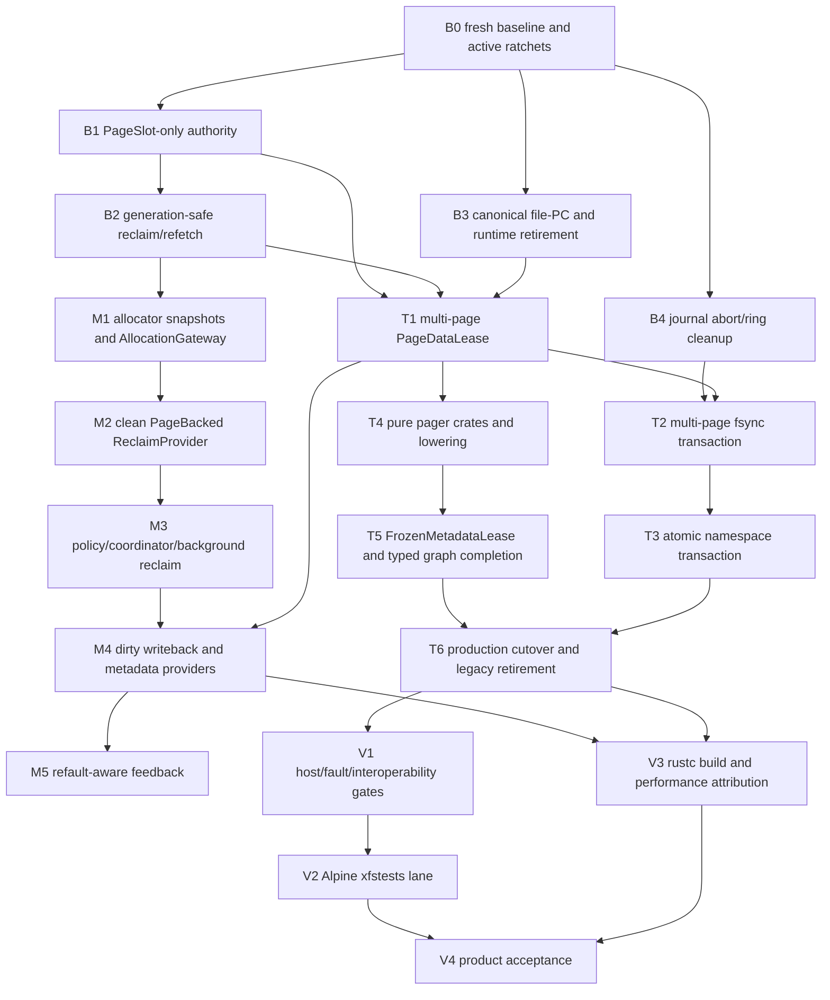

# Memory/File-I/O and ext4 Repair Roadmap

> **For agentic workers:** REQUIRED SUB-SKILL: Use
> `superpowers:subagent-driven-development` (recommended) or
> `superpowers:executing-plans` to implement this roadmap task-by-task. The
> linked subplans contain checkbox steps and test-first commit boundaries.

**Goal:** Bring the current PageBacked/ext4/I/O-manager implementation into
conformance with `MEMORY_IO_ARCHITECTURE_v1`, then prove Linux-visible ext4
correctness and bounded performance on the one-CPU, 4-GiB, no-swap rustc build
workload.

**Architecture:** Preserve one PageBacked ordinary-file cache, extract a pure
ext4 layout/transaction planner behind the existing Tx adapter, retain the
existing `BackendBioGraph` and I/O-manager runtime, and add a separate
owner-driven global memory-pressure control plane. Correctness foundations land
before structural extraction, policy, or performance work.

**Tech Stack:** Rust `no_std`, txKernel `StepOp`/`StepOutcome`, PageBacked,
`tx-ext4-format`, `tx-ext4`, `BackendBioGraph`, virtio-blk, JBD2 ordered mode,
e2fsprogs, xfstests, Alpine guest tooling, tx-observe, and `cargo xtask`.

---

## 1. Authority and scope

This roadmap implements:

- `docs/design/03_memory-vm/MEMORY_IO_ARCHITECTURE_v1.md`;
- `docs/design/03_memory-vm/PAGE_BACKED_v1.md`;
- `docs/design/05_filesystem/IO_MANAGER_v1.md`; and
- `docs/design/05_filesystem/TX_EXT4_PLAN_v1_2.md`.

It consumes, rather than replaces, foundations already built under:

- `docs/progress/plans/2026-07-13-ext4-io-manager-write-path.json`; and
- `docs/superpowers/plans/2026-07-23-rsext4-full-migration.md`.

The existing `BackendBioGraph`, L4/L6 graph execution, `IoDataSource`, direct
I/O `DmaPin`, adjacent-LBA merge, journal record encoding, and ordered
data/commit/checkpoint graph are retained. This roadmap supersedes the open
parts of those plans only where they concern file-PC ownership, reclaim
coherence, multi-page transaction admission, namespace atomicity, pure-pager
extraction, global memory pressure, or the final rustc/xfstests witness.

Out of scope:

- swap, compression, NUMA, page migration, full MGLRU, BFQ/Kyber, and general
  block-driver multi-queue redesign;
- a userspace ext4 daemon or second I/O runtime;
- a second ordinary-file page cache in ext4 or I/O manager;
- special-casing process names such as `rustc`; and
- Tier-2 ext4 features not required by the pinned compatibility profile.

## 2. Canonical Gate

| Item | Owning home | Authority | Implementation rule |
|---|---|---|---|
| Canonical file `PageContainer` identity | PageBacked/Mount adapter | `MEMORY_IO_ARCHITECTURE_v1` 2.1 | one `(mount, object)` resolves to one live PC; registry stores weak identity, not cache ownership |
| File-page semantic state | `PageSlot` | `MEMORY_IO_ARCHITECTURE_v1` 2.2 | dirty/writeback/fetch/error/generation cannot remain in replacement marks |
| Physical frame lifecycle | `PageAllocator`/`FrameMeta` | `PAGE_SUBSTRATE_v1` | upper layers use typed evidence; no policy edits allocator metadata |
| File payload lifetime | PageBacked `PageDataLease` | `MEMORY_IO_ARCHITECTURE_v1` 5.1 | retained multi-page capability; pager sees opaque keys only |
| ext4 layout and transaction plan | `tx-ext4-pager` | `MEMORY_IO_ARCHITECTURE_v1` 5.2 | pure DTOs; no PPN, `BioVec`, waiter, reactor, or submission authority |
| Tx block execution IR | existing `BackendBioGraph` | `IO_MANAGER_v1` | extend in place; do not introduce a parallel graph |
| Metadata transaction image | ext4 `FrozenMetadataLease` | `MEMORY_IO_ARCHITECTURE_v1` 5.4 | immutable generation retained through checkpoint or abort settlement |
| Reclaim choice | pure `MemoryPolicy` | `MEMORY_IO_ARCHITECTURE_v1` 5.6 | immutable snapshots in, bounded plan out; no owner capability |
| Reclaim execution | owner `ReclaimProvider` | `MEMORY_IO_ARCHITECTURE_v1` 5.5 | snapshot, revalidate/claim, step, actual-free feedback |
| Managed allocation | `AllocationGateway` above allocator | `MEMORY_IO_ARCHITECTURE_v1` 5.7 | allocator fast path first; bounded waitable slow path outside allocator locks |

Any proposed public type not covered by this table or a linked component design
requires a design-doc update before implementation.

## 3. Dependency DAG



Hard gates:

1. `B1-B4` must pass before any compatibility path is retired.
2. `T1-T3` must pass before claiming Linux-like build-output durability.
3. `M1` cannot invoke filesystem code while holding allocator state.
4. `M2` cannot land until clean reclaim/refetch is generation-correct.
5. `V3` cannot be used to tune policy until correctness and counter attribution
   gates pass.

## 4. Subplans and ownership

### Plan A: correctness foundation

File: `docs/superpowers/plans/2026-07-25-memory-io-ext4-correctness-foundation.md`

Delivers:

- fresh baseline and static ratchets;
- `PageSlot` as sole semantic authority;
- generation-safe clean withdrawal/refetch;
- canonical ext4 file-PC identity and service-runtime retirement; and
- exactly-once journal abort/ring reservation cleanup.

This plan owns the first executable slice. No other plan may edit
`page_backed/mod.rs`, `page_backed/slot.rs`, `device.rs`, or the journal
transaction state concurrently.

### Plan B: transactional ext4 data plane

File: `docs/superpowers/plans/2026-07-25-ext4-transactional-data-plane.md`

Delivers:

- multi-page `PageDataLease`;
- multi-page fsync-frontier aggregation;
- atomic namespace mutations through JBD2;
- `tx-pager-api` and reusable `tx-ext4-pager`;
- `FrozenMetadataLease`;
- typed graph completion/barrier domains; and
- callsite-by-callsite production cutover with legacy write paths made
  unreachable.

### Plan C: global memory-pressure control plane

File: `docs/superpowers/plans/2026-07-25-memory-pressure-control-plane.md`

Delivers:

- allocator pressure snapshots and allocation classes;
- `AllocationGateway`;
- bounded owner `ReclaimProvider`s;
- pure `MemoryPolicy` and coordinator episodes;
- background reclaim, dirty thresholds, clustered writeback and emergency
  credits; and
- actual-free, service-cost and refault feedback.

### Plan D: ext4 correctness and performance acceptance

File: `docs/superpowers/plans/2026-07-25-ext4-correctness-performance-acceptance.md`

Delivers:

- deterministic ext4 fault and replay fixtures;
- Alpine `bash`/e2fsprogs/xfsprogs plus a pinned xfstests manifest;
- tmpfs/raw/Linux-ext4/Tx-ext4 comparison lanes;
- an in-guest rustc build witness;
- zero-copy, writeback, reclaim and lock-attribution counters; and
- cold/warm acceptance reports against the same-run Linux baseline.

## 5. Commit and review boundaries

Every numbered task in a subplan is one reviewable commit. A commit must:

1. begin with a failing focused test or static ratchet;
2. change one authoritative owner or one cross-layer DTO boundary;
3. leave one production path authoritative;
4. run the focused tests named in that task;
5. run `git diff --check`; and
6. update the progress JSON only after the implementation commit is verified.

Suggested commit families:

```text
test(page-backed): pin reclaim and identity invariants
fix(page-backed): make PageSlot authoritative for reclaim
fix(ext4): retire canonical file I/O runtimes
fix(ext4): release journal reservation on abort
feat(page-backed): add multi-page data leases
feat(ext4): aggregate fsync frontier transactions
feat(ext4): admit atomic namespace transactions
refactor(ext4): extract pure pager plan
feat(vm): add managed allocation gateway
feat(vm): add owner-driven reclaim providers
test(ext4): add xfstests and rustc acceptance lane
```

No commit adds a coauthor. Execution should start in an isolated worktree
created through `superpowers:using-git-worktrees`; the shared dirty checkout is
not a safe implementation surface.

## 6. Aggregate exit gates

Correctness:

- duplicate materialization returns the same live file PC; runtime count returns
  to baseline after close/unmount/epoch drain;
- clean reclaim withdraws the matching `PageSlot` generation and a later access
  refetches exactly once;
- stale reclaim and stale I/O completion cannot clear or replace a newer page;
- any data/commit/checkpoint error settles leases and journal reservations
  exactly once;
- an fsync over multiple dirty pages reaches one durable transaction frontier;
- rename replay produces the complete old state or complete new state, never an
  intermediate namespace;
- Linux `e2fsck -fn` accepts every crash fixture; and
- the pinned xfstests selection has no unexplained failure.

Ownership and zero copy:

- `PageSlot` is the only ordinary file dirty/writeback authority;
- `tx-ext4-pager` has no dependency on PageBacked, PPN, `BioVec`, reactor, or
  device queues;
- aligned buffered/direct payload paths report
  `file_payload_extra_copy_bytes == 0` and `normal_path_bounce_bytes == 0`; and
- journal/checkpoint metadata copies are reported only in metadata accounting.

Pressure and progress:

- allocator locks never enclose provider, policy, I/O or wait calls;
- no epoch guard or short owner reservation crosses yield;
- clean reclaim reports actual allocator free progress separately from binding
  withdrawal;
- dirty writeback has bounded in-flight work and emergency credits;
- direct reclaim wait, writer throttle and queue saturation are separately
  observable; and
- the no-swap guest either makes bounded progress or returns the documented
  allocation failure; it does not livelock.

Performance:

- same-run Linux baseline and Tx use the same guest CPU count, RAM, source,
  toolchain, device image and host backend;
- first product gate: cold build no slower than `1.5x` Linux;
- target gate: cold build no slower than `1.2x` Linux;
- warm/incremental target: no slower than `1.15x` Linux;
- aligned payload extra-copy and normal bounce counters remain zero;
- ordinary-data write amplification is at most `1.3x`, excluding separately
  reported journal/checkpoint metadata; and
- any missed timing gate includes CPU-runnable, I/O-wait, direct-reclaim,
  writeback-throttle, pager critical-section and device-queue attribution.

## 7. Final verification ladder

Run at the end of each subplan, escalating only after the prior layer passes:

```sh
cargo test -p tx-subsystems --lib page_backed -- --test-threads=1
cargo test -p tx-ext4-format
cargo test -p tx-ext4 --lib -- --test-threads=1
cargo -q xtask unit
cargo xtask lint docs
cargo xtask progress validate
cargo xtask check
cargo xtask ci
cargo xtask test busybox-boot --target rv64-qemu --timeout-ms 60000
```

The xfstests, fault-injection and rustc commands are created and pinned by Plan
D before use; until then they are coverage gaps, not implicit existing gates.
