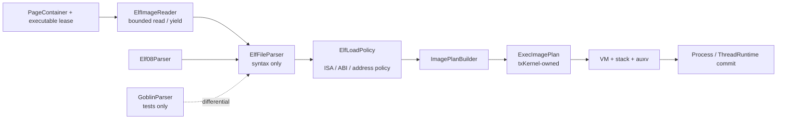

# ELF Exec Loader Design

Date: 2026-07-14  
Status: approved for implementation

## Goal

Replace the production `goblin 0.10.5` parser binding with `elf 0.8.0` and
complete the Linux exec-loader boundary for ELF64 little-endian RV64 and LA64
images. Keep byte decoding replaceable, keep filesystem I/O yield-aware, and
keep all Linux/platform policy in txKernel-owned code.

This design covers executable loading, not a kernel dynamic linker. Dynamic
tags, symbols, hashes, and relocations remain userspace interpreter work.

## Architectural Decision

The loader is split into four independent responsibilities:

1. `ElfImageReader` performs bounded `PageContainer` reads and may yield.
2. `ElfFileParser` performs pure ELF syntax decoding from byte slices.
3. `ElfLoadPolicy<P>` validates Linux and static-platform requirements.
4. `ImagePlanBuilder` creates txKernel-owned `ExecImagePlan` values.

No `elf::` or `goblin::` type crosses the parser implementation boundary.
Production uses `Elf08Parser`. A `GoblinParser` exists only in tests during the
migration and is removed with the production goblin dependency.



## Parser Interface

The replaceable syntax boundary is deliberately narrower than the complete
loader:

```rust
pub trait ElfFileParser {
    fn parse_header(bytes: &[u8]) -> Result<ElfHeader, ElfDecodeError>;

    fn parse_program_headers(
        header: &ElfHeader,
        bytes: &[u8],
    ) -> Result<Vec<ElfProgramHeader>, ElfDecodeError>;
}
```

`ElfHeader`, `ElfProgramHeader`, and `ElfDecodeError` are txKernel-owned value
types. The trait does not receive `PageContainer`, a reactor context, a load
bias, a target platform, or an errno mapper.

`Elf08Parser` uses public `elf 0.8.0` low-level APIs:

- `file::parse_ident::<LittleEndian>` and `FileHeader::parse_tail` for the
  64-byte ELF header;
- `ParsingTable::<LittleEndian, ProgramHeader>` for an independently read
  program-header table.

This avoids `ElfBytes::minimal_parse`, whose whole-slice contract would
reintroduce the incorrect requirement that `e_phoff` data already be present
beside the header.

## Bounded Read Protocol

The main executable and interpreter use the same staged protocol:

1. Read exactly 64 bytes at offset zero.
2. Decode and pre-validate class, endianness, versions, target machine,
   `e_ehsize`, `e_phentsize`, and bounded `e_phnum`.
3. Compute `e_phoff + e_phnum * e_phentsize` using checked arithmetic and
   validate it against the executable file size.
4. Read exactly the bounded program-header table at `e_phoff` (at most
   `64 * 56` bytes).
5. Decode program headers and validate all file/memory ranges.
6. If one `PT_INTERP` exists, validate `p_offset + p_filesz`, read that byte
   range separately, and require one non-empty, absolute, NUL-terminated path
   below the configured length cap.
7. Build an immutable parsed-image plan.

The interpreter is loaded through the same path in `Interpreter` mode. That
mode rejects a second `PT_INTERP` and requires an image type suitable for an
ELF interpreter.

## Platform And Linux Policy

`ElfLoadPolicy<P: PlatformConfig>` derives its facts from the selected static
platform rather than loader constants:

- ELF64 and little-endian only;
- `EM_RISCV` only for `Arch::Riscv64`, `EM_LOONGARCH` only for
  `Arch::LoongArch64`;
- platform-specific `e_flags` validation;
- `P::PAGE_SIZE`, `P::USER_TOP`, and reserved user-top exclusions;
- checked file ranges and checked final virtual ranges after load bias;
- `p_filesz <= p_memsz`;
- Linux page congruence between `p_vaddr` and `p_offset`;
- non-empty page-rounded `PT_LOAD` mappings;
- entry point contained in an executable `PT_LOAD`;
- `PT_PHDR`, when present, describes the actual loaded program-header table;
- main image, interpreter, stack, and vDSO ranges do not overlap.

Linux compatibility takes precedence over local linker assumptions. The
policy accepts valid toolchain alignments and records W+X segments rather than
rejecting them solely because an image is PIE. Unknown segment types are
ignored after their declared file ranges are checked where applicable.

The header count remains capped at 64. Extended `PN_XNUM` is explicitly
unsupported so exec loading does not require section-header parsing.

## Program Header Semantics

The image plan records the exec-relevant program-header facts:

- `PT_LOAD`: final mapping range, file range, permissions, alignment;
- `PT_PHDR`: validated auxv source;
- `PT_INTERP`: validated interpreter path request;
- `PT_DYNAMIC`: validated location, interpreted only by userspace;
- `PT_TLS`: validated `TlsTemplate`, initialized by libc startup/interpreter;
- `PT_GNU_STACK`: requested stack executability;
- `PT_GNU_RELRO`: validated range for userspace interpreter protection;
- `PT_GNU_EH_FRAME` and `PT_NOTE`: validated/ignored unless a later consumer
  earns a txKernel-owned plan field.

The kernel does not parse dynamic tags, symbols, hashes, symbol versions, or
relocations.

## Dynamic Interpreter And Auxv

For dynamic images:

- the ELF path is resolved only through the process root and mount namespace;
- hard-coded `/musl` and loader-basename fallbacks leave the core loader;
- image construction chooses non-overlapping randomized main and interpreter
  biases before VM recipes are committed;
- initial PC is the interpreter entry;
- `AT_ENTRY` is the main executable entry;
- `AT_BASE` is the interpreter load bias;
- `AT_PHDR`, `AT_PHENT`, and `AT_PHNUM` describe the main executable;
- `AT_EXECFN` continues to name the requested executable.

OSComp image compatibility belongs in rootfs layout/symlinks or a separately
named temporary compatibility adapter, not in ELF semantics.

## File Stability

Parsing a mutable file and faulting its pages later must observe one executable
generation. The completed loader therefore requires an executable lease owned
by VFS/PageBacked that:

- prevents conflicting writable opens/writes with Linux-like `ETXTBSY`;
- pins a stable file generation from header read until image lifetime no longer
  depends on mutable source bytes;
- is retained by file-backed VM recipes and released with the image mappings.

This is a cross-subsystem prerequisite for calling the loader complete; parser
replacement alone does not solve it.

## Stack Policy

`PT_GNU_STACK` is recorded immediately. Enforcing an NX stack depends on
moving the current `rt_sigreturn` trampoline from the userspace stack into the
vDSO. The implementation order is:

1. land parser/reader/policy while preserving the current documented stack
   compatibility behavior;
2. map the vDSO signal trampoline;
3. make stack protection follow `PT_GNU_STACK`, with NX as the default.

The temporary compatibility state must remain explicit in the progress plan;
the loader must not claim GNU-stack completion before the vDSO dependency is
closed.

## Error Model

Internal errors remain typed until the exec-script boundary:

- `ElfDecodeError`: malformed byte representation;
- `ElfPolicyError`: unsupported or unsafe executable semantics;
- `ElfReadError`: offset overflow, EOF, capacity, or wait result;
- `ElfInterpreterError`: invalid path, missing interpreter, nested
  interpreter, or malformed interpreter;
- `ElfLayoutError`: ASLR exhaustion, overlap, or user-range violation.

The script maps them to Linux-facing errno deliberately:

- malformed main ELF: `ENOEXEC`;
- malformed interpreter: `ELIBBAD`;
- missing interpreter: `ENOENT`;
- path/mount permission failure: `EACCES`;
- conflicting executable write: `ETXTBSY`;
- transient wait remains a `StepOutcome::Yield`, not `EBUSY` collapse in the
  completed multi-step exec path.

All parsing, I/O, layout selection, and allocation remains before EXEC-PONR.

## Source Layout

```text
crates/tx-scripts/src/process/exec/
├── loader/
│   ├── mod.rs
│   ├── model.rs
│   ├── parser.rs
│   ├── elf08.rs
│   ├── policy.rs
│   ├── plan.rs
│   └── tests/
├── image_reader.rs
├── script.rs
└── stack.rs
```

The existing public `parse_image_plan` surface remains as a compatibility
facade during migration, then narrows to test/tool use once production exec
uses the staged reader.

## Migration Strategy

1. Add tx-owned decode values and `ElfFileParser`.
2. Add `Elf08Parser` and differential tests against a test-only goblin
   backend.
3. Move production parsing to `elf 0.8.0`; move goblin to dev-dependencies.
4. Introduce staged header/program-header/interpreter reads.
5. Land platform policy and final-address validation.
6. Route interpreter loading through the same reader/parser/policy path.
7. Converge ASLR layout and auxv facts.
8. Add executable leases and Linux errno mapping.
9. Close vDSO/GNU-stack behavior.
10. Remove goblin and temporary interpreter compatibility paths.

Each stage is independently testable and preserves the txKernel-owned image
plan boundary.

## Verification

Required evidence is layered:

1. parser unit tests for every ELF header/program-header field and malformed
   truncation/overflow case;
2. TDD regressions for non-zero/out-of-window `e_phoff`, malicious
   `PT_INTERP`, cross-ISA images, final `USER_TOP`, entry coverage, `PT_PHDR`,
   TLS, RELRO, and GNU stack;
3. property/fuzz tests asserting no panic for arbitrary bounded header/table
   bytes;
4. `Elf08Parser` versus test-only `GoblinParser` differential fixtures with
   every intentional policy difference documented;
5. real RV64 and LA64 static, static-PIE, musl-dynamic, and glibc-dynamic
   images;
6. focused host tests, then `cargo -q xtask unit`;
7. RV64 and LA64 QEMU exec witnesses;
8. relevant LTP `execve*`, OSComp, and libctest witnesses;
9. `cargo xtask lint docs`, `cargo xtask progress validate`, and scoped
   `git diff --check`.

The feature is complete only when production Cargo metadata no longer contains
goblin and the guest witnesses cover both supported architectures.
