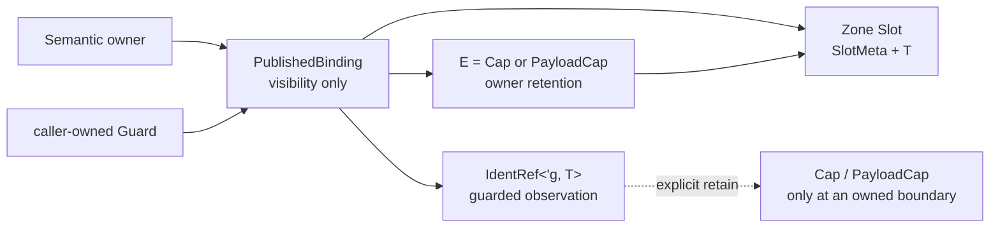

# Identity RCU Slot Design

Date: 2026-07-25
Status: approved implementation contract; Rust implementation not started

## 1. Goal

Remove lock acquisition, intermediate retained-handle cloning, and repeated
`SlotKey -> Slot<T>` resolution from the synchronous identity path while
preserving the existing Zone lifecycle and upper capability language.

The first optimized walk is:

```text
current userspace ThreadIdentity owner
  -> thread payload
  -> owning process
  -> process payload
  -> address space
  -> direct trap syscall
```

The design adds one owner-private single-binding publication primitive over
the existing Zone/EBR substrate. It does not add a public RCU capability, a
second Zone policy, or a second object lifecycle.

## 2. Architectural Decision

The internal "RCU slot" is named `PublishedBinding<T, E>`. `Slot<T>` keeps its
existing meaning: one physical object slot inside a Zone slab.



The layers remain distinct:

| Layer | Type | Responsibility |
|---|---|---|
| Physical storage | `Zone<T> -> ZoneSlab<T> -> Slot<T>` | reserve, sign, four-state lifecycle, generation, delayed reclaim |
| Identity retention | `Cap<T>` | keep identity structurally live |
| Payload retention | `PayloadCap<T>` | keep an independently reclaimable payload live |
| Non-retaining signifier | `Weak<T>` | generation-checked lookup without a lifecycle promise |
| Guarded observation | `IdentRef<'g, T>` | direct slot pointer valid only inside one EBR Guard |
| Single-binding publication | `PublishedBinding<T, E>` | make one current retained target visible to guarded readers |
| Synchronous facade | domain accessors and `DirectTrapContext<'g>` | expose borrowed domain objects, not publication mechanics |
| Yield/storage facade | existing owned `SyscallCtx` and operation structs | carry only explicitly retained evidence across a boundary |

The per-hart entry root and persistent identity bindings deliberately use
different ownership roles:

| Role | Stored evidence | Reader context | First-migration backend |
|---|---|---|---|
| Current userspace owner | `Cap<ThreadIdentity>` | synchronous syscall/fault trap with an owned Guard | one `PublishedBinding` per hart |
| Thread payload attachment | `PayloadCap<ThreadPayload>` | normal guarded observation | `ThreadIdentity.payload` binding |
| Process payload attachment | `PayloadCap<ProcessPayload>` | normal guarded observation | `ProcessIdentity.payload` binding |
| Address-space attachment | `Cap<AddressSpace>` | normal guarded observation | `ProcessPayload.frame.vm` binding |
| Timer-IRQ operational anchor | `PayloadCap<ThreadPayload>` | IRQ context, where a new Guard is forbidden | retain the existing strong lock-backed per-hart anchor |
| Poll-scoped current task | existing `Cap`/`PayloadCap` anchors | reactor/runtime compatibility | retain in the first migration |

Only the first four rows are part of the identity RCU walk. The timer anchor
is not a second payload authority: it is a temporary operational anchor for an
IRQ path that cannot enter EBR. Fresh synchronous identity resolution always
starts from the current userspace `ThreadIdentity` and reaches payload through
that identity.

`Cap<T>`, `PayloadCap<T>`, `Weak<T>`, and `IdentRef<'g, T>` retain their current
public meanings. There is no `RcuCap<T>`, `RcuZone<T>`, `RcuRef<T>`, or public
publication-policy parameter.

## 3. Exact Backend Type

The target source shape is:

```rust,ignore
#[repr(C)]
pub struct PublishedBinding<T: ZoneAllocated, E> {
    // Offset zero. Readers touch this cache line first and do not lock.
    root: AtomicPtr<Slot<T>>,
    // Serializes replace/withdraw and owns the retention evidence.
    writer: SpinMutex<Option<E>>,
    _marker: PhantomData<fn() -> T>,
}
```

Only two concrete method families exist:

```rust,ignore
impl<T: ZoneAllocated> PublishedBinding<T, Cap<T>> { /* public operations */ }
impl<T: ZoneAllocated> PublishedBinding<T, PayloadCap<T>> { /* same operations */ }
```

Shared implementation helpers remain private. There is no public evidence
trait for callers to implement, and there are no replace/observe methods for
`PublishedBinding<T, Weak<T>>` or arbitrary `E`. If code duplication makes a
trait necessary, it must be sealed inside `tx-substrate`; it may expose only a
`SlotKey`, and the two legal implementations remain `Cap<T>` and
`PayloadCap<T>`.

The common owner-facing backend operations are:

```rust,ignore
pub const fn empty() -> Self;
pub fn installed(evidence: E) -> Self;

pub fn observe<'g>(
    &'g self,
    guard: &'g Guard<'_>,
) -> Option<IdentRef<'g, T>>;

pub fn retain(&self, guard: &Guard<'_>) -> Option<E>;
pub fn replace(&self, next: E) -> Option<E>;
pub fn withdraw(&self) -> Option<E>;
pub fn clear_if_key(&self, expected: SlotKey) -> Option<E>;
```

`retain` is a compatibility/owned-boundary helper. It performs `observe`
followed by the existing metadata retain CAS; it does not clone evidence under
the writer lock. Direct synchronous traversal uses `observe`, not `retain`.

## 4. Layout Specification

### 4.1 `PublishedBinding`

The layout contract is normative:

| Property | Contract |
|---|---|
| Representation | `#[repr(C)]` |
| `root` offset | exactly `0` |
| Root representation | one nullable `AtomicPtr<Slot<T>>` |
| Null representation | null pointer; never a sentinel `SlotKey` |
| Writer state | `SpinMutex<Option<E>>` immediately after `root` |
| Evidence values | exactly `Cap<T>` or `PayloadCap<T>` |
| Per-binding retire header | none |
| Read allocation | none |
| Replace/withdraw allocation | none |
| Binding-owned generation | none; generation remains in `SlotMeta` |

For the current compiler and default 64-bit configuration, the expected
ratcheted layout is:

```text
offset 0x00  AtomicPtr<Slot<T>>       8 bytes
offset 0x08  SpinMutex<Option<E>>    12 bytes
offset 0x14  tail padding             4 bytes
size                                  24 bytes
alignment                              8 bytes
```

For the current 32-bit layout the expected size is 16 bytes with 4-byte
alignment. These are implementation ratchets, not a stable external ABI. Tests
must assert `size_of`, `align_of`, and `offset_of!(root/writer)` on supported
pointer widths so a compiler or lock-layout change is reviewed explicitly.

`Cap<T>` remains 4 bytes and `Weak<T>` remains 8 bytes. Since raw
`SlotKey == 0` is valid, `Option<Cap<T>>` is not allowed to gain a fabricated
zero niche. The binding's null state exists only in the pointer field and must
agree with `writer == None`.

The current default lock-backed slot is 12 bytes on 64-bit targets; replacing
one such slot with `PublishedBinding` therefore adds one 8-byte root plus 4
bytes of outer alignment padding, for a 24-byte binding. The one 64-entry
`CURRENT_USERSPACE_OWNER` table grows from 768 bytes to 1536 bytes. The other
three current poll/userspace tables are not converted in the first migration.
`ThreadIdentity.payload`, `ProcessIdentity.payload`, and `Frame.vm` each grow
from the current 12-byte lock/staging slot to a 24-byte binding before
containing-struct padding is considered. These numbers are compile-time
assertions in the implementation phase, not inferred silently from a source
declaration.

### 4.2 `ActiveUserspaceOwner`

The direct-reader marker is also root-first and layout-ratcheted:

```rust,ignore
#[repr(C)]
struct ActiveUserspaceOwner {
    entry_hart: AtomicUsize,
    request: SpinMutex<Option<UserspaceRunRequest>>,
}
```

For the current compiler and 64-bit targets:

```text
offset 0x00  AtomicUsize                              8 bytes
offset 0x08  SpinMutex<Option<UserspaceRunRequest>>  24 bytes
size                                                   32 bytes
alignment                                               8 bytes
```

The current `active_request` lock already occupies the trailing 24 bytes; the
lock-free direct-reader marker adds exactly one pointer-width word. Tests must
assert field offsets, size, and alignment on every supported target rather
than assuming the 64-bit result on a 32-bit ABI. This cell is not an RCU root:
it is stable storage inside `ThreadPayload`, and only its hart marker is read
lock-free.

### 4.3 Existing Zone Slot

The physical Zone slot remains unchanged:

```rust,ignore
#[repr(C)]
pub(crate) struct Slot<T> {
    meta: SlotMeta,                  // AtomicU64
    value: UnsafeCell<MaybeUninit<T>>,
}
```

`SlotMeta` stays at offset zero and retains the current 64-bit word:

```text
bits  0..2   state: Free / Reserved / Live / Retiring
bits  3..4   has_next / generation_exhausted
bits 16..47  Live retain count or Retiring intrusive next SlotKey
bits 48..63  generation
```

For any `T`, `value_offset = align_up(8, align_of::<T>())` and
`slot_size = align_up(value_offset + size_of::<T>(), max(8, align_of::<T>()))`.
Adding publication changes the size of containing entities, and therefore may
change their Zone slab density, but it does not change `Slot<T>` metadata or
reclamation policy. The implementation must snapshot entity size, slot size,
and slots-per-slab before and after for `ThreadIdentity`, `ThreadPayload`,
`ProcessIdentity`, and `ProcessPayload`.

### 4.4 No `RcuHead` Per Binding

`Published<T>` owns separately allocated immutable roots and therefore needs a
private `RcuHead`. `PublishedBinding` points at an already Zone-owned slot. On
replacement, dropping the old owner evidence drives the existing
`Live -> Retiring -> EBR grace -> Free` lifecycle. Adding a second retire node
would duplicate ownership and is forbidden.

## 5. Retention Invariant

Outside a writer critical section:

```text
root == null  <=>  writer evidence is None
root != null  =>   writer evidence retains exactly the pointed-to Slot<T>
```

Inside a writer critical section, the old evidence may be held in a local
variable while `root` still points to the old slot, and the next evidence may
already be in writer state before the root swap. The stronger invariant that
holds at every instruction is therefore:

```text
root != null => the binding operation owns strong evidence for that root
```

Readers cannot inspect writer state. They rely only on this retention
invariant, the root linearization point, and their Guard.

The evidence need not be the only retention. Other Caps may keep an old target
`Live` after replacement. That is allowed: it is no longer current, but it is
still a valid object for readers whose root load linearized before the swap.

The writer must derive `next_ptr` from the strong evidence before moving that
evidence into writer state. A strong evidence value cannot name a Free,
Reserved, or Retiring slot. Writer-side failure to resolve it is an invariant
panic, not a recoverable read miss.

## 6. Reader Algorithm

The caller enters one Guard before the first root load and reuses it across the
complete synchronous walk. `observe` never creates or borrows a hidden Guard.

```rust,ignore
pub fn observe<'g>(
    &'g self,
    guard: &'g Guard<'_>,
) -> Option<IdentRef<'g, T>> {
    let _ = guard;
    loop {
        let first = self.root.load(Ordering::Acquire);
        let Some(slot) = NonNull::new(first) else {
            return None;
        };

        let word = unsafe { slot.as_ref().meta().load(Ordering::Acquire) };
        if word.state() == SlotState::Live {
            return Some(unsafe {
                IdentRef::from_published_slot(slot, word.generation(), guard)
            });
        }

        let second = self.root.load(Ordering::Acquire);
        if second != first {
            continue;
        }

        panic!("PublishedBinding points at a non-Live Zone slot");
    }
}
```

Reader semantics:

1. Guard entry and its SeqCst fence happen before `first`.
2. A null result linearizes at the null Acquire load.
3. A successful result linearizes at the first non-null Acquire load.
4. The metadata Acquire load validates `Live` and captures the generation for
   the returned `IdentRef`.
5. Replacement after `first` does not invalidate the result. The Guard keeps
   the old bytes valid; the read is ordered before the root swap.
6. If final evidence Drop changed the old slot to `Retiring` before metadata
   validation, a changed root causes retry.
7. A still-published non-Live pointer violates the retention invariant and is
   never converted to `None`; silently doing so would hide a writer-order bug.
8. `IdentRef::to_cap()` may later fail if semantic death won the metadata CAS.
   RCU provides memory safety, not revocation immunity.

There is no directory lookup on a successful binding read. Constructing the
current `IdentRef` may reconstruct its compact key from the containing slab for
future `to_cap`, but it does not resolve that key through the registry.

## 7. Writer Algorithms

All writer operations serialize on `writer`. Readers never touch that lock.
Root CAS is unnecessary because writer order is already total.

### 7.1 Replace Or Install

```text
1. Resolve next evidence to next_ptr and require SlotState::Live.
2. Acquire writer lock.
3. Move old evidence to a local variable.
4. Install next evidence in writer state.
5. root.swap(next_ptr, AcqRel).                 <- visibility LP
6. Assert the swapped pointer agrees with old evidence.
7. Release writer lock.
8. Return or drop old evidence.
```

The old evidence remains retained locally until after step 5. The Release half
publishes all initialization and the new evidence-before-pointer order. The
Acquire half supports consistency checking of the old root and keeps one
ordering for replace and withdraw.

### 7.2 Withdraw

```text
1. Acquire writer lock.
2. root.swap(null, AcqRel).                     <- withdrawal LP
3. Take old evidence from writer state.
4. Assert null/evidence and old-pointer/evidence agreement.
5. Release writer lock.
6. Return or drop old evidence.
```

Fresh readers see null after the linearization point. Readers that already
loaded the old pointer remain safe through their Guard. If the returned
evidence is the last retention, its Drop performs the existing Zone retirement
transition and queues the slot in the existing intrusive EBR bag.

### 7.3 Conditional Clear

Remote teardown uses a key-conditional withdrawal:

```text
1. Acquire writer lock.
2. Compare `writer.as_ref().map(E::key)` with `expected`.
3. On mismatch, release and return None without changing root.
4. On match, swap root to null with AcqRel.
5. Take evidence, release, and return it.
```

`SlotKey` comparison is safe here because the matching evidence still retains
the slot. Raw key zero is an ordinary valid key and must be tested explicitly.

### 7.4 Drop

`PublishedBinding::drop` is legal only under exclusive ownership. It clears the
root, takes writer evidence, and drops that evidence. It does not create an EBR
retire record. A binding embedded in a Zone object is dropped only after the
containing object's own EBR grace, so no guarded reader can still be accessing
the binding storage itself. Static per-hart bindings do not drop.

## 8. Memory Ordering Table

| Operation | Ordering | Reason |
|---|---|---|
| Guard epoch publish/fence | existing SeqCst contract | protected root/slot loads cannot float before reader admission |
| Reader root load | Acquire | pairs with install/replace/withdraw publication |
| Reader SlotMeta load | Acquire | observes Zone sign/lifecycle state and generation |
| Writer mutex acquire/release | existing Acquire/Release | serializes evidence/root writers only |
| Root replace/install swap | AcqRel | Release-publishes initialized target; Acquire supports old-root consistency |
| Root withdraw swap | AcqRel | null is the visibility LP before old evidence Drop |
| Final Cap/upgrade metadata CAS | existing AcqRel/Acquire | unchanged Zone retention and no-new-observer rules |
| Exclusive Drop root clear | Relaxed is sufficient | exclusivity is required; no concurrent reader may begin |

No weaker ordering is part of the first migration. Any later relaxation needs
a separate proof covering sign publication, writer evidence, final Drop,
epoch advance, and exact retain-count readers.

## 9. Concrete Type Transformation

The first migration introduces these private aliases or equivalent field
types:

```rust,ignore
type CurrentUserspaceOwnerBinding =
    PublishedBinding<ThreadIdentity, Cap<ThreadIdentity>>;
type ThreadPayloadBinding =
    PublishedBinding<ThreadPayload, PayloadCap<ThreadPayload>>;
type ProcessPayloadBinding =
    PublishedBinding<ProcessPayload, PayloadCap<ProcessPayload>>;
type AddressSpaceBinding =
    PublishedBinding<AddressSpace, Cap<AddressSpace>>;
```

The concrete layouts become:

```rust,ignore
struct CurrentUserspaceOwnerTable {
    slots: [CurrentUserspaceOwnerBinding; MAX_THREAD_PAYLOAD_HARTS],
}

struct CurrentUserspacePayloadAnchors {
    // IRQ-safe compatibility anchor. Not read through RCU in this phase.
    slots: [SpinMutex<Option<PayloadCap<ThreadPayload>>>;
        MAX_THREAD_PAYLOAD_HARTS],
}

#[repr(C)]
struct ActiveUserspaceOwner {
    // Lock-free commit marker for the synchronous direct resolver.
    // usize::MAX means inactive.
    entry_hart: AtomicUsize,
    // Writer serialization plus the exact token required by IRQ handoff and
    // stale-ticket rejection. Direct readers never acquire this lock.
    request: SpinMutex<Option<UserspaceRunRequest>>,
}

#[derive(Clone, Copy, Debug, Eq, PartialEq)]
struct UserspaceOwnerTicket {
    entry_hart: usize,
    request: UserspaceRunRequest,
    thread_key: SlotKey,
    payload_key: SlotKey,
}

pub struct ThreadIdentity {
    pub tid: Tid,
    owner_proc: Weak<ProcessIdentity>, // deliberately unchanged
    exit_status: SpinMutex<Option<i32>>,
    payload: ThreadPayloadBinding,
}

pub struct ThreadPayload {
    // Existing payload fields remain. The current active_request slot becomes
    // a split owner cell: lock-free hart validation for direct readers and a
    // writer/request lock for IRQ handoff plus exact cleanup.
    active_owner: ActiveUserspaceOwner,
}

pub struct ProcessIdentity {
    // pid, parent, children, pgrp, exit state unchanged
    payload: ProcessPayloadBinding,
}

pub struct ProcessPayload {
    frame: Frame,
    // remaining mutable payload fields unchanged
}

pub struct Frame {
    vm: AddressSpaceBinding,
    sig_actions: Arc<SigActionTable>,
}
```

`ThreadIdentity.owner_proc` must remain `Weak<ProcessIdentity>` in this phase.
`ProcessPayload.threads` retains `Cap<ThreadIdentity>`; replacing the reverse
edge with `Cap<ProcessIdentity>` would create a permanent strong cycle:

```text
ProcessIdentity -> PayloadCap<ProcessPayload>
ProcessPayload  -> Cap<ThreadIdentity>
ThreadIdentity  -X-> Cap<ProcessIdentity>
```

The guarded fast path uses `owner_proc.observe(&guard)`. An optional per-hart
published process binding may be evaluated after the first measurements if
this one remaining fixed-depth Weak lookup is material; it must not alter the
persistent ownership graph.

The current userspace owner is an execution root, not another persistent graph
edge. Its writer evidence keeps `ThreadIdentity` addressable only while that
hart advertises the userspace run. It never retains `ProcessIdentity`; the
reverse process edge therefore remains weak.

## 10. Guard-Scoped Direct Context

The target synchronous context is borrowed:

```rust,ignore
pub struct DirectTrapContext<'g> {
    pub thread: IdentRef<'g, ThreadIdentity>,
    pub process: IdentRef<'g, ProcessIdentity>,
    pub thread_payload: IdentRef<'g, ThreadPayload>,
    pub process_payload: IdentRef<'g, ProcessPayload>,
    pub aspace: IdentRef<'g, AddressSpace>,
}
```

Resolution uses one Guard:

```text
guard()
  -> current-userspace owner observe
  -> thread.payload observe
  -> active_owner.entry_hart Acquire validation
  -> thread.owner_proc Weak::observe
  -> process.payload observe
  -> process_payload.frame.vm observe
  -> DirectTrapContext<'g>
  -> synchronous direct dispatch
  -> drop context
  -> drop Guard
```

The direct dispatcher and the helpers it calls accept borrowed domain objects
(`&ThreadIdentity`, `&ThreadPayload`, `&ProcessIdentity`,
`&ProcessPayload`, `&AddressSpace`) or `&DirectTrapContext`; they do not clone
Caps merely to populate `SyscallCtx`.

Boundary rules:

| Path result | Required action before Guard Drop |
|---|---|
| Pure scalar/query result | no retain |
| Synchronous user copy completed before return | no retain |
| Operation will `.await` or yield | retain only the objects stored by the operation |
| Mailbox/fanout post stores a target | retain the target required by that API |
| Continuation/work queue stores context | construct the existing owned `SyscallCtx` or a narrower owned op context |
| Fallback to normal reactor dispatch | drop guarded context; normal thread future rebuilds owned context |

An `IdentRef`, `Guard`, or `DirectTrapContext` cannot be stored in a future,
sent to another CPU, returned with an unconstrained lifetime, or kept across
`enter_userspace`, `.await`, `drive`, mailbox fanout, or a continuation.

## 11. Per-Hart Ownership And Trap-Class Split

The first migration rejects a separately published identity/payload pair.
Synchronous direct readers observe one current userspace owner root and derive
the payload through `ThreadIdentity.payload`. The timer path retains a separate
strong payload anchor only because timer/external/IPI handling is IRQ context
and the current epoch contract forbids creating an owned Guard there.

Entry uses the exact kernel-private `ActiveUserspaceOwner` and
`UserspaceOwnerTicket` shapes from section 9. `UserspaceRunRequest` is the
revision. `ThreadPayload.active_owner.entry_hart` is the lock-free synchronous
commit marker; its request lock is used only by writers, IRQ/fallback handoff,
and cleanup. The ticket is the owned cleanup receipt carried across the
userspace wait. `CURRENT_USERSPACE_THREAD_IDENTITY` is renamed to
`CURRENT_USERSPACE_OWNER`; the old name must not survive as a second table.

The owner-transition functions are private to ThreadRuntime:

```rust,ignore
fn begin_userspace_owner(
    thread: &Cap<ThreadIdentity>,
    payload: &PayloadCap<ThreadPayload>,
    entry_hart: usize,
    request: UserspaceRunRequest,
) -> UserspaceOwnerTicket;

fn finish_userspace_owner(
    payload: &ThreadPayload,
    ticket: UserspaceOwnerTicket,
) -> bool;
```

`begin` and `finish` hold `active_owner.request` only across bounded atomic/
per-hart slot updates. They never call a domain callback, allocate, wait, or
enter userspace while holding it. The protocol is normative:

```text
lock active_owner.request
require request == None and entry_hart == inactive
request = Some(ticket.request)
install IRQ payload anchor by payload key
entry_hart.store(ticket.entry_hart, Release)
publish CURRENT_USERSPACE_OWNER by thread key   <- synchronous-reader commit LP
unlock active_owner.request
enter userspace
```

Normal terminal trap cleanup uses the hart stored in the ticket, not the hart
on which the future later resumes:

```text
lock active_owner.request
request or entry_hart mismatch           -> unlock, stale ticket, no mutation
clear current owner if thread key matches
entry_hart.store(inactive, Release)
clear IRQ payload anchor if payload key matches
request = None
unlock active_owner.request
```

The synchronous direct resolver requires only an Acquire load of
`payload.active_owner.entry_hart` equal to the trapping hart; it never locks
the request cell. Timer/fallback handoff first retains the IRQ payload anchor,
then locks the request cell and requires both the same hart and a present
request. A stale root or payload anchor left on an old hart therefore degrades
to fallback even if the same thread has already started a new request on
another hart.

The request lock serializes two successive requests belonging to the same
`ThreadPayload`; the per-hart key-conditional clears protect a different
thread taking over the same hart. `PublishedBinding::clear_if_key` does not
claim to compare request revisions. Revision rejection belongs to
`finish_userspace_owner`, which compares the ticket before touching either
per-hart cell. This distinction is required for a stale ticket from request N
to leave request N+1 untouched even though both requests have the same thread
and payload keys.

Timer preemption keeps the ticket and both anchors installed until the owner
future consumes the preemption. Before every re-entry, including re-entry on
the same hart, the future finishes the old ticket and begins a new ticket for
the new request. `begin` therefore accepts only the inactive state; it never
overwrites a live request. Remote exit/teardown is withdraw-only and uses the
same request-plus-key checked finish protocol; it cannot install a new owner.
After `ThreadIdentity.payload` withdraws, a stale identity root can no longer
produce operational payload evidence.

The synchronous syscall/fault path may create the one owned Guard only where
the platform classifies the trap as a synchronous exception. Timer, external,
and IPI handlers must not call `guard()` or `PublishedBinding::observe`. They
continue through the strong payload anchor until an independently designed
IRQ-safe read-side primitive exists.

The poll-scoped `CURRENT_THREAD_*` tables are not converted in this migration.
Their set/clear operations run around every `Future::poll`, while production
trap ownership is the userspace-roundtrip root. They may be removed or
ownerified later, but they are not evidence that the identity RCU chain needs
four published tables.

## 12. Safety Argument

The design depends on six explicit claims:

1. **Published target liveness.** Non-null root always has owner evidence, so
   the slot cannot become Free while it remains current.
2. **Reader admission before observation.** The Guard is active before the
   root load, so a later final Drop cannot reclaim the observed slot until the
   reader quiesces.
3. **No physical ABA inside a Guard.** Reclaim and generation increment happen
   only after all earlier Guards quiesce, so the same address cannot be reused
   during the observation window.
4. **Visibility before release.** Install puts evidence in writer state before
   the Release root swap; withdrawal publishes null before dropping evidence.
5. **Semantic death remains separate.** A Guard protects bytes. Operations
   still revalidate zombie, revision, active-request, signal, exec, or other
   domain state where the existing semantics require it.
6. **Trap classes remain separated.** Synchronous exceptions may enter EBR;
   IRQ handlers use the retained payload anchor and never manufacture a Guard.

The implementation is not accepted until each claim has an executable race or
compile-fail witness.

## 13. Non-Goals And Deferred Work

- Do not change `Cap<T>` from its 4-byte `SlotKey` representation in this
  migration. Pointer-backed Cap remains a later A/B experiment.
- Do not remove generation from `Weak<T>` or `IdentRef`.
- Do not fuse `Weak::upgrade` until the binding pilot is measured separately.
- Do not migrate queues, signal pending state, futex waits, range locks,
  completions, or other state machines to this primitive.
- Do not use `PublishedBinding` for immutable container roots; `Published<T>`
  remains that family.
- Do not migrate the poll-scoped current-task tables in the first identity
  patch.
- Do not use a published binding from timer, external, or IPI IRQ context.
- Do not publish a second current `ThreadPayload` root for synchronous readers;
  they must reach payload through `ThreadIdentity.payload`.
- Do not treat EBR as semantic revocation or operation authorization.
- Do not expose raw `Slot<T>` pointers or publication types through shims,
  syscall contexts, subsystem traits, or domain return values.

## 14. Acceptance Contract

The design is implemented only when all of the following are true:

- successful `observe` has one root Acquire load, one metadata Acquire load,
  no lock, no allocation, no registry resolution, and no retain RMW;
- replace and withdraw allocate nothing and publish before old evidence Drop;
- the public retained types remain exactly `Cap<T>` and `PayloadCap<T>`;
- the direct identity resolver uses one owned Guard and zero intermediate
  retains;
- normal/yielding `SyscallCtx` remains owned and semantically unchanged;
- raw key zero, generation reuse, reader-before-final-drop, old-target retained
  elsewhere, replace/withdraw races, and writer serialization are tested;
- per-hart owner-ticket migration, conditional old-hart cleanup, synchronous
  exception versus IRQ separation, same-hart preempt finish/begin, and a
  four-hart grace-period witness pass;
- entity layout and slab-density changes are recorded, not hidden;
- final performance runs use identical guest, rustc, project, CPU count, image,
  and tracing configuration on both sides of the A/B.
